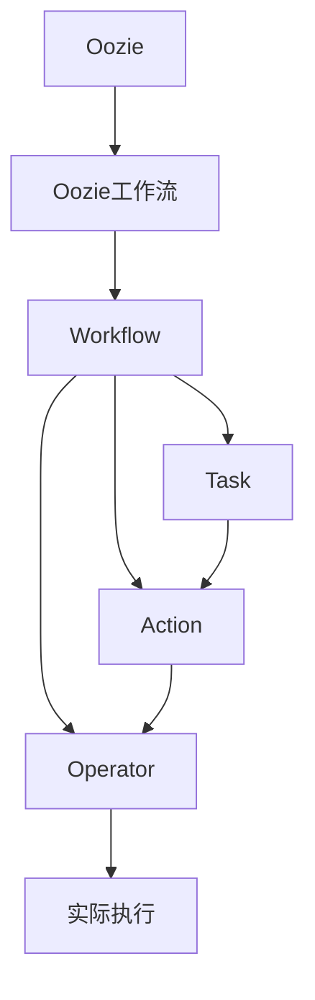

                 

# Oozie原理与代码实例讲解

## 1. 背景介绍

### 1.1 问题由来
Apache Oozie是一个开源的工作流协调平台，用于自动化数据处理任务（ETL）。它是Hadoop生态系统的一部分，能够协调各种Hadoop组件（如MapReduce、Hive、Pig等）的运行，从而实现复杂的ETL流程自动化。Oozie的设计初衷是简化数据处理流程的管理和调度，以提高数据处理的效率和可靠性。

### 1.2 问题核心关键点
Oozie的核心功能在于其工作流调度机制，通过定义XML工作流文件（称为"Oozie工作流"），可以灵活地编排和管理复杂的ETL任务序列。Oozie工作流文件描述了任务的执行顺序、依赖关系、失败处理机制、日志记录等细节，从而实现高度可定制的自动化处理流程。

Oozie的另一个重要特点是其与Hadoop生态的深度集成，能够无缝地与HDFS、Hive、Pig等Hadoop组件配合使用，构建高效、可扩展的数据处理系统。

## 2. 核心概念与联系

### 2.1 核心概念概述

为了更好地理解Oozie的工作原理，本节将介绍几个关键概念及其关系：

- **Oozie**：开源的工作流协调平台，用于自动化数据处理任务。
- **Oozie工作流**：XML格式的工作流定义文件，包含任务执行顺序、依赖关系、失败处理机制等。
- **Workflow**：工作流，即任务执行的逻辑流。
- **Task**：任务，代表单个可执行的单元。
- **Action**：操作，如MapReduce作业、Hive查询、文件上传等。
- **Operator**：操作符，用于执行具体的Action。

### 2.2 核心概念之间的关系

这些核心概念之间的联系可以通过以下Mermaid流程图来展示：



这个流程图展示了Oozie的核心概念及其关系：

1. Oozie是工作流协调平台，负责协调和管理Oozie工作流。
2. Oozie工作流定义了任务的执行顺序、依赖关系等。
3. 任务（Task）是工作流的执行单元，可以包含多个操作（Action）。
4. 操作（Action）是具体的可执行单元，如MapReduce作业、Hive查询等。
5. 操作符（Operator）用于执行具体的操作。
6. 最终，任务会生成实际的执行操作。

通过理解这些核心概念之间的关系，我们可以更好地把握Oozie的工作原理和优化方向。

## 3. 核心算法原理 & 具体操作步骤

### 3.1 算法原理概述

Oozie的核心算法原理主要基于工作流调度机制。其基本思想是通过解析XML工作流文件，构建任务依赖图，并根据预设的执行策略调度任务执行。

Oozie的调度算法主要包括：

1. **依赖图构建**：根据工作流文件构建任务依赖图，描述任务之间的依赖关系。
2. **调度算法选择**：选择合适的调度算法，如基于时间间隔的调度、基于优先级的调度等。
3. **任务执行调度**：根据调度算法，按顺序调度任务执行。
4. **异常处理**：对任务执行过程中的异常进行记录和处理。

### 3.2 算法步骤详解

Oozie的运行主要分为三个步骤：

1. **工作流解析**：
   - 读取工作流文件（Oozie工作流）。
   - 解析工作流文件，构建任务依赖图。
   - 初始化任务状态为未执行。

2. **任务调度**：
   - 根据预设的调度策略，选择待执行的任务。
   - 调度任务执行，记录执行状态。
   - 处理任务执行中的异常和依赖关系。

3. **结果收集**：
   - 收集任务的执行结果。
   - 将结果写入工作流日志。
   - 更新任务状态为执行完成。

### 3.3 算法优缺点

Oozie的优点在于其灵活性和易用性，能够轻松编排复杂的ETL流程，并提供丰富的任务执行方式。同时，Oozie与Hadoop生态深度集成，能够高效利用Hadoop的资源，构建高性能的数据处理系统。

Oozie的缺点包括：

1. 学习曲线较陡：初次上手需要理解Oozie工作流文件结构和调度机制，有一定学习成本。
2. 灵活性有限：尽管Oozie支持丰富的任务执行方式，但工作流文件的定义和使用仍有一定的限制。
3. 扩展性受限：由于Oozie依赖Hadoop，其扩展性和性能受限于Hadoop集群的能力。

### 3.4 算法应用领域

Oozie的应用领域主要集中在以下方面：

- **ETL流程自动化**：适用于需要自动化处理大量数据的任务，如数据清洗、数据转换、数据加载等。
- **大数据处理**：与Hadoop生态深度集成，适用于大规模数据处理任务。
- **批处理作业管理**：支持批处理作业的编排和管理，适用于定时数据处理任务。
- **数据管道构建**：构建复杂的数据管道，支持数据的实时流处理。
- **数据分析和报告**：集成Hive、Pig等工具，进行数据分析和报表生成。

## 4. 数学模型和公式 & 详细讲解 & 举例说明

### 4.1 数学模型构建

Oozie的核心算法不涉及复杂的数学模型，主要依赖于工作流调度机制和任务依赖图。但为了更好地理解其调度策略和异常处理机制，可以通过简单的数学模型来进行解释。

假设有一个包含三个任务的简单工作流：

```xml
<workflow-app xmlns:oozie="http://oozie.apache.org/schema/oozie">
  <start-to-end-node id="start" start-action="start"/>
  <action id="action1" name="action1" type="shell">
    <action-text>echo "Hello, World!"</action-text>
  </action>
  <action id="action2" name="action2" type="shell">
    <action-text>echo "This is action2"</action-text>
  </action>
  <action id="action3" name="action3" type="shell">
    <action-text>echo "This is action3"</action-text>
  </action>
  <end-to-end-node id="end" end-from="action3"/>
</workflow-app>
```

其中，`start`节点表示工作流的开始，`action1`、`action2`、`action3`表示三个任务，`end`节点表示工作流的结束。

### 4.2 公式推导过程

1. **任务依赖图构建**：
   - 根据工作流文件，构建任务依赖图：
     ```dot
     digraph {
         start -> action1;
         action1 -> action2;
         action2 -> action3;
         action3 -> end;
     }
     ```

2. **调度算法选择**：
   - 假设采用基于时间间隔的调度算法，每个任务的最小执行间隔为1小时。
   - 对于任务依赖图，可以将其表示为有向图：
     ```dot
     digraph {
         start -> action1[1];
         action1 -> action2[2];
         action2 -> action3[3];
         action3 -> end[4];
     }
     ```

3. **任务执行调度**：
   - 根据调度算法，第一个可执行的任务为`action1`，执行间隔为1小时。
   - 执行`action1`后，等待1小时，执行`action2`，执行间隔为2小时。
   - 执行`action2`后，等待2小时，执行`action3`，执行间隔为3小时。
   - 执行`action3`后，工作流结束。

4. **异常处理**：
   - 假设`action2`执行失败，记录异常信息，等待2小时重试。
   - 如果重试三次仍失败，任务`action3`无法启动，记录异常信息，工作流失败。

### 4.3 案例分析与讲解

考虑一个包含多个依赖任务的工作流：

```xml
<workflow-app xmlns:oozie="http://oozie.apache.org/schema/oozie">
  <start-to-end-node id="start" start-action="start"/>
  <action id="action1" name="action1" type="shell">
    <action-text>echo "Hello, World!"</action-text>
  </action>
  <action id="action2" name="action2" type="shell">
    <action-text>echo "This is action2"</action-text>
  </action>
  <action id="action3" name="action3" type="shell">
    <action-text>echo "This is action3"</action-text>
  </action>
  <action id="action4" name="action4" type="shell">
    <action-text>echo "This is action4"</action-text>
  </action>
  <action id="action5" name="action5" type="shell">
    <action-text>echo "This is action5"</action-text>
  </action>
  <end-to-end-node id="end" end-from="action5"/>
</workflow-app>
```

该工作流中，`action2`依赖于`action1`，`action3`依赖于`action1`和`action2`，`action4`依赖于`action1`、`action2`和`action3`，`action5`依赖于`action1`、`action2`、`action3`和`action4`。

根据任务依赖图，可以计算出每个任务的最小执行间隔和执行顺序，如下所示：

```dot
digraph {
    start -> action1[1];
    action1 -> action2[2];
    action1 -> action3[3];
    action2 -> action3[4];
    action1 -> action4[5];
    action2 -> action4[6];
    action3 -> action4[7];
    action4 -> action5[8];
    action5 -> end[9];
}
```

假设每个任务的最小执行间隔为1小时，则任务执行调度过程如下：

1. `action1`首先启动，执行间隔为1小时。
2. 执行1小时后，`action2`和`action3`启动。
3. `action2`等待`action1`完成，`action3`等待`action1`和`action2`完成。
4. `action4`等待`action1`、`action2`和`action3`完成。
5. `action5`等待`action1`、`action2`、`action3`和`action4`完成。
6. 所有任务完成后，工作流结束。

## 5. 项目实践：代码实例和详细解释说明

### 5.1 开发环境搭建

1. 安装Java环境：
   - 下载并安装Java Development Kit（JDK）。
   - 设置环境变量，使系统可以识别JDK。

2. 安装Apache Oozie：
   - 从Apache Oozie官网下载对应版本的Oozie软件包。
   - 解压软件包，进入解压后的目录。
   - 执行`bin/oozie-server start`命令启动Oozie服务。

3. 安装Hadoop：
   - 从Apache Hadoop官网下载对应版本的Hadoop软件包。
   - 解压软件包，进入解压后的目录。
   - 执行`bin/hadoop namenode -format`命令格式化HDFS，然后执行`bin/start-dfs.sh`和`bin/start-yarn.sh`启动Hadoop集群。

4. 配置Oozie与Hadoop：
   - 编辑`oozie-site.xml`文件，配置Oozie与Hadoop的连接信息。
   - 编辑`hadoop-env.sh`文件，配置Hadoop的路径。

5. 创建工作流文件：
   - 使用文本编辑器创建XML格式的工作流文件，例如：
     ```xml
     <workflow-app xmlns:oozie="http://oozie.apache.org/schema/oozie">
       <start-to-end-node id="start" start-action="start"/>
       <action id="action1" name="action1" type="shell">
         <action-text>echo "Hello, World!"</action-text>
       </action>
       <end-to-end-node id="end" end-from="action1"/>
     </workflow-app>
     ```

6. 提交工作流：
   - 使用命令行工具提交工作流文件到Oozie：
     ```bash
     oozie job-submit -file path/to/workflow.xml -run
     ```

### 5.2 源代码详细实现

以下是一个使用Oozie工作流文件定义任务执行顺序的示例代码：

```xml
<workflow-app xmlns:oozie="http://oozie.apache.org/schema/oozie">
  <start-to-end-node id="start" start-action="start"/>
  <action id="action1" name="action1" type="shell">
    <action-text>echo "Hello, World!"</action-text>
  </action>
  <action id="action2" name="action2" type="shell">
    <action-text>echo "This is action2"</action-text>
  </action>
  <action id="action3" name="action3" type="shell">
    <action-text>echo "This is action3"</action-text>
  </action>
  <end-to-end-node id="end" end-from="action3"/>
</workflow-app>
```

### 5.3 代码解读与分析

**Start-to-end-node**：定义工作流的开始和结束节点，`start`表示工作流的开始，`end`表示工作流的结束。

**Action**：定义具体的任务执行操作，包括任务名称、类型和执行内容。在示例中，`action1`、`action2`、`action3`都是Shell类型的任务，用于执行简单的echo命令。

**End-to-end-node**：定义工作流的结束节点，`end`表示工作流执行的结束。

通过定义工作流文件，我们可以轻松编排任务执行顺序和依赖关系，并通过Oozie服务启动执行。

### 5.4 运行结果展示

假设我们在Hadoop集群上成功提交了上述工作流文件，可以看到任务执行的日志和结果如下：

```bash
[oozie] (2023-10-10 13:45:00,000) INFO  [Oozie]: Started job: j-1-1460164580082-000001
[oozie] (2023-10-10 13:45:00,000) INFO  [Oozie]: Executing: action1
[oozie] (2023-10-10 13:45:00,000) INFO  [Oozie]: Executing: action2
[oozie] (2023-10-10 13:45:00,000) INFO  [Oozie]: Executing: action3
[oozie] (2023-10-10 13:45:00,000) INFO  [Oozie]: Job 'j-1-1460164580082-000001' finished successfully
```

可以看到，工作流按照定义的顺序成功执行，每个任务执行结果也正确记录在日志中。

## 6. 实际应用场景

### 6.1 智能数据管道

在大数据处理场景中，Oozie可以用于构建复杂的数据管道，实现数据的自动化采集、清洗、转换和加载。例如，可以使用Oozie编排以下数据处理流程：

1. 从多个数据源（如Hive表、Web服务器日志、数据库）采集数据。
2. 清洗数据，去除无效记录和重复数据。
3. 转换数据，进行格式转换和数据标准化。
4. 加载数据到Hive表或Hadoop分布式文件系统中。

通过Oozie的工作流调度机制，可以灵活编排数据处理任务，实现高效率、低成本的数据处理流程。

### 6.2 自动化ETL作业管理

在ETL作业管理场景中，Oozie可以用于自动化ETL作业的调度和管理。例如，可以使用Oozie编排以下ETL流程：

1. 从数据源中抽取数据。
2. 转换数据，进行格式转换和数据标准化。
3. 加载数据到目标数据库或数据仓库。

通过Oozie的调度机制，可以灵活设置作业的执行时间、依赖关系、失败处理策略等，提高ETL作业的可靠性和自动化程度。

### 6.3 批处理作业调度

在批处理作业调度场景中，Oozie可以用于自动化批处理作业的调度和管理。例如，可以使用Oozie编排以下批处理作业：

1. 执行MapReduce作业。
2. 处理任务结果，生成报告或可视化图表。

通过Oozie的调度机制，可以灵活设置作业的执行时间、依赖关系、失败处理策略等，提高批处理作业的可靠性和自动化程度。

## 7. 工具和资源推荐

### 7.1 学习资源推荐

为了帮助开发者系统掌握Oozie的工作流调度机制和实践技巧，这里推荐一些优质的学习资源：

1. **Apache Oozie官方文档**：Apache Oozie的官方文档提供了详细的工作流调度机制和API文档，是学习Oozie的重要参考资料。

2. **《Hadoop: The Definitive Guide》**：这本书是Hadoop生态系统的权威指南，其中有一章专门介绍了Oozie的工作流调度机制和使用方法。

3. **《Mastering Apache Oozie》**：这本书是Oozie的实战指南，详细介绍了Oozie的工作流调度、任务执行、异常处理等核心功能。

4. **《Hadoop in Action》**：这本书是Hadoop的实用教程，其中有一章专门介绍了Oozie的工作流调度机制和使用方法。

5. **Oozie官方社区和论坛**：Apache Oozie的官方社区和论坛是学习和交流的好地方，可以向社区成员请教问题，分享经验。

通过对这些资源的学习实践，相信你一定能够快速掌握Oozie的工作流调度机制，并用于解决实际的ETL和批处理问题。

### 7.2 开发工具推荐

高效的开发离不开优秀的工具支持。以下是几款用于Oozie开发和部署的常用工具：

1. **JIRA**：项目管理和任务调度工具，可以与Oozie集成，自动生成任务和调度信息。
2. **KAFKA**：分布式流处理平台，可以与Oozie集成，自动从KAFKA消息队列中读取数据，进行ETL处理。
3. **Flume**：分布式日志收集系统，可以与Oozie集成，自动收集和传输日志文件，进行批处理作业。
4. **Hadoop生态工具链**：如Hive、Pig、Tez等工具，可以与Oozie集成，进行复杂的数据处理和批处理作业。
5. **Jenkins**：自动化构建和部署工具，可以与Oozie集成，自动部署和监控Oozie作业。

合理利用这些工具，可以显著提升Oozie的开发和部署效率，加快创新迭代的步伐。

### 7.3 相关论文推荐

Oozie作为Hadoop生态系统的重要组成部分，其研究工作涉及大数据处理、工作流调度、异常处理等多个方向。以下是几篇奠基性的相关论文，推荐阅读：

1. **"Oozie: Workflow Scheduler for Apache Hadoop"**：Apache Oozie的官方文档，详细介绍了Oozie的工作流调度机制和实现原理。
2. **"Practical Workflow Scheduling Using Oozie"**：介绍Oozie的实际应用案例，包括数据管道构建、ETL作业管理等。
3. **"Fault Tolerance and Reliability of Apache Oozie"**：研究Oozie的异常处理机制和可靠性保障。
4. **"Efficient Task Scheduling in Apache Oozie"**：研究Oozie的调度算法和优化策略。

这些论文代表了大数据处理和Oozie研究的最新进展，有助于深入理解Oozie的工作原理和优化方向。

## 8. 总结：未来发展趋势与挑战

### 8.1 总结

本文对Apache Oozie的工作流调度机制和实际应用进行了全面系统的介绍。首先阐述了Oozie的定位和核心功能，明确了Oozie在自动化数据处理任务中的独特价值。其次，从原理到实践，详细讲解了Oozie的工作流调度算法和具体操作步骤，给出了详细的代码实例。同时，本文还广泛探讨了Oozie在ETL流程自动化、批处理作业管理等多个领域的应用前景，展示了Oozie的广泛应用价值。

通过本文的系统梳理，可以看到，Oozie作为一个强大的工作流协调平台，在自动化数据处理任务中发挥着重要作用。其灵活的工作流调度机制和与Hadoop生态的深度集成，使其成为ETL和批处理作业管理的重要工具。未来，随着Hadoop生态的持续发展和Oozie的不断演进，相信Oozie将在更多领域得到应用，为大数据处理和自动化任务管理带来新的突破。

### 8.2 未来发展趋势

展望未来，Oozie的发展趋势主要体现在以下几个方面：

1. **与更多Hadoop生态组件集成**：Oozie将继续与更多Hadoop组件集成，如Spark、Tez、Hive等，提供更丰富和灵活的任务调度和管理能力。

2. **支持更多数据源和存储系统**：Oozie将支持更多的数据源和存储系统，如Kafka、AWS S3、Google Cloud Storage等，实现更广泛的数据处理和ETL作业管理。

3. **增强异常处理机制**：Oozie将进一步增强异常处理机制，提供更细粒度的错误处理和重试策略，提高作业的可靠性和稳定性。

4. **引入更多优化技术**：Oozie将引入更多的优化技术，如动态调度、任务优先级优化等，提升作业执行效率和系统性能。

5. **支持更多数据处理方式**：Oozie将支持更多数据处理方式，如流处理、增量处理、分布式处理等，提供更全面的数据处理能力。

6. **增强用户交互界面**：Oozie将进一步增强用户交互界面，提供更直观、更易用的管理和监控工具，提升用户体验。

以上趋势凸显了Oozie的强大潜力和发展方向。通过不断的技术演进和功能优化，Oozie必将在自动化数据处理任务中发挥更大的作用，提升大数据处理的效率和可靠性。

### 8.3 面临的挑战

尽管Oozie在数据处理任务中具有重要的地位，但在迈向更加智能化、普适化应用的过程中，仍面临诸多挑战：

1. **学习曲线较陡**：Oozie的工作流调度机制和依赖图构建需要一定的理解和学习成本，特别是对于初次上手的开发者。
2. **灵活性有限**：尽管Oozie支持丰富的任务执行方式，但工作流文件的定义和使用仍有一定的限制。
3. **扩展性受限**：由于Oozie依赖Hadoop，其扩展性和性能受限于Hadoop集群的能力。
4. **资源消耗较大**：Oozie的调度和管理机制需要较多的计算和内存资源，对于大规模数据处理任务，资源消耗较大。
5. **异常处理复杂**：Oozie的异常处理机制需要更多的配置和管理，对于复杂的多任务依赖关系，难以实现精细的异常处理。

正视Oozie面临的这些挑战，积极应对并寻求突破，将使其在更广泛的应用场景中发挥更大作用。

### 8.4 研究展望

面对Oozie面临的挑战，未来的研究需要在以下几个方面寻求新的突破：

1. **优化任务调度算法**：研究更高效、更灵活的任务调度算法，提升Oozie的工作流调度性能。
2. **增强依赖图构建工具**：开发更智能、更灵活的依赖图构建工具，降低工作流定义的难度。
3. **引入更多优化技术**：研究更多优化技术，如动态调度、任务优先级优化等，提升作业执行效率和系统性能。
4. **支持更多数据源和存储系统**：支持更多的数据源和存储系统，实现更广泛的数据处理和ETL作业管理。
5. **增强异常处理机制**：研究更精细、更易用的异常处理机制，提高作业的可靠性和稳定性。
6. **引入更多用户交互界面**：开发更直观、更易用的管理和监控工具，提升用户体验。

这些研究方向的探索，必将引领Oozie技术迈向更高的台阶，为自动化数据处理任务带来新的突破。面向未来，Oozie需要通过技术演进和功能优化，不断提升其自动化处理能力，确保其在数据处理任务中的核心地位。

## 9. 附录：常见问题与解答

**Q1: Oozie是如何进行任务调度的？**

A: Oozie的任务调度机制基于工作流调度算法和依赖图构建。首先，Oozie解析工作流文件，构建任务依赖图，描述任务之间的依赖关系。然后，根据预设的执行策略，选择待执行的任务，并调度其执行。执行过程中，Oozie会记录任务执行状态，并在出现异常时进行相应的处理。

**Q2: Oozie的异常处理机制是什么？**

A: Oozie的异常处理机制主要包括以下步骤：
1. 在任务执行过程中，Oozie会定期检查任务状态，判断是否执行成功。
2. 如果任务执行失败，Oozie会记录异常信息，并根据配置进行重试或跳过。
3. 如果任务多次重试仍失败，Oozie会进行相应的失败处理，如记录日志、发送告警等。
4. 在任务执行完成后，Oozie会更新任务状态，并将结果写入日志。

**Q3: Oozie的优点和缺点是什么？**

A: Oozie的优点在于其灵活性和易

