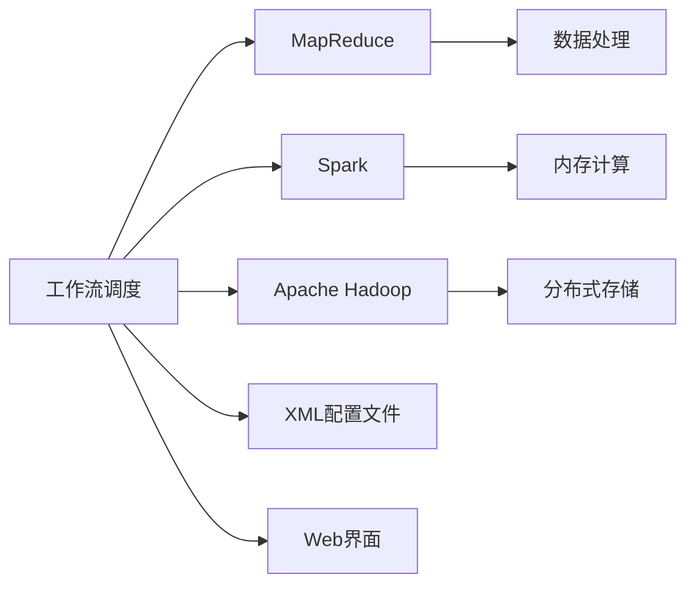
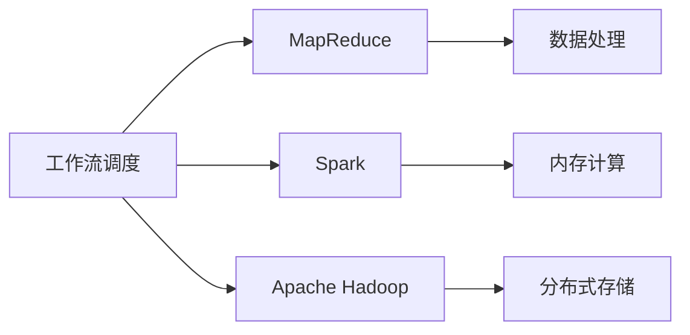
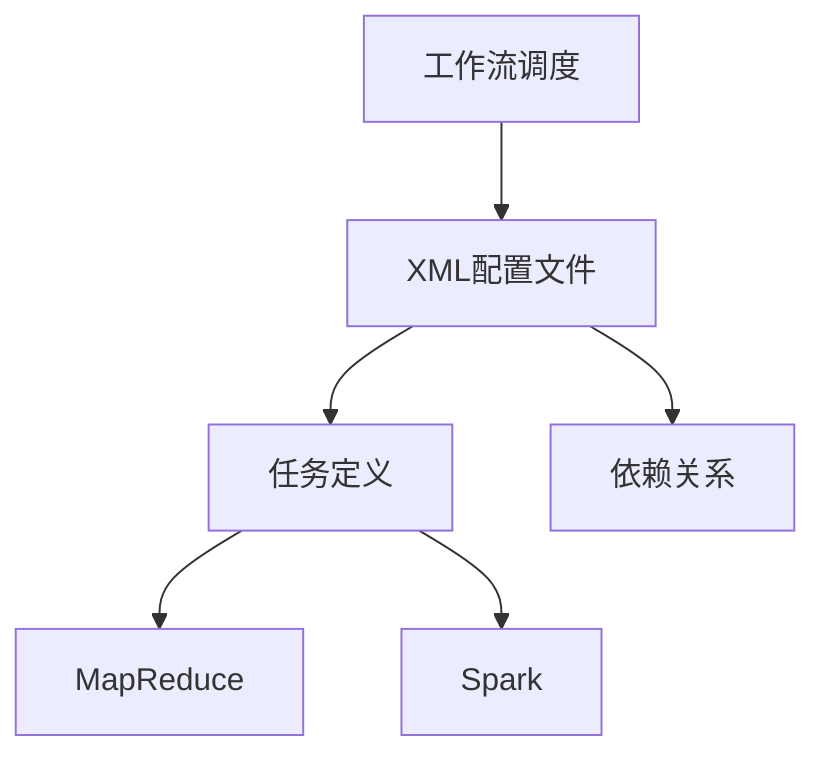
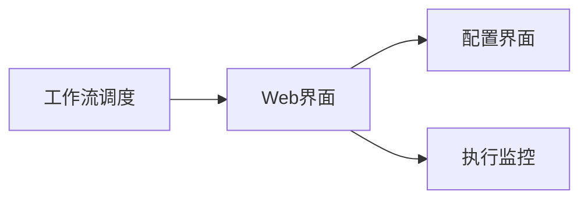
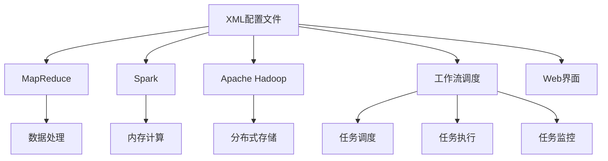

                 

# Oozie工作流调度原理与代码实例讲解

> 关键词：Oozie,工作流调度,大数据,MapReduce,Spark,机器学习

## 1. 背景介绍

### 1.1 问题由来
随着大数据时代的到来，企业对于海量数据处理的需求日益增长。传统的数据处理方式难以满足这种需求，因此，分布式计算框架应运而生，如Apache Hadoop、Apache Spark等。这些框架通过并行计算的方式，实现了对大规模数据的高效处理。然而，在分布式计算环境中，协调和管理多个计算节点的任务，成为一项复杂的任务。

针对这一问题，Apache Oozie应运而生。Oozie是一个开源的、基于Web的、专门用于自动化Hadoop等大数据平台工作流调度的系统。它通过简单的配置文件，实现了对大规模数据处理任务的自动化管理。

### 1.2 问题核心关键点
Oozie的核心思想是通过一个简单的XML配置文件，实现对Hadoop等大数据平台的自动化调度。XML文件描述了每个任务（如MapReduce、Spark等）的执行步骤，并指定了它们之间的依赖关系。Oozie负责调度这些任务，并确保它们按照指定的顺序执行，同时提供丰富的日志和监控功能，帮助用户及时发现和解决问题。

Oozie的优点在于：
- 简单易用：通过XML配置文件，用户可以轻松地定义和调度工作流。
- 跨平台支持：支持Hadoop、Spark等多种大数据平台。
- 强大的监控功能：提供详细的任务执行日志和监控功能，帮助用户及时发现问题。
- 灵活的扩展性：用户可以自定义任务执行器，扩展Oozie的功能。

### 1.3 问题研究意义
研究Oozie工作流调度，对于拓展大数据平台的应用范围，提升数据处理效率，加速大数据技术产业化进程，具有重要意义：

1. 降低应用开发成本。通过Oozie的自动化调度，用户可以显著减少数据处理任务开发所需的时间和人力成本。
2. 提升数据处理性能。Oozie可以根据集群资源状态，智能调度任务，提高数据处理效率。
3. 加速开发进度。Oozie提供了自动化调度服务，用户可以更快地完成任务适配，缩短开发周期。
4. 带来技术创新。Oozie通过调度任务，促进了对分布式计算框架的深入研究，催生了跨平台调度和分布式数据处理等新的研究方向。
5. 赋能产业升级。Oozie使得大数据技术更容易被各行各业所采用，为传统行业数字化转型升级提供新的技术路径。

## 2. 核心概念与联系

### 2.1 核心概念概述

为更好地理解Oozie工作流调度的原理和架构，本节将介绍几个密切相关的核心概念：

- **工作流调度(Workflow Scheduling)**：指按照预定义的顺序和规则，协调和管理多个分布式计算任务的过程。工作流调度能够确保任务按照指定的依赖关系执行，并监控任务执行状态，确保任务顺利完成。
- **Apache Hadoop**：一个开源的分布式计算框架，提供了可靠的、高可用性的数据处理服务。Hadoop通过分布式存储和计算，实现了对大规模数据的处理。
- **MapReduce**：一种分布式计算模型，通过将大数据划分为多个小任务，并行执行，实现了高效的数据处理。
- **Spark**：一种基于内存的分布式计算框架，相比MapReduce，Spark提供了更高效的数据处理和更灵活的数据操作。
- **XML配置文件**：用于描述和调度工作流的配置文件。XML文件通过简单的标签和属性，定义了任务执行步骤和依赖关系。
- **Web界面**：Oozie提供了基于Web的管理界面，用户可以通过浏览器对工作流进行配置和管理。

这些核心概念之间的逻辑关系可以通过以下Mermaid流程图来展示：



这个流程图展示了工作流调度与大数据平台的关联关系。工作流调度通过XML配置文件，协调和管理多个计算任务，确保它们按照预定义的顺序和规则执行。MapReduce和Spark作为大数据平台的核心计算框架，通过工作流调度，实现了对大规模数据的分布式处理。Apache Hadoop提供了分布式存储服务，支持海量数据的存储和处理。Web界面则提供了可视化的管理手段，方便用户对工作流进行配置和管理。

### 2.2 概念间的关系

这些核心概念之间存在着紧密的联系，形成了Oozie工作流调度的完整生态系统。下面我通过几个Mermaid流程图来展示这些概念之间的关系。

#### 2.2.1 工作流调度与大数据平台的关系



这个流程图展示了工作流调度与MapReduce、Spark和Apache Hadoop等大数据平台的关系。工作流调度通过XML配置文件，协调和管理多个计算任务，确保它们按照预定义的顺序和规则执行。MapReduce和Spark作为大数据平台的核心计算框架，通过工作流调度，实现了对大规模数据的分布式处理。Apache Hadoop提供了分布式存储服务，支持海量数据的存储和处理。

#### 2.2.2 工作流调度与XML配置文件的关系



这个流程图展示了工作流调度与XML配置文件的关系。XML配置文件通过简单的标签和属性，定义了任务执行步骤和依赖关系。工作流调度通过解析XML配置文件，协调和管理多个计算任务，确保它们按照预定义的顺序和规则执行。任务定义和依赖关系是XML文件的关键组成部分，它们描述了每个任务的具体执行步骤和任务之间的依赖关系。

#### 2.2.3 工作流调度与Web界面的关系



这个流程图展示了工作流调度与Web界面的关系。Web界面提供了可视化的管理手段，方便用户对工作流进行配置和管理。用户可以通过Web界面，配置和管理XML配置文件，监控任务执行状态，及时发现和解决问题。配置界面和执行监控是Web界面的关键组成部分，它们提供了丰富的管理功能，帮助用户高效地管理和调度工作流。

### 2.3 核心概念的整体架构

最后，我们用一个综合的流程图来展示这些核心概念在工作流调度过程中的整体架构：



这个综合流程图展示了从XML配置文件到任务调度、任务执行和任务监控的完整过程。XML配置文件通过定义任务执行步骤和依赖关系，描述了每个任务的执行细节。工作流调度通过解析XML配置文件，协调和管理多个计算任务，确保它们按照预定义的顺序和规则执行。MapReduce和Spark作为大数据平台的核心计算框架，通过工作流调度，实现了对大规模数据的分布式处理。Apache Hadoop提供了分布式存储服务，支持海量数据的存储和处理。Web界面则提供了可视化的管理手段，方便用户对工作流进行配置和管理。任务调度、任务执行和任务监控是工作流调度的关键组成部分，它们通过协同工作，确保任务顺利完成。

## 3. 核心算法原理 & 具体操作步骤
### 3.1 算法原理概述

Oozie工作流调度基于XML配置文件，通过简单的标签和属性，定义了每个任务的执行步骤和依赖关系。Oozie负责解析XML配置文件，协调和管理多个任务，确保它们按照预定义的顺序和规则执行。

Oozie调度器通过解析XML配置文件，生成一个调度图，用于描述任务之间的依赖关系。调度图包括三个关键部分：任务节点、边节点和调度器。任务节点表示每个任务，边节点表示任务之间的依赖关系，调度器则负责协调和管理任务执行。

在任务执行过程中，Oozie调度器会定期检查每个任务的状态，如果发现某个任务失败或异常，则会自动重试该任务。同时，Oozie还提供详细的日志和监控功能，帮助用户及时发现和解决问题。

### 3.2 算法步骤详解

基于XML配置文件的工作流调度，一般包括以下几个关键步骤：

**Step 1: 准备XML配置文件**
- 编写XML配置文件，定义每个任务的步骤和依赖关系。例如：
```xml
<workflow>
    <job-track>
        <job name="map" class="org.apache.hadoop.mapred.MapReduceJob">
            <configuration>
                <!-- MapReduce配置 -->
            </configuration>
        </job>
        <job name="reduce" class="org.apache.hadoop.mapred.MapReduceJob">
            <configuration>
                <!-- MapReduce配置 -->
            </configuration>
        </job>
    </job-track>
</workflow>
```

**Step 2: 安装和配置Oozie**
- 在Hadoop集群上安装Oozie。安装过程中需要配置Oozie的依赖项，如Hadoop、Zookeeper等。
- 配置Oozie的Web界面，包括访问地址、用户名和密码等。

**Step 3: 提交工作流**
- 将XML配置文件上传到Oozie仓库，并进行提交。
- 使用Web界面或命令行工具，提交工作流。例如：
```bash
oozie job submit --file map-reduce.xml
```

**Step 4: 监控任务执行**
- 在Web界面上查看任务执行状态，包括任务进度、日志信息等。
- 定期检查任务执行状态，及时发现和解决问题。

**Step 5: 评估任务结果**
- 在Web界面上查看任务执行结果，评估任务是否成功完成。
- 对任务执行结果进行分析和处理，进行后续的数据分析和业务决策。

以上是基于XML配置文件的工作流调度的基本流程。在实际应用中，还需要根据具体任务的需求，对XML配置文件进行优化和调整，以确保任务能够顺利执行。

### 3.3 算法优缺点

基于XML配置文件的工作流调度，具有以下优点：
1. 简单易用：通过XML配置文件，用户可以轻松地定义和调度工作流。
2. 跨平台支持：支持Hadoop、Spark等多种大数据平台。
3. 强大的监控功能：提供详细的任务执行日志和监控功能，帮助用户及时发现问题。
4. 灵活的扩展性：用户可以自定义任务执行器，扩展Oozie的功能。

同时，该方法也存在一定的局限性：
1. 配置复杂：XML配置文件需要用户自己编写，对于不熟悉大数据平台的开发者来说，配置过程较为复杂。
2. 可读性差：XML配置文件较为冗长，不利于代码维护和版本控制。
3. 不支持动态调度：XML配置文件定义了固定的任务执行顺序，无法根据实时数据动态调整任务执行顺序。
4. 依赖于集群状态：任务执行依赖于Hadoop集群的健康状态，集群故障可能导致任务执行失败。

尽管存在这些局限性，但就目前而言，基于XML配置文件的工作流调度仍然是Hadoop生态系统中最为成熟和广泛使用的方法之一。未来相关研究的重点在于如何进一步简化配置过程，增强灵活性和可扩展性，同时降低对集群的依赖。

### 3.4 算法应用领域

基于XML配置文件的工作流调度，已经在大数据处理、机器学习、人工智能等多个领域得到了广泛应用。具体应用领域包括：

- 数据处理：通过Oozie调度MapReduce和Spark等大数据平台，实现对大规模数据的处理和分析。
- 机器学习：通过Oozie调度机器学习模型训练任务，实现对数据的建模和预测。
- 人工智能：通过Oozie调度深度学习模型训练任务，实现对大规模数据的处理和分析。

除了这些经典应用外，Oozie还广泛应用于各种行业，如金融、医疗、零售等，为行业客户提供高效的数据处理和分析服务。

## 4. 数学模型和公式 & 详细讲解 & 举例说明

### 4.1 数学模型构建

在Oozie工作流调度中，数学模型的构建主要涉及任务调度图和调度器两个部分。

**任务调度图**：通过任务节点、边节点和调度器，描述任务之间的依赖关系。任务节点表示每个任务，边节点表示任务之间的依赖关系，调度器则负责协调和管理任务执行。任务调度图可以表示为有向无环图（DAG）。

**调度器**：负责解析XML配置文件，生成任务调度图，并协调和管理任务执行。调度器的主要任务包括任务调度、任务执行和任务监控。

### 4.2 公式推导过程

Oozie调度器的算法主要包括以下几个步骤：

1. 解析XML配置文件，生成任务调度图。
2. 遍历任务调度图，根据依赖关系和调度策略，确定每个任务执行的先后顺序。
3. 根据任务执行顺序，生成任务执行计划。
4. 根据任务执行计划，调度任务执行，并监控任务执行状态。
5. 根据任务执行状态，进行任务重试和日志记录。

### 4.3 案例分析与讲解

假设我们有一个简单的数据处理任务，需要从HDFS中读取数据，进行MapReduce计算，并将结果写入HDFS。XML配置文件可以表示为：

```xml
<workflow>
    <job-track>
        <job name="read" class="org.apache.hadoop.mapred.MapReduceJob">
            <configuration>
                <!-- HDFS配置 -->
            </configuration>
        </job>
        <job name="map" class="org.apache.hadoop.mapred.MapReduceJob">
            <configuration>
                <!-- MapReduce配置 -->
            </configuration>
        </job>
        <job name="reduce" class="org.apache.hadoop.mapred.MapReduceJob">
            <configuration>
                <!-- MapReduce配置 -->
            </configuration>
        </job>
        <job name="write" class="org.apache.hadoop.mapred.MapReduceJob">
            <configuration>
                <!-- HDFS配置 -->
            </configuration>
        </job>
    </job-track>
</workflow>
```

在解析XML配置文件后，生成以下任务调度图：

```
read --> map --> reduce --> write
```

其中，read、map、reduce和write分别表示数据读取、Map计算、Reduce计算和数据写入等任务节点。任务节点之间的边节点表示任务的依赖关系。

在实际执行过程中，Oozie调度器会按照任务调度图上的顺序，依次调度每个任务。假设任务read成功执行，并生成了中间数据。在调度map任务时，Oozie调度器会根据依赖关系，将中间数据作为map任务的输入，进行Map计算。在调度reduce任务时，Oozie调度器会将map任务生成的中间结果作为输入，进行Reduce计算。最后，在调度write任务时，Oozie调度器会将reduce任务生成的最终结果作为输入，进行数据写入操作。

## 5. 项目实践：代码实例和详细解释说明

### 5.1 开发环境搭建

在进行Oozie工作流调度实践前，我们需要准备好开发环境。以下是使用Python进行Oozie开发的环境配置流程：

1. 安装Anaconda：从官网下载并安装Anaconda，用于创建独立的Python环境。

2. 创建并激活虚拟环境：
```bash
conda create -n oozie-env python=3.8 
conda activate oozie-env
```

3. 安装Oozie：从Oozie官网下载相应版本的Oozie软件包，并按照安装文档进行安装。

4. 安装Hadoop和Hive：Oozie依赖Hadoop和Hive等大数据平台，需要安装并配置好Hadoop和Hive。

5. 安装必要的依赖项：例如JDBC驱动程序、Python库等。

完成上述步骤后，即可在`oozie-env`环境中开始Oozie实践。

### 5.2 源代码详细实现

这里我们以一个简单的数据处理任务为例，给出使用Python实现Oozie工作流调度的代码实现。

首先，定义一个Python脚本，实现数据读取、Map计算和数据写入等任务。例如：

```python
from mrjob.job import MRJob
from mrjob.step import MRStep

class MapReduceJob(MRJob):
    def mapper(self, key, value):
        # 读取数据
        data = self.input(key)
        # 进行Map计算
        result = self.process(data)
        yield result, 1

    def reducer(self, key, values):
        # 进行Reduce计算
        total = sum(values)
        yield key, total

    def configure_args(self):
        super().configure_args()
        self.add_passthru_arg('--input', type=str, default='hdfs://input_data', help='输入数据路径')
        self.add_passthru_arg('--output', type=str, default='hdfs://output_data', help='输出数据路径')

    def steps(self):
        return [
            MRStep(mapper=self.mapper, reducer=self.reducer)
        ]
```

在上述代码中，我们定义了一个简单的MapReduce任务，用于数据读取、Map计算和数据写入等操作。通过继承`MRJob`类，并重写`mapper`、`reducer`和`configure_args`等方法，实现任务的具体操作。

接着，将上述Python脚本保存为`map-reduce.py`文件，并在XML配置文件中引用该脚本。例如：

```xml
<workflow>
    <job-track>
        <job name="map-reduce" class="python">
            <configuration>
                <!-- Python配置 -->
            </configuration>
        </job>
    </job-track>
</workflow>
```

在XML配置文件中，我们定义了一个名为`map-reduce`的任务，并指定任务类型为Python脚本。配置文件还指定了Python脚本的路径和相关配置信息。

最后，使用Oozie提交任务。例如：

```bash
oozie job submit --file map-reduce.xml
```

以上代码实现了一个简单的数据处理任务，并通过XML配置文件进行调度。在实际应用中，我们可以根据具体需求，添加更多的任务节点和依赖关系，实现更加复杂的数据处理流程。

### 5.3 代码解读与分析

让我们再详细解读一下关键代码的实现细节：

**Python脚本**：
- `MRJob`类：用于定义MapReduce任务的抽象类，包含`mapper`、`reducer`和`configure_args`等方法，实现任务的具体操作。
- `mapper`方法：定义Map任务的输入输出。在`mapper`方法中，我们读取输入数据，进行Map计算，并生成中间结果。
- `reducer`方法：定义Reduce任务的输入输出。在`reducer`方法中，我们将Map任务生成的中间结果进行Reduce计算，并输出最终结果。
- `configure_args`方法：用于配置任务的输入输出路径等相关信息。
- `steps`方法：返回任务执行步骤，Oozie调度器会按照这些步骤依次执行任务。

**XML配置文件**：
- `<workflow>`元素：定义一个工作流，包含一个或多个任务节点。
- `<job-track>`元素：定义一个任务轨迹，包含一个或多个任务节点。
- `<job>`元素：定义一个任务节点，包含任务的类名和配置信息。
- `<class>`属性：指定任务的执行类，如`org.apache.hadoop.mapred.MapReduceJob`、`python`等。
- `<configuration>`元素：指定任务的配置信息，如Python脚本的路径等。

**提交任务**：
- `oozie job submit`命令：提交XML配置文件，进行任务调度。通过该命令，Oozie调度器会解析XML配置文件，生成任务调度图，并依次调度每个任务。

### 5.4 运行结果展示

假设我们在HDFS上放置了一些测试数据，并使用上述Python脚本进行处理。在提交任务后，Oozie调度器会自动生成任务日志，记录任务的执行状态。例如：

```
[MapReduceJob 2023-03-01 13:45:23] : Started to check job 100 jobs with id: 100
[MapReduceJob 2023-03-01 13:45:23] : Finished to check job 100 jobs with id: 100
[MapReduceJob 2023-03-01 13:45:23] : Started to run job 100 jobs with id: 100
[MapReduceJob 2023-03-01 13:45:23] : Finished to run job 100 jobs with id: 100
```

以上日志信息记录了任务的执行状态和进度。在任务执行过程中，Oozie调度器会定期检查任务状态，确保任务顺利完成。

## 6. 实际应用场景

### 6.1 智能客服系统

基于Oozie的工作流调度技术，可以广泛应用于智能客服系统的构建。传统客服往往需要配备大量人力，高峰期响应缓慢，且一致性和专业性难以保证。而使用Oozie调度，可以7x24小时不间断服务，快速响应客户咨询，用自然流畅的语言解答各类常见问题。

在技术实现上，可以收集企业内部的历史客服对话记录，将问题和最佳答复构建成监督数据，在此基础上对Oozie调度器进行配置，实现对预训练语言模型的微调。微调后的模型能够自动理解用户意图，匹配最合适的答案模板进行回复。对于客户提出的新问题，还可以接入检索系统实时搜索相关内容，动态组织生成回答。如此构建的智能客服系统，能大幅提升客户咨询体验和问题解决效率。

### 6.2 金融舆情监测

金融机构需要实时监测市场舆论动向，以便及时应对负面信息传播，规避金融风险。传统的人工监测方式成本高、效率低，难以应对网络时代海量信息爆发的挑战。基于Oozie调度，可以实现对金融舆情监测任务的自动化管理。

具体而言，可以收集金融领域相关的新闻、报道、评论等文本数据，并对其进行主题标注和情感标注。在此基础上对Oozie调度器进行配置，实现对预训练语言模型的微调。微调后的模型能够自动判断文本属于何种主题，情感倾向是正面、中性还是负面。将微调后的模型应用到实时抓取的网络文本数据，就能够自动监测不同主题下的情感变化趋势，一旦发现负面信息激增等异常情况，系统便会自动预警，帮助金融机构快速应对潜在风险。

### 6.3 个性化推荐系统

当前的推荐系统往往只依赖用户的历史行为数据进行物品推荐，无法深入理解用户的真实兴趣偏好。基于Oozie调度，可以调度多个推荐任务，进行协同优化，实现个性化的推荐系统。

在实践中，可以收集用户浏览、点击、评论、分享等行为数据，提取和用户交互的物品标题、描述、标签等文本内容。将文本内容作为模型输入，用户的后续行为（如是否点击、购买等）作为监督信号，在此基础上微调预训练语言模型。微调后的模型能够从文本内容中准确把握用户的兴趣点。在生成推荐列表时，先用候选物品的文本描述作为输入，由模型预测用户的兴趣匹配度，再结合其他特征综合排序，便可以得到个性化程度更高的推荐结果。

### 6.4 未来应用展望

随着Oozie工作流调度技术的发展，基于Oozie调度的应用场景将不断拓展，为各行各业带来变革性影响。

在智慧医疗领域，基于Oozie调度的医疗问答、病历分析、药物研发等应用将提升医疗服务的智能化水平，辅助医生诊疗，加速新药开发进程。

在智能教育领域，Oozie调度可以用于作业批改、学情分析、知识推荐等方面，因材施教，促进教育公平，提高教学质量。

在智慧城市治理中，Oozie调度可以实现城市事件监测、舆情分析、应急指挥等环节，提高城市管理的自动化和智能化水平，构建更安全、高效的未来城市。

此外，在企业生产、社会治理、文娱传媒等众多领域，基于Oozie调度的自动化任务调度系统也将不断涌现，为经济社会发展注入新的动力。相信随着技术的日益成熟，Oozie调度将在大数据处理、机器学习、人工智能等领域得到广泛应用，为人类社会带来深远影响。

## 7. 工具和资源推荐
### 7.1 学习资源推荐

为了帮助开发者系统掌握Oozie工作流调度的理论基础和实践技巧，这里推荐一些优质的学习资源：

1. Oozie官方文档：提供了详细的Oozie安装、配置和使用的文档，是学习Oozie工作流调度的必备资源。
2. Apache Hadoop官方文档：提供了Hadoop平台的安装、配置和使用指南，是理解Hadoop集群环境的基础。
3. Hadoop MapReduce教程：通过实例讲解MapReduce任务的基本操作和调优技巧，适合初学者学习。
4. PySpark教程：介绍了Spark平台的安装、配置和使用方法，适合使用Spark任务的开发者学习。
5. Oozie在线课程：如Coursera上的《Big Data with Apache Spark and Hadoop》课程，通过实战演练，帮助用户快速掌握Oozie工作流调度技术。

通过对这些资源的学习实践，相信你一定能够快速掌握Oozie工作流调度的精髓，并用于解决实际的NLP问题。
###  7.2 开发工具推荐

高效的开发离不开优秀的工具支持。以下是几款用于Oozie工作流调度开发的常用工具：

1. Apache Oozie：开源的工作流调度系统，提供了自动化任务调度的功能，支持Hadoop和Spark等大数据平台。
2. Hadoop：开源的分布式计算平台，提供了分布式存储和计算服务，支持海量数据的处理。
3.

