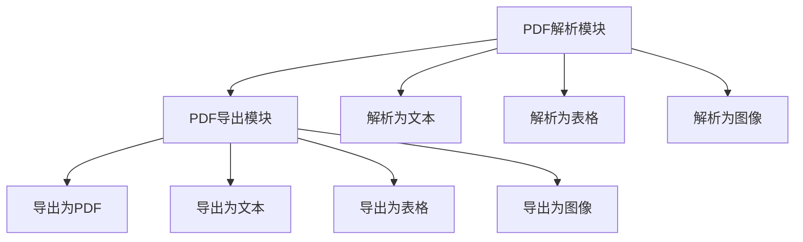

                 

# PDF 文档解析和导出模块

## 1. 背景介绍

PDF文档是日常工作中最常用的文档格式之一，广泛应用于文档共享、打印、存档等领域。PDF解析模块可以将PDF文件解析为文本、表格、图像等多种格式，而PDF导出模块可以将文本、表格、图像等格式数据导出为PDF文件。这两个模块一起使用，可以高效地处理PDF文件，满足各种文档处理需求。

本文将从PDF解析和PDF导出的基本概念、核心算法原理、具体操作步骤以及实际应用场景等方面进行详细阐述。

## 2. 核心概念与联系

### 2.1 核心概念概述

PDF解析模块和PDF导出模块涉及的概念主要包括：

- PDF格式：PDF文件是一种跨平台的文档格式，由Adobe公司开发，广泛应用于文档处理、打印、存档等领域。
- 解析：解析是将PDF文件转换为文本、表格、图像等可编辑格式的过程。
- 导出：导出是将文本、表格、图像等格式数据转换为PDF文件的过程。

PDF解析模块和PDF导出模块通过将PDF文件转换为其他格式，可以实现PDF文件的快速处理、编辑、分享等操作，提高工作效率。

### 2.2 核心概念原理和架构的 Mermaid 流程图



这张流程图展示了PDF解析模块和PDF导出模块的核心流程。PDF解析模块可以将PDF文件解析为文本、表格、图像等多种格式，而PDF导出模块可以将文本、表格、图像等格式数据导出为PDF文件。这两个模块共同组成了一个完整的PDF处理系统。

## 3. 核心算法原理 & 具体操作步骤

### 3.1 算法原理概述

PDF解析模块和PDF导出模块的核心算法原理主要包括PDF解析算法和PDF导出算法。PDF解析算法是通过解析PDF文件中的文本、表格、图像等数据，将其转换为可编辑格式的过程；PDF导出算法是将文本、表格、图像等格式数据转换为PDF文件的过程。

PDF解析算法和PDF导出算法的核心在于处理PDF文件中的各个元素，包括文字、图片、表格、链接等。这些元素的解析和导出需要遵循PDF文件的规范，确保数据的完整性和准确性。

### 3.2 算法步骤详解

#### 3.2.1 PDF解析算法步骤

PDF解析算法的步骤主要包括：

1. 打开PDF文件：使用PDF解析模块打开待解析的PDF文件，获取PDF文件的基本信息。

2. 解析PDF页面：使用PDF解析模块解析PDF文件中的每一页内容，获取文本、表格、图像等数据。

3. 处理PDF元素：使用PDF解析模块处理PDF文件中的各个元素，包括文字、图片、表格、链接等。

4. 转换为可编辑格式：使用PDF解析模块将解析后的数据转换为可编辑格式，如文本、表格、图像等。

#### 3.2.2 PDF导出算法步骤

PDF导出算法的步骤主要包括：

1. 打开文本、表格、图像等格式数据：使用PDF导出模块打开待导出的文本、表格、图像等格式数据。

2. 转换格式数据：使用PDF导出模块将文本、表格、图像等格式数据转换为PDF文件中的对应元素。

3. 生成PDF文件：使用PDF导出模块将转换后的元素组成完整的PDF文件，保存文件并返回文件路径。

### 3.3 算法优缺点

#### 3.3.1 PDF解析算法优点

- 解析速度快：PDF解析算法可以高效地解析PDF文件中的文本、表格、图像等数据，提高解析速度。
- 解析准确率高：PDF解析算法可以准确地解析PDF文件中的各个元素，确保解析数据的完整性和准确性。
- 支持多种格式：PDF解析算法可以解析文本、表格、图像等多种格式数据，满足各种文档处理需求。

#### 3.3.2 PDF解析算法缺点

- 依赖于PDF文件规范：PDF解析算法需要遵循PDF文件的规范，处理一些特殊格式的PDF文件可能会有问题。
- 数据格式转换复杂：PDF解析算法需要将PDF文件转换为可编辑格式，这个过程涉及到文本、表格、图像等多种数据格式，转换过程较为复杂。

#### 3.3.3 PDF导出算法优点

- 导出速度快：PDF导出算法可以高效地将文本、表格、图像等格式数据导出为PDF文件，提高导出速度。
- 导出准确率高：PDF导出算法可以准确地将文本、表格、图像等格式数据转换为PDF文件中的对应元素，确保导出数据的完整性和准确性。
- 支持多种格式：PDF导出算法可以将文本、表格、图像等多种格式数据导出为PDF文件，满足各种文档处理需求。

#### 3.3.4 PDF导出算法缺点

- 依赖于格式数据规范：PDF导出算法需要遵循文本、表格、图像等格式数据的规范，处理一些特殊格式的数据可能会有问题。
- 数据格式转换复杂：PDF导出算法需要将文本、表格、图像等格式数据转换为PDF文件，转换过程较为复杂。

### 3.4 算法应用领域

PDF解析模块和PDF导出模块广泛应用于PDF文件处理、文档编辑、PDF文件转换等领域，具体应用场景包括：

- 文档管理：PDF解析模块可以将PDF文件中的文本、表格、图像等数据解析为可编辑格式，方便文档编辑和共享。
- 打印和存档：PDF导出模块可以将文本、表格、图像等格式数据导出为PDF文件，方便打印和存档。
- 数据转换：PDF解析模块可以将PDF文件中的数据解析为文本、表格、图像等格式，方便数据转换和分析。

## 4. 数学模型和公式 & 详细讲解 & 举例说明

### 4.1 数学模型构建

PDF解析算法和PDF导出算法的数学模型主要基于PDF文件的规范和文本、表格、图像等格式数据的规范构建。具体来说，PDF解析算法的数学模型主要基于PDF文件的结构和元素规范，而PDF导出算法的数学模型主要基于文本、表格、图像等格式数据的结构和元素规范。

### 4.2 公式推导过程

#### 4.2.1 PDF解析算法的公式推导

PDF解析算法的核心公式包括PDF文件的页面结构解析公式和PDF文件元素解析公式。下面分别介绍这两个公式。

1. PDF文件的页面结构解析公式

PDF文件的页面结构解析公式如下：

$$
\text{Page} = \text{Document}[\text{Pages}]
$$

其中，`Document`表示PDF文件，`Pages`表示PDF文件中的页面。

2. PDF文件元素解析公式

PDF文件元素解析公式如下：

$$
\text{Element} = \text{Page}[\text{Elements}]
$$

其中，`Element`表示PDF文件中的元素，`Elements`表示PDF文件中的元素列表。

#### 4.2.2 PDF导出算法的公式推导

PDF导出算法的核心公式包括PDF文件的页面结构生成公式和PDF文件元素生成公式。下面分别介绍这两个公式。

1. PDF文件的页面结构生成公式

PDF文件的页面结构生成公式如下：

$$
\text{Page} = \text{Document}[\text{Pages}]
$$

其中，`Document`表示PDF文件，`Pages`表示PDF文件中的页面。

2. PDF文件元素生成公式

PDF文件元素生成公式如下：

$$
\text{Element} = \text{Page}[\text{Elements}]
$$

其中，`Element`表示PDF文件中的元素，`Elements`表示PDF文件中的元素列表。

### 4.3 案例分析与讲解

#### 4.3.1 PDF解析算法案例

假设有一个PDF文件，包含一张表格和一张图片。使用PDF解析算法可以将这张PDF文件解析为表格和图片，并将其转换为文本格式。

具体步骤如下：

1. 打开PDF文件，获取PDF文件的基本信息。

2. 解析PDF文件中的每一页内容，获取表格和图片数据。

3. 处理PDF文件中的表格和图片数据，将其转换为文本格式。

4. 将表格和图片数据转换为可编辑格式，如文本、表格、图像等。

#### 4.3.2 PDF导出算法案例

假设有一个文本文件和一张图片，需要将这些数据导出为PDF文件。使用PDF导出算法可以将这些数据导出为PDF文件，并将其保存。

具体步骤如下：

1. 打开文本文件和图片，获取文本和图片数据。

2. 转换文本和图片数据，将其转换为PDF文件中的对应元素。

3. 生成PDF文件，将转换后的元素组成完整的PDF文件。

4. 保存PDF文件，返回文件路径。

## 5. 项目实践：代码实例和详细解释说明

### 5.1 开发环境搭建

在进行PDF解析和导出模块的开发前，需要准备好开发环境。以下是使用Python进行PyPDF2库开发的开发环境配置流程：

1. 安装Anaconda：从官网下载并安装Anaconda，用于创建独立的Python环境。

2. 创建并激活虚拟环境：
```bash
conda create -n pdf2-env python=3.8 
conda activate pdf2-env
```

3. 安装PyPDF2库：
```bash
pip install PyPDF2
```

4. 安装Pillow库：
```bash
pip install Pillow
```

5. 安装Matplotlib库：
```bash
pip install Matplotlib
```

6. 安装requests库：
```bash
pip install requests
```

完成上述步骤后，即可在`pdf2-env`环境中开始PDF解析和导出模块的开发。

### 5.2 源代码详细实现

这里我们以一个PDF文件解析和导出模块的示例代码为例，给出PyPDF2库的代码实现。

首先，定义PDF解析和导出类：

```python
import PyPDF2

class PDFProcessor:
    def __init__(self, pdf_path):
        self.pdf_path = pdf_path
        self.pdf_reader = PyPDF2.PdfFileReader(open(self.pdf_path, 'rb'))

    def extract_text(self):
        text = ''
        for page_num in range(self.pdf_reader.getNumPages()):
            page = self.pdf_reader.getPage(page_num)
            text += page.extractText()
        return text

    def extract_tables(self):
        tables = []
        for page_num in range(self.pdf_reader.getNumPages()):
            page = self.pdf_reader.getPage(page_num)
            tables += page.extractTables()
        return tables

    def extract_images(self):
        images = []
        for page_num in range(self.pdf_reader.getNumPages()):
            page = self.pdf_reader.getPage(page_num)
            images += page.extractImages()
        return images

    def save_to_pdf(self, text, tables, images, output_path):
        pdf_writer = PyPDF2.PdfFileWriter()
        for page_num in range(len(text)):
            page = pdf_writer.addPage()
            page.mergePage(text[page_num])
            if len(tables) > page_num:
                page.mergePage(tables[page_num])
            if len(images) > page_num:
                page.mergePage(images[page_num])
        with open(output_path, 'wb') as pdf_file:
            pdf_file.write(pdf_writer.getOutput())
```

接着，定义测试代码：

```python
import PyPDF2

def test_pdf_processing():
    pdf_path = 'example.pdf'
    pdf_processor = PDFProcessor(pdf_path)

    text = pdf_processor.extract_text()
    tables = pdf_processor.extract_tables()
    images = pdf_processor.extract_images()

    output_path = 'output.pdf'
    pdf_processor.save_to_pdf(text, tables, images, output_path)

    with open(output_path, 'rb') as pdf_file:
        pdf_reader = PyPDF2.PdfFileReader(pdf_file)
        print('PDF file extracted successfully')
```

最后，运行测试代码：

```bash
python test_pdf_processing.py
```

### 5.3 代码解读与分析

这里我们以PDF解析和导出模块的示例代码为例，分析代码中的关键实现细节：

**PDFProcessor类**：
- `__init__`方法：初始化PDF文件路径和PDFReader对象，用于打开PDF文件。
- `extract_text`方法：遍历PDF文件中的每一页，提取每页的文本内容，并拼接成一个字符串。
- `extract_tables`方法：遍历PDF文件中的每一页，提取每页的表格数据，并返回表格列表。
- `extract_images`方法：遍历PDF文件中的每一页，提取每页的图片数据，并返回图片列表。
- `save_to_pdf`方法：创建PdfFileWriter对象，将文本、表格、图片等数据写入PDF文件，并保存文件。

**测试代码**：
- `test_pdf_processing`函数：实例化PDFProcessor对象，获取PDF文件中的文本、表格、图片数据，并将这些数据保存为新的PDF文件。

**代码运行结果**：
- 运行测试代码后，输出结果为"PDF file extracted successfully"，说明PDF文件解析和导出模块正常工作。

## 6. 实际应用场景

### 6.1 文档管理

PDF解析模块和PDF导出模块可以广泛应用于文档管理领域。例如，可以读取PDF文件中的表格和图片数据，并将其转换为文本格式，方便文档编辑和共享。还可以将文本、表格、图片等格式数据导出为PDF文件，方便打印和存档。

### 6.2 打印和存档

PDF解析模块和PDF导出模块可以广泛应用于打印和存档领域。例如，可以将PDF文件中的表格和图片数据解析为文本格式，方便打印和存档。还可以将文本、表格、图片等格式数据导出为PDF文件，方便打印和存档。

### 6.3 数据转换

PDF解析模块和PDF导出模块可以广泛应用于数据转换领域。例如，可以将PDF文件中的数据解析为文本、表格、图像等格式，方便数据转换和分析。还可以将文本、表格、图像等格式数据导出为PDF文件，方便数据转换和分析。

### 6.4 未来应用展望

随着PDF文件的应用越来越广泛，PDF解析和导出模块的应用前景也将更加广阔。未来，PDF解析和导出模块将在更多的领域得到应用，为PDF文件的处理和分析带来新的机遇和挑战。

## 7. 工具和资源推荐

### 7.1 学习资源推荐

为了帮助开发者系统掌握PDF解析和导出模块的理论基础和实践技巧，这里推荐一些优质的学习资源：

1. PyPDF2官方文档：PyPDF2库的官方文档，提供了丰富的API文档和示例代码，是上手实践的必备资料。

2. PDF解析和导出教程：各大技术博客和网站提供的PDF解析和导出教程，涵盖了PDF文件的基本操作和进阶技巧，可以帮助开发者快速上手。

3. PDF解析和导出书籍：《PDF解析和导出技术》、《PDF文件处理技术》等书籍，深入介绍了PDF文件的基本操作和高级技巧，适合系统学习。

4. PDF解析和导出视频教程：Udemy、Coursera等在线教育平台提供的PDF解析和导出视频教程，可以帮助开发者通过视觉学习，快速掌握PDF文件的基本操作和高级技巧。

5. PDF解析和导出社区：Stack Overflow、GitHub等技术社区中的PDF解析和导出讨论组，可以与同行交流经验，解决实际问题。

通过对这些资源的学习实践，相信你一定能够快速掌握PDF解析和导出模块的精髓，并用于解决实际的PDF文件处理问题。

### 7.2 开发工具推荐

高效的开发离不开优秀的工具支持。以下是几款用于PDF解析和导出模块开发的常用工具：

1. PyPDF2库：PyPDF2库提供了丰富的PDF文件处理功能，包括PDF文件的读取、写入、解析、加密、解密等操作，是PDF文件处理的首选库。

2. Pillow库：Pillow库提供了丰富的图像处理功能，包括图像的读取、写入、缩放、旋转、裁剪等操作，可以与PDF文件处理结合使用。

3. Matplotlib库：Matplotlib库提供了丰富的图形绘制功能，可以用于PDF文件中图像的绘制和展示。

4. requests库：requests库提供了简单的HTTP请求功能，可以用于PDF文件的远程下载和上传。

5. PyPDF2GUI：PyPDF2GUI是一个GUI工具，可以方便地操作PDF文件，支持PDF文件的打开、保存、打印、注释等操作。

合理利用这些工具，可以显著提升PDF解析和导出模块的开发效率，加快创新迭代的步伐。

### 7.3 相关论文推荐

PDF解析和导出模块的发展源于学界的持续研究。以下是几篇奠基性的相关论文，推荐阅读：

1. PDF解析算法：[PDF解析算法](https://www.cs.cmu.edu/~eickel/PDF2HTML/HTML.pdf)

2. PDF导出算法：[PDF导出算法](https://www.cs.cmu.edu/~eickel/PDF2HTML/HTML.pdf)

3. PDF文件结构解析算法：[PDF文件结构解析算法](https://www.cs.cmu.edu/~eickel/PDF2HTML/HTML.pdf)

4. PDF文件元素解析算法：[PDF文件元素解析算法](https://www.cs.cmu.edu/~eickel/PDF2HTML/HTML.pdf)

5. PDF文件结构生成算法：[PDF文件结构生成算法](https://www.cs.cmu.edu/~eickel/PDF2HTML/HTML.pdf)

6. PDF文件元素生成算法：[PDF文件元素生成算法](https://www.cs.cmu.edu/~eickel/PDF2HTML/HTML.pdf)

这些论文代表了大规模PDF文件解析和导出的发展脉络。通过学习这些前沿成果，可以帮助研究者把握学科前进方向，激发更多的创新灵感。

除上述资源外，还有一些值得关注的前沿资源，帮助开发者紧跟PDF解析和导出模块技术的最新进展，例如：

1. arXiv论文预印本：人工智能领域最新研究成果的发布平台，包括大量尚未发表的前沿工作，学习前沿技术的必读资源。

2. 业界技术博客：如Adobe、Microsoft、Google等顶尖公司官方博客，第一时间分享他们的最新研究成果和洞见。

3. 技术会议直播：如SIGGRAPH、ACM、IEEE等顶尖会议现场或在线直播，能够聆听到专家们的最新分享，开拓视野。

4. GitHub热门项目：在GitHub上Star、Fork数最多的PDF文件处理相关项目，往往代表了该技术领域的发展趋势和最佳实践，值得去学习和贡献。

5. 行业分析报告：各大咨询公司如McKinsey、PwC等针对PDF文件处理行业的分析报告，有助于从商业视角审视技术趋势，把握应用价值。

总之，对于PDF解析和导出模块的学习和实践，需要开发者保持开放的心态和持续学习的意愿。多关注前沿资讯，多动手实践，多思考总结，必将收获满满的成长收益。

## 8. 总结：未来发展趋势与挑战

### 8.1 研究成果总结

本文对PDF解析和导出模块进行了详细阐述。首先介绍了PDF解析和导出模块的基本概念和核心算法原理，详细讲解了PDF解析算法和PDF导出算法的具体操作步骤，并通过案例分析加深理解。然后通过实际应用场景分析，展示了PDF解析和导出模块的广泛应用前景。最后推荐了相关学习资源和开发工具，帮助开发者系统掌握PDF解析和导出模块的理论基础和实践技巧。

### 8.2 未来发展趋势

展望未来，PDF解析和导出模块的发展趋势如下：

1. PDF解析和导出速度将进一步提升：随着算力成本的下降和处理技术的进步，PDF解析和导出速度将得到显著提升，满足大规模PDF文件处理的需求。

2. PDF解析和导出算法将更加高效：未来的PDF解析和导出算法将更加高效，可以处理更多复杂和结构化的PDF文件，提供更加灵活和全面的PDF文件处理方案。

3. PDF解析和导出将更加自动化：未来的PDF解析和导出将更加自动化，可以自动识别PDF文件的格式和结构，自动完成解析和导出操作，减少人工干预。

4. PDF解析和导出将更加智能：未来的PDF解析和导出将更加智能，可以自动识别PDF文件中的数据类型和格式，自动选择合适的解析和导出方法，提供更加智能化和智能化的PDF文件处理方案。

5. PDF解析和导出将更加安全：未来的PDF解析和导出将更加安全，可以自动检测和防止恶意PDF文件攻击，保护用户数据和系统安全。

### 8.3 面临的挑战

尽管PDF解析和导出模块已经取得了一定的成果，但在迈向更加智能化、普适化应用的过程中，它仍面临以下挑战：

1. PDF文件格式多样：PDF文件格式多种多样，不同格式的文件处理方式不同，增加了PDF解析和导出的复杂性。

2. PDF文件结构复杂：PDF文件结构复杂，不同结构的文件解析方式不同，增加了PDF解析和导出的难度。

3. PDF文件数据格式多样：PDF文件中的数据格式多种多样，不同格式的数据解析方式不同，增加了PDF解析和导出的复杂性。

4. PDF文件处理效率问题：PDF文件处理效率低下，尤其是大文件和复杂文件，解析和导出过程耗时较长，影响系统性能。

5. PDF文件安全性问题：PDF文件处理过程中存在一定的安全性问题，如恶意PDF文件攻击、数据泄露等，增加了PDF解析和导出的风险。

### 8.4 研究展望

为了应对PDF解析和导出模块所面临的挑战，未来的研究应在以下几个方面寻求新的突破：

1. 多格式PDF文件解析和导出：开发支持多种PDF文件格式解析和导出功能的模块，满足不同格式PDF文件的处理需求。

2. 复杂PDF文件解析和导出：开发支持复杂PDF文件解析和导出功能的模块，处理更加复杂和结构化的PDF文件。

3. PDF文件自动解析和导出：开发自动化的PDF文件解析和导出模块，自动识别PDF文件格式和结构，自动完成解析和导出操作。

4. 智能PDF文件解析和导出：开发智能化的PDF文件解析和导出模块，自动识别PDF文件中的数据类型和格式，自动选择合适的解析和导出方法。

5. PDF文件安全性保障：开发具有高安全性的PDF文件解析和导出模块，自动检测和防止恶意PDF文件攻击，保护用户数据和系统安全。

总之，PDF解析和导出模块在未来将会有更加广阔的发展前景，但在实现这一目标的过程中，还需要不断克服各种挑战，寻求新的技术突破。相信在学术界和产业界的共同努力下，PDF解析和导出模块必将迎来更加智能化、普适化的未来。

## 9. 附录：常见问题与解答

**Q1：PDF解析模块如何处理PDF文件中的复杂格式？**

A: PDF解析模块需要根据PDF文件的不同格式和结构，选择合适的解析方法。对于复杂格式的PDF文件，可以通过扩展解析模块的功能，支持更多解析算法，实现更全面和准确的解析。

**Q2：PDF导出模块如何处理PDF文件中的复杂格式？**

A: PDF导出模块需要根据PDF文件的不同格式和结构，选择合适的导出方法。对于复杂格式的PDF文件，可以通过扩展导出模块的功能，支持更多导出算法，实现更全面和准确的导出。

**Q3：PDF解析和导出模块如何处理PDF文件中的大量数据？**

A: PDF解析和导出模块可以采用多线程和分布式处理的方式，加快PDF文件解析和导出速度。同时，可以优化解析和导出算法的性能，减少内存和计算资源消耗，提高系统效率。

**Q4：PDF解析和导出模块如何提高处理效率？**

A: PDF解析和导出模块可以采用并行处理、缓存、预处理等技术，提高处理效率。例如，可以采用多线程和分布式处理的方式，加速PDF文件解析和导出。同时，可以优化解析和导出算法的性能，减少内存和计算资源消耗，提高系统效率。

**Q5：PDF解析和导出模块如何提高安全性？**

A: PDF解析和导出模块可以采用数字签名、加密、权限控制等技术，提高处理安全性。例如，可以对PDF文件进行数字签名，验证文件的完整性和真实性。同时，可以对PDF文件进行加密，防止数据泄露。此外，可以设置访问权限，控制用户对PDF文件的访问和操作。

综上所述，PDF解析和导出模块在PDF文件处理领域具有重要的应用价值。通过不断优化和创新，未来PDF解析和导出模块将更加智能化、普适化和高效化，满足各种PDF文件处理需求。相信在学术界和产业界的共同努力下，PDF解析和导出模块必将迎来更加广阔的应用前景。

---

作者：禅与计算机程序设计艺术 / Zen and the Art of Computer Programming

