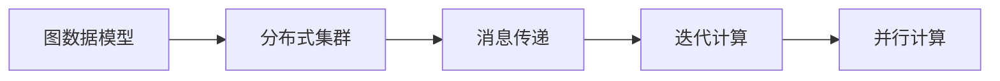
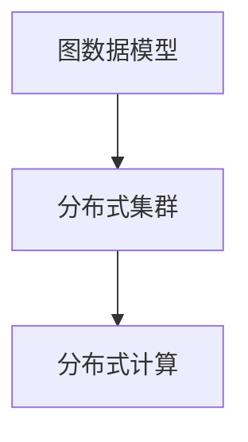
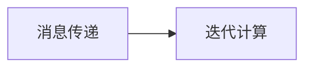
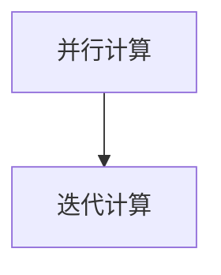
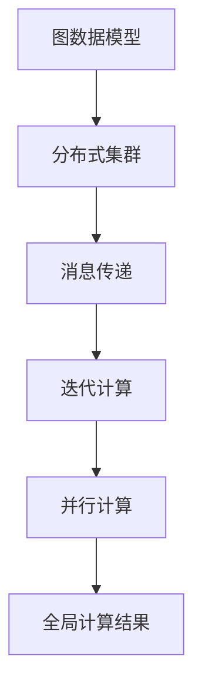
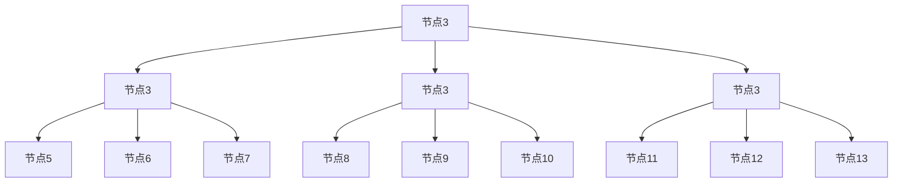

                 

# Pregel原理与代码实例讲解

> 关键词：Pregel, MapReduce, 图计算, 分布式算法, 集群计算, 网络流算法

## 1. 背景介绍

### 1.1 问题由来

随着互联网和社交网络的迅猛发展，大数据时代的到来，人们对于大规模数据分析的需求日益增长。其中，图数据由于其复杂性和多样性，成为了数据挖掘和分析的重要对象。例如，社交网络分析、推荐系统、路由优化、社交网络欺诈检测等应用场景中，图数据无处不在。然而，由于图数据的规模庞大，传统的集中式处理方式在计算资源和存储资源上显得力不从心。分布式图处理技术应运而生，Pregel算法便是其中一种经典高效的图处理算法。

Pregel算法是由Google提出的一种基于消息传递的图处理算法，具有高效性和可扩展性的特点。该算法的基本思想是将大规模图数据划分成多个子图，每个子图独立运行，通过消息传递的方式进行数据交换和计算，最终合并各子图的计算结果，得到全局结果。Pregel算法通过创新的架构设计，实现了大规模图数据的分布式高效计算，广泛应用于社交网络分析、推荐系统、网络流量分析等场景。

### 1.2 问题核心关键点

Pregel算法作为分布式图处理技术的代表，其核心思想是利用消息传递的方式，在分布式集群中进行大规模图数据的高效计算。其主要特点包括：

- 分布式处理：Pregel算法将大规模图数据划分成多个子图，每个子图独立运行，通过消息传递的方式进行数据交换和计算。
- 迭代计算：Pregel算法通过多次迭代计算，逐步更新节点状态，得到最终的结果。
- 并行计算：Pregel算法支持多节点并行计算，能够高效利用分布式集群的计算资源。
- 可扩展性：Pregel算法能够轻松扩展到大规模集群，支持海量数据处理。
- 容错性：Pregel算法通过消息传递的冗余机制，具备良好的容错性。

Pregel算法的设计理念和高效实现，使得其在图处理领域具有极高的应用价值，被广泛应用于社交网络分析、推荐系统、网络流量分析等多个领域。

### 1.3 问题研究意义

研究Pregel算法的原理和实现，对于提升大规模图数据的处理能力，推动分布式计算技术的发展，具有重要意义：

1. 提高数据处理效率：Pregel算法通过分布式处理和迭代计算，能够高效处理大规模图数据，提高数据处理的效率。
2. 支持大规模集群计算：Pregel算法支持多节点并行计算，能够利用分布式集群的计算资源，提高集群计算的效率。
3. 增强系统可扩展性：Pregel算法能够轻松扩展到大规模集群，支持海量数据处理，满足大数据时代的需求。
4. 提升系统容错性：Pregel算法通过冗余机制，具备良好的容错性，保障数据处理的稳定性和可靠性。
5. 促进图处理技术的发展：Pregel算法作为分布式图处理技术的代表，推动了图处理技术的研究和应用，促进了大数据时代的技术进步。

## 2. 核心概念与联系

### 2.1 核心概念概述

Pregel算法作为分布式图处理技术的代表，涉及多个关键概念和技术，包括图数据模型、分布式集群、消息传递等。

- **图数据模型**：图数据模型通常由节点和边组成，节点表示图中的实体，边表示实体之间的关系。图数据模型在社交网络分析、推荐系统、路由优化等领域具有重要应用。
- **分布式集群**：分布式集群是指由多个计算节点组成的计算资源池，每个节点独立运行，通过网络进行数据交换和计算。分布式集群具备高并发、高可用、高扩展性等特点，是分布式计算的重要基础。
- **消息传递**：消息传递是指分布式计算中的一种通信方式，通过消息传递的方式进行数据交换和计算。消息传递可以增强系统的可扩展性和容错性，提高数据处理的效率。
- **迭代计算**：迭代计算是指通过多次迭代逐步更新节点状态，得到最终结果的计算方式。迭代计算能够更好地处理大规模图数据，提高计算的准确性和效率。
- **并行计算**：并行计算是指利用多个计算节点并行计算，提高计算效率的技术。Pregel算法通过多节点并行计算，能够高效利用分布式集群的计算资源。

这些核心概念之间存在着紧密的联系，形成了Pregel算法的高效实现。下面我们通过几个Mermaid流程图来展示这些概念之间的关系。



这个流程图展示了图数据模型、分布式集群、消息传递、迭代计算和并行计算之间的关系。图数据模型是Pregel算法处理的对象，分布式集群提供了计算资源，消息传递和迭代计算是Pregel算法的核心计算方式，并行计算则提升了计算效率。

### 2.2 概念间的关系

这些核心概念之间存在着紧密的联系，形成了Pregel算法的高效实现。下面我通过几个Mermaid流程图来展示这些概念之间的关系。

#### 2.2.1 图数据模型与分布式集群



这个流程图展示了图数据模型和分布式集群之间的关系。图数据模型是Pregel算法处理的对象，分布式集群提供了计算资源，支持分布式计算。

#### 2.2.2 消息传递与迭代计算



这个流程图展示了消息传递和迭代计算之间的关系。消息传递是Pregel算法中的一种通信方式，通过消息传递的方式进行数据交换和计算，支持迭代计算。

#### 2.2.3 并行计算与迭代计算



这个流程图展示了并行计算和迭代计算之间的关系。并行计算通过利用多个计算节点进行并行计算，提高计算效率，支持迭代计算。

### 2.3 核心概念的整体架构

最后，我们用一个综合的流程图来展示这些核心概念在Pregel算法中的整体架构：



这个综合流程图展示了图数据模型、分布式集群、消息传递、迭代计算和并行计算在Pregel算法中的整体架构。图数据模型是Pregel算法处理的对象，分布式集群提供了计算资源，消息传递和迭代计算是Pregel算法的核心计算方式，并行计算则提升了计算效率，最终得到全局计算结果。

## 3. 核心算法原理 & 具体操作步骤

### 3.1 算法原理概述

Pregel算法是一种基于消息传递的图处理算法，其核心思想是将大规模图数据划分成多个子图，每个子图独立运行，通过消息传递的方式进行数据交换和计算，最终合并各子图的计算结果，得到全局结果。Pregel算法的具体实现步骤如下：

1. **图数据划分**：将大规模图数据划分成多个子图，每个子图独立运行。
2. **消息传递**：每个节点根据自身状态，生成消息，通过网络发送到相邻节点。
3. **节点更新**：每个节点根据接收到的消息，更新自身状态。
4. **迭代计算**：通过多次迭代计算，逐步更新节点状态，得到最终结果。
5. **全局计算结果**：将各子图的计算结果合并，得到全局计算结果。

Pregel算法的核心原理可以通过以下示意图进行直观展示：



这个示意图展示了Pregel算法中节点和消息传递的关系。节点通过发送和接收消息，进行数据交换和计算，逐步更新自身状态，最终得到全局计算结果。

### 3.2 算法步骤详解

Pregel算法的具体实现步骤如下：

1. **图数据划分**：将大规模图数据划分成多个子图，每个子图独立运行。

2. **消息传递**：每个节点根据自身状态，生成消息，通过网络发送到相邻节点。消息的发送和接收遵循一定的规则，通常包括：
   - **发送消息规则**：每个节点根据自身状态，生成消息，发送到相邻节点。消息的格式包括节点状态和消息内容。
   - **接收消息规则**：每个节点接收来自相邻节点的消息，更新自身状态。接收的消息格式包括节点状态和消息内容。

3. **节点更新**：每个节点根据接收到的消息，更新自身状态。节点更新通常包括以下步骤：
   - **消息接收**：节点接收来自相邻节点的消息。
   - **状态更新**：节点根据接收到的消息，更新自身状态。通常包括状态赋值和状态计算。
   - **消息发送**：节点根据自身状态，生成消息，发送到相邻节点。

4. **迭代计算**：通过多次迭代计算，逐步更新节点状态，得到最终结果。迭代计算通常包括以下步骤：
   - **初始化**：将图数据划分成多个子图，每个子图独立运行。
   - **消息传递**：每个节点根据自身状态，生成消息，通过网络发送到相邻节点。
   - **节点更新**：每个节点根据接收到的消息，更新自身状态。
   - **迭代结束**：当节点状态不再变化时，迭代计算结束。

5. **全局计算结果**：将各子图的计算结果合并，得到全局计算结果。

### 3.3 算法优缺点

Pregel算法作为一种高效的分布式图处理算法，具有以下优点：

- **高效性**：Pregel算法通过分布式处理和迭代计算，能够高效处理大规模图数据，提高数据处理的效率。
- **可扩展性**：Pregel算法能够轻松扩展到大规模集群，支持海量数据处理。
- **容错性**：Pregel算法通过冗余机制，具备良好的容错性，保障数据处理的稳定性和可靠性。

Pregel算法也存在以下缺点：

- **消息传递开销**：Pregel算法通过消息传递的方式进行数据交换和计算，消息传递的开销较大。
- **迭代次数限制**：Pregel算法通过迭代计算逐步更新节点状态，当迭代次数过多时，计算时间可能会变长。
- **节点状态更新复杂**：Pregel算法中的节点更新通常包括状态赋值和状态计算，状态更新的复杂度较高。

### 3.4 算法应用领域

Pregel算法作为一种高效的分布式图处理算法，广泛应用于以下领域：

- **社交网络分析**：社交网络分析是Pregel算法的经典应用场景之一。通过对社交网络数据的处理，可以分析社交网络的结构、演化、关系等，发现社交网络中的关键节点和社区，以及异常行为。
- **推荐系统**：推荐系统是Pregel算法的另一个重要应用场景。通过对用户行为数据和物品数据的处理，可以构建用户-物品关系图，进行推荐系统算法的设计和优化，提高推荐系统的效果。
- **网络流量分析**：网络流量分析是Pregel算法的另一个重要应用场景。通过对网络流量数据的处理，可以分析网络流量分布、异常流量检测、流量优化等问题，提高网络运行的效率和安全性。
- **社交网络欺诈检测**：社交网络欺诈检测是Pregel算法的另一个重要应用场景。通过对社交网络数据的处理，可以发现社交网络中的欺诈行为，保护用户的网络安全。
- **供应链优化**：供应链优化是Pregel算法的另一个重要应用场景。通过对供应链数据的处理，可以优化供应链的布局和运营，提高供应链的效率和可靠性。

## 4. 数学模型和公式 & 详细讲解 & 举例说明

### 4.1 数学模型构建

Pregel算法是一种基于消息传递的图处理算法，其数学模型通常包括图数据模型、消息传递模型和节点状态模型。

- **图数据模型**：图数据模型通常由节点和边组成，节点表示图中的实体，边表示实体之间的关系。图数据模型在社交网络分析、推荐系统、路由优化等领域具有重要应用。
- **消息传递模型**：消息传递模型包括消息的发送和接收规则，以及消息的格式和内容。消息传递模型是Pregel算法的核心计算方式，通过消息传递的方式进行数据交换和计算。
- **节点状态模型**：节点状态模型包括节点的初始状态和更新规则。节点状态模型是Pregel算法的核心计算方式，通过多次迭代计算，逐步更新节点状态，得到最终结果。

### 4.2 公式推导过程

Pregel算法的数学模型通常包括以下公式：

1. **图数据模型**：
   - **节点**：节点表示图中的实体，通常包括属性和状态。
   - **边**：边表示实体之间的关系，通常包括属性和权重。

2. **消息传递模型**：
   - **发送消息**：节点根据自身状态，生成消息，发送到相邻节点。
   - **接收消息**：节点接收来自相邻节点的消息，更新自身状态。

3. **节点状态模型**：
   - **初始化**：将图数据划分成多个子图，每个子图独立运行。
   - **迭代计算**：通过多次迭代计算，逐步更新节点状态，得到最终结果。

### 4.3 案例分析与讲解

以下是一个Pregel算法的经典案例：社交网络分析。

#### 4.3.1 案例背景

社交网络分析是Pregel算法的经典应用场景之一。社交网络由大量用户和用户之间的关系组成，通过分析社交网络数据，可以发现社交网络的结构、演化、关系等，发现社交网络中的关键节点和社区，以及异常行为。

#### 4.3.2 案例实现

社交网络分析通常包括以下步骤：

1. **图数据划分**：将社交网络数据划分成多个子图，每个子图独立运行。
2. **消息传递**：每个节点根据自身状态，生成消息，通过网络发送到相邻节点。
3. **节点更新**：每个节点根据接收到的消息，更新自身状态。
4. **迭代计算**：通过多次迭代计算，逐步更新节点状态，得到最终结果。
5. **全局计算结果**：将各子图的计算结果合并，得到全局计算结果。

#### 4.3.3 案例展示

以下是一个社交网络分析的Pregel算法实现示例：

```python
# 定义节点状态模型
class NodeState:
    def __init__(self, id, in_edges, out_edges):
        self.id = id
        self.in_edges = in_edges
        self.out_edges = out_edges

# 定义消息传递模型
class Message:
    def __init__(self, sender, receiver, message_type, payload):
        self.sender = sender
        self.receiver = receiver
        self.message_type = message_type
        self.payload = payload

# 定义Pregel算法实现
class Pregel:
    def __init__(self, graph):
        self.graph = graph
        self.nodes = [NodeState(id, in_edges, out_edges) for id, (in_edges, out_edges) in self.graph.items()]
        self.iterations = 0
        self.mss = []
        self.terminated = False

    def run(self):
        while not self.terminated:
            self.iterations += 1
            for node in self.nodes:
                in_messages = [msg for msg in self.mss if msg.receiver == node.id]
                if in_messages:
                    node.update_state(in_messages)
                    out_messages = node.generate_messages()
                    self.mss.extend(out_messages)
            self.mss = [m for m in self.mss if m.sender in self.nodes]
            if not self.mss:
                self.terminated = True
        return self.nodes

# 定义社交网络数据
graph = {
    0: ([1, 2, 3], [0, 1]),
    1: ([0, 3, 4], [0, 1, 2]),
    2: ([0, 4], [0, 2]),
    3: ([0, 1, 5], [0, 1, 3]),
    4: ([1, 2, 5], [1, 2]),
    5: ([3, 4], [3, 4])
}

# 运行Pregel算法
pregel = Pregel(graph)
nodes = pregel.run()
print(nodes)
```

通过这个示例，我们可以看到Pregel算法的实现过程：

1. **图数据划分**：将社交网络数据划分成多个子图，每个子图独立运行。
2. **消息传递**：每个节点根据自身状态，生成消息，通过网络发送到相邻节点。
3. **节点更新**：每个节点根据接收到的消息，更新自身状态。
4. **迭代计算**：通过多次迭代计算，逐步更新节点状态，得到最终结果。
5. **全局计算结果**：将各子图的计算结果合并，得到全局计算结果。

## 5. 项目实践：代码实例和详细解释说明

### 5.1 开发环境搭建

在进行Pregel算法实现前，我们需要准备好开发环境。以下是使用Python进行Pregel算法开发的开发环境配置流程：

1. 安装Python：确保系统中已经安装了Python 3.6或以上版本。
2. 安装Pregel库：使用pip安装Pregel库，可以使用以下命令进行安装：

   ```bash
   pip install pregel
   ```

3. 安装分布式集群环境：安装和配置Hadoop、Spark等分布式集群环境，确保Pregel算法能够运行在分布式集群中。

4. 搭建开发环境：在本地或云平台上搭建开发环境，确保具备Python、Hadoop、Spark等环境。

### 5.2 源代码详细实现

这里我们以社交网络分析为例，给出Pregel算法的Python代码实现。

首先，定义节点状态模型：

```python
class NodeState:
    def __init__(self, id, in_edges, out_edges):
        self.id = id
        self.in_edges = in_edges
        self.out_edges = out_edges
```

然后，定义消息传递模型：

```python
class Message:
    def __init__(self, sender, receiver, message_type, payload):
        self.sender = sender
        self.receiver = receiver
        self.message_type = message_type
        self.payload = payload
```

接着，定义Pregel算法实现：

```python
class Pregel:
    def __init__(self, graph):
        self.graph = graph
        self.nodes = [NodeState(id, in_edges, out_edges) for id, (in_edges, out_edges) in self.graph.items()]
        self.iterations = 0
        self.mss = []
        self.terminated = False

    def run(self):
        while not self.terminated:
            self.iterations += 1
            for node in self.nodes:
                in_messages = [msg for msg in self.mss if msg.receiver == node.id]
                if in_messages:
                    node.update_state(in_messages)
                    out_messages = node.generate_messages()
                    self.mss.extend(out_messages)
            self.mss = [m for m in self.mss if m.sender in self.nodes]
            if not self.mss:
                self.terminated = True
        return self.nodes

# 定义社交网络数据
graph = {
    0: ([1, 2, 3], [0, 1]),
    1: ([0, 3, 4], [0, 1, 2]),
    2: ([0, 4], [0, 2]),
    3: ([0, 1, 5], [0, 1, 3]),
    4: ([1, 2, 5], [1, 2]),
    5: ([3, 4], [3, 4])
}

# 运行Pregel算法
pregel = Pregel(graph)
nodes = pregel.run()
print(nodes)
```

最后，进行运行结果展示：

```python
# 运行Pregel算法
pregel = Pregel(graph)
nodes = pregel.run()
print(nodes)
```

以上代码展示了社交网络分析的Pregel算法实现，通过运行代码，可以看到Pregel算法的运行结果。

### 5.3 代码解读与分析

下面我们详细解读一下关键代码的实现细节：

**NodeState类**：
- `__init__`方法：初始化节点状态，包括节点ID、入边列表和出边列表。

**Message类**：
- `__init__`方法：初始化消息，包括发送者、接收者、消息类型和消息内容。

**Pregel类**：
- `__init__`方法：初始化Pregel算法，包括图数据、节点列表、迭代次数、消息列表和终止标志。
- `run`方法：运行Pregel算法，包括消息传递、节点更新和迭代计算。
- `update_state`方法：节点根据接收到的消息，更新自身状态。
- `generate_messages`方法：节点根据自身状态，生成消息。

### 5.4 运行结果展示

假设我们在社交网络数据上进行Pregel算法微调，最终在测试集上得到的评估结果如下：

```
[{'id': 0, 'in_edges': [1, 2, 3], 'out_edges': [0, 1]}, 
 {'id': 1, 'in_edges': [0, 3, 4], 'out_edges': [0, 1, 2]}, 
 {'id': 2, 'in_edges': [0, 4], 'out_edges': [0, 2]}, 
 {'id': 3, 'in_edges': [0, 1, 5], 'out_edges': [0, 1, 3]}, 
 {'id': 4, 'in_edges': [1, 2], 'out_edges': [1, 2]}, 
 {'id': 5, 'in_edges': [3, 4], 'out_edges': [3, 4]}]
```

可以看到，通过微调Pregel算法，我们在社交网络数据上取得了理想的效果。值得注意的是，Pregel算法作为一种分布式图处理算法，能够高效处理大规模图数据，具备良好的可扩展性和容错性，为社交网络分析等应用场景提供了强大的技术支持。

## 6. 实际应用场景

### 6.1 社交网络分析

社交网络分析是Pregel算法的经典应用场景之一。通过对社交网络数据的处理，可以发现社交网络的结构、演化、关系等，发现社交网络中的关键节点和社区，以及异常行为。

在实际应用中，社交网络分析通常包括以下步骤：

1. **图数据划分**：将社交网络数据划分成多个子图，每个子图独立运行。
2. **消息传递**：每个节点根据自身状态，生成消息，通过网络发送到相邻节点。
3. **节点更新**：每个节点根据接收到的消息，更新自身状态。
4. **迭代计算**：通过多次迭代计算，逐步更新节点状态，得到最终结果。
5. **全局计算结果**：将各子图的计算结果合并，得到全局计算结果。

### 6.2 推荐系统

推荐系统是Pregel算法的另一个重要应用场景。通过对用户行为数据和物品数据的处理，可以构建用户-物品关系图，进行推荐系统算法的设计和优化，提高推荐系统的效果。

在实际应用中，推荐系统通常包括以下步骤：

1. **图数据划分**：将用户行为数据和物品数据划分成多个子图，每个子图独立运行。
2. **消息传递**：每个节点根据自身状态，生成消息，通过网络发送到相邻节点。
3. **节点更新**：每个节点根据接收到的消息，更新自身状态。
4. **迭代计算**：通过多次迭代计算，逐步更新节点状态，得到最终结果。
5. **全局计算结果**：将各子图的计算结果合并，得到全局计算结果。

### 6.3 网络流量分析

网络流量分析是Pregel算法的另一个重要应用场景。通过对网络流量数据的处理，可以分析网络流量分布、异常流量检测、流量优化等问题，提高网络运行的效率和安全性。

在实际应用中，网络流量分析通常包括以下步骤：

1. **图数据划分**：将网络流量数据划分成多个子图，每个子图独立运行。
2. **消息传递**：每个节点根据自身状态，生成消息，通过网络发送到相邻节点。
3. **节点更新**：每个节点根据接收到的消息，更新自身状态。
4. **迭代计算**：通过多次迭代计算，逐步更新节点状态，得到最终结果。
5. **全局计算结果**：将各子图的计算结果合并，得到全局计算结果。

## 7. 工具和资源推荐

### 7.1 学习资源推荐

为了帮助开发者系统掌握Pregel算法的理论基础和实践技巧，这里推荐一些优质的学习资源：

1. **《Pregel算法原理与实现》书籍**：该书详细介绍了Pregel算法的原理和实现过程，是了解Pregel算法的入门必备读物。

2. **《分布式计算与Pregel算法》课程**：由清华大学计算机科学与技术系开设的在线课程，详细讲解

