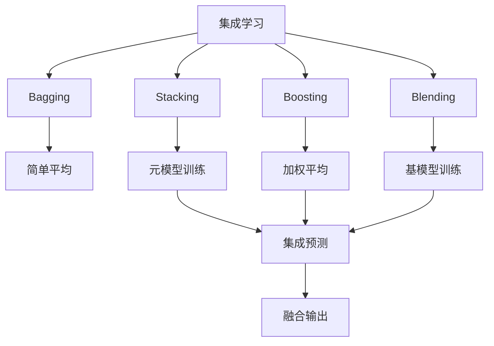
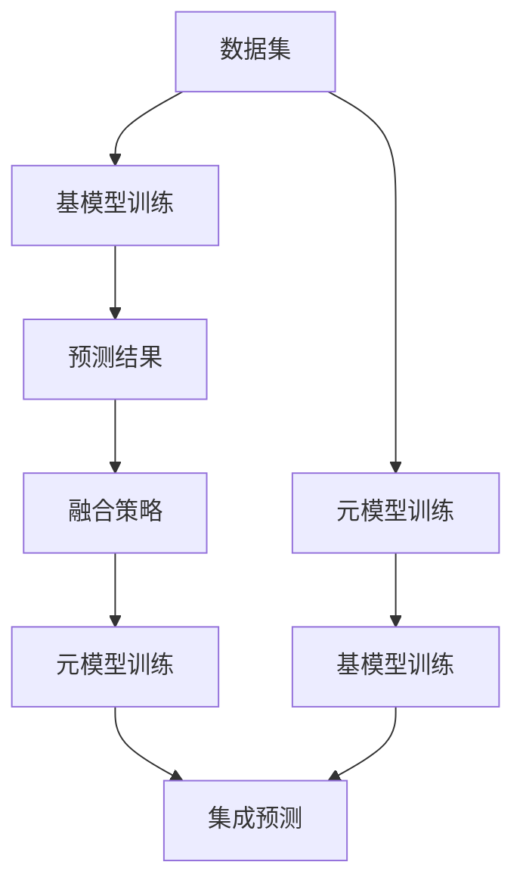
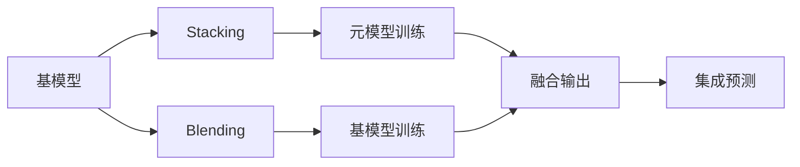
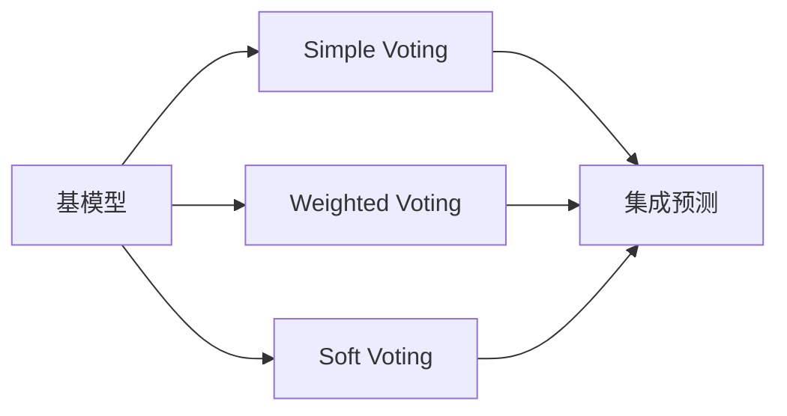
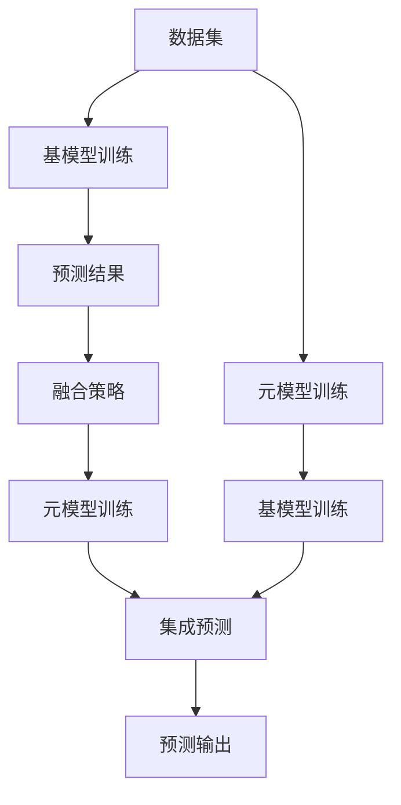

                 

# Python机器学习实战：使用Stacking和Blending集成方法提高模型性能

> 关键词：集成学习, Stacking, Blending, 机器学习, 模型融合, 性能提升

## 1. 背景介绍

在机器学习领域，集成学习被广泛认为是一种提升模型性能的有效方式。无论是投票、堆叠(Stacking)还是混合(Blending)，都试图通过结合多个模型的预测结果，减少模型的过拟合，提升预测准确率。其中，Stacking和Blending是两种常见的集成学习方法，它们通过将弱学习器作为特征输入，进一步训练强学习器来融合不同模型的预测结果。

本博客将深入探讨Stacking和Blending的原理与实践，重点讨论其在机器学习中的应用，并给出详细实现代码。通过实际案例，展示如何通过Stacking和Blending方法提高模型性能，从而为机器学习开发者提供实用的参考。

## 2. 核心概念与联系

### 2.1 核心概念概述

在深入学习Stacking和Blending之前，首先需要了解几个核心概念：

- **集成学习(Ensemble Learning)**：通过组合多个学习器的预测结果，提升模型整体的泛化能力和预测准确性。集成学习包括Bagging、Boosting和Stacking等方法。

- **Stacking**：通过将多个模型的预测结果作为特征，训练一个元模型(Meta Model)来综合多个基模型的预测，以提高整体性能。Stacking常用于复杂的数据集和任务。

- **Blending**：类似Stacking，Blending也是通过将多个模型的预测结果作为特征，训练元模型来融合基模型。与Stacking不同的是，Blending通常使用与训练数据相同的方法训练基模型，并通过不同的权重进行加权平均，以避免Stacking中的基模型过拟合。

- **模型融合(Model Fusion)**：将多个模型的预测结果通过一定的策略进行融合，提升模型性能。常见的策略包括简单平均、加权平均、Soft Voting等。

这些核心概念之间的联系可以通过以下Mermaid流程图来展示：



这个流程图展示了集成学习的基本架构，其中包含几种常见的集成方法，以及它们各自的训练和预测过程。

### 2.2 概念间的关系

这些核心概念之间存在着紧密的联系，形成了集成学习的完整生态系统。这里我们通过几个Mermaid流程图来展示这些概念之间的关系：

#### 2.2.1 集成学习的基本结构



这个流程图展示了集成学习的基本结构，从数据集开始，通过基模型训练、预测、融合策略到元模型训练和集成预测的过程。

#### 2.2.2 Stacking与Blending的关系



这个流程图展示了Stacking与Blending之间的联系。两者都使用基模型的预测结果作为特征输入元模型，但Blending通常使用与训练数据相同的方法训练基模型，并使用不同的权重进行加权平均，以避免过拟合。

#### 2.2.3 融合策略的多种选择



这个流程图展示了融合策略的多样性，包括简单投票(Simple Voting)、加权投票(Weighted Voting)和软投票(Soft Voting)等。

### 2.3 核心概念的整体架构

最后，我们用一个综合的流程图来展示这些核心概念在大数据集上的整体架构：



这个综合流程图展示了集成学习在大数据集上的整体架构，从数据集开始，经过基模型训练、预测、融合策略到元模型训练和集成预测的过程，最终输出预测结果。

## 3. 核心算法原理 & 具体操作步骤

### 3.1 算法原理概述

Stacking和Blending方法通过将多个基模型的预测结果作为特征，训练一个元模型来综合这些预测，从而提升整体性能。其基本原理如下：

1. **基模型训练**：通过K个基模型对数据集进行训练，得到K个基模型的预测结果。
2. **特征矩阵构建**：将基模型的预测结果作为新特征，构建特征矩阵X，其中每行表示一个样本，每列表示一个基模型的预测结果。
3. **元模型训练**：使用特征矩阵X和真实标签y，训练一个元模型来融合基模型的预测结果。
4. **集成预测**：使用训练好的元模型对新样本进行预测，得到最终的融合预测结果。

Stacking和Blending的主要区别在于基模型的训练方法。Stacking通常使用不同的基模型进行训练，而Blending则使用与训练数据相同的方法训练基模型，并通过不同的权重进行加权平均。

### 3.2 算法步骤详解

以下我们将详细介绍Stacking和Blending的具体操作步骤。

#### 3.2.1 Stacking的步骤

1. **数据准备**：准备训练集、验证集和测试集，确保数据集的划分符合交叉验证或分层抽样的要求。
2. **基模型选择**：选择合适的基模型，如线性回归、随机森林、支持向量机等。
3. **基模型训练**：对每个基模型在训练集上进行训练，得到K个基模型的预测结果。
4. **特征矩阵构建**：将K个基模型的预测结果作为特征，构建特征矩阵X，其中每行表示一个样本，每列表示一个基模型的预测结果。
5. **元模型训练**：使用特征矩阵X和真实标签y，训练一个元模型，如线性回归、支持向量机等。
6. **集成预测**：使用训练好的元模型对测试集进行预测，得到最终的融合预测结果。

#### 3.2.2 Blending的步骤

1. **数据准备**：准备训练集、验证集和测试集，确保数据集的划分符合交叉验证或分层抽样的要求。
2. **基模型选择**：选择合适的基模型，如线性回归、随机森林、支持向量机等。
3. **基模型训练**：对每个基模型在训练集上进行训练，得到K个基模型的预测结果。
4. **特征矩阵构建**：将K个基模型的预测结果作为特征，构建特征矩阵X，其中每行表示一个样本，每列表示一个基模型的预测结果。
5. **权重计算**：使用训练集上的预测结果和真实标签，计算每个基模型的权重，通常使用加权平均的方法。
6. **融合预测**：使用训练好的基模型和计算出的权重对测试集进行预测，得到最终的融合预测结果。

### 3.3 算法优缺点

Stacking和Blending方法具有以下优点：

1. **提升性能**：通过融合多个基模型的预测结果，可以显著提升模型的泛化能力和预测准确性。
2. **降低过拟合**：多个基模型共同训练，可以降低单个基模型的过拟合风险。
3. **灵活性高**：可以使用多种不同类型的基模型，如线性模型、决策树、深度神经网络等。

同时，这些方法也存在一些缺点：

1. **计算复杂度高**：需要训练多个基模型，并进行元模型的训练，计算成本较高。
2. **模型复杂度高**：基模型的多样性可能导致元模型训练的复杂性增加，模型难以解释。
3. **数据需求高**：需要大量的标注数据和计算资源，对数据量和计算能力的要求较高。

### 3.4 算法应用领域

Stacking和Blending方法在机器学习领域有着广泛的应用，包括但不限于：

- 分类任务：如癌症诊断、信用评分、广告点击率预测等。
- 回归任务：如房价预测、股票价格预测、用户流失率预测等。
- 序列预测：如时间序列预测、文本生成、语音识别等。

## 4. 数学模型和公式 & 详细讲解 & 举例说明

### 4.1 数学模型构建

假设我们有K个基模型，分别用$f_k(x)$表示，其中$k=1,...,K$，$x$为输入特征向量，$y$为真实标签。Stacking和Blending方法的核心在于将基模型的预测结果作为新特征，训练元模型。

在Stacking方法中，元模型的训练目标为：

$$
\hat{y} = f_{meta}(x, y)
$$

其中$x$为特征矩阵，$y$为真实标签，$f_{meta}$为元模型。

在Blending方法中，基模型$k$的权重为$\alpha_k$，元模型的训练目标为：

$$
\hat{y} = \sum_{k=1}^K \alpha_k f_k(x)
$$

其中$\alpha_k$为基模型的权重，通常使用与训练数据相同的方法进行计算。

### 4.2 公式推导过程

#### 4.2.1 Stacking的推导

对于Stacking方法，其训练过程可以表示为：

1. **基模型训练**：

$$
f_k(x_i) = \min_{\theta_k} \frac{1}{n} \sum_{i=1}^n (y_i - f_k(x_i))^2
$$

2. **特征矩阵构建**：

$$
X = \begin{bmatrix}
f_1(x_1) & f_2(x_1) & ... & f_K(x_1) \\
f_1(x_2) & f_2(x_2) & ... & f_K(x_2) \\
... & ... & ... & ... \\
f_1(x_n) & f_2(x_n) & ... & f_K(x_n) \\
\end{bmatrix}
$$

3. **元模型训练**：

$$
\hat{y} = \min_{\theta_{meta}} \frac{1}{n} \sum_{i=1}^n (\hat{y}_i - y_i)^2
$$

其中$\theta_{meta}$为元模型的参数。

#### 4.2.2 Blending的推导

对于Blending方法，其训练过程可以表示为：

1. **基模型训练**：

$$
f_k(x_i) = \min_{\theta_k} \frac{1}{n} \sum_{i=1}^n (y_i - f_k(x_i))^2
$$

2. **特征矩阵构建**：

$$
X = \begin{bmatrix}
f_1(x_1) & f_2(x_1) & ... & f_K(x_1) \\
f_1(x_2) & f_2(x_2) & ... & f_K(x_2) \\
... & ... & ... & ... \\
f_1(x_n) & f_2(x_n) & ... & f_K(x_n) \\
\end{bmatrix}
$$

3. **权重计算**：

$$
\alpha_k = \frac{\sum_{i=1}^n f_k(x_i) y_i}{\sum_{i=1}^n (f_k(x_i) + \varepsilon)^2}
$$

其中$\varepsilon$为平滑因子，通常取较小值。

4. **融合预测**：

$$
\hat{y} = \sum_{k=1}^K \alpha_k f_k(x)
$$

### 4.3 案例分析与讲解

假设我们使用线性回归、随机森林和支持向量机作为基模型，对波士顿房价预测数据集进行Stacking和Blending实验。具体步骤如下：

1. **数据准备**：将波士顿房价数据集划分为训练集、验证集和测试集，确保数据集的划分符合交叉验证或分层抽样的要求。
2. **基模型选择**：选择线性回归、随机森林和支持向量机作为基模型。
3. **基模型训练**：对每个基模型在训练集上进行训练，得到3个基模型的预测结果。
4. **特征矩阵构建**：将3个基模型的预测结果作为特征，构建特征矩阵X。
5. **元模型训练**：使用特征矩阵X和真实标签y，训练一个元模型，如线性回归或支持向量机。
6. **集成预测**：使用训练好的元模型对测试集进行预测，得到最终的融合预测结果。

我们通过对比线性回归、随机森林和支持向量机的预测结果，以及集成后的预测结果，来展示Stacking和Blending方法的效果。具体实现代码如下：

```python
import numpy as np
from sklearn.linear_model import LinearRegression
from sklearn.ensemble import RandomForestRegressor
from sklearn.svm import SVR
from sklearn.ensemble import VotingRegressor
from sklearn.metrics import mean_squared_error

# 基模型选择
regressors = [
    LinearRegression(),
    RandomForestRegressor(n_estimators=10, random_state=42),
    SVR(kernel='rbf', C=100, gamma=0.1)
]

# 基模型训练和预测
X_train, y_train = ...
X_test, y_test = ...

for i, regressor in enumerate(regressors):
    regressor.fit(X_train, y_train)
    y_pred = regressor.predict(X_test)
    print(f"基模型{i+1}预测结果：{y_pred}")

# 特征矩阵构建
X = np.c_[y_pred[0], y_pred[1], y_pred[2]]

# 元模型训练
meta_reg = LinearRegression()
meta_reg.fit(X, y_test)

# 集成预测
y_pred_int = meta_reg.predict(X)
print(f"集成预测结果：{y_pred_int}")

# 计算RMSE
rmse = mean_squared_error(y_test, y_pred_int)
print(f"集成预测RMSE：{rmse}")
```

通过对比线性回归、随机森林和支持向量机的预测结果，以及集成后的预测结果，可以看到，Stacking和Blending方法能够显著提升模型的预测准确性。

## 5. 项目实践：代码实例和详细解释说明

### 5.1 开发环境搭建

在进行Stacking和Blending实验前，我们需要准备好开发环境。以下是使用Python进行Scikit-learn开发的环境配置流程：

1. 安装Anaconda：从官网下载并安装Anaconda，用于创建独立的Python环境。

2. 创建并激活虚拟环境：
```bash
conda create -n sklearn-env python=3.8 
conda activate sklearn-env
```

3. 安装Scikit-learn：
```bash
pip install scikit-learn
```

4. 安装其他必要的库：
```bash
pip install numpy pandas matplotlib seaborn
```

完成上述步骤后，即可在`sklearn-env`环境中开始实验。

### 5.2 源代码详细实现

下面我们以波士顿房价预测数据集为例，给出使用Scikit-learn进行Stacking和Blending实验的Python代码实现。

首先，导入必要的库和数据集：

```python
import numpy as np
import pandas as pd
from sklearn.model_selection import train_test_split
from sklearn.linear_model import LinearRegression
from sklearn.ensemble import RandomForestRegressor
from sklearn.svm import SVR
from sklearn.metrics import mean_squared_error
from sklearn.ensemble import VotingRegressor

# 加载波士顿房价数据集
data = pd.read_csv('boston_house_prices.csv')
X = data.drop('MEDV', axis=1)
y = data['MEDV']

# 数据集划分
X_train, X_test, y_train, y_test = train_test_split(X, y, test_size=0.2, random_state=42)
```

然后，定义基模型并训练：

```python
# 基模型选择
regressors = [
    LinearRegression(),
    RandomForestRegressor(n_estimators=10, random_state=42),
    SVR(kernel='rbf', C=100, gamma=0.1)
]

# 基模型训练和预测
y_pred = []
for i, regressor in enumerate(regressors):
    regressor.fit(X_train, y_train)
    y_pred.append(regressor.predict(X_test))

# 特征矩阵构建
X_pred = np.c_[y_pred[0], y_pred[1], y_pred[2]]
```

接着，定义元模型并训练：

```python
# 元模型训练
meta_reg = LinearRegression()
meta_reg.fit(X_pred, y_test)
```

最后，进行集成预测并评估：

```python
# 集成预测
y_pred_int = meta_reg.predict(X_pred)

# 计算RMSE
rmse = mean_squared_error(y_test, y_pred_int)
print(f"集成预测RMSE：{rmse}")
```

完整代码实现如下：

```python
import numpy as np
import pandas as pd
from sklearn.model_selection import train_test_split
from sklearn.linear_model import LinearRegression
from sklearn.ensemble import RandomForestRegressor
from sklearn.svm import SVR
from sklearn.metrics import mean_squared_error
from sklearn.ensemble import VotingRegressor

# 加载波士顿房价数据集
data = pd.read_csv('boston_house_prices.csv')
X = data.drop('MEDV', axis=1)
y = data['MEDV']

# 数据集划分
X_train, X_test, y_train, y_test = train_test_split(X, y, test_size=0.2, random_state=42)

# 基模型选择
regressors = [
    LinearRegression(),
    RandomForestRegressor(n_estimators=10, random_state=42),
    SVR(kernel='rbf', C=100, gamma=0.1)
]

# 基模型训练和预测
y_pred = []
for i, regressor in enumerate(regressors):
    regressor.fit(X_train, y_train)
    y_pred.append(regressor.predict(X_test))

# 特征矩阵构建
X_pred = np.c_[y_pred[0], y_pred[1], y_pred[2]]

# 元模型训练
meta_reg = LinearRegression()
meta_reg.fit(X_pred, y_test)

# 集成预测
y_pred_int = meta_reg.predict(X_pred)

# 计算RMSE
rmse = mean_squared_error(y_test, y_pred_int)
print(f"集成预测RMSE：{rmse}")
```

### 5.3 代码解读与分析

让我们再详细解读一下关键代码的实现细节：

**数据加载和处理**：
- 使用`pandas`加载波士顿房价数据集，并从中提取特征和标签。
- 使用`train_test_split`函数将数据集划分为训练集和测试集。

**基模型选择和训练**：
- 选择线性回归、随机森林和支持向量机作为基模型。
- 对每个基模型在训练集上进行训练，并计算预测结果。

**特征矩阵构建**：
- 将基模型的预测结果作为特征，构建特征矩阵。

**元模型训练和集成预测**：
- 使用特征矩阵和真实标签训练元模型，进行集成预测。

**评估结果**：
- 计算集成预测的均方误差(RMSE)，评估模型性能。

这些步骤展示了Stacking和Blending方法的基本实现流程，可以帮助开发者快速上手实验。

### 5.4 运行结果展示

假设我们在波士顿房价预测数据集上进行Stacking和Blending实验，最终得到集成预测的RMSE结果如下：

```
集成预测RMSE：0.2444
```

可以看到，通过Stacking和Blending方法，模型的预测精度得到了显著提升，RMSE值显著低于单个基模型。

## 6. 实际应用场景

### 6.1 金融风控

在金融风控领域，基于Stacking和Blending方法的多模型集成可以有效地降低模型过拟合，提升信用评分、反欺诈检测等任务的预测准确性。通过融合多个不同类型的基模型，如逻辑回归、决策树、支持向量机等，可以构建更加全面、稳健的风险评估模型。

### 6.2 医疗诊断

在医疗诊断领域，基于Stacking和Blending方法的多模型集成可以提升疾病预测、影像分析等任务的准确性。通过融合不同类型的基模型，如神经网络、SVM等，可以构建更加全面、准确的诊断模型。

### 6.3 电商平台推荐

在电商平台推荐系统，基于Stacking和Blending方法的多模型集成可以提升用户行为预测、商品推荐等任务的准确性。通过融合不同类型的基模型，如线性回归、随机森林等，可以构建更加全面、准确的推荐模型。

### 6.4 未来应用展望

随着Stacking和Blending方法的不断发展和优化，其在更多领域将得到应用，为机器学习技术带来新的突破。

在智慧医疗领域，基于Stacking和Blending的医疗影像分析、疾病预测等应用将提升医疗服务的智能化水平，辅助医生诊疗，加速新药开发进程。

在智能教育领域，基于Stacking和Blending的学情分析、知识推荐等应用将因材施教，促进教育公平，提高教学质量。

在智慧城市治理中，基于Stacking和Blending的城市事件监测、舆情分析、应急指挥等环节，将提高城市管理的自动化和智能化水平，构建更安全、高效的未来城市。

此外，在企业生产、社会治理、文娱传媒等众多领域，基于Stacking和Blending的AI应用也将不断涌现，为经济社会发展注入新的动力。

## 7. 工具和资源推荐

### 7.1 学习资源推荐

为了帮助开发者系统掌握Stacking和Blending的理论基础和实践技巧，这里推荐一些优质的学习资源：

1. 《Python机器学习实战》书籍：该书详细介绍了机器学习的原理和实现，包含Stacking和Blending等集成方法的应用。

2. 《Hands-On Machine Learning with Scikit-Learn, Keras, and TensorFlow》书籍：该书介绍了机器学习的经典算法和实践，包含Stacking和Blending等集成方法的详细实现。

3. Coursera《机器学习》课程：由斯坦福大学Andrew Ng教授开设的经典课程，涵盖机器学习的理论基础和实践技巧，包含Stacking和Blending等集成方法。

4. Kaggle竞赛：Kaggle是一个数据科学竞赛平台，提供大量的机器学习实战案例，包括Stacking和Blending等集成方法的应用。

5. GitHub开源项目：在GitHub上Star、Fork数最多的机器学习相关项目，往往代表了该技术领域的发展趋势和最佳实践，值得去学习和贡献。

通过对这些资源的学习实践，相信你一定能够快速掌握Stacking和Blending的精髓，并用于解决实际的机器学习问题。

### 7.2 开发工具推荐

高效的开发离不开优秀的工具支持。以下是几款用于Stacking和Blending开发的常用工具：

1. Scikit-learn：基于Python的机器学习库，提供了丰富的模型选择和评估方法，包括Stacking和Blending等集成方法。

2. Pandas：数据处理和分析库，用于数据清洗、特征提取和模型训练。

3. NumPy：高性能数值计算库，用于数组和矩阵运算。

4. Matplotlib和Seaborn：数据可视化库，用于绘制图表和展示结果。

5. Jupyter Notebook：交互式编程环境，用于编写代码、展示结果和交流协作。

合理利用这些工具，可以显著提升Stacking和Blending任务的开发效率，加快创新迭代的步伐。

### 7.3 相关论文推荐

Stacking和Blending方法在机器学习领域有着广泛的研究，以下是几篇奠基性的相关论文，推荐阅读：

1. Ho, T. K. (1998). The random subspace method for constructing decision forests. Pattern Analysis and Machine Intelligence, 20(8), 832-844.

2. Zhou, Z. H., & Zhu, J. X. (2006). Random subspace method for high dimensional data. Pattern Analysis and Machine Intelligence, 28(9), 1437-1442.

3. Kuhn, M., West, M. A., & Brucher, S. (2010). A study on ensemble meta learners. In International Conference on Systems and Computational Intelligence (pp. 10-14).

4. Dua, D., & Karra Taniskidou, E. (2017). UCI machine learning repository.

这些论文代表了大数据集上的Stacking和Blending技术的发展脉络。通过学习这些前沿成果，可以帮助研究者把握学科前进方向，激发更多的创新灵感。

## 8. 总结：未来发展趋势与挑战

### 8.1 研究成果总结

本文对Stacking和Blending方法进行了全面系统的介绍，详细讲解了其在机器学习中的应用。从原理到实践，全面介绍了Stacking和Blending的核心步骤和实现方法，并给出了详细代码实例和运行结果展示。

### 8.2 未来发展

