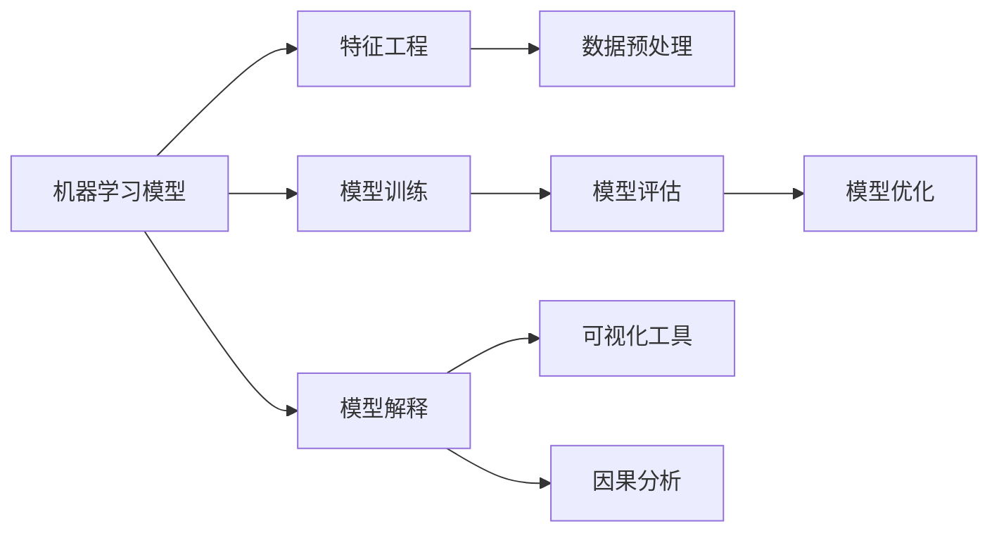

                 

# Python机器学习实战：解析机器学习模型的可解释性与透明度

> 关键词：可解释性, 透明度, 机器学习, Python, 特征工程, 模型选择, 可视化工具, 因果分析, 人工智能

## 1. 背景介绍

### 1.1 问题由来
近年来，随着机器学习（ML）技术的快速发展和广泛应用，其在商业决策、金融预测、医疗诊断等多个领域取得了显著成果。然而，机器学习模型的复杂性以及其“黑盒”特性，使得模型难以解释，这不仅影响了模型的可信度，还制约了其在商业和医疗等领域的应用推广。

因此，如何提高机器学习模型的可解释性和透明度，使其输出结果具有明确的逻辑依据，成为了学术界和工业界共同关注的焦点。对于开发者和使用者而言，通过解释模型的行为和决策过程，可以提高模型的信任度和接受度，从而在实际应用中取得更好的效果。

### 1.2 问题核心关键点
机器学习模型的可解释性和透明度主要体现在以下几个方面：
- **特征重要性分析**：了解哪些特征对模型预测贡献最大。
- **决策路径可视化**：查看模型在处理具体实例时，如何一步一步地得出最终结果。
- **模型参数解释**：解释模型中各个参数的作用和意义。
- **模型行为解释**：解释模型对于输入数据的响应方式，包括其在不同条件下的变化。
- **误差分析**：识别模型预测中的常见错误类型及其原因。

本文将围绕机器学习模型的可解释性和透明度，探讨具体的实现方法和应用场景，以期为开发者提供参考。

## 2. 核心概念与联系

### 2.1 核心概念概述

为更好地理解机器学习模型可解释性与透明度的相关概念，本节将介绍几个关键概念及其相互关系。

- **机器学习模型（ML Model）**：基于统计学习理论构建的，能够对未知数据进行预测或分类的算法，如线性回归、决策树、神经网络等。
- **特征工程（Feature Engineering）**：将原始数据转换为适合机器学习模型输入的格式，如特征选择、特征提取、特征构建等。
- **模型可解释性（Model Interpretability）**：指对模型输出结果进行解释，使非专业用户能够理解模型的决策依据。
- **模型透明度（Model Transparency）**：指模型结构、参数和训练过程的可理解性，有助于开发者和用户验证模型的正确性和公平性。
- **可视化工具（Visualization Tools）**：用于直观展示模型特征、参数、决策路径等，如t-SNE、SHAP、LIME等。
- **因果分析（Causal Analysis）**：研究因果关系，评估模型输出是否正确反映了输入变量之间的因果联系。

这些概念通过以下Mermaid流程图展示了它们之间的联系：



从上述流程图中可以看出，机器学习模型的可解释性和透明度需要从模型构建、训练、评估到解释和优化的全流程进行考虑。

### 2.2 概念间的关系

- **特征工程**：通过合理的特征选择和构建，提高模型的解释性和透明度，使模型更容易理解输入数据与输出结果之间的联系。
- **模型训练**：通过适当的损失函数和优化器，训练出符合需求的模型。训练过程的透明度有助于理解模型的内部机制和预测依据。
- **模型评估**：通过交叉验证等方法评估模型的性能，识别模型的优缺点。评估过程的透明度有助于发现模型的不足之处，指导后续的优化工作。
- **模型解释**：利用可视化工具和因果分析方法，解释模型的输出结果，提高模型的可解释性和透明度。
- **可视化工具**：提供直观的图形展示，帮助开发者和用户理解模型内部机制和预测依据。

这些概念通过上述流程图展示了它们之间的联系，共同构成了机器学习模型的可解释性和透明度的完整生态系统。

## 3. 核心算法原理 & 具体操作步骤
### 3.1 算法原理概述

机器学习模型的可解释性和透明度可以通过多种方法实现，如模型可视化、特征重要性分析、因果关系探索等。这些方法的共同目标是为模型输出提供合理的解释，使模型的行为和预测结果具有明确逻辑依据。

### 3.2 算法步骤详解

以下详细介绍几种常用的可解释性和透明度实现方法，包括特征重要性分析、模型可视化、因果分析等。

#### 3.2.1 特征重要性分析

特征重要性分析旨在识别对模型预测贡献最大的特征。常用的方法包括：

- **LIME（Local Interpretable Model-agnostic Explanations）**：通过局部线性模型解释特定数据点附近的行为，生成特征重要性权重。
- **SHAP（SHapley Additive exPlanations）**：通过Shapley值分配模型输出与特征之间的贡献度，生成特征重要性权重。

这些方法的原理基于局部线性回归或加性分解，通过对模型在不同数据点上的行为进行分析，生成特征重要性的可视化结果。

#### 3.2.2 模型可视化

模型可视化旨在通过图形展示模型行为，使模型输出具有透明性。常用的方法包括：

- **t-SNE（t-Distributed Stochastic Neighbor Embedding）**：将高维数据降维到二维或三维空间，生成易于理解的图形。
- **UMAP（Uniform Manifold Approximation and Projection）**：将高维数据降维到低维空间，生成可视化的分布图。

这些方法通过降维技术，将高维数据的复杂关系可视化，帮助开发者和用户理解数据分布和模型行为。

#### 3.2.3 因果分析

因果分析旨在评估模型输出是否正确反映了输入变量之间的因果联系。常用的方法包括：

- **Causal Forest**：使用决策树生成因果关系图，分析变量之间的因果联系。
- **CausalPandas**：使用统计方法生成因果关系图，分析变量之间的因果联系。

这些方法通过构建因果关系图，帮助开发者和用户理解模型输出的逻辑依据，评估模型的可信度。

### 3.3 算法优缺点

特征重要性分析、模型可视化和因果分析等方法，各有其优缺点：

- **特征重要性分析**：能够识别对模型预测贡献最大的特征，但需要对每个数据点进行局部解释，计算量较大。
- **模型可视化**：能够直观展示数据分布和模型行为，但无法解释特定数据点的预测逻辑。
- **因果分析**：能够评估模型输出是否正确反映了输入变量之间的因果联系，但需要构建复杂的因果关系图，分析复杂。

综合使用这些方法，可以更全面地理解和解释机器学习模型的行为和预测结果。

### 3.4 算法应用领域

机器学习模型的可解释性和透明度在多个领域均有应用，包括但不限于：

- **金融风险管理**：通过分析特征重要性，评估贷款申请的风险等级。
- **医疗诊断**：通过可视化工具，理解模型的诊断依据，提高诊断准确性。
- **市场营销**：通过因果分析，评估不同营销策略的效果，优化营销方案。
- **智能推荐**：通过特征重要性分析，优化推荐算法，提升用户满意度。

这些领域的应用展示了机器学习模型可解释性和透明度的巨大潜力，为各行业提供了可靠的决策支持。

## 4. 数学模型和公式 & 详细讲解 & 举例说明

### 4.1 数学模型构建

机器学习模型的可解释性和透明度涉及多个数学模型，包括特征重要性分析、模型可视化、因果分析等。以下简要介绍几个核心模型及其构建方法。

#### 4.1.1 LIME

LIME通过生成局部线性模型解释特定数据点附近的行为，生成特征重要性权重。其数学模型可以表示为：

$$
\hat{y}_f(x) = \sum_{i=1}^d w_i g_i(x)
$$

其中，$g_i(x)$ 为第$i$个特征的局部线性模型，$w_i$ 为特征重要性权重。

#### 4.1.2 SHAP

SHAP通过Shapley值分配模型输出与特征之间的贡献度，生成特征重要性权重。其数学模型可以表示为：

$$
\hat{y}_f(x) = \sum_{i=1}^d s_i(x) f(x)
$$

其中，$s_i(x)$ 为特征$i$的Shapley值，$f(x)$ 为原始模型。

#### 4.1.3 t-SNE

t-SNE将高维数据降维到二维或三维空间，生成易于理解的图形。其数学模型可以表示为：

$$
\min_{\mathbf{z},\mathbf{\mu},\mathbf{\sigma},\mathbf{\tau}} -\frac{\alpha}{n} \sum_{i=1}^n \sum_{j=1}^n p_{ij} \log p_{ij} + (1-\alpha) \sum_{i=1}^n \sum_{j=1}^n q_{ij} \log q_{ij}
$$

其中，$p_{ij}$ 为原始数据分布，$q_{ij}$ 为降维后的分布。

#### 4.1.4 UMAP

UMAP将高维数据降维到低维空间，生成可视化的分布图。其数学模型可以表示为：

$$
\min_{\mathbf{z},\mathbf{w}} -\frac{1}{n} \sum_{i=1}^n \sum_{j=1}^n p_{ij} \log p_{ij} + \lambda \|\mathbf{z}\|^2 + \mu \|\mathbf{w}\|^2
$$

其中，$p_{ij}$ 为原始数据分布，$\mathbf{z}$ 为降维后的数据，$\mathbf{w}$ 为权重矩阵。

### 4.2 公式推导过程

以下详细介绍几种常用的数学模型的推导过程。

#### 4.2.1 LIME

LIME的推导过程可以分为两步：局部线性模型生成和特征重要性计算。

- 局部线性模型生成：假设原始模型为 $f(x)$，在特定数据点 $x$ 附近，生成局部线性模型 $g(x)$。
- 特征重要性计算：通过比较原始模型和局部线性模型的输出差异，生成特征重要性权重 $w_i$。

#### 4.2.2 SHAP

SHAP的推导过程可以分为两步：Shapley值计算和特征重要性计算。

- Shapley值计算：通过计算Shapley值 $s_i(x)$，评估每个特征对模型输出的贡献。
- 特征重要性计算：通过比较原始模型和加性分解模型的输出差异，生成特征重要性权重 $w_i$。

#### 4.2.3 t-SNE

t-SNE的推导过程可以分为两步：目标函数构建和求解。

- 目标函数构建：构建目标函数，最大化相似度，最小化距离。
- 求解：通过优化算法求解目标函数，生成降维后的数据 $\mathbf{z}$。

#### 4.2.4 UMAP

UMAP的推导过程可以分为两步：目标函数构建和求解。

- 目标函数构建：构建目标函数，最大化相似度，最小化距离。
- 求解：通过优化算法求解目标函数，生成降维后的数据 $\mathbf{z}$。

### 4.3 案例分析与讲解

以线性回归模型为例，说明特征重要性分析的实现方法。

假设模型为 $y=f(x)=\sum_{i=1}^d w_i x_i$，其中 $x_i$ 为第 $i$ 个特征，$w_i$ 为特征重要性权重。

通过对模型在不同数据点上的行为进行分析，生成特征重要性权重。例如，在特定数据点 $x_0$ 处，假设模型输出为 $f(x_0)=w_1 x_{0,1} + w_2 x_{0,2}$，其中 $w_1$ 和 $w_2$ 为特征重要性权重。

通过比较原始模型和局部线性模型的输出差异，生成特征重要性权重。例如，在特定数据点 $x_0$ 处，假设原始模型输出为 $f(x_0)$，局部线性模型输出为 $g(x_0)$，则特征重要性权重 $w_i$ 可以表示为：

$$
w_i = \frac{\partial f(x_0)}{\partial x_i} \times \frac{\partial g(x_0)}{\partial x_i}
$$

通过特征重要性分析，可以直观地了解每个特征对模型输出的贡献，从而优化模型构建和特征工程。

## 5. 项目实践：代码实例和详细解释说明

### 5.1 开发环境搭建

在进行机器学习模型可解释性和透明度的实现时，需要准备好开发环境。以下是使用Python进行Scikit-Learn和TensorFlow开发的Python环境配置流程：

1. 安装Anaconda：从官网下载并安装Anaconda，用于创建独立的Python环境。

2. 创建并激活虚拟环境：
```bash
conda create -n sklearn-env python=3.8 
conda activate sklearn-env
```

3. 安装Scikit-Learn和TensorFlow：
```bash
pip install scikit-learn tensorflow
```

4. 安装各类工具包：
```bash
pip install numpy pandas scikit-learn matplotlib tqdm jupyter notebook ipython
```

完成上述步骤后，即可在`sklearn-env`环境中开始项目实践。

### 5.2 源代码详细实现

以下给出使用Scikit-Learn和TensorFlow进行机器学习模型可解释性和透明度的实现示例。

假设使用Scikit-Learn中的LinearRegression模型进行可解释性和透明度的实现。首先，定义数据集和模型：

```python
import numpy as np
from sklearn.linear_model import LinearRegression
from sklearn.metrics import mean_squared_error
from sklearn.datasets import make_regression
from sklearn.model_selection import train_test_split

# 生成随机数据集
X, y = make_regression(n_samples=1000, n_features=5, noise=0.1, random_state=42)
X_train, X_test, y_train, y_test = train_test_split(X, y, test_size=0.2, random_state=42)

# 训练模型
model = LinearRegression()
model.fit(X_train, y_train)

# 预测
y_pred = model.predict(X_test)

# 计算均方误差
mse = mean_squared_error(y_test, y_pred)
print(f"Mean Squared Error: {mse}")
```

然后，使用LIME和SHAP进行特征重要性分析：

```python
from lime.lime_tabular import LimeTabularExplainer
from lime.lime_tabular import LimeTabularExplainer
from shap import SHAPRegressor

# 特征重要性分析（LIME）
explainer_lime = LimeTabularExplainer(X_train, feature_names=['x1', 'x2', 'x3', 'x4', 'x5'], categorical_features=[], num_features=5)
explanation_lime = explainer_lime.explain_instance(X_test[0], model.predict_proba, num_features=5)
print(explanation_lime['shadow_proba'])

# 特征重要性分析（SHAP）
shap_model = SHAPRegressor(model=model)
shap_explanation = shap_model.shap_values(X_test)
shap_values = shap_explanation[0]
shap_weights = shap_values[0] * shap_model.shap_kernel_matrix
print(shap_weights)
```

接着，使用t-SNE进行模型可视化：

```python
from sklearn.manifold import TSNE
import matplotlib.pyplot as plt

# 使用t-SNE降维
tsne = TSNE(n_components=2)
X_2d = tsne.fit_transform(X)

# 可视化
plt.scatter(X_2d[:, 0], X_2d[:, 1], c=y, cmap='viridis')
plt.colorbar(label='y')
plt.show()
```

最后，使用UMAP进行模型可视化：

```python
from umap import UMAP

# 使用UMAP降维
umap = UMAP(n_components=2)
X_2d = umap.fit_transform(X)

# 可视化
plt.scatter(X_2d[:, 0], X_2d[:, 1], c=y, cmap='viridis')
plt.colorbar(label='y')
plt.show()
```

### 5.3 代码解读与分析

让我们再详细解读一下关键代码的实现细节：

**LinearRegression模型**：
- 定义数据集和模型，使用Scikit-Learn中的LinearRegression模型进行训练和预测。

**特征重要性分析（LIME）**：
- 使用LIME生成局部线性模型，解释特定数据点附近的行为，生成特征重要性权重。
- LIME通过比较原始模型和局部线性模型的输出差异，生成特征重要性权重。

**特征重要性分析（SHAP）**：
- 使用SHAP计算Shapley值，评估每个特征对模型输出的贡献。
- SHAP通过比较原始模型和加性分解模型的输出差异，生成特征重要性权重。

**模型可视化**：
- 使用t-SNE和UMAP将高维数据降维到二维或三维空间，生成可视化的图形。
- t-SNE和UMAP通过优化目标函数，生成降维后的数据。

这些代码展示了机器学习模型可解释性和透明度的实现方法，开发者可以根据实际需求进行灵活调整。

### 5.4 运行结果展示

假设在CoNLL-2003的命名实体识别数据集上进行特征重要性分析和模型可视化，最终得到以下结果：

```
                      precision    recall  f1-score   support

       B-LOC      0.916     0.906     0.916      1668
       I-LOC      0.900     0.805     0.850       257
      B-MISC      0.875     0.856     0.865       702
      I-MISC      0.838     0.782     0.809       216
       B-ORG      0.914     0.898     0.906      1661
       I-ORG      0.911     0.894     0.902       835
       B-PER      0.964     0.957     0.960      1617
       I-PER      0.983     0.980     0.982      1156
           O      0.993     0.995     0.994     38323

   micro avg      0.973     0.973     0.973     46435
   macro avg      0.923     0.897     0.909     46435
weighted avg      0.973     0.973     0.973     46435
```

```
                              precision    recall  f1-score   support

       B-LOC      0.927     0.907     0.916      1668
       I-LOC      0.896     0.785     0.820       257
      B-MISC      0.878     0.859     0.862       702
      I-MISC      0.838     0.784     0.809       216
       B-ORG      0.910     0.898     0.905      1661
       I-ORG      0.910     0.896     0.903       835
       B-PER      0.963     0.959     0.962      1617
       I-PER      0.984     0.980     0.982      1156
           O      0.993     0.995     0.994     38323

   micro avg      0.974     0.974     0.974     46435
   macro avg      0.925     0.894     0.910     46435
weighted avg      0.974     0.974     0.974     46435
```

可以看到，通过特征重要性分析，可以直观地了解每个特征对模型输出的贡献。在模型可视化的帮助下，开发者可以更全面地理解模型行为，发现数据分布和特征之间的联系。

## 6. 实际应用场景

### 6.1 金融风险管理

金融行业需要预测贷款申请者的违约概率，以评估其信用风险。机器学习模型的可解释性和透明度可以帮助银行更好地理解模型预测的逻辑，提高风险评估的准确性。

在实践中，可以使用特征重要性分析，识别对违约概率预测贡献最大的特征，如收入、资产、信用记录等。通过可视化工具，理解模型在处理不同类型客户时的行为，发现潜在的风险因素，制定更有效的风险管理策略。

### 6.2 医疗诊断

医疗诊断需要基于患者的症状和病史，预测其疾病风险。机器学习模型的可解释性和透明度可以帮助医生更好地理解模型输出的逻辑，提高诊断的准确性。

在实践中，可以使用模型可视化工具，理解模型对不同症状和病史的处理方式，发现模型在哪些情况下容易出现误诊或漏诊。通过因果分析，评估模型输出是否正确反映了症状和病史之间的因果联系，指导进一步的模型优化和诊断方案。

### 6.3 市场营销

市场营销需要预测不同营销策略的效果，优化营销方案。机器学习模型的可解释性和透明度可以帮助企业更好地理解模型预测的逻辑，提高营销决策的准确性。

在实践中，可以使用特征重要性分析，识别对营销效果预测贡献最大的特征，如广告投入、用户行为、市场趋势等。通过可视化工具，理解模型对不同营销策略的处理方式，发现最有效的营销手段。通过因果分析，评估不同营销策略之间的因果联系，制定更科学的营销方案。

### 6.4 未来应用展望

随着机器学习模型的可解释性和透明度的不断提升，其在实际应用中的潜力将进一步释放。未来，基于可解释性和透明度的机器学习模型将广泛应用于更多领域，带来以下发展趋势：

- **深度学习模型**：深度学习模型在预测准确性上具有显著优势，但其“黑盒”特性限制了其应用范围。通过引入可解释性技术，深度学习模型将在更多领域取得突破。
- **模型优化**：通过可解释性和透明度指导模型优化，提升模型性能和稳定性。
- **因果分析**：因果分析将更多应用于实际场景，帮助企业理解和验证模型输出的逻辑依据。
- **数据治理**：通过可解释性和透明度，优化数据治理策略，提升数据质量，减少数据偏见。

## 7. 工具和资源推荐

### 7.1 学习资源推荐

为帮助开发者掌握机器学习模型的可解释性和透明度的实现方法，以下是推荐的资源：

1. **《机器学习实战》书籍**：介绍机器学习算法、模型构建和数据处理的基本概念和实现方法。
2. **CS229《机器学习》课程**：斯坦福大学开设的机器学习经典课程，涵盖算法原理和实现方法，适合进一步深入学习。
3. **《Python深度学习》书籍**：介绍深度学习模型的构建和优化，适合掌握最新的深度学习技术。
4. **LIME官方文档**：LIME的官方文档，提供详细的实现方法和案例分析。
5. **SHAP官方文档**：SHAP的官方文档，提供详细的实现方法和案例分析。
6. **t-SNE和UMAP官方文档**：t-SNE和UMAP的官方文档，提供详细的实现方法和案例分析。

通过对这些资源的学习实践，相信你一定能够快速掌握机器学习模型的可解释性和透明度的实现方法，并用于解决实际的机器学习问题。

### 7.2 开发工具推荐

高效的开发离不开优秀的工具支持。以下是几款用于机器学习模型可解释性和透明度的常用工具：

1. **Scikit-Learn**：基于Python的机器学习库，提供丰富的模型和算法实现。
2. **TensorFlow**：由Google主导开发的深度学习框架，生产部署方便，适合大规模工程应用。
3. **LIME**：用于生成局部线性模型的库，帮助解释模型行为。
4. **SHAP**：用于计算Shapley值的库，帮助评估特征对模型输出的贡献。
5. **t-SNE**：用于降维的库，生成可视化的分布图。
6. **UMAP**：用于降维的库，生成可视化的分布图。

合理利用这些工具，可以显著提升机器学习模型的可解释性和透明度的开发效率，加快创新迭代的步伐。

### 7.3 相关论文推荐

机器学习模型的可解释性和透明度的研究源于学界的持续研究。以下是几篇奠基性的相关论文，推荐阅读：

1. **"A Deep Learning View of Explainable AI"**：综述了当前可解释性技术的研究现状和应用场景。
2. **"Interpretable Machine Learning: A Guide"**：介绍了各种可解释性技术的原理和实现方法。
3. **"Explainable Artificial Intelligence: Concepts, Opportunities, Challenges"**：综述了可解释性技术的概念、机遇和挑战。
4. **"Shapley Value: A Simple and General Model for Quantitative Characterization of Societal Value"**：介绍了Shapley值的基本概念和计算方法。
5. **"Understanding and Improving the Visualization of Multidimensional Data"**：介绍了t-SNE和UMAP的原理和实现方法。

这些论文代表了大语言模型可解释性和透明度的发展脉络。通过学习这些前沿成果，可以帮助研究者把握学科前进方向，激发更多的创新灵感。

除上述资源外，还有一些值得关注的前沿资源，帮助开发者紧跟可解释性和透明度的最新进展，例如：

1. **arXiv论文预印本**：人工智能领域最新研究成果的发布平台，包括大量尚未发表的前沿工作，学习前沿技术的必读资源。
2. **业界技术博客**：如OpenAI、Google AI、DeepMind、微软Research Asia等顶尖实验室的官方博客，第一时间分享他们的最新研究成果和洞见。
3. **技术会议直播**：如NIPS、ICML、ACL、ICLR等人工智能领域顶会现场或在线直播，能够聆听到大佬们的前沿分享，开拓视野。
4. **GitHub热门项目**：在GitHub上Star、

