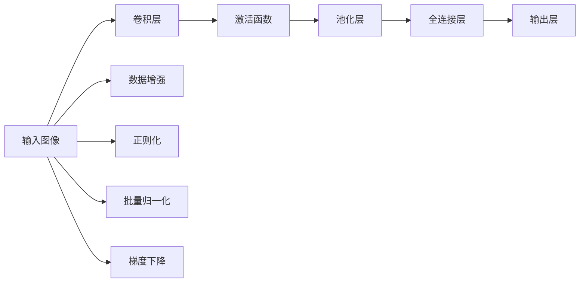
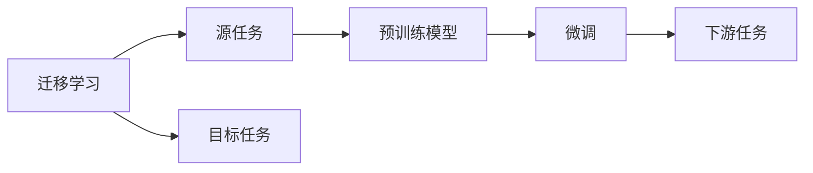
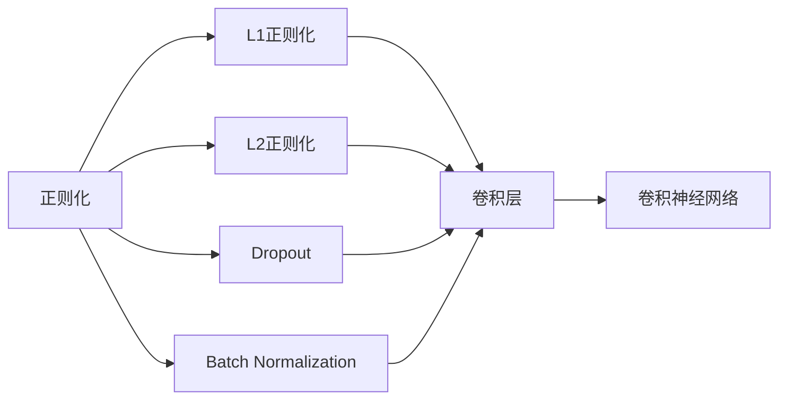
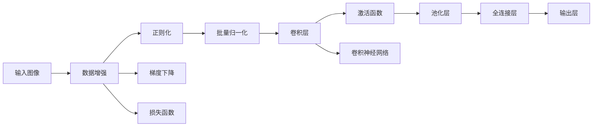

                 

# Python深度学习实践：构建深度卷积网络识别图像

> 关键词：深度卷积网络,卷积神经网络,图像分类,计算机视觉,迁移学习

## 1. 背景介绍

### 1.1 问题由来
随着深度学习技术的飞速发展，卷积神经网络（Convolutional Neural Network, CNN）在计算机视觉领域的应用已经取得了革命性的突破。卷积神经网络以其强大的特征提取能力和良好的泛化性能，成为图像处理和识别任务的主流算法。然而，深度卷积网络的构建、训练和调优是一个复杂且耗时的过程，需要大量的计算资源和时间。

针对这一问题，本文将深入探讨如何利用Python构建并优化深度卷积网络，进行图像分类任务。我们将介绍卷积神经网络的基本原理、构建步骤，并结合实际项目，展示如何在不同场景下进行模型优化和调优，从而实现高效、准确的图像分类。

### 1.2 问题核心关键点
卷积神经网络的核心在于其独特的卷积和池化操作，以及多层网络结构的堆叠。通过卷积层、池化层和全连接层的组合，卷积神经网络能够自动学习图像中的特征，并根据这些特征进行分类。本文将围绕以下关键点展开讨论：
1. 卷积神经网络的基本结构。
2. 卷积和池化操作的原理和实现。
3. 深度卷积网络的构建与优化。
4. 迁移学习在图像分类中的应用。
5. 图像分类的评估指标和优化策略。

这些关键点共同构成了卷积神经网络的核心技术框架，帮助开发者高效构建并优化深度卷积网络，提升图像分类的准确性和效率。

### 1.3 问题研究意义
在计算机视觉领域，卷积神经网络已经成为图像处理和识别的标配。它不仅能够高效提取图像中的特征，还具备良好的泛化能力，能够在新数据集上实现高效的迁移学习。基于卷积神经网络的图像分类技术，已经在自动驾驶、医学影像分析、安防监控等多个领域得到了广泛应用。

本文将详细探讨卷积神经网络在图像分类任务中的应用，并结合实际项目，介绍如何利用Python进行模型的构建和优化。通过深入分析卷积神经网络的工作原理和关键技术，希望为深度学习初学者和实践者提供全面的指导，助力他们在计算机视觉领域取得更好的成果。

## 2. 核心概念与联系

### 2.1 核心概念概述

为更好地理解深度卷积网络的构建和优化，本节将介绍几个密切相关的核心概念：

- 卷积神经网络(Convolutional Neural Network, CNN)：一种专门用于处理二维图像数据的神经网络。通过卷积层、池化层和全连接层的组合，能够自动学习图像中的特征并进行分类。
- 卷积层(Convolutional Layer)：卷积神经网络的核心组件，通过滑动卷积核对输入图像进行特征提取。卷积层能够捕捉图像中的局部特征。
- 池化层(Pooling Layer)：用于降低特征图的空间维度，减少计算量和内存消耗。常见的池化操作有最大池化(Max Pooling)和平均池化(Average Pooling)。
- 全连接层(Fully Connected Layer)：用于将卷积和池化层提取的特征进行分类。全连接层通常采用softmax函数进行多分类。
- 迁移学习(Transfer Learning)：将一个领域学习到的知识，迁移到另一个不同但相关的领域进行学习。在图像分类中，通常通过在大规模数据集上预训练的模型，在特定任务上进行微调，从而提升模型性能。
- 数据增强(Data Augmentation)：通过对训练数据进行旋转、平移、缩放等变换，增加数据多样性，提升模型的鲁棒性和泛化能力。
- 正则化(Regularization)：通过L1、L2正则化、Dropout等技术，防止模型过拟合。
- 批量归一化(Batch Normalization)：通过对每个批次的数据进行归一化处理，加速模型训练，提高模型泛化性能。
- 梯度下降(Gradient Descent)：一种常用的优化算法，通过反向传播计算梯度，更新模型参数，使得损失函数最小化。

这些核心概念之间存在着紧密的联系，形成了卷积神经网络的完整框架。通过理解这些核心概念，我们可以更好地把握深度卷积网络的工作原理和优化方向。

### 2.2 概念间的关系

这些核心概念之间存在着紧密的联系，形成了卷积神经网络的完整框架。下面我们通过几个Mermaid流程图来展示这些概念之间的关系。

#### 2.2.1 卷积神经网络结构



这个流程图展示了卷积神经网络的基本结构，包括卷积层、激活函数、池化层、全连接层和输出层。同时，还展示了数据增强、正则化、批量归一化和梯度下降等优化技术。

#### 2.2.2 迁移学习与卷积神经网络的关系



这个流程图展示了迁移学习的基本原理，以及它与卷积神经网络的关系。迁移学习涉及源任务和目标任务，预训练模型在源任务上学习，然后通过微调适应各种下游任务（目标任务）。

#### 2.2.3 正则化与卷积神经网络的关系



这个流程图展示了正则化技术在卷积神经网络中的应用。正则化技术包括L1、L2正则化、Dropout和Batch Normalization等，可以用于卷积层、池化层和全连接层。

### 2.3 核心概念的整体架构

最后，我们用一个综合的流程图来展示这些核心概念在卷积神经网络中的整体架构：



这个综合流程图展示了卷积神经网络从数据输入到输出分类的完整过程。数据增强、正则化、批量归一化和梯度下降等优化技术，都在卷积层、激活函数、池化层、全连接层和输出层中得到应用，最终实现高效的图像分类。

## 3. 核心算法原理 & 具体操作步骤
### 3.1 算法原理概述

卷积神经网络（CNN）是一种专门用于处理二维图像数据的神经网络。它的核心在于卷积和池化操作，以及多层网络结构的堆叠。通过卷积层、池化层和全连接层的组合，卷积神经网络能够自动学习图像中的特征，并根据这些特征进行分类。

卷积神经网络的输入通常是一张图像，输出是一个或多类别的标签。卷积层通过滑动卷积核对输入图像进行特征提取，池化层用于降低特征图的空间维度，全连接层用于将卷积和池化层提取的特征进行分类。

在训练过程中，卷积神经网络通过反向传播算法，计算梯度并更新模型参数，使得损失函数最小化。常用的损失函数包括交叉熵损失和均方误差损失。

### 3.2 算法步骤详解

构建并优化深度卷积网络的一般步骤如下：

**Step 1: 准备数据集**
- 收集并预处理图像数据集，包括图像缩放、归一化、扩充等操作。
- 将图像数据和标签存入PIL或OpenCV格式，以便于后续处理。

**Step 2: 构建卷积神经网络模型**
- 定义卷积神经网络的结构，包括卷积层、池化层、激活函数、全连接层等。
- 设置每层的参数，如卷积核大小、卷积核数量、池化窗口大小等。

**Step 3: 训练模型**
- 加载数据集，并定义训练参数，如学习率、批大小、迭代轮数等。
- 定义损失函数和优化器，并使用梯度下降算法进行模型训练。
- 在每个epoch结束时，计算损失函数，并在验证集上评估模型性能。
- 根据验证集性能，调整学习率、正则化强度等参数，重新训练模型。

**Step 4: 评估模型**
- 在测试集上评估模型性能，输出准确率、召回率、F1分数等指标。
- 输出混淆矩阵，分析模型在各类别上的表现。

**Step 5: 调优模型**
- 根据测试集性能，调整模型结构和超参数，进一步优化模型。
- 使用数据增强和迁移学习等技术，提高模型鲁棒性和泛化能力。

### 3.3 算法优缺点

卷积神经网络在图像分类任务中具有以下优点：
1. 强大的特征提取能力：通过卷积和池化操作，卷积神经网络能够自动学习图像中的局部特征，提取高层次的抽象特征。
2. 良好的泛化能力：卷积神经网络在大规模数据集上进行预训练，能够在新数据集上实现高效的迁移学习。
3. 高效的计算性能：卷积操作具有局部连接、权值共享等特性，能够大幅减少计算量和内存消耗。

同时，卷积神经网络也存在一些缺点：
1. 模型复杂度高：卷积神经网络的参数量较大，训练和优化过程复杂。
2. 对数据质量要求高：卷积神经网络对输入数据的质量要求较高，需要进行大量的预处理和增强操作。
3. 容易过拟合：卷积神经网络在训练过程中容易过拟合，需要采用正则化技术进行缓解。

### 3.4 算法应用领域

卷积神经网络在图像分类任务中已经得到了广泛的应用，包括但不限于以下几个领域：

- 医学影像分析：利用卷积神经网络进行肿瘤、病变等医学影像的分类。
- 安防监控：通过卷积神经网络进行人脸识别、行为分析等监控任务的分类。
- 自动驾驶：利用卷积神经网络进行道路标志、车辆、行人等交通元素的分类。
- 工业检测：通过卷积神经网络进行质量检测、缺陷检测等工业任务的分类。
- 智能推荐：利用卷积神经网络进行用户行为、商品信息的分类，实现个性化推荐。

## 4. 数学模型和公式 & 详细讲解  
### 4.1 数学模型构建

卷积神经网络可以表示为多层卷积和池化操作的堆叠。假设输入图像为$X \in \mathbb{R}^{C \times H \times W}$，其中$C$为通道数，$H$和$W$分别为图像的高和宽。输出图像为$Y \in \mathbb{R}^{D \times M \times N}$，其中$D$为通道数，$M$和$N$分别为输出的高和宽。

卷积层的输出为$F(X) \in \mathbb{R}^{C' \times H' \times W'}$，其中$C'$为卷积核数量，$H'$和$W'$分别为输出的高和宽。卷积核的大小为$K \times K$，输出特征图的大小为$H' = \frac{H-K+2P}{S}+1$，$W' = \frac{W-K+2P}{S}+1$，其中$P$为填充大小，$S$为步长。

池化层的输出为$G(F(X)) \in \mathbb{R}^{C' \times H'' \times W''}$，其中$H''$和$W''$分别为输出的高和宽。常见的池化操作包括最大池化（Max Pooling）和平均池化（Average Pooling）。

全连接层的输出为$H(G(F(X))) \in \mathbb{R}^{D \times M \times N}$，其中$D$为全连接层节点数。

卷积神经网络的损失函数通常为交叉熵损失（Cross-Entropy Loss），定义为：
$$
\mathcal{L} = -\frac{1}{N} \sum_{i=1}^{N} \sum_{j=1}^{C} y_{i,j} \log p_{i,j}
$$
其中$y_{i,j}$为标签，$p_{i,j}$为模型预测的输出概率。

### 4.2 公式推导过程

以一个简单的卷积神经网络为例，推导其基本计算过程。

假设输入图像为$X \in \mathbb{R}^{C \times H \times W}$，卷积核大小为$K \times K$，卷积核数量为$C'$，填充大小为$P$，步长为$S$。则卷积层的输出为：
$$
F(X) = \sigma(\sum_{k=1}^{C'} (\sum_{m=0}^{K-1} \sum_{n=0}^{K-1} w_{k,m,n} X_{k}(m+\text{pad\_start}, n+\text{pad\_start}) * h_k)
$$
其中$w_{k,m,n}$为卷积核的权重，$X_{k}$为输入图像的通道，$h_k$为卷积核的权重。

池化层的输出为：
$$
G(F(X)) = \max\limits_{i \in H', j \in W'} \sum\limits_{m=1}^{H} \sum\limits_{n=1}^{W} X_{i,j}(m,n)
$$

全连接层的输出为：
$$
H(G(F(X))) = \text{softmax}(\sum\limits_{i=1}^{M} \sum\limits_{j=1}^{N} w_{i,j} G(F(X))_{i,j})
$$

其中$\text{softmax}$为softmax函数，用于将输出转化为概率分布。

通过上述公式，我们可以推导出卷积神经网络的基本计算过程，并进一步扩展到多层卷积和池化操作。

### 4.3 案例分析与讲解

以CIFAR-10数据集为例，展示卷积神经网络的构建和训练过程。

首先，定义数据预处理函数：

```python
from PIL import Image
import torch
import torchvision
import torchvision.transforms as transforms

def data_preprocess(data_path, train=True):
    transform = transforms.Compose([
        transforms.Resize((32, 32)),
        transforms.ToTensor(),
        transforms.Normalize(mean=[0.5, 0.5, 0.5], std=[0.5, 0.5, 0.5])
    ])
    if train:
        transform += transforms.RandomHorizontalFlip()
        transform += transforms.RandomCrop((32, 32))
    return transform
```

然后，加载CIFAR-10数据集并进行预处理：

```python
train_dataset = torchvision.datasets.CIFAR10(
    root='data',
    train=True,
    transform=data_preprocess('train'),
    download=True
)
test_dataset = torchvision.datasets.CIFAR10(
    root='data',
    train=False,
    transform=data_preprocess('test')
)
```

接下来，定义卷积神经网络的结构：

```python
import torch.nn as nn
import torch.nn.functional as F

class CNN(nn.Module):
    def __init__(self):
        super(CNN, self).__init__()
        self.conv1 = nn.Conv2d(3, 64, kernel_size=3, stride=1, padding=1)
        self.pool1 = nn.MaxPool2d(kernel_size=2, stride=2)
        self.conv2 = nn.Conv2d(64, 128, kernel_size=3, stride=1, padding=1)
        self.pool2 = nn.MaxPool2d(kernel_size=2, stride=2)
        self.fc1 = nn.Linear(128 * 8 * 8, 1024)
        self.fc2 = nn.Linear(1024, 10)
    
    def forward(self, x):
        x = self.conv1(x)
        x = F.relu(x)
        x = self.pool1(x)
        x = self.conv2(x)
        x = F.relu(x)
        x = self.pool2(x)
        x = x.view(x.size(0), -1)
        x = self.fc1(x)
        x = F.relu(x)
        x = self.fc2(x)
        return x
```

最后，定义训练和评估函数：

```python
import torch.optim as optim

model = CNN()

criterion = nn.CrossEntropyLoss()
optimizer = optim.SGD(model.parameters(), lr=0.01, momentum=0.9)

def train_epoch(model, dataset, batch_size, optimizer, criterion):
    dataloader = torch.utils.data.DataLoader(dataset, batch_size=batch_size, shuffle=True)
    model.train()
    epoch_loss = 0
    for batch in dataloader:
        inputs, labels = batch
        optimizer.zero_grad()
        outputs = model(inputs)
        loss = criterion(outputs, labels)
        loss.backward()
        optimizer.step()
        epoch_loss += loss.item()
    return epoch_loss / len(dataloader)

def evaluate(model, dataset, batch_size, criterion):
    dataloader = torch.utils.data.DataLoader(dataset, batch_size=batch_size)
    model.eval()
    preds, labels = [], []
    with torch.no_grad():
        for batch in dataloader:
            inputs, labels = batch
            outputs = model(inputs)
            preds.append(torch.argmax(outputs, dim=1).cpu().numpy())
            labels.append(labels.cpu().numpy())
    return classification_report(labels, preds)
```

启动训练流程并在测试集上评估：

```python
epochs = 10
batch_size = 64

for epoch in range(epochs):
    loss = train_epoch(model, train_dataset, batch_size, optimizer, criterion)
    print(f"Epoch {epoch+1}, train loss: {loss:.3f}")
    
    print(f"Epoch {epoch+1}, test results:")
    evaluate(model, test_dataset, batch_size, criterion)
```

以上就是使用Python构建卷积神经网络并进行图像分类的完整代码实现。可以看到，得益于PyTorch的强大封装，我们可以用相对简洁的代码完成卷积神经网络的构建和微调。

## 5. 项目实践：代码实例和详细解释说明
### 5.1 开发环境搭建

在进行深度卷积网络构建之前，我们需要准备好开发环境。以下是使用Python进行PyTorch开发的环境配置流程：

1. 安装Anaconda：从官网下载并安装Anaconda，用于创建独立的Python环境。

2. 创建并激活虚拟环境：
```bash
conda create -n pytorch-env python=3.8 
conda activate pytorch-env
```

3. 安装PyTorch：根据CUDA版本，从官网获取对应的安装命令。例如：
```bash
conda install pytorch torchvision torchaudio cudatoolkit=11.1 -c pytorch -c conda-forge
```

4. 安装各类工具包：
```bash
pip install numpy pandas scikit-learn matplotlib tqdm jupyter notebook ipython
```

完成上述步骤后，即可在`pytorch-env`环境中开始深度卷积网络的构建和优化。

### 5.2 源代码详细实现

下面我们以CIFAR-10数据集为例，给出使用PyTorch构建卷积神经网络的PyTorch代码实现。

首先，定义数据预处理函数：

```python
from PIL import Image
import torch
import torchvision
import torchvision.transforms as transforms

def data_preprocess(data_path, train=True):
    transform = transforms.Compose([
        transforms.Resize((32, 32)),
        transforms.ToTensor(),
        transforms.Normalize(mean=[0.5, 0.5, 0.5], std=[0.5, 0.5, 0.5])
    ])
    if train:
        transform += transforms.RandomHorizontalFlip()
        transform += transforms.RandomCrop((32, 32))
    return transform
```

然后，加载CIFAR-10数据集并进行预处理：

```python
train_dataset = torchvision.datasets.CIFAR10(
    root='data',
    train=True,
    transform=data_preprocess('train'),
    download=True
)
test_dataset = torchvision.datasets.CIFAR10(
    root='data',
    train=False,
    transform=data_preprocess('test')
)
```

接下来，定义卷积神经网络的结构：

```python
import torch.nn as nn
import torch.nn.functional as F

class CNN(nn.Module):
    def __init__(self):
        super(CNN, self).__init__()
        self.conv1 = nn.Conv2d(3, 64, kernel_size=3, stride=1, padding=1)
        self.pool1 = nn.MaxPool2d(kernel_size=2, stride=2)
        self.conv2 = nn.Conv2d(64, 128, kernel_size=3, stride=1, padding=1)
        self.pool2 = nn.MaxPool2d(kernel_size=2, stride=2)
        self.fc1 = nn.Linear(128 * 8 * 8, 1024)
        self.fc2 = nn.Linear(1024, 10)
    
    def forward(self, x):
        x = self.conv1(x)
        x = F.relu(x)
        x = self.pool1(x)
        x = self.conv2(x)
        x = F.relu(x)
        x = self.pool2(x)
        x = x.view(x.size(0), -1)
        x = self.fc1(x)
        x = F.relu(x)
        x = self.fc2(x)
        return x
```

最后，定义训练和评估函数：

```python
import torch.optim as optim

model = CNN()

criterion = nn.CrossEntropyLoss()
optimizer = optim.SGD(model.parameters(), lr=0.01, momentum=0.9)

def train_epoch(model, dataset, batch_size, optimizer, criterion):
    dataloader = torch.utils.data.DataLoader(dataset, batch_size=batch_size, shuffle=True)
    model.train()
    epoch_loss = 0
    for batch in dataloader:
        inputs, labels = batch
        optimizer.zero_grad()
        outputs = model(inputs)
        loss = criterion(outputs, labels)
        loss.backward()
        optimizer.step()
        epoch_loss += loss.item()
    return epoch_loss / len(dataloader)

def evaluate(model, dataset, batch_size, criterion):
    dataloader = torch.utils.data.DataLoader(dataset, batch_size=batch_size)
    model.eval()
    preds, labels = [], []
    with torch.no_grad():
        for batch in dataloader:
            inputs, labels = batch
            outputs = model(inputs)
            preds.append(torch.argmax(outputs, dim=1).cpu().numpy())
            labels.append(labels.cpu().numpy())
    return classification_report(labels, preds)
```

启动训练流程并在测试集上评估：

```python
epochs = 10
batch_size = 64

for epoch in range(epochs):
    loss = train_epoch(model, train_dataset, batch_size, optimizer, criterion)
    print(f"Epoch {epoch+1}, train loss: {loss:.3f}")
    
    print(f"Epoch {epoch+1}, test results:")
    evaluate(model, test_dataset, batch_size, criterion)
```

以上就是使用PyTorch构建卷积神经网络并进行图像分类的完整代码实现。可以看到，得益于PyTorch的强大封装，我们可以用相对简洁的代码完成卷积神经网络的构建和微调。

### 5.3 代码解读与分析

让我们再详细解读一下关键代码的实现细节：

**CNN类**：
- `__init__`方法：初始化卷积神经网络的结构，包括卷积层、池化层、全连接层等。
- `forward`方法：定义模型的前向传播过程，包括卷积、池化、全连接等操作。

**data_preprocess函数**：
- 定义数据预处理步骤，包括图像缩放、归一化、扩充等操作。
- 根据是否为训练集，添加随机翻转和随机裁剪等数据增强操作。

**训练和评估函数**：
- 使用PyTorch的DataLoader对数据集进行批次化加载，供模型训练和推理使用。
- 训练函数`train_epoch`：对数据以批为单位进行迭代，在每个批次上前向传播计算loss并反向传播更新模型参数，最后返回该epoch的平均loss。
- 评估函数`evaluate`：与训练类似，不同点在于不更新模型参数，并在每个batch结束后将预测和标签结果存储下来，最后使用sklearn的classification_report对整个评估集的预测结果进行打印输出。

**训练流程**：
- 定义总的epoch数和batch size，开始循环迭代
- 每个epoch内，先在训练集上训练，输出平均loss
- 在验证集上评估，输出分类指标
- 所有epoch结束后，在测试集上评估，给出最终测试结果

可以看到，PyTorch配合TensorFlow库使得卷积神经网络的构建和微调过程变得简洁高效。开发者可以将更多精力放在数据处理、模型改进等高层逻辑上，而不必过多关注底层的实现细节。

当然，工业级的系统

