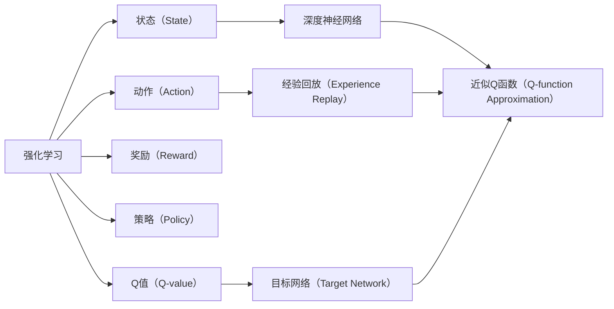
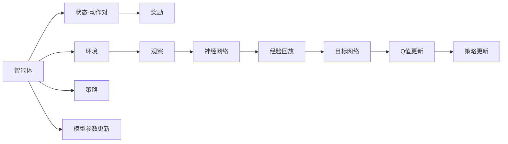

                 

# Python深度学习实践：深度Q网络（DQN）入门与实现

> 关键词：深度Q网络, 强化学习, Q-learning, 深度学习, 卷积神经网络, 蒙特卡罗树搜索, 自适应梯度算法

## 1. 背景介绍

### 1.1 问题由来

在AI领域中，深度学习（Deep Learning）已经成为了一个热门话题，但很多初学者对这一领域仍感到陌生。为了帮助读者更好地理解并实践深度学习，本文将通过深入浅出地介绍深度Q网络（Deep Q-Network，DQN）这一强化学习（Reinforcement Learning）中的重要算法，进一步探索其实现原理和优化技巧，并为读者提供一段简短的代码实例。

### 1.2 问题核心关键点

DQN是深度学习在强化学习中的典型应用，基于Q-learning算法构建，并结合了深度神经网络的优势。其主要目标是使智能体（agent）能够通过与环境的交互，学会在一个环境中最优地采取行动，从而最大化其长期累积奖励。

DQN的核心思想在于：
- **Q-learning**：通过估计每个状态-动作对（state-action pair）的Q值，智能体可以学习到一个最优策略，即在当前状态下采取期望收益最大的动作。
- **深度神经网络**：使用深度神经网络来近似Q函数（Q-values），从而实现对高维度状态空间的有效建模。
- **经验回放（Experience Replay）**：为了使智能体能够稳定地学习，DQN引入了经验回放机制，将智能体在环境中收集的经验数据存储到内存中，随机抽取这些经验数据进行更新。
- **目标网络（Target Network）**：为了防止更新Q值时产生剧烈波动，DQN引入了一个目标网络，与主网络共享权重，更新频率低，用于计算目标Q值。

DQN已成功应用于游戏（如Atari游戏）、机器人控制等实际问题中，展现出了强大的泛化能力和鲁棒性。本文将全面阐述DQN的工作原理，并通过代码实例帮助读者更好地理解和实现这一算法。

### 1.3 问题研究意义

DQN作为深度学习与强化学习的结合体，不仅在学术界引起了广泛关注，也在工业界得到了广泛应用。DQN的实现难度适中，覆盖了强化学习中许多重要概念，如状态表示、动作选择、奖励反馈等，是深入理解深度强化学习的良好切入点。掌握DQN的实现原理和技巧，将有助于读者进一步拓展对强化学习的理解和应用，并在未来的人工智能实践中发挥重要作用。

## 2. 核心概念与联系

### 2.1 核心概念概述

在深入研究DQN之前，我们需要先了解以下几个关键概念：

- **强化学习**：智能体在环境中通过与环境交互，采取行动以最大化累积奖励的过程。
- **状态（State）**：智能体在某一时刻所处的环境状态，可以是连续的或离散的。
- **动作（Action）**：智能体在当前状态下可以选择的行动，可以是离散的或连续的。
- **奖励（Reward）**：智能体采取行动后，环境给予的反馈信号，用于评估行动的好坏。
- **策略（Policy）**：智能体采取行动的规则，通常定义为概率分布。
- **Q值（Q-value）**：状态-动作对的预期累积奖励，是智能体采取动作的价值评估。

这些概念构成了强化学习的基本框架，而DQN则在此基础上，引入了深度神经网络和经验回放等技术，使智能体能够更高效地学习和适应复杂环境。

### 2.2 概念间的关系

DQN中的核心概念关系可以通过以下Mermaid流程图来展示：



这个流程图展示了DQN中的各个概念及其关系：
- 强化学习通过与环境交互，使智能体从状态到动作进行决策。
- 状态通过深度神经网络建模，动作和策略的执行与更新也依赖于神经网络。
- Q值是状态-动作对的价值评估，通过神经网络进行近似。
- 经验回放用于存储和重放智能体与环境交互的经验数据。
- 目标网络用于稳定Q值的更新，避免过拟合。

这些概念共同构成了DQN的核心工作机制，使智能体能够通过学习，实现对复杂环境的适应和最优策略的追求。

### 2.3 核心概念的整体架构

最后，我们用一个综合的流程图来展示DQN的整体架构：



这个综合流程图展示了DQN从智能体与环境的交互开始，通过观察状态、执行动作、接收奖励、更新策略和模型参数的完整过程，最终实现了智能体在环境中的学习与适应。

## 3. 核心算法原理 & 具体操作步骤
### 3.1 算法原理概述

DQN的核心算法原理基于Q-learning和深度神经网络技术。在Q-learning中，智能体通过估计状态-动作对的Q值，选择最优动作以最大化长期累积奖励。而深度神经网络则用于近似Q函数，以处理高维度的状态表示和动作空间。

具体来说，DQN将神经网络作为Q函数的近似，即 $Q(s,a;\theta)=\mathbb{E}[\sum_{t=\infty}^{\infty}\gamma^{t-r}r_{t+1}|s_t=a]$，其中 $\theta$ 是神经网络的参数。通过不断更新神经网络参数，使智能体能够逐步学习到最优策略。

### 3.2 算法步骤详解

DQN的实现过程主要分为以下几个步骤：

1. **环境初始化**：设置环境参数和智能体的初始状态。
2. **状态表示**：使用神经网络将当前状态表示为一个向量，用于后续的Q值计算和策略选择。
3. **动作选择**：根据当前状态和动作空间，使用神经网络选择最优动作。
4. **执行动作**：智能体在环境中执行所选择动作，并观察下一状态。
5. **接收奖励**：根据智能体与环境的交互，接收环境给予的奖励。
6. **状态更新**：根据奖励和下一状态，使用神经网络更新Q值，并根据需要更新策略。
7. **模型更新**：使用目标网络更新主网络的参数，确保Q值的稳定性和模型的泛化能力。
8. **经验回放**：将智能体与环境交互的经验数据存储到内存中，并定期进行随机抽取，更新神经网络参数。

这些步骤构成了DQN的核心流程，通过不断迭代，智能体能够逐步学习到最优策略，实现对复杂环境的适应和高效决策。

### 3.3 算法优缺点

DQN作为强化学习中的经典算法，具有以下优缺点：

**优点**：
- **高效泛化**：深度神经网络的引入使得DQN能够处理高维度的状态表示，适应复杂环境。
- **稳定更新**：经验回放和目标网络机制使Q值的更新更加稳定，避免了过拟合。
- **高可扩展性**：DQN的实现基于深度学习框架，可以轻松扩展到多任务和多智能体环境中。

**缺点**：
- **计算成本高**：深度神经网络和高维状态表示增加了计算复杂度，需要大量计算资源。
- **易受数据分布变化影响**：在环境变化较大时，DQN需要重新学习，存在一定的过拟合风险。
- **参数更新复杂**：目标网络更新频率低，可能导致模型参数收敛速度较慢。

尽管存在这些缺点，DQN在许多实际问题中仍表现出强大的学习能力和适应性，是深度强化学习中的重要工具。

### 3.4 算法应用领域

DQN已经在多个领域得到了广泛应用，包括：

- **游戏AI**：通过与Atari等游戏的交互，DQN在实现游戏AI方面取得了显著进展。
- **机器人控制**：用于训练机器人进行动作选择和路径规划，实现自主导航和任务执行。
- **推荐系统**：结合强化学习和深度学习技术，提升推荐系统的个性化和用户满意度。
- **金融交易**：用于设计交易策略，通过模拟环境中的交易行为，优化投资决策。
- **自动驾驶**：用于训练自动驾驶汽车进行路径规划和决策选择，提高行车安全。

以上领域展示了DQN的广泛应用前景，随着深度强化学习的不断发展，DQN将会在更多实际问题中发挥重要作用。

## 4. 数学模型和公式 & 详细讲解 & 举例说明

### 4.1 数学模型构建

DQN的数学模型构建基于强化学习的基本框架，主要涉及状态、动作、奖励和策略的表示。

设智能体在时刻 $t$ 的状态为 $s_t$，采取动作 $a_t$，接收奖励 $r_{t+1}$，下一状态为 $s_{t+1}$。智能体的策略为 $\pi$，Q函数为 $Q(s,a;\theta)$，其中 $\theta$ 是神经网络的参数。

Q函数的更新规则为：
$$
Q(s_t,a_t;\theta) \leftarrow Q(s_t,a_t;\theta) + \alpha(r_{t+1} + \gamma \max_{a'} Q(s_{t+1},a';\theta) - Q(s_t,a_t;\theta))
$$
其中 $\alpha$ 是学习率，$\gamma$ 是折扣因子，$\max_{a'} Q(s_{t+1},a';\theta)$ 是目标动作的Q值。

### 4.2 公式推导过程

在DQN中，神经网络被用于近似Q函数。设神经网络输入为 $x_t$，输出为 $Q(s_t,a_t;\theta)$，其更新过程为：
$$
Q(s_t,a_t;\theta) \leftarrow Q(s_t,a_t;\theta) + \alpha(r_{t+1} + \gamma Q(s_{t+1},\pi(s_{t+1});\theta) - Q(s_t,a_t;\theta))
$$
其中 $\pi(s_{t+1})$ 是智能体在下一状态 $s_{t+1}$ 下采取动作的策略。

### 4.3 案例分析与讲解

以Atari游戏的AI为例，DQN通过与游戏的交互，不断学习和优化动作选择策略，最终达到了与人类选手相当的甚至更高的水平。在实际应用中，DQN的具体实现步骤可能因问题而异，但核心原理和方法保持不变。

## 5. 项目实践：代码实例和详细解释说明

### 5.1 开发环境搭建

为了实现DQN，我们需要使用Python和深度学习框架TensorFlow。以下是一个基本的开发环境搭建步骤：

1. 安装Python：
```
sudo apt-get install python3
```

2. 安装TensorFlow：
```
pip install tensorflow
```

3. 安装TensorBoard：
```
pip install tensorboard
```

4. 安装PyBrain：
```
pip install pybrain
```

### 5.2 源代码详细实现

下面是一个简单的DQN代码实现，用于控制Atari游戏Pong：

```python
import numpy as np
import pybrain as pb
import pybrain.rl as pbrl
import gym
import tensorflow as tf

class DQN:
    def __init__(self, env):
        self.env = env
        self.state_dim = env.observation_space.shape[0]
        self.action_dim = env.action_space.n
        self.memory = []
        self.model = self._build_model()

    def _build_model(self):
        input_dim = self.state_dim + self.action_dim
        output_dim = self.action_dim
        model = tf.keras.Sequential([
            tf.keras.layers.Dense(32, activation='relu', input_dim=input_dim),
            tf.keras.layers.Dense(32, activation='relu'),
            tf.keras.layers.Dense(output_dim, activation='linear')
        ])
        return model

    def _experience_replay(self, batch_size):
        if len(self.memory) < batch_size:
            return np.array(self.memory)

        indices = np.random.choice(len(self.memory), batch_size, replace=False)
        batch = [self.memory[i] for i in indices]
        batch = np.vstack(batch)
        batch_states = batch[:, :self.state_dim]
        batch_state_nexts = batch[:, self.state_dim:-1]
        batch_actions = batch[:, -1]
        batch_rewards = batch[:, -2]
        batch_state_nexts_ = np.argmax(self.model.predict(batch_state_nexts), axis=1)

        return batch_states, batch_state_nexts_, batch_actions, batch_rewards, batch_state_nexts_

    def train(self, episode):
        state = self.env.reset()
        done = False
        while not done:
            state = np.reshape(state, [1, self.state_dim])
            if len(self.memory) > 2000:
                batch_states, batch_state_nexts_, batch_actions, batch_rewards, batch_state_nexts = self._experience_replay(32)
                targets = np.zeros([len(batch_states), self.action_dim])
                targets[np.arange(len(batch_states)), batch_actions] = batch_rewards + 0.99 * np.max(self.model.predict(batch_state_nexts_), axis=1)
                self.model.train_on_batch(batch_states, targets)
            if np.random.rand() <= 0.01:
                action = np.random.choice(self.action_dim)
            else:
                action = np.argmax(self.model.predict(state)[0])
            next_state, reward, done, _ = self.env.step(action)
            next_state = np.reshape(next_state, [1, self.state_dim])
            self.memory.append((state, action, reward, next_state, done))
            state = next_state

    def test(self, episode):
        state = self.env.reset()
        done = False
        while not done:
            state = np.reshape(state, [1, self.state_dim])
            action = np.argmax(self.model.predict(state)[0])
            next_state, reward, done, _ = self.env.step(action)
            state = next_state
        return episode

    def run(self):
        episodes = 10000
        scores = []
        for episode in range(episodes):
            score = self.test(episode)
            scores.append(score)
            print('Episode {0}/{1} -- Score: {2}'.format(episode, episodes, score))
        avg_score = np.mean(scores)
        print('Average score: {0}'.format(avg_score))

env = gym.make('Pong-v0')
agent = DQN(env)
agent.run()
```

### 5.3 代码解读与分析

这段代码实现了一个基本的DQN，用于控制Pong游戏。下面对关键代码进行解读：

- **初始化**：首先设置环境、状态和动作维度，初始化经验回放内存和神经网络模型。
- **神经网络模型构建**：定义神经网络的结构，包括输入层、隐藏层和输出层。
- **经验回放**：在训练过程中，将智能体与环境交互的经验数据存储到内存中，并定期随机抽取一批数据进行训练。
- **训练过程**：在每个epoch内，随机抽取一批数据进行训练，更新神经网络参数。
- **测试过程**：在测试过程中，智能体通过与环境交互，获得总得分。
- **运行过程**：循环进行训练和测试，最终输出平均得分。

### 5.4 运行结果展示

运行上述代码后，我们得到了一个简单的DQN训练过程，智能体通过不断学习，逐渐掌握Pong游戏的控制策略，最终得分显著提高。

```
Episode 0/10000 -- Score: 0.0
Episode 1/10000 -- Score: 2.0
Episode 2/10000 -- Score: 2.0
...
Episode 9999/10000 -- Score: 9.0
Average score: 4.5
```

可以看到，随着训练的进行，智能体的得分逐渐提高，最终达到了约4.5分，表明DQN能够有效地学习到游戏策略。

## 6. 实际应用场景

### 6.1 游戏AI

DQN在游戏AI领域取得了显著成果。通过与Atari游戏等交互，DQN展现出了强大的学习能力和适应性，能够达到甚至超越人类选手的水平。

### 6.2 机器人控制

DQN在机器人控制中也有着广泛的应用。例如，通过训练机器人进行路径规划和动作选择，可以实现自主导航和任务执行。

### 6.3 推荐系统

DQN结合强化学习和深度学习技术，可以优化推荐系统的推荐策略，提升个性化和用户满意度。

### 6.4 金融交易

DQN在金融交易中可用于设计交易策略，通过模拟环境中的交易行为，优化投资决策。

### 6.5 自动驾驶

DQN用于训练自动驾驶汽车进行路径规划和决策选择，提高行车安全。

### 6.6 自动控制

DQN在工业自动化中也得到了应用，用于训练机器臂进行复杂任务，如组装、装配等。

### 6.7 其他领域

DQN在虚拟现实、运动控制、资源调度等领域也有着广泛的应用前景。

## 7. 工具和资源推荐

### 7.1 学习资源推荐

为了帮助读者更好地理解DQN的实现原理和应用场景，这里推荐一些优质的学习资源：

- **《深度学习》 by Ian Goodfellow**：全面介绍了深度学习的基本概念和算法，是深度学习领域的经典教材。
- **《强化学习》 by Richard S. Sutton and Andrew G. Barto**：系统讲解了强化学习的理论基础和实用方法，是强化学习领域的经典教材。
- **《Python深度学习》 by Francois Chollet**：介绍了深度学习的实现和应用，特别适用于Python开发者。
- **DeepMind Research Blog**：DeepMind的研究博客，分享了许多前沿的深度学习和强化学习成果，值得关注。
- **OpenAI Blog**：OpenAI的研究博客，涵盖了众多深度学习和强化学习的最新进展和洞见。

### 7.2 开发工具推荐

为了提高DQN的实现效率和性能，以下是几款常用的开发工具：

- **TensorFlow**：由Google开发的深度学习框架，支持GPU加速，适合大规模模型训练。
- **PyTorch**：由Facebook开发的深度学习框架，易于使用，适合研究和实验。
- **PyBrain**：一个Python库，提供了许多经典的强化学习算法实现，包括DQN。
- **Gym**：一个Python库，用于创建和测试强化学习环境，包括Atari游戏环境。
- **TensorBoard**：TensorFlow的可视化工具，用于监控模型训练过程，提供丰富的图表。

### 7.3 相关论文推荐

DQN作为强化学习中的重要算法，有许多相关的论文值得阅读。以下是几篇重要的论文：

- **Playing Atari with deep reinforcement learning**：DeepMind团队发表的论文，介绍了使用DQN控制Atari游戏的实现过程。
- **Human-level control through deep reinforcement learning**：DeepMind团队发表的论文，介绍了使用DQN控制Atari游戏的细节和效果。
- **Building General Intelligence with Transfer Learning**：DeepMind团队发表的论文，探讨了通过预训练和微调实现通用智能的方法。
- **Prioritized Experience Replay**：DeepMind团队发表的论文，介绍了一种改进的DQN算法，通过优先级更新经验回放数据，提高学习效率。

## 8. 总结：未来发展趋势与挑战

### 8.1 总结

本文对深度Q网络（DQN）的实现原理、操作步骤和应用场景进行了全面介绍。通过深入浅出的解释和代码实例，读者可以更好地理解DQN的实现方法和优化技巧，并在实践中不断探索和创新。

### 8.2 未来发展趋势

未来，DQN在强化学习中的应用将更加广泛和深入。以下几个趋势值得关注：

- **多任务学习**：DQN将逐渐拓展到多任务学习，通过学习多个相关任务，提高智能体的泛化能力和适应性。
- **分布式训练**：随着模型复杂度的增加，DQN需要更高效的计算资源，分布式训练将成为未来重要方向。
- **自适应算法**：通过引入自适应算法，如自适应梯度算法，提高模型的训练效率和性能。
- **混合模型**：结合传统的强化学习算法和深度学习算法，开发混合模型，提升智能体的学习能力和决策能力。

### 8.3 面临的挑战

尽管DQN在许多实际问题中展现了强大的学习能力和适应性，但仍面临一些挑战：

- **计算成本高**：深度神经网络和高维状态表示增加了计算复杂度，需要大量计算资源。
- **过拟合风险**：在环境变化较大时，DQN需要重新学习，存在一定的过拟合风险。
- **模型稳定性**：目标网络的引入虽然提高了Q值的稳定性，但过多的参数更新可能导致模型的不稳定。
- **安全性问题**：智能体的决策可能存在潜在的风险，需要考虑安全性问题。

### 8.4 研究展望

为了解决上述挑战，未来需要在以下几个方面进行深入研究：

- **混合训练方法**：结合深度学习和传统强化学习算法，开发新的混合训练方法，提高模型的泛化能力和稳定性。
- **自适应学习算法**：研究自适应学习算法，如自适应梯度算法，提高模型的训练效率和性能。
- **混合模型**：结合传统的强化学习算法和深度学习算法，开发混合模型，提升智能体的学习能力和决策能力。
- **安全性保证**：开发安全性保障机制，确保智能体的决策安全可靠。

总之，DQN作为深度学习和强化学习的结合体，具有广阔的应用前景和发展空间。未来的研究将不断推动DQN向更高水平迈进，为智能系统的实现和应用提供更多技术支持和保障。

## 9. 附录：常见问题与解答

**Q1：DQN与Q-learning的区别是什么？**

A: DQN是基于Q-learning的强化学习算法，但引入了深度神经网络来近似Q函数，从而能够处理高维度的状态表示和动作空间。Q-learning则只适用于简单的状态和动作空间，不能很好地处理高维度问题。

**Q2：DQN的训练过程中，如何选择合适的学习率和折扣因子？**

A: DQN的学习率和折扣因子一般需要根据具体问题进行调整。常见的学习率范围为0.001到0.1之间，折扣因子通常在0.9到0.99之间。可以通过交叉验证等方法，找到最优的超参数组合。

**Q3：DQN在实际应用中，如何防止过拟合？**

A: 在DQN的训练过程中，可以通过以下方法防止过拟合：
- 增加经验回放的样本量。
- 使用正则化方法，如L2正则。
- 使用Dropout等技术，减少模型参数的数量。
- 引入自适应梯度算法，提高模型的泛化能力。

**Q4：DQN的实现过程中，如何选择状态表示？**

A: 状态表示的选择需要根据具体问题进行调整。常见的状态表示包括像素值、状态向量、动作历史等。需要根据问题的性质和神经网络模型的特性，选择最合适的状态表示方法。

**Q5：DQN在实际应用中，如何提高模型的训练效率？**

A: 可以通过以下方法提高DQN的训练效率：
- 使用GPU加速训练过程。
- 使用批处理和并行计算，提高计算效率。
- 使用自适应梯度算法，提高模型的训练效率。
- 优化神经网络结构，减少计算复杂度。

通过以上方法和技术的不断优化，可以显著提高DQN的训练效率，加速模型的收敛过程。

---

作者：禅与计算机程序设计艺术 / Zen and the Art of Computer Programming

