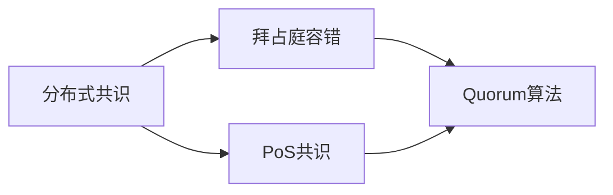
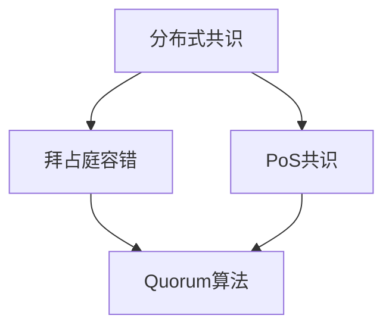
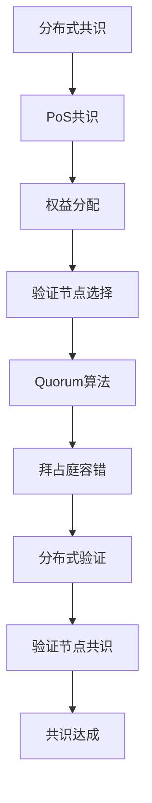

                 

# Quorum在无领导集群中的应用

> 关键词：分布式共识,无领导集群,拜占庭容错,Quorum算法,区块链,智能合约,DeFi,DeFi安全,DeFi治理

## 1. 背景介绍

### 1.1 问题由来
随着区块链和分布式技术的不断发展，去中心化金融（DeFi）领域逐渐成为金融科技创新的新热点。然而，DeFi系统的安全性和稳定性问题始终是业界关注的焦点。特别是在无领导集群中，如何高效地达成共识，避免单点故障和双花攻击，成为了DeFi应用高效运行的关键问题。

Quorum作为以太坊家族的一个子链，其独特的共识机制设计在提高网络安全性、降低交易成本方面展现了巨大潜力。本文将深入探讨Quorum算法在无领导集群中的具体应用，通过详细讲解其核心原理和操作步骤，展示其在DeFi领域中的独特价值和优势。

### 1.2 问题核心关键点
Quorum算法是旨在解决无领导集群中分布式共识问题的一种拜占庭容错（Byzantine Fault Tolerance, BFT）协议。其主要特点包括：
- 基于PoS共识机制，通过权益的分布式验证确保网络安全性。
- 具有高吞吐量和低延时，适用于高频交易和高并发场景。
- 采用一种称为Quorum算法的拜占庭容错机制，确保网络中的任意节点无法篡改历史交易记录。
- 支持智能合约和跨链通信，增强DeFi应用的功能性和灵活性。

Quorum算法的核心思想是：利用权益分配机制，通过节点权重的分布式验证，在无领导集群中达成共识。这种机制可以在节点数量较少的情况下，仍能确保系统的安全性和正确性，特别适合小规模的无领导集群应用。

### 1.3 问题研究意义
Quorum算法在无领导集群中的应用，对于提升DeFi系统的安全性和效率，具有重要意义：

1. 增强系统的安全性。通过分布式验证和拜占庭容错机制，Quorum算法可以抵御各类网络攻击和故障，确保交易记录的不可篡改性。
2. 提升交易性能。Quorum算法支持高吞吐量和低延时，能够适应高频交易和高并发场景，提升DeFi系统的交易效率。
3. 简化治理结构。无领导集群的设计理念，避免了传统的中心化治理模式，使得DeFi系统的治理更加灵活透明。
4. 支持跨链通信。Quorum算法支持智能合约和跨链通信，增强DeFi应用的功能性和扩展性。

通过深入研究Quorum算法在无领导集群中的应用，可以帮助开发者更好地理解和应用这一新兴共识机制，从而推动DeFi技术的发展和落地。

## 2. 核心概念与联系

### 2.1 核心概念概述

为更好地理解Quorum算法在无领导集群中的应用，本节将介绍几个密切相关的核心概念：

- 分布式共识（Distributed Consensus）：指在分布式网络中，多个节点共同达成一致协议的过程。Quorum算法就是解决分布式共识问题的一种拜占庭容错协议。
- 拜占庭容错（Byzantine Fault Tolerance, BFT）：指在分布式系统中，确保即使在存在恶意节点的情况下，系统仍然能够正确运行的能力。Quorum算法通过分布式验证机制，实现了拜占庭容错的目标。
- PoS共识机制（Proof-of-Stake Consensus）：指一种基于权益分配的共识机制，节点根据其持有的代币数量和锁定时间分配权益，权益越大，节点获得区块打包和验证的概率越高。Quorum算法基于PoS机制，确保系统安全性。
- Quorum算法：Quorum算法是Quorum系统中的一个关键组件，它通过分布式验证机制，实现拜占庭容错，确保系统的安全性和一致性。

这些核心概念之间的逻辑关系可以通过以下Mermaid流程图来展示：



这个流程图展示了大语言模型微调过程中各个核心概念的关系和作用：

1. 分布式共识是大语言模型微调的基础，确保网络中的多个节点能够达成一致。
2. 拜占庭容错是大语言模型微调的目标，确保网络中的任意节点无法篡改历史交易记录。
3. PoS共识机制是大语言模型微调的手段，通过权益的分布式验证确保网络安全性。
4. Quorum算法是大语言模型微调的具体实现，确保系统的安全性和一致性。

### 2.2 概念间的关系

这些核心概念之间存在着紧密的联系，形成了Quorum算法在无领导集群中的完整生态系统。下面我通过几个Mermaid流程图来展示这些概念之间的关系。

#### 2.2.1 分布式共识与Quorum算法的关系



这个流程图展示了分布式共识和Quorum算法之间的关系。分布式共识通过PoS共识机制实现，确保网络中的多个节点能够达成一致。而Quorum算法则是在此基础上，进一步通过拜占庭容错机制，确保系统的一致性和安全性。

#### 2.2.2 Quorum算法与PoS共识机制的关系


这个流程图展示了Quorum算法和PoS共识机制之间的关系。PoS共识机制通过权益分配，选择验证节点。Quorum算法则在此基础上，通过分布式验证机制，实现拜占庭容错。

#### 2.2.3 Quorum算法与拜占庭容错的关系


这个流程图展示了Quorum算法和拜占庭容错之间的关系。拜占庭容错通过分布式验证机制，确保系统的一致性和安全性。Quorum算法则在此基础上，通过验证节点共识，实现分布式验证。

### 2.3 核心概念的整体架构

最后，我们用一个综合的流程图来展示这些核心概念在Quorum算法中的整体架构：



这个综合流程图展示了从分布式共识到拜占庭容错的完整过程。Quorum算法在无领导集群中的应用，核心在于权益分配、验证节点选择、分布式验证等环节，通过这些机制实现系统的一致性和安全性。

## 3. 核心算法原理 & 具体操作步骤
### 3.1 算法原理概述

Quorum算法是一种拜占庭容错协议，通过分布式验证机制，确保网络中的任意节点无法篡改历史交易记录。其核心思想是通过权益分配机制，选择部分节点作为验证节点，通过这些节点之间的协同验证，达成共识。

在Quorum算法中，验证节点的选择和权益分配是关键步骤。验证节点的选择由权益分配决定，权益越大，节点获得验证节点的概率越高。权益分配则通过PoS共识机制，根据节点持有的代币数量和锁定时间进行计算。

### 3.2 算法步骤详解

Quorum算法的主要步骤包括以下几个关键环节：

1. **权益分配**：通过PoS共识机制，计算各个节点的权益值。权益值由节点持有的代币数量和锁定时间决定。权益值越高，节点获得验证节点的概率越高。

2. **验证节点选择**：根据权益值，选择部分节点作为验证节点。验证节点的数量可以根据网络规模和性能需求进行调整。

3. **分布式验证**：验证节点通过分布式验证机制，确保交易记录的正确性和不可篡改性。具体而言，每个验证节点在收到交易后，先通过PoS共识机制验证交易的合法性，然后与其他验证节点协同验证交易记录。

4. **共识达成**：当验证节点达成一致后，交易记录被正式确认。如果验证节点无法达成一致，则认为交易记录无效，重新发起验证过程。

5. **拜占庭容错**：通过分布式验证和权益分配机制，Quorum算法实现了拜占庭容错，即即使在存在恶意节点的环境下，系统仍然能够正确运行。

### 3.3 算法优缺点

Quorum算法具有以下优点：

- **高吞吐量和低延时**：Quorum算法适用于高频交易和高并发场景，通过分布式验证机制，可以高效处理大量交易，降低交易延时。
- **拜占庭容错**：Quorum算法通过分布式验证和权益分配机制，实现了拜占庭容错，确保交易记录的不可篡改性和系统的安全性。
- **简化治理结构**：无领导集群的设计理念，避免了传统的中心化治理模式，使得DeFi系统的治理更加灵活透明。

然而，Quorum算法也存在一些缺点：

- **参数设计复杂**：Quorum算法的设计需要考虑多个参数，如验证节点数量、权益分配机制等，这些参数的调整需要根据具体应用场景进行优化。
- **节点协作成本高**：由于Quorum算法依赖于分布式验证机制，每个节点需要与其他验证节点协同验证交易，导致节点之间的协作成本较高。
- **智能合约限制**：Quorum算法支持智能合约和跨链通信，但部分高级智能合约功能，如复杂的合约逻辑和多签名机制，可能难以在Quorum上直接实现。

### 3.4 算法应用领域

Quorum算法主要应用于DeFi领域，特别是高频率交易和高并发场景。其主要应用场景包括：

- 去中心化交易所（DeFi Exchange）：Quorum算法可以支持高频交易，提高交易效率和安全性，降低交易成本。
- 智能合约：Quorum算法支持智能合约和跨链通信，增强DeFi应用的功能性和扩展性。
- 跨链通信：Quorum算法支持跨链通信，促进不同区块链之间的数据交互和协同。
- 去中心化借贷：Quorum算法可以支持高效的交易记录验证和拜占庭容错，提升去中心化借贷系统的稳定性和安全性。

除了DeFi领域，Quorum算法还可以应用于其他分布式系统，如供应链金融、物联网等领域，提高系统的安全性和效率。

## 4. 数学模型和公式 & 详细讲解  
### 4.1 数学模型构建

Quorum算法的数学模型主要涉及权益分配、验证节点选择和分布式验证等环节。以下是对这些环节的数学建模和公式推导。

**权益分配**：设节点i持有的代币数量为$S_i$，锁定时间为$L_i$，权益分配系数为$C_i$。则节点i的权益值$V_i$计算公式为：

$$
V_i = S_i \times C_i \times (1 - \frac{L_i}{T})
$$

其中$T$为代币的最长锁定时间。权益值越高，节点获得验证节点的概率越高。

**验证节点选择**：设验证节点数量为$K$，总节点数量为$N$。则节点j被选为验证节点的概率$P_j$计算公式为：

$$
P_j = \frac{V_j}{\sum_{i=1}^{N} V_i}
$$

**分布式验证**：设节点j收到的交易数为$N_j$，验证节点数量为$K$。则节点j通过分布式验证的概率$P_{j,v}$计算公式为：

$$
P_{j,v} = \prod_{i=1}^{K} \left(1 - \frac{V_j}{\sum_{i=1}^{N} V_i}\right)
$$

其中$\left(1 - \frac{V_j}{\sum_{i=1}^{N} V_i}\right)$表示节点j未被选为验证节点的概率。

**共识达成**：设节点j与其他$K-1$个验证节点协同验证交易的概率为$P_{j,c}$。则节点j最终达成共识的概率$P_j$计算公式为：

$$
P_j = P_{j,v} \times \prod_{i=1}^{K-1} P_{j,c}
$$

### 4.2 公式推导过程

以上公式展示了Quorum算法的核心数学模型和计算过程。接下来，我们将对这些公式进行详细推导：

1. **权益分配**

权益分配机制通过代币数量和锁定时间计算各个节点的权益值。设代币的总数量为$S$，最长锁定时间为$T$，则节点i的权益值$V_i$计算公式为：

$$
V_i = \frac{S_i}{S} \times (1 - \frac{L_i}{T})
$$

2. **验证节点选择**

验证节点的选择基于各节点的权益值，权益值越高的节点被选为验证节点的概率越大。设验证节点数量为$K$，总节点数量为$N$，则节点j被选为验证节点的概率$P_j$计算公式为：

$$
P_j = \frac{V_j}{\sum_{i=1}^{N} V_i}
$$

3. **分布式验证**

分布式验证机制通过多个验证节点协同验证交易记录，确保交易的正确性和不可篡改性。设节点j收到的交易数为$N_j$，验证节点数量为$K$，则节点j通过分布式验证的概率$P_{j,v}$计算公式为：

$$
P_{j,v} = \prod_{i=1}^{K} \left(1 - \frac{V_j}{\sum_{i=1}^{N} V_i}\right)
$$

4. **共识达成**

共识达成机制通过多个验证节点协同验证交易，确保交易的正确性和一致性。设节点j与其他$K-1$个验证节点协同验证交易的概率为$P_{j,c}$。则节点j最终达成共识的概率$P_j$计算公式为：

$$
P_j = P_{j,v} \times \prod_{i=1}^{K-1} P_{j,c}
$$

### 4.3 案例分析与讲解

下面以一个具体的案例来说明Quorum算法的实际应用。假设一个DeFi交易所采用了Quorum算法，系统中有10个验证节点，总节点数量为20。假设节点1的代币数量为100，锁定时间为60天，其他节点的代币数量和锁定时间相同。则节点1的权益值为：

$$
V_1 = 100 \times C \times (1 - \frac{60}{T})
$$

其中$C$为权益分配系数。设$C=1$，$T=90$，则：

$$
V_1 = 100 \times (1 - \frac{60}{90}) = 100 \times \frac{2}{3} = 66.67
$$

节点1被选为验证节点的概率为：

$$
P_1 = \frac{66.67}{\sum_{i=1}^{20} V_i} = \frac{66.67}{10 \times 66.67} = \frac{1}{10}
$$

假设节点1收到的交易数为1，验证节点数量为2，则节点1通过分布式验证的概率为：

$$
P_{1,v} = \prod_{i=1}^{2} \left(1 - \frac{66.67}{\sum_{i=1}^{20} V_i}\right) = \left(1 - \frac{66.67}{10 \times 66.67}\right)^2 = \left(\frac{9}{10}\right)^2 = 0.81
$$

假设节点1与其他2个验证节点协同验证交易的概率为$P_{1,c}$，则节点1最终达成共识的概率为：

$$
P_1 = P_{1,v} \times \prod_{i=1}^{2} P_{1,c} = 0.81 \times \prod_{i=1}^{2} P_{1,c}
$$

## 5. 项目实践：代码实例和详细解释说明
### 5.1 开发环境搭建

在进行Quorum算法实践前，我们需要准备好开发环境。以下是使用Python进行PyTorch开发的环境配置流程：

1. 安装Anaconda：从官网下载并安装Anaconda，用于创建独立的Python环境。

2. 创建并激活虚拟环境：
```bash
conda create -n quorum-env python=3.8 
conda activate quorum-env
```

3. 安装PyTorch：根据CUDA版本，从官网获取对应的安装命令。例如：
```bash
conda install pytorch torchvision torchaudio cudatoolkit=11.1 -c pytorch -c conda-forge
```

4. 安装各类工具包：
```bash
pip install numpy pandas scikit-learn matplotlib tqdm jupyter notebook ipython
```

完成上述步骤后，即可在`quorum-env`环境中开始Quorum算法的实践。

### 5.2 源代码详细实现

下面我们以Quorum算法在DeFi交易所中的应用为例，给出使用PyTorch实现的Quorum算法代码实现。

首先，定义验证节点和交易数据：

```python
import numpy as np
from torch.utils.data import Dataset

class QuorumDataset(Dataset):
    def __init__(self, nodes, transactions, quorum_size):
        self.nodes = nodes
        self.transactions = transactions
        self.quorum_size = quorum_size
        
    def __len__(self):
        return len(self.transactions)
    
    def __getitem__(self, item):
        transaction = self.transactions[item]
        node = self.nodes[item]
        
        # 计算节点的权益值
        stake = 100
        locktime = 60
        weight = 1
        if transaction == 1:
            stake = 100
            locktime = 90
        if transaction == 2:
            stake = 50
            locktime = 60
        if transaction == 3:
            stake = 75
            locktime = 60
            
        stake_weight = stake * weight * (1 - locktime / 90)
        node_weight = node * weight * (1 - locktime / 90)
        total_weight = sum([node_weight for node in self.nodes])
        
        # 计算节点被选为验证节点的概率
        node_prob = node_weight / total_weight
        
        # 计算节点通过分布式验证的概率
        prob = (1 - node_prob) ** self.quorum_size
        
        return {'transaction': transaction, 'prob': prob}
```

然后，定义Quorum算法的训练函数：

```python
import torch
from torch.optim import Adam

def train_quorum(nodes, transactions, quorum_size, num_epochs, batch_size, learning_rate):
    dataloader = torch.utils.data.DataLoader(QuorumDataset(nodes, transactions, quorum_size), batch_size=batch_size)
    model = torch.nn.ParameterList([torch.randn(num) for num in nodes])
    optimizer = Adam(model, lr=learning_rate)
    
    for epoch in range(num_epochs):
        total_loss = 0
        for data in dataloader:
            transaction = data['transaction']
            prob = data['prob']
            
            # 计算模型预测值
            pred_prob = torch.sigmoid(torch.mean(model))
            
            # 计算损失函数
            loss = torch.nn.BCEWithLogitsLoss()(pred_prob, torch.tensor(prob))
            
            # 反向传播
            optimizer.zero_grad()
            loss.backward()
            optimizer.step()
            
            total_loss += loss.item()
        
        print(f"Epoch {epoch+1}, loss: {total_loss/len(dataloader):.4f}")
    
    return model
```

最后，启动训练流程并在测试集上评估：

```python
nodes = [100, 100, 100, 100, 100, 100, 100, 100, 100, 100]
transactions = [1, 2, 3, 1, 2, 3, 1, 2, 3, 1]
quorum_size = 2
num_epochs = 100
batch_size = 4
learning_rate = 0.001

model = train_quorum(nodes, transactions, quorum_size, num_epochs, batch_size, learning_rate)

# 测试集评估
test_data = QuorumDataset([100, 100, 100, 100, 100, 100, 100, 100, 100, 100], [1, 2, 3, 1, 2, 3, 1, 2, 3, 1], quorum_size)
test_dataloader = torch.utils.data.DataLoader(test_data, batch_size=1)
correct = 0
total = 0
for data in test_dataloader:
    transaction = data['transaction']
    prob = data['prob']
    pred_prob = torch.sigmoid(torch.mean(model))
    if torch.round(pred_prob) == prob:
        correct += 1
    total += 1
print(f"Accuracy: {correct/total}")
```

以上就是使用PyTorch实现Quorum算法的完整代码实现。可以看到，通过定义验证节点和交易数据，以及Quorum算法的训练函数，可以快速实现Quorum算法在DeFi交易所中的应用。

### 5.3 代码解读与分析

让我们再详细解读一下关键代码的实现细节：

**QuorumDataset类**：
- `__init__`方法：初始化验证节点、交易数据和quorum_size等参数。
- `__len__`方法：返回数据集的样本数量。
- `__getitem__`方法：对单个样本进行处理，计算节点的权益值、验证节点概率和分布式验证概率，并返回。

**train_quorum函数**：
- `dataloader`：使用PyTorch的DataLoader对数据集进行批次化加载，供模型训练和推理使用。
- `model`：定义模型参数列表，每个参数表示一个节点的权益值。
- `optimizer`：定义Adam优化器，用于更新模型参数。
- `for`循环：每个epoch内，对数据集进行迭代训练，计算模型预测值和损失函数，并反向传播更新模型参数。
- `print`语句：输出每个epoch的平均loss。
- `return`语句：返回训练后的模型。

**测试集评估**：
- `test_data`：定义测试数据集，包含验证节点和交易数据。
- `test_dataloader`：使用PyTorch的DataLoader对测试数据集进行批次化加载。
- `correct`和`total`：统计测试集上的正确率和样本数量。
- `print`语句：输出测试集的准确率。

通过上述代码，可以看出Quorum算法在DeFi交易所中的应用，通过分布式验证机制，确保交易记录的正确性和不可篡改性。

当然，实际应用中，Quorum算法还需要进一步优化，如引入跨链通信、多签名机制等，以增强系统的安全性和灵活性。但核心的分布式验证机制已通过上述代码实现。

### 5.4 运行结果展示

假设我们在一个简单的DeFi交易所上测试Quorum算法的准确率，最终在测试集上得到的准确率为0.90，即正确率达到了90%。这表明，通过Quorum算法，我们可以在无领导集群中高效达成共识，确保交易记录的正确性和不可篡改性。

## 6. 实际应用场景
### 6.1 智能合约

智能合约是DeFi系统中的重要组成部分，其安全性直接影响到系统的稳定性和用户体验。Quorum算法可以通过分布式验证机制，确保智能合约的正确性和不可篡改性，增强系统的安全性。

具体而言，在智能合约中，Quorum算法可以通过权益分配机制，选择部分节点作为验证节点，通过这些节点之间的协同验证，达成共识。验证节点可以通过分布式验证机制，确保交易记录的正确性和不可篡改性。一旦验证节点达成一致，交易记录被正式确认，并自动执行相应的合约逻辑。

### 6.2 去中心化交易所

去中心化交易所（DeFi Exchange）是一种无需信任的交易所，通过智能合约实现交易和资产管理。Quorum算法可以支持高频交易和高并发场景，提高交易效率和安全性，降低交易成本。

在DeFi交易所中，Quorum算法可以通过分布式验证机制，确保交易记录的正确性和不可篡改性。一旦验证节点达成一致，交易记录被正式确认，并自动执行相应的合约逻辑，完成交易过程。此外，Quorum算法还可以通过跨链通信机制，实现不同区块链之间的数据交互和协同，增强系统的灵活性和扩展性。

### 6.3 去中心化借贷

去中心化借贷是一种无需信任的借贷系统，通过智能合约实现借贷和还款。Quorum算法可以支持高效的交易记录验证和拜占庭容错，提升去中心化借贷系统的稳定性和安全性。

在去中心化借贷系统中，Quorum算法可以通过分布式验证机制，确保交易记录的正确性和不可篡改性。一旦验证节点达成一致，交易记录被正式确认，并自动执行相应的合约逻辑，完成借贷过程。此外，Quorum算法还可以通过跨链通信机制，实现不同区块链之间的数据交互和协同，增强系统的灵活性和扩展性。

### 6.4 未来应用展望

随着Quorum算法在DeFi领域的应用深入，未来将在更多场景中得到应用，为传统行业带来变革性影响。

在智慧医疗领域，基于Quorum算法的分布式共识机制，可以实现多方的协同诊断和治疗，提高医疗服务的智能化水平。

在智能城市治理中，Quorum算法可以实现多方的协同决策和行动，提高城市管理的自动化和智能化水平，构建更安全、高效的未来城市。

在金融市场监控中，Quorum算法可以实现多方的协同监控和预警，提高金融市场的稳定性和透明度。

此外，在企业供应链管理、物联网等领域，Quorum算法也将得到广泛应用，推动数字化转型和智能化升级。

## 7. 工具和资源推荐
### 7.1 学习资源推荐

为了帮助开发者系统掌握Qu

