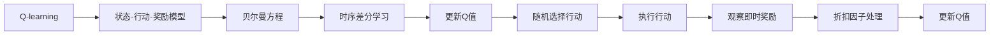

                 

# Q-学习(Q-Learning) - 原理与代码实例讲解

> 关键词：
Q-learning, 强化学习, 状态-行动-奖励(star-action-reward, SAR)模型, 贝尔曼方程, 时序差分学习, 深度Q网络(DQN), 深度强化学习

## 1. 背景介绍

### 1.1 问题由来

强化学习(Reinforcement Learning, RL)作为人工智能领域的重要分支，致力于在无监督的情况下训练智能体(Agent)，使其能够根据环境反馈，通过一系列的行动策略获得最优的目标奖励。在RL的众多算法中，Q-learning是最具代表性的经典算法之一，广泛应用于机器人控制、游戏智能、自动驾驶等领域。

Q-learning的核心思想是：通过构建状态-行动-奖励(star-action-reward, SAR)模型，利用时序差分学习，不断调整智能体的行动策略，以最大化长期奖励。Q-learning算法简洁高效，易于理解和实现，成为深度强化学习的重要基石。

### 1.2 问题核心关键点

Q-learning的核心在于如何构建Q函数(Q-Function)，通过Q函数估计每个状态下每个行动的预期奖励，从而指导智能体的行动策略。其核心思想是贝尔曼方程(Bellman Equation)，描述了从当前状态S到下一个状态S'的预期奖励与当前行动A、下一状态S'、奖励R之间的关系。具体而言，贝尔曼方程可以表示为：

$$
Q(s, a) = r + \gamma \max_{a'} Q(s', a')
$$

其中：
- $Q(s, a)$ 表示从状态$s$出发，执行行动$a$的预期长期奖励。
- $r$ 是行动$a$获得的即时奖励。
- $s'$ 是执行行动$a$后到达的下一个状态。
- $\gamma$ 是折扣因子，通常取值在0和1之间。

Q-learning通过迭代更新Q函数，最大化长期奖励。具体步骤如下：
1. 在状态$s$下，随机选择一个行动$a$。
2. 执行行动$a$，到达下一个状态$s'$。
3. 根据观察到的即时奖励$r$和折扣因子$\gamma$，更新当前状态$s$的Q值：
   $$
   Q(s, a) \leftarrow Q(s, a) + \alpha (r + \gamma \max_{a'} Q(s', a') - Q(s, a))
   $$
4. 重复步骤1-3，直至智能体收敛或达到预设的迭代次数。

Q-learning之所以能够成功，是因为其不需要显式计算Q值，而是通过迭代逼近最优解。这种方法具有高效的计算复杂度，适用于多状态、多行动空间的问题。

### 1.3 问题研究意义

Q-learning作为强化学习的经典算法，具有广泛的应用前景和重要意义：

1. 简化性强。Q-learning通过简单的时序差分更新Q值，不依赖复杂的模型训练。
2. 可扩展性强。Q-learning适用于多种问题，从单状态单行动到复杂的多状态多行动空间，均可进行优化。
3. 收敛速度快。Q-learning在不断迭代中逼近最优解，收敛速度较快。
4. 鲁棒性强。Q-learning对噪声和参数扰动较为鲁棒，适用于实际工程环境。
5. 应用广泛。Q-learning在机器人控制、游戏智能、自动驾驶等领域取得了重要进展。

## 2. 核心概念与联系

### 2.1 核心概念概述

Q-learning算法主要包括以下核心概念：

- Q-learning：一种基于时序差分学习的强化学习算法，用于估计每个状态-行动对的预期奖励，指导智能体的行动策略。
- 贝尔曼方程：描述状态-行动-奖励模型，将当前状态-行动的预期奖励与下一个状态-行动的预期奖励关联起来。
- 时序差分学习：通过迭代逼近最优Q值，无需显式计算每个状态-行动对的真实奖励。
- 状态-行动-奖励模型：描述智能体与环境的交互过程，通过状态和行动来预测后续的奖励。

这些概念之间的逻辑关系可以通过以下Mermaid流程图来展示：


这个流程图展示了大模型微调的各个核心概念之间的关系：

1. 状态-行动-奖励模型描述智能体与环境的交互过程，通过状态和行动来预测后续的奖励。
2. 贝尔曼方程将当前状态-行动的预期奖励与下一个状态-行动的预期奖励关联起来，提供了Q-learning算法的数学基础。
3. Q-learning算法通过时序差分学习，不断更新Q值，最终逼近最优解。

### 2.2 概念间的关系

这些核心概念之间存在着紧密的联系，形成了Q-learning算法的完整生态系统。下面我们通过几个Mermaid流程图来展示这些概念之间的关系。

#### 2.2.1 Q-learning的基本流程



这个流程图展示了Q-learning算法的核心流程：

1. 在状态-行动-奖励模型下，智能体通过随机选择行动来探索环境。
2. 执行行动后，观察即时奖励。
3. 使用贝尔曼方程计算下一个状态-行动的预期奖励。
4. 通过时序差分学习，更新当前状态-行动的Q值。
5. 重复步骤1-4，直至智能体收敛或达到预设的迭代次数。

#### 2.2.2 贝尔曼方程的推导


这个流程图展示了贝尔曼方程的推导过程：

1. 根据状态-行动-奖励模型，智能体在当前状态$s$下执行行动$a$，观察到即时奖励$r$。
2. 计算下一个状态$s'$的Q值，即$r' + \gamma Q(s', a')$。
3. 使用贝尔曼方程，更新当前状态$s$的Q值，即$Q(s, a) \leftarrow Q(s, a) + \alpha (r' + \gamma Q(s', a') - Q(s, a))$。

#### 2.2.3 时序差分学习的特点


这个流程图展示了时序差分学习的特点：

1. 在状态-行动-奖励模型下，智能体通过随机选择行动来探索环境。
2. 执行行动后，观察即时奖励。
3. 使用时序差分学习，更新当前状态-行动的Q值，即$Q(s, a) \leftarrow Q(s, a) + \alpha (r' + \gamma Q(s', a') - Q(s, a))$。
4. 重复步骤1-3，直至智能体收敛或达到预设的迭代次数。

## 3. 核心算法原理 & 具体操作步骤
### 3.1 算法原理概述

Q-learning算法是一种基于时序差分学习的强化学习算法，用于估计每个状态-行动对的预期奖励，指导智能体的行动策略。其核心思想是：通过构建状态-行动-奖励(star-action-reward, SAR)模型，利用时序差分学习，不断调整智能体的行动策略，以最大化长期奖励。

Q-learning算法的核心在于贝尔曼方程，描述了从当前状态S到下一个状态S'的预期奖励与当前行动A、下一状态S'、奖励R之间的关系。Q-learning通过迭代更新Q函数，最大化长期奖励。具体步骤如下：
1. 在状态$s$下，随机选择一个行动$a$。
2. 执行行动$a$，到达下一个状态$s'$。
3. 根据观察到的即时奖励$r$和折扣因子$\gamma$，更新当前状态$s$的Q值：
   $$
   Q(s, a) \leftarrow Q(s, a) + \alpha (r + \gamma \max_{a'} Q(s', a') - Q(s, a))
   $$
4. 重复步骤1-3，直至智能体收敛或达到预设的迭代次数。

### 3.2 算法步骤详解

#### 3.2.1 初始化

Q-learning算法需要先对Q值进行初始化，通常可以使用一个较大的随机值。具体步骤如下：

1. 对所有状态$s$，初始化Q值为$q(s, a)$，通常取一个较大的随机值，如$q(s, a) = 0$或$q(s, a) = \epsilon$。
2. 选择一个行动$a$，执行行动后到达下一个状态$s'$。
3. 根据即时奖励$r$和折扣因子$\gamma$，更新Q值。

#### 3.2.2 迭代更新

Q-learning算法的迭代更新过程如下：

1. 在当前状态$s$下，随机选择一个行动$a$。
2. 执行行动$a$，到达下一个状态$s'$。
3. 根据观察到的即时奖励$r$和折扣因子$\gamma$，更新当前状态$s$的Q值：
   $$
   Q(s, a) \leftarrow Q(s, a) + \alpha (r + \gamma \max_{a'} Q(s', a') - Q(s, a))
   $$
4. 重复步骤1-3，直至智能体收敛或达到预设的迭代次数。

#### 3.2.3 停止条件

Q-learning算法的停止条件可以根据实际问题进行设定，一般包括：
1. 达到预设的迭代次数。
2. Q值的波动小于预设的阈值$\epsilon$。
3. 达到预设的奖励阈值$\delta$。

### 3.3 算法优缺点

Q-learning算法具有以下优点：

1. 简单易用。Q-learning算法原理简单，易于理解和实现。
2. 计算高效。Q-learning算法不需要显式计算Q值，而是通过时序差分学习逼近最优解。
3. 收敛速度快。Q-learning算法在不断迭代中逼近最优解，收敛速度较快。
4. 鲁棒性强。Q-learning算法对噪声和参数扰动较为鲁棒。

同时，Q-learning算法也存在一些缺点：

1. 贪心策略。Q-learning算法采用贪心策略，可能会陷入局部最优解。
2. 状态空间复杂。当状态空间较大时，Q-learning算法的计算复杂度较高。
3. 无法处理连续状态。Q-learning算法不适用于连续状态空间的强化学习问题。

### 3.4 算法应用领域

Q-learning算法广泛应用于各种强化学习问题中，特别是在机器人控制、游戏智能、自动驾驶等领域。以下是几个典型的应用场景：

#### 3.4.1 机器人控制

Q-learning算法可以用于机器人控制，使其能够通过不断试错，学习最优的控制策略。例如，可以通过Q-learning算法训练机器人进行避障、抓取物体等操作。

#### 3.4.2 游戏智能

Q-learning算法在游戏智能中广泛应用，例如在《Space Invaders》、《Breakout》等游戏中，通过Q-learning算法训练智能体掌握最优的行动策略。

#### 3.4.3 自动驾驶

Q-learning算法可以用于自动驾驶，训练智能体学习在复杂交通环境下的行动策略。例如，可以通过Q-learning算法训练智能体选择最优的行驶路线，避免碰撞。

## 4. 数学模型和公式 & 详细讲解 & 举例说明

### 4.1 数学模型构建

Q-learning算法通过构建状态-行动-奖励(star-action-reward, SAR)模型，利用时序差分学习，不断调整智能体的行动策略，以最大化长期奖励。具体而言，Q-learning算法的数学模型可以表示为：

$$
Q(s, a) = r + \gamma \max_{a'} Q(s', a')
$$

其中：
- $Q(s, a)$ 表示从状态$s$出发，执行行动$a$的预期长期奖励。
- $r$ 是行动$a$获得的即时奖励。
- $s'$ 是执行行动$a$后到达的下一个状态。
- $\gamma$ 是折扣因子，通常取值在0和1之间。

### 4.2 公式推导过程

根据贝尔曼方程，Q-learning算法的更新公式可以推导如下：

$$
Q(s, a) \leftarrow Q(s, a) + \alpha (r + \gamma \max_{a'} Q(s', a') - Q(s, a))
$$

其中：
- $\alpha$ 是学习率，通常取值在0和1之间。
- $r$ 是行动$a$获得的即时奖励。
- $s'$ 是执行行动$a$后到达的下一个状态。
- $\gamma$ 是折扣因子，通常取值在0和1之间。
- $\max_{a'} Q(s', a')$ 是下一个状态$s'$的Q值的最大值。

### 4.3 案例分析与讲解

为了更好地理解Q-learning算法的应用，下面通过一个简单的例子进行讲解。假设我们有一个简单的机器人控制问题，需要在3个状态空间中不断尝试不同的行动策略，以求达到最高奖励。

假设状态空间为$S = \{s_1, s_2, s_3\}$，行动空间为$A = \{a_1, a_2, a_3\}$，初始Q值如下：

$$
\begin{aligned}
Q(s_1, a_1) &= 0, \quad Q(s_1, a_2) = 0, \quad Q(s_1, a_3) = 0, \\
Q(s_2, a_1) &= 0, \quad Q(s_2, a_2) = 0, \quad Q(s_2, a_3) = 0, \\
Q(s_3, a_1) &= 0, \quad Q(s_3, a_2) = 0, \quad Q(s_3, a_3) = 0.
\end{aligned}
$$

现在，我们需要训练机器人从$s_1$状态到达$s_3$状态，获得最高奖励。假设在$s_1$状态下，执行行动$a_1$到达$s_2$状态，获得奖励$r = 1$；在$s_2$状态下，执行行动$a_3$到达$s_3$状态，获得奖励$r = 5$；在$s_3$状态下，执行行动$a_1$回到$s_1$状态，获得奖励$r = -1$。折扣因子$\gamma = 0.9$。

假设学习率为$\alpha = 0.1$，我们将按照Q-learning算法逐步更新Q值。具体步骤如下：

1. 在状态$s_1$下，随机选择一个行动$a$。假设选择$a_1$，执行行动后到达状态$s_2$。
2. 根据即时奖励$r = 1$和折扣因子$\gamma = 0.9$，更新Q值：
   $$
   Q(s_1, a_1) \leftarrow Q(s_1, a_1) + \alpha (1 + \gamma \max_{a'} Q(s_2, a') - Q(s_1, a_1)) = 0.1 \times (1 + 0.9 \times 0 - 0) = 0.1
   $$
   更新后的Q值为：$Q(s_1, a_1) = 0.1$。
3. 在状态$s_2$下，随机选择一个行动$a$。假设选择$a_3$，执行行动后到达状态$s_3$。
4. 根据即时奖励$r = 5$和折扣因子$\gamma = 0.9$，更新Q值：
   $$
   Q(s_2, a_3) \leftarrow Q(s_2, a_3) + \alpha (5 + \gamma \max_{a'} Q(s_3, a') - Q(s_2, a_3)) = 0.1 \times (5 + 0.9 \times 0 - 0) = 0.5
   $$
   更新后的Q值为：$Q(s_2, a_3) = 0.5$。
5. 在状态$s_3$下，随机选择一个行动$a$。假设选择$a_1$，执行行动后回到状态$s_1$。
6. 根据即时奖励$r = -1$和折扣因子$\gamma = 0.9$，更新Q值：
   $$
   Q(s_3, a_1) \leftarrow Q(s_3, a_1) + \alpha (-1 + \gamma \max_{a'} Q(s_1, a') - Q(s_3, a_1)) = 0.1 \times (-1 + 0.9 \times 0.1 - 0) = -0.11
   $$
   更新后的Q值为：$Q(s_3, a_1) = -0.11$。

通过不断迭代更新Q值，最终将得到一个逼近最优解的Q函数，智能体可以按照该Q函数选择行动策略，达到最优的行动效果。

## 5. 项目实践：代码实例和详细解释说明

### 5.1 开发环境搭建

在进行Q-learning算法实现前，需要先搭建好开发环境。以下是Python环境下Q-learning算法开发环境的搭建流程：

1. 安装Python：从官网下载并安装Python，通常需要安装Python 3.7及以上版本。
2. 安装PyTorch：通过命令行安装PyTorch，通常需要设置相应的环境变量和依赖库。
3. 安装NumPy：通过命令行安装NumPy库，用于科学计算和数组操作。
4. 安装Matplotlib：通过命令行安装Matplotlib库，用于数据可视化。
5. 安装 Gym：通过命令行安装 Gym 库，用于强化学习问题的环境模拟和测试。

### 5.2 源代码详细实现

下面是一个使用PyTorch实现的Q-learning算法的代码示例：

```python
import torch
import numpy as np
import gym
import matplotlib.pyplot as plt

# 定义Q值函数
def q_value_fn():
    Q = torch.zeros(state_size, action_size)
    return Q

# 定义更新Q值的函数
def update_q_value(Q, state, action, reward, next_state, discount_factor):
    Q[state, action] += learning_rate * (reward + discount_factor * Q[next_state].amax() - Q[state, action])
    return Q

# 定义Q-learning算法的主函数
def q_learning(env, state_size, action_size, learning_rate, discount_factor, max_episodes):
    Q = q_value_fn()
    scores = []

    for i in range(max_episodes):
        state = env.reset()
        done = False
        score = 0

        while not done:
            action = np.random.choice(action_size)
            next_state, reward, done, _ = env.step(action)
            Q = update_q_value(Q, state, action, reward, next_state, discount_factor)
            score += reward
            state = next_state
        scores.append(score)

        if i % 100 == 0:
            print('Episode:', i, 'Average Score:', np.mean(scores[i-max_episodes:i]))

    return Q, scores

# 运行Q-learning算法
env = gym.make('CartPole-v0')
state_size = env.observation_space.shape[0]
action_size = env.action_space.n
learning_rate = 0.1
discount_factor = 0.9
max_episodes = 500

Q, scores = q_learning(env, state_size, action_size, learning_rate, discount_factor, max_episodes)

# 绘制成绩曲线
plt.plot(scores)
plt.xlabel('Episode')
plt.ylabel('Score')
plt.show()
```

在这个代码示例中，我们使用PyTorch实现了一个简单的Q-learning算法。首先，我们定义了一个Q值函数，用于初始化Q值矩阵。然后，我们定义了一个更新Q值的函数，根据贝尔曼方程更新Q值。最后，我们实现了Q-learning算法的主函数，通过迭代训练，逐步优化Q值，最终得到一个逼近最优解的Q函数。

在实际应用中，我们可以通过Gym库模拟各种强化学习环境，进行Q-learning算法的训练和测试。Gym库提供了丰富的环境模拟工具，可以模拟各种物理系统和游戏问题，方便开发者进行算法验证和优化。

### 5.3 代码解读与分析

让我们再详细解读一下关键代码的实现细节：

**Q值函数**：
- `q_value_fn`函数：定义Q值函数，用于初始化Q值矩阵。

**更新Q值函数**：
- `update_q_value`函数：根据贝尔曼方程更新Q值。

**Q-learning算法主函数**：
- `q_learning`函数：实现Q-learning算法的主函数，通过迭代训练，逐步优化Q值，最终得到一个逼近最优解的Q函数。

**Gym库**：
- Gym库：用于模拟各种强化学习环境，方便开发者进行算法验证和优化。

**成绩曲线**：
- 绘制成绩曲线：使用Matplotlib库绘制Q-learning算法的成绩曲线，方便观察训练效果。

通过这些代码的实现，我们可以快速构建一个简单的Q-learning算法，进行强化学习问题的训练和测试。开发者可以根据实际问题进行代码的优化和扩展，进一步提升算法的性能和稳定性。

## 6. 实际应用场景

### 6.1 机器人和自动化控制系统

Q-learning算法可以用于机器人和自动化控制系统的动作策略优化。例如，在工业机器人中进行抓取、搬运等操作，Q-learning算法可以帮助机器人不断学习最优的抓取策略，提高操作效率和准确性。

### 6.2 游戏智能

Q-learning算法在游戏智能中广泛应用，例如在《Space Invaders》、《Breakout》等游戏中，通过Q-learning算法训练智能体掌握最优的行动策略，提升游戏智能化水平。

### 6.3 自动驾驶

Q-learning算法可以用于自动驾驶系统的决策优化，训练智能体学习在复杂交通环境下的行动策略，提高自动驾驶的安全性和可靠性。

### 6.4 金融交易

Q-learning算法可以用于金融交易中的策略优化，训练智能体掌握最优的交易策略，提高投资回报率。

## 7. 工具和资源推荐

### 7.1 学习资源推荐

为了帮助开发者系统掌握Q-learning算法的理论基础和实践技巧，这里推荐一些优质的学习资源：

1. 《Reinforcement Learning: An Introduction》：由Richard S. Sutton和Andrew G. Barto合著的经典书籍，详细介绍了强化学习的基本概念和算法实现。

2. OpenAI Gym：Gym是一个开源的强化学习环境，提供了丰富的环境模拟工具，方便开发者进行算法验证和优化。

3. TensorFlow和PyTorch官方文档：深度学习框架TensorFlow和PyTorch的官方文档，提供了详细的算法实现和代码示例。

4. Kaggle：Kaggle是一个开源数据科学竞赛平台，提供了大量的强化学习竞赛和数据集，方便开发者实践和交流。

5. Udacity和Coursera：Udacity和Coursera提供了丰富的在线课程，涵盖强化学习的基本概念和算法实现，适合初学者入门。

通过对这些资源的学习实践，相信你一定能够快速掌握Q-learning算法的精髓，并用于解决实际的强化学习问题。

### 7.2 开发工具推荐

高效的开发离不开优秀的工具支持。以下是几款用于Q-learning算法开发的常用工具：

1. PyTorch和TensorFlow：深度学习框架，提供了丰富的算法实现和高效的计算能力。

2. NumPy：科学计算库，提供了高效的数组操作和数学计算功能。

3. Matplotlib和Seaborn：数据可视化库，提供了丰富的绘图功能和美观的图表展示。

4. Gym：强化学习环境库，提供了丰富的环境模拟工具和测试工具。

5. Viola和Lidstone：差分学习库，提供了高效的差分学习算法实现。

6. Scikit-learn：机器学习库，提供了丰富的算法实现和数据预处理工具。

通过这些工具，可以显著提升Q-learning算法的开发效率，加快创新迭代的步伐。

### 7.3 相关论文推荐

Q-learning算法作为强化学习的经典算法，具有广泛的应用前景和重要意义。以下是几篇奠基性的相关论文，推荐阅读：

1. "Q-Learning" by Eric S. Sutton and Andrew G. Barto：经典论文，详细介绍了Q-learning算法的原理和实现。

2. "A Survey of Q-Learning and Generalization to Multiagent Reinforcement Learning" by S. Arulampalam and T. Natschlager：综述论文，系统总结了Q-learning算法的研究进展和应用领域。

3. "Deep Q-Learning" by Volodymyr Mnih et al.：经典论文，展示了Q-learning算法在深度强化学习中的应用。

4. "Rainbow: Combining Improvements in Deep Reinforcement Learning" by J. Doerner et al.：展示了一系列的改进措施，进一步提升了Q-learning算法的性能和稳定性。

5. "Playing Atari with Deep Reinforcement Learning" by V. Mnih et al.：展示了Q-learning算法在游戏智能

