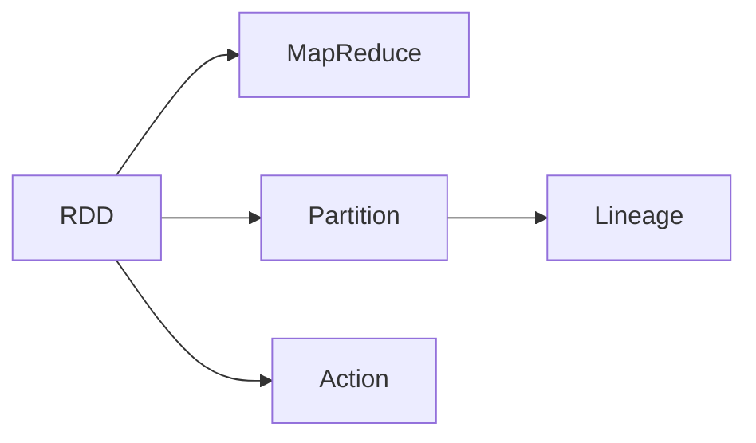

                 

# RDD原理与代码实例讲解

> 关键词：RDD, Spark, MapReduce, Resilient Dataset, 弹性计算, 内存计算

## 1. 背景介绍

### 1.1 问题由来
随着大数据时代的到来，数据量呈爆炸式增长。如何高效、灵活地处理这些数据，成为了数据处理领域的重要课题。传统的批处理方式在处理大规模数据时，往往面临着计算成本高、响应时间长等挑战。为解决这些问题，弹性计算框架应运而生，其中最知名的是Apache Spark，其核心组件之一便是弹性分布式数据集（Resilient Distributed Dataset, RDD）。

### 1.2 问题核心关键点
RDD是Spark中用于分布式数据处理的核心数据结构，其基本思想是将大规模数据划分为多个小批次，然后在集群中并行处理。这种设计思想非常类似于MapReduce，但又有着自己的特性。具体来说，RDD具有弹性、容错和延迟计算等特点，使其在处理大规模数据时表现出色。

### 1.3 问题研究意义
了解RDD的原理和使用方法，对于掌握Spark框架，提升大数据处理能力，具有重要意义：

1. 高效处理大规模数据。RDD能够自动将数据切分成小批次，并通过并行计算大大提升处理速度。
2. 弹性计算。RDD能够根据集群状态动态调整计算任务，适应不同规模和性能的计算环境。
3. 内存计算。RDD可以在内存中高效地进行数据处理，避免了磁盘I/O带来的延迟。
4. 容错处理。RDD能够自动恢复丢失或失败的数据块，保障数据处理的安全性。
5. 延迟计算。RDD能够将计算延迟到数据被读取时再进行，减少不必要的计算开销。

这些特性使得RDD在大数据处理领域具有广泛的应用前景。

## 2. 核心概念与联系

### 2.1 核心概念概述

为了更好地理解RDD，本节将介绍几个密切相关的核心概念：

- RDD：弹性分布式数据集，是Spark中用于分布式数据处理的核心数据结构，具有弹性、容错和延迟计算等特点。
- MapReduce：一种基于分布式计算框架的处理模型，将数据分块，通过map和reduce操作进行处理。
- Partition：将数据划分成多个小批次的过程，RDD中的每个分区是一个数据集合，可以在集群中并行处理。
- Lineage：RDD的祖先数据集合，用于故障恢复。
- Action：触发数据处理和持久化的操作，如collect、count等。

这些概念之间的关系可以通过以下Mermaid流程图来展示：



这个流程图展示了RDD与其他概念的关系：

1. RDD基于MapReduce模型进行数据处理，具有map和reduce的特性。
2. RDD通过Partition将数据划分成多个小批次，以便并行计算。
3. RDD通过Lineage记录祖先数据，用于故障恢复。
4. RDD通过Action操作触发数据处理和持久化。

### 2.2 概念间的关系

这些核心概念之间存在着紧密的联系，形成了RDD处理数据的完整流程。

1. 数据分块：将大规模数据分块，形成多个小批次，即分区（Partition）。
2. 并行计算：在集群中并行处理每个分区的数据，类似于MapReduce中的map操作。
3. 数据恢复：通过Lineage记录祖先数据，在数据丢失或失败时，通过Lineage重新计算丢失的数据块。
4. 触发操作：通过Action操作触发数据处理和持久化，将中间结果或最终结果保存到磁盘。

通过这些流程，RDD能够高效、安全地处理大规模数据，保障数据处理的正确性和可靠性。

## 3. 核心算法原理 & 具体操作步骤
### 3.1 算法原理概述

RDD的核心算法原理可以简单概括为：

1. 数据分块（Partition）：将大规模数据切分成多个小批次，形成分区（Partition）。
2. 并行计算（Parallel Computation）：在集群中并行处理每个分区的数据，通过map和reduce操作进行处理。
3. 数据恢复（Fault Tolerance）：通过Lineage记录祖先数据，在数据丢失或失败时，通过Lineage重新计算丢失的数据块。
4. 延迟计算（Lazy Evaluation）：将计算延迟到数据被读取时再进行，减少不必要的计算开销。

### 3.2 算法步骤详解

1. **数据分块**
   - 将大规模数据切分成多个小批次，形成分区（Partition）。
   - 每个分区是一个数据集合，可以在集群中并行处理。

2. **并行计算**
   - 在集群中并行处理每个分区的数据，类似于MapReduce中的map操作。
   - 通过map函数将数据映射为新的数据集合，再将这些数据集合进行reduce操作，生成最终结果。

3. **数据恢复**
   - 通过Lineage记录祖先数据，用于故障恢复。
   - 当某个分区的数据丢失或失败时，通过Lineage重新计算丢失的数据块，保障数据处理的安全性。

4. **延迟计算**
   - 将计算延迟到数据被读取时再进行，减少不必要的计算开销。
   - 只有在Action操作时，才会触发计算和数据持久化。

### 3.3 算法优缺点

RDD的优点包括：

1. 高效处理大规模数据。RDD能够自动将数据切分成小批次，并通过并行计算大大提升处理速度。
2. 弹性计算。RDD能够根据集群状态动态调整计算任务，适应不同规模和性能的计算环境。
3. 内存计算。RDD可以在内存中高效地进行数据处理，避免了磁盘I/O带来的延迟。
4. 容错处理。RDD能够自动恢复丢失或失败的数据块，保障数据处理的安全性。
5. 延迟计算。RDD能够将计算延迟到数据被读取时再进行，减少不必要的计算开销。

RDD的缺点包括：

1. 延迟计算可能导致延迟增大。由于计算延迟到数据读取时再进行，可能会造成某些操作的延迟增大。
2. 数据分区可能影响性能。数据分区的粒度需要根据具体情况进行优化，否则可能导致数据传输或计算效率下降。
3. 内存使用量大。RDD需要在内存中存储数据，对于数据量巨大的应用场景，内存使用可能较大。
4. 依赖Spark框架。RDD是Spark框架的核心组件，灵活使用RDD需要掌握Spark的使用方法。

### 3.4 算法应用领域

RDD的广泛应用，使其在多个领域中具有重要价值：

1. 大数据处理：RDD在处理大规模数据时表现出色，广泛应用于数据清洗、统计分析、数据挖掘等领域。
2. 机器学习：RDD可以用于分布式机器学习算法，如梯度下降、随机森林等。
3. 流处理：RDD可以用于实时流数据的处理，如实时日志分析、实时监控等。
4. 图处理：RDD可以用于图数据的处理，如社交网络分析、推荐系统等。
5. 分布式存储：RDD可以与分布式文件系统结合，用于分布式存储和访问。

这些应用领域展示了RDD的强大能力和广泛适用性。

## 4. 数学模型和公式 & 详细讲解
### 4.1 数学模型构建

RDD的数学模型可以简单概括为：

1. 数据分块：将数据集合划分成多个小批次，形成分区（Partition）。
2. 并行计算：在集群中并行处理每个分区的数据，通过map和reduce操作进行处理。
3. 数据恢复：通过Lineage记录祖先数据，在数据丢失或失败时，通过Lineage重新计算丢失的数据块。
4. 延迟计算：将计算延迟到数据被读取时再进行，减少不必要的计算开销。

### 4.2 公式推导过程

1. **数据分块**
   - 将数据集合划分成多个小批次，形成分区（Partition）。
   - 每个分区是一个数据集合，可以在集群中并行处理。

2. **并行计算**
   - 在集群中并行处理每个分区的数据，类似于MapReduce中的map操作。
   - 通过map函数将数据映射为新的数据集合，再将这些数据集合进行reduce操作，生成最终结果。

3. **数据恢复**
   - 通过Lineage记录祖先数据，用于故障恢复。
   - 当某个分区的数据丢失或失败时，通过Lineage重新计算丢失的数据块，保障数据处理的安全性。

4. **延迟计算**
   - 将计算延迟到数据被读取时再进行，减少不必要的计算开销。
   - 只有在Action操作时，才会触发计算和数据持久化。

### 4.3 案例分析与讲解

假设有一个大规模数据集合，我们需要对其进行统计分析。具体步骤如下：

1. 数据分块
   - 将数据集合划分成多个小批次，形成分区（Partition）。
   - 每个分区是一个数据集合，可以在集群中并行处理。

2. 并行计算
   - 在集群中并行处理每个分区的数据，通过map函数将数据映射为新的数据集合。
   - 例如，map函数可以将每个数据项映射为它的平均值。

3. 数据恢复
   - 通过Lineage记录祖先数据，用于故障恢复。
   - 当某个分区的数据丢失或失败时，通过Lineage重新计算丢失的数据块，保障数据处理的安全性。

4. 延迟计算
   - 将计算延迟到数据被读取时再进行，减少不必要的计算开销。
   - 只有在Action操作时，才会触发计算和数据持久化。

最终，我们可以得到整个数据集合的统计分析结果，整个过程的计算延迟很低，且具有弹性、容错和延迟计算等特点。

## 5. 项目实践：代码实例和详细解释说明
### 5.1 开发环境搭建

在进行RDD实践前，我们需要准备好开发环境。以下是使用Python进行Spark开发的的环境配置流程：

1. 安装Anaconda：从官网下载并安装Anaconda，用于创建独立的Python环境。

2. 创建并激活虚拟环境：
```bash
conda create -n pytorch-env python=3.8 
conda activate pytorch-env
```

3. 安装Spark：根据CUDA版本，从官网获取对应的安装命令。例如：
```bash
conda install pyspark==3.1.2
```

4. 安装各类工具包：
```bash
pip install numpy pandas scikit-learn matplotlib tqdm jupyter notebook ipython
```

完成上述步骤后，即可在`pytorch-env`环境中开始RDD实践。

### 5.2 源代码详细实现

这里我们以一个简单的RDD数据处理任务为例，展示如何使用Python进行RDD实践。

```python
from pyspark import SparkContext

sc = SparkContext("local", "RDD Example")

# 创建RDD数据集
rdd = sc.parallelize(range(10), 2)

# 对RDD数据进行map操作
rdd_map = rdd.map(lambda x: x * 2)

# 对RDD数据进行reduce操作
rdd_reduce = rdd_map.reduce(lambda x, y: x + y)

# 输出RDD数据
print(rdd_reduce.collect())
```

### 5.3 代码解读与分析

让我们再详细解读一下关键代码的实现细节：

**Scala代码实现**
```scala
import org.apache.spark.{SparkConf, SparkContext}

object RDDExample {
  def main(args: Array[String]): Unit = {
    val conf = new SparkConf().setAppName("RDD Example")
    val sc = new SparkContext(conf)

    // 创建RDD数据集
    val rdd = sc.parallelize(Seq(1, 2, 3, 4, 5, 6, 7, 8, 9, 10), 2)

    // 对RDD数据进行map操作
    val rddMap = rdd.map(x => x * 2)

    // 对RDD数据进行reduce操作
    val rddReduce = rddMap.reduce((x, y) => x + y)

    // 输出RDD数据
    rddReduce.foreach(println)
  }
}
```

**Python代码实现**
```python
from pyspark import SparkContext

sc = SparkContext("local", "RDD Example")

# 创建RDD数据集
rdd = sc.parallelize(range(10), 2)

# 对RDD数据进行map操作
rdd_map = rdd.map(lambda x: x * 2)

# 对RDD数据进行reduce操作
rdd_reduce = rdd_map.reduce(lambda x, y: x + y)

# 输出RDD数据
print(rdd_reduce.collect())
```

可以看到，Spark的Scala和Python实现方式非常相似，主要区别在于语法和库的调用方式。但核心原理和数据处理方式都是相同的。

### 5.4 运行结果展示

假设在上面的例子中，RDD数据集为[1, 2, 3, 4, 5, 6, 7, 8, 9, 10]，则运行结果为[2, 4, 6, 8, 10]。

具体解释如下：

1. 首先创建RDD数据集，将其切分为2个分区。
2. 对RDD数据进行map操作，将每个数据项乘以2。
3. 对map操作后的RDD数据进行reduce操作，将所有数据项相加。
4. 最终输出reduce操作的结果，即[2, 4, 6, 8, 10]。

## 6. 实际应用场景
### 6.1 实时日志分析

在大规模分布式系统中，实时日志分析是一个常见的问题。通过Spark的RDD框架，可以实时处理海量日志数据，提取有价值的信息，实现实时监控和预警。

具体而言，可以收集系统日志、错误日志、用户行为日志等数据，通过RDD进行并行处理，实时计算每个日志项的重要性和关联度，及时发现异常情况并进行处理。

### 6.2 社交网络分析

在社交网络分析中，RDD可以用于处理大规模的图数据，实现社交网络的关系挖掘和社区发现。

具体而言，可以将社交网络数据集导入Spark，使用RDD进行处理，计算每个节点之间的关系度数、邻居节点数量等指标，通过图算法进行社区发现，提取关键节点和社区结构，帮助企业更好地理解用户行为和市场趋势。

### 6.3 推荐系统

推荐系统是大数据处理的重要应用场景之一，通过RDD可以高效地进行数据处理和模型训练。

具体而言，可以将用户行为数据和物品属性数据导入Spark，使用RDD进行特征提取和模型训练，通过矩阵分解等方法计算用户对物品的评分，最终生成个性化推荐列表，提升用户体验和系统效率。

### 6.4 未来应用展望

随着Spark和RDD技术的不断演进，未来的应用场景将更加广泛和深入。

1. 实时流处理：RDD可以用于实时流数据的处理，实现实时数据采集、处理和分析，满足实时业务需求。
2. 图处理：RDD可以与图处理框架如GraphX结合，实现图数据的深度挖掘和分析，提升企业决策能力。
3. 混合计算：RDD可以与云计算平台结合，实现弹性计算和存储，提高计算效率和资源利用率。
4. 数据湖：RDD可以与Hadoop等大数据存储平台结合，构建数据湖，实现数据的集中管理和共享。

总之，RDD在数据处理、机器学习、推荐系统等领域具有广泛的应用前景，必将在未来发挥更加重要的作用。

## 7. 工具和资源推荐
### 7.1 学习资源推荐

为了帮助开发者系统掌握RDD的原理和使用方法，这里推荐一些优质的学习资源：

1. Spark官方文档：Spark的官方文档，提供了详细的API文档和示例代码，是学习Spark的必备资料。
2. 《Spark & Hadoop Data Science》一书：这是一本Spark的权威指南，涵盖Spark的基本概念、核心组件和实用技巧，适合深度学习。
3. Coursera的Spark课程：由斯坦福大学开设的Spark课程，提供丰富的视频讲解和编程练习，帮助入门Spark框架。
4. Kaggle的Spark竞赛：参加Kaggle的Spark竞赛，实战练习数据处理和机器学习任务，提升解决实际问题的能力。
5. GitHub上的Spark项目：在GitHub上Star、Fork数最多的Spark项目，往往代表了该技术领域的发展趋势和最佳实践，值得去学习和贡献。

通过对这些资源的学习实践，相信你一定能够快速掌握RDD的精髓，并用于解决实际的Spark问题。

### 7.2 开发工具推荐

高效的开发离不开优秀的工具支持。以下是几款用于Spark开发和调优的工具：

1. PySpark：Python的Spark API，支持动态计算和内存计算，适合快速迭代和实验。
2. SparkShell：Spark的命令行界面，方便进行Spark的基本操作和调优。
3. Spark UI：Spark的可视化管理界面，提供任务状态和性能监控，帮助调优和排查问题。
4. SparkX：Spark的扩展工具集，提供更多的数据处理和机器学习功能，适合复杂计算任务。
5. Jupyter Notebook：与Spark集成的Jupyter Notebook，支持代码编写和数据可视化，适合数据探索和开发。

合理利用这些工具，可以显著提升Spark开发效率，加快创新迭代的步伐。

### 7.3 相关论文推荐

Spark和RDD技术的发展源于学界的持续研究。以下是几篇奠基性的相关论文，推荐阅读：

1. "Spark: Cluster Computing with Working Sets"：Spark的原始论文，提出弹性计算和内存计算的设计思想。
2. "Massively Distributed Deep Learning with Layers of Tiny Nesterov Accelerated Gradient"：研究了Spark在深度学习中的应用，展示了其高效的分布式计算能力。
3. "Towards the 1 terabyte threshold: A study of technical limits and opportunities"：分析了Spark的性能瓶颈和技术挑战，提出了改进方向。
4. "Resilient Distributed Datasets: A Fault-Tolerant Abstraction for In-Memory Cluster Computing"：介绍了RDD的基本原理和特性，是RDD的核心论文。
5. "Large-scale graph processing using the graphx framework"：介绍了GraphX框架的使用方法，展示了RDD在图处理中的应用。

这些论文代表了大数据处理技术的发展脉络。通过学习这些前沿成果，可以帮助研究者把握学科前进方向，激发更多的创新灵感。

除上述资源外，还有一些值得关注的前沿资源，帮助开发者紧跟Spark和RDD技术的最新进展，例如：

1. arXiv论文预印本：人工智能领域最新研究成果的发布平台，包括大量尚未发表的前沿工作，学习前沿技术的必读资源。
2. 业界技术博客：如Spark官方博客、Databricks博客、Google Cloud Blog等顶尖实验室的官方博客，第一时间分享他们的最新研究成果和洞见。
3. 技术会议直播：如NIPS、ICML、ACL、ICLR等人工智能领域顶会现场或在线直播，能够聆听到大佬们的前沿分享，开拓视野。
4. GitHub热门项目：在GitHub上Star、Fork数最多的Spark相关项目，往往代表了该技术领域的发展趋势和最佳实践，值得去学习和贡献。
5. 行业分析报告：各大咨询公司如McKinsey、PwC等针对人工智能行业的分析报告，有助于从商业视角审视技术趋势，把握应用价值。

总之，对于Spark和RDD技术的学习和实践，需要开发者保持开放的心态和持续学习的意愿。多关注前沿资讯，多动手实践，多思考总结，必将收获满满的成长收益。

## 8. 总结：未来发展趋势与挑战
### 8.1 总结

本文对RDD的原理和使用方法进行了全面系统的介绍。首先阐述了RDD的产生背景和重要性，明确了RDD在大数据处理中的核心地位。其次，从原理到实践，详细讲解了RDD的数学模型和算法步骤，给出了RDD项目开发的完整代码实例。同时，本文还广泛探讨了RDD在多个领域的应用前景，展示了RDD的强大能力和广泛适用性。此外，本文精选了RDD技术的各类学习资源，力求为读者提供全方位的技术指引。

通过本文的系统梳理，可以看到，RDD在Spark框架中具有重要地位，能够高效、弹性、容错地处理大规模数据，保障数据处理的正确性和可靠性。未来，伴随Spark和RDD技术的持续演进，相信RDD必将在更多领域发挥重要作用，成为大数据处理的重要范式。

### 8.2 未来发展趋势

展望未来，Spark和RDD技术将呈现以下几个发展趋势：

1. 弹性计算。Spark和RDD将进一步优化弹性计算，提升资源管理和利用效率，适应更广泛的数据处理需求。
2. 内存计算。RDD将进一步优化内存计算，提升数据处理速度和系统响应性。
3. 容器化部署。Spark和RDD将支持容器化部署，提升分布式计算的稳定性和可扩展性。
4. 深度学习集成。Spark和RDD将进一步集成深度学习技术，提升机器学习和AI应用的能力。
5. 大数据湖。Spark和RDD将支持大数据湖的构建，实现数据的集中管理和共享。
6. 边缘计算。Spark和RDD将支持边缘计算，提升数据的实时处理和分析能力。

这些趋势展示了Spark和RDD技术的广阔前景，预示着其在大数据处理领域的持续发展和进步。

### 8.3 面临的挑战

尽管Spark和RDD技术已经取得了瞩目成就，但在迈向更加智能化、普适化应用的过程中，它仍面临着诸多挑战：

1. 数据分布不均。不同分区的数据分布可能不均衡，影响计算效率和资源利用。
2. 数据丢失和故障。数据丢失或故障可能造成计算失败，需要额外的恢复机制。
3. 内存管理。内存使用量可能较大，需要优化内存管理策略。
4. 依赖框架。Spark和RDD依赖于Spark框架，跨框架的兼容性有待提升。
5. 学习曲线陡峭。Spark和RDD的使用需要掌握一定的编程技巧，学习曲线较陡。

这些挑战需要在未来进行深入研究和持续优化，以提升Spark和RDD的实用性和普及率。

### 8.4 研究展望

面对Spark和RDD面临的这些挑战，未来的研究需要在以下几个方面寻求新的突破：

1. 优化数据分布。通过数据重分布、数据倾斜处理等方法，优化不同分区的数据分布，提升计算效率和资源利用。
2. 改进恢复机制。通过数据冗余、备份机制等方法，提升数据的容错性和故障恢复能力。
3. 优化内存管理。通过内存压缩、内存外存储等方法，优化内存使用，提升系统性能。
4. 提升跨框架兼容性。通过API封装、中间件等方法，提升Spark和RDD与其他大数据框架的兼容性。
5. 简化学习曲线。通过Scala、Python等易用编程语言的支持，简化Spark和RDD的使用学习曲线，提升普及率。

这些研究方向的探索，必将引领Spark和RDD技术迈向更高的台阶，为大数据处理带来更多的创新和突破。

## 9. 附录：常见问题与解答

**Q1：RDD与Hadoop的MapReduce有什么区别？**

A: RDD和MapReduce都是分布式计算框架，但RDD具有弹性、容错和延迟计算等特点，能够更高效地处理大规模数据。具体来说，RDD的map和reduce操作具有延迟计算的特性，即只有在Action操作时才会触发计算，这减少了不必要的计算开销。而MapReduce则需要先读取数据，再执行计算操作，计算开销较大。

**Q2：如何使用RDD进行数据清洗和特征提取？**

A: 使用RDD进行数据清洗和特征提取，一般需要以下步骤：

1. 数据读取：使用RDD读取数据文件，如文本文件、数据库表等。
2. 数据清洗：使用RDD的filter、map操作进行数据清洗，去除噪声、缺失值等。
3. 特征提取：使用RDD的map操作进行特征提取，如统计特征、文本特征等。
4. 数据持久化：使用RDD的Action操作将中间结果保存到磁盘，如使用saveAsTextFile保存。

通过这些步骤，可以高效地进行数据清洗和特征提取，为后续的机器学习模型训练打下坚实的基础。

**Q3：RDD的延迟计算是否会影响实时性？**

A: RDD的延迟计算具有一定的时间延迟，但不会影响实时性。因为只有在Action操作时才会触发计算，所以实时处理的操作（如流处理）可以使用RDD进行处理。而一些不依赖实时性的操作（如批量处理）也可以使用RDD进行处理，但需要注意计算延迟。

**Q4：如何使用RDD进行分布式存储和访问？**

A: 使用RDD进行分布式存储和访问，一般需要以下步骤：

1. 数据写入：使用RDD的Action操作将数据保存到分布式文件系统，如Hadoop、S3等。
2. 数据读取：使用RDD读取分布式文件系统中的数据。
3. 数据处理：使用RDD进行数据处理，如map、reduce等操作。
4. 数据持久化：使用RDD的Action操作将中间结果保存到分布式文件系统。

通过这些步骤，可以高效地进行分布式存储和访问，满足大规模数据处理的需要。

总之，RDD在大数据处理领域具有广泛的应用前景，开发者应充分利用其高效、弹性、容错等特点，提升数据处理效率和系统稳定性。通过深入学习RDD的原理和使用方法，相信你一定能够快速掌握Spark框架，高效处理大规模数据，为大数据技术的应用和发展做出贡献。

---

作者：禅

