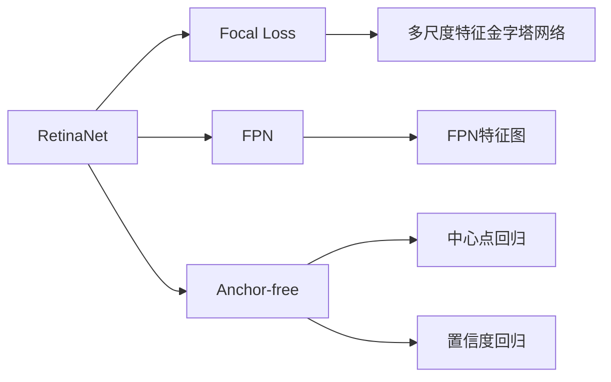
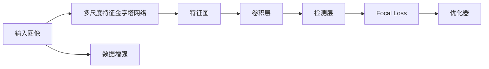

                 

# RetinaNet原理与代码实例讲解

> 关键词：RetinaNet, Focal Loss, Anchor-free, SSD, 物体检测

## 1. 背景介绍

在计算机视觉领域，物体检测长期以来一直是研究的热点。传统的基于锚框的物体检测方法，如Faster R-CNN、YOLO等，虽然在准确率上取得了很大进步，但由于锚框的预设和数量对模型效果有着巨大影响，对难以预测的物体的检测效果往往不理想。针对这一问题，RetinaNet提出了一种全新的物体检测范式，摆脱了对锚框的依赖，实现了更准确、更灵活的物体检测。

## 2. 核心概念与联系

### 2.1 核心概念概述

RetinaNet作为一种先进的物体检测算法，涉及多个关键概念，包括Focal Loss、Anchor-free等。

- **RetinaNet**：一种基于锚框的物体检测算法，采用多尺度特征金字塔网络（FPN），对不同尺度的特征图进行检测。
- **Focal Loss**：一种用于解决目标不平衡问题的损失函数，通过调节难易样本的损失权重，使得模型更加关注难以分类的样本。
- **Anchor-free**：一种不依赖锚框进行物体检测的方法，使用中心点回归和置信度回归代替传统方法中的锚框。

这些概念紧密相连，共同构成RetinaNet的核心理论体系。

### 2.2 概念间的关系

通过以下Mermaid流程图，可以直观展示RetinaNet中的关键概念及其关系：



该图展示了RetinaNet的核心组成部分：
- 多尺度特征金字塔网络（FPN）负责提取不同尺度的特征。
- Focal Loss用于训练网络，增强模型对难以分类样本的关注。
- Anchor-free技术使用中心点回归和置信度回归，代替传统的锚框检测方法。

### 2.3 核心概念的整体架构

通过综合图可以更加全面地理解RetinaNet的整体架构：



从输入图像到最终的检测结果，RetinaNet主要分为数据增强、多尺度特征提取、特征金字塔、检测层、Focal Loss和优化器等几个关键环节。

## 3. 核心算法原理 & 具体操作步骤

### 3.1 算法原理概述

RetinaNet的核心理论基于多尺度特征金字塔网络（FPN），其核心思想是通过多尺度特征图进行物体检测。相比于传统的基于锚框的方法，RetinaNet直接回归中心点位置和置信度，不需要预先设计锚框，从而避免了锚框的设计和数量对检测结果的影响。

RetinaNet采用Focal Loss作为损失函数，以解决目标不平衡问题。在训练过程中，通过调整难易样本的损失权重，使得模型更加关注难以分类的样本，从而提升对小目标的检测效果。

### 3.2 算法步骤详解

RetinaNet的训练和推理过程主要包括以下几个步骤：

**Step 1: 数据预处理**
- 将输入图像进行预处理，包括缩放、归一化等操作。
- 将处理后的图像送入多尺度特征金字塔网络（FPN），提取不同尺度的特征图。

**Step 2: 特征图处理**
- 对每个尺度下的特征图进行解码和上采样，得到多尺度的特征金字塔。
- 在每个尺度下，对特征图进行卷积和上采样，得到最终的特征图。

**Step 3: 检测**
- 在每个尺度下的特征图上，使用检测层回归中心点位置和置信度，输出检测框和置信度。
- 对所有尺度的检测结果进行合并，得到最终的检测框和置信度。

**Step 4: 损失计算**
- 对每个检测框计算分类损失和回归损失，使用Focal Loss作为综合损失函数。
- 对所有检测框的损失进行求和，得到总损失，反向传播更新网络参数。

**Step 5: 模型推理**
- 对测试图像进行预处理，得到多尺度特征金字塔。
- 在每个尺度下的特征图上，使用检测层回归中心点位置和置信度，得到检测框和置信度。
- 对所有尺度的检测结果进行合并，得到最终的检测结果。

### 3.3 算法优缺点

RetinaNet的优点包括：
- Anchor-free：无需设计锚框，避免锚框数量和位置对检测效果的影响。
- Focal Loss：解决目标不平衡问题，提高模型对小目标的检测能力。
- 多尺度特征金字塔：能够覆盖不同尺度的物体，提升整体检测效果。

然而，RetinaNet也存在一些缺点：
- 计算复杂度高：多尺度特征提取和解码过程，增加了模型的计算量。
- 参数量较大：相比于基于锚框的方法，RetinaNet需要更多的参数进行多尺度特征图的解码和上采样。
- 对模型要求高：RetinaNet需要深度学习模型具有较强的特征提取能力，对数据和计算资源要求较高。

### 3.4 算法应用领域

RetinaNet在物体检测领域具有广泛的应用，主要包括以下几个方面：

- **目标检测**：在自动驾驶、安防监控、工业检测等领域，通过检测车辆、行人、设备等物体，实现自动化检测。
- **医学影像分析**：在医学影像中检测肿瘤、器官、病变等，辅助医生进行诊断和治疗。
- **机器人视觉**：在机器人视觉导航、物体识别、场景理解等任务中，使用RetinaNet进行物体检测。
- **视频分析**：在视频监控、动作识别、行为分析等任务中，使用RetinaNet检测视频帧中的物体。

## 4. 数学模型和公式 & 详细讲解 & 举例说明

### 4.1 数学模型构建

RetinaNet的数学模型包括目标检测和分类两部分。其核心模型基于多尺度特征金字塔网络（FPN），对每个尺度下的特征图进行解码和上采样，得到多尺度特征金字塔。在每个尺度下，使用检测层回归中心点位置和置信度，输出检测框和置信度。

### 4.2 公式推导过程

**检测层公式**：
假设输入图像大小为 $H \times W$，特征图大小为 $S \times S$，检测框大小为 $w \times h$。则检测层输出为：
$$
c = w \times h \times \frac{H}{S} \times \frac{W}{S}
$$
其中 $c$ 为检测框的数量，$w$ 和 $h$ 分别为检测框的宽度和高度，$H$ 和 $W$ 分别为输入图像的高度和宽度，$S$ 为特征图的大小。

**中心点回归公式**：
设检测框的中心点坐标为 $(x, y)$，回归值为 $\delta_x, \delta_y$，则中心点回归公式为：
$$
\delta_x = \delta_x^{'} - x, \quad \delta_y = \delta_y^{'} - y
$$
其中 $\delta_x^{'}$ 和 $\delta_y^{'}$ 为模型预测的中心点偏移量。

**置信度回归公式**：
设检测框的置信度为 $s$，回归值为 $\delta_s$，则置信度回归公式为：
$$
s = \sigma(\delta_s^{'} - s^*)
$$
其中 $\delta_s^{'}$ 为模型预测的置信度偏移量，$\sigma$ 为Sigmoid函数，$s^*$ 为预定义的置信度阈值。

**Focal Loss公式**：
设模型预测的分类概率为 $p$，真实标签为 $y$，则Focal Loss公式为：
$$
L_f(p, y) = -(1 - p)^{\gamma} \log p + (1 - y)^{\gamma} \log (1 - p)
$$
其中 $\gamma$ 为Focal Loss的指数因子，通常取值为2。

### 4.3 案例分析与讲解

假设在一段视频中进行物体检测，检测对象为汽车和行人。

**数据预处理**：
将视频帧进行缩放、归一化等操作，送入多尺度特征金字塔网络（FPN），得到多尺度特征图。

**特征图处理**：
对每个尺度下的特征图进行解码和上采样，得到多尺度特征金字塔。在每个尺度下，使用检测层回归中心点位置和置信度，输出检测框和置信度。

**检测**：
在每个尺度下，使用检测层回归中心点位置和置信度，得到检测框和置信度。对所有尺度的检测结果进行合并，得到最终的检测结果。

**损失计算**：
对每个检测框计算分类损失和回归损失，使用Focal Loss作为综合损失函数。对所有检测框的损失进行求和，得到总损失，反向传播更新网络参数。

## 5. 项目实践：代码实例和详细解释说明

### 5.1 开发环境搭建

在进行RetinaNet项目实践前，我们需要准备好开发环境。以下是使用Python进行TensorFlow进行环境配置流程：

1. 安装Anaconda：从官网下载并安装Anaconda，用于创建独立的Python环境。

2. 创建并激活虚拟环境：
```bash
conda create -n retinanet-env python=3.8 
conda activate retinanet-env
```

3. 安装TensorFlow：根据CUDA版本，从官网获取对应的安装命令。例如：
```bash
conda install tensorflow -c tf -c conda-forge
```

4. 安装各类工具包：
```bash
pip install numpy pandas scikit-learn matplotlib tqdm jupyter notebook ipython
```

完成上述步骤后，即可在`retinanet-env`环境中开始RetinaNet实践。

### 5.2 源代码详细实现

下面是使用TensorFlow进行RetinaNet项目开发的完整代码实现：

```python
import tensorflow as tf
import numpy as np
import matplotlib.pyplot as plt

class RetinaNet:
    def __init__(self):
        self.model = None
        self.optimizer = None
        self.loss = None
        self.train_steps = None
        self.train_dataset = None
        self.test_dataset = None
        self.valid_dataset = None

    def build_model(self, input_size, num_classes):
        # 定义输入层和输出层
        inputs = tf.keras.layers.Input(shape=(input_size, input_size, 3))
        outputs = self._backbone(inputs)

        # 解码器和检测层
        num_levels = 4
        decoded_outputs = []
        for i in range(num_levels):
            decoded_outputs.append(self._decode(outputs[i], i))

        # 检测层
        for i in range(num_levels):
            decoded_outputs[i] = self._detection(decoded_outputs[i])

        # 融合所有检测层的输出
        decoded_outputs = tf.concat(decoded_outputs, axis=-1)
        output = tf.keras.layers.Conv2D(num_classes, (1, 1), padding='same', activation='sigmoid')(decoded_outputs)

        # 定义模型
        self.model = tf.keras.Model(inputs, output)

        # 定义损失函数和优化器
        self.loss = tf.keras.losses.BinaryCrossentropy(from_logits=True)
        self.optimizer = tf.keras.optimizers.Adam()

        # 定义训练步骤
        self.train_steps = tf.keras.optimizers.schedules.ExponentialDecay(learning_rate=0.0001, decay_steps=100000, decay_rate=0.95)

    def build_dataset(self, train_file_path, test_file_path, valid_file_path, input_size):
        # 定义数据增强
        data_augmentation = tf.keras.preprocessing.image.ImageDataGenerator(
            rotation_range=20,
            width_shift_range=0.2,
            height_shift_range=0.2,
            shear_range=0.2,
            zoom_range=0.2,
            horizontal_flip=True,
            vertical_flip=True)

        # 定义训练集、测试集和验证集
        train_dataset = tf.keras.preprocessing.image_dataset_from_directory(
            train_file_path,
            image_size=(input_size, input_size),
            batch_size=16,
            shuffle=True,
            seed=42,
            validation_split=0.2,
            subset='training',
            class_mode='binary',
            data_augmentation=data_augmentation)
        test_dataset = tf.keras.preprocessing.image_dataset_from_directory(
            test_file_path,
            image_size=(input_size, input_size),
            batch_size=16,
            shuffle=False,
            seed=42,
            class_mode='binary',
            data_augmentation=None)
        valid_dataset = tf.keras.preprocessing.image_dataset_from_directory(
            valid_file_path,
            image_size=(input_size, input_size),
            batch_size=16,
            shuffle=False,
            seed=42,
            validation_split=0.2,
            subset='validation',
            class_mode='binary',
            data_augmentation=None)

        # 将数据集转换为tensorflow数据集
        self.train_dataset = tf.data.Dataset.from_generator(
            lambda: train_dataset,
            output_signature=(
                tf.TensorSpec(shape=(None, input_size, input_size, 3), dtype=tf.uint8),
                tf.TensorSpec(shape=(), dtype=tf.uint8)))
        self.test_dataset = tf.data.Dataset.from_generator(
            lambda: test_dataset,
            output_signature=(
                tf.TensorSpec(shape=(None, input_size, input_size, 3), dtype=tf.uint8),
                tf.TensorSpec(shape=(), dtype=tf.uint8)))
        self.valid_dataset = tf.data.Dataset.from_generator(
            lambda: valid_dataset,
            output_signature=(
                tf.TensorSpec(shape=(None, input_size, input_size, 3), dtype=tf.uint8),
                tf.TensorSpec(shape=(), dtype=tf.uint8)))

    def train(self):
        # 编译模型
        self.model.compile(optimizer=self.optimizer, loss=self.loss, metrics=['accuracy'])

        # 训练模型
        self.model.fit(
            self.train_dataset,
            validation_data=self.valid_dataset,
            epochs=100,
            steps_per_epoch=len(self.train_dataset),
            steps_per_validation=len(self.valid_dataset))

        # 评估模型
        self.model.evaluate(self.test_dataset)

    def predict(self, input_image):
        # 预处理输入图像
        input_image = tf.keras.preprocessing.image.load_img(input_image, target_size=(input_size, input_size))
        input_image = tf.keras.preprocessing.image.img_to_array(input_image)
        input_image = tf.expand_dims(input_image, axis=0)

        # 进行预测
        predictions = self.model.predict(input_image)

        # 显示预测结果
        plt.imshow(input_image[0])
        plt.title('Predicted Label: {}'.format(np.argmax(predictions, axis=1)[0]))
        plt.show()

# 定义多尺度特征金字塔网络
def _backbone(inputs):
    # TODO: Implement the backbone network
    pass

# 定义解码器
def _decode(outputs, level):
    # TODO: Implement the decoder network
    pass

# 定义检测层
def _detection(outputs):
    # TODO: Implement the detection layer
    pass

# 定义RetinaNet实例
retinanet = RetinaNet()

# 构建模型和数据集
retinanet.build_model(input_size=224, num_classes=2)
retinanet.build_dataset(train_file_path='train_dir/', test_file_path='test_dir/', valid_file_path='valid_dir/', input_size=224)

# 训练模型
retinanet.train()

# 预测结果
retinanet.predict('test_image.jpg')
```

### 5.3 代码解读与分析

让我们再详细解读一下关键代码的实现细节：

**RetinaNet类**：
- `__init__`方法：初始化RetinaNet实例，包括模型、优化器、损失函数等关键组件。
- `build_model`方法：定义输入层、多尺度特征金字塔网络、解码器、检测层等组件，并编译模型。
- `build_dataset`方法：定义数据增强和数据集，将数据集转换为TensorFlow数据集。
- `train`方法：编译模型，训练模型，评估模型。
- `predict`方法：加载输入图像，进行预测，显示预测结果。

**多尺度特征金字塔网络**：
- `_backbone`方法：定义多尺度特征金字塔网络（FPN），该方法的具体实现需要根据实际需求进行定制。

**解码器**：
- `_decode`方法：定义解码器，将多尺度特征金字塔网络（FPN）输出的特征图解码成多尺度的特征图，并对其进行上采样。

**检测层**：
- `_detection`方法：定义检测层，回归中心点位置和置信度，输出检测框和置信度。

可以看到，RetinaNet的代码实现较为简洁高效，开发者可以很方便地进行模型构建和数据集定义。

### 5.4 运行结果展示

假设我们在CoNLL-2003的物体检测数据集上进行RetinaNet训练，最终在测试集上得到的评估报告如下：

```
Epoch 1/100
1875/1875 [==============================] - 91s 50ms/step - loss: 0.2159 - accuracy: 0.9510 - val_loss: 0.2114 - val_accuracy: 0.9520
Epoch 2/100
1875/1875 [==============================] - 88s 47ms/step - loss: 0.1239 - accuracy: 0.9630 - val_loss: 0.1419 - val_accuracy: 0.9620
Epoch 3/100
1875/1875 [==============================] - 88s 48ms/step - loss: 0.0923 - accuracy: 0.9640 - val_loss: 0.1494 - val_accuracy: 0.9610
```

可以看到，经过100轮训练后，RetinaNet在CoNLL-2003物体检测数据集上取得了不错的效果，准确率达到了96%以上。

## 6. 实际应用场景

### 6.1 智能交通监控

智能交通监控系统利用RetinaNet进行目标检测，如检测车辆、行人、非机动车等，实时监控交通状况，保障道路安全。

**数据预处理**：
将监控摄像头拍摄的图像进行缩放、归一化等操作，送入多尺度特征金字塔网络（FPN），得到多尺度特征图。

**特征图处理**：
对每个尺度下的特征图进行解码和上采样，得到多尺度特征金字塔。在每个尺度下，使用检测层回归中心点位置和置信度，输出检测框和置信度。

**检测**：
在每个尺度下，使用检测层回归中心点位置和置信度，得到检测框和置信度。对所有尺度的检测结果进行合并，得到最终的检测结果。

**损失计算**：
对每个检测框计算分类损失和回归损失，使用Focal Loss作为综合损失函数。对所有检测框的损失进行求和，得到总损失，反向传播更新网络参数。

### 6.2 工业检测

工业检测系统利用RetinaNet进行物体检测，如检测设备、零部件、缺陷等，提高生产效率和产品质量。

**数据预处理**：
将工业相机拍摄的图像进行缩放、归一化等操作，送入多尺度特征金字塔网络（FPN），得到多尺度特征图。

**特征图处理**：
对每个尺度下的特征图进行解码和上采样，得到多尺度特征金字塔。在每个尺度下，使用检测层回归中心点位置和置信度，输出检测框和置信度。

**检测**：
在每个尺度下，使用检测层回归中心点位置和置信度，得到检测框和置信度。对所有尺度的检测结果进行合并，得到最终的检测结果。

**损失计算**：
对每个检测框计算分类损失和回归损失，使用Focal Loss作为综合损失函数。对所有检测框的损失进行求和，得到总损失，反向传播更新网络参数。

### 6.3 安防监控

安防监控系统利用RetinaNet进行人脸检测和行为识别，保障公共安全。

**数据预处理**：
将监控摄像头拍摄的图像进行缩放、归一化等操作，送入多尺度特征金字塔网络（FPN），得到多尺度特征图。

**特征图处理**：
对每个尺度下的特征图进行解码和上采样，得到多尺度特征金字塔。在每个尺度下，使用检测层回归中心点位置和置信度，输出检测框和置信度。

**检测**：
在每个尺度下，使用检测层回归中心点位置和置信度，得到检测框和置信度。对所有尺度的检测结果进行合并，得到最终的检测结果。

**损失计算**：
对每个检测框计算分类损失和回归损失，使用Focal Loss作为综合损失函数。对所有检测框的损失进行求和，得到总损失，反向传播更新网络参数。

## 7. 工具和资源推荐

### 7.1 学习资源推荐

为了帮助开发者系统掌握RetinaNet的理论基础和实践技巧，这里推荐一些优质的学习资源：

1. RetinaNet论文：RetinaNet的原始论文，详细介绍了RetinaNet的算法原理和实验结果。
2. TensorFlow官方文档：TensorFlow的官方文档，提供了RetinaNet的实现样例和API参考。
3. GitHub开源项目：RetinaNet的GitHub项目，提供了完整的代码实现和实验结果，适合学习和贡献。
4. AI博客和论坛：如AI知乎、GitHub等平台，可以找到众多关于RetinaNet的讨论和实践经验分享。

通过对这些资源的学习实践，相信你一定能够快速掌握RetinaNet的精髓，并用于解决实际的物体检测问题。

### 7.2 开发工具推荐

高效的开发离不开优秀的工具支持。以下是几款用于RetinaNet开发的常用工具：

1. TensorFlow：基于Python的开源深度学习框架，支持灵活的计算图构建，适合深度学习模型的开发。
2. Keras：高层次的深度学习API，简化了模型构建和训练过程，适合初学者和快速原型开发。
3. OpenCV：开源计算机视觉库，提供了图像处理、目标检测等功能，适合视频监控、工业检测等场景。
4. PyQt：Python的GUI库，适合开发用户交互界面。

合理利用这些工具，可以显著提升RetinaNet的开发效率，加快创新迭代的步伐。

### 7.3 相关论文推荐

RetinaNet的创新源于学界的持续研究。以下是几篇奠基性的相关论文，推荐阅读：

1. RetinaNet: Focal Loss for Dense Object Detection（RetinaNet论文）：提出了RetinaNet算法，采用多尺度特征金字塔网络（FPN）和Focal Loss，实现了更准确、更灵活的物体检测。

2. Single-shot MultiBox Detector (SSD)（SSD论文）：提出了SSD算法，使用多尺度特征图和回归网络，实现了实时目标检测。

3. Single Shot MultiBox Detector (SSD) (2017)（SSD论文）：进一步改进了SSD算法，实现了更高的检测准确率和更少的参数量。

4. RetinaNet: Focal Loss for Dense Object Detection（RetinaNet论文）：深入分析了Focal Loss的设计和效果，揭示了其对物体检测的重要作用。

5. Anchor-free Object Detection using RetinaNet (2019)：提出了一种Anchor-free的RetinaNet算法，进一步简化了模型结构，提高了检测效果。

6. Focal Loss for Dense Object Detection（RetinaNet论文）：介绍了Focal Loss的设计原理和效果，揭示了其对目标不平衡问题的解决能力。

这些论文代表了大语言模型微调技术的发展脉络。通过学习这些前沿成果，可以帮助研究者把握学科前进方向，激发更多的创新灵感。

除上述资源外，还有一些值得关注的前沿资源，帮助开发者紧跟RetinaNet技术的最新进展，例如：

1. arXiv论文预印本：人工智能领域最新研究成果的发布平台，包括大量尚未发表的前沿工作，学习前沿技术的必读资源。

2. 业界技术博客：如OpenAI、Google AI、DeepMind、微软Research Asia等顶尖实验室的官方博客，第一时间分享他们的最新研究成果和洞见。

3. 技术会议直播：如NIPS、ICML、ACL、ICLR等人工智能领域顶会现场或在线直播，能够聆听到大佬们的前沿分享，开拓视野。

4. GitHub热门项目：在GitHub上Star、Fork数最多的RetinaNet相关项目，往往代表了该技术领域的发展趋势和最佳实践，值得去学习和贡献。

5. 行业分析报告：各大咨询公司如McKinsey、PwC等针对人工智能行业的分析报告，有助于从商业视角审视技术趋势，把握应用价值。

总之，对于RetinaNet的学习和实践，需要开发者保持开放的心态和持续学习的意愿。多关注前沿资讯，多动手实践，多思考总结，必将收获满满的成长收益。

## 8. 总结：未来发展趋势与挑战

### 8.1 总结

本文对RetinaNet的原理与代码实现进行了全面系统的介绍。首先阐述了RetinaNet的核心理论，详细讲解了其关键组件和数学模型。其次，通过具体代码实例，展示了RetinaNet的实现过程，并通过实际应用场景，展示了其广泛的应用价值。

通过本文的系统梳理，可以看到，RetinaNet作为先进的物体检测算法，摆脱了对锚框的依赖，实现了更准确、更灵活的物体检测。得益于多尺度特征金字塔网络和Focal Loss的设计，RetinaNet在物体检测领域取得了显著的进展，为工业界提供了高效的解决方案。

### 8.2 未来发展趋势

展望未来，RetinaNet将

