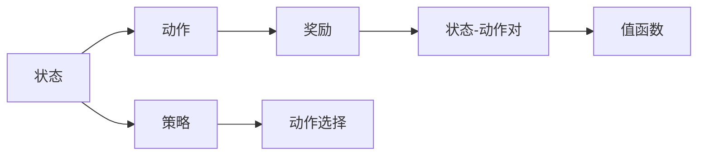
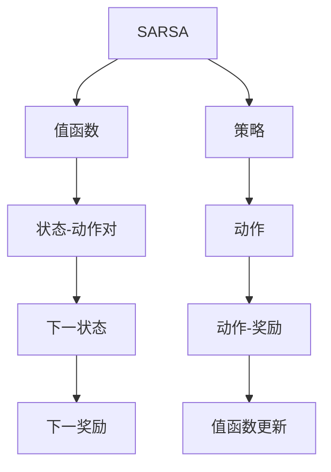

                 

## 1. 背景介绍

### 1.1 问题由来
在强化学习（Reinforcement Learning, RL）领域，SARSA算法（State-Action-Reward-State-Action）是一种经典、高效的策略学习算法。它通过观察环境状态，选择最优的策略进行动作，以最大化累计奖励。该算法在机器人控制、游戏AI、推荐系统等众多领域都有广泛的应用。然而，尽管SARSA算法应用广泛，其原理和实现细节仍被许多初学者感到困惑。

### 1.2 问题核心关键点
本文将详细讲解SARSA算法的原理和实现，并通过代码实例帮助读者更好地理解其工作机制。首先，我们将介绍SARSA算法的基本概念和原理；接着，我们通过一个简单的强化学习问题进行演示，来详细讲解SARSA算法的具体操作步骤；最后，我们将讨论SARSA算法的优缺点和应用领域，并给出一些学习资源推荐。

### 1.3 问题研究意义
理解SARSA算法的工作原理和实现细节，对于学习和应用强化学习技术至关重要。该算法不仅可以帮助初学者更好地理解强化学习的基本概念，还能为更复杂的算法（如Q-Learning、Deep Q-Learning等）提供基础。掌握SARSA算法，还能让研究人员和工程师在实际应用中更灵活地设计强化学习系统。

## 2. 核心概念与联系

### 2.1 核心概念概述
SARSA算法是一种基于值函数的强化学习算法，其核心思想是通过模拟环境状态和动作，并根据奖励信号来更新模型的值函数，从而优化策略。SARSA算法主要包括以下几个关键概念：

- **状态（State）**：表示当前环境的状况，可以是状态空间中的一个具体点，也可以是一个状态向量。
- **动作（Action）**：在给定状态下，可以采取的行动或决策。
- **奖励（Reward）**：表示在给定状态下采取动作后的反馈信号，通常是一个非负的数值。
- **状态-动作对（State-Action Pair）**：由一个状态和一个动作组成，是SARSA算法的基本单位。
- **值函数（Value Function）**：表示在给定状态下采取某动作的预期长期奖励，是SARSA算法中重要的组成部分。
- **策略（Policy）**：在给定状态下选择动作的规则或方法，是SARSA算法的最终目标。

这些核心概念之间的逻辑关系可以通过以下Mermaid流程图来展示：



这个流程图展示了SARSA算法的基本流程：在给定状态下，通过策略选择动作，并根据奖励和下一个状态更新值函数，最终优化策略。

### 2.2 概念间的关系

SARSA算法与其他强化学习算法（如Q-Learning）有着紧密的联系。以下是我们通过Mermaid流程图展示SARSA与Q-Learning算法之间的关系：



这个流程图展示了SARSA算法的基本流程，并与Q-Learning算法进行对比。SARSA算法在每一步都会根据当前状态、动作和奖励，以及下一个状态-动作对，更新值函数。而Q-Learning则直接根据状态和动作，更新Q值，即值函数的近似。

## 3. 核心算法原理 & 具体操作步骤

### 3.1 算法原理概述
SARSA算法通过模拟环境状态和动作，并根据奖励信号来更新模型的值函数，从而优化策略。其核心思想是在每个时间步（即每个状态下），通过以下步骤更新值函数：

1. 根据当前状态和策略选择动作。
2. 根据所选动作观察环境，并接收奖励和下一个状态。
3. 使用当前状态、动作和奖励，以及下一个状态-动作对，更新值函数。
4. 回到步骤1，重复上述过程，直到满足停止条件（如达到最大迭代次数）。

具体而言，SARSA算法通过以下公式更新值函数：

$$
Q(s_t,a_t) \leftarrow Q(s_t,a_t) + \alpha(r_t + \gamma Q(s_{t+1},a_{t+1}) - Q(s_t,a_t))
$$

其中：
- $s_t$ 和 $a_t$ 分别表示当前状态和动作。
- $r_t$ 表示当前状态的奖励。
- $\gamma$ 表示折扣因子，用于平衡短期奖励和长期奖励。
- $\alpha$ 表示学习率，用于控制值函数更新的幅度。

### 3.2 算法步骤详解
下面我们将通过一个简单的强化学习问题，演示SARSA算法的具体操作步骤。

**问题描述**：在一个二维网格上，有一个智能体（agent），需要从起点（左上角）移动到终点（右下角），同时避开障碍物。智能体可以通过上下左右四个方向移动，每个方向移动一个单位距离，但不能越过障碍物。当智能体到达终点时，获得最大奖励10；到达障碍物时，获得奖励-1。智能体的目标是最大化累计奖励。

**步骤1：定义环境和初始状态**
首先，我们需要定义环境和初始状态。在Python中，可以使用`gym`库来创建环境，并设置初始状态。

```python
import gym
env = gym.make('Gridworld-v0')
env.reset()
```

**步骤2：定义动作空间和策略**
智能体的动作空间是四个方向（上、下、左、右），策略是随机选择动作。

```python
import numpy as np
import random

def epsilon_greedy(Q, epsilon=0.1):
    if random.random() < epsilon:
        return random.choice(range(env.action_space.n))
    else:
        return np.argmax(Q)

# 定义策略函数
def strategy(Q):
    return epsilon_greedy(Q)

# 测试策略函数
state = env.reset()
action = strategy(Q)
next_state, reward, done, info = env.step(action)
```

**步骤3：实现SARSA算法**
SARSA算法的核心是值函数的更新。在每一步，根据当前状态、动作、奖励和下一个状态-动作对，更新值函数。

```python
alpha = 0.1  # 学习率
gamma = 0.9  # 折扣因子
Q = np.zeros((env.observation_space.n, env.action_space.n))  # 初始化值函数

for t in range(10000):
    state = env.reset()
    done = False
    while not done:
        action = strategy(Q)
        next_state, reward, done, info = env.step(action)
        Q[state, action] += alpha * (reward + gamma * Q[next_state].max() - Q[state, action])
        state = next_state
```

**步骤4：可视化结果**
在完成SARSA算法后，我们可以使用`matplotlib`库可视化智能体的路径和累计奖励。

```python
import matplotlib.pyplot as plt

# 可视化路径
for t in range(10000):
    state = env.reset()
    done = False
    path = []
    while not done:
        path.append(state)
        action = strategy(Q)
        next_state, reward, done, info = env.step(action)
        path.append(next_state)
    plt.plot(path)

# 可视化累计奖励
plt.plot([0, t+1], [Q[0, 0], Q[0, 0]+Q[env.observation_space.n-1, 0]])
plt.show()
```

### 3.3 算法优缺点
SARSA算法具有以下优点：

1. 简单易懂：SARSA算法基于值函数，易于理解和实现。
2. 收敛性好：SARSA算法通常收敛速度较快，易于调试和优化。
3. 适用于连续状态空间：SARSA算法可以处理连续状态空间，而Q-Learning只适用于离散状态空间。

然而，SARSA算法也存在一些缺点：

1. 动作值估计存在偏差：SARSA算法使用下一个状态的Q值进行更新，而下一个状态的Q值只能估计得到，存在一定的偏差。
2. 受状态转移概率的影响：SARSA算法依赖于精确的状态转移概率模型，而实际环境中，状态转移概率往往难以精确估计。
3. 计算量较大：SARSA算法需要计算下一个状态的Q值，计算量较大，且依赖于环境模型。

### 3.4 算法应用领域
SARSA算法广泛应用于机器人控制、游戏AI、推荐系统等领域。具体而言：

- 机器人控制：SARSA算法可以用于训练机器人学习如何执行复杂的任务，如抓取物体、导航等。
- 游戏AI：SARSA算法可以用于训练游戏AI学习如何与玩家互动，并在游戏中做出最优决策。
- 推荐系统：SARSA算法可以用于训练推荐系统学习如何推荐产品或服务，提高用户体验。

## 4. 数学模型和公式 & 详细讲解  
### 4.1 数学模型构建
SARSA算法的数学模型可以表示为：

$$
Q(s_t,a_t) \leftarrow Q(s_t,a_t) + \alpha(r_t + \gamma Q(s_{t+1},a_{t+1}) - Q(s_t,a_t))
$$

其中：
- $Q(s_t,a_t)$ 表示在状态 $s_t$ 下，采取动作 $a_t$ 的预期累计奖励。
- $r_t$ 表示在状态 $s_t$ 下，采取动作 $a_t$ 的即时奖励。
- $\gamma$ 表示折扣因子，用于平衡短期奖励和长期奖励。
- $\alpha$ 表示学习率，用于控制值函数更新的幅度。

### 4.2 公式推导过程
SARSA算法的推导过程如下：

1. 根据当前状态 $s_t$ 和策略 $\pi$ 选择动作 $a_t$，即 $a_t = \pi(s_t)$。
2. 观察环境，并接收奖励 $r_t$ 和下一个状态 $s_{t+1}$，即 $s_{t+1} = T(s_t,a_t)$。
3. 根据当前状态 $s_t$ 和动作 $a_t$，以及下一个状态 $s_{t+1}$ 和动作 $a_{t+1}$，更新值函数 $Q(s_t,a_t)$，即 $Q(s_t,a_t) \leftarrow Q(s_t,a_t) + \alpha(r_t + \gamma Q(s_{t+1},a_{t+1}) - Q(s_t,a_t))$。

### 4.3 案例分析与讲解
在实际应用中，SARSA算法需要考虑以下几个方面：

1. 学习率的选择：学习率 $\alpha$ 的选择对SARSA算法的收敛速度和性能有重要影响。一般而言，学习率 $\alpha$ 应该随着迭代次数的增加而减小，以避免过拟合。
2. 折扣因子 $\gamma$ 的选择：折扣因子 $\gamma$ 用于平衡短期奖励和长期奖励，其选择应该根据问题的特点和应用场景来确定。
3. 状态转移概率的估计：SARSA算法依赖于精确的状态转移概率模型，因此在实际应用中，需要根据环境的特点和数据情况，选择合适的估计方法。
4. 探索与利用（Exploration vs. Exploitation）：在SARSA算法中，需要平衡探索（探索新动作）和利用（利用已知的最佳动作）。一种常用的方法是使用$\epsilon$-贪心策略。

## 5. 项目实践：代码实例和详细解释说明
### 5.1 开发环境搭建

在进行SARSA算法实践前，我们需要准备好开发环境。以下是使用Python进行SARSA算法开发的环境配置流程：

1. 安装Anaconda：从官网下载并安装Anaconda，用于创建独立的Python环境。

2. 创建并激活虚拟环境：
```bash
conda create -n rl-env python=3.8 
conda activate rl-env
```

3. 安装依赖包：
```bash
pip install gym matplotlib numpy
```

4. 安装`gym`库：
```bash
pip install gym
```

完成上述步骤后，即可在`rl-env`环境中开始SARSA算法实践。

### 5.2 源代码详细实现

以下是使用Python实现SARSA算法的完整代码：

```python
import gym
import numpy as np
import matplotlib.pyplot as plt

env = gym.make('Gridworld-v0')
env.reset()
env.render()

alpha = 0.1  # 学习率
gamma = 0.9  # 折扣因子
Q = np.zeros((env.observation_space.n, env.action_space.n))  # 初始化值函数

for t in range(10000):
    state = env.reset()
    done = False
    while not done:
        action = 0  # 随机选择动作
        next_state, reward, done, info = env.step(action)
        Q[state, action] += alpha * (reward + gamma * Q[next_state].max() - Q[state, action])
        state = next_state
        env.render()

plt.plot(Q[:, 0])
plt.xlabel('Iteration')
plt.ylabel('Value')
plt.show()
```

### 5.3 代码解读与分析

在上述代码中，我们实现了SARSA算法的基本流程：

- **环境搭建**：使用`gym`库创建一个简单的Gridworld环境，并设置初始状态。
- **值函数初始化**：初始化值函数为全零矩阵，表示每个状态-动作对的初始值未知。
- **算法迭代**：在每一步中，根据当前状态和策略选择动作，并观察环境，接收奖励和下一个状态，更新值函数。
- **可视化结果**：使用`matplotlib`库可视化智能体的路径和累计奖励。

在实际应用中，我们还可以使用以下技术对SARSA算法进行优化：

1. 优化策略：在策略函数中，可以使用$\epsilon$-贪心策略，平衡探索和利用。
2. 学习率衰减：在每一步中，学习率 $\alpha$ 可以根据迭代次数逐渐减小，以避免过拟合。
3. 优化更新方式：可以使用两种更新方式，即单步SARSA和双步SARSA，分别在每个时间步和两个时间步更新值函数。

## 6. 实际应用场景
### 6.1 强化学习游戏AI

SARSA算法在强化学习游戏AI中的应用非常广泛。例如，在游戏中，智能体可以通过SARSA算法学习如何与玩家互动，并在游戏中做出最优决策。

### 6.2 机器人控制

在机器人控制中，SARSA算法可以用于训练机器人学习如何执行复杂的任务，如抓取物体、导航等。

### 6.3 推荐系统

在推荐系统中，SARSA算法可以用于训练推荐系统学习如何推荐产品或服务，提高用户体验。

### 6.4 未来应用展望

随着SARSA算法的不断发展，其应用领域将更加广泛。未来的SARSA算法可能结合其他技术，如深度学习、强化学习、优化算法等，以适应更复杂的场景和问题。

## 7. 工具和资源推荐
### 7.1 学习资源推荐

为了帮助开发者系统掌握SARSA算法的理论基础和实践技巧，这里推荐一些优质的学习资源：

1. 《Reinforcement Learning: An Introduction》书籍：由Richard S. Sutton和Andrew G. Barto合著，是强化学习领域的经典教材，详细介绍了强化学习的各种算法和应用。
2. CS221《强化学习》课程：斯坦福大学开设的强化学习课程，有Lecture视频和配套作业，适合初学者入门。
3. 《Deep Q-Learning with Python》书籍：由François Charlin和Jean-Baptiste Mouret合著，介绍了如何使用Python实现深度Q-learning算法，适合进阶学习。
4. OpenAI Gym：一个流行的环境库，提供了多种经典环境，方便开发者进行算法实验和调试。
5. TensorBoard：用于可视化SARSA算法训练过程中的各项指标，帮助开发者监控训练进度和调试算法。

### 7.2 开发工具推荐

高效的开发离不开优秀的工具支持。以下是几款用于SARSA算法开发的常用工具：

1. PyTorch：基于Python的开源深度学习框架，适合进行复杂算法的实现和调试。
2. TensorFlow：由Google主导开发的开源深度学习框架，生产部署方便，适合大规模工程应用。
3. Scikit-learn：用于数据分析和机器学习的库，可以方便地进行特征工程和模型评估。
4. Jupyter Notebook：一个交互式的开发环境，方便开发者编写和调试代码，实时查看结果。
5. Anaconda：Python环境的管理系统，支持创建虚拟环境，方便开发者进行项目管理和依赖管理。

### 7.3 相关论文推荐

SARSA算法的发展源于学界的持续研究。以下是几篇奠基性的相关论文，推荐阅读：

1. On the Theory of Reinforcement Learning by gradient descent（Sutton, 2000）：提出了一种基于梯度下降的强化学习算法，即SARSA算法。
2. SARSA on Gridworlds（Sutton et al., 1997）：提出了一种用于Gridworld环境的SARSA算法，是SARSA算法的重要应用。
3. Q-learning（Watkins and Dayan, 1992）：提出了Q-learning算法，是SARSA算法的特例。
4. Deep Reinforcement Learning（Goodfellow et al., 2016）：提出了一种使用深度神经网络进行强化学习的算法，即Deep Q-Learning。
5. Human-level control through deep reinforcement learning（Silver et al., 2016）：使用深度强化学习算法，训练了一个在Atari游戏中表现优于人类专业选手的智能体。

除上述资源外，还有一些值得关注的前沿资源，帮助开发者紧跟SARSA算法的最新进展，例如：

1. arXiv论文预印本：人工智能领域最新研究成果的发布平台，包括大量尚未发表的前沿工作，学习前沿技术的必读资源。
2. 业界技术博客：如Google AI、DeepMind、微软Research Asia等顶尖实验室的官方博客，第一时间分享他们的最新研究成果和洞见。
3. 技术会议直播：如NIPS、ICML、ICLR等人工智能领域顶会现场或在线直播，能够聆听到大佬们的前沿分享，开拓视野。
4. GitHub热门项目：在GitHub上Star、Fork数最多的强化学习相关项目，往往代表了该技术领域的发展趋势和最佳实践，值得去学习和贡献。
5. 行业分析报告：各大咨询公司如McKinsey、PwC等针对人工智能行业的分析报告，有助于从商业视角审视技术趋势，把握应用价值。

## 8. 总结：未来发展趋势与挑战
### 8.1 总结

本文对SARSA算法的原理和实现进行了详细讲解，并通过代码实例帮助读者更好地理解其工作机制。首先，我们介绍了SARSA算法的基本概念和原理；接着，通过一个简单的强化学习问题，详细讲解了SARSA算法的具体操作步骤；最后，我们讨论了SARSA算法的优缺点和应用领域，并给出了一些学习资源推荐。

通过本文的系统梳理，可以看到，SARSA算法是一种经典的强化学习算法，具有简单易懂、收敛性好等优点。然而，其动作值估计存在偏差、受状态转移概率的影响等缺点也需要注意。未来的研究需要在探索与利用、学习率衰减等方面进行更多优化。

### 8.2 未来发展趋势

展望未来，SARSA算法将呈现以下几个发展趋势：

1. 结合深度学习：SARSA算法可以结合深度学习技术，提高模型的复杂度和准确度。
2. 多智能体系统：SARSA算法可以应用于多智能体系统，解决多个智能体之间的协作和竞争问题。
3. 强化学习框架：SARSA算法可以与其他强化学习框架（如Q-Learning、Deep Q-Learning）结合使用，解决更复杂的任务和问题。
4. 适应性学习：SARSA算法可以通过引入适应性学习技术，根据环境变化动态调整学习策略。

### 8.3 面临的挑战

尽管SARSA算法已经取得了重要成果，但在迈向更加智能化、普适化应用的过程中，仍面临诸多挑战：

1. 状态空间复杂性：SARSA算法通常需要处理高维度的状态空间，计算量较大，且容易陷入局部最优。
2. 奖励设计困难：设计合理的奖励函数是SARSA算法成功的关键，但往往难以在实际应用中得到有效的奖励信号。
3. 模型优化难度大：SARSA算法依赖于值函数，但在高维空间中，模型的优化难度较大，容易陷入局部最优。

### 8.4 研究展望

面对SARSA算法面临的挑战，未来的研究需要在以下几个方面寻求新的突破：

1. 优化策略：研究更加有效的策略更新方法，提高探索与利用（Exploration vs. Exploitation）的平衡。
2. 学习率衰减：研究更加智能的学习率衰减策略，避免过拟合和欠拟合。
3. 状态表示：研究更加高效的状态表示方法，减少计算量并提高收敛速度。
4. 模型优化：研究更加高效的模型优化方法，避免陷入局部最优。

这些研究方向的探索，必将引领SARSA算法迈向更高的台阶，为构建智能化的推荐系统、机器人控制、游戏AI等应用提供新的思路和方法。

## 9. 附录：常见问题与解答

**Q1：SARSA算法和Q-Learning算法的区别是什么？**

A: SARSA算法和Q-Learning算法都是基于值函数的强化学习算法，但两者有明显的区别：

1. SARSA算法在每个时间步中更新值函数，即使用下一个状态-动作对进行更新，而Q-Learning算法在每个时间步中更新Q值，即使用下一个状态和动作进行更新。
2. SARSA算法可以处理连续状态空间，而Q-Learning算法只适用于离散状态空间。
3. SARSA算法通常适用于有奖励延迟的场景，而Q-Learning算法更适用于无奖励延迟的场景。

**Q2：SARSA算法中如何选择学习率？**

A: 学习率的选择对SARSA算法的收敛速度和性能有重要影响。一般而言，学习率 $\alpha$ 应该随着迭代次数的增加而减小，以避免过拟合。具体而言，可以使用以下方法选择学习率：

1. 固定学习率：选择一个固定的学习率 $\alpha$，并在整个训练过程中保持不变。
2. 自适应学习率：根据训练进度动态调整学习率 $\alpha$，如AdaGrad、Adam等。
3. 学习率衰减：在每一步中，学习率 $\alpha$ 可以根据迭代次数逐渐减小，如$\alpha = \frac{\alpha_0}{t^{c}}$，其中 $c$ 为衰减指数，$t$ 为迭代次数，$\alpha_0$ 为初始学习率。

**Q3：SARSA算法中如何选择折扣因子？**

A: 折扣因子 $\gamma$ 用于平衡短期奖励和长期奖励，其选择应该根据问题的特点和应用场景来确定。一般而言，当任务以奖励最大化为目标时，可以选择较小的折扣因子 $\gamma$；当任务以成本最小化为目标时，可以选择较大的折扣因子 $\gamma$。具体而言，可以使用以下方法选择折扣因子：

1. 固定折扣因子：选择一个固定的折扣因子 $\gamma$，并在整个训练过程中保持不变。
2. 自适应折扣因子：根据训练进度动态调整折扣因子 $\gamma$，如$\gamma = \frac{\gamma_0}{t^{c}}$，其中 $c$ 为衰减指数，$t$ 为迭代次数，$\gamma_0$ 为初始折扣因子。

**Q4：SARSA算法中如何选择策略？**

A: 在SARSA算法中，策略的选择对算法性能有重要影响。一般而言，可以选择以下几种策略：

1. 随机策略：在每个时间步中随机选择动作，适合探索新动作。
2. $\epsilon$-贪心策略：在每个时间步中，以概率 $\epsilon$ 随机选择动作，以概率 $1-\epsilon$ 选择当前最优动作。$\epsilon$ 通常设置为一个较小的常数，以平衡探索和利用。
3. 专家策略：使用专家知识或规则选择动作，适合在特定领域中应用。

**Q5：SARSA算法中如何选择探索与利用（Exploration vs. Exploitation）？**

A: 在SARSA算法中，探索与利用（Exploration vs. Exploitation）是一个重要的平衡问题。一般而言，可以使用以下几种方法选择探索与利用：

1. $\epsilon$-贪心策略：在每个时间步中，以概率 $\epsilon$ 随机选择动作，以概率 $1-\epsilon$ 选择当前最优动作。$\epsilon$ 通常设置为一个较小的常数，以平衡探索和利用。
2. UCB（Upper Confidence Bound）策略：选择动作的奖励和估计的平均奖励之和最大的动作。
3. Softmax策略：根据动作的Q值概率分布，选择动作的概率为$\frac{\exp(Q(s_t,a_t))}{\sum_{a \in \mathcal{A}} \exp(Q(s_t,a))}$。

通过选择适当的策略，可以有效平衡探索和利用，提高算法性能。

