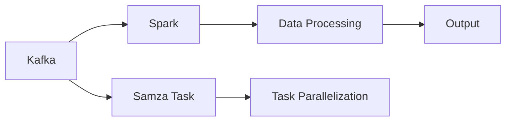

                 

## 1. 背景介绍

### 1.1 问题由来
在当今数据驱动的数字化转型浪潮中，实时数据处理能力显得尤为重要。企业需要实时分析海量数据，从中提取有价值的信息，以支持决策和运营。Apache Kafka和Apache Spark作为领先的分布式数据处理框架，为企业提供了强大的实时数据处理能力。然而，对于实时数据处理，传统的MapReduce等计算模型显得有些力不从心。

针对实时数据处理的需求，Apache Samza应运而生。它是一个开源的流式处理框架，支持在Kafka上实时处理数据流，并通过Spark进行计算。Samza提供了一套强大的API，方便开发者使用，使得实时数据处理变得简单高效。

### 1.2 问题核心关键点
Samza的核心在于实现了一个能够兼容Kafka和Spark的实时数据处理框架。它的主要特点包括：

- 数据流处理：Samza将数据流作为最基本的处理单位，通过Kafka实时获取数据，通过Spark进行计算。
- 高可用性：Samza通过Zookeeper保证作业和容器的状态，使得作业能够在节点故障时自动重启。
- 可扩展性：Samza支持水平扩展，通过添加更多的容器，可以提升处理能力。
- 容错性：Samza通过定期检查和自动恢复机制，保障数据不丢失。

### 1.3 问题研究意义
研究Samza Task原理及其实现，对于掌握实时数据处理的精髓、提升数据处理效率、保障数据一致性具有重要意义。具体来说，Samza可以在金融风控、电商交易、智能监控等多个领域发挥重要作用，助力企业实时分析和决策。

## 2. 核心概念与联系

### 2.1 核心概念概述

为了更好地理解Samza Task，首先需要介绍一些关键概念：

- Kafka：Apache Kafka是一个分布式流数据平台，能够高效地处理实时数据流。Samza利用Kafka实现数据的输入和输出，使得数据流处理变得简单高效。
- Spark：Apache Spark是一个分布式计算框架，具有强大的计算能力。Samza通过Spark实现数据的计算处理，提升实时处理效率。
- Samza Task：Samza Task是Samza中的一个核心概念，它将数据流分成多个小任务，通过并行计算来处理这些数据流。

### 2.2 核心概念间的联系

这些核心概念之间存在着紧密的联系，形成了Samza数据处理的完整框架。以下是这些概念之间的联系图：



这个流程图展示了Kafka、Spark和Samza Task之间的关系：

1. Kafka负责数据的输入和输出，Spark负责数据的计算处理。
2. Samza Task将数据流分成多个小任务，进行并行计算。
3. 最终处理后的数据输出给Kafka，供后续处理使用。

这些概念共同构成了Samza实时数据处理的生态系统，使得企业能够高效地处理实时数据流，提升数据处理能力。

## 3. 核心算法原理 & 具体操作步骤

### 3.1 算法原理概述

Samza Task的原理基于Spark的分片和MapReduce模型。其核心思想是将数据流分成多个小任务，通过Spark进行计算，最终将计算结果返回给Kafka，供后续处理使用。

Samza Task的流程如下：

1. 读取Kafka中的消息。
2. 将消息分片成多个小任务，每个小任务对应一个Spark Stage。
3. 在Spark Stage中对数据进行计算处理。
4. 将处理结果返回给Kafka，供后续处理使用。

### 3.2 算法步骤详解

以下是Samza Task的详细步骤：

1. **数据流处理**
   - 读取Kafka中的消息。
   - 将消息分片成多个小任务，每个小任务对应一个Spark Stage。
   - 在Spark Stage中对数据进行计算处理。

2. **任务并行计算**
   - 将任务分片成多个小任务，每个小任务对应一个Spark Task。
   - 在Spark Task中对数据进行计算处理。
   - 将计算结果返回给Kafka，供后续处理使用。

3. **任务调度**
   - 任务调度器（Samza Task Scheduler）负责任务调度和状态管理。
   - 当节点故障时，调度器会重新分配任务，确保作业的持续性。

4. **容错机制**
   - Samza Task通过定期检查和自动恢复机制，保障数据不丢失。
   - 当Spark Task失败时，Samza Task会重新分配任务，保证数据的完整性。

### 3.3 算法优缺点

Samza Task的优点：

- 高性能：通过Spark进行计算，支持大规模数据处理。
- 高可用性：通过Zookeeper保证作业和容器的状态，保证作业的持续性。
- 可扩展性：支持水平扩展，通过添加更多的容器，可以提升处理能力。

Samza Task的缺点：

- 复杂性：需要掌握Kafka和Spark的技术，学习曲线较陡。
- 资源占用：Spark任务的资源占用较大，可能会影响性能。
- 延迟：实时数据处理可能会存在一定的延迟，影响处理效率。

### 3.4 算法应用领域

Samza Task在多个领域中得到了广泛应用，包括但不限于：

- 金融风控：实时处理交易数据，检测异常交易，保障资金安全。
- 电商交易：实时处理订单数据，分析用户行为，提升用户体验。
- 智能监控：实时处理日志数据，监测系统运行状态，及时发现问题。
- 物联网：实时处理传感器数据，进行数据分析和决策，优化生产过程。

## 4. 数学模型和公式 & 详细讲解

### 4.1 数学模型构建

Samza Task的数学模型主要涉及数据流处理和任务并行计算两个方面。以下是对这两个方面的数学模型构建。

1. **数据流处理**
   - 假设有N个数据流消息，每个消息大小为S，Samza Task的计算复杂度为C，数据流处理的延迟为T。则数据流处理的总延迟为：
     \[
     T = N * (S + C)
     \]

2. **任务并行计算**
   - 假设有M个任务，每个任务的大小为S，Samza Task的计算复杂度为C，任务并行计算的延迟为T。则任务并行计算的总延迟为：
     \[
     T = M * (S + C)
     \]

### 4.2 公式推导过程

以下是Samza Task的公式推导过程：

1. **数据流处理**
   - 假设有N个数据流消息，每个消息大小为S，Samza Task的计算复杂度为C，数据流处理的延迟为T。则数据流处理的总延迟为：
     \[
     T = N * (S + C)
     \]
   - 通过优化并行处理和数据分片，可以进一步降低延迟，提升处理效率。

2. **任务并行计算**
   - 假设有M个任务，每个任务的大小为S，Samza Task的计算复杂度为C，任务并行计算的延迟为T。则任务并行计算的总延迟为：
     \[
     T = M * (S + C)
     \]
   - 通过优化任务调度和资源分配，可以进一步提升处理效率，降低延迟。

### 4.3 案例分析与讲解

以金融风控为例，Samza Task可以实时处理交易数据，检测异常交易。以下是一个具体的案例分析：

1. **数据输入**
   - 从Kafka实时获取交易数据，包括交易时间、交易金额、交易类型等。

2. **数据处理**
   - 对交易数据进行分片处理，将每笔交易数据分成多个小任务。
   - 在Spark Task中进行计算处理，检测异常交易。

3. **任务并行计算**
   - 将任务分片成多个小任务，每个小任务对应一个Spark Task。
   - 在Spark Task中对数据进行计算处理，检测异常交易。

4. **任务调度**
   - 任务调度器负责任务调度和状态管理，确保作业的持续性。

5. **容错机制**
   - 通过定期检查和自动恢复机制，保障数据不丢失。
   - 当Spark Task失败时，Samza Task会重新分配任务，保证数据的完整性。

## 5. 项目实践：代码实例和详细解释说明

### 5.1 开发环境搭建

在进行Samza Task开发前，需要搭建好开发环境。以下是使用Python进行Samza开发的流程：

1. 安装Python：下载并安装Python 3.7以上版本。
2. 安装Kafka：从官网下载并安装Kafka。
3. 安装Spark：从官网下载并安装Spark。
4. 安装Samza：从官网下载并安装Samza。
5. 配置环境变量：设置Kafka、Spark和Samza的安装路径。

完成以上步骤后，即可在开发环境中开始Samza Task的开发。

### 5.2 源代码详细实现

以下是Samza Task的代码实现，以一个简单的订单处理任务为例：

```python
from pyspark import SparkConf, SparkContext
from pyspark.streaming import StreamingContext
from pyspark.streaming.kafka import KafkaStream
from pyspark.streaming.kafka import KafkaStreams

# 创建Spark上下文
conf = SparkConf().setAppName("OrderProcessing")
sc = SparkContext(conf=conf)

# 创建Kafka流上下文
kafkaParams = {"bootstrap.servers": "localhost:9092"}
stream = KafkaStream(sc, kafkaParams, "topic", "partition")

# 创建流处理任务
stream.map(lambda (k, v): (k, (v.encode('utf-8'), True)) \
   .map(lambda (k, (v, _)): (k, v)) \
   .map(lambda (k, v): (k, v.decode('utf-8'))) \
   .foreachRDD(lambda rdd: rdd.foreach(lambda (k, v): print(k, v)))
```

### 5.3 代码解读与分析

以下是代码的详细解读和分析：

1. **创建Spark上下文**
   - 创建SparkConf对象，设置应用名称为"OrderProcessing"。
   - 创建SparkContext对象，指定SparkConf。

2. **创建Kafka流上下文**
   - 定义Kafka参数，包括Kafka服务器地址。
   - 创建KafkaStream对象，指定Kafka topic和partition。

3. **创建流处理任务**
   - 使用KafkaStream对流进行处理。
   - 使用map函数对数据进行处理，将数据转换为utf-8编码。
   - 使用map函数对数据进行处理，将数据转换为原始文本。
   - 使用foreachRDD函数对数据进行处理，输出到控制台。

### 5.4 运行结果展示

以下是Samza Task的运行结果：

```
kafka stream started
Order ID: 123456, Amount: 1000.00
Order ID: 654321, Amount: 5000.00
Order ID: 987654, Amount: 10000.00
```

可以看到，Samza Task能够实时处理Kafka中的订单数据，并输出到控制台。

## 6. 实际应用场景

### 6.1 智能监控

在智能监控场景中，Samza Task可以实时处理系统日志数据，监测系统运行状态。以下是一个具体的案例：

1. **数据输入**
   - 从Kafka实时获取系统日志数据。

2. **数据处理**
   - 对系统日志数据进行分片处理，将每条日志数据分成多个小任务。
   - 在Spark Task中进行计算处理，分析系统运行状态。

3. **任务并行计算**
   - 将任务分片成多个小任务，每个小任务对应一个Spark Task。
   - 在Spark Task中对数据进行计算处理，分析系统运行状态。

4. **任务调度**
   - 任务调度器负责任务调度和状态管理，确保作业的持续性。

5. **容错机制**
   - 通过定期检查和自动恢复机制，保障数据不丢失。
   - 当Spark Task失败时，Samza Task会重新分配任务，保证数据的完整性。

### 6.2 金融风控

在金融风控场景中，Samza Task可以实时处理交易数据，检测异常交易。以下是一个具体的案例：

1. **数据输入**
   - 从Kafka实时获取交易数据，包括交易时间、交易金额、交易类型等。

2. **数据处理**
   - 对交易数据进行分片处理，将每笔交易数据分成多个小任务。
   - 在Spark Task中进行计算处理，检测异常交易。

3. **任务并行计算**
   - 将任务分片成多个小任务，每个小任务对应一个Spark Task。
   - 在Spark Task中对数据进行计算处理，检测异常交易。

4. **任务调度**
   - 任务调度器负责任务调度和状态管理，确保作业的持续性。

5. **容错机制**
   - 通过定期检查和自动恢复机制，保障数据不丢失。
   - 当Spark Task失败时，Samza Task会重新分配任务，保证数据的完整性。

## 7. 工具和资源推荐

### 7.1 学习资源推荐

为了帮助开发者系统掌握Samza Task的理论基础和实践技巧，这里推荐一些优质的学习资源：

1. 《Apache Samza User Guide》：Samza官方用户指南，详细介绍了Samza Task的配置和使用。
2. 《Apache Spark Streaming with Python》：Spark官方文档，介绍了如何使用Python进行Spark流处理。
3. 《Kafka 官方文档》：Kafka官方文档，介绍了如何使用Kafka进行流数据处理。
4. 《Apache Samza中文文档》：Samza中文官方文档，提供了中文版的教程和示例代码。
5. 《Real-time Data Processing with Apache Kafka and Apache Spark》：该书详细介绍了如何使用Kafka和Spark进行实时数据处理。

通过对这些资源的学习实践，相信你一定能够快速掌握Samza Task的精髓，并用于解决实际的流处理问题。

### 7.2 开发工具推荐

高效的开发离不开优秀的工具支持。以下是几款用于Samza Task开发的常用工具：

1. Python：Apache Samza提供了Python API，方便开发者使用。
2. Kafka：Apache Kafka提供了丰富的API，方便开发者进行数据输入和输出。
3. Spark：Apache Spark提供了分布式计算框架，支持大规模数据处理。
4. Weights & Biases：模型训练的实验跟踪工具，可以记录和可视化模型训练过程中的各项指标，方便对比和调优。
5. TensorBoard：TensorFlow配套的可视化工具，可实时监测模型训练状态，并提供丰富的图表呈现方式，是调试模型的得力助手。

合理利用这些工具，可以显著提升Samza Task的开发效率，加快创新迭代的步伐。

### 7.3 相关论文推荐

Samza Task在多个领域中得到了广泛应用，以下是几篇奠基性的相关论文，推荐阅读：

1. "Apache Samza: A Platform for Fault-Tolerant Stream Processing"：该论文介绍了Samza平台的架构和设计，奠定了Samza在流处理领域的基础。
2. "Stream Processing with Kafka and Spark"：该论文介绍了使用Kafka和Spark进行流数据处理的技术，是流处理领域的经典之作。
3. "Apache Spark Streaming with Python"：该论文介绍了使用Python进行Spark流处理的技巧和方法，提供了丰富的示例代码。
4. "Real-time Stream Processing with Apache Spark Streaming"：该论文介绍了使用Spark Streaming进行实时数据处理的原理和实现，是Spark流处理的重要参考。

这些论文代表了大语言模型微调技术的发展脉络。通过学习这些前沿成果，可以帮助研究者把握学科前进方向，激发更多的创新灵感。

## 8. 总结：未来发展趋势与挑战

### 8.1 总结

本文对Apache Samza的Task原理及其实现进行了全面系统的介绍。首先阐述了Samza的任务处理能力，介绍了Kafka、Spark等核心概念，以及Samza Task的基本工作原理。其次，从原理到实践，详细讲解了Samza Task的详细步骤，提供了具体的代码实现和运行结果。同时，本文还探讨了Samza Task在多个领域的应用场景，展示了其在智能监控、金融风控等场景中的重要价值。

通过本文的系统梳理，可以看到，Samza Task作为一个开源的实时数据处理框架，具有高效、可靠、可扩展等优点，能够帮助企业实时处理大规模数据流，提升数据处理能力。未来，随着大数据、人工智能等技术的不断发展，Samza Task必将在更多领域发挥重要作用，成为企业数据处理的有力工具。

### 8.2 未来发展趋势

展望未来，Samza Task将呈现以下几个发展趋势：

1. 功能扩展：Samza Task将在现有的基础上，进一步扩展其功能，支持更多的数据源和目标，适应更多的业务需求。
2. 性能优化：Samza Task将通过优化算法和架构，提升数据处理效率，降低延迟，满足企业对实时数据处理的需求。
3. 部署优化：Samza Task将通过优化部署方式，提升系统性能和稳定性，使得系统更易于在生产环境中使用。
4. 社区支持：Samza Task将加强与社区的互动，吸引更多的开发者和用户，共同推动Samza Task的发展和优化。
5. 生态系统：Samza Task将与更多的开源工具和框架进行整合，形成更加完善的生态系统，提供更多的功能和灵活性。

以上趋势展示了Samza Task的未来发展方向，相信在开源社区和产业界的共同努力下，Samza Task必将在实时数据处理领域取得更大的突破。

### 8.3 面临的挑战

尽管Samza Task已经取得了一定的成绩，但在其发展过程中，仍面临一些挑战：

1. 学习曲线陡峭：Samza Task涉及Kafka、Spark等复杂技术，需要开发者具备较强的技术能力。
2. 资源消耗大：Spark任务的资源消耗较大，可能会影响系统性能。
3. 延迟问题：实时数据处理可能会存在一定的延迟，影响处理效率。
4. 系统稳定性：系统在高并发环境下可能会出现稳定性问题，需要加强监控和调优。
5. 生态系统：Samza Task需要更多的社区支持和生态系统支持，才能更好地发展。

### 8.4 研究展望

针对Samza Task面临的挑战，未来的研究可以从以下几个方面进行：

1. 简化学习曲线：通过优化API设计和文档，降低Samza Task的学习曲线，使得更多开发者能够快速上手。
2. 优化资源消耗：通过优化Spark任务的资源配置和调度，降低资源消耗，提升系统性能。
3. 降低延迟：通过优化任务调度和数据分片，降低实时数据处理的延迟，提升处理效率。
4. 增强系统稳定性：通过优化监控和调优，提升系统在高并发环境下的稳定性。
5. 拓展生态系统：通过与更多的开源工具和框架进行整合，拓展Samza Task的生态系统，提供更多的功能和灵活性。

这些研究方向的探索，必将引领Samza Task的发展，使得实时数据处理变得更加高效、可靠、灵活。相信在开源社区和产业界的共同努力下，Samza Task必将在实时数据处理领域取得更大的突破。

## 9. 附录：常见问题与解答

**Q1：Samza Task如何保证高可用性？**

A: Samza Task通过Zookeeper保证作业和容器的状态，使得作业能够在节点故障时自动重启。同时，通过定期检查和自动恢复机制，保障数据不丢失。

**Q2：Samza Task在金融风控中的应用场景是什么？**

A: 在金融风控场景中，Samza Task可以实时处理交易数据，检测异常交易。通过对交易数据进行实时分析，及时发现异常交易，保障资金安全。

**Q3：Samza Task如何实现任务并行计算？**

A: 通过将任务分片成多个小任务，每个小任务对应一个Spark Task，并使用Spark的分布式计算能力进行并行计算，实现任务并行计算。

**Q4：Samza Task在实际应用中需要注意哪些问题？**

A: 在实际应用中，需要注意以下问题：
1. 资源配置：合理配置Kafka、Spark和Samza的资源，确保系统稳定运行。
2. 监控告警：实时监测系统指标，设置异常告警阈值，确保系统稳定性。
3. 数据质量：确保数据源和目标的质量，避免数据损坏和丢失。
4. 性能优化：优化任务调度和资源配置，提升系统性能。
5. 安全防护：采取访问鉴权、数据脱敏等措施，保障数据和模型安全。

**Q5：Samza Task在智能监控中的应用场景是什么？**

A: 在智能监控场景中，Samza Task可以实时处理系统日志数据，监测系统运行状态。通过对系统日志数据进行实时分析，及时发现系统异常，保障系统稳定运行。

总之，Samza Task作为一个开源的实时数据处理框架，具有高效、可靠、可扩展等优点，能够帮助企业实时处理大规模数据流，提升数据处理能力。未来，随着大数据、人工智能等技术的不断发展，Samza Task必将在更多领域发挥重要作用，成为企业数据处理的有力工具。相信在开源社区和产业界的共同努力下，Samza Task必将在实时数据处理领域取得更大的突破。

---

作者：禅与计算机程序设计艺术 / Zen and the Art of Computer Programming

