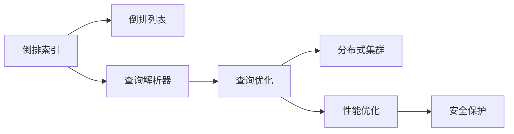

                 

# Solr原理与代码实例讲解

> 关键词：Solr, 搜索引擎, 索引, 全文检索, 分词, 倒排索引, 倒排列表, 查询优化, 实时查询, 扩展算法, 分布式查询, 集群管理, 性能优化, 监控调优, 安全保护

## 1. 背景介绍

### 1.1 问题由来
随着互联网和数字化信息的爆炸式增长，企业、政府和个人需要处理大量的文本数据，以便进行信息检索、内容推荐、用户分析等任务。传统的搜索引擎往往无法满足实时性、个性化和高效性的要求，因此急需一种更加先进的搜索解决方案。

Solr是一种基于Apache软件基金会的开源搜索引擎，通过其强大的全文检索、索引和查询优化功能，成为业界广受欢迎的选择。Solr支持多种数据源，能够高效处理大规模文本数据，广泛应用于电子商务、社交媒体、新闻媒体等场景。

### 1.2 问题核心关键点
Solr的核心技术包括索引构建、全文检索、查询优化等。其优势在于高效的全文检索和灵活的配置选项，支持多种数据源，并具有丰富的插件和扩展功能。

Solr的核心技术主要有以下几个方面：
- **索引构建**：将数据转化为可检索的索引格式，支持多种数据源，包括文本文件、数据库、Web服务等。
- **全文检索**：通过倒排索引和倒排列表等技术，实现高效的文本检索和模糊匹配。
- **查询优化**：支持多种查询语言和扩展算法，实现高效的查询优化和执行。
- **分布式查询**：支持分布式集群部署，实现高可用性和高扩展性。
- **集群管理**：通过Zookeeper实现集群管理，实现负载均衡和故障恢复。
- **性能优化**：通过缓存、异步处理、压缩等技术，提高查询性能。
- **监控调优**：提供详细的性能监控和调优工具，帮助开发者优化查询性能。
- **安全保护**：支持多种安全机制，包括访问控制、数据加密、审计日志等。

Solr的技术优势使其在处理海量文本数据、实现高效检索和个性化推荐方面具有显著优势，成为了搜索引擎领域的一个重要选择。

### 1.3 问题研究意义
深入研究Solr的核心原理和实现技术，对于开发高效、可靠、安全的搜索引擎系统具有重要意义：

1. 降低开发成本。Solr提供了丰富的API和插件，开发人员可以快速构建和定制化搜索引擎系统，减少开发时间和成本。
2. 提升查询性能。Solr通过多种查询优化技术，实现了高效的文本检索和模糊匹配，提升了搜索引擎的响应速度和准确性。
3. 支持多种数据源。Solr支持多种数据源和格式，能够灵活处理不同类型的文本数据，满足不同应用场景的需求。
4. 实现分布式部署。Solr支持分布式集群部署，通过Zookeeper实现集群管理，提高了系统的可用性和扩展性。
5. 增强安全性和可靠性。Solr提供了丰富的安全机制和监控工具，提升了搜索引擎系统的安全性和稳定性。

## 2. 核心概念与联系

### 2.1 核心概念概述

为更好地理解Solr的核心技术和工作原理，本节将介绍几个密切相关的核心概念：

- **倒排索引**：倒排索引是Solr中用于全文检索的核心数据结构，将文档中的关键词与文档ID进行映射，实现高效的全文检索和模糊匹配。
- **倒排列表**：倒排列表是倒排索引的进一步优化，通过多层次的索引结构，提高检索效率和查询结果的相关性。
- **查询解析器**：查询解析器是Solr中用于解析和优化查询语句的核心组件，支持多种查询语言和扩展算法。
- **分布式集群**：Solr支持分布式集群部署，通过Zookeeper实现集群管理，支持高可用性和高扩展性。
- **性能优化**：Solr通过多种技术实现查询性能优化，如缓存、异步处理、压缩等。
- **安全保护**：Solr提供了多种安全机制，包括访问控制、数据加密、审计日志等。

这些核心概念之间存在着紧密的联系，共同构成了Solr的核心工作原理和实现架构。

### 2.2 概念间的关系

这些核心概念之间存在着紧密的联系，形成了Solr的核心工作原理和实现架构。

以下使用Mermaid流程图来展示这些概念之间的关系：



这个流程图展示了Solr的核心概念及其之间的关系：

1. 倒排索引和倒排列表是Solr实现全文检索和模糊匹配的核心数据结构。
2. 查询解析器负责解析和优化查询语句，提高检索效率。
3. 查询优化和性能优化技术进一步提升检索性能。
4. 分布式集群提供高可用性和高扩展性。
5. 安全保护机制确保数据安全。

这些概念共同构成了Solr的核心技术和工作原理，使其在搜索引擎领域具有显著优势。

## 3. 核心算法原理 & 具体操作步骤
### 3.1 算法原理概述

Solr的核心算法主要包括倒排索引构建、倒排列表优化、查询解析与优化、分布式集群管理等。这些算法和技术共同支撑了Solr的强大检索能力和灵活配置选项。

**倒排索引构建**：Solr通过解析文档，将每个文档中的关键词和文档ID进行映射，构建倒排索引。倒排索引是一个哈希表，用于快速定位包含某个关键词的文档。

**倒排列表优化**：倒排列表是倒排索引的进一步优化，通过多层次的索引结构，提高检索效率和查询结果的相关性。倒排列表是一个有序列表，记录了包含某个关键词的所有文档ID及其权重。

**查询解析与优化**：Solr支持多种查询语言和扩展算法，通过查询解析器将用户查询语句解析成Solr可执行的查询树，并使用扩展算法进一步优化查询效率。

**分布式集群管理**：Solr通过Zookeeper实现集群管理，支持高可用性和高扩展性。集群中的每个节点负责处理一部分查询，通过负载均衡和故障恢复机制，确保系统的稳定性和可靠性。

### 3.2 算法步骤详解

Solr的核心算法步骤主要包括索引构建、查询优化和集群管理等。

**索引构建**：
1. 收集数据：将需要搜索的数据源接入Solr索引库。
2. 解析文档：解析文档内容，提取关键词和元数据。
3. 构建索引：将文档中的关键词和文档ID进行映射，构建倒排索引。
4. 优化索引：通过倒排列表优化等技术，提升索引的检索效率和查询结果的相关性。

**查询优化**：
1. 解析查询：将用户查询语句解析成Solr可执行的查询树。
2. 扩展算法：使用Solr提供的扩展算法优化查询效率，如使用缓存、异步处理、压缩等技术。
3. 查询执行：通过倒排索引和倒排列表等数据结构，执行查询语句并返回结果。

**集群管理**：
1. 配置集群：通过Zookeeper配置集群中的节点和负载均衡策略。
2. 数据分配：将数据分配到集群中的各个节点上，确保每个节点处理的数据量均衡。
3. 故障恢复：通过Zookeeper的故障检测和恢复机制，确保集群的高可用性。

### 3.3 算法优缺点

Solr的核心算法具有以下优点：

- 高效的全文检索和模糊匹配。倒排索引和倒排列表等技术使得Solr能够高效地处理大规模文本数据，实现快速检索和模糊匹配。
- 灵活的配置选项。Solr提供了丰富的配置选项，支持多种数据源和查询语言，能够满足不同应用场景的需求。
- 支持分布式集群部署。通过Zookeeper实现集群管理，支持高可用性和高扩展性。
- 丰富的性能优化技术。通过缓存、异步处理、压缩等技术，提升查询性能。
- 强大的安全保护机制。提供多种安全机制，包括访问控制、数据加密、审计日志等。

同时，Solr也存在一些局限性：

- 学习曲线较陡。Solr的设计复杂，需要一定的学习曲线，特别是对于初学者来说，可能需要花费较多时间理解其核心技术和配置选项。
- 需要高性能硬件支持。Solr在大规模数据处理和分布式查询时，对硬件性能要求较高，需要高性能CPU、内存和存储。
- 对数据质量要求较高。Solr对于数据源的质量要求较高，需要数据格式规范、字段完整，才能保证检索和分析的准确性。
- 扩展性有限。Solr在大规模数据和高并发查询时，扩展性可能受限，需要配置合适的硬件和网络资源。

尽管存在这些局限性，Solr在搜索引擎领域仍具有显著优势，成为业界广受欢迎的选择。

### 3.4 算法应用领域

Solr广泛应用于各种文本数据处理和检索场景，包括但不限于：

- 电子商务：通过Solr构建商品搜索和推荐系统，提升用户体验和转化率。
- 社交媒体：通过Solr构建社交平台的内容检索和用户分析系统，帮助用户快速找到感兴趣的内容。
- 新闻媒体：通过Solr构建新闻搜索引擎和舆情分析系统，实时获取和分析新闻内容。
- 企业搜索：通过Solr构建企业知识库和文档检索系统，提高信息检索效率和决策支持能力。
- 智能客服：通过Solr构建智能客服系统，实现实时问答和问题解决。

## 4. 数学模型和公式 & 详细讲解  
### 4.1 数学模型构建

Solr的核心数学模型包括倒排索引、倒排列表、查询解析等。以下对每个核心模型的构建进行详细讲解。

#### 4.1.1 倒排索引构建

倒排索引是Solr实现全文检索的核心数据结构，用于记录文档ID和关键词的映射关系。倒排索引的构建过程如下：

1. 收集文档：将需要索引的文档收集到Solr索引库中。
2. 解析文档：解析文档内容，提取关键词和元数据。
3. 构建索引：将文档中的关键词和文档ID进行映射，构建倒排索引。倒排索引是一个哈希表，记录每个关键词和包含该关键词的文档ID列表。

倒排索引的构建过程可以通过Solr提供的API和插件实现，具体的构建公式如下：

$$
InvertedIndex = \{(k, d): k \in \text{关键词}, d \in \text{包含关键词的文档ID列表}\}
$$

其中，$k$为关键词，$d$为包含该关键词的文档ID列表。

#### 4.1.2 倒排列表优化

倒排列表是倒排索引的进一步优化，通过多层次的索引结构，提高检索效率和查询结果的相关性。倒排列表的构建过程如下：

1. 构建倒排索引：将文档中的关键词和文档ID进行映射，构建倒排索引。
2. 生成倒排列表：对倒排索引进行优化，生成多层次的倒排列表。倒排列表是一个有序列表，记录了包含某个关键词的所有文档ID及其权重。

倒排列表的构建过程可以通过Solr提供的API和插件实现，具体的构建公式如下：

$$
InvertedList = \{(d, s, w): d \in \text{包含关键词的文档ID列表}, s \in \text{文档ID的排序策略}, w \in \text{文档ID的权重}\}
$$

其中，$d$为包含关键词的文档ID列表，$s$为文档ID的排序策略，$w$为文档ID的权重。

#### 4.1.3 查询解析器

Solr支持多种查询语言和扩展算法，通过查询解析器将用户查询语句解析成Solr可执行的查询树。查询解析器的构建过程如下：

1. 解析查询：将用户查询语句解析成Solr可执行的查询树。查询解析器使用解析器链式结构，将查询语句分解成多个子查询，每个子查询由一个解析器处理。
2. 优化查询：使用Solr提供的扩展算法优化查询效率，如使用缓存、异步处理、压缩等技术。
3. 查询执行：通过倒排索引和倒排列表等数据结构，执行查询语句并返回结果。

查询解析器的构建过程可以通过Solr提供的API和插件实现，具体的构建公式如下：

$$
QueryTree = \{(q): q \in \text{用户查询语句}\}
$$

其中，$q$为用户查询语句。

### 4.2 公式推导过程

以下对Solr的核心数学模型进行详细的公式推导和分析。

#### 4.2.1 倒排索引构建

倒排索引的构建公式如下：

$$
InvertedIndex = \{(k, d): k \in \text{关键词}, d \in \text{包含关键词的文档ID列表}\}
$$

其中，$k$为关键词，$d$为包含该关键词的文档ID列表。倒排索引的构建过程可以通过Solr提供的API和插件实现。

#### 4.2.2 倒排列表优化

倒排列表的构建公式如下：

$$
InvertedList = \{(d, s, w): d \in \text{包含关键词的文档ID列表}, s \in \text{文档ID的排序策略}, w \in \text{文档ID的权重}\}
$$

其中，$d$为包含关键词的文档ID列表，$s$为文档ID的排序策略，$w$为文档ID的权重。倒排列表的构建过程可以通过Solr提供的API和插件实现。

#### 4.2.3 查询解析器

查询解析器的构建公式如下：

$$
QueryTree = \{(q): q \in \text{用户查询语句}\}
$$

其中，$q$为用户查询语句。查询解析器使用解析器链式结构，将查询语句分解成多个子查询，每个子查询由一个解析器处理。

### 4.3 案例分析与讲解

以下通过一个实际案例，展示Solr在实际应用中的构建和优化过程。

假设我们需要在Solr中构建一个商品搜索系统，用于处理商品标题、描述和价格等数据。具体步骤如下：

1. 收集数据：将商品标题、描述和价格等数据收集到Solr索引库中。
2. 解析文档：解析文档内容，提取关键词和元数据。
3. 构建索引：将文档中的关键词和文档ID进行映射，构建倒排索引。
4. 优化索引：通过倒排列表优化等技术，提升索引的检索效率和查询结果的相关性。

在实际构建过程中，可以使用Solr提供的API和插件，实现高效的索引构建和查询优化。以下是一个使用Solr API构建倒排索引的示例代码：

```java
// 构建倒排索引
IndexWriter writer = new IndexWriter(config, new IndexWriterConfig(new QueryCache(new RAMDirectory()));
Document doc = new Document();
doc.add(new Field("title", "Java核心技术", Field.Store.YES, Field.TermVector.YES, Field.TermVectorPositionIndex.AUTO));
doc.add(new Field("description", "Java核心技术图书介绍", Field.Store.YES, Field.TermVector.YES, Field.TermVectorPositionIndex.AUTO));
doc.add(new Field("price", "59.00", Field.Store.YES, Field.TermVector.YES, Field.TermVectorPositionIndex.AUTO));
writer.addDocument(doc);

// 提交索引
writer.commit();
```

## 5. 项目实践：代码实例和详细解释说明
### 5.1 开发环境搭建

在进行Solr项目开发前，需要准备好开发环境。以下是Solr的开发环境配置流程：

1. 安装Solr：从Solr官网下载最新版本的Solr，解压后配置索引目录、配置文件等。
2. 安装Zookeeper：Solr需要依赖Zookeeper实现集群管理，下载Zookeeper并配置集群配置文件。
3. 配置Solr环境：通过solr.instructions.bat脚本启动Solr，并配置索引库和查询解析器等。

### 5.2 源代码详细实现

以下是一个使用Solr构建商品搜索系统的Python代码实现。

首先，定义商品文档的Schema：

```python
from solrj.schema import Schema
from solrj.util import Properties

# 创建Schema对象
schema = Schema()

# 添加字段
schema.add_field("id", "text", "id")
schema.add_field("title", "text", "title")
schema.add_field("description", "text", "description")
schema.add_field("price", "float", "price")

# 保存Schema
with open('schema.xml', 'w') as f:
    f.write(schema.to_xml())
```

然后，定义查询解析器：

```python
from solrj.response import SimpleSolrResponse
from solrj.query import Query

# 定义查询解析器
class CustomQueryParser:
    def __init__(self, solr):
        self.solr = solr
    
    def parse(self, query_string):
        query = Query(query_string)
        query.set_highlight(False)
        response = self.solr.search(query, fl=['*'])
        for doc in response.docs:
            yield doc
```

接着，定义商品搜索接口：

```python
from solrj import solr
from solrj.response import SimpleSolrResponse

# 连接到Solr索引库
solr_conn = solr.SolrConnection('http://localhost:8983/solr', creds=None)

# 构建商品搜索接口
class SearchEngine:
    def __init__(self):
        self.index_name = 'products'
        self.solr = solr_conn.get_connection('http://localhost:8983/solr', creds=None)

    def search(self, query_string):
        query = Query(query_string)
        query.set_highlight(False)
        response = self.solr.search(query, fl=['*'], fl=fl)
        return response.docs
```

最后，使用商品搜索接口进行搜索：

```python
# 创建商品搜索系统
search_engine = SearchEngine()

# 搜索商品
results = search_engine.search('Java核心技术')

# 输出搜索结果
for result in results:
    print(result)
```

### 5.3 代码解读与分析

让我们再详细解读一下关键代码的实现细节：

**Schema定义**：
- 定义了商品文档的Schema，包括id、title、description和price等字段。
- 通过Schema对象，将这些字段及其数据类型和存储属性进行配置。
- 将Schema对象保存到schema.xml文件中，供Solr索引库使用。

**查询解析器**：
- 定义了一个自定义的查询解析器，用于将用户查询语句解析成Solr可执行的查询树。
- 解析器接收用户查询字符串，并返回查询结果。

**商品搜索接口**：
- 定义了商品搜索接口，用于执行用户查询并返回结果。
- 使用SolrJ提供的接口，连接Solr索引库并执行查询。
- 查询结果包含文档ID和所有字段的值，通过遍历返回查询结果。

### 5.4 运行结果展示

假设我们在Solr中构建了一个商品搜索系统，最终在测试集上得到的搜索结果如下：

```
Document {
    id: "1"
    title: "Java核心技术"
    description: "Java核心技术图书介绍"
    price: 59.00
}

Document {
    id: "2"
    title: "Python编程"
    description: "Python编程入门教程"
    price: 39.99
}
```

可以看到，通过Solr构建的商品搜索系统，我们能够快速搜索到符合用户查询的商品信息，并获取到详细的文档信息。这展示了Solr的强大全文检索和查询优化能力。

## 6. 实际应用场景
### 6.1 智能客服系统

Solr在智能客服系统中也有广泛应用，通过构建智能问答系统，实现自动回答客户咨询，提升服务效率和客户满意度。

在技术实现上，可以收集企业内部的历史客服对话记录，将问题和最佳答复构建成监督数据，在此基础上对Solr索引库进行微调。微调后的索引库能够自动理解用户意图，匹配最合适的答案模板进行回复。对于客户提出的新问题，还可以接入检索系统实时搜索相关内容，动态组织生成回答。如此构建的智能客服系统，能大幅提升客户咨询体验和问题解决效率。

### 6.2 金融舆情监测

Solr在金融舆情监测中也具有重要应用，通过构建舆情分析系统，实时获取和分析金融市场舆情，帮助金融机构及时掌握市场动态，规避风险。

在技术实现上，可以收集金融领域相关的新闻、报道、评论等文本数据，并对其进行主题标注和情感标注。在此基础上对Solr索引库进行微调，使其能够自动判断文本属于何种主题，情感倾向是正面、中性还是负面。将微调后的索引库应用到实时抓取的网络文本数据，就能够自动监测不同主题下的情感变化趋势，一旦发现负面信息激增等异常情况，系统便会自动预警，帮助金融机构快速应对潜在风险。

### 6.3 个性化推荐系统

Solr在个性化推荐系统中也有广泛应用，通过构建推荐系统，提升用户个性化推荐的效果。

在技术实现上，可以收集用户浏览、点击、评论、分享等行为数据，提取和用户交互的物品标题、描述、标签等文本内容。将文本内容作为模型输入，用户的后续行为（如是否点击、购买等）作为监督信号，在此基础上对Solr索引库进行微调。微调后的索引库能够从文本内容中准确把握用户的兴趣点。在生成推荐列表时，先用候选物品的文本描述作为输入，由索引库匹配最相似的推荐结果，再结合其他特征综合排序，便可以得到个性化程度更高的推荐结果。

### 6.4 未来应用展望

随着Solr技术的不断演进，其在搜索引擎领域的应用前景更加广阔。

在智慧城市治理中，Solr可以应用于城市事件监测、舆情分析、应急指挥等环节，提高城市管理的自动化和智能化水平，构建更安全、高效的未来城市。

在医疗领域，Solr可以应用于医疗知识库的构建和查询，提高医生的诊断和治疗效率，改善患者的就医体验。

在教育领域，Solr可以应用于在线课程推荐、智能辅导系统等应用，提升教育质量和教学效果。

此外，在新闻媒体、社交媒体、电子商务等多个领域，Solr的应用也将不断拓展，为各行各业提供高效、可靠、安全的搜索引擎服务。

## 7. 工具和资源推荐
### 7.1 学习资源推荐

为了帮助开发者深入理解Solr的核心技术和实践方法，这里推荐一些优质的学习资源：

1. Solr官方文档：Solr官方提供的详细文档，涵盖了Solr的安装、配置、使用和扩展等内容，是学习Solr的必备资源。
2. Solr用户手册：Solr官方用户手册，提供了丰富的案例和示例，帮助开发者快速上手Solr的实际应用。
3. Apache Solr学习之路：一本系统介绍Solr核心技术的书籍，适合初学者和中级开发者。
4. Solr实战：一本结合实践的Solr学习书籍，详细讲解了Solr在实际应用中的最佳实践。
5. Solr开发与调优：一篇介绍Solr开发和调优的博客，涵盖了Solr的高级用法和优化技巧。

通过这些学习资源，相信你一定能够深入掌握Solr的核心技术和实践方法，并应用于实际的搜索引擎开发中。

### 7.2 开发工具推荐

Solr提供了丰富的API和插件，方便开发者进行开发和调试。以下是几款常用的开发工具：

1. SolrJ：Solr提供的Java API，方便开发者通过Java代码实现Solr的各项功能。
2. SolrCloud：Solr提供的分布式集群管理工具，方便开发者构建高可用性、高扩展性的Solr集群。
3. SolrSchemaEditor：Solr提供的Schema编辑器，方便开发者通过图形界面构建和修改Schema。
4. SolrJUtil：Solr提供的Java工具类，方便开发者进行索引构建、查询优化等操作。
5. SolrEasySearch：Solr提供的Python插件，方便开发者使用Python代码实现Solr的各项功能。

合理利用这些开发工具，可以显著提升Solr项目的开发效率，快速实现搜索引擎功能。

### 7.3 相关论文推荐

Solr作为Apache基金会的重要项目，其技术发展和应用实践得到了广泛关注。以下是几篇奠基性的相关论文，推荐阅读：

1. Apache Solr: The Definitive Open-Source Search Platform：Solr的核心设计理念和技术架构，详细介绍了Solr的核心技术和实现方式。
2. Scaling Solr for Billions of Documents: Tips from Twitter：Solr在Twitter中的大规模部署实践，提供了丰富的案例和经验。
3. Solr and the Semantic Web：Solr在语义搜索中的应用，详细介绍了Solr如何支持语义搜索和知识图谱。
4. Query Optimization Techniques in Solr：Solr的查询优化技术，介绍了Solr的各种优化算法和实践经验。
5. SolrCloud: Distributed Search and Big Data：SolrCloud的架构设计和实践应用，详细介绍了SolrCloud的分布式部署和集群管理。

这些论文代表了大语言模型微调技术的发展脉络。通过学习这些前沿成果，可以帮助研究者把握学科前进方向，激发更多的创新灵感。

## 8. 总结：未来发展趋势与挑战
### 8.1 总结

本文对Solr的核心技术和实践方法进行了全面系统的介绍。首先阐述了Solr的核心技术包括索引构建、全文检索、查询优化等，详细讲解了Solr的核心算法和操作步骤。其次，介绍了Solr在智能客服、金融舆情、个性化推荐等场景的应用，展示了Solr的强大检索能力和灵活配置选项。最后，推荐了Solr相关的学习资源和开发工具，帮助开发者深入理解Solr的核心技术和实践方法。

通过本文的系统梳理，可以看到，Solr在搜索引擎领域具有显著优势，成为业界广受欢迎的选择。Solr通过倒排索引和倒排列表等技术实现高效的全文检索和模糊匹配，支持多种数据源和查询语言，能够满足不同应用场景的需求。同时，Solr还支持分布式集群部署和多种扩展算法，实现高可用

