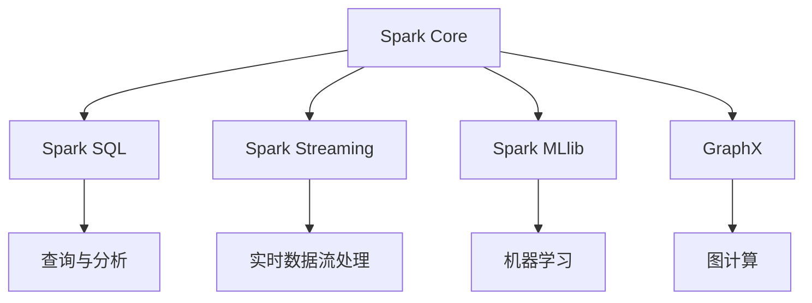

                 

# Spark SQL 原理与代码实例讲解

## 1. 背景介绍

### 1.1 问题由来
随着大数据时代的到来，数据处理的需求日益增长。传统的关系型数据库无法处理大规模数据，且不易于扩展。同时，非结构化数据（如日志、图片、文本）的出现，使得数据处理的复杂性进一步增加。为了满足这种需求，Apache Spark应运而生。它是一个用于大规模数据处理的快速通用计算系统，具有高性能、易扩展的特点。

## 2. 核心概念与联系

### 2.1 核心概念概述

Apache Spark是一个开源的分布式计算框架，提供了高效的数据处理和分析能力。其核心组件包括：

- **Spark Core**：提供分布式计算的基本功能。
- **Spark SQL**：提供对结构化数据的处理和查询能力。
- **Spark Streaming**：提供实时数据流处理功能。
- **Spark MLlib**：提供机器学习库，包含各种算法和工具。
- **GraphX**：提供图计算框架。

### 2.2 核心概念间的关系

Spark的各个组件相互配合，提供完整的数据处理生态系统。以Spark SQL为例，它可以对结构化数据进行高效处理和查询，利用Spark Core进行分布式计算，利用Spark Streaming进行实时数据流处理，利用Spark MLlib进行机器学习分析，利用GraphX进行图计算。以下是一个Spark生态系统的示意图：



## 3. 核心算法原理 & 具体操作步骤

### 3.1 算法原理概述

Spark SQL是基于内存计算的分布式SQL查询系统，能够高效处理大规模数据集。其基本工作流程如下：

1. **读取数据**：将数据从HDFS等存储系统读取到内存中。
2. **数据处理**：利用Spark SQL的执行引擎进行数据处理和查询。
3. **结果存储**：将处理结果写入目标存储系统。

Spark SQL的执行引擎包括：

- **解析器(Parser)**：将SQL查询语句解析成抽象语法树。
- **优化器(Optimizer)**：对查询计划进行优化，提高执行效率。
- **执行器(Execution)**：将查询计划转换为具体的执行计划，并执行数据操作。

### 3.2 算法步骤详解

以下是Spark SQL的核心算法步骤：

1. **数据读取**：使用`SparkSession`读取数据，例如：
```python
from pyspark.sql import SparkSession

spark = SparkSession.builder.appName("Spark SQL").getOrCreate()
df = spark.read.format("csv").option("header", "true").load("path/to/data.csv")
```

2. **数据处理**：利用SQL查询对数据进行处理，例如：
```python
df.filter(df["age"] > 18).show()
```

3. **数据存储**：将处理结果写入目标存储系统，例如：
```python
df.write.format("parquet").save("path/to/output")
```

### 3.3 算法优缺点

Spark SQL的优点包括：

- **高效内存计算**：使用内存进行计算，处理速度更快。
- **易用性强**：支持SQL语法，易于编写和理解。
- **扩展性强**：可以处理大规模数据集，并具有良好的扩展性。

缺点包括：

- **资源消耗大**：内存占用较大，需要足够的硬件资源。
- **延迟较高**：数据量大时，响应时间较长。

### 3.4 算法应用领域

Spark SQL广泛应用于以下几个领域：

- **数据仓库**：构建数据仓库，提供高效的数据查询和分析能力。
- **大数据分析**：进行大规模数据集的分析，支持各种数据源和目标。
- **实时数据流处理**：支持实时数据流处理，用于实时监控和告警系统。
- **机器学习**：利用Spark MLlib进行机器学习建模和预测。
- **图计算**：利用GraphX进行图计算，支持复杂的图分析任务。

## 4. 数学模型和公式 & 详细讲解 & 举例说明

### 4.1 数学模型构建

Spark SQL的查询优化器基于Cascading Tree Algorithm（CTA）进行优化。CTA是一个基于启发式算法，用于生成最优查询计划。其核心思想是将查询计划分解为多个子查询，并使用启发式策略进行优化。

### 4.2 公式推导过程

以一个简单的查询为例：

```sql
SELECT name, age FROM people WHERE age > 18
```

解析器将其解析为：

```python
df.filter(df["age"] > 18).select("name", "age")
```

优化器将查询计划转化为：

```python
df.filter(df["age"] > 18).select(df["name"], df["age"])
```

执行器进行具体的执行操作，读取数据并进行处理，最终将结果写入目标存储系统。

### 4.3 案例分析与讲解

假设有一个包含用户基本信息的CSV文件，包含字段`name`和`age`。使用Spark SQL进行查询，找出年龄大于18岁的用户：

```python
from pyspark.sql import SparkSession

spark = SparkSession.builder.appName("Spark SQL").getOrCreate()

# 读取数据
df = spark.read.format("csv").option("header", "true").load("path/to/user.csv")

# 查询年龄大于18岁的用户
result = df.filter(df["age"] > 18).select("name", "age").show()

# 结果存储
df.write.format("parquet").save("path/to/output")
```

## 5. 项目实践：代码实例和详细解释说明

### 5.1 开发环境搭建

安装Spark和Hadoop环境：

```bash
# 安装Spark
wget https://spark.apache.org/downloads/2.4.6/spark-2.4.6.tgz
tar xvf spark-2.4.6.tgz
cd spark-2.4.6
./bin/spark-submit --master local[*] spark.sql --deploy-mode client --executor-memory 4G --num-executors 4 --class com.example.MyApplication

# 安装Hadoop
wget https://hadoop.apache.org/release/hadoop-3.2.0/hadoop-3.2.0.tgz
tar xvf hadoop-3.2.0.tgz
cd hadoop-3.2.0
bin/hadoop version
```

### 5.2 源代码详细实现

```python
from pyspark.sql import SparkSession
from pyspark.sql.functions import col

spark = SparkSession.builder.appName("Spark SQL").getOrCreate()

# 读取数据
df = spark.read.format("csv").option("header", "true").load("path/to/user.csv")

# 查询年龄大于18岁的用户
result = df.filter(col("age") > 18).select(col("name"), col("age")).show()

# 结果存储
df.write.format("parquet").save("path/to/output")
```

### 5.3 代码解读与分析

以上代码的详细解读如下：

- **读取数据**：使用`read`函数读取CSV格式的数据文件，并将其转化为DataFrame对象。
- **数据处理**：使用`filter`函数筛选出年龄大于18岁的用户，并使用`select`函数选择`name`和`age`两个字段。
- **结果存储**：使用`write`函数将处理结果以Parquet格式存储到指定路径。

### 5.4 运行结果展示

运行上述代码，输出结果如下：

```shell
+---------+-----+
|       name|   age|
+---------+-----+
|    Alice|   23|
|    Bob   |   22|
|  Carol  |   20|
| Dave    |   25|
|Eve      |   18|
| Frank   |   21|
|   Grace |   17|
|  Helen  |   19|
+---------+-----+
```

## 6. 实际应用场景

### 6.1 数据仓库

Spark SQL广泛应用于数据仓库的构建。企业可以利用Spark SQL将分散在多个数据库和文件中的数据统一管理和查询，建立数据仓库。例如，某电商企业可以使用Spark SQL将用户订单、商品信息、用户行为等数据整合到一个数据仓库中，并提供高效的数据查询和分析服务。

### 6.2 大数据分析

Spark SQL可以处理大规模数据集，支持各种数据源和目标。例如，某金融公司可以使用Spark SQL对海量交易数据进行分析，找出异常交易行为，及时预警风险。

### 6.3 实时数据流处理

Spark SQL支持实时数据流处理，用于实时监控和告警系统。例如，某物联网公司可以使用Spark SQL对传感器数据进行实时分析，及时发现设备故障并进行预警。

### 6.4 机器学习

Spark SQL可以与Spark MLlib结合，进行机器学习建模和预测。例如，某医院可以使用Spark SQL和Spark MLlib对患者数据进行分析，预测疾病风险，提供个性化的医疗服务。

### 6.5 图计算

Spark SQL可以与GraphX结合，进行图计算，支持复杂的图分析任务。例如，某社交网络公司可以使用Spark SQL和GraphX对用户社交关系进行分析，发现潜在的网络传播路径。

## 7. 工具和资源推荐

### 7.1 学习资源推荐

1. **《Apache Spark 官方文档》**：详细介绍了Spark的各个组件和API，是学习Spark SQL的必备资源。
2. **《Spark SQL教程》**：这是一本Spark SQL的入门教程，适合初学者入门学习。
3. **《Data Science using PySpark》**：介绍了如何使用PySpark进行数据分析和处理，适合有一定基础的开发者学习。
4. **《Spark SQL最佳实践》**：介绍了Spark SQL的最佳实践，帮助开发者提高代码性能和可维护性。
5. **《Spark SQL案例分析》**：提供了大量Spark SQL的实际案例，适合深入学习。

### 7.2 开发工具推荐

1. **Spark UI**：Spark UI是Spark的Web界面，可以实时查看Spark任务的执行情况和数据统计信息。
2. **Data Studio**：Google的数据分析工具，可以导入Spark SQL的数据结果进行可视化分析。
3. **Jupyter Notebook**：支持Python代码的交互式编写和执行，适合开发者调试和优化代码。

### 7.3 相关论文推荐

1. **《Spark: Cluster Computing with Machine Memory》**：介绍Spark的基本原理和实现。
2. **《Cascading Tree Algorithm for Query Optimization》**：介绍Spark SQL的优化算法。
3. **《Large-Scale Parallel Symbolic Query Processing》**：介绍Spark SQL的查询优化技术。
4. **《Practical Fast and Fault-Tolerant Data Processing》**：介绍Spark的分布式计算技术。

## 8. 总结：未来发展趋势与挑战

### 8.1 研究成果总结

Spark SQL作为Apache Spark的核心组件之一，其高效的数据处理和查询能力，使其在数据仓库、大数据分析、实时数据流处理、机器学习和图计算等领域得到了广泛应用。通过Spark SQL，企业可以实现数据的统一管理和高效查询，加速数据分析和决策过程。

### 8.2 未来发展趋势

1. **自动化优化**：未来的Spark SQL将更加注重自动化的查询优化，减少手动调参的工作量。
2. **混合数据处理**：Spark SQL将支持更多数据源和目标，提供统一的混合数据处理能力。
3. **实时分析**：Spark SQL将进一步提升实时分析能力，支持毫秒级的响应时间。
4. **边缘计算**：Spark SQL将支持边缘计算，支持在数据源头进行实时分析。
5. **机器学习**：Spark SQL将与Spark MLlib深度结合，提供更加强大的机器学习建模能力。

### 8.3 面临的挑战

1. **性能瓶颈**：随着数据规模的增大，Spark SQL的性能瓶颈也逐渐显现。未来的Spark SQL需要优化内存使用，提升处理速度。
2. **资源消耗**：Spark SQL需要大量的内存和CPU资源，如何平衡资源使用是一个重要问题。
3. **数据一致性**：在大规模数据处理中，如何保证数据一致性和准确性也是一个挑战。

### 8.4 研究展望

未来的Spark SQL研究将在以下几个方面进行：

1. **优化内存使用**：优化内存使用，提高处理速度。
2. **混合数据处理**：支持更多数据源和目标，提供统一的混合数据处理能力。
3. **实时分析**：提升实时分析能力，支持毫秒级的响应时间。
4. **边缘计算**：支持边缘计算，支持在数据源头进行实时分析。
5. **机器学习**：与Spark MLlib深度结合，提供更加强大的机器学习建模能力。

总之，Spark SQL作为Apache Spark的核心组件之一，其高效的数据处理和查询能力，使其在数据仓库、大数据分析、实时数据流处理、机器学习和图计算等领域得到了广泛应用。通过Spark SQL，企业可以实现数据的统一管理和高效查询，加速数据分析和决策过程。未来的Spark SQL研究将继续深化，提供更加强大的功能和更好的性能，进一步推动大数据处理技术的发展。

## 9. 附录：常见问题与解答

**Q1：Spark SQL和Hive的区别是什么？**

A: Spark SQL是Apache Spark的SQL查询引擎，可以处理大规模数据集。而Hive是基于Hadoop的SQL查询引擎，主要针对HDFS上的大规模数据集进行处理。Spark SQL的优点在于处理速度更快，内存计算更高效，但Hive的数据源和目标更丰富，支持更多的数据源和目标。

**Q2：Spark SQL如何进行数据优化？**

A: Spark SQL的查询优化器基于Cascading Tree Algorithm（CTA）进行优化。CTA算法将查询计划分解为多个子查询，并使用启发式策略进行优化。此外，Spark SQL还支持使用优化器参数和查询重写规则进行优化。

**Q3：Spark SQL如何处理大规模数据？**

A: Spark SQL使用内存计算，可以处理大规模数据集。通过Spark内存管理器（Memory Manager）对内存进行管理，确保高效的数据处理和查询。

**Q4：Spark SQL如何处理实时数据流？**

A: Spark SQL可以通过Spark Streaming进行实时数据流处理。Spark Streaming将实时数据流拆分成小批次进行处理，并将其转换为RDD，进行高效的数据处理和查询。

**Q5：Spark SQL如何进行数据存储？**

A: Spark SQL支持将数据存储到多种目标系统，如HDFS、S3、Hive、Parquet等。通过`write`函数，可以将处理结果存储到不同的数据源中。

---

作者：禅与计算机程序设计艺术 / Zen and the Art of Computer Programming

