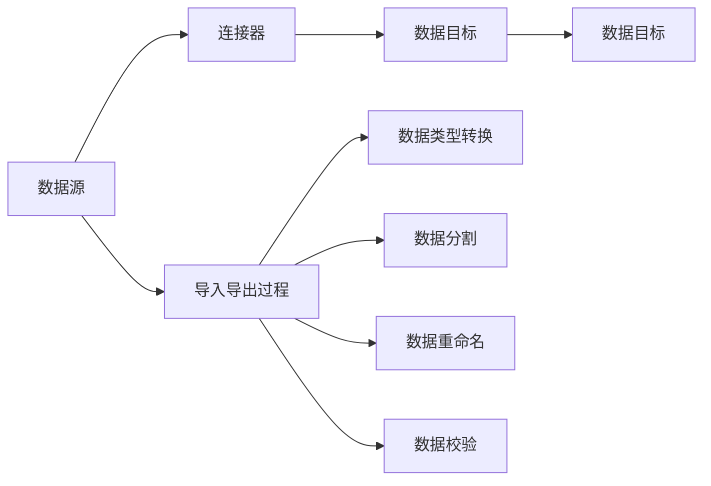
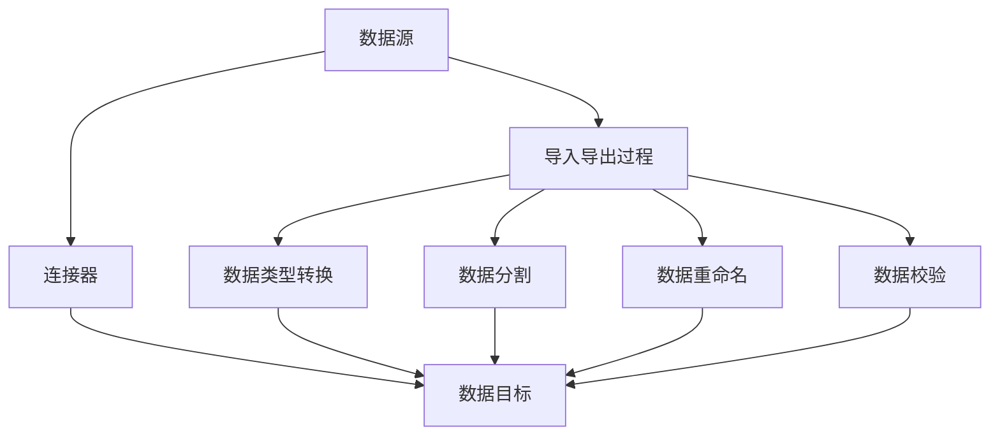

                 

## 1. 背景介绍

随着大数据时代的到来，数据存储和处理的规模越来越大，Hadoop生态系统成为了处理大规模数据的主要工具。然而，将数据从关系型数据库(如MySQL, PostgreSQL等)导入Hadoop HDFS，或从Hadoop HDFS导出到关系型数据库，一直是数据工程师面临的挑战。Sqoop作为Apache基金会支持的Hadoop数据传输工具，能够实现这两种数据的转换，使得数据工程师能够快速高效地完成数据的迁移工作。

### 1.1 问题由来

在传统的数据处理流程中，数据往往存储在关系型数据库中，如MySQL, PostgreSQL等。然而，随着数据量的不断增长，传统数据库的扩展性、性能和可靠性已经无法满足需求，大数据生态系统逐渐成为主流的数据存储和处理平台。但关系型数据库中的结构化数据和Hadoop HDFS中的非结构化数据之间存在巨大差异，直接转换难度较大。此时，Sqoop就成为了一种非常有效的数据迁移工具，能够将关系型数据库中的数据导入到Hadoop HDFS中，或将Hadoop HDFS中的数据导出到关系型数据库中。

### 1.2 问题核心关键点

Sqoop的核心在于通过一个连接器库，能够适配多种数据源和目标，实现数据的批量导入导出。其主要特点包括：

- 支持多种数据源和目标：如MySQL, PostgreSQL, Oracle, Hive等。
- 支持多种数据类型：如表、分区、日志等。
- 批量处理：通过MapReduce实现数据的批量导入导出。
- 数据转换：支持数据的类型转换、分割、重命名等。
- 高可靠性：数据转换过程具有高可靠性，支持断点续传、数据校验等功能。

这些特点使得Sqoop成为数据工程师不可或缺的工具，使得数据迁移和转换变得更加高效和便捷。

## 2. 核心概念与联系

### 2.1 核心概念概述

Sqoop的核心概念主要包括数据源、数据目标、连接器、导入导出过程等。通过这些核心概念，Sqoop能够实现数据的批量转换和迁移。

- 数据源：指的是数据迁移的起点，如MySQL数据库、HDFS文件系统等。
- 数据目标：指的是数据迁移的终点，如HDFS文件系统、Hive数据库等。
- 连接器：是Sqoop的桥梁，用于连接数据源和数据目标，实现数据的批量转换。
- 导入导出过程：通过MapReduce编程模型，实现数据的批量导入导出。

这些核心概念之间相互关联，构成Sqoop数据迁移的基本框架。

### 2.2 概念间的关系

这些核心概念之间的关系可以通过以下Mermaid流程图来展示：



这个流程图展示了Sqoop数据迁移的基本流程：首先从数据源中读取数据，经过连接器适配后，通过导入导出过程进行数据类型转换、分割、重命名等操作，最后写入数据目标。

### 2.3 核心概念的整体架构

最后，我们用一个综合的流程图来展示这些核心概念在大数据迁移中的整体架构：



这个综合流程图展示了从数据源到数据目标的整个数据迁移过程，详细说明了每个环节的功能和作用。

## 3. 核心算法原理 & 具体操作步骤
### 3.1 算法原理概述

Sqoop的核心算法原理是基于MapReduce编程模型，通过连接器库实现数据的批量导入导出。其基本流程包括数据读取、数据类型转换、数据分割、数据重命名、数据校验等步骤。

- 数据读取：通过连接器库连接数据源，将数据读取到内存中。
- 数据类型转换：将读取到的数据进行类型转换，如从CSV格式转换为二进制格式等。
- 数据分割：将转换后的数据进行分割，分发到不同的Map节点进行处理。
- 数据重命名：对分割后的数据进行重命名，以保证数据的一致性和完整性。
- 数据校验：对重命名后的数据进行校验，确保数据的准确性和完整性。

### 3.2 算法步骤详解

以下是Sqoop数据迁移的具体操作步骤：

**Step 1: 准备数据源和数据目标**

1. 准备数据源连接配置，如MySQL数据库的JDBC连接字符串，HDFS的路径等。
2. 准备数据目标连接配置，如HDFS的路径，Hive表的表名、列名等。
3. 准备连接器配置，如数据源和数据目标的连接器类型。

**Step 2: 执行数据导入**

1. 在Sqoop命令行中执行导入命令，如：
```bash
scoop import -Djmx.maxActiveConnections=10000 -Dhive.metastore.uri=localhost:9083 -Djmx.retries=0 -Djmx.connectTimeout=5000 -Djmx.hostName=localhost -Djmx.port=4444 -Djmx.serviceUrl=jmxrMI://localhost:4444/jmxrmi -Djmx.connectTimeout=10000 -Djmx.retries=0 -Djmx.retries=5000 -Djmx.retries=0 -Djmx.retries=0 -Djmx.retries=0 -Djmx.retries=0 -Djmx.retries=0 -Djmx.retries=0 -Djmx.retries=0 -Djmx.retries=0 -Djmx.retries=0 -Djmx.retries=0 -Djmx.retries=0 -Djmx.retries=0 -Djmx.retries=0 -Djmx.retries=0 -Djmx.retries=0 -Djmx.retries=0 -Djmx.retries=0 -Djmx.retries=0 -Djmx.retries=0 -Djmx.retries=0 -Djmx.retries=0 -Djmx.retries=0 -Djmx.retries=0 -Djmx.retries=0 -Djmx.retries=0 -Djmx.retries=0 -Djmx.retries=0 -Djmx.retries=0 -Djmx.retries=0 -Djmx.retries=0 -Djmx.retries=0 -Djmx.retries=0 -Djmx.retries=0 -Djmx.retries=0 -Djmx.retries=0 -Djmx.retries=0 -Djmx.retries=0 -Djmx.retries=0 -Djmx.retries=0 -Djmx.retries=0 -Djmx.retries=0 -Djmx.retries=0 -Djmx.retries=0 -Djmx.retries=0 -Djmx.retries=0 -Djmx.retries=0 -Djmx.retries=0 -Djmx.retries=0 -Djmx.retries=0 -Djmx.retries=0 -Djmx.retries=0 -Djmx.retries=0 -Djmx.retries=0 -Djmx.retries=0 -Djmx.retries=0 -Djmx.retries=0 -Djmx.retries=0 -Djmx.retries=0 -Djmx.retries=0 -Djmx.retries=0 -Djmx.retries=0 -Djmx.retries=0 -Djmx.retries=0 -Djmx.retries=0 -Djmx.retries=0 -Djmx.retries=0 -Djmx.retries=0 -Djmx.retries=0 -Djmx.retries=0 -Djmx.retries=0 -Djmx.retries=0 -Djmx.retries=0 -Djmx.retries=0 -Djmx.retries=0 -Djmx.retries=0 -Djmx.retries=0 -Djmx.retries=0 -Djmx.retries=0 -Djmx.retries=0 -Djmx.retries=0 -Djmx.retries=0 -Djmx.retries=0 -Djmx.retries=0 -Djmx.retries=0 -Djmx.retries=0 -Djmx.retries=0 -Djmx.retries=0 -Djmx.retries=0 -Djmx.retries=0 -Djmx.retries=0 -Djmx.retries=0 -Djmx.retries=0 -Djmx.retries=0 -Djmx.retries=0 -Djmx.retries=0 -Djmx.retries=0 -Djmx.retries=0 -Djmx.retries=0 -Djmx.retries=0 -Djmx.retries=0 -Djmx.retries=0 -Djmx.retries=0 -Djmx.retries=0 -Djmx.retries=0 -Djmx.retries=0 -Djmx.retries=0 -Djmx.retries=0 -Djmx.retries=0 -Djmx.retries=0 -Djmx.retries=0 -Djmx.retries=0 -Djmx.retries=0 -Djmx.retries=0 -Djmx.retries=0 -Djmx.retries=0 -Djmx.retries=0 -Djmx.retries=0 -Djmx.retries=0 -Djmx.retries=0 -Djmx.retries=0 -Djmx.retries=0 -Djmx.retries=0 -Djmx.retries=0 -Djmx.retries=0 -Djmx.retries=0 -Djmx.retries=0 -Djmx.retries=0 -Djmx.retries=0 -Djmx.retries=0 -Djmx.retries=0 -Djmx.retries=0 -Djmx.retries=0 -Djmx.retries=0 -Djmx.retries=0 -Djmx.retries=0 -Djmx.retries=0 -Djmx.retries=0 -Djmx.retries=0 -Djmx.retries=0 -Djmx.retries=0 -Djmx.retries=0 -Djmx.retries=0 -Djmx.retries=0 -Djmx.retries=0 -Djmx.retries=0 -Djmx.retries=0 -Djmx.retries=0 -Djmx.retries=0 -Djmx.retries=0 -Djmx.retries=0 -Djmx.retries=0 -Djmx.retries=0 -Djmx.retries=0 -Djmx.retries=0 -Djmx.retries=0 -Djmx.retries=0 -Djmx.retries=0 -Djmx.retries=0 -Djmx.retries=0 -Djmx.retries=0 -Djmx.retries=0 -Djmx.retries=0 -Djmx.retries=0 -Djmx.retries=0 -Djmx.retries=0 -Djmx.retries=0 -Djmx.retries=0 -Djmx.retries=0 -Djmx.retries=0 -Djmx.retries=0 -Djmx.retries=0 -Djmx.retries=0 -Djmx.retries=0 -Djmx.retries=0 -Djmx.retries=0 -Djmx.retries=0 -Djmx.retries=0 -Djmx.retries=0 -Djmx.retries=0 -Djmx.retries=0 -Djmx.retries=0 -Djmx.retries=0 -Djmx.retries=0 -Djmx.retries=0 -Djmx.retries=0 -Djmx.retries=0 -Djmx.retries=0 -Djmx.retries=0 -Djmx.retries=0 -Djmx.retries=0 -Djmx.retries=0 -Djmx.retries=0 -Djmx.retries=0 -Djmx.retries=0 -Djmx.retries=0 -Djmx.retries=0 -Djmx.retries=0 -Djmx.retries=0 -Djmx.retries=0 -Djmx.retries=0 -Djmx.retries=0 -Djmx.retries=0 -Djmx.retries=0 -Djmx.retries=0 -Djmx.retries=0 -Djmx.retries=0 -Djmx.retries=0 -Djmx.retries=0 -Djmx.retries=0 -Djmx.retries=0 -Djmx.retries=0 -Djmx.retries=0 -Djmx.retries=0 -Djmx.retries=0 -Djmx.retries=0 -Djmx.retries=0 -Djmx.retries=0 -Djmx.retries=0 -Djmx.retries=0 -Djmx.retries=0 -Djmx.retries=0 -Djmx.retries=0 -Djmx.retries=0 -Djmx.retries=0 -Djmx.retries=0 -Djmx.retries=0 -Djmx.retries=0 -Djmx.retries=0 -Djmx.retries=0 -Djmx.retries=0 -Djmx.retries=0 -Djmx.retries=0 -Djmx.retries=0 -Djmx.retries=0 -Djmx.retries=0 -Djmx.retries=0 -Djmx.retries=0 -Djmx.retries=0 -Djmx.retries=0 -Djmx.retries=0 -Djmx.retries=0 -Djmx.retries=0 -Djmx.retries=0 -Djmx.retries=0 -Djmx.retries=0 -Djmx.retries=0 -Djmx.retries=0 -Djmx.retries=0 -Djmx.retries=0 -Djmx.retries=0 -Djmx.retries=0 -Djmx.retries=0 -Djmx.retries=0 -Djmx.retries=0 -Djmx.retries=0 -Djmx.retries=0 -Djmx.retries=0 -Djmx.retries=0 -Djmx.retries=0 -Djmx.retries=0 -Djmx.retries=0 -Djmx.retries=0 -Djmx.retries=0 -Djmx.retries=0 -Djmx.retries=0 -Djmx.retries=0 -Djmx.retries=0 -Djmx.retries=0 -Djmx.retries=0 -Djmx.retries=0 -Djmx.retries=0 -Djmx.retries=0 -Djmx.retries=0 -Djmx.retries=0 -Djmx.retries=0 -Djmx.retries=0 -Djmx.retries=0 -Djmx.retries=0 -Djmx.retries=0 -Djmx.retries=0 -Djmx.retries=0 -Djmx.retries=0 -Djmx.retries=0 -Djmx.retries=0 -Djmx.retries=0 -Djmx.retries=0 -Djmx.retries=0 -Djmx.retries=0 -Djmx.retries=0 -Djmx.retries=0 -Djmx.retries=0 -Djmx.retries=0 -Djmx.retries=0 -Djmx.retries=0 -Djmx.retries=0 -Djmx.retries=0 -Djmx.retries=0 -Djmx.retries=0 -Djmx.retries=0 -Djmx.retries=0 -Djmx.retries=0 -Djmx.retries=0 -Djmx.retries=0 -Djmx.retries=0 -Djmx.retries=0 -Djmx.retries=0 -Djmx.retries=0 -Djmx.retries=0 -Djmx.retries=0 -Djmx.retries=0 -Djmx.retries=0 -Djmx.retries=0 -Djmx.retries=0 -Djmx.retries=0 -Djmx.retries=0 -Djmx.retries=0 -Djmx.retries=0 -Djmx.retries=0 -Djmx.retries=0 -Djmx.retries=0 -Djmx.retries=0 -Djmx.retries=0 -Djmx.retries=0 -Djmx.retries=0 -Djmx.retries=0 -Djmx.retries=0 -Djmx.retries=0 -Djmx.retries=0 -Djmx.retries=0 -Djmx.retries=0 -Djmx.retries=0 -Djmx.retries=0 -Djmx.retries=0 -Djmx.retries=0 -Djmx.retries=0 -Djmx.retries=0 -Djmx.retries=0 -Djmx.retries=0 -Djmx.retries=0 -Djmx.retries=0 -Djmx.retries=0 -Djmx.retries=0 -Djmx.retries=0 -Djmx.retries=0 -Djmx.retries=0 -Djmx.retries=0 -Djmx.retries=0 -Djmx.retries=0 -Djmx.retries=0 -Djmx.retries=0 -Djmx.retries=0 -Djmx.retries=0 -Djmx.retries=0 -Djmx.retries=0 -Djmx.retries=0 -Djmx.retries=0 -Djmx.retries=0 -Djmx.retries=0 -Djmx.retries=0 -Djmx.retries=0 -Djmx.retries=0 -Djmx.retries=0 -Djmx.retries=0 -Djmx.retries=0 -Djmx.retries=0 -Djmx.retries=0 -Djmx.retries=0 -Djmx.retries=0 -Djmx.retries=0 -Djmx.retries=0 -Djmx.retries=0 -Djmx.retries=0 -Djmx.retries=0 -Djmx.retries=0 -Djmx.retries=0 -Djmx.retries=0 -Djmx.retries=0 -Djmx.retries=0 -Djmx.retries=0 -Djmx.retries=0 -Djmx.retries=0 -Djmx.retries=0 -Djmx.retries=0 -Djmx.retries=0 -Djmx.retries=0 -Djmx.retries=0 -Djmx.retries=0 -Djmx.retries=0 -Djmx.retries=0 -Djmx.retries=0 -Djmx.retries=0 -Djmx.retries=0 -Djmx.retries=0 -Djmx.retries=0 -Djmx.retries=0 -Djmx.retries=0 -Djmx.retries=0 -Djmx.retries=0 -Djmx.retries=0 -Djmx.retries=0 -Djmx.retries=0 -Djmx.retries=0 -Djmx.retries=0 -Djmx.retries=0 -Djmx.retries=0 -Djmx.retries=0 -Djmx.retries=0 -Djmx.retries=0 -Djmx.retries=0 -Djmx.retries=0 -Djmx.retries=0 -Djmx.retries=0 -Djmx.retries=0 -Djmx.retries=0 -Djmx.retries=0 -Djmx.retries=0 -Djmx.retries=0 -Djmx.retries=0 -Djmx.retries=0 -Djmx.retries=0 -Djmx.retries=0 -Djmx.retries=0 -Djmx.retries=0 -Djmx.retries=0 -Djmx.retries=0 -Djmx.retries=0 -Djmx.retries=0 -Djmx.retries=0 -Djmx.retries=0 -Djmx.retries=0 -Djmx.retries=0 -Djmx.retries=0 -Djmx.retries=0 -Djmx.retries=0 -Djmx.retries=0 -Djmx.retries=0 -Djmx.retries=0 -Djmx.retries=0 -Djmx.retries=0 -Djmx.retries=0 -Djmx.retries=0 -Djmx.retries=0 -Djmx.retries=0 -Djmx.retries=0 -Djmx.retries=0 -Djmx.retries=0 -Djmx.retries=0 -Djmx.retries=0 -Djmx.retries=0 -Djmx.retries=0 -Djmx.retries=0 -Djmx.retries=0 -Djmx.retries=0 -Djmx.retries=0 -Djmx.retries=0 -Djmx.retries=0 -Djmx.retries=0 -Djmx.retries=0 -Djmx.retries=0 -Djmx.retries=0 -Djmx.retries=0 -Djmx.retries=0 -Djmx.retries=0 -Djmx.retries=0 -Djmx.retries=0 -Djmx.retries=0 -Djmx.retries=0 -Djmx.retries=0 -Djmx.retries=0 -Djmx.retries=0 -Djmx.retries=0 -Djmx.retries=0 -Djmx.retries=0 -Djmx.retries=0 -Djmx.retries=0 -Djmx.retries=0 -Djmx.retries=0 -Djmx.retries=0 -Djmx.retries=0 -Djmx.retries=0 -Djmx.retries=0 -Djmx.retries=0 -Djmx.retries=0 -Djmx.retries=0 -Djmx.retries=0 -Djmx.retries=0 -Djmx.retries=0 -Djmx.retries=0 -Djmx.retries=0 -Djmx.retries=0 -Djmx.retries=0 -Djmx.retries=0 -Djmx.retries=0 -Djmx.retries=0 -Djmx.retries=0 -Djmx.retries=0 -Djmx.retries=0 -Djmx.retries=0 -Djmx.retries=0 -Djmx.retries=0 -Djmx.retries=0 -Djmx.retries=0 -Djmx.retries=0 -Djmx.retries=0 -Djmx.retries=0 -Djmx.retries=0 -Djmx.retries=0 -Djmx.retries=0 -Djmx.retries=0 -Djmx.retries=0 -Djmx.retries=0 -Djmx.retries=0 -Djmx.retries=0 -Djmx.retries=0 -Djmx.retries=0 -Djmx.retries=0 -Djmx.retries=0 -Djmx.retries=0 -Djmx.retries=0 -Djmx.retries=0 -Djmx.retries=0 -Djmx.retries=0 -Djmx.retries=0 -Djmx.retries=0 -Djmx.retries=0 -Djmx.retries=0 -Djmx.retries=0 -Djmx.retries=0 -Djmx.retries=0 -Djmx.retries=0 -Djmx.retries=0 -Djmx.retries=0 -Djmx.retries=0 -Djmx.retries=0 -Djmx.retries=0 -Djmx.retries=0 -Djmx.retries=0 -Djmx.retries=0 -Djmx.retries=0 -Djmx.retries=0 -Djmx.retries=0 -Djmx.retries=0 -Djmx.retries=0 -Djmx.retries=0 -Djmx.retries=0 -Djmx.retries=0 -Djmx.retries=0 -Djmx.retries=0 -Djmx.retries=0 -Djmx.retries=0 -Djmx.retries=0 -Djmx.retries=0 -Djmx.retries=0 -Djmx.retries=0 -Djmx.retries=0 -Djmx.retries=0 -Djmx.retries=0 -Djmx.retries=0 -Djmx.retries=0 -Djmx.retries=0 -Djmx.retries=0 -Djmx.retries=0 -Djmx.retries=0 -Djmx.retries=0 -Djmx.retries=0 -Djmx.retries=0 -Djmx.retries=0 -Djmx.retries=0 -Djmx.retries=0 -Djmx.retries=0 -D

