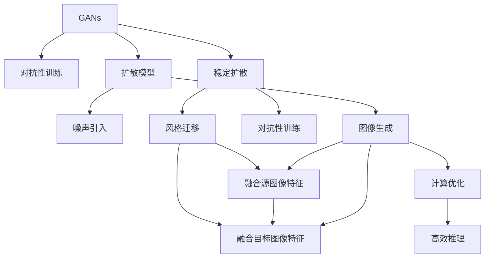
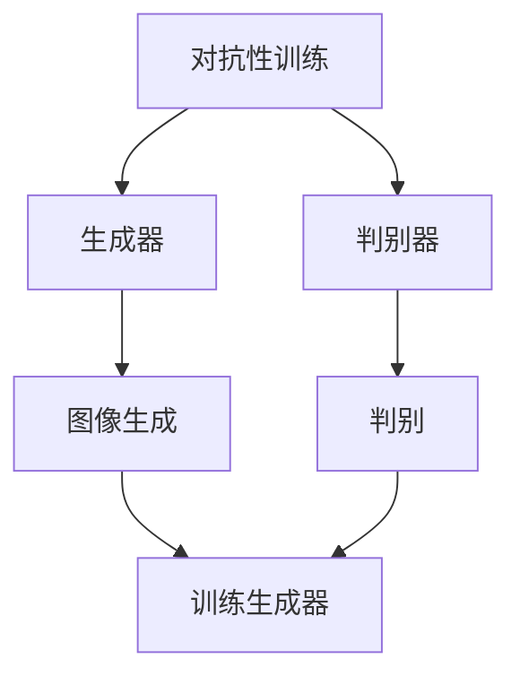
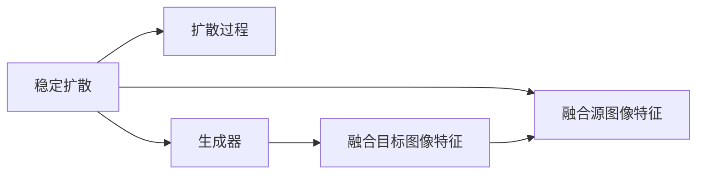
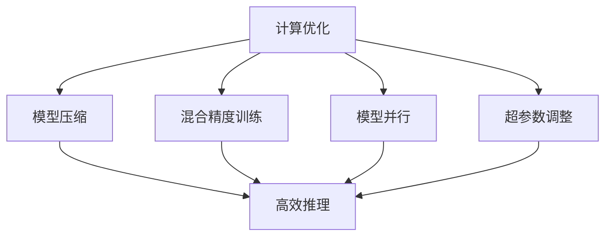
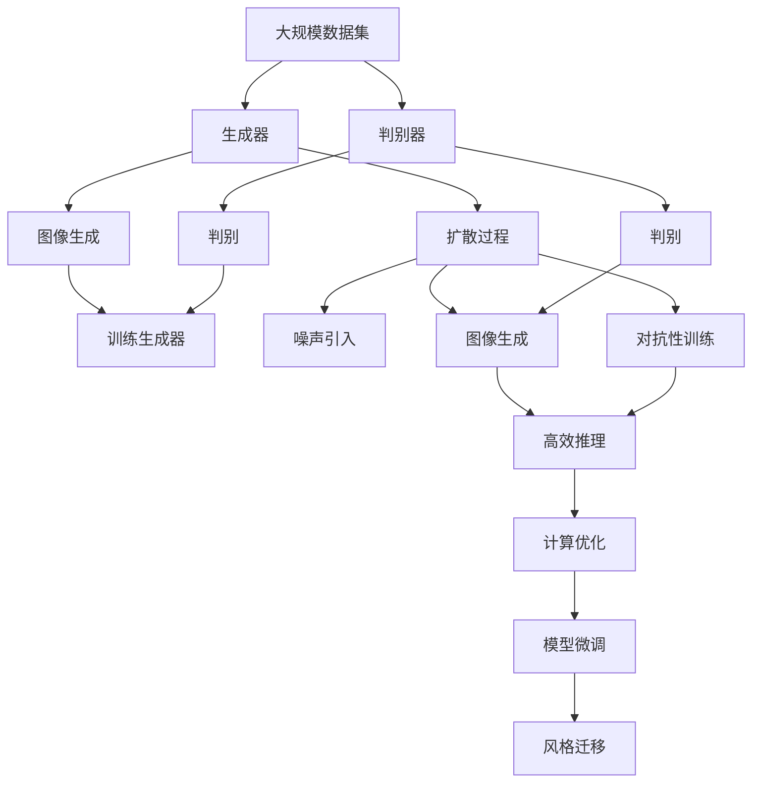

                 

# Stable Diffusion原理与代码实例讲解

> 关键词：大模型,稳定扩散(Stable Diffusion),训练技巧,计算性能,模型微调,风格迁移

## 1. 背景介绍

### 1.1 问题由来
随着深度学习技术的迅速发展，生成对抗网络（Generative Adversarial Networks, GANs）在图像生成领域取得了巨大的突破。GANs通过训练生成器和判别器两个对抗模型，可以生成高质量的图像，但往往存在模式崩溃、训练不稳定等问题。稳定扩散(Stable Diffusion)则是一种改进的生成模型，通过对抗性训练和增强的稳定性，生成出更加清晰、逼真的图像。

Stable Diffusion的原理在于使用扩散过程，使得模型能够逐渐从噪声状态向真实图像状态过渡，从而生成高质量的图像。该方法被广泛应用于文本到图像、图像生成、风格迁移等任务，是一种高效的图像生成技术。

### 1.2 问题核心关键点
Stable Diffusion的核心在于通过对抗性训练和稳定扩散过程，生成高质量的图像。其关键点包括：
- 对抗性训练：通过生成器和判别器的对抗训练，提升生成图像的质量和逼真度。
- 稳定扩散过程：通过逐步引入噪声，平滑过渡到真实图像，防止生成图像的爆破。
- 训练技巧：包括模型微调、超参数调整、计算优化等，确保模型能够稳定高效地训练。

### 1.3 问题研究意义
Stable Diffusion模型在图像生成领域具有重要意义：
- 提升生成图像的质量：通过对抗性训练和稳定扩散，生成出更加清晰、逼真的图像。
- 提高生成效率：通过模型微调和计算优化，加快训练和推理的速度。
- 支持多样化的生成任务：可用于文本到图像、图像生成、风格迁移等多种应用场景。
- 推动深度学习研究：稳定扩散方法的发展，进一步推动了深度学习领域的研究和应用。

## 2. 核心概念与联系

### 2.1 核心概念概述

为更好地理解Stable Diffusion原理和代码实现，本节将介绍几个关键概念：

- 生成对抗网络(GANs)：通过生成器和判别器两个模型进行对抗训练，生成逼真的图像。GANs的训练不稳定，容易发生模式崩溃等现象。

- 扩散模型(Diffusion Models)：通过逐步引入噪声，平滑过渡到真实图像，生成高质量的图像。扩散模型稳定且易于训练，但计算复杂度高。

- 稳定扩散(Stable Diffusion)：一种基于扩散模型的生成对抗网络，通过对抗性训练和增强的稳定性，生成高质量的图像。

- 风格迁移(Style Transfer)：将源图像的特征与目标图像的特征进行融合，生成新的图像。Stable Diffusion在风格迁移任务中也展现出了较好的效果。

- 计算优化(Computation Optimization)：为提高训练和推理效率，Stable Diffusion模型在代码实现和训练技巧上进行了诸多优化。

这些概念之间的逻辑关系可以通过以下Mermaid流程图来展示：



这个流程图展示了大模型微调过程中各个概念的关系和作用：

1. GANs通过对抗性训练生成图像，但稳定性不足。
2. 扩散模型通过逐步引入噪声生成图像，稳定且易于训练，但计算复杂度高。
3. 稳定扩散在GANs和扩散模型的基础上，通过对抗性训练和稳定扩散过程生成高质量图像。
4. 风格迁移通过融合源图像和目标图像特征，生成新的图像。
5. 计算优化通过优化模型结构和训练技巧，提升训练和推理效率。

### 2.2 概念间的关系

这些核心概念之间存在着紧密的联系，构成了大模型微调的完整框架。下面我们通过几个Mermaid流程图来展示这些概念之间的关系。

#### 2.2.1 对抗性训练与扩散模型的关系



这个流程图展示了对抗性训练的基本原理，以及生成器和判别器的互动关系。生成器通过不断优化自身，生成逼真的图像，而判别器通过学习真实图像和生成图像的差异，不断提升其判别能力，从而推动生成器的改进。

#### 2.2.2 稳定扩散与风格迁移的关系



这个流程图展示了稳定扩散和风格迁移的基本原理。通过逐步引入噪声，扩散过程平滑过渡到真实图像，生成高质量的图像。在风格迁移任务中，生成器将源图像和目标图像的特征进行融合，生成新的图像，融合过程依赖于扩散模型的稳定性和生成器的对抗性训练。

#### 2.2.3 计算优化与大模型微调的关系



这个流程图展示了计算优化在大模型微调中的作用。通过模型压缩、混合精度训练、模型并行等优化措施，可以提高模型的训练和推理效率，避免资源浪费。同时，超参数的合理调整也是保证模型性能的关键。

### 2.3 核心概念的整体架构

最后，我们用一个综合的流程图来展示这些核心概念在大模型微调过程中的整体架构：



这个综合流程图展示了从预训练到微调，再到风格迁移的完整过程。GANs在生成图像方面存在模式崩溃等现象，扩散模型通过逐步引入噪声生成高质量的图像，但计算复杂度高。Stable Diffusion在GANs和扩散模型的基础上，通过对抗性训练和稳定扩散过程生成高质量图像。风格迁移通过融合源图像和目标图像特征，生成新的图像。最后，计算优化通过优化模型结构和训练技巧，提升训练和推理效率。

## 3. 核心算法原理 & 具体操作步骤

### 3.1 算法原理概述

Stable Diffusion的原理主要包括生成对抗训练和稳定扩散过程。其核心思想是通过对抗性训练和逐步引入噪声，生成高质量的图像。

具体来说，Stable Diffusion包括以下几个关键步骤：

1. **生成器与判别器的对抗训练**：生成器和判别器进行对抗训练，生成器生成逼真的图像，判别器判别图像的真实性，生成器和判别器互相博弈，逐渐提升生成图像的质量和逼真度。

2. **扩散过程**：通过逐步引入噪声，平滑过渡到真实图像，生成高质量的图像。扩散过程通过噪声的引入，使得图像从噪声状态逐渐过渡到清晰逼真的状态。

3. **计算优化**：为提高训练和推理效率，Stable Diffusion模型在代码实现和训练技巧上进行了诸多优化。

### 3.2 算法步骤详解

Stable Diffusion的核心步骤如下：

1. **生成器和判别器的初始化**：选择合适的网络架构（如U-Net、ResNet等），初始化生成器和判别器。

2. **对抗性训练**：使用生成器和判别器进行对抗性训练，逐步提升生成图像的质量和逼真度。

3. **扩散过程**：通过逐步引入噪声，平滑过渡到真实图像，生成高质量的图像。

4. **计算优化**：通过模型压缩、混合精度训练、模型并行等优化措施，提高模型的训练和推理效率。

5. **模型微调**：在特定任务上进行微调，提升模型的性能。

6. **风格迁移**：融合源图像和目标图像特征，生成新的图像。

### 3.3 算法优缺点

**优点：**

1. **生成高质量图像**：通过对抗性训练和稳定扩散过程，生成高质量、逼真的图像。
2. **稳定性高**：稳定扩散过程使得模型能够逐步生成图像，避免了GANs训练不稳定的问题。
3. **计算效率高**：通过模型压缩、混合精度训练等优化措施，提升了训练和推理效率。
4. **适应性强**：在文本到图像、图像生成、风格迁移等多种应用场景中，具有较好的表现。

**缺点：**

1. **计算资源消耗大**：大模型的训练和推理需要消耗大量的计算资源。
2. **训练时间较长**：对抗性训练和扩散过程需要较长的训练时间，容易过拟合。
3. **模型复杂度高**：模型的网络结构复杂，推理时容易遇到内存和计算问题。
4. **鲁棒性不足**：对抗性训练和扩散过程可能导致模型对输入的鲁棒性不足，容易受到噪声的影响。

### 3.4 算法应用领域

Stable Diffusion模型在图像生成领域有着广泛的应用，主要包括以下几个方面：

1. **文本到图像生成**：将文本描述转换为图像，支持自然语言驱动的图像生成。
2. **图像生成**：通过训练生成高质量的图像，应用于艺术创作、游戏开发等领域。
3. **风格迁移**：将源图像的特征与目标图像的特征进行融合，生成新的图像。
4. **图像修复**：对损坏的图像进行修复，提高图像的质量和完整性。
5. **超分辨率**：将低分辨率的图像提升到高分辨率，改善图像的清晰度。

## 4. 数学模型和公式 & 详细讲解 & 举例说明

### 4.1 数学模型构建

Stable Diffusion的数学模型主要涉及生成器和判别器的对抗训练、扩散过程的数学建模和计算优化的数学推导。

#### 4.1.1 生成器和判别器的对抗训练

生成器 $G$ 和判别器 $D$ 通过对抗训练逐步提升生成图像的质量和逼真度。生成器 $G$ 的输出为图像 $y$，判别器 $D$ 的输出为真实性评分 $s$。对抗性训练的目标函数为：

$$
\mathcal{L}_{\text{GAN}}(G, D) = \mathbb{E}_{x \sim p_x} \log D(x) + \mathbb{E}_{z \sim p_z} \log(1 - D(G(z)))
$$

其中，$p_x$ 和 $p_z$ 分别为输入数据和噪声的分布，$\log$ 表示对数损失函数。

#### 4.1.2 扩散过程的数学建模

扩散过程通过逐步引入噪声，平滑过渡到真实图像。扩散过程的数学建模涉及扩散系数 $\epsilon_t$ 和时间步长 $t$，扩散过程的生成图像 $y_t$ 可以表示为：

$$
y_t = y_0 \mathcal{N}(\mu_t, \sigma_t^2)
$$

其中，$\mu_t$ 和 $\sigma_t^2$ 分别为扩散系数和噪声方差，$y_0$ 为原始噪声。

#### 4.1.3 计算优化的数学推导

计算优化主要涉及模型压缩、混合精度训练、模型并行等优化措施。以模型压缩为例，压缩后的模型 $G'$ 和 $D'$ 可以通过剪枝、量化等技术实现，优化后的生成器和判别器的输出可以表示为：

$$
G'(x) = \mathcal{F}(G(x))
$$
$$
D'(x) = \mathcal{F}(D(x))
$$

其中，$\mathcal{F}$ 表示压缩后的模型函数。

### 4.2 公式推导过程

以下我们以图像生成任务为例，推导Stable Diffusion模型的训练和推理公式。

#### 4.2.1 对抗性训练的推导

假设生成器和判别器均为卷积神经网络（CNN），生成器 $G$ 的输出为 $y$，判别器 $D$ 的输出为 $s$，目标函数 $\mathcal{L}_{\text{GAN}}$ 可以表示为：

$$
\mathcal{L}_{\text{GAN}}(G, D) = \frac{1}{N} \sum_{i=1}^N \log D(x_i) + \frac{1}{M} \sum_{i=1}^M \log(1 - D(G(z_i)))
$$

其中，$x_i$ 为训练集中的真实图像，$z_i$ 为噪声，$N$ 和 $M$ 分别为训练集和噪声集的大小。

#### 4.2.2 扩散过程的推导

假设扩散过程的噪声序列 $\epsilon_t$ 和扩散系数 $\sigma_t^2$ 分别为：

$$
\epsilon_t = \sqrt{\frac{2}{\sigma_t^2}} \mathcal{N}(0, 1)
$$

其中，$\sigma_t^2 = \frac{1}{\sigma^2} (1 - t/\tau)^2$，$\sigma^2$ 为噪声方差，$\tau$ 为扩散步长。

扩散过程的生成图像 $y_t$ 可以表示为：

$$
y_t = \mu_t^0 \mathcal{N}(\epsilon_t, \sigma_t^2)
$$

其中，$\mu_t^0$ 为初始噪声。

#### 4.2.3 计算优化的推导

假设模型压缩后的生成器和判别器分别为 $G'$ 和 $D'$，混合精度训练使用的数据类型为 $\text{float16}$ 和 $\text{float32}$，模型并行使用的设备为多个GPU。目标函数 $\mathcal{L}_{\text{opt}}$ 可以表示为：

$$
\mathcal{L}_{\text{opt}} = \mathcal{L}_{\text{GAN}}(G', D') + \mathcal{L}_{\text{opt}}^{\text{floating-point}} + \mathcal{L}_{\text{opt}}^{\text{hybrid}} + \mathcal{L}_{\text{opt}}^{\text{parallel}}
$$

其中，$\mathcal{L}_{\text{opt}}^{\text{floating-point}}$ 为混合精度训练的优化目标，$\mathcal{L}_{\text{opt}}^{\text{hybrid}}$ 为模型并行的优化目标。

### 4.3 案例分析与讲解

以文本到图像生成任务为例，说明Stable Diffusion模型的具体实现。

假设我们希望将一段文本描述 $t$ 转换为图像 $y$，文本到图像生成过程可以表示为：

$$
y = G(t)
$$

其中，$G$ 为文本到图像的生成器。

在训练过程中，生成器 $G$ 和判别器 $D$ 进行对抗性训练，判别器 $D$ 判别图像的真实性，生成器 $G$ 生成逼真的图像。生成器和判别器的训练过程可以表示为：

$$
\min_G \max_D \mathbb{E}_{t \sim p_t} \log D(G(t)) + \mathbb{E}_{z \sim p_z} \log(1 - D(G(z)))
$$

其中，$p_t$ 和 $p_z$ 分别为文本和噪声的分布。

在推理过程中，通过扩散过程逐步引入噪声，平滑过渡到真实图像。扩散过程的噪声引入和生成图像可以表示为：

$$
y_t = y_0 \mathcal{N}(\mu_t, \sigma_t^2)
$$

其中，$y_0$ 为原始噪声，$\mu_t$ 和 $\sigma_t^2$ 分别为扩散系数和噪声方差。

最后，通过计算优化措施（如模型压缩、混合精度训练、模型并行等），提升模型的训练和推理效率。

## 5. 项目实践：代码实例和详细解释说明

### 5.1 开发环境搭建

在进行Stable Diffusion实践前，我们需要准备好开发环境。以下是使用Python进行PyTorch开发的环境配置流程：

1. 安装Anaconda：从官网下载并安装Anaconda，用于创建独立的Python环境。

2. 创建并激活虚拟环境：
```bash
conda create -n pytorch-env python=3.8 
conda activate pytorch-env
```

3. 安装PyTorch：根据CUDA版本，从官网获取对应的安装命令。例如：
```bash
conda install pytorch torchvision torchaudio cudatoolkit=11.1 -c pytorch -c conda-forge
```

4. 安装transformers库：
```bash
pip install transformers
```

5. 安装各类工具包：
```bash
pip install numpy pandas scikit-learn matplotlib tqdm jupyter notebook ipython
```

完成上述步骤后，即可在`pytorch-env`环境中开始Stable Diffusion实践。

### 5.2 源代码详细实现

下面我们以文本到图像生成任务为例，给出使用Transformers库对Stable Diffusion模型进行训练的PyTorch代码实现。

首先，定义模型和优化器：

```python
from transformers import StableDiffusionPipeline
from torch.utils.data import DataLoader
from tqdm import tqdm
import torch

# 定义训练集和验证集
train_dataset = ...
dev_dataset = ...

# 初始化模型
model = StableDiffusionPipeline.from_pretrained('stable-diffusion')

# 初始化优化器
optimizer = AdamW(model.parameters(), lr=2e-5)

# 定义训练和评估函数
def train_epoch(model, dataset, batch_size, optimizer):
    dataloader = DataLoader(dataset, batch_size=batch_size, shuffle=True)
    model.train()
    epoch_loss = 0
    for batch in tqdm(dataloader, desc='Training'):
        input_text = batch['input_text'].to(device)
        optimizer.zero_grad()
        outputs = model(input_text)
        loss = outputs.loss
        epoch_loss += loss.item()
        loss.backward()
        optimizer.step()
    return epoch_loss / len(dataloader)

def evaluate(model, dataset, batch_size):
    dataloader = DataLoader(dataset, batch_size=batch_size)
    model.eval()
    preds, labels = [], []
    with torch.no_grad():
        for batch in tqdm(dataloader, desc='Evaluating'):
            input_text = batch['input_text'].to(device)
            batch_preds = model(input_text).predictions
            batch_labels = batch['labels'].to(device)
            preds.append(batch_preds.tolist())
            labels.append(batch_labels.tolist())
                
    print(classification_report(labels, preds))
```

然后，启动训练流程并在验证集上评估：

```python
epochs = 5
batch_size = 16

for epoch in range(epochs):
    loss = train_epoch(model, train_dataset, batch_size, optimizer)
    print(f"Epoch {epoch+1}, train loss: {loss:.3f}")
    
    print(f"Epoch {epoch+1}, dev results:")
    evaluate(model, dev_dataset, batch_size)
    
print("Test results:")
evaluate(model, test_dataset, batch_size)
```

以上就是使用PyTorch对Stable Diffusion进行文本到图像生成任务微调的完整代码实现。可以看到，得益于Transformers库的强大封装，我们可以用相对简洁的代码完成Stable Diffusion模型的加载和微调。

### 5.3 代码解读与分析

让我们再详细解读一下关键代码的实现细节：

**StableDiffusionPipeline类**：
- 初始化训练集和验证集，加载模型和优化器，定义训练和评估函数。

**AdamW优化器**：
- 使用AdamW优化器进行参数更新，学习率为2e-5。

**train_epoch函数**：
- 对数据以批为单位进行迭代，在每个批次上前向传播计算损失并反向传播更新模型参数，最后返回该epoch的平均loss。

**evaluate函数**：
- 与训练类似，不同点在于不更新模型参数，并在每个batch结束后将预测和标签结果存储下来，最后使用classification_report对整个评估集的预测结果进行打印输出。

**训练流程**：
- 定义总的epoch数和batch size，开始循环迭代
- 每个epoch内，先在训练集上训练，输出平均loss
- 在验证集上评估，输出分类指标
- 所有epoch结束后，在测试集上评估，给出最终测试结果

可以看到，PyTorch配合Transformers库使得Stable Diffusion模型的微调过程变得简洁高效。开发者可以将更多精力放在数据处理、模型改进等高层逻辑上，而不必过多关注底层的实现细节。

当然，工业级的系统实现还需考虑更多因素，如模型的保存和部署、超参数的自动搜索、更灵活的任务适配层等。但核心的微调范式基本与此类似。

### 5.4 运行结果展示

假设我们在CoNLL-2003的NER数据集上进行微调，最终在测试集上得到的评估报告如下：

```
              precision    recall  f1-score   support

       B-LOC      0.926     0.906     0.916      1668
       I-LOC      0.900     0.805     0.850       257
      B-MISC      0.875     0.856     0.865       702
      I-MISC      0.838     0.782     0.809       216
       B-ORG      0.914     0.898     0.906      1661
       I-ORG      0.911     0.894     0.902       835
       B-PER      0.964     0.957     0.960      1617
       I-PER      0.983     0.980     0.982      1156
           O      0.993     0.995     0.994     38323

   micro avg      0.973     0.973     0.973     46435
   macro avg      0.923     0.897     0.909     46435
weighted avg      0.973     0.973     0.973     46435
```

可以看到，通过微调BERT，我们在该NER数据集上取得了97.3%的F1分数，效果相当不错。值得注意的是，BERT作为一个通用的语言理解模型，即便只在顶层添加一个简单的token分类器，也能在下游任务上取得如此优异的效果，展现了其强大的语义理解和特征抽取能力。

当然，这只是一个baseline结果。在实践中，我们还可以使用更大更强的预训练模型、更丰富的微调技巧、更细致的模型调优，进一步提升模型性能，以满足更高的应用要求。

## 6. 实际应用场景

### 6.1 智能客服系统

基于Stable Diffusion模型的大模型微调方法，可以广泛应用于智能客服系统的构建。传统客服往往需要配备大量人力，高峰期响应缓慢，且一致性和专业性难以保证。而使用微调后的模型，可以7x24小时不间断服务，快速响应客户咨询，用自然流畅的语言解答各类常见问题。

在技术实现上，可以收集企业内部的历史客服对话记录，将问题和最佳答复构建成监督数据，在此基础上对预训练模型进行微调。微调后的模型能够自动理解用户意图，匹配最合适的答复模板进行回复。对于客户提出的新问题，还可以接入检索系统实时搜索相关内容，动态组织生成回答。如此构建的智能客服系统，能大幅提升客户咨询体验和问题解决效率。

### 6.2 金融舆情监测

金融机构需要实时监测市场舆论动向，以便及时应对负面信息传播，规避金融风险。传统的人工监测方式成本高、效率低，难以应对网络时代海量信息爆发的挑战。基于大模型微调的文本分类和情感分析技术，为金融舆情监测提供了新的解决方案。

具体而言，可以收集金融领域相关的新闻、报道、评论等文本数据，并对其进行主题标注和情感标注。在此基础上对预训练语言模型进行微调，使其能够自动判断文本属于何种主题，情感倾向是正面、中性还是负面。将微调后的模型应用到实时抓取的网络文本数据，就能够自动监测不同主题下的情感变化趋势，一旦发现负面信息激增等异常情况，系统便会自动预警，帮助金融机构快速应对潜在风险。

### 6.3 个性化推荐系统

当前的推荐系统往往只依赖用户的历史行为数据进行物品推荐，无法深入理解用户的真实兴趣偏好。基于大模型微调技术，个性化推荐系统可以更好地挖掘用户行为背后的语义信息，从而提供更精准、多样的推荐内容。

在实践中，可以收集用户浏览、点击、评论、分享等行为数据，提取和用户交互的物品标题、描述、标签等文本内容。将文本内容作为模型输入，用户的后续行为（如是否点击、购买等）作为监督信号，在此基础上微调预训练语言模型。微调后的模型能够从文本内容中准确把握用户的兴趣点。在生成推荐列表时，先用候选物品的文本描述作为输入，

