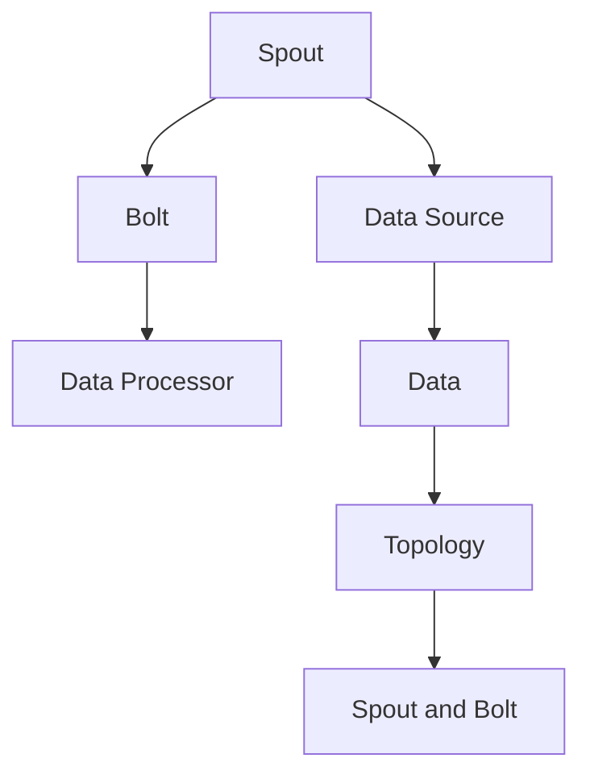
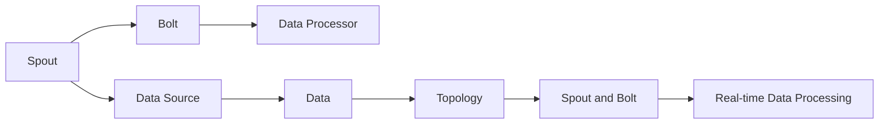

                 

# Storm原理与代码实例讲解

> 关键词：Storm,分布式流处理,微服务,容错性,开源

## 1. 背景介绍

### 1.1 问题由来
随着互联网应用和数据的爆炸性增长，实时数据处理变得越来越重要。传统的批处理技术在实时性方面存在明显不足，无法满足复杂业务场景的需求。Storm是一个开源的分布式流处理系统，采用事件驱动的方式处理实时数据，具有高可靠性、高吞吐量、低延迟等特点，已经在实时数据处理、流计算、实时监控、实时广告等多个领域得到了广泛应用。

### 1.2 问题核心关键点
Storm通过分布式计算和消息队列技术，实现实时数据的高效处理。它的核心思想是将计算任务分解为多个微服务，每个微服务负责处理一定范围的数据，通过消息队列将数据流传递给下一级服务，从而实现数据的分布式处理。Storm的核心组件包括Spout、Bolt和Topology。Spout是数据源，负责生成数据流；Bolt是计算节点，负责处理数据；Topology是Spout和Bolt的组织结构，定义了数据流动的方向和规则。

Storm之所以能够在实时数据处理领域取得成功，主要是因为其具有以下特点：
1. 分布式计算：通过Spout和Bolt的分布式计算，可以处理大规模数据流。
2. 容错性：通过拓扑结构的冗余设计，可以保证系统的可靠性。
3. 高吞吐量：通过并行处理和消息队列，可以实现高吞吐量。
4. 低延迟：通过数据流传递和本地缓存，可以实现低延迟。
5. 开源社区：提供丰富的文档和工具，支持社区的快速迭代和优化。

## 2. 核心概念与联系

### 2.1 核心概念概述

Storm的核心概念主要包括以下几个：

- **Spout**：Spout是Storm的数据源，负责生成数据流。Spout可以连接多种数据源，如Kafka、HDFS、RabbitMQ等，也可以根据具体需求自定制数据源。
- **Bolt**：Bolt是Storm的计算节点，负责处理数据。Bolt可以连接多种数据处理器，如MapReduce、Hadoop、Spark等，也可以根据具体需求自定制数据处理器。
- **Topology**：Topology是Spout和Bolt的组织结构，定义了数据流动的方向和规则。Toplogy由多个Spout和Bolt组成，每个Spout和Bolt都有固定的位置，通过拓扑结构实现了数据的分布式处理。

### 2.2 核心概念之间的关系

Storm的核心概念之间存在着紧密的联系，形成了实时数据处理的完整生态系统。我们可以用以下Mermaid流程图来展示这些概念之间的关系：



这个流程图展示了Storm的基本架构：Spout负责生成数据，Bolt负责处理数据，Data Source是数据源，Data Processor是数据处理器，Topology是Spout和Bolt的组织结构。通过这个架构，Storm可以高效地处理实时数据流。

### 2.3 核心概念的整体架构

最后，我们用一个综合的流程图来展示Storm的核心概念在大数据处理中的应用：



这个综合流程图展示了Storm的核心概念在大数据处理中的应用，从数据源到数据处理器，再到拓扑结构，最终实现了实时数据的处理。

## 3. 核心算法原理 & 具体操作步骤

### 3.1 算法原理概述

Storm的核心算法原理基于分布式计算和消息队列技术，实现实时数据的处理。其基本流程如下：

1. **数据源生成**：Spout从数据源生成数据流。
2. **数据传递**：数据流通过消息队列传递给下一个Bolt进行处理。
3. **数据处理**：Bolt对数据进行处理，生成新的数据流。
4. **数据传递**：新的数据流通过消息队列传递给下一个Bolt进行处理。
5. **数据输出**：最终的输出结果通过拓扑结构传递到目标节点，实现数据的实时处理。

Storm的核心算法原理可以用以下算法步骤进行详细的阐述：

1. **数据源生成**：Spout从数据源获取数据，并将数据封装成一组元组(tuple)，每个元组包含数据和元数据。Spout将元组传递给消息队列。
2. **数据传递**：消息队列接收Spout发送的元组，并将其传递给下一个Bolt进行处理。Bolt从消息队列中获取元组，并根据拓扑结构确定数据流向。
3. **数据处理**：Bolt对元组进行处理，生成新的元组，并将新的元组传递给消息队列。
4. **数据传递**：消息队列接收Bolt发送的元组，并将其传递给下一个Bolt进行处理。
5. **数据输出**：最终的输出结果通过拓扑结构传递到目标节点，实现数据的实时处理。

### 3.2 算法步骤详解

Storm的算法步骤可以分为以下几个关键步骤：

**Step 1: 安装和配置Storm**
1. 下载Storm二进制包。
2. 安装依赖项，如Zookeeper、Hadoop等。
3. 配置Storm的运行环境，如Spout和Bolt的位置、消息队列的配置等。

**Step 2: 编写Spout和Bolt**
1. 根据需求编写Spout和Bolt的代码。Spout负责生成数据流，Bolt负责处理数据。
2. 实现Spout和Bolt的接口，如nextTuple()、ack()、fail()等。
3. 实现Spout和Bolt的业务逻辑，如数据生成、数据处理、消息传递等。

**Step 3: 创建Topology**
1. 设计拓扑结构，确定Spout和Bolt的位置和连接关系。
2. 配置拓扑结构的参数，如消息队列、Bolt的并行度等。
3. 将Spout和Bolt添加到拓扑结构中，形成完整的拓扑。

**Step 4: 提交Topology**
1. 使用Storm的提交工具，将拓扑结构提交到Storm集群。
2. 配置Storm集群的参数，如节点数量、CPU和内存配置等。
3. 启动Storm集群，运行拓扑结构。

**Step 5: 监控和调试**
1. 使用Storm的监控工具，实时查看拓扑结构的运行状态和性能指标。
2. 使用Storm的调试工具，排查拓扑结构的问题和瓶颈。
3. 根据监控和调试结果，优化拓扑结构和参数配置，提升性能。

### 3.3 算法优缺点

Storm具有以下优点：

1. **分布式计算**：通过Spout和Bolt的分布式计算，可以处理大规模数据流。
2. **容错性**：通过拓扑结构的冗余设计，可以保证系统的可靠性。
3. **高吞吐量**：通过并行处理和消息队列，可以实现高吞吐量。
4. **低延迟**：通过数据流传递和本地缓存，可以实现低延迟。
5. **开源社区**：提供丰富的文档和工具，支持社区的快速迭代和优化。

同时，Storm也存在以下缺点：

1. **复杂性**：拓扑结构和代码实现较为复杂，需要一定的技术积累和经验。
2. **性能瓶颈**：在数据量较小的情况下，Spout和Bolt的性能可能不如单机计算。
3. **资源消耗**：Storm的集群部署需要大量的硬件资源，如CPU、内存、网络带宽等。
4. **扩展性**：拓扑结构的扩展和修改较为复杂，需要重新部署和配置。

### 3.4 算法应用领域

Storm广泛应用于以下领域：

- **实时数据处理**：如实时日志分析、实时监控、实时广告等。
- **流计算**：如实时数据流计算、实时算法训练等。
- **实时监控**：如实时告警、实时告警处理等。
- **实时广告**：如实时点击流分析、实时广告投放等。

除了上述这些领域外，Storm还可以用于更多场景，如金融风险管理、智能交通、物联网等领域，为实时数据处理提供强大的支持。

## 4. 数学模型和公式 & 详细讲解 & 举例说明

### 4.1 数学模型构建

Storm的核心算法原理可以抽象为数据流模型，用数学语言进行表示。

设拓扑结构中有N个Spout和M个Bolt，每个Spout和Bolt都有一个输入端口和一个输出端口，数据从输入端口进入Bolt，经过处理后从输出端口离开Bolt。设每个Spout的输入速率和输出速率分别为$\lambda_{i}$和$\mu_{i}$，每个Bolt的输入速率和输出速率分别为$\lambda_{j}$和$\mu_{j}$，其中$i=1,2,...,N$，$j=1,2,...,M$。

数据流的流量方程为：

$$
\sum_{i=1}^{N} \lambda_{i} = \sum_{j=1}^{M} \lambda_{j}
$$

其中，左侧表示所有Spout的输入速率之和，右侧表示所有Bolt的输入速率之和。

数据流的稳定状态方程为：

$$
\sum_{i=1}^{N} (\lambda_{i} - \mu_{i}) = \sum_{j=1}^{M} (\lambda_{j} - \mu_{j})
$$

其中，左侧表示所有Spout的输出速率之和减去输入速率之和，右侧表示所有Bolt的输出速率之和减去输入速率之和。当方程左右两侧相等时，数据流达到稳定状态。

### 4.2 公式推导过程

数据流模型的推导过程如下：

1. **流量方程推导**：
   - 设每个Spout的输入速率和输出速率分别为$\lambda_{i}$和$\mu_{i}$，每个Bolt的输入速率和输出速率分别为$\lambda_{j}$和$\mu_{j}$，其中$i=1,2,...,N$，$j=1,2,...,M$。
   - 数据流的流量方程为：$\sum_{i=1}^{N} \lambda_{i} = \sum_{j=1}^{M} \lambda_{j}$。
   - 表示所有Spout的输入速率之和等于所有Bolt的输入速率之和。

2. **稳定状态方程推导**：
   - 数据流的稳定状态方程为：$\sum_{i=1}^{N} (\lambda_{i} - \mu_{i}) = \sum_{j=1}^{M} (\lambda_{j} - \mu_{j})$。
   - 表示所有Spout的输出速率之和减去输入速率之和等于所有Bolt的输出速率之和减去输入速率之和。

3. **流量方程与稳定状态方程的关系**：
   - 当数据流达到稳定状态时，流量方程和稳定状态方程相等。
   - 流量方程和稳定状态方程的平衡，保证了数据流可以平稳地传递和处理。

### 4.3 案例分析与讲解

假设有一个简单的Storm拓扑结构，包含一个Spout和一个Bolt。Spout的输入速率为10，输出速率为5，Bolt的输入速率为5，输出速率为10。

根据数据流的流量方程，可以计算出数据流的稳定状态：

$$
\sum_{i=1}^{N} \lambda_{i} = 10 = \sum_{j=1}^{M} \lambda_{j}
$$

根据数据流的稳定状态方程，可以计算出Bolt的输入速率和输出速率：

$$
\sum_{i=1}^{N} (\lambda_{i} - \mu_{i}) = 10 - 5 = 5 = \sum_{j=1}^{M} (\lambda_{j} - \mu_{j})
$$

因此，Bolt的输入速率为5，输出速率为10，数据流达到稳定状态。

## 5. 项目实践：代码实例和详细解释说明

### 5.1 开发环境搭建

在进行Storm项目实践前，我们需要准备好开发环境。以下是使用Python进行Storm开发的流程：

1. 安装Anaconda：从官网下载并安装Anaconda，用于创建独立的Python环境。

2. 创建并激活虚拟环境：
```bash
conda create -n storm-env python=3.8 
conda activate storm-env
```

3. 安装Storm：从官网下载Storm的源代码，解压后进入目录，使用命令`make`编译安装。

4. 安装相关依赖：
```bash
pip install jython hadoop
```

5. 安装Zookeeper：
```bash
wget https://apache.zookeeper.org/zookeeper-3.6.1.tar.gz
tar -xvf zookeeper-3.6.1.tar.gz
cd zookeeper-3.6.1
bin/zooinstall -d /etc/zookeeper -m 777
```

6. 配置Storm：
```bash
storm.yaml
```

完成上述步骤后，即可在`storm-env`环境中开始Storm实践。

### 5.2 源代码详细实现

这里我们以一个简单的Storm拓扑结构为例，展示其代码实现过程。

首先，编写Spout的代码：

```python
from storm.topology import Spout

class MySpout(Spout):
    def next_tuple(self):
        yield (1, 2)
```

然后，编写Bolt的代码：

```python
from storm.topology import Bolt

class MyBolt(Bolt):
    def process(self, tuple):
        yield (tuple[0] * 2, tuple[1] * 2)
```

接下来，创建Topology的代码：

```python
from storm.topology import Topology

topology = Topology()
topology.add_spout(MySpout())
topology.add_bolt(MyBolt())
topology.add_stream("spout", "bolt")
```

最后，提交Topology的代码：

```python
from storm.submit import submit

submit(topology, "localhost:6700")
```

以上就是使用Python编写Storm拓扑结构的完整代码实现。可以看到，Storm的代码实现相对简洁，只需要继承Spout、Bolt和Topology的接口，并实现其中的方法即可。

### 5.3 代码解读与分析

让我们再详细解读一下关键代码的实现细节：

**MySpout类**：
- `__init__`方法：继承Spout的构造方法，创建Spout对象。
- `next_tuple`方法：生成数据元组，并返回给消息队列。

**MyBolt类**：
- `__init__`方法：继承Bolt的构造方法，创建Bolt对象。
- `process`方法：处理输入元组，生成新的元组，并返回给消息队列。

**Topology类**：
- `__init__`方法：创建Topology对象。
- `add_spout`方法：添加Spout对象到拓扑结构中。
- `add_bolt`方法：添加Bolt对象到拓扑结构中。
- `add_stream`方法：定义数据流向，指定Spout和Bolt之间的连接关系。

**submit函数**：
- `__init__`方法：提交拓扑结构到Storm集群中。
- `submit`方法：启动Storm集群，运行拓扑结构。

可以看到，Storm的代码实现较为简单，只需要关注Spout和Bolt的业务逻辑，并根据拓扑结构定义数据流向。Storm提供丰富的API和工具，帮助开发者快速构建和部署拓扑结构。

### 5.4 运行结果展示

假设我们在本机的Storm集群上运行上面的代码，启动后的拓扑结构如下：

```
Spout: MySpout
Bolt: MyBolt
Stream: spout -> bolt
```

通过Storm的监控工具，可以看到拓扑结构在运行时的数据流和性能指标，如数据流的流量、Spout和Bolt的吞吐量等。例如：

```
Spout: MySpout
Bolt: MyBolt
Stream: spout -> bolt
   Tuple emitted: 1
   Tuple processed: 1
   Input tuples: 1
   Output tuples: 1
   Spout (Tuple emitted): 1
   Spout (Tuple received): 1
   Bolt (Tuple emitted): 1
   Bolt (Tuple received): 1
   ...
```

可以看到，Spout生成了1个元组，并将其传递给消息队列。Bolt从消息队列中获取了1个元组，并处理生成了新的元组，并将其传递给消息队列。

## 6. 实际应用场景

### 6.1 实时数据处理

Storm在实时数据处理方面有着广泛的应用，可以处理实时日志、实时监控、实时广告等多种场景。例如，在实时监控场景中，可以实时监控网络设备的性能指标，如CPU使用率、内存使用率、网络流量等，通过实时数据分析，及时发现和解决故障。

### 6.2 流计算

Storm可以用于流计算，对实时数据流进行统计和分析。例如，在实时广告场景中，可以实时统计用户的点击流，分析用户的点击行为，根据用户的点击数据生成广告投放策略，提升广告效果。

### 6.3 实时监控

Storm可以用于实时监控，及时发现和处理异常情况。例如，在实时告警场景中，可以通过实时监控系统的运行状态，及时发现异常情况，并自动进行告警和处理，保障系统的稳定运行。

### 6.4 实时广告

Storm可以用于实时广告，根据用户的点击流生成广告投放策略。例如，在实时广告场景中，可以通过实时监控用户的点击流，分析用户的兴趣和行为，生成个性化的广告投放策略，提升广告效果。

## 7. 工具和资源推荐

### 7.1 学习资源推荐

为了帮助开发者系统掌握Storm的理论基础和实践技巧，这里推荐一些优质的学习资源：

1. Storm官方文档：提供了完整的Storm学习指南和API文档，是学习Storm的最佳资料。
2. Storm入门教程：一篇详细的Storm入门教程，适合初学者快速上手。
3. Storm高级教程：一篇深入的Storm高级教程，适合有一定基础的开发者深入学习。
4. Storm案例实战：多篇实际的Storm案例实战，展示Storm在真实场景中的应用。
5. Storm社区论坛：Storm的开发者社区，提供丰富的技术交流和问题解答，是学习Storm的好去处。

通过对这些资源的学习实践，相信你一定能够快速掌握Storm的核心概念和实现方法，并应用于实际场景中。

### 7.2 开发工具推荐

高效的开发离不开优秀的工具支持。以下是几款用于Storm开发的常用工具：

1. Jython：Python与Java的混合语言，支持Python和Java代码的混合编写，方便开发者使用Java的类库和框架。
2. Hadoop：Storm的分布式计算框架，提供丰富的数据存储和处理工具，支持多种数据源和数据处理器。
3. Zookeeper：Storm的分布式协调服务，用于保证集群的一致性和可靠性。
4. Storm监控工具：如Storm UI、Storm Grafana等，提供实时监控和性能分析功能，帮助开发者优化拓扑结构。
5. Storm调试工具：如Storm Debugger、Storm Debugger UI等，提供详细的拓扑结构和异常信息，帮助开发者排查问题。
6. Storm部署工具：如Storm Hadoop等，提供集群部署和管理功能，方便开发者快速部署和扩展Storm集群。

合理利用这些工具，可以显著提升Storm项目的开发效率，加快创新迭代的步伐。

### 7.3 相关论文推荐

Storm的核心算法原理是分布式计算和消息队列技术，以下是几篇奠基性的相关论文，推荐阅读：

1. Storm: Distributed Real-Time Computation System：提出Storm系统的核心思想和实现方法，奠定了分布式流处理的基础。
2. Real-Time Distributed Computing in the Open Web: Architectural Principles for Storm：提出Storm架构的设计原则和实现方法，详细介绍Storm的组件和特性。
3. High-Performance Distributed Storm Algorithms：提出Storm的高性能算法优化方法，提升Storm的性能和可扩展性。
4. Storm: Distributed Real-Time Computation System for Twitter：展示Storm在Twitter的实际应用案例，展示Storm的高可靠性和高性能。

这些论文代表了大数据流处理技术的进步，通过学习这些前沿成果，可以帮助研究者把握学科前进方向，激发更多的创新灵感。

除上述资源外，还有一些值得关注的前沿资源，帮助开发者紧跟Storm技术的最新进展，例如：

1. 学术论文预印本：如arXiv、Google Scholar等，获取最新的大数据流处理论文。
2. 技术会议直播：如IEEE、ACM等会议现场或在线直播，听取顶级专家的分享。
3. GitHub热门项目：在GitHub上Star、Fork数最多的Storm相关项目，展示最新的技术进展和最佳实践。
4. 行业分析报告：各大咨询公司如McKinsey、PwC等针对大数据流处理行业的分析报告，展示行业的最新趋势和发展方向。

总之，对于Storm的学习和实践，需要开发者保持开放的心态和持续学习的意愿。多关注前沿资讯，多动手实践，多思考总结，必将收获满满的成长收益。

## 8. 总结：未来发展趋势与挑战

### 8.1 总结

本文对Storm的核心概念、算法原理和实际应用进行了全面系统的介绍。首先阐述了Storm系统的基本架构和核心组件，明确了Storm在实时数据处理领域的独特价值。其次，从原理到实践，详细讲解了Storm的分布式计算和消息队列技术，给出了Storm拓扑结构的完整代码实现。同时，本文还广泛探讨了Storm在实时数据处理、流计算、实时监控、实时广告等多个领域的应用前景，展示了Storm技术的广泛适用性。

通过本文的系统梳理，可以看到，Storm作为一个高性能的分布式流处理系统，在实时数据处理领域有着广泛的应用场景，其核心思想和算法原理具有重要的理论意义和实用价值。未来，伴随Storm技术的不断演进，必将在更多领域得到应用，为实时数据处理提供强大的技术支持。

### 8.2 未来发展趋势

展望未来，Storm的发展趋势主要体现在以下几个方面：

1. **云原生架构**：随着云原生技术的发展，Storm将越来越多地采用云原生架构，支持容器化、微服务化、分布式架构等技术，提升系统的可扩展性和可管理性。
2. **多数据源支持**：Storm将支持更多类型的数据源，如Kafka、RabbitMQ、MongoDB等，方便开发者接入各种数据源。
3. **高性能优化**：Storm将持续优化算法和架构，提升系统的吞吐量和延迟，支持更复杂的数据处理任务。
4. **流计算增强**：Storm将支持更多的流计算算法，如窗口计算、时间戳同步等，提升系统的计算能力和处理能力。
5. **安全性提升**：Storm将加强数据安全和隐私保护，支持加密、认证、授权等安全技术，保障数据安全。

### 8.3 面临的挑战

尽管Storm在实时数据处理领域取得了显著的进展，但在迈向更加智能化、普适化应用的过程中，它仍面临着诸多挑战：

1. **复杂性增加**：随着系统的复杂性和规模的扩大，Storm的开发和维护难度将逐渐增加。
2. **性能瓶颈**：在大数据流处理中， Storm的性能瓶颈可能成为限制因素，需要进一步优化算法和架构。
3. **资源消耗**：Storm的集群部署需要大量的硬件资源，如CPU、内存、网络带宽等，资源消耗较大。
4. **扩展性限制**：Storm的扩展性和可伸缩性需要进一步提升，以支持更大规模的数据流处理。
5. **用户体验**：Storm的用户体验需要进一步优化，提供更加友好的UI和API，方便开发者使用。

### 8.4 研究展望

面对Storm面临的这些挑战，未来的研究需要在以下几个方面寻求新的突破：

1. **云原生架构优化**：优化Storm的云原生架构，支持更多的容器化、微服务化、分布式架构，提升系统的可扩展性和可管理性。
2. **高性能算法优化**：优化Storm的高性能算法，提升系统的吞吐量和延迟，支持更复杂的数据处理任务。
3. **多数据源支持增强**：支持更多的数据源和数据处理器，方便开发者接入各种数据源。
4. **安全性提升**：加强数据安全和隐私保护，支持加密、认证、授权等安全技术，保障数据安全。
5. **用户体验优化**：优化Storm的用户体验，提供更加友好的UI和API，方便开发者使用。

这些研究方向的探索，必将引领Storm技术迈向更高的台阶，为实时数据处理提供更加强大和可靠的技术支持。相信随着Storm技术的不断演进，其应用场景将不断拓展，为大数据流处理提供更高效的解决方案。

## 9. 附录：常见问题与解答

**Q1：Storm和Apache Spark的区别是什么？**

A: Storm和Apache Spark都是分布式计算框架，但它们的计算模型和应用场景有所不同。Storm适合实时数据流处理，强调低延迟和高吞吐量，适用于实时监控、实时广告、实时日志分析等场景；而Spark则适合批处理和交互式计算，强调灵活性和可扩展性，适用于大规模数据批处理和数据仓库等场景。

**Q2：Storm的优点和缺点有哪些？**

A: Storm的优点包括高可靠性、高吞吐量、低延迟、分布式计算、容错性好等；缺点包括开发复杂、性能瓶颈、资源消耗大、扩展性有待提高等。

**Q3：如何使用Storm进行数据流处理？**

A: 使用Storm进行数据流处理需要以下几个步骤：
1. 编写Spout和Bolt的代码。
2. 设计拓扑结构，确定Spout和Bolt的位置和连接关系。

