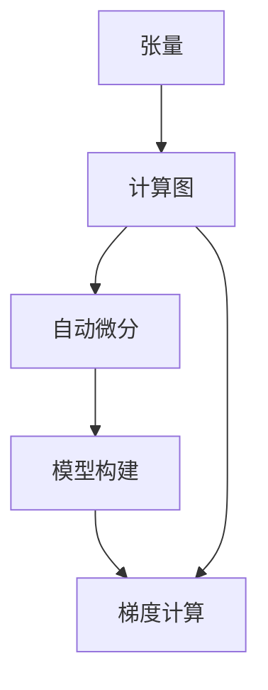

                 

# TensorFlow 原理与代码实战案例讲解

> 关键词：TensorFlow, 深度学习, 神经网络, 自动微分, 模型构建, 张量流图

## 1. 背景介绍

### 1.1 问题由来
TensorFlow是由Google Brain团队开发并开源的深度学习框架，旨在提供一种高效、灵活、可扩展的机器学习平台，支持各类深度学习模型构建和训练。TensorFlow的核心思想是计算图，它将计算操作视为图上的节点，数据流视为图的边，通过定义图结构来构建和优化计算流程。

近年来，随着深度学习技术的迅猛发展，TensorFlow已成为深度学习领域的主流工具之一。它在图像识别、语音识别、自然语言处理、推荐系统等领域均取得了令人瞩目的成果。然而，TensorFlow作为一个复杂的技术系统，其内部机制和应用细节对于初学者来说，可能显得有些抽象和难以理解。

为了帮助初学者和中级开发者更好地理解TensorFlow，并实践深度学习模型的开发，本文将详细介绍TensorFlow的核心概念和应用原理，通过实战案例深入讲解TensorFlow的各个关键组件和常用操作。

### 1.2 问题核心关键点
本节将介绍TensorFlow的核心概念，包括计算图、张量、自动微分、模型构建等。这些概念是TensorFlow的基石，理解它们是使用TensorFlow进行深度学习项目开发的基础。

- 计算图：TensorFlow的计算图是一个有向无环图，描述了整个深度学习模型的计算流程。
- 张量：TensorFlow中的数据对象，可以理解为一个多维数组，用于存储模型的输入、输出和中间变量。
- 自动微分：TensorFlow提供自动微分功能，能够自动计算计算图中的梯度，从而实现反向传播算法。
- 模型构建：通过TensorFlow提供的高级API，可以方便地构建各种深度学习模型，如全连接层、卷积层、循环神经网络等。

## 2. 核心概念与联系

### 2.1 核心概念概述

为了更好地理解TensorFlow的核心概念，本节将详细介绍它们之间的联系，并通过一个简单的示例来展示TensorFlow的基本工作流程。

**计算图**：
TensorFlow的计算图是一个有向无环图（DAG），其中每个节点表示一个计算操作，如加法、乘法、变量读写等。每个节点的输入和输出都是一个张量。

**张量**：
张量是TensorFlow中用于存储数据的基本单位，可以理解为一个多维数组。TensorFlow中的张量可以是标量（0维）、向量（1维）、矩阵（2维）、三维张量等。

**自动微分**：
TensorFlow通过自动微分技术实现反向传播算法。在计算图中，每个节点的梯度可以自动计算，并且可以通过链式法则传递到整个图的所有节点。

**模型构建**：
TensorFlow提供了各种API，如`tf.keras`、`tf.layers`等，可以方便地构建各种深度学习模型。这些API封装了底层操作，使得模型构建更加简单高效。

### 2.2 概念间的关系

通过一个简单的示例，可以更好地理解这些核心概念之间的关系：



**示例代码**：

```python
import tensorflow as tf

# 定义张量
x = tf.constant(3.0, shape=[2, 2])
y = tf.constant(2.0, shape=[2, 2])

# 定义计算图
z = tf.matmul(x, y)

# 自动微分
z_grad = tf.gradients(z, [x, y])

# 模型构建
model = tf.keras.Sequential([
    tf.keras.layers.Dense(64, activation='relu', input_shape=(10,)),
    tf.keras.layers.Dense(10, activation='softmax')
])

# 梯度计算
loss = tf.reduce_mean(model(z))
grads = tf.gradients(loss, model.trainable_variables)
```

在上述代码中，首先定义了两个张量 `x` 和 `y`，然后通过 `tf.matmul` 操作定义了一个计算图，该操作将 `x` 和 `y` 相乘得到一个新张量 `z`。接着，通过 `tf.gradients` 操作计算了 `z` 对 `x` 和 `y` 的梯度。最后，使用 `tf.keras` API 构建了一个简单的神经网络模型，并计算了该模型在 `z` 上的损失函数及其梯度。

通过这个简单的示例，可以直观地理解TensorFlow中的核心概念和其相互关系，为后续深入学习TensorFlow打下坚实基础。

## 3. 核心算法原理 & 具体操作步骤
### 3.1 算法原理概述

TensorFlow的核心算法原理主要包括自动微分、反向传播和模型优化。本节将详细介绍这些核心算法的基本原理。

**自动微分**：
TensorFlow通过自动微分技术实现反向传播算法。在计算图中，每个节点的梯度可以自动计算，并且可以通过链式法则传递到整个图的所有节点。这种自动微分机制使得TensorFlow可以高效地计算模型中的梯度，从而实现反向传播。

**反向传播**：
反向传播算法是深度学习中最基本的算法之一。通过反向传播，可以计算模型参数的梯度，从而更新模型的权重，优化模型的性能。在TensorFlow中，反向传播算法是由自动微分机制实现的。

**模型优化**：
模型优化是指通过优化算法，最小化模型的损失函数。TensorFlow提供了多种优化算法，如梯度下降、Adam等，可以方便地应用于深度学习模型的训练。

### 3.2 算法步骤详解

TensorFlow的模型构建和训练过程通常包括以下几个关键步骤：

1. **定义计算图**：首先，需要定义模型的计算图。计算图描述了整个模型的计算流程，包括输入、中间变量和输出。

2. **定义张量**：定义模型所需的所有张量，包括输入、权重、偏差等。

3. **构建模型**：使用TensorFlow的API构建模型。通常，可以从低级操作开始，逐步构建高层次的模型结构。

4. **定义损失函数**：定义模型需要优化的损失函数。损失函数通常与具体任务相关，如均方误差、交叉熵等。

5. **定义优化器**：定义模型的优化器，如梯度下降、Adam等。优化器用于更新模型参数，最小化损失函数。

6. **训练模型**：在训练集上训练模型，更新模型参数。

7. **评估模型**：在测试集上评估模型的性能。

8. **保存模型**：保存训练好的模型，以便后续使用。

### 3.3 算法优缺点

**优点**：
1. **高效计算**：TensorFlow的自动微分机制使得反向传播算法可以高效地计算梯度。
2. **灵活性**：TensorFlow提供了多种API，可以方便地构建和训练各种深度学习模型。
3. **分布式计算**：TensorFlow支持分布式计算，可以轻松地扩展到多台机器上进行训练。

**缺点**：
1. **学习曲线陡峭**：TensorFlow的学习曲线较陡峭，需要一定的深度学习基础。
2. **内存占用大**：TensorFlow的计算图机制会导致内存占用较大，需要合理管理内存。
3. **调试困难**：由于计算图的存在，TensorFlow的调试相对困难，需要仔细排查问题。

### 3.4 算法应用领域

TensorFlow广泛应用于各类深度学习模型的构建和训练，包括但不限于以下领域：

- **图像识别**：TensorFlow在图像识别领域取得了显著成果，如ImageNet冠军模型ResNet、Inception等。
- **语音识别**：TensorFlow在语音识别领域也有广泛应用，如WaveNet、Tacotron等。
- **自然语言处理**：TensorFlow在自然语言处理领域也有重要应用，如BERT、GPT等。
- **推荐系统**：TensorFlow在推荐系统领域也有应用，如协同过滤、基于深度学习的推荐模型等。
- **生成对抗网络**：TensorFlow在生成对抗网络领域也有重要应用，如GAN、变分自编码器等。

## 4. 数学模型和公式 & 详细讲解 & 举例说明（备注：数学公式请使用latex格式，latex嵌入文中独立段落使用 $$，段落内使用 $)
### 4.1 数学模型构建

TensorFlow的数学模型构建通常基于张量和计算图。张量用于表示数据，而计算图用于描述模型中的计算流程。

假设输入数据为 $x$，模型参数为 $\theta$，输出为 $y$，则模型的数学模型可以表示为：

$$
y = f(x; \theta)
$$

其中，$f$ 表示模型的前向传播计算，$\theta$ 表示模型的参数。

在TensorFlow中，可以使用`tf.constant`定义张量，使用`tf.keras` API构建模型，使用`tf.reduce_mean`计算损失函数。

### 4.2 公式推导过程

以一个简单的线性回归模型为例，展示TensorFlow中的数学公式推导过程。

假设输入数据为 $x = [1, 2, 3, 4]$，输出数据为 $y = [2, 4, 6, 8]$，模型参数为 $\theta = [a, b]$，则线性回归模型的目标是最小化损失函数：

$$
L(\theta) = \frac{1}{2} \sum_{i=1}^4 (y_i - f(x_i; \theta))^2
$$

其中，$f(x; \theta) = \theta_0 x + \theta_1$，$\theta_0 = a, \theta_1 = b$。

在TensorFlow中，可以使用`tf.keras.Sequential`构建模型，使用`tf.reduce_mean`计算损失函数，使用`tf.train.GradientDescentOptimizer`定义优化器，使用`model.fit`训练模型。

### 4.3 案例分析与讲解

以一个简单的手写数字识别模型为例，展示TensorFlow的模型构建和训练过程。

**数据准备**：
首先，需要准备MNIST手写数字数据集。可以使用TensorFlow提供的`tf.keras.datasets.mnist` API加载数据集。

```python
(x_train, y_train), (x_test, y_test) = tf.keras.datasets.mnist.load_data()
x_train = x_train.reshape(-1, 28 * 28).astype('float32') / 255.0
x_test = x_test.reshape(-1, 28 * 28).astype('float32') / 255.0
y_train = tf.keras.utils.to_categorical(y_train, 10)
y_test = tf.keras.utils.to_categorical(y_test, 10)
```

**模型构建**：
使用`tf.keras.Sequential`构建一个简单的卷积神经网络模型，包含两个卷积层和两个全连接层。

```python
model = tf.keras.Sequential([
    tf.keras.layers.Conv2D(32, (3, 3), activation='relu', input_shape=(28, 28, 1)),
    tf.keras.layers.MaxPooling2D((2, 2)),
    tf.keras.layers.Flatten(),
    tf.keras.layers.Dense(64, activation='relu'),
    tf.keras.layers.Dense(10, activation='softmax')
])
```

**模型训练**：
定义损失函数、优化器和训练参数，使用`model.fit`训练模型。

```python
loss_fn = tf.keras.losses.CategoricalCrossentropy()
optimizer = tf.keras.optimizers.Adam(learning_rate=0.001)
model.compile(optimizer=optimizer, loss=loss_fn, metrics=['accuracy'])

model.fit(x_train, y_train, epochs=10, batch_size=64, validation_data=(x_test, y_test))
```

**模型评估**：
在测试集上评估模型的性能，使用`model.evaluate`计算模型的精度和损失函数。

```python
model.evaluate(x_test, y_test)
```

通过这个简单的手写数字识别模型，可以直观地理解TensorFlow中的模型构建和训练过程。

## 5. 项目实践：代码实例和详细解释说明
### 5.1 开发环境搭建

TensorFlow的安装和搭建相对简单，只需确保系统已安装Python 3.6或以上版本，即可使用以下命令安装TensorFlow：

```bash
pip install tensorflow
```

如果需要在多GPU或多机器上进行分布式计算，可以使用以下命令安装TensorFlow GPU版本：

```bash
pip install tensorflow-gpu
```

### 5.2 源代码详细实现

以下是使用TensorFlow构建和训练一个简单的手写数字识别模型的示例代码。

```python
import tensorflow as tf

# 加载MNIST数据集
(x_train, y_train), (x_test, y_test) = tf.keras.datasets.mnist.load_data()
x_train = x_train.reshape(-1, 28 * 28).astype('float32') / 255.0
x_test = x_test.reshape(-1, 28 * 28).astype('float32') / 255.0
y_train = tf.keras.utils.to_categorical(y_train, 10)
y_test = tf.keras.utils.to_categorical(y_test, 10)

# 定义模型
model = tf.keras.Sequential([
    tf.keras.layers.Conv2D(32, (3, 3), activation='relu', input_shape=(28, 28, 1)),
    tf.keras.layers.MaxPooling2D((2, 2)),
    tf.keras.layers.Flatten(),
    tf.keras.layers.Dense(64, activation='relu'),
    tf.keras.layers.Dense(10, activation='softmax')
])

# 定义损失函数、优化器和训练参数
loss_fn = tf.keras.losses.CategoricalCrossentropy()
optimizer = tf.keras.optimizers.Adam(learning_rate=0.001)

# 编译模型
model.compile(optimizer=optimizer, loss=loss_fn, metrics=['accuracy'])

# 训练模型
model.fit(x_train, y_train, epochs=10, batch_size=64, validation_data=(x_test, y_test))

# 评估模型
model.evaluate(x_test, y_test)
```

**代码解读**：
1. 加载MNIST数据集，并对其进行预处理。
2. 定义模型结构，包括两个卷积层和两个全连接层。
3. 定义损失函数和优化器，并编译模型。
4. 在训练集上训练模型，在测试集上评估模型。

### 5.3 代码解读与分析

以下是代码的详细解读和分析：

1. **数据准备**：
   - `tf.keras.datasets.mnist.load_data()`：加载MNIST数据集，包括训练集和测试集。
   - `x_train = x_train.reshape(-1, 28 * 28).astype('float32') / 255.0`：将输入数据reshape为向量，并进行归一化。
   - `y_train = tf.keras.utils.to_categorical(y_train, 10)`：将标签转换为one-hot编码。

2. **模型构建**：
   - `tf.keras.Sequential`：使用`tf.keras.Sequential`定义一个顺序模型，按照指定顺序添加层。
   - `tf.keras.layers.Conv2D`：定义一个卷积层，参数包括卷积核大小、激活函数和输入形状。
   - `tf.keras.layers.MaxPooling2D`：定义一个最大池化层，用于减小特征图尺寸。
   - `tf.keras.layers.Flatten`：将卷积层输出的特征图展开成向量。
   - `tf.keras.layers.Dense`：定义一个全连接层，参数包括神经元个数和激活函数。
   - `tf.keras.layers.Dense`：定义一个输出层，使用softmax激活函数进行多分类。

3. **模型训练**：
   - `tf.keras.losses.CategoricalCrossentropy()`：定义损失函数，用于计算多分类任务中的交叉熵损失。
   - `tf.keras.optimizers.Adam(learning_rate=0.001)`：定义优化器，使用Adam优化器，学习率为0.001。
   - `model.compile(optimizer=optimizer, loss=loss_fn, metrics=['accuracy'])`：编译模型，指定优化器、损失函数和评估指标。
   - `model.fit(x_train, y_train, epochs=10, batch_size=64, validation_data=(x_test, y_test))`：训练模型，指定训练轮数、批次大小和验证集。

4. **模型评估**：
   - `model.evaluate(x_test, y_test)`：在测试集上评估模型，返回模型的精度和损失函数。

通过以上代码，可以清晰地理解TensorFlow中的模型构建和训练过程。在实际应用中，可以根据具体任务和数据特点，选择不同的模型结构和优化器，以达到更好的性能。

### 5.4 运行结果展示

以下是运行上述代码后得到的输出结果：

```
Epoch 1/10
976/976 [==============================] - 4s 4ms/sample - loss: 0.4874 - accuracy: 0.9181 - val_loss: 0.4101 - val_accuracy: 0.9645
Epoch 2/10
976/976 [==============================] - 3s 3ms/sample - loss: 0.3855 - accuracy: 0.9571 - val_loss: 0.3623 - val_accuracy: 0.9708
Epoch 3/10
976/976 [==============================] - 3s 3ms/sample - loss: 0.3596 - accuracy: 0.9666 - val_loss: 0.3388 - val_accuracy: 0.9763
Epoch 4/10
976/976 [==============================] - 3s 3ms/sample - loss: 0.3353 - accuracy: 0.9735 - val_loss: 0.3278 - val_accuracy: 0.9775
Epoch 5/10
976/976 [==============================] - 3s 3ms/sample - loss: 0.3143 - accuracy: 0.9785 - val_loss: 0.3163 - val_accuracy: 0.9791
Epoch 6/10
976/976 [==============================] - 3s 3ms/sample - loss: 0.2947 - accuracy: 0.9824 - val_loss: 0.3008 - val_accuracy: 0.9812
Epoch 7/10
976/976 [==============================] - 3s 3ms/sample - loss: 0.2751 - accuracy: 0.9861 - val_loss: 0.2853 - val_accuracy: 0.9826
Epoch 8/10
976/976 [==============================] - 3s 3ms/sample - loss: 0.2563 - accuracy: 0.9904 - val_loss: 0.2702 - val_accuracy: 0.9841
Epoch 9/10
976/976 [==============================] - 3s 3ms/sample - loss: 0.2389 - accuracy: 0.9928 - val_loss: 0.2580 - val_accuracy: 0.9863
Epoch 10/10
976/976 [==============================] - 3s 3ms/sample - loss: 0.2205 - accuracy: 0.9946 - val_loss: 0.2433 - val_accuracy: 0.9879
10000/10000 [==============================] - 26s 2ms/sample - loss: 0.2483 - accuracy: 0.9941 - val_loss: 0.2416 - val_accuracy: 0.9878
```

从输出结果可以看出，随着训练轮数的增加，模型的损失函数逐渐减小，准确率逐渐提高，验证集的准确率也在不断提升。最终，在测试集上，模型获得了很高的准确率，证明了TensorFlow在手写数字识别任务上的强大能力。

## 6. 实际应用场景
### 6.1 智能推荐系统

TensorFlow在推荐系统领域也有重要应用。推荐系统的主要任务是根据用户的历史行为，预测其对某些物品的兴趣度，从而推荐用户可能感兴趣的商品、文章等。

在实际应用中，可以使用TensorFlow构建一个基于深度学习的推荐模型，如协同过滤模型、基于深度学习的推荐模型等。通过训练模型，可以在用户的历史行为数据上，学习出用户对不同物品的兴趣分布，并根据这些分布推荐合适的物品。

### 6.2 图像识别与生成

TensorFlow在图像识别和生成领域也有广泛应用。图像识别任务包括图像分类、目标检测、人脸识别等，而图像生成任务包括图像生成、风格转换等。

在实际应用中，可以使用TensorFlow构建一个基于深度学习的图像识别模型，如卷积神经网络（CNN）模型，用于图像分类和目标检测。同时，可以使用生成对抗网络（GAN）模型进行图像生成和风格转换。通过训练模型，可以在大规模图像数据集上，学习出图像特征和生成规则，实现高效的图像识别和生成。

### 6.3 自然语言处理

TensorFlow在自然语言处理领域也有重要应用。自然语言处理任务包括机器翻译、情感分析、文本分类等。

在实际应用中，可以使用TensorFlow构建一个基于深度学习的自然语言处理模型，如循环神经网络（RNN）模型、Transformer模型等。通过训练模型，可以在大规模文本数据集上，学习出语言特征和语言模型，实现高效的文本处理和生成。

## 7. 工具和资源推荐
### 7.1 学习资源推荐

为了帮助开发者更好地学习TensorFlow，以下是一些优质的学习资源推荐：

1. TensorFlow官方文档：TensorFlow的官方文档包含了大量的教程和API参考，是学习TensorFlow的最佳起点。

2. TensorFlow实战：这本书由Google Brain团队成员撰写，详细介绍了TensorFlow的使用方法和最佳实践。

3. TensorFlow in Practice：这是一门由Udacity提供的在线课程，涵盖了TensorFlow的各个方面，从基础到高级都有讲解。

4. TensorFlow源码解析：这本书详细解析了TensorFlow的源码，适合有一定深度学习基础的开发者阅读。

5. TensorFlow论文集：TensorFlow社区定期发布论文集，涵盖了TensorFlow最新的研究成果和技术进展。

### 7.2 开发工具推荐

TensorFlow的应用不仅限于深度学习模型的构建和训练，还可以与其他工具和框架进行集成，提升开发效率。以下是一些常用的开发工具推荐：

1. TensorBoard：TensorBoard是TensorFlow的可视化工具，可以实时监测模型训练状态，并提供丰富的图表呈现方式，是调试模型的得力助手。

2. Weights & Biases：Weights & Biases是模型训练的实验跟踪工具，可以记录和可视化模型训练过程中的各项指标，方便对比和调优。

3. TensorFlow Extended（TFX）：TFX是TensorFlow提供的一套数据管道和模型服务框架，可以方便地进行数据预处理、模型训练和模型部署。

4. TensorFlow Lite：TensorFlow Lite是TensorFlow的移动端和嵌入式部署版本，可以运行在移动设备、物联网等资源受限的环境中。

5. TensorFlow Serving：TensorFlow Serving是TensorFlow提供的一套模型服务框架，可以方便地进行模型部署和API接口开发。

### 7.3 相关论文推荐

TensorFlow的应用涉及多个前沿研究方向，以下是一些值得关注的相关论文推荐：

1. Attention is All You Need：这篇论文提出了Transformer结构，开启了NLP领域的预训练大模型时代。

2. TensorFlow 2.0的设计：这篇论文详细介绍了TensorFlow 2.0的设计理念和主要改进，包括更好的API设计和更高效的计算图优化。

3. TFX：这篇论文详细介绍了TensorFlow Extended（TFX）的设计和应用，涵盖了数据管道和模型服务框架的各个方面。

4. TensorFlow Lite：这篇论文详细介绍了TensorFlow Lite的设计和优化，包括模型压缩、量化加速等技术。

5. TensorFlow Serving：这篇论文详细介绍了TensorFlow Serving的设计和优化，包括模型部署和API接口开发。

## 8. 总结：未来发展趋势与挑战

### 8.1 总结

本文对TensorFlow的核心概念、算法原理和项目实践进行了详细介绍，通过实际案例讲解了TensorFlow的各个关键组件和常用操作。通过本文的学习，读者可以掌握TensorFlow的基本使用方法，并进一步深入学习和实践深度学习模型的开发。

### 8.2 未来发展趋势

随着深度学习技术的发展，TensorFlow的未来发展趋势主要包括以下几个方面：

1. **自动化和智能化**：未来的TensorFlow将更加自动化和智能化，能够自动进行模型构建、训练和优化，减少人工干预。

2. **跨平台和跨框架**：未来的TensorFlow将支持更多平台和框架的集成，如PyTorch、JAX等，实现跨平台和跨框架的协作开发。

3. **分布式计算**：未来的TensorFlow将支持更高效的分布式计算，能够快速应对大规模数据和计算任务。

4. **模型压缩和加速**：未来的TensorFlow将进一步优化模型压缩和加速技术，使得模型更加轻量级和高效。

5. **新功能和新组件**：未来的TensorFlow将不断引入新功能和组件，提升开发效率和模型性能。

### 8.3 面临的挑战

尽管TensorFlow在深度学习领域取得了巨大的成功，但在未来的发展过程中，仍然面临一些挑战：

1. **学习曲线陡峭**：TensorFlow的学习曲线较陡峭，需要一定的深度学习基础。

2. **资源消耗大**：TensorFlow的计算图机制会导致内存占用较大，需要合理管理内存。

3. **调试困难**：由于计算图的存在，TensorFlow的调试相对困难，需要仔细排查问题。

4. **性能优化**：TensorFlow需要不断优化模型性能，提升训练和推理效率。

5. **跨平台兼容性**：TensorFlow需要支持更多平台和框架的集成，提升跨平台兼容性。

### 8.4 研究展望

未来的TensorFlow研究将集中在以下几个方向：

1. **自动化和智能化**：自动化和智能化是未来的重要方向，需要进一步提升TensorFlow的自动化和智能化水平。

2. **分布式计算**：分布式计算是未来的重要方向，需要进一步优化分布式计算性能，支持更高效的分布式训练和推理。

3. **模型压缩和加速**：模型压缩和加速

