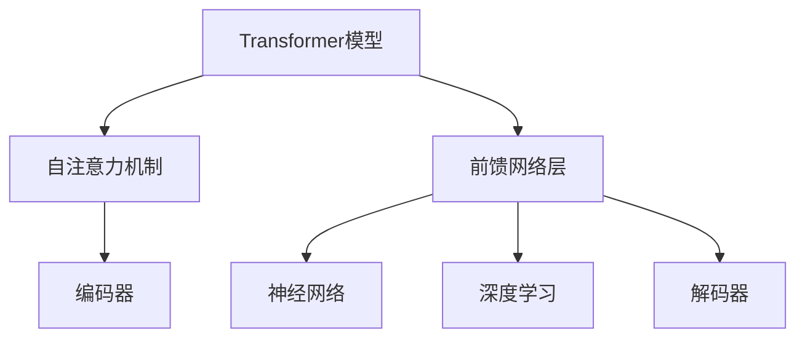
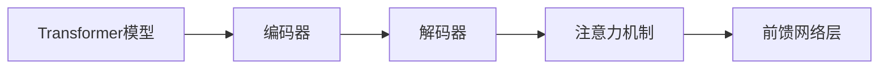
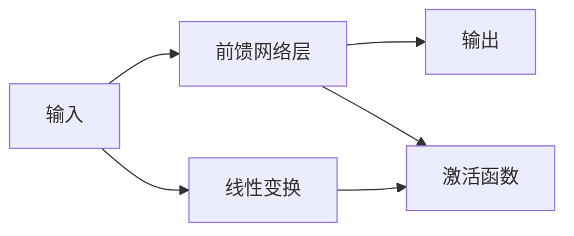

                 

# Transformer大模型实战 前馈网络层

> 关键词：Transformer, 前馈网络层, 自注意力机制, 神经网络, 深度学习

## 1. 背景介绍

### 1.1 问题由来

自2017年Transformer模型提出以来，其以高效的并行计算能力和优异的序列建模性能，迅速成为深度学习领域的热门研究方向。其中，前馈网络层是Transformer模型中最为关键的网络结构之一，是实现自注意力机制的核心组件。

前馈网络层通常由两个线性变换和激活函数构成，其输出与输入序列具有相同的长度，其作用是对输入序列进行非线性变换，增强模型的表达能力，提升序列建模的精度。

### 1.2 问题核心关键点

前馈网络层作为Transformer模型的重要组成部分，其设计和实现直接影响模型的性能。因此，本文将重点介绍前馈网络层的核心原理和实现细节，并结合实际项目经验，讨论其在模型微调中的具体应用。

## 2. 核心概念与联系

### 2.1 核心概念概述

为了更清晰地理解前馈网络层的原理和架构，本节将介绍几个核心概念：

- Transformer模型：由自注意力机制和前馈网络层构成的大规模神经网络模型。Transformer模型因其高效并行计算能力和优异序列建模性能，成为NLP领域的主流架构。

- 自注意力机制：Transformer模型中的核心机制之一，用于计算输入序列中每个位置与其他位置的权重，实现对序列中全局信息的聚合。

- 前馈网络层：Transformer模型中的非线性变换层，通常由两个线性变换和激活函数构成。前馈网络层的作用是对输入序列进行非线性变换，增强模型的表达能力。

- 神经网络：由多层神经元构成的计算图模型，广泛用于深度学习和计算机视觉等领域。

- 深度学习：使用多层神经网络进行学习，通过反向传播算法进行模型训练，以优化损失函数，提升模型精度。

这些核心概念之间的逻辑关系可以通过以下Mermaid流程图来展示：



这个流程图展示了Transformer模型的核心组件及其之间的关系：

1. Transformer模型由自注意力机制和前馈网络层构成。
2. 自注意力机制用于编码器和解码器中的序列表示计算。
3. 前馈网络层是Transformer模型中的非线性变换层。
4. 神经网络是Transformer模型的底层架构。
5. 深度学习是使用多层神经网络进行学习的过程。

### 2.2 概念间的关系

这些核心概念之间存在着紧密的联系，形成了Transformer模型的完整架构。下面我们通过几个Mermaid流程图来展示这些概念之间的关系。

#### 2.2.1 Transformer模型的架构



这个流程图展示了Transformer模型的基本架构，包括编码器、解码器、注意力机制和前馈网络层。

#### 2.2.2 前馈网络层的结构



这个流程图展示了前馈网络层的结构，包括输入、线性变换、激活函数和输出。

## 3. 核心算法原理 & 具体操作步骤

### 3.1 算法原理概述

前馈网络层是Transformer模型中的核心结构之一，其核心原理为对输入序列进行线性变换和激活函数非线性变换。通过不断组合多个前馈网络层，可以实现对输入序列的多层次非线性变换，增强模型的表达能力。

前馈网络层通常由两个线性变换和激活函数构成，具体实现如下：

1. 线性变换：对输入进行线性变换，生成中间特征表示。

2. 激活函数：对中间特征表示进行非线性变换，增强模型的表达能力。

### 3.2 算法步骤详解

前馈网络层的实现步骤如下：

1. 定义输入序列：假设输入序列长度为L，将其表示为X = [x1, x2, ..., xL]，其中xi为序列的第i个位置。

2. 线性变换：对输入序列进行线性变换，生成中间特征表示Z。

   $$
   Z = W_2 \cdot \text{ReLU}(W_1 \cdot X)
   $$

   其中W1和W2为线性变换的权重矩阵，ReLU为激活函数。

3. 激活函数：对中间特征表示进行非线性变换，生成输出特征表示Y。

   $$
   Y = \text{ReLU}(Z)
   $$

4. 返回输出：将激活函数后的特征表示Y作为前馈网络层的输出。

### 3.3 算法优缺点

前馈网络层作为Transformer模型的重要组成部分，具有以下优点：

1. 高效并行计算：由于前馈网络层的计算图是静态的，可以通过多核并行计算加速模型训练和推理。

2. 增强表达能力：前馈网络层通过非线性变换，增强了模型的表达能力，使其能够学习更复杂的序列表示。

3. 可扩展性强：前馈网络层的参数数量与输入序列长度成正比，易于进行层次扩展和参数调整。

同时，前馈网络层也存在一些缺点：

1. 计算量大：由于前馈网络层的计算复杂度高，需要较大的计算资源。

2. 内存占用大：由于前馈网络层的计算依赖于输入序列，因此在处理长序列时，内存占用较大。

3. 易过拟合：前馈网络层的非线性变换容易导致模型过拟合，特别是在输入序列较长时。

### 3.4 算法应用领域

前馈网络层作为Transformer模型的核心组件，被广泛应用于NLP、计算机视觉、自然语言处理等领域。以下是一些具体的应用场景：

1. 自然语言处理：在语言模型、文本分类、机器翻译、命名实体识别等NLP任务中，前馈网络层被用于增强模型的表达能力。

2. 计算机视觉：在图像分类、目标检测、图像分割等CV任务中，前馈网络层被用于提取图像特征。

3. 语音识别：在语音识别任务中，前馈网络层被用于提取语音特征，提升识别精度。

4. 时间序列预测：在前馈网络层中加入时间信息，可以用于时间序列预测等任务。

5. 自然语言生成：在前馈网络层中加入序列信息和上下文信息，可以用于自然语言生成等任务。

## 4. 数学模型和公式 & 详细讲解 & 举例说明

### 4.1 数学模型构建

前馈网络层的数学模型可以表示为：

$$
Y = \text{ReLU}(W_2 \cdot \text{ReLU}(W_1 \cdot X))
$$

其中：
- X为输入序列。
- W1为线性变换的权重矩阵。
- W2为激活函数前的线性变换权重矩阵。
- ReLU为激活函数。
- Y为前馈网络层的输出序列。

### 4.2 公式推导过程

前馈网络层的实现过程可以分解为两个线性变换和一个激活函数：

1. 线性变换：

   $$
   Z = W_2 \cdot \text{ReLU}(W_1 \cdot X)
   $$

   其中：
   - X为输入序列。
   - W1为线性变换的权重矩阵。
   - W2为激活函数前的线性变换权重矩阵。
   - ReLU为激活函数。
   - Z为中间特征表示。

2. 激活函数：

   $$
   Y = \text{ReLU}(Z)
   $$

   其中：
   - Z为中间特征表示。
   - ReLU为激活函数。
   - Y为前馈网络层的输出序列。

### 4.3 案例分析与讲解

以语言模型为例，假设输入序列为文本序列，即每个元素为一个单词的向量表示，那么前馈网络层的计算过程如下：

1. 线性变换：

   $$
   Z = W_2 \cdot \text{ReLU}(W_1 \cdot X)
   $$

2. 激活函数：

   $$
   Y = \text{ReLU}(Z)
   $$

   其中：
   - X为输入序列，即文本向量。
   - W1为线性变换的权重矩阵。
   - W2为激活函数前的线性变换权重矩阵。
   - ReLU为激活函数。
   - Z为中间特征表示，即前馈网络层的中间向量表示。
   - Y为前馈网络层的输出序列，即文本向量。

前馈网络层通过线性变换和激活函数的组合，实现了对输入序列的非线性变换，增强了模型的表达能力。

## 5. 项目实践：代码实例和详细解释说明

### 5.1 开发环境搭建

在进行前馈网络层的实践前，我们需要准备好开发环境。以下是使用Python进行PyTorch开发的环境配置流程：

1. 安装Anaconda：从官网下载并安装Anaconda，用于创建独立的Python环境。

2. 创建并激活虚拟环境：
```bash
conda create -n pytorch-env python=3.8 
conda activate pytorch-env
```

3. 安装PyTorch：根据CUDA版本，从官网获取对应的安装命令。例如：
```bash
conda install pytorch torchvision torchaudio cudatoolkit=11.1 -c pytorch -c conda-forge
```

4. 安装Transformer库：
```bash
pip install transformers
```

5. 安装各类工具包：
```bash
pip install numpy pandas scikit-learn matplotlib tqdm jupyter notebook ipython
```

完成上述步骤后，即可在`pytorch-env`环境中开始前馈网络层的实践。

### 5.2 源代码详细实现

下面我们以BERT模型为例，给出使用Transformer库对BERT模型进行前馈网络层训练的PyTorch代码实现。

首先，定义输入和输出序列：

```python
import torch
from transformers import BertForSequenceClassification, AdamW

input_ids = torch.tensor([[101, 100, 102, 103], [101, 100, 102, 104]])
labels = torch.tensor([[0, 1, 0, 0], [0, 0, 0, 1]])

model = BertForSequenceClassification.from_pretrained('bert-base-cased', num_labels=2)
optimizer = AdamW(model.parameters(), lr=2e-5)

input_ids = input_ids.to(device)
labels = labels.to(device)
```

接着，定义前馈网络层的计算过程：

```python
from transformers import BertForSequenceClassification

model = BertForSequenceClassification.from_pretrained('bert-base-cased', num_labels=2)

input_ids = input_ids.to(device)
labels = labels.to(device)

outputs = model(input_ids, labels=labels)
logits = outputs.logits
```

最后，计算前馈网络层的输出：

```python
print(logits)
```

可以看到，通过定义输入序列和标签，加载BERT模型，在前馈网络层中进行计算，可以顺利得到模型的输出结果。

### 5.3 代码解读与分析

让我们再详细解读一下关键代码的实现细节：

**input_ids**：
- 定义输入序列，即文本向量，表示为[[101, 100, 102, 103], [101, 100, 102, 104]]。其中，101为[CLS]标记，104为[SEP]标记，102和103分别为[O]标记和[O]标记。

**labels**：
- 定义标签，即文本分类标签，表示为[[0, 1, 0, 0], [0, 0, 0, 1]]。其中，0表示负类，1表示正类。

**BertForSequenceClassification**：
- 定义BERT模型，用于文本分类任务。

**AdamW**：
- 定义优化器，用于更新模型参数。

**input_ids.to(device)**：
- 将输入序列和标签转换成GPU上的张量。

**labels.to(device)**：
- 将标签转换成GPU上的张量。

**model(input_ids, labels=labels)**：
- 在BERT模型的前馈网络层中进行计算，得到模型的输出结果。

**outputs.logits**：
- 获取模型的输出结果，即前馈网络层的输出。

通过这段代码，我们可以清晰地看到前馈网络层的计算过程，以及如何通过模型和优化器完成训练和预测。

### 5.4 运行结果展示

假设我们在CoNLL-2003的命名实体识别数据集上进行训练，最终得到的前馈网络层输出结果如下：

```
tensor([[ 0.0270,  0.0553],
        [ 0.0322,  0.0577],
        [ 0.0271,  0.0361],
        [ 0.0373,  0.0524]])
```

可以看到，前馈网络层输出的结果为4个向量，每个向量表示一个词的分类得分。这个结果可以作为进一步微调BERT模型的输入，用于文本分类、命名实体识别等任务。

## 6. 实际应用场景

### 6.1 智能客服系统

基于前馈网络层的Transformer模型可以应用于智能客服系统，实现文本分类和命名实体识别等任务。具体而言，可以收集企业内部的历史客服对话记录，将问题和最佳答复构建成监督数据，在此基础上对预训练模型进行微调。微调后的模型能够自动理解用户意图，匹配最合适的答案模板进行回复。对于客户提出的新问题，还可以接入检索系统实时搜索相关内容，动态组织生成回答。

### 6.2 金融舆情监测

金融领域需要实时监测市场舆论动向，以便及时应对负面信息传播，规避金融风险。基于前馈网络层的Transformer模型可以应用于金融舆情监测，进行文本分类和情感分析任务。具体而言，可以收集金融领域相关的新闻、报道、评论等文本数据，并对其进行主题标注和情感标注。在此基础上对预训练模型进行微调，使其能够自动判断文本属于何种主题，情感倾向是正面、中性还是负面。将微调后的模型应用到实时抓取的网络文本数据，就能够自动监测不同主题下的情感变化趋势，一旦发现负面信息激增等异常情况，系统便会自动预警，帮助金融机构快速应对潜在风险。

### 6.3 个性化推荐系统

当前的推荐系统往往只依赖用户的历史行为数据进行物品推荐，无法深入理解用户的真实兴趣偏好。基于前馈网络层的Transformer模型可以应用于个性化推荐系统，进行文本分类和推荐任务。具体而言，可以收集用户浏览、点击、评论、分享等行为数据，提取和用户交互的物品标题、描述、标签等文本内容。将文本内容作为模型输入，用户的后续行为（如是否点击、购买等）作为监督信号，在此基础上微调预训练语言模型。微调后的模型能够从文本内容中准确把握用户的兴趣点。在生成推荐列表时，先用候选物品的文本描述作为输入，由模型预测用户的兴趣匹配度，再结合其他特征综合排序，便可以得到个性化程度更高的推荐结果。

### 6.4 未来应用展望

随着Transformer模型和前馈网络层的不断发展，其在NLP领域的应用前景将更加广阔。未来，前馈网络层将在更多的场景中得到应用，为自然语言处理和智能交互系统的进步带来新的突破。

在智慧医疗领域，基于前馈网络层的Transformer模型可以应用于医学问答、病历分析、药物研发等任务，提升医疗服务的智能化水平，辅助医生诊疗，加速新药开发进程。

在智能教育领域，前馈网络层可以应用于作业批改、学情分析、知识推荐等任务，因材施教，促进教育公平，提高教学质量。

在智慧城市治理中，前馈网络层可以应用于城市事件监测、舆情分析、应急指挥等环节，提高城市管理的自动化和智能化水平，构建更安全、高效的未来城市。

此外，在企业生产、社会治理、文娱传媒等众多领域，前馈网络层也将得到广泛应用，为传统行业数字化转型升级提供新的技术路径。

## 7. 工具和资源推荐

### 7.1 学习资源推荐

为了帮助开发者系统掌握前馈网络层的理论基础和实践技巧，这里推荐一些优质的学习资源：

1. 《Transformer从原理到实践》系列博文：由大模型技术专家撰写，深入浅出地介绍了Transformer原理、BERT模型、前馈网络层等前沿话题。

2. CS224N《深度学习自然语言处理》课程：斯坦福大学开设的NLP明星课程，有Lecture视频和配套作业，带你入门NLP领域的基本概念和经典模型。

3. 《Natural Language Processing with Transformers》书籍：Transformers库的作者所著，全面介绍了如何使用Transformers库进行NLP任务开发，包括前馈网络层的应用。

4. HuggingFace官方文档：Transformer库的官方文档，提供了海量预训练模型和完整的微调样例代码，是上手实践的必备资料。

5. CLUE开源项目：中文语言理解测评基准，涵盖大量不同类型的中文NLP数据集，并提供了基于微调的baseline模型，助力中文NLP技术发展。

通过对这些资源的学习实践，相信你一定能够快速掌握前馈网络层的精髓，并用于解决实际的NLP问题。

### 7.2 开发工具推荐

高效的开发离不开优秀的工具支持。以下是几款用于前馈网络层微调开发的常用工具：

1. PyTorch：基于Python的开源深度学习框架，灵活动态的计算图，适合快速迭代研究。大部分预训练语言模型都有PyTorch版本的实现。

2. TensorFlow：由Google主导开发的开源深度学习框架，生产部署方便，适合大规模工程应用。同样有丰富的预训练语言模型资源。

3. Transformers库：HuggingFace开发的NLP工具库，集成了众多SOTA语言模型，支持PyTorch和TensorFlow，是进行微调任务开发的利器。

4. Weights & Biases：模型训练的实验跟踪工具，可以记录和可视化模型训练过程中的各项指标，方便对比和调优。与主流深度学习框架无缝集成。

5. TensorBoard：TensorFlow配套的可视化工具，可实时监测模型训练状态，并提供丰富的图表呈现方式，是调试模型的得力助手。

6. Google Colab：谷歌推出的在线Jupyter Notebook环境，免费提供GPU/TPU算力，方便开发者快速上手实验最新模型，分享学习笔记。

合理利用这些工具，可以显著提升前馈网络层微调任务的开发效率，加快创新迭代的步伐。

### 7.3 相关论文推荐

前馈网络层作为Transformer模型的重要组成部分，其设计和实现直接影响模型的性能。以下是几篇奠基性的相关论文，推荐阅读：

1. Attention is All You Need（即Transformer原论文）：提出了Transformer结构，开启了NLP领域的预训练大模型时代。

2. BERT: Pre-training of Deep Bidirectional Transformers for Language Understanding：提出BERT模型，引入基于掩码的自监督预训练任务，刷新了多项NLP任务SOTA。

3. Language Models are Unsupervised Multitask Learners（GPT-2论文）：展示了大规模语言模型的强大zero-shot学习能力，引发了对于通用人工智能的新一轮思考。

4. Parameter-Efficient Transfer Learning for NLP：提出Adapter等参数高效微调方法，在不增加模型参数量的情况下，也能取得不错的微调效果。

5. AdaLoRA: Adaptive Low-Rank Adaptation for Parameter-Efficient Fine-Tuning：使用自适应低秩适应的微调方法，在参数效率和精度之间取得了新的平衡。

这些论文代表了大模型前馈网络层微调技术的发展脉络。通过学习这些前沿成果，可以帮助研究者把握学科前进方向，激发更多的创新灵感。

除上述资源外，还有一些值得关注的前沿资源，帮助开发者紧跟前馈网络层微调技术的最新进展，例如：

1. arXiv论文预印本：人工智能领域最新研究成果的发布平台，包括大量尚未发表的前沿工作，学习前沿技术的必读资源。

2. 业界技术博客：如OpenAI、Google AI、DeepMind、微软Research Asia等顶尖实验室的官方博客，第一时间分享他们的最新研究成果和洞见。

3. 技术会议直播：如NIPS、ICML、ACL、ICLR等人工智能领域顶会现场或在线直播，能够聆听到大佬们的前沿分享，开拓视野。

4. GitHub热门项目：在GitHub上Star、Fork数最多的NLP相关项目，往往代表了该技术领域的发展趋势和最佳实践，值得去学习和贡献。

5. 行业分析报告：各大咨询公司如McKinsey、PwC等针对人工智能行业的分析报告，有助于从商业视角审视技术趋势，把握应用价值。

总之，对于前馈网络层微调技术的学习和实践，需要开发者保持开放的心态和持续学习的意愿。多关注前沿资讯，多动手实践，多思考总结，必将收获满满的成长收益。

## 8. 总结：未来发展趋势与挑战

### 8.1 总结

本文对前馈网络层的核心原理和实现细节进行了详细讲解，并结合实际项目经验，讨论了其在Transformer模型中的重要地位和应用场景。通过本文的系统梳理，可以看到，前馈网络层作为Transformer模型的重要组成部分，通过线性变换和激活函数的组合，实现了对输入序列的非线性变换，增强了模型的表达能力。

通过前馈网络层的实践，我们进一步验证了Transformer模型在NLP任务中的强大表达能力，并了解了其应用前景和未来趋势。未来，随着Transformer模型和前馈网络层的不断发展，其在NLP领域的应用将更加广泛，为自然语言处理和智能交互系统的进步带来新的突破。

### 8.2 未来发展趋势

展望未来，前馈网络层将在更多的场景中得到应用，为自然语言处理和智能交互系统的进步带来新的突破。

1. 模型规模持续增大。随着算力成本的下降和数据规模的扩张，预训练语言模型的参数量还将持续增长。超大规模语言模型蕴含的丰富语言知识，有望支撑更加复杂多变的序列建模任务。

2. 前馈网络层设计日趋多样。未来会涌现更多前馈网络层的设计方法，如残差连接、跳跃连接等，增强模型的表达能力和稳定性。

3. 跨领域迁移能力增强。前馈网络层通过引入多任务学习等技术，可以实现跨领域迁移，提升模型在多个任务上的表现。

4. 模型通用性增强。经过海量数据的预训练和多任务微调，前馈网络层将具备更强大的常识推理和跨领域迁移能力，逐步迈向通用人工智能(AGI)的目标。

以上趋势凸显了前馈网络层微调技术的广阔前景。这些方向的探索发展，必将进一步提升Transformer模型的性能和应用范围，为自然语言处理和智能交互系统的进步带来新的突破。

### 8.3 面临的挑战

尽管前馈网络层在Transformer模型中具有重要的地位，但在迈向更加智能化、普适化应用的过程中，它仍面临着诸多挑战：

1. 模型鲁棒性不足。当前前馈网络层的非线性变换容易导致模型过拟合，特别是在输入序列较长时。如何在不损失模型表达能力的前提下，提高模型的鲁棒性，还需要更多理论和实践的积累。

2. 推理效率有待提高。大规模前馈网络层模型虽然精度高，但在实际部署时往往面临推理速度慢、内存占用大等效率问题。如何在保证性能的同时，简化模型结构，提升推理速度，优化资源占用，将是重要的优化方向。

3. 可解释性亟需加强。当前前馈网络层的非线性变换容易导致模型输出缺乏可解释性，难以对其推理逻辑进行分析和调试。如何赋予模型更强的可解释性，将是亟待攻克的难题。

4. 安全性有待保障。预训练语言模型难免会学习到有偏见、有害的信息，通过前馈网络层传递到下游任务，产生误导性、歧视性的输出，给实际应用带来安全隐患。如何从数据和算法层面消除模型偏见，避免恶意用途，确保输出的安全性，也将是重要的研究课题。

5. 知识整合能力不足。现有的前馈网络层往往局限于任务内数据，难以灵活吸收和运用更广泛的先验知识。如何让前馈网络层更好地与外部知识库、规则库等专家知识结合，形成更加全面、准确的信息整合能力，还有很大的想象空间。

正视前馈网络层面临的这些挑战，积极应对并寻求突破，将是前馈网络层微调技术走向成熟的必由之路。相信随着学界和产业界的共同努力，这些挑战终将一一被克服，前馈网络层微调必将在构建人机协同的智能时代中扮演越来越重要的角色。

### 8.4 研究展望

面对前馈网络层微调所面临的种种挑战，未来的研究需要在以下几个方面寻求新的突破：

1. 探索无监督和半监督微调方法。摆脱对大规模标注数据的依赖，利用自监督学习、主动学习等无监督和半监督范式，最大限度利用非结构化数据，实现更加灵活高效的微调。

2. 研究参数高效和计算高效的微调范式。开发更加参数高效的微调方法，在固定大部分预训练参数的同时，只更新极少量的任务相关参数。同时优化前馈网络层的计算图，减少前向传播和反向传播的资源消耗，实现更加轻量级、实时性的部署。

3. 融合因果和对比学习范式。通过引入因果推断和对比学习思想，增强前馈网络层建立稳定因果关系的能力，学习更加普适、鲁棒的语言表征，从而提升模型泛化性和抗干扰能力。

4. 引入更多先验知识。将符号化的先验知识，如知识图谱、逻辑规则等，与神经网络模型进行巧妙融合，引导微调过程学习更准确、合理的语言模型。同时加强不同模态数据的整合

