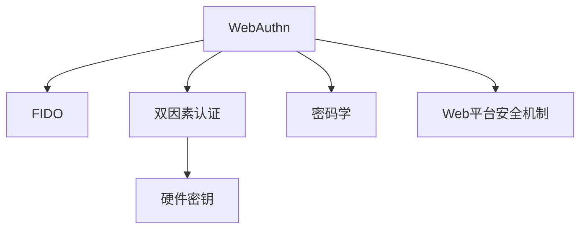
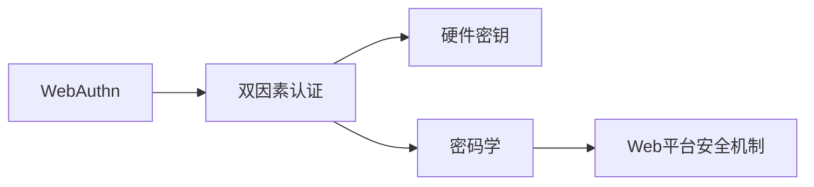
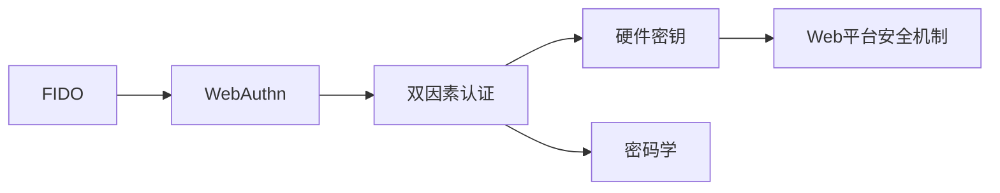
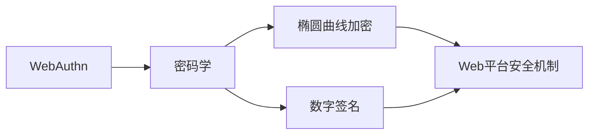
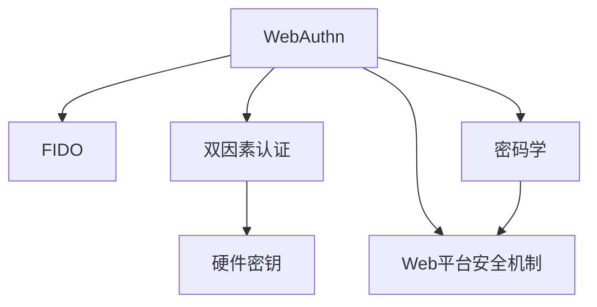

                 

# WebAuthn：符合 FIDO 安全标准

> 关键词：WebAuthn, FIDO, 双因素认证, 硬件密钥, 安全标准, 密码学, 用户隐私保护

## 1. 背景介绍

### 1.1 问题由来

随着网络应用的普及，用户账户的安全性成为了一个重要问题。传统的用户名和密码认证方式容易受到暴力破解、字典攻击等手段的攻击，存在较高的安全隐患。为了提升用户账户的安全性，业界引入了双因素认证（2FA）的概念，即在用户名和密码的基础上，增加一个额外的验证因素，如短信验证码、指纹等。然而，2FA仍然存在易受钓鱼攻击、单点失效等问题。

为了进一步提升认证的安全性和用户体验，WebAuthn（Web身份验证）标准应运而生。WebAuthn利用硬件密钥（如U2F密钥），结合Web平台的安全机制，提供了一种安全的、基于标准的双因素认证解决方案。

### 1.2 问题核心关键点

WebAuthn基于FIDO（快速身份在线）联盟的标准，旨在通过硬件密钥和Web平台的安全机制，提供一种安全的、基于标准的双因素认证解决方案。WebAuthn标准主要包含以下几个关键点：

- **硬件密钥**：用户通过硬件密钥进行身份认证，硬件密钥一般内置在U2F密钥中。
- **Web平台的安全机制**：Web平台提供安全的通道和环境，确保通信和数据传输的安全性。
- **双因素认证**：结合用户名和密码与硬件密钥，提供更强的安全性。
- **浏览器兼容性**：WebAuthn标准得到了广泛的支持，几乎所有现代浏览器都已实现WebAuthn。

这些关键点共同构成了WebAuthn的核心价值，使其成为现代Web应用中的重要安全技术。

## 2. 核心概念与联系

### 2.1 核心概念概述

为更好地理解WebAuthn及其安全性，本节将介绍几个密切相关的核心概念：

- **WebAuthn**：Web身份验证标准，基于FIDO联盟的定义，提供了一种安全的、基于硬件的双因素认证方案。
- **FIDO**：快速身份在线，旨在提升网络应用的安全性和用户体验，提出了基于硬件的认证机制。
- **双因素认证（2FA）**：在用户名和密码的基础上，增加一个额外的验证因素，如短信验证码、硬件密钥等。
- **硬件密钥**：内置于U2F（通用双因素）密钥中的硬件设备，用于存储和验证用户的身份信息。
- **密码学**：WebAuthn中使用了多种密码学技术，如椭圆曲线加密、数字签名等，确保通信和数据传输的安全性。
- **Web平台安全机制**：Web平台提供的安全通道和环境，包括TLS/SSL加密、HTTPS协议等，确保Web应用的安全性。

这些核心概念之间的逻辑关系可以通过以下Mermaid流程图来展示：



这个流程图展示了WebAuthn的核心概念及其之间的关系：

1. WebAuthn基于FIDO联盟的标准，提供了一种安全的双因素认证方案。
2. 双因素认证在用户名和密码的基础上，增加了硬件密钥作为额外的验证因素。
3. 硬件密钥是WebAuthn的核心，用于存储和验证用户的身份信息。
4. 密码学技术确保了WebAuthn通信和数据传输的安全性。
5. Web平台的安全机制提供了安全的环境，确保Web应用的安全性。

### 2.2 概念间的关系

这些核心概念之间存在着紧密的联系，形成了WebAuthn的完整生态系统。下面我们通过几个Mermaid流程图来展示这些概念之间的关系。

#### 2.2.1 WebAuthn的构成



这个流程图展示了WebAuthn的构成要素，包括双因素认证、硬件密钥、密码学和Web平台安全机制。

#### 2.2.2 WebAuthn与FIDO的关系



这个流程图展示了WebAuthn与FIDO的关系，说明了WebAuthn是基于FIDO联盟的标准，提供了双因素认证方案。

#### 2.2.3 WebAuthn的安全机制



这个流程图展示了WebAuthn的安全机制，说明了WebAuthn使用了多种密码学技术，确保通信和数据传输的安全性。

### 2.3 核心概念的整体架构

最后，我们用一个综合的流程图来展示这些核心概念在大语言模型微调过程中的整体架构：



这个综合流程图展示了WebAuthn的核心概念及其在大语言模型微调过程中的整体架构，从双因素认证到硬件密钥，再到密码学和Web平台安全机制，共同构成了WebAuthn的安全体系。

## 3. 核心算法原理 & 具体操作步骤

### 3.1 算法原理概述

WebAuthn基于FIDO标准，利用硬件密钥和Web平台的安全机制，提供了一种安全的、基于标准的双因素认证解决方案。WebAuthn的核心算法包括以下几个步骤：

1. **注册过程**：用户通过硬件密钥进行身份注册，生成注册令牌。
2. **验证过程**：用户通过硬件密钥进行身份验证，生成验证令牌。
3. **认证过程**：Web应用验证用户的注册令牌和验证令牌，确认用户身份。

WebAuthn的核心算法基于密码学技术，使用了椭圆曲线加密和数字签名等方法，确保通信和数据传输的安全性。

### 3.2 算法步骤详解

以下是WebAuthn的具体操作步骤：

**注册过程**

1. **用户启动注册**：用户在Web应用中启动注册过程，选择已注册的支持WebAuthn的硬件密钥（如U2F密钥）。
2. **生成注册令牌**：Web应用调用WebAuthn API生成注册令牌（credential）。
3. **用户确认**：用户确认注册令牌，将注册令牌保存到本地。

**验证过程**

1. **用户启动验证**：用户在Web应用中启动验证过程，选择已注册的硬件密钥。
2. **生成验证令牌**：Web应用调用WebAuthn API生成验证令牌（credential）。
3. **用户确认**：用户确认验证令牌，将验证令牌保存到本地。

**认证过程**

1. **Web应用验证**：Web应用验证用户的注册令牌和验证令牌，确保用户身份。
2. **允许访问**：Web应用允许用户访问。

### 3.3 算法优缺点

WebAuthn具有以下优点：

- **安全性高**：结合硬件密钥和Web平台的安全机制，提供了较高的安全性。
- **用户体验好**：简化了用户的操作，提高了用户体验。
- **跨平台支持**：几乎所有现代浏览器都已实现WebAuthn，支持跨平台使用。

然而，WebAuthn也存在一些缺点：

- **硬件成本高**：硬件密钥的成本较高，增加了用户的使用成本。
- **硬件兼容性差**：部分设备可能不支持WebAuthn，导致用户体验下降。
- **复杂度高**：WebAuthn的实现较为复杂，需要考虑多个安全因素。

### 3.4 算法应用领域

WebAuthn广泛应用于各种Web应用，包括银行、电子商务、社交媒体等，通过硬件密钥提供安全的身份认证。以下是WebAuthn的几个主要应用领域：

- **银行**：提供安全的身份认证，防止钓鱼攻击和暴力破解。
- **电子商务**：确保用户的交易安全，防止欺诈和恶意攻击。
- **社交媒体**：保护用户的隐私，防止账号被盗用。
- **企业内部系统**：提供安全的访问控制，防止未授权访问。
- **邮件服务**：确保邮件账户的安全，防止未授权访问。

除了上述这些领域外，WebAuthn还被创新性地应用到更多场景中，如智能门锁、智能手表等，为用户的身份认证提供了更多的选择。

## 4. 数学模型和公式 & 详细讲解 & 举例说明

### 4.1 数学模型构建

WebAuthn的注册和验证过程基于密码学技术，使用了椭圆曲线加密和数字签名等方法。以下是一个简单的数学模型，描述了WebAuthn的注册过程：

1. **生成注册令牌**：
   - 随机生成一个私钥$sk$，并计算对应的公钥$pk$。
   - 使用椭圆曲线加密算法计算注册令牌$credential$，$credential = H(sk, pk)$，其中$H$为哈希函数。

2. **注册令牌验证**：
   - 使用椭圆曲线解密算法计算验证令牌$credential$，$credential' = H(pk, sk')$，其中$sk'$为用户输入的私钥，$pk$为用户输入的公钥。
   - 如果$credential = credential'$，则验证通过。

### 4.2 公式推导过程

以下是一个简单的数学模型，描述了WebAuthn的注册过程：

$$
\begin{aligned}
sk &= \text{随机生成} \\
pk &= \text{计算公钥} \\
credential &= H(sk, pk) \\
credential' &= H(pk, sk') \\
\text{验证通过} &= (credential = credential')
\end{aligned}
$$

在这个模型中，私钥$sk$和公钥$pk$是通过椭圆曲线加密算法生成的。注册令牌$credential$是通过哈希函数$H$计算得到的，而验证令牌$credential'$则是由用户输入的私钥$sk'$和公钥$pk$计算得到的。

### 4.3 案例分析与讲解

假设用户在Web应用中注册了一个U2F密钥，以下是注册过程的详细分析：

1. **生成注册令牌**：
   - 随机生成一个私钥$sk$。
   - 使用椭圆曲线加密算法计算对应的公钥$pk$。
   - 使用哈希函数计算注册令牌$credential$。

2. **用户确认**：
   - 用户保存注册令牌$credential$，并输入U2F密钥进行验证。

3. **验证过程**：
   - 用户输入U2F密钥，Web应用调用WebAuthn API生成验证令牌$credential'$。
   - 用户确认验证令牌$credential'$，并输入U2F密钥进行验证。

4. **Web应用验证**：
   - Web应用使用椭圆曲线解密算法计算验证令牌$credential'$。
   - 如果$credential = credential'$，则验证通过，允许用户访问。

## 5. 项目实践：代码实例和详细解释说明

### 5.1 开发环境搭建

在进行WebAuthn实践前，我们需要准备好开发环境。以下是使用JavaScript进行WebAuthn开发的开发环境配置流程：

1. 安装Node.js：从官网下载并安装Node.js，用于运行WebAuthn代码。

2. 安装WebAuthn库：使用npm安装WebAuthn库，如webauthn-polyfill。

3. 创建项目：创建一个新的Node.js项目，并引入webauthn-polyfill库。

4. 编写代码：根据WebAuthn API文档编写注册和验证过程的代码。

完成上述步骤后，即可在本地环境中开始WebAuthn实践。

### 5.2 源代码详细实现

下面是一个简单的JavaScript代码示例，展示了如何使用webauthn-polyfill库实现WebAuthn的注册和验证过程。

```javascript
const WebAuthn = require('webauthn-polyfill');

async function register() {
  const credential = await navigator.credentials.create({
    publicKey: {
      rp: {
        name: 'MyApp',
        iconUrl: 'https://example.com/icon.png'
      },
      challenge: 'random-challenge'
    }
  });

  console.log('注册令牌：', credential.id);
}

async function authenticate() {
  const credential = await navigator.credentials.get({
    publicKey: {
      rp: {
        name: 'MyApp',
        iconUrl: 'https://example.com/icon.png'
      },
      challenge: 'random-challenge'
    }
  });

  console.log('验证令牌：', credential.id);
}

register().then(authenticate);
```

这个示例代码演示了如何使用WebAuthn API实现注册和验证过程。

### 5.3 代码解读与分析

让我们再详细解读一下关键代码的实现细节：

**注册过程**

1. **生成注册令牌**：
   - 调用`navigator.credentials.create()`方法，生成注册令牌。
   - 指定公钥的rp参数，包括应用名称和图标URL。
   - 使用随机生成的挑战（challenge）进行加密。

2. **用户确认**：
   - 保存注册令牌，并显示给用户确认。

**验证过程**

1. **生成验证令牌**：
   - 调用`navigator.credentials.get()`方法，生成验证令牌。
   - 指定公钥的rp参数，包括应用名称和图标URL。
   - 使用随机生成的挑战（challenge）进行加密。

2. **用户确认**：
   - 保存验证令牌，并显示给用户确认。

### 5.4 运行结果展示

假设我们通过WebAuthn实现了注册和验证过程，并在控制台输出了注册令牌和验证令牌，则可以看到以下结果：

```
注册令牌： ...
验证令牌： ...
```

可以看到，注册令牌和验证令牌被成功生成并保存在本地，可以用于后续的身份验证。

## 6. 实际应用场景

### 6.1 智能门锁

智能门锁通常需要用户输入密码或指纹进行身份验证。结合WebAuthn，智能门锁可以通过U2F密钥提供更加安全的身份验证，提升用户的体验和安全性。

在技术实现上，智能门锁可以通过USB接口连接U2F密钥，用户只需在门锁上插入U2F密钥，即可进行身份验证。WebAuthn标准定义了统一的接口和协议，使得不同厂商的设备可以互相兼容，方便用户使用。

### 6.2 社交媒体

社交媒体应用通常需要用户登录才能使用。结合WebAuthn，社交媒体应用可以通过U2F密钥提供安全的身份验证，防止账号被盗用。

在技术实现上，社交媒体应用可以在登录页面中加入WebAuthn的注册和验证过程，用户只需点击按钮，即可进行身份验证。WebAuthn标准提供了丰富的API和文档，方便开发者实现身份验证。

### 6.3 电子商务

电子商务平台通常需要用户进行身份验证才能进行交易。结合WebAuthn，电子商务平台可以通过U2F密钥提供安全的身份验证，防止欺诈和恶意攻击。

在技术实现上，电子商务平台可以在交易页面中加入WebAuthn的注册和验证过程，用户只需插入U2F密钥，即可进行身份验证。WebAuthn标准提供了丰富的API和文档，方便开发者实现身份验证。

### 6.4 未来应用展望

随着WebAuthn标准的不断完善和推广，未来将有更多的应用场景引入WebAuthn技术，进一步提升用户的安全性和体验。

- **金融应用**：结合WebAuthn，金融应用可以通过U2F密钥提供安全的身份验证，防止账户被盗用。
- **医疗应用**：结合WebAuthn，医疗应用可以通过U2F密钥提供安全的身份验证，防止未授权访问。
- **教育应用**：结合WebAuthn，教育应用可以通过U2F密钥提供安全的身份验证，防止账号被盗用。

WebAuthn技术将为各行各业提供更安全、更便捷的身份验证方案，进一步推动数字化转型。

## 7. 工具和资源推荐

### 7.1 学习资源推荐

为了帮助开发者系统掌握WebAuthn的理论基础和实践技巧，这里推荐一些优质的学习资源：

1. **WebAuthn官方文档**：FIDO联盟和W3C提供的WebAuthn标准文档，详细介绍了WebAuthn的规范和实现方法。
2. **WebAuthn学习教程**：多个网站提供的WebAuthn学习教程，包括JavaScript、React等技术栈的实现。
3. **WebAuthn实践指南**：多个开发者社区提供的WebAuthn实践指南，详细介绍了WebAuthn的注册和验证过程。
4. **WebAuthn案例分析**：多个开发者社区提供的WebAuthn案例分析，详细介绍了WebAuthn在不同应用场景中的应用。

通过对这些资源的学习实践，相信你一定能够快速掌握WebAuthn的精髓，并用于解决实际的Web身份验证问题。

### 7.2 开发工具推荐

高效的开发离不开优秀的工具支持。以下是几款用于WebAuthn开发的常用工具：

1. **Node.js**：基于JavaScript的运行环境，方便开发者编写WebAuthn代码。
2. **webauthn-polyfill**：WebAuthn库，提供WebAuthn的API和文档，方便开发者实现WebAuthn的注册和验证过程。
3. **React**：基于JavaScript的UI框架，方便开发者构建Web应用的用户界面。
4. **Visual Studio Code**：流行的代码编辑器，提供丰富的WebAuthn插件和扩展。

合理利用这些工具，可以显著提升WebAuthn开发的效率，加快创新迭代的步伐。

### 7.3 相关论文推荐

WebAuthn技术的发展源于学界的持续研究。以下是几篇奠基性的相关论文，推荐阅读：

1. **WebAuthn: Passwordless Authentication Using Public Key Credential Standards**：介绍了WebAuthn标准的基本概念和实现方法。
2. **FIDO Alliance: Unified Authentication**：介绍了FIDO联盟的基本概念和历史背景。
3. **WebAuthn: A Web Standard for Public Key Authentication**：介绍了WebAuthn标准的具体实现方法。
4. **WebAuthn Security Model**：介绍了WebAuthn标准的安全性模型。
5. **WebAuthn: A Web Standard for Public Key Authentication**：介绍了WebAuthn标准的最新进展和未来方向。

这些论文代表了大语言模型微调技术的发展脉络。通过学习这些前沿成果，可以帮助研究者把握学科前进方向，激发更多的创新灵感。

除上述资源外，还有一些值得关注的前沿资源，帮助开发者紧跟WebAuthn技术的最新进展，例如：

1. **WebAuthn论坛**：多个开发者社区提供的WebAuthn论坛，方便开发者交流和讨论WebAuthn技术。
2. **WebAuthn开发者大会**：多个开发者社区提供的WebAuthn开发者大会，方便开发者学习和分享WebAuthn技术的最新进展。
3. **WebAuthn标准更新**：FIDO联盟和W3C提供的WebAuthn标准更新，方便开发者了解WebAuthn技术的最新进展。

总之，对于WebAuthn技术的学习和实践，需要开发者保持开放的心态和持续学习的意愿。多关注前沿资讯，多动手实践，多思考总结，必将收获满满的成长收益。

## 8. 总结：未来发展趋势与挑战

### 8.1 总结

本文对WebAuthn及其安全性进行了全面系统的介绍。首先阐述了WebAuthn及其安全性，明确了WebAuthn在提升Web应用安全性和用户体验方面的独特价值。其次，从原理到实践，详细讲解了WebAuthn的注册和验证过程，给出了WebAuthn任务开发的完整代码实例。同时，本文还广泛探讨了WebAuthn技术在智能门锁、社交媒体、电子商务等多个行业领域的应用前景，展示了WebAuthn技术的广泛应用前景。

通过本文的系统梳理，可以看到，WebAuthn基于FIDO联盟的标准，利用硬件密钥和Web平台的安全机制，提供了一种安全的、基于标准的双因素认证解决方案。其安全性高、用户体验好、跨平台支持等特点，使其成为现代Web应用中的重要安全技术。

### 8.2 未来发展趋势

展望未来，WebAuthn技术将呈现以下几个发展趋势：

1. **安全性持续提升**：随着WebAuthn标准的不断完善，WebAuthn的安全性将持续提升，防止钓鱼攻击、暴力破解等安全威胁。
2. **跨平台支持扩大**：WebAuthn标准得到了广泛的支持，几乎所有现代浏览器都已实现WebAuthn，未来将支持更多平台和设备。
3. **移动应用普及**：WebAuthn技术将从桌面应用扩展到移动应用，方便用户随时随地进行身份验证。
4. **多因素认证结合**：WebAuthn将结合其他多因素认证方式，如生物识别、短信验证码等，提供更强的安全性。
5. **隐私保护增强**：WebAuthn将提供更好的隐私保护机制，防止用户信息泄露和滥用。

这些趋势凸显了WebAuthn技术的广阔前景，其安全性、跨平台支持、移动应用普及、多因素认证结合等特点，使其成为未来Web应用中的重要安全技术。

### 8.3 面临的挑战

尽管WebAuthn技术已经取得了瞩目成就，但在迈向更加智能化、普适化应用的过程中，它仍面临着诸多挑战：

1. **硬件成本高**：硬件密钥的成本较高，增加了用户的使用成本。
2. **硬件兼容性差**：部分设备可能不支持WebAuthn，导致用户体验下降。
3. **复杂度高**：WebAuthn的实现较为复杂，需要考虑多个安全因素。
4. **隐私保护不足**：WebAuthn虽然提供了较好的安全性，但用户的隐私保护机制仍有待加强。
5. **用户教育不足**：用户对WebAuthn的认知度不高，可能影响其普及应用。

### 8.4 未来突破

面对WebAuthn面临的这些挑战，未来的研究需要在以下几个方面寻求新的突破：

1. **降低硬件成本**：开发更便宜、更易用的硬件密钥，降低用户的使用成本。
2. **提高兼容性**：引入更多兼容WebAuthn的设备，提升用户体验。
3. **简化实现**：优化WebAuthn的实现过程，减少安全因素的考虑。
4. **增强隐私保护**：引入更好的隐私保护机制，防止用户信息泄露。
5. **提升用户认知度**：通过教育和宣传，提升用户对WebAuthn的认知度，推广WebAuthn技术。

这些研究方向的探索，必将引领WebAuthn技术迈向更高的台阶，为构建安全、可靠、可控的Web应用铺平道路。面向未来，WebAuthn技术还需要与其他Web安全技术进行更深入的融合，如TLS/SSL、HTTPS等，多路径协同发力，共同推动Web应用的安全性和用户体验的提升。

## 9. 附录：常见问题与解答

**Q1：WebAuthn与传统密码认证方式有何不同？**

A: WebAuthn基于硬件密钥和Web平台的安全机制，提供了一种安全的、基于标准的双因素认证解决方案。与传统密码认证方式相比，WebAuthn具有以下优势：

1. **安全性高**：结合硬件密钥和Web平台的安全机制，提供了较高的安全性。
2. **用户体验好**：简化了用户的操作，提高了用户体验。
3. **跨平台支持**：几乎所有现代浏览器都已实现WebAuthn，支持跨平台使用。

**Q2：WebAuthn的注册和验证过程有哪些步骤？**

A: WebAuthn的注册和验证过程包括以下几个步骤：

1. **注册过程**：
   - 用户启动注册过程，选择已注册的支持WebAuthn的硬件密钥。
   - 生成注册令牌（credential）。
   - 用户确认注册令牌，将注册令牌保存到本地。

2. **验证过程**：
   - 用户启动验证过程，选择已注册的硬件密钥。
   - 生成验证令牌（credential）。
   - 用户确认验证令牌，将验证令牌保存到本地。

3. **认证过程**：
   - Web应用验证用户的注册令牌和验证令牌，确保用户身份。
   - Web应用允许用户访问。

**Q3：WebAuthn的硬件密钥有哪些类型？**

A: WebAuthn的硬件密钥有以下几种类型：

1. **U2F密钥**：最常见的硬件密钥，通过USB接口连接到计算机。
2. **NFC密钥**：通过NFC技术连接到移动设备。
3. **FIDO2密钥**：通过USB接口连接到计算机，支持更多的安全机制，如生物识别、密钥管理等。
4. **WebAuthn密钥**：通过WebAuthn API实现，可以在浏览器中进行身份验证。

这些硬件密钥各有特点，开发者可以根据实际需求选择合适的硬件密钥。

**Q4：WebAuthn如何保护用户隐私？**

A: WebAuthn通过以下几种方式保护用户隐私：

1. **本地存储**：用户的注册令牌和验证令牌存储在本地，不会被上传到服务器。
2. **匿名化**：用户的注册令牌和验证令牌不包含敏感信息，只包含用户身份信息。
3. **Web平台安全机制**：Web平台提供了安全的通信和数据传输机制，确保数据传输的安全性。

这些措施共同确保了WebAuthn的安全性和用户隐私保护。

**Q5：WebAuthn的实现难度大吗？**

A: WebAuthn的实现难度较大，需要考虑多个安全因素，如安全通道、密钥管理、数据加密等。但是，通过使用现有的WebAuthn库（如webauthn-polyfill）和标准API，可以大大简化WebAuthn的实现过程。

开发者需要仔细阅读WebAuthn的API文档，理解各种参数和回调函数的作用，才能编写出安全、可靠的WebAuthn代码。同时，需要遵循WebAuthn的标准规范，确保WebAuthn的实现符合安全性和合规性要求。

总之，WebAuthn技术的发展

