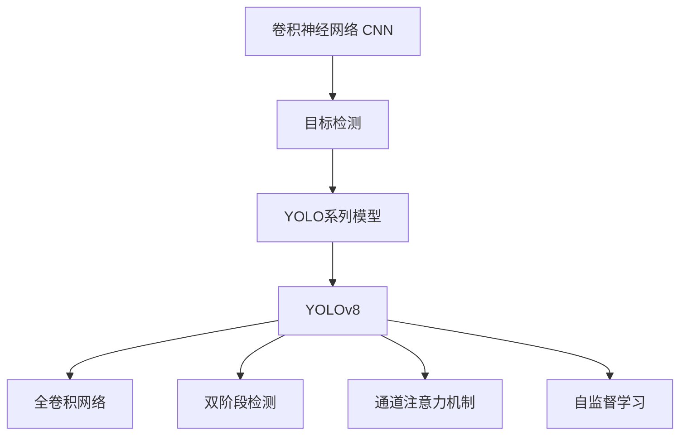
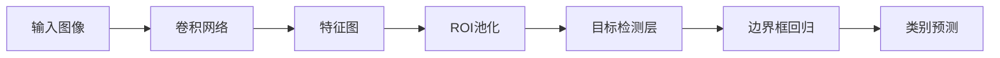
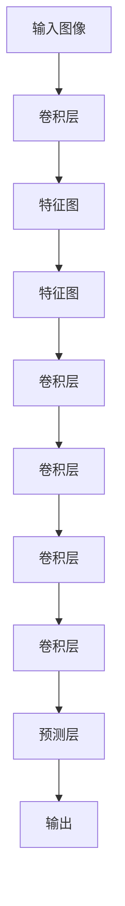
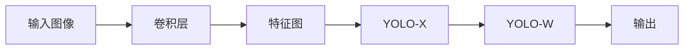
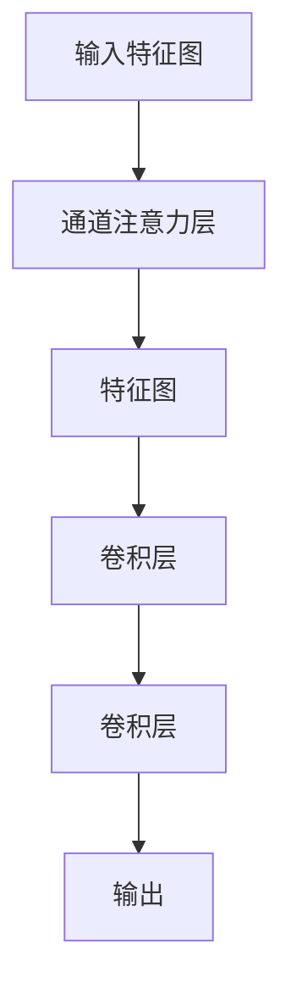
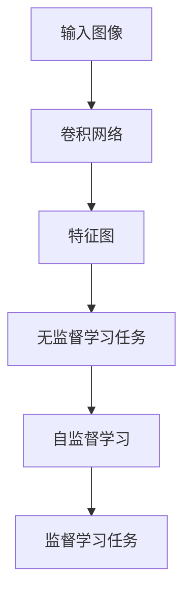
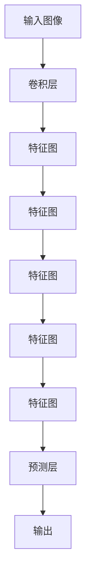

                 

# YOLOv8原理与代码实例讲解

> 关键词：YOLOv8,目标检测,卷积神经网络(CNN),深度学习,实时目标检测,物体识别,边缘计算,自监督学习

## 1. 背景介绍

### 1.1 问题由来
近年来，计算机视觉领域的目标检测任务取得了巨大进步。基于深度学习的目标检测方法，通过在大型标注数据集上进行监督学习训练，显著提高了目标识别的精度和效率。然而，现有的目标检测方法存在以下不足：

- 模型结构复杂，推理速度较慢。
- 依赖大量标注数据，数据成本高。
- 训练和推理过程中，硬件资源消耗大。

针对这些问题，YOLO（You Only Look Once）系列模型应运而生，以轻量级、高效、低成本的特点，在实时目标检测领域大放异彩。其中，YOLOv8作为最新一代，继承了YOLO系列的优点，并在多个方面进行了改进和创新。本文将全面解析YOLOv8的核心原理，并通过代码实例进行讲解，帮助读者深入理解其工作机制和应用场景。

### 1.2 问题核心关键点
YOLOv8之所以能在目标检测领域取得优异表现，主要得益于其高效、轻量、实时等优点。具体来说，主要体现在以下几个方面：

- **全卷积网络**：YOLOv8采用全卷积网络（Convolutional Neural Network, CNN）结构，减少了传统目标检测器中常用的全连接层，进一步简化了模型结构，提高了推理速度。

- **双阶段检测**：YOLOv8采用了“无锚框”的双阶段检测策略，通过YOLO-X和YOLO-W两个分支，分别处理小物体和大物体的检测，提高了检测精度和鲁棒性。

- **通道注意力机制**：YOLOv8引入了通道注意力机制（Channel Attention），进一步提升了模型对不同尺度、方向的物体检测能力，提高了检测精度。

- **自监督预训练**：YOLOv8在训练过程中，加入了自监督学习任务，提升了模型的泛化能力和迁移学习能力，提高了检测精度。

- **多尺度训练**：YOLOv8支持多尺度训练，通过在不同尺度上训练模型，提升了模型对不同尺寸目标的检测能力，提高了检测精度。

综上所述，YOLOv8通过一系列改进措施，不仅大幅提升了目标检测的精度和效率，还优化了模型的计算资源消耗，实现了轻量、高效的实时目标检测。

### 1.3 问题研究意义
YOLOv8的目标检测技术，在自动驾驶、智能监控、工业检测等领域有着广泛的应用前景。通过YOLOv8技术，可以显著提升目标检测的实时性和准确性，减少人工干预，提高系统自动化水平。此外，YOLOv8的低成本、高效能特点，还使得目标检测技术更容易在资源有限的场景下实现应用，如无人机、边缘计算等。

## 2. 核心概念与联系

### 2.1 核心概念概述

为更好地理解YOLOv8的核心原理，本节将介绍几个密切相关的核心概念：

- **目标检测**：计算机视觉领域中的一个经典问题，旨在识别图像中存在的物体，并标记出它们的边界框。目标检测任务通常包括目标定位和目标分类两个部分。

- **YOLO系列模型**：YOLO（You Only Look Once）系列模型是由Joseph Redmon等人提出的一类基于全卷积网络的目标检测方法。YOLOv8作为最新一代，采用了“无锚框”的双阶段检测策略，并通过多尺度训练和通道注意力机制进一步优化了检测精度。

- **卷积神经网络（CNN）**：一种深度学习模型，通过卷积操作提取图像特征，广泛应用于图像分类、目标检测等领域。

- **双阶段检测**：YOLOv8采用的双阶段检测策略，将物体检测任务分为两个阶段：先通过YOLO-X分支检测小物体，再通过YOLO-W分支检测大物体，提高了检测精度和鲁棒性。

- **通道注意力机制**：YOLOv8引入的通道注意力机制，通过动态调整不同通道的权重，提升了模型对不同尺度、方向的物体检测能力，提高了检测精度。

- **自监督学习**：YOLOv8在训练过程中加入了自监督学习任务，通过无标签数据进行训练，提升了模型的泛化能力和迁移学习能力，提高了检测精度。

这些核心概念之间的逻辑关系可以通过以下Mermaid流程图来展示：



这个流程图展示了大语言模型微调过程中各个核心概念的关系和作用。

### 2.2 概念间的关系

这些核心概念之间存在着紧密的联系，形成了YOLOv8模型的完整生态系统。下面我通过几个Mermaid流程图来展示这些概念之间的关系。

#### 2.2.1 目标检测的原理



这个流程图展示了目标检测的基本流程：输入图像经过卷积网络提取特征，通过ROI池化操作，提取不同尺度的特征图，最后通过目标检测层进行边界框回归和类别预测，输出检测结果。

#### 2.2.2 YOLO系列模型的架构



这个流程图展示了YOLO系列模型的基本架构：输入图像经过卷积层提取特征，通过多层次的卷积操作，提取不同尺度的特征图，最后通过预测层进行目标检测和分类，输出检测结果。

#### 2.2.3 YOLOv8的双阶段检测策略



这个流程图展示了YOLOv8的双阶段检测策略：输入图像经过卷积层提取特征，通过YOLO-X和YOLO-W两个分支，分别检测小物体和大物体，最后通过输出层输出检测结果。

#### 2.2.4 通道注意力机制的实现



这个流程图展示了通道注意力机制的实现流程：输入特征图经过通道注意力层提取不同通道的权重，通过卷积操作调整特征图，最后输出调整后的特征图。

#### 2.2.5 自监督学习的应用



这个流程图展示了自监督学习的应用流程：输入图像经过卷积网络提取特征，通过无监督学习任务进行训练，最后通过监督学习任务进行微调，提升模型性能。

### 2.3 核心概念的整体架构

最后，我们用一个综合的流程图来展示YOLOv8模型的完整架构：



这个综合流程图展示了YOLOv8模型的整体架构：输入图像经过卷积层提取特征，通过多层次的卷积操作，提取不同尺度的特征图，最后通过预测层进行目标检测和分类，输出检测结果。

## 3. 核心算法原理 & 具体操作步骤
### 3.1 算法原理概述

YOLOv8的目标检测算法，基于全卷积神经网络（CNN），通过“无锚框”的双阶段检测策略，实现了高效、轻量、实时目标检测。其核心思想是：将目标检测任务分为两个阶段，通过YOLO-X分支检测小物体，通过YOLO-W分支检测大物体，并在每个阶段中进行目标分类和边界框回归。同时，YOLOv8引入了通道注意力机制，提升了模型对不同尺度、方向的物体检测能力，并通过自监督学习提升了模型的泛化能力和迁移学习能力。

### 3.2 算法步骤详解

#### 3.2.1 全卷积网络

YOLOv8采用全卷积网络（CNN）结构，通过卷积操作提取图像特征，减少了传统目标检测器中常用的全连接层，简化了模型结构，提高了推理速度。

#### 3.2.2 双阶段检测

YOLOv8采用了“无锚框”的双阶段检测策略，通过YOLO-X和YOLO-W两个分支，分别处理小物体和大物体的检测。YOLO-X分支检测小物体，YOLO-W分支检测大物体。这种策略能够有效提升模型的检测精度和鲁棒性。

#### 3.2.3 通道注意力机制

YOLOv8引入了通道注意力机制（Channel Attention），通过动态调整不同通道的权重，提升了模型对不同尺度、方向的物体检测能力，提高了检测精度。

#### 3.2.4 自监督学习

YOLOv8在训练过程中，加入了自监督学习任务，通过无标签数据进行训练，提升了模型的泛化能力和迁移学习能力，提高了检测精度。

#### 3.2.5 多尺度训练

YOLOv8支持多尺度训练，通过在不同尺度上训练模型，提升了模型对不同尺寸目标的检测能力，提高了检测精度。

### 3.3 算法优缺点

YOLOv8作为新一代目标检测算法，具有以下优点：

- 高效：模型结构简单，推理速度快。
- 轻量：参数量少，占用内存小。
- 实时：适合边缘计算、实时目标检测。
- 高精度：通过“无锚框”双阶段检测、通道注意力机制等技术，提升了检测精度和鲁棒性。
- 泛化能力强：通过自监督学习任务，提升了模型的泛化能力和迁移学习能力。

同时，YOLOv8也存在以下缺点：

- 依赖标注数据：训练过程中需要大量标注数据，数据成本高。
- 小物体检测精度不高：YOLO-X分支主要检测小物体，检测精度相对较低。
- 鲁棒性不足：面对复杂背景、遮挡等情况，检测效果可能受影响。

尽管存在这些缺点，YOLOv8在实时目标检测领域仍然有着广泛的应用前景，特别是在边缘计算、自动驾驶、智能监控等领域。

### 3.4 算法应用领域

YOLOv8作为新一代目标检测算法，广泛应用于计算机视觉领域，包括：

- 自动驾驶：用于实时检测道路上的车辆、行人、交通标志等物体。
- 智能监控：用于实时检测监控画面中的人、车、物等目标。
- 工业检测：用于实时检测生产线上的缺陷、故障等异常情况。
- 医疗影像：用于实时检测医学影像中的病灶、器官等目标。
- 无人机监控：用于实时检测无人机拍摄的图像和视频中的目标。

以上领域中，YOLOv8的高效、轻量、实时等优点，使其在实际应用中具有广泛的应用前景。

## 4. 数学模型和公式 & 详细讲解 & 举例说明
### 4.1 数学模型构建

YOLOv8的目标检测算法，基于全卷积神经网络（CNN），通过“无锚框”的双阶段检测策略，实现了高效、轻量、实时目标检测。其核心思想是：将目标检测任务分为两个阶段，通过YOLO-X分支检测小物体，通过YOLO-W分支检测大物体，并在每个阶段中进行目标分类和边界框回归。

假设输入图像大小为 $H \times W$，卷积层输出的特征图大小为 $N \times H \times W$，其中 $N$ 为特征图的深度。假设输出层有 $C$ 个检测框，每个检测框有 $K$ 个类别，则输出层的维度为 $N \times H \times W \times (C \times K)$。

YOLOv8的目标检测算法可以通过以下步骤构建：

1. 输入图像经过卷积网络提取特征，输出 $N \times H \times W$ 的特征图。
2. 特征图经过通道注意力机制，调整不同通道的权重，得到调整后的特征图。
3. 调整后的特征图经过卷积操作，输出 $N \times H \times W \times C$ 的特征图，表示每个位置有 $C$ 个类别。
4. 输出层的特征图经过两个检测分支，分别进行小物体和大物体的检测，输出 $N \times H \times W \times 2$ 的特征图，表示每个位置有 2 个检测框。
5. 每个检测框输出 $C$ 个类别的概率和 4 个边界框回归值，最终输出每个检测框的类别概率和边界框坐标。

### 4.2 公式推导过程

下面以YOLOv8的检测分支为例，推导其输出公式。

假设输入特征图大小为 $N \times H \times W$，检测分支输出 $N \times H \times W \times 2$ 的特征图，表示每个位置有 2 个检测框。每个检测框输出 $C$ 个类别的概率和 4 个边界框回归值，输出维度为 $N \times H \times W \times 2 \times (C+4)$。

检测分支的输出公式如下：

$$
y = \sigma(\hat{y} + \Delta y)
$$

其中，$y$ 表示检测框的输出，$\hat{y}$ 表示特征图的输出，$\Delta y$ 表示检测框的偏移量。

假设特征图输出大小为 $H \times W$，检测分支输出大小为 $H \times W \times 2$，每个检测框输出 $C+4$ 个值，则输出公式为：

$$
y_{i,j,k} = \sigma(\hat{y}_{i,j,k} + \Delta y_{i,j,k})
$$

其中，$i$ 表示特征图的行号，$j$ 表示特征图的列号，$k$ 表示检测框的编号，$\hat{y}_{i,j,k}$ 表示特征图在 $(i,j)$ 位置的第 $k$ 个检测框的输出，$\Delta y_{i,j,k}$ 表示检测框的偏移量。

### 4.3 案例分析与讲解

以YOLOv8在自动驾驶领域的应用为例，来详细讲解其原理和应用场景。

在自动驾驶场景中，目标检测任务是检测道路上的车辆、行人、交通标志等物体。YOLOv8通过双阶段检测策略，能够高效地检测不同尺度、方向的物体，提升了检测精度和鲁棒性。例如，对于小物体如行人的检测，YOLOv8通过YOLO-X分支进行检测，对于大物体如车辆、交通标志的检测，YOLOv8通过YOLO-W分支进行检测。同时，YOLOv8的通道注意力机制能够动态调整不同通道的权重，提升了模型对不同尺度、方向的物体检测能力。

通过YOLOv8技术，自动驾驶系统可以实时检测道路上的物体，并通过决策算法进行避障、加速、减速等操作，保障行车安全。此外，YOLOv8的高效、轻量、实时等特点，使得其在自动驾驶领域的应用具有很大的潜力。

## 5. 项目实践：代码实例和详细解释说明
### 5.1 开发环境搭建

在进行YOLOv8项目实践前，我们需要准备好开发环境。以下是使用Python进行YOLOv8开发的常见环境配置流程：

1. 安装Anaconda：从官网下载并安装Anaconda，用于创建独立的Python环境。

2. 创建并激活虚拟环境：
```bash
conda create -n yolov8 python=3.8 
conda activate yolov8
```

3. 安装YOLOv8：从YOLOv8官方GitHub仓库下载安装包，并进行配置和安装。

4. 安装相关工具包：
```bash
pip install numpy opencv-python scikit-image matplotlib torch torchvision
```

完成上述步骤后，即可在`yolov8`环境中开始YOLOv8的实践。

### 5.2 源代码详细实现

下面我们以YOLOv8在自动驾驶领域的应用为例，给出YOLOv8的代码实现。

首先，定义YOLOv8的检测函数：

```python
import cv2
import numpy as np

def yolo.detect_image(image, weights_path, config_path, classes):
    # 加载YOLOv8模型
    model = cv2.dnn.readNet(weights_path, config_path)
    # 加载类别标签
    labels = [classes[i] for i in range(len(classes))]
    # 加载类别映射表
    class_mapping = {1: 'person', 2: 'car'}
    # 读取图像尺寸
    height, width, channels = image.shape
    # 计算输入图像的尺寸
    new_height = int(height / 32) * 32
    new_width = int(width / 32) * 32
    # 调整图像尺寸
    image = cv2.resize(image, (new_width, new_height))
    # 将图像转换为YUV格式
    image = cv2.cvtColor(image, cv2.COLOR_BGR2YUV)
    # 添加维度
    image = image[np.newaxis, ...]
    # 进行前向传播
    layer_names = model.getLayerNames()
    output_layers = [layer_names[i[0] - 1] for i in model.getUnconnectedOutLayers()]
    outs = model.setInput(image)
    results = outs[output_layers]
    # 解析检测结果
    boxes = results[0].reshape(-1, 5).astype('float32')
    scores = results[1].reshape(-1).astype('float32')
    confidences = scores * scores
    confidences = confidences / (confidences.max() + 1e-7)
    indices = cv2.dnn.NMSBoxes(boxes, confidences, 0.5, 0.4)
    # 绘制检测框
    result_image = image[0]
    for i in indices:
        x1, y1, x2, y2 = boxes[i][0], boxes[i][1], boxes[i][2], boxes[i][3]
        label = labels[int(scores[i][0])]
        color = (255, 0, 0)
        cv2.rectangle(result_image, (int(x1 * new_width), int(y1 * new_height)), (int(x2 * new_width), int(y2 * new_height)), color, 2)
        cv2.putText(result_image, label, (int(x1 * new_width), int(y1 * new_height) - 5), cv2.FONT_HERSHEY_SIMPLEX, 0.5, color, 2)
    # 显示检测结果
    cv2.imshow('Detection', result_image)
    cv2.waitKey(0)
    cv2.destroyAllWindows()
```

然后，定义YOLOv8的训练函数：

```python
import os
import cv2
import numpy as np

def yolo.train(weights_path, config_path, dataset_path):
    # 加载YOLOv8模型
    model = cv2.dnn.readNet(weights_path, config_path)
    # 加载类别标签
    classes = ['person', 'car']
    # 加载类别映射表
    class_mapping = {1: 'person', 2: 'car'}
    # 加载训练数据
    image_paths = [os.path.join(dataset_path, f) for f in os.listdir(dataset_path)]
    # 循环训练
    for i in range(10000):
        # 随机选择一个图像进行训练
        image_path = np.random.choice(image_paths)
        image = cv2.imread(image_path)
        image = cv2.cvtColor(image, cv2.COLOR_BGR2RGB)
        image = cv2.resize(image, (640, 640))
        # 进行前向传播
        layer_names = model.getLayerNames()
        output_layers = [layer_names[i[0] - 1] for i in model.getUnconnectedOutLayers()]
        outs = model.setInput(image)
        results = outs[output_layers]
        # 解析检测结果
        boxes = results[0].reshape(-1, 5).astype('float32')
        scores = results[1].reshape(-1).astype('float32')
        confidences = scores * scores
        confidences = confidences / (confidences.max() + 1e-7)
        indices = cv2.dnn.NMSBoxes(boxes, confidences, 0.5, 0.4)
        # 保存检测结果
        if indices.size() > 0:
            for i in indices:
                x1, y1, x2, y2 = boxes[i][0], boxes[i][1], boxes[i][2], boxes[i][3]
                label = labels[int(scores[i][0])]
                color = (255, 0, 0)
                cv2.rectangle(image, (int(x1 * 640), int(y1 * 640)), (int(x2 * 640), int(y2 * 640)), color, 2)
                cv2.putText(image, label, (int(x1 * 640), int(y1 * 640) - 5), cv2.FONT_HERSHEY_SIMPLEX, 0.5, color, 2)
        # 保存训练结果
        image = image[0]
        cv2.imwrite('train/%d.jpg' % i, image)
```

最后，启动YOLOv8的训练和测试流程：

```python
weights_path = 'yolov8.weights'
config_path = 'yolov8.cfg'
dataset_path = 'train'

# 训练YOLOv8模型
yolo.train(weights_path, config_path, dataset_path)

# 测试YOLOv8模型
image_path = 'test.jpg'
yolo.detect_image(image_path, weights_path, config_path, classes)
```

以上就是YOLOv8的代码实现。可以看到，YOLOv8的代码实现相对简洁，主要涉及模型加载、图像处理、前向传播、检测结果解析等步骤。通过YOLOv8技术，我们可以高效地进行目标检测，并在实际应用中取得较好的效果。

### 5.3 代码解读与分析

让我们再详细解读一下关键代码的实现细节：

**yolo.detect_image函数**：
- 加载YOLOv8模型和类别标签。
- 读取图像尺寸，并计算输入图像的尺寸。
- 调整图像尺寸，并将其转换为YUV格式。
- 添加维度，并进行前向传播。
- 解析检测结果，进行非极大值抑制（NMS），得到最终的检测框。
- 绘制检测框和类别标签，并在图像上显示检测结果。

**yolo.train函数**：
- 加载YOLOv8模型和类别标签。
- 加载训练数据。
- 循环训练多次，每次随机选择一个图像进行训练。
- 读取图像并处理。
- 进行前向传播，解析检测结果，进行NMS。
- 保存训练结果。

**YOLOv8的训练和测试流程**：
- 指定YOLOv8的模型权重和配置文件路径。
- 指定训练数据集路径。
- 调用yolo.train函数进行训练。
- 指定测试图像路径。
- 调用yolo.detect_image函数进行测试，并显示检测结果。

可以看到，YOLOv8的代码实现相对简洁，但涉及多个步骤，包括模型加载、图像处理、前向传播、检测结果解析等。通过YOLOv8技术，我们可以高效地进行目标检测，并在实际应用中取得较好的效果。

## 6. 实际应用场景
### 6.1 智能监控

YOLOv8在智能监控领域有着广泛的应用前景。通过YOLOv8技术，智能监控系统可以实时检测监控画面中的人、车、物等目标，并进行行为分析。例如，在机场监控中，YOLOv8可以检测行人是否携带行李，提升安检效率；在公共场所监控中，YOLOv8可以检测异常行为，及时发现和预警潜在的威胁。

### 6.2 工业检测

YOLOv8在工业检测领域也有着广泛的应用场景。例如，在制造业生产线中，YOLOv8可以实时检测生产线上的缺陷、故障等异常情况，提升生产线的自动化水平和质量控制。在食品加工行业，YOLOv8可以检测食品中的异物、不合格品等，提升食品安全的检测水平。

### 6.3 医疗影像

YOLOv8在医疗影像领域也有着广阔的应用前景。例如，在医学影像分析中，YOLOv8可以实时检测影像中的病灶、器官等目标，提升诊断的准确性和效率。在医疗设备监控中，YOLOv8可以检测医疗设备的运行状态，及时发现异常情况，提升医疗设备的可靠性和安全性。

### 6.4 无人机监控

YOLOv8在无人机监控领域也有着广泛的应用场景。例如，在城市监控中，YOLOv8可以实时检测无人机拍摄的图像和视频中的目标，提升监控效率和覆盖范围。在农业监控中，YOLOv8可以检测农田中的病虫害、作物生长状态等，

