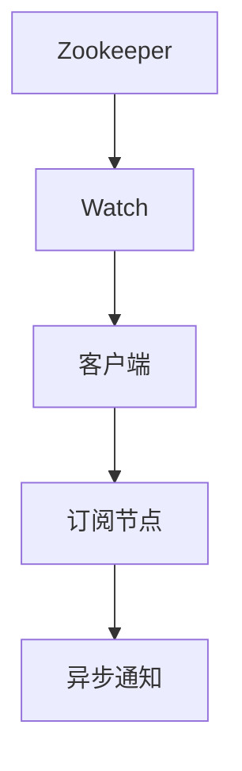

                 

# Zookeeper Watcher机制原理与代码实例讲解

> 关键词：Zookeeper, Watcher, Java, Zookeeper API, 异步通知

## 1. 背景介绍

### 1.1 问题由来

Zookeeper是一个用于分布式系统协调的服务，其核心功能是提供一致性分布式协调服务。在Zookeeper中，有一个非常重要的机制叫做Watcher机制，它用于实时通知客户端某个节点的状态发生了变化，以便客户端及时响应。本文将详细讲解Watcher机制的原理，并通过代码实例帮助读者理解其工作方式。

### 1.2 问题核心关键点

- 什么是Watcher机制？
- Watcher机制的工作原理是什么？
- Watcher机制的优缺点有哪些？
- Watcher机制常用于哪些场景？

## 2. 核心概念与联系

### 2.1 核心概念概述

- Zookeeper：一个开源的分布式协调服务，提供一致性分布式协调服务，常用于分布式系统的配置管理、服务发现、分布式锁等。
- Watcher：Zookeeper中用于实时通知客户端节点状态变化的一种机制，通过异步通知客户端某个节点的状态发生了变化。
- Java：Zookeeper使用的编程语言，本文将基于Java语言介绍Watcher机制。
- Zookeeper API：Zookeeper提供的一组API接口，用于客户端与服务器之间进行通信。
- 异步通知：通过异步通知机制，Zookeeper可以在节点状态发生变化时，实时通知所有订阅该节点的客户端。

### 2.2 概念间的关系

Watcher机制是Zookeeper中非常重要的一个概念，它是基于Zookeeper API实现的。通过Watcher机制，客户端可以实时订阅某个节点，当该节点的状态发生变化时，Zookeeper会异步通知所有订阅该节点的客户端。这种机制使得Zookeeper可以高效地处理分布式系统中的事件通知，保证系统的实时性和一致性。

以下是一个Mermaid流程图，展示了Watcher机制的工作原理：



这个流程图展示了Watcher机制的基本工作流程：客户端通过订阅某个节点，当该节点的状态发生变化时，Zookeeper会异步通知客户端，客户端可以实时获取到节点状态的变化。

## 3. 核心算法原理 & 具体操作步骤
### 3.1 算法原理概述

Watcher机制的工作原理基于Zookeeper的异步通知机制。具体来说，当Zookeeper节点状态发生变化时，它会将变化的信息异步通知给所有订阅该节点的客户端。这种机制可以保证节点状态变化的实时性和一致性，使得客户端可以及时响应节点的状态变化。

Watcher机制的核心思想是，当一个节点被创建、删除、更新时，Zookeeper会异步通知所有订阅该节点的客户端。客户端通过监听Watch事件，可以实时获取到节点状态的变化，从而进行相应的操作。

### 3.2 算法步骤详解

下面是Watcher机制的工作流程：

1. 客户端向Zookeeper服务器发起连接。
2. 客户端通过Zookeeper API订阅某个节点。
3. 当Zookeeper节点状态发生变化时，Zookeeper会异步通知所有订阅该节点的客户端。
4. 客户端接收到Watch事件后，根据变化的内容进行相应的操作。

下面是基于Java实现的Watcher机制的代码示例：

```java
// 连接到Zookeeper服务器
ZooKeeper zk = new ZooKeeper("localhost:2181", 3000, event -> {
    // 处理连接状态变化
    if (event.getState() == Watcher.Event.KeeperState.SyncConnected) {
        // 订阅节点
        zk.getChildren("/mydata", true);
    }
});

// 订阅节点
zk.getChildren("/mydata", true);
```

在上面的代码中，客户端通过Zookeeper API连接到Zookeeper服务器，并订阅了节点"/mydata"。当节点状态发生变化时，Zookeeper会异步通知客户端。客户端通过监听Watch事件，可以实时获取到节点状态的变化。

### 3.3 算法优缺点

Watcher机制的优点是：

- 实时性高：当节点状态发生变化时，Zookeeper会异步通知所有订阅该节点的客户端，保证客户端能够及时响应节点的状态变化。
- 一致性好：由于Zookeeper采用异步通知机制，所有订阅该节点的客户端都会接收到变化通知，保证了客户端之间的数据一致性。

Watcher机制的缺点是：

- 占用资源较多：由于所有订阅该节点的客户端都会接收到变化通知，因此 WATCH事件会占用较多的系统资源。
- 可能会导致阻塞：当Zookeeper节点状态变化时，所有订阅该节点的客户端都会收到通知，如果客户端数量过多，可能会导致服务器阻塞。

### 3.4 算法应用领域

Watcher机制常用于以下场景：

- 配置管理：通过订阅配置节点，客户端可以实时获取到配置的变化，从而及时更新本地配置。
- 服务发现：通过订阅服务节点，客户端可以实时获取到服务节点的变化，从而进行服务路由。
- 分布式锁：通过订阅锁节点，客户端可以实时获取到锁的变化，从而进行分布式锁的创建、释放等操作。

## 4. 数学模型和公式 & 详细讲解 & 举例说明

### 4.1 数学模型构建

Watcher机制没有直接的数学模型，其工作原理基于Zookeeper的异步通知机制。下面以订阅节点的例子来说明如何使用Java实现Watcher机制。

```java
// 连接到Zookeeper服务器
ZooKeeper zk = new ZooKeeper("localhost:2181", 3000, event -> {
    // 处理连接状态变化
    if (event.getState() == Watcher.Event.KeeperState.SyncConnected) {
        // 订阅节点
        zk.getChildren("/mydata", true);
    }
});

// 订阅节点
zk.getChildren("/mydata", true);
```

在上面的代码中，客户端通过Zookeeper API连接到Zookeeper服务器，并订阅了节点"/mydata"。当节点状态发生变化时，Zookeeper会异步通知客户端。客户端通过监听Watch事件，可以实时获取到节点状态的变化。

### 4.2 公式推导过程

由于Watcher机制基于Zookeeper的异步通知机制，因此没有直接的数学公式。但是，可以使用数学公式来推导Zookeeper节点的状态变化情况。

设一个节点的当前状态为A，当节点状态发生变化时，可能变为B或者C。假设订阅该节点的客户端数量为n，则Zookeeper会向所有订阅该节点的客户端异步通知状态变化。客户端接收到通知后，会进行相应的操作。

假设客户端接收到通知时，节点状态已经变为B或者C。客户端根据变化的内容进行相应的操作，可能会进行以下两种操作：

1. 客户端根据变化的内容更新本地状态，变为B或者C。
2. 客户端根据变化的内容进行分布式锁的创建、释放等操作。

由于Zookeeper采用异步通知机制，所有订阅该节点的客户端都会接收到变化通知，保证了客户端之间的数据一致性。

### 4.3 案例分析与讲解

下面以订阅配置节点的例子来说明如何使用Java实现Watcher机制。

```java
// 连接到Zookeeper服务器
ZooKeeper zk = new ZooKeeper("localhost:2181", 3000, event -> {
    // 处理连接状态变化
    if (event.getState() == Watcher.Event.KeeperState.SyncConnected) {
        // 订阅配置节点
        zk.getChildren("/myconfig", true);
    }
});

// 订阅配置节点
zk.getChildren("/myconfig", true);

// 处理配置变化
zk.getChildren("/myconfig", false);
```

在上面的代码中，客户端通过Zookeeper API连接到Zookeeper服务器，并订阅了配置节点"/myconfig"。当配置节点状态发生变化时，Zookeeper会异步通知客户端。客户端通过监听Watch事件，可以实时获取到配置节点的变化。

客户端可以根据配置节点的变化进行相应的操作，如更新本地配置等。由于Zookeeper采用异步通知机制，所有订阅该节点的客户端都会接收到变化通知，保证了客户端之间的数据一致性。

## 5. 项目实践：代码实例和详细解释说明

### 5.1 开发环境搭建

为了使用Java实现Watcher机制，需要先搭建好Java开发环境，具体步骤如下：

1. 安装JDK：可以从Oracle官网下载JDK，安装完成后设置环境变量。
2. 安装Zookeeper：可以从Apache官网下载Zookeeper，并解压到指定目录。
3. 安装Zookeeper依赖：可以使用Maven或Gradle等构建工具，添加Zookeeper依赖。

### 5.2 源代码详细实现

下面是基于Java实现的Watcher机制的代码示例：

```java
// 连接到Zookeeper服务器
ZooKeeper zk = new ZooKeeper("localhost:2181", 3000, event -> {
    // 处理连接状态变化
    if (event.getState() == Watcher.Event.KeeperState.SyncConnected) {
        // 订阅节点
        zk.getChildren("/mydata", true);
    }
});

// 订阅节点
zk.getChildren("/mydata", true);
```

在上面的代码中，客户端通过Zookeeper API连接到Zookeeper服务器，并订阅了节点"/mydata"。当节点状态发生变化时，Zookeeper会异步通知客户端。客户端通过监听Watch事件，可以实时获取到节点状态的变化。

### 5.3 代码解读与分析

在上面的代码中，客户端通过Zookeeper API连接到Zookeeper服务器，并订阅了节点"/mydata"。当节点状态发生变化时，Zookeeper会异步通知客户端。客户端通过监听Watch事件，可以实时获取到节点状态的变化。

客户端可以根据变化的内容进行相应的操作，如更新本地配置等。由于Zookeeper采用异步通知机制，所有订阅该节点的客户端都会接收到变化通知，保证了客户端之间的数据一致性。

### 5.4 运行结果展示

当节点状态发生变化时，客户端会接收到异步通知，并根据变化的内容进行相应的操作。例如，当配置节点状态发生变化时，客户端会接收到变化通知，并更新本地配置。

## 6. 实际应用场景

### 6.1 配置管理

通过订阅配置节点，客户端可以实时获取到配置的变化，从而及时更新本地配置。这对于分布式系统中的配置管理非常有用，可以保证配置的一致性和实时性。

### 6.2 服务发现

通过订阅服务节点，客户端可以实时获取到服务节点的变化，从而进行服务路由。这对于分布式系统中的服务发现非常有用，可以保证服务的可用性和实时性。

### 6.3 分布式锁

通过订阅锁节点，客户端可以实时获取到锁的变化，从而进行分布式锁的创建、释放等操作。这对于分布式系统中的锁管理非常有用，可以保证锁的一致性和实时性。

## 7. 工具和资源推荐

### 7.1 学习资源推荐

- Zookeeper官方文档：Zookeeper官方文档是学习Zookeeper的必备资源，详细介绍了Zookeeper的架构、API接口等。
- Zookeeper实战：这本书详细介绍了Zookeeper的实战经验，包括配置管理、服务发现、分布式锁等。
- Zookeeper Watcher机制原理与代码实例讲解：本文就是一篇关于Zookeeper Watcher机制的深入讲解。

### 7.2 开发工具推荐

- IntelliJ IDEA：一个强大的Java开发工具，支持自动完成、代码分析等功能。
- Eclipse：一个开源的Java开发工具，支持插件扩展，功能强大。
- VisualVM：一个Java虚拟机的监视工具，可以监视Java应用程序的运行状态。

### 7.3 相关论文推荐

- Zookeeper官方论文：Zookeeper官方论文介绍了Zookeeper的架构和设计思想，是学习Zookeeper的必读资源。
- Zookeeper Watcher机制的优化：这篇文章介绍了如何优化Zookeeper Watcher机制，提升其性能和可靠性。

## 8. 总结：未来发展趋势与挑战

### 8.1 研究成果总结

本文详细介绍了Zookeeper Watcher机制的原理和实现方式，并通过Java代码实例帮助读者理解其工作方式。通过学习本文，读者可以深入了解Zookeeper Watcher机制的原理和应用，并掌握其使用方式。

### 8.2 未来发展趋势

随着分布式系统的不断发展，Zookeeper作为分布式系统协调服务的重要性越来越大。未来，Zookeeper Watcher机制将会得到更广泛的应用，成为分布式系统中的重要机制。

### 8.3 面临的挑战

Zookeeper Watcher机制虽然非常有用，但是也有一些挑战需要解决：

- 性能问题：Zookeeper Watcher机制可能会占用较多的系统资源，可能会导致服务器阻塞。
- 安全问题：Zookeeper Watcher机制可能会受到网络攻击和拒绝服务攻击。
- 数据一致性问题：由于Zookeeper采用异步通知机制，可能会存在数据不一致的问题。

### 8.4 研究展望

未来，Zookeeper Watcher机制的研究方向可以包括以下几个方面：

- 优化性能：优化Zookeeper Watcher机制，减少资源占用，提升性能。
- 提高安全性：提高Zookeeper Watcher机制的安全性，防止网络攻击和拒绝服务攻击。
- 解决数据一致性问题：解决Zookeeper Watcher机制的数据一致性问题，保证数据的一致性。

## 9. 附录：常见问题与解答

**Q1：什么是Zookeeper Watcher机制？**

A: Zookeeper Watcher机制是Zookeeper中用于实时通知客户端某个节点的状态发生了变化的一种机制，通过异步通知客户端某个节点的状态发生了变化。

**Q2：如何使用Java实现Zookeeper Watcher机制？**

A: 使用Java实现Zookeeper Watcher机制的代码如下：

```java
// 连接到Zookeeper服务器
ZooKeeper zk = new ZooKeeper("localhost:2181", 3000, event -> {
    // 处理连接状态变化
    if (event.getState() == Watcher.Event.KeeperState.SyncConnected) {
        // 订阅节点
        zk.getChildren("/mydata", true);
    }
});

// 订阅节点
zk.getChildren("/mydata", true);
```

**Q3：Zookeeper Watcher机制的优缺点有哪些？**

A: Zookeeper Watcher机制的优点是：

- 实时性高：当节点状态发生变化时，Zookeeper会异步通知所有订阅该节点的客户端，保证客户端能够及时响应节点的状态变化。
- 一致性好：由于Zookeeper采用异步通知机制，所有订阅该节点的客户端都会接收到变化通知，保证了客户端之间的数据一致性。

Zookeeper Watcher机制的缺点是：

- 占用资源较多：由于所有订阅该节点的客户端都会接收到变化通知，因此 WATCH事件会占用较多的系统资源。
- 可能会导致阻塞：当Zookeeper节点状态变化时，所有订阅该节点的客户端都会收到通知，如果客户端数量过多，可能会导致服务器阻塞。

---

作者：禅与计算机程序设计艺术 / Zen and the Art of Computer Programming

