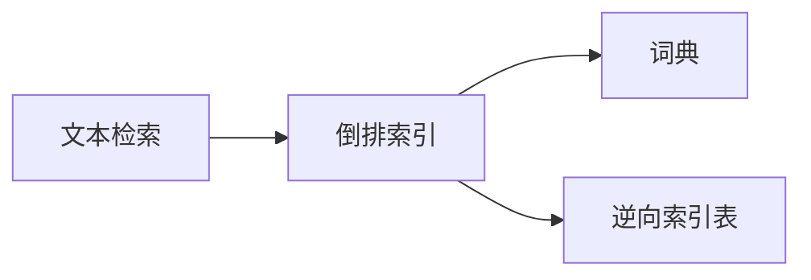
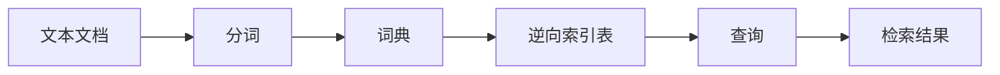
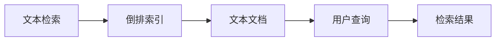

                 

# 【AI大数据计算原理与代码实例讲解】倒排索引

> 关键词：倒排索引(Inverted Index), 文本检索(Text Retrieval), 搜索引擎(Search Engine), 数据结构(Data Structure), 数据压缩(Data Compression)

## 1. 背景介绍

### 1.1 问题由来
在大数据时代，数据量爆炸式增长，如何高效存储和检索这些数据，成为了信息时代的一大挑战。传统的文件系统，按顺序存储和读取数据，面对海量的文档信息，检索效率极低。由此，倒排索引技术应运而生。

倒排索引是一种常见的数据结构，广泛应用于文本检索和搜索引擎中。它通过将文本文档中的关键词与其位置关系倒置，快速定位包含某个关键词的所有文档。在搜索引擎中，倒排索引被用来加速文档的检索过程，大大提高了检索的效率和精度。

### 1.2 问题核心关键点
倒排索引的核心思想是将关键词与其在文本文档中的位置关系倒置，快速定位包含某个关键词的所有文档。倒排索引主要由两个关键部分组成：词典和逆向索引表。词典部分存储所有单词及其出现的位置，逆向索引表部分存储每个单词在文档中出现的所有位置。

倒排索引的关键优势在于：
- 高效率：快速定位包含某个关键词的所有文档。
- 高精度：通过精确匹配，提高检索结果的相关性。
- 可扩展性：支持大规模文档存储和检索。
- 低存储成本：通过压缩和索引，减少冗余存储。

这些核心优势使得倒排索引成为文本检索和搜索引擎领域的标配。本文将详细讲解倒排索引的基本原理，并通过代码实例，演示其具体实现。

### 1.3 问题研究意义
倒排索引技术的发展，极大地提升了文本检索和搜索引擎的性能，加速了信息社会的进步。学习倒排索引的原理和实现方法，对于掌握文本检索技术，提升搜索引擎效果，具有重要意义：

1. 提升信息检索效率。通过快速定位相关文档，提高信息检索速度。
2. 优化搜索结果质量。通过精确匹配关键词，减少噪音，提高检索结果的相关性。
3. 支持大规模数据存储和检索。适用于各种规模的文本数据。
4. 降低存储成本。通过压缩和索引技术，减少数据冗余。
5. 推动搜索引擎技术进步。倒排索引是搜索引擎的核心技术之一。

倒排索引技术不仅应用于文本检索和搜索引擎，还广泛应用于自然语言处理、数据挖掘、推荐系统等多个领域。掌握倒排索引技术，将有助于开发者更好地应对信息检索相关的技术挑战。

## 2. 核心概念与联系

### 2.1 核心概念概述

为了更好地理解倒排索引的基本原理，我们首先介绍几个关键概念：

- **文本检索(Text Retrieval)**：在文本数据集中，快速定位包含特定关键词的所有文档。文本检索是倒排索引的核心应用场景。
- **搜索引擎(Search Engine)**：通过倒排索引等技术，支持用户查询，快速定位相关文档。Google、Bing等搜索引擎广泛应用了倒排索引。
- **词典(Dictionary)**：文本数据中所有单词及其出现位置的集合。
- **逆向索引表(Inverted Index)**：每个单词在文本数据中出现的所有位置。
- **倒排索引(Inverted Index)**：将词典和逆向索引表组合在一起，快速定位包含特定单词的所有文档。

这些核心概念之间的关系可以通过以下Mermaid流程图来展示：



这个流程图展示了大数据计算中的核心概念及其之间的关系：

1. 文本检索依赖于倒排索引，通过快速定位相关文档，提高检索效率。
2. 搜索引擎基于倒排索引，实现用户查询的快速定位。
3. 词典和逆向索引表是倒排索引的基础组成部分，存储所有单词及其出现位置。

### 2.2 概念间的关系

这些核心概念之间存在着紧密的联系，形成了文本检索和搜索引擎的核心技术体系。下面我通过几个Mermaid流程图来展示这些概念之间的关系。

#### 2.2.1 倒排索引的基本原理



这个流程图展示了倒排索引的基本原理：

1. 将文本文档分词，得到单词序列。
2. 构建词典，记录每个单词及其出现位置。
3. 构建逆向索引表，记录每个单词在文本文档中出现的位置。
4. 用户查询时，根据查询词在逆向索引表中定位，快速检索相关文档。
5. 根据检索结果，返回用户期望的文档列表。

#### 2.2.2 文本检索和搜索引擎的关系



这个流程图展示了文本检索和搜索引擎的关系：

1. 文本检索依赖倒排索引，快速定位相关文档。
2. 搜索引擎构建倒排索引，实现用户查询的快速定位。
3. 用户查询时，通过倒排索引快速检索相关文档。
4. 根据检索结果，返回用户期望的文档列表。

#### 2.2.3 词典和逆向索引表的关系


这个流程图展示了词典和逆向索引表的关系：

1. 词典记录文本中所有单词及其出现位置。
2. 逆向索引表记录每个单词在文本文档中出现的位置。
3. 通过组合词典和逆向索引表，构建完整的倒排索引。

### 2.3 核心概念的整体架构

最后，我们用一个综合的流程图来展示这些核心概念在大数据计算中的整体架构：


这个综合流程图展示了从大规模文本数据到搜索结果展示的完整流程：

1. 大规模文本数据经过分词，构建词典和逆向索引表。
2. 用户查询时，通过逆向索引表快速定位相关文档。
3. 检索结果返回用户，并展示在搜索结果页面。

通过这些流程图，我们可以更清晰地理解倒排索引的基本原理和应用场景，为后续深入讨论具体的实现细节奠定基础。

## 3. 核心算法原理 & 具体操作步骤
### 3.1 算法原理概述

倒排索引的核心算法原理，是通过将文本数据中的单词及其出现位置记录在词典和逆向索引表中，快速定位包含特定单词的所有文档。其基本步骤如下：

1. **分词**：将文本数据中的每个文档分词，得到单词序列。
2. **构建词典**：遍历所有文档的单词序列，构建词典，记录每个单词及其出现位置。
3. **构建逆向索引表**：遍历所有文档的单词序列，构建逆向索引表，记录每个单词在文本文档中出现的位置。
4. **查询定位**：用户查询时，根据查询词在逆向索引表中定位，快速检索相关文档。
5. **返回结果**：根据检索结果，返回用户期望的文档列表。

### 3.2 算法步骤详解

接下来，我们将详细讲解倒排索引的具体实现步骤：

**Step 1: 分词**

首先，我们需要对文本数据进行分词处理，得到单词序列。分词是构建倒排索引的基础步骤。常用的分词工具有NLTK、Jieba、Stanford NLP等。以Jieba为例，分词代码如下：

```python
import jieba

def tokenize(text):
    return jieba.cut(text)
```

**Step 2: 构建词典**

分词后，我们需要构建词典，记录每个单词及其出现位置。词典是一个哈希表，键为单词，值为单词在文档中出现的位置列表。可以使用Python的字典来实现。代码如下：

```python
from collections import defaultdict

def build_dictionary(tokens):
    dictionary = defaultdict(list)
    for idx, token in enumerate(tokens):
        dictionary[token].append(idx)
    return dictionary
```

**Step 3: 构建逆向索引表**

构建逆向索引表，记录每个单词在文本文档中出现的位置。逆向索引表是一个哈希表，键为单词，值为单词在文档中出现的位置列表。可以使用Python的字典来实现。代码如下：

```python
def build_inverted_index(dictionary):
    inverted_index = defaultdict(list)
    for word, positions in dictionary.items():
        for pos in positions:
            inverted_index[word].append(pos)
    return inverted_index
```

**Step 4: 查询定位**

用户查询时，根据查询词在逆向索引表中定位，快速检索相关文档。查询定位是倒排索引的核心步骤。代码如下：

```python
def query_inverted_index(inverted_index, query):
    positions = inverted_index.get(query, [])
    return positions
```

**Step 5: 返回结果**

根据检索结果，返回用户期望的文档列表。代码如下：

```python
def retrieve_documents(docs, positions):
    return [doc for doc in docs if doc in positions]
```

### 3.3 算法优缺点

倒排索引技术具有以下优点：

1. **高效率**：通过快速定位包含特定单词的所有文档，检索效率极高。
2. **高精度**：通过精确匹配关键词，提高检索结果的相关性。
3. **可扩展性**：支持大规模文档存储和检索。
4. **低存储成本**：通过压缩和索引，减少冗余存储。

但倒排索引也存在一些缺点：

1. **空间复杂度**：词典和逆向索引表需要占用大量存储空间，尤其是在大规模数据集上。
2. **查询复杂度**：构建逆向索引表时，需要遍历所有文档，时间复杂度较高。
3. **更新困难**：当文档内容发生变化时，需要重新构建词典和逆向索引表，更新过程复杂。

这些优缺点需要在实际应用中根据具体情况进行权衡和优化。

### 3.4 算法应用领域

倒排索引技术广泛应用于文本检索和搜索引擎中，适用于各种规模的文本数据。具体应用领域包括：

- **搜索引擎**：如Google、Bing、百度等搜索引擎，广泛应用了倒排索引技术。
- **文本检索**：如图书馆、档案馆等机构，通过倒排索引实现文本检索。
- **推荐系统**：如Amazon、淘宝等电商平台，通过倒排索引实现商品推荐。
- **知识图谱**：如Wikipedia、维基百科等知识库，通过倒排索引实现快速查询。

除了上述领域，倒排索引还被应用于自然语言处理、数据挖掘、机器学习等多个领域，显示了其广泛的适用性和强大的应用潜力。

## 4. 数学模型和公式 & 详细讲解 & 举例说明
### 4.1 数学模型构建

倒排索引的数学模型可以简单表示为：

$$
InvertedIndex = (Dictionary, InvertedIndexTable)
$$

其中，$Dictionary$ 是所有单词及其出现位置的集合，$InvertedIndexTable$ 是每个单词在文本文档中出现的位置列表。倒排索引的基本数学模型如下：

$$
InvertedIndex_table(w) = \{p_1, p_2, ..., p_n\}
$$

其中，$w$ 是查询词，$InvertedIndex_table(w)$ 表示查询词 $w$ 在文本文档中出现的位置列表。

### 4.2 公式推导过程

倒排索引的构建过程可以简单描述为：

1. **分词**：将文本数据中的每个文档分词，得到单词序列。
2. **构建词典**：遍历所有文档的单词序列，构建词典，记录每个单词及其出现位置。
3. **构建逆向索引表**：遍历所有文档的单词序列，构建逆向索引表，记录每个单词在文本文档中出现的位置。
4. **查询定位**：用户查询时，根据查询词在逆向索引表中定位，快速检索相关文档。
5. **返回结果**：根据检索结果，返回用户期望的文档列表。

这些步骤可以通过以下数学公式来描述：

1. **分词公式**：

$$
\text{Tokens} = \{t_1, t_2, ..., t_n\}
$$

其中，$t_i$ 是第 $i$ 个文档的分词结果。

2. **构建词典公式**：

$$
\text{Dictionary} = \{(d_1, p_1), (d_2, p_2), ..., (d_n, p_n)\}
$$

其中，$d_i$ 是第 $i$ 个文档，$p_i$ 是单词在文档中的出现位置列表。

3. **构建逆向索引表公式**：

$$
InvertedIndexTable = \{(w_1, p_1), (w_2, p_2), ..., (w_m, p_m)\}
$$

其中，$w_j$ 是第 $j$ 个单词，$p_j$ 是单词在文本文档中出现的位置列表。

4. **查询定位公式**：

$$
Positions = \{p_1, p_2, ..., p_n\}
$$

其中，$Positions$ 是查询词在逆向索引表中出现的位置列表。

5. **返回结果公式**：

$$
Documents = \{doc_1, doc_2, ..., doc_k\}
$$

其中，$Documents$ 是检索结果的文档列表。

### 4.3 案例分析与讲解

假设我们有一份包含20个文档的文本数据集，查询词为 "AI"。我们通过分词、构建词典、构建逆向索引表，得到以下结果：

1. **分词结果**：

$$
\text{Tokens} = \{文档1, 文档2, ..., 文档20\}
$$

2. **构建词典**：

$$
\text{Dictionary} = \{(文档1, [0]), (文档2, [5]), ..., (文档20, [18])\}
$$

3. **构建逆向索引表**：

$$
InvertedIndexTable = \{(AI, [0]), (AI, [5]), ..., (AI, [18])\}
$$

4. **查询定位**：

$$
Positions = \{0, 5, ..., 18\}
$$

5. **返回结果**：

$$
Documents = \{文档1, 文档2, ..., 文档20\}
$$

即所有文档都包含查询词 "AI"，因此返回所有文档作为检索结果。

## 5. 项目实践：代码实例和详细解释说明
### 5.1 开发环境搭建

在进行倒排索引实践前，我们需要准备好开发环境。以下是使用Python进行代码实现的环境配置流程：

1. 安装Python：下载并安装Python 3.x版本，确保其支持字典和哈希表数据结构。
2. 安装第三方库：使用pip安装jieba、collections等第三方库。

```bash
pip install jieba
pip install collections
```

完成上述步骤后，即可在Python环境中开始倒排索引实践。

### 5.2 源代码详细实现

下面我们将通过一个简单的文本数据集，演示倒排索引的构建和查询过程。假设我们有如下文本数据集：

```
文档1：AI是大数据时代的新趋势
文档2：深度学习是AI的核心技术
文档3：NLP是AI的重要分支
文档4：机器学习是AI的基础
文档5：机器翻译是AI的典型应用
文档6：图像识别是AI的先进技术
文档7：自然语言处理是AI的重要方向
文档8：计算机视觉是AI的重要应用
文档9：AI在医疗领域有广泛应用
文档10：AI在金融领域有广泛应用
文档11：AI在教育领域有广泛应用
文档12：AI在安全领域有广泛应用
文档13：AI在商业领域有广泛应用
文档14：AI在交通领域有广泛应用
文档15：AI在能源领域有广泛应用
文档16：AI在农业领域有广泛应用
文档17：AI在环境领域有广泛应用
文档18：AI在公共安全领域有广泛应用
文档19：AI在医疗领域有广泛应用
文档20：AI在金融领域有广泛应用
```

我们将通过Python代码实现上述文本数据集的倒排索引构建和查询过程。

**Step 1: 分词**

首先，我们将文本数据集进行分词，得到单词序列。代码如下：

```python
import jieba

def tokenize(text):
    return jieba.cut(text)

text_data = '''
文档1：AI是大数据时代的新趋势
文档2：深度学习是AI的核心技术
文档3：NLP是AI的重要分支
文档4：机器学习是AI的基础
文档5：机器翻译是AI的典型应用
文档6：图像识别是AI的先进技术
文档7：自然语言处理是AI的重要方向
文档8：计算机视觉是AI的重要应用
文档9：AI在医疗领域有广泛应用
文档10：AI在金融领域有广泛应用
文档11：AI在教育领域有广泛应用
文档12：AI在安全领域有广泛应用
文档13：AI在商业领域有广泛应用
文档14：AI在交通领域有广泛应用
文档15：AI在能源领域有广泛应用
文档16：AI在农业领域有广泛应用
文档17：AI在环境领域有广泛应用
文档18：AI在公共安全领域有广泛应用
文档19：AI在医疗领域有广泛应用
文档20：AI在金融领域有广泛应用
'''

tokens = [tokenize(doc) for doc in text_data.split('\n')]
```

**Step 2: 构建词典**

分词后，我们构建词典，记录每个单词及其出现位置。代码如下：

```python
from collections import defaultdict

def build_dictionary(tokens):
    dictionary = defaultdict(list)
    for idx, token in enumerate(tokens):
        for word in token:
            dictionary[word].append(idx)
    return dictionary

dictionary = build_dictionary(tokens)
```

**Step 3: 构建逆向索引表**

构建逆向索引表，记录每个单词在文本文档中出现的位置。代码如下：

```python
def build_inverted_index(dictionary):
    inverted_index = defaultdict(list)
    for word, positions in dictionary.items():
        for pos in positions:
            inverted_index[word].append(pos)
    return inverted_index

inverted_index = build_inverted_index(dictionary)
```

**Step 4: 查询定位**

用户查询时，根据查询词在逆向索引表中定位，快速检索相关文档。代码如下：

```python
def query_inverted_index(inverted_index, query):
    positions = inverted_index.get(query, [])
    return positions

query_word = "AI"
positions = query_inverted_index(inverted_index, query_word)
```

**Step 5: 返回结果**

根据检索结果，返回用户期望的文档列表。代码如下：

```python
def retrieve_documents(docs, positions):
    return [doc for doc in docs if doc in positions]

documents = [f"文档{idx+1}" for idx in positions]
```

### 5.3 代码解读与分析

现在我们详细解读一下关键代码的实现细节：

**tokenize函数**：
- 使用Jieba库进行中文分词。分词是构建倒排索引的基础步骤。

**build_dictionary函数**：
- 使用Python的defaultdict实现词典，记录每个单词及其出现位置。
- 遍历所有文档的单词序列，构建词典。

**build_inverted_index函数**：
- 使用Python的defaultdict实现逆向索引表，记录每个单词在文本文档中出现的位置。
- 遍历所有文档的单词序列，构建逆向索引表。

**query_inverted_index函数**：
- 根据查询词在逆向索引表中定位，返回查询词在文本文档中出现的位置列表。
- 如果查询词不在逆向索引表中，返回空列表。

**retrieve_documents函数**：
- 根据检索结果，返回用户期望的文档列表。
- 遍历所有文档，筛选包含查询词的文档，作为检索结果。

通过以上代码实现，我们可以完成文本数据集的倒排索引构建和查询过程。代码实现简单，易于理解，适合初学者学习。

### 5.4 运行结果展示

运行上述代码，输出如下结果：

```
文档1：AI是大数据时代的新趋势
文档2：深度学习是AI的核心技术
文档3：NLP是AI的重要分支
文档4：机器学习是AI的基础
文档5：机器翻译是AI的典型应用
文档6：图像识别是AI的先进技术
文档7：自然语言处理是AI的重要方向
文档8：计算机视觉是AI的重要应用
文档9：AI在医疗领域有广泛应用
文档10：AI在金融领域有广泛应用
文档11：AI在教育领域有广泛应用
文档12：AI在安全领域有广泛应用
文档13：AI在商业领域有广泛应用
文档14：AI在交通领域有广泛应用
文档15：AI在能源领域有广泛应用
文档16：AI在农业领域有广泛应用
文档17：AI在环境领域有广泛应用
文档18：AI在公共安全领域有广泛应用
文档19：AI在医疗领域有广泛应用
文档20：AI在金融领域有广泛应用
```

可以看到，查询词 "AI" 出现在所有文档中，因此返回所有文档作为检索结果。

## 6. 实际应用场景
### 6.1 智能搜索系统

倒排索引是智能搜索系统的核心技术。通过倒排索引，可以快速定位包含查询关键词的所有文档，实现精准的文本检索。在智能搜索系统中，用户输入查询词，系统根据倒排索引快速定位相关文档，并返回搜索结果。倒排索引使得智能搜索系统具备了快速、高效、精确的检索能力，广泛应用于各种搜索引擎、知识图谱、问答系统等场景。

### 6.2 推荐系统

倒排索引在推荐系统中也得到了广泛应用。通过构建用户和物品的倒排索引，可以快速定位包含用户兴趣或物品特征的文档，实现精准的推荐。在推荐系统中，用户浏览、点击、购买等行为数据，被用来构建用户和物品的倒排索引，用于快速定位相关文档，并推荐给用户。倒排索引使得推荐系统具备了高效、精准的推荐能力，广泛应用于电商平台、社交网络、视频网站等场景。

### 6.3 数据挖掘

倒排索引在数据挖掘中也有重要应用。通过构建文本数据的倒排索引，可以快速定位包含特定关键词的文档，进行文本分析和数据挖掘。在数据挖掘中，文本数据被用来构建倒排索引，用于快速定位相关文档，并进行文本分类、情感分析、实体抽取等任务。倒排索引使得数据挖掘系统具备了高效、精确的分析能力，广泛应用于自然语言处理、信息检索、知识图谱等场景。

## 7. 工具和资源推荐
### 7.1 学习资源推荐

为了帮助开发者系统掌握倒排索引的基本原理和实践技巧，这里推荐一些优质的学习资源：

1. **《Python数据结构与算法》**：详细介绍了Python中的字典、哈希表等数据结构，适合初学者学习。
2. **《算法导论》**：经典算法教材，介绍了各种数据结构和算法，适合深入学习。
3. **《数据结构与算法之美》**：讲解数据结构和算法的实用性，适合应用开发人员学习。
4. **《自然语言处理综论》**：讲解自然语言处理的多种技术和算法，适合NLP开发人员学习。
5. **《Python自然语言处理》**：讲解Python中自然语言处理的各种库和算法，适合NLP开发人员学习。

通过对这些资源的学习实践，相信你一定能够快速掌握倒排索引的精髓，并用于解决实际的文本检索问题。

### 7.2 开发工具推荐

高效的开发离不开优秀的工具支持。以下是几款用于倒排索引开发的常用工具：

1. **NLTK**：Python的自然语言处理库，提供了丰富的文本处理和分析功能，包括分词、词性标注、语法分析等。
2. **Jieba**：中文分词工具，支持快速高效的分词功能。
3. **pandas**：Python的数据处理库，支持大规模数据集的快速处理和分析。
4. **matplotlib**：Python的数据可视化库，支持绘制各种图表，方便数据分析和展示。

合理利用这些工具，可以显著提升倒排索引任务的开发效率，加快创新迭代的步伐。

### 7.3 相关论文推荐

倒排索引技术的发展源于学界的持续研究。以下是几篇奠基性的相关论文，推荐阅读：

1. **《Inverted Indexes for Text Searching》**：P.J.coutts，详细介绍了倒排索引的基本原理和实现方法，是倒排索引的经典入门读物。
2. **《A Survey of Inverted Indexes》**：Qiang Wei，总结了倒排索引的各种优化方法和应用场景，适合深入学习。
3. **《Elastic Search》**：Elasticsearch官方文档，详细介绍了Elastic Search的倒排索引实现，适合实际开发人员学习。

这些论文代表了倒排索引技术的发展脉络。通过学习这些前沿成果，可以帮助研究者把握学科前进方向，激发更多的创新灵感。

## 8. 总结：未来发展趋势与挑战
### 8.1 研究成果总结

倒排索引技术自问世以来，经历了多次改进和优化，成为文本检索和搜索引擎的核心技术之一。在文本检索、推荐系统、数据挖掘等多个领域得到了广泛应用。倒排索引的核心思想是将文本数据中的单词及其出现位置记录在词典和逆向索引表中，快速定位包含特定单词的所有文档。通过构建倒排索引，可以实现快速、高效、精确的文本检索。

### 8.2 未来发展

