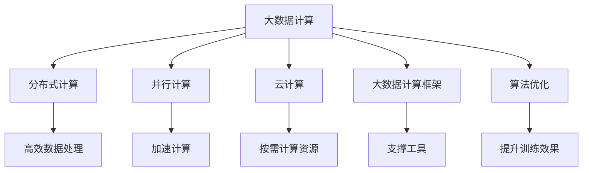
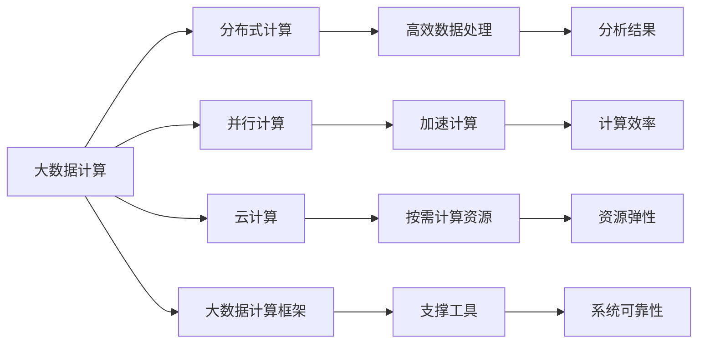
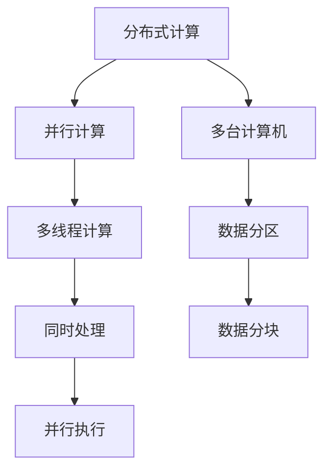
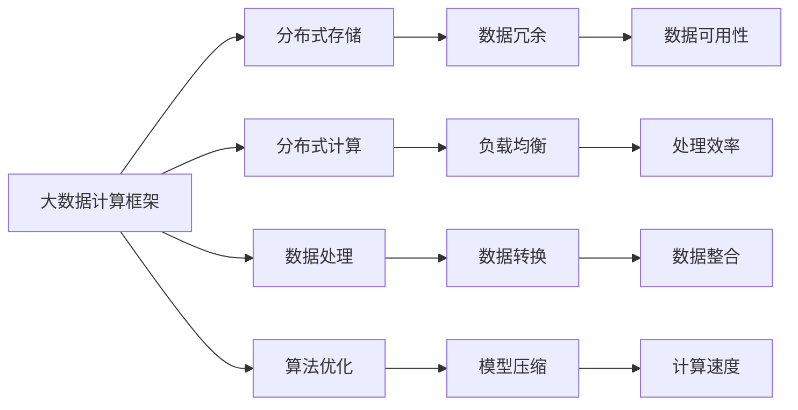

                 

# 【AI大数据计算原理与代码实例讲解】分区

> 关键词：大数据、分布式计算、人工智能、机器学习、深度学习、算法优化、大数据计算框架

## 1. 背景介绍

### 1.1 问题由来

随着数据量的爆炸式增长和计算资源的日益丰富，大数据计算正在成为驱动人工智能（AI）与机器学习（ML）技术突破的关键因素。尤其是在AI与机器学习领域，如何高效地处理和分析海量数据，构建高性能计算模型，成为了一个亟待解决的难题。

大数据计算不仅涉及到数据存储、处理和分析，还涉及到大规模分布式计算、云计算、人工智能算法优化等多个领域。因此，深入理解大数据计算原理，掌握相关技术和工具，对于构建高性能的AI与ML系统至关重要。

### 1.2 问题核心关键点

大数据计算的核心在于如何高效地处理和分析海量数据，构建高性能计算模型。其主要挑战包括：

1. 数据存储与管理：如何高效地存储和组织海量数据，构建高性能的存储系统。
2. 数据处理与分析：如何高效地对大规模数据进行清洗、转换、分析和建模。
3. 分布式计算与并行计算：如何通过分布式计算和并行计算技术，提高计算效率和系统性能。
4. 算法优化与模型训练：如何优化算法，提升模型训练速度和效果。
5. 云计算与大数据平台：如何利用云计算平台和大数据计算框架，构建高性能的AI与ML系统。

### 1.3 问题研究意义

深入研究大数据计算原理和技术，对于构建高性能的AI与ML系统具有重要意义：

1. 提升系统性能：通过高效的数据存储、处理和分析技术，提升系统的计算能力和性能。
2. 降低计算成本：通过分布式计算和云计算技术，降低计算资源和成本。
3. 促进算法创新：通过优化算法，推动新的AI与ML算法和模型的发展。
4. 加速应用落地：通过构建高性能计算平台，加速AI与ML技术在各行业的应用落地。
5. 驱动行业变革：通过大数据计算技术，推动各行业的数字化转型和智能化升级。

## 2. 核心概念与联系

### 2.1 核心概念概述

为更好地理解大数据计算的原理和实践，本节将介绍几个密切相关的核心概念：

- **大数据计算**：指在大规模数据集上，通过分布式计算和并行计算技术进行高效数据处理、分析和建模的过程。
- **分布式计算**：指通过多台计算机协同计算，提高计算效率和系统可靠性的计算方式。
- **并行计算**：指通过同时使用多个处理器或计算机，并行处理同一任务，提高计算速度和系统性能。
- **云计算**：指通过互联网提供按需计算资源和服务的模式，支持大规模数据处理和分析。
- **大数据计算框架**：指用于支持大数据计算的软件工具和平台，如Hadoop、Spark等。
- **算法优化**：指通过优化算法，提升模型训练速度和效果，包括模型压缩、量化、剪枝等技术。

这些核心概念之间的逻辑关系可以通过以下Mermaid流程图来展示：



这个流程图展示了大数据计算的核心概念及其之间的关系：

1. 大数据计算通过分布式计算和并行计算技术，实现高效数据处理和分析。
2. 云计算提供按需计算资源和平台，支持大规模数据处理和分析。
3. 大数据计算框架提供支撑工具，简化大数据计算过程。
4. 算法优化提升模型训练速度和效果，优化计算资源使用。

这些概念共同构成了大数据计算的完整生态系统，使其能够在各种场景下发挥强大的数据处理和分析能力。通过理解这些核心概念，我们可以更好地把握大数据计算的工作原理和优化方向。

### 2.2 概念间的关系

这些核心概念之间存在着紧密的联系，形成了大数据计算的完整生态系统。下面我通过几个Mermaid流程图来展示这些概念之间的关系。

#### 2.2.1 大数据计算的组成



这个流程图展示了大数据计算的组成，包括分布式计算、并行计算、云计算、大数据计算框架和算法优化等核心组成部分。

#### 2.2.2 分布式计算与并行计算的关系



这个流程图展示了分布式计算与并行计算的关系，分布式计算通过多台计算机协同计算，并行计算通过同时使用多个处理器或线程，提高计算效率和系统性能。

#### 2.2.3 大数据计算框架的应用



这个流程图展示了大数据计算框架的应用，包括分布式存储、分布式计算、数据处理、算法优化等多个方面。

### 2.3 核心概念的整体架构

最后，我们用一个综合的流程图来展示这些核心概念在大数据计算过程中的整体架构：

```mermaid
graph TB
    A[大规模数据集] --> B[分布式计算]
    A --> C[并行计算]
    A --> D[云计算]
    A --> E[大数据计算框架]
    A --> F[算法优化]
    B --> G[高效数据处理]
    C --> H[加速计算]
    D --> I[按需计算资源]
    E --> J[支撑工具]
    F --> K[提升训练效果]
    G --> L[分析结果]
    H --> M[计算效率]
    I --> N[资源弹性]
    J --> O[系统可靠性]
    K --> P[模型性能]
    L --> Q[数据洞察]
    M --> R[计算速度]
    N --> S[资源弹性]
    O --> T[数据冗余]
    P --> U[性能提升]
    Q --> V[业务洞察]
    R --> W[实时处理]
    S --> X[弹性伸缩]
    T --> Y[数据可用性]
    U --> Z[提升训练效果]
    V --> AA[商业决策]
    W --> AB[实时响应]
    X --> AC[快速部署]
    Y --> AD[数据冗余]
    Z --> AE[性能提升]
    AA --> AF[商业洞察]
    AB --> AG[实时响应]
    AC --> AH[快速部署]
    AD --> AI[数据冗余]
    AE --> AJ[性能提升]
    AF --> AK[商业洞察]
    AG --> AL[实时响应]
    AH --> AM[快速部署]
    AI --> AN[数据冗余]
    AJ --> AO[性能提升]
    AK --> AP[商业洞察]
    AL --> AQ[实时响应]
    AM --> AR[快速部署]
    AN --> AS[数据冗余]
    AO --> AT[性能提升]
    AP --> AU[商业洞察]
    AQ --> AV[实时响应]
    AR --> AW[快速部署]
    AS --> AX[数据冗余]
    AT --> AY[性能提升]
    AU --> AZ[商业洞察]
    AV --> BA[实时响应]
    AW --> BB[快速部署]
    AX --> BC[数据冗余]
    AY --> BD[性能提升]
    AZ --> BE[商业洞察]
    BA --> BF[实时响应]
    BB --> BG[快速部署]
    BC --> BH[数据冗余]
    BD --> BI[性能提升]
    BE --> BJ[商业洞察]
    BF --> BK[实时响应]
    BG --> BL[快速部署]
    BH --> BM[数据冗余]
    BI --> BN[性能提升]
    BJ --> BO[商业洞察]
    BK --> BP[实时响应]
    BL --> BM[快速部署]
    BM --> BN[数据冗余]
    BN --> BO[性能提升]
    BO --> BP[商业洞察]
    BP --> BQ[实时响应]
    BQ --> BR[快速部署]
    BR --> BS[数据冗余]
    BS --> BT[性能提升]
    BT --> BU[商业洞察]
    BU --> BV[实时响应]
    BV --> BW[快速部署]
    BW --> BX[数据冗余]
    BX --> BY[性能提升]
    BY --> BZ[商业洞察]
    BZ --> CA[实时响应]
    CA --> CB[快速部署]
    CB --> CC[数据冗余]
    CC --> CD[性能提升]
    CD --> CE[商业洞察]
    CE --> CF[实时响应]
    CF --> CG[快速部署]
    CG --> CH[数据冗余]
    CH --> CI[性能提升]
    CI --> CJ[商业洞察]
    CJ --> CK[实时响应]
    CK --> CL[快速部署]
    CL --> CM[数据冗余]
    CM --> CN[性能提升]
    CN --> CO[商业洞察]
    CO --> CP[实时响应]
    CP --> CQ[快速部署]
    CQ --> CR[数据冗余]
    CR --> CS[性能提升]
    CS --> CT[商业洞察]
    CT --> CU[实时响应]
    CU --> CV[快速部署]
    CV --> CW[数据冗余]
    CW --> CY[性能提升]
    CY --> CZ[商业洞察]
    CZ --> DA[实时响应]
    DA --> DB[快速部署]
    DB --> DC[数据冗余]
    DC --> DD[性能提升]
    DD --> DE[商业洞察]
    DE --> DF[实时响应]
    DF --> DG[快速部署]
    DG --> DH[数据冗余]
    DH --> DI[性能提升]
    DI --> DJ[商业洞察]
    DJ --> DK[实时响应]
    DK --> DL[快速部署]
    DL --> DM[数据冗余]
    DM --> DN[性能提升]
    DN --> DO[商业洞察]
    DO --> DP[实时响应]
    DP --> DQ[快速部署]
    DQ --> DR[数据冗余]
    DR --> DS[性能提升]
    DS --> DT[商业洞察]
    DT --> DU[实时响应]
    DU --> DV[快速部署]
    DV --> DW[数据冗余]
    DW --> DY[性能提升]
    DY --> DZ[商业洞察]
    DZ --> EA[实时响应]
    EA --> EB[快速部署]
    EB --> EC[数据冗余]
    EC --> ED[性能提升]
    ED --> EE[商业洞察]
    EE --> EF[实时响应]
    EF --> EG[快速部署]
    EG --> EH[数据冗余]
    EH --> EI[性能提升]
    EI --> EJ[商业洞察]
    EJ --> EK[实时响应]
    EK --> EL[快速部署]
    EL --> EM[数据冗余]
    EM --> EN[性能提升]
    EN --> EO[商业洞察]
    EO --> EP[实时响应]
    EP --> EQ[快速部署]
    EQ --> ER[数据冗余]
    ER --> ES[性能提升]
    ES --> ET[商业洞察]
    ET --> EU[实时响应]
    EU --> EV[快速部署]
    EV --> EW[数据冗余]
    EW --> EX[性能提升]
    EX --> EY[商业洞察]
    EY --> EZ[实时响应]
    EZ --> FA[快速部署]
    FA --> FB[数据冗余]
    FB --> FC[性能提升]
    FC --> FD[商业洞察]
    FD --> FE[实时响应]
    FE --> FF[快速部署]
    FF --> FG[数据冗余]
    FG --> FI[性能提升]
    FI --> FJ[商业洞察]
    FJ --> FK[实时响应]
    FK --> FL[快速部署]
    FL --> FM[数据冗余]
    FM --> FN[性能提升]
    FN --> FO[商业洞察]
    FO --> FP[实时响应]
    FP --> FQ[快速部署]
    FQ --> FR[数据冗余]
    FR --> FS[性能提升]
    FS --> FT[商业洞察]
    FT --> FU[实时响应]
    FU --> FV[快速部署]
    FV --> FW[数据冗余]
    FW --> FY[性能提升]
    FY --> FZ[商业洞察]
    FZ --> GA[实时响应]
    GA --> GB[快速部署]
    GB --> GC[数据冗余]
    GC --> GD[性能提升]
    GD --> GE[商业洞察]
    GE --> GF[实时响应]
    GF --> GG[快速部署]
    GG --> GH[数据冗余]
    GH --> GI[性能提升]
    GI --> GJ[商业洞察]
    GJ --> GK[实时响应]
    GK --> GL[快速部署]
    GL --> GM[数据冗余]
    GM --> GN[性能提升]
    GN --> GO[商业洞察]
    GO --> GP[实时响应]
    GP --> GQ[快速部署]
    GQ --> GR[数据冗余]
    GR --> GS[性能提升]
    GS --> GT[商业洞察]
    GT --> GU[实时响应]
    GU -->GV[快速部署]
    GV --> GW[数据冗余]
    GW --> GY[性能提升]
    GY --> GZ[商业洞察]
    GZ --> HA[实时响应]
    HA --> HB[快速部署]
    HB --> HC[数据冗余]
    HC --> HD[性能提升]
    HD --> HE[商业洞察]
    HE --> HF[实时响应]
    HF --> HG[快速部署]
    HG --> HH[数据冗余]
    HH --> HI[性能提升]
    HI --> HJ[商业洞察]
    HJ --> HK[实时响应]
    HK --> HL[快速部署]
    HL --> HM[数据冗余]
    HM --> HN[性能提升]
    HN --> HO[商业洞察]
    HO --> HP[实时响应]
    HP --> HQ[快速部署]
    HQ --> HR[数据冗余]
    HR --> HS[性能提升]
    HS --> HT[商业洞察]
    HT --> HU[实时响应]
    HU --> HV[快速部署]
    HV --> HW[数据冗余]
    HW --> HY[性能提升]
    HY --> HZ[商业洞察]
    HZ --> IA[实时响应]
    IA --> IB[快速部署]
    IB --> IC[数据冗余]
    IC --> ID[性能提升]
    ID --> IE[商业洞察]
    IE --> IF[实时响应]
    IF --> IG[快速部署]
    IG --> IH[数据冗余]
    IH --> II[性能提升]
    II --> IJ[商业洞察]
    IJ --> IK[实时响应]
    IK --> IL[快速部署]
    IL --> IM[数据冗余]
    IM --> IN[性能提升]
    IN --> IO[商业洞察]
    IO --> IP[实时响应]
    IP --> IQ[快速部署]
    IQ --> IR[数据冗余]
    IR --> IS[性能提升]
    IS --> IT[商业洞察]
    IT --> IU[实时响应]
    IU --> IV[快速部署]
    IV --> IW[数据冗余]
    IW --> IX[性能提升]
    IX --> IY[商业洞察]
    IY --> IZ[实时响应]
    IZ -->JA[快速部署]
    JA --> JB[数据冗余]
    JB --> JC[性能提升]
    JC --> JD[商业洞察]
    JD --> JE[实时响应]
    JE --> JF[快速部署]
    JF --> JG[数据冗余]
    JG --> JH[性能提升]
    JH --> JI[商业洞察]
    JI --> JJ[实时响应]
    JJ --> JK[快速部署]
    JK --> JL[数据冗余]
    JL --> JM[性能提升]
    JM --> JN[商业洞察]
    JN --> JO[实时响应]
    JO --> JP[快速部署]
    JP --> JQ[数据冗余]
    JQ --> JR[性能提升]
    JR --> JS[商业洞察]
    JS --> JT[实时响应]
    JT --> JU[快速部署]
    JU --> JV[数据冗余]
    JV --> JW[性能提升]
    JW --> JY[商业洞察]
    JY --> JZ[实时响应]
    JZ -->KA[快速部署]
    KA --> KB[数据冗余]
    KB --> KC[性能提升]
    JC --> KD[商业洞察]
    KD --> KE[实时响应]
    KE --> KF[快速部署]
    KF --> KG[数据冗余]
    KG --> KH[性能提升]
    KH --> KI[商业洞察]
    KI --> KJ[实时响应]
    KJ --> KK[快速部署]
    KK --> KL[数据冗余]
    KL --> KM[性能提升]
    KM --> KN[商业洞察]
    KN --> KO[实时响应]
    KO --> KP[快速部署]
    KP --> KQ[数据冗余]
    KQ --> KR[性能提升]
    KR --> KS[商业洞察]
    KS --> KT[实时响应]
    KT --> KU[快速部署]
    KU --> KV[数据冗余]
    KV --> KW[性能提升]
    KW --> KY[商业洞察]
    KY --> KZ[实时响应]
    KZ -->LA[快速部署]
    LA --> LB[数据冗余]
    LB --> LC[性能提升]
    LC --> LD[商业洞察]
    LD --> LE[实时响应]
    LE --> LF[快速部署]
    LF --> LG[数据冗余]
    LG --> LH[性能提升]
    LH --> LI[商业洞察]
    LI --> LJ[实时响应]
    LJ --> LK[快速部署]
    LK --> LL[数据冗余]
    LL --> LM[性能提升]
    LM --> LN[商业洞察]
    LN --> LO[实时响应]
    LO --> LP[快速部署]
    LP --> LQ[数据冗余]
    LQ --> LR[性能提升]
    LR --> LS[商业洞察]
    LS --> LT[实时响应]
    LT --> LU[快速部署]
    LU --> LV[数据冗余]
    LV --> LW[性能提升]
    LW --> LY[商业洞察]
    LY --> LZ[实时响应]
    LZ -->MA[快速部署]
    MA --> MB[数据冗余]
    MB --> MC[性能提升]
    MC --> MD[商业洞察]
    MD --> ME[实时响应]
    ME --> MF[快速部署]
    MF --> MG[数据冗余]
    MG --> MH[性能提升]
    MH --> MI[商业洞察]
    MI --> MJ[实时响应]
    MJ --> MK[快速部署]
    MK --> ML[数据冗余]
    ML --> MM[性能提升]
    MM --> MN[商业洞察]
    MN --> MO[实时响应]
    MO --> MP[快速部署]
    MP --> MQ[数据冗余]
    MQ --> MR[性能提升]
    MR --> MS[商业洞察]
    MS --> MT[实时响应]
    MT --> MU[快速部署]
    MU --> MV[数据冗余]
    MV --> MW[性能提升]
    MW --> MY[商业洞察]
    MY --> MZ[实时响应]
    MZ -->NA[快速部署]
    NA --> NB[数据冗余]
    NB --> NC[性能提升]
    NC --> ND[商业洞察]
    ND --> NE[实时响应]
    NE --> NF[快速部署]
    NF --> NG[数据冗余]
    NG --> NH[性能提升]
    NH --> NI[商业洞察]
    NI --> NJ[实时响应]
    NJ --> NK[快速部署]
    NK --> NL[数据冗余]
    NL --> NM[性能提升]
    NM --> NN[商业洞察]
    NN --> NO[实时响应]
    NO --> NP[快速部署]
    NP --> NQ[数据冗余]
    NQ --> NR[性能提升]
    NR --> NS[商业洞察]
    NS --> NT[实时响应]
    NT --> NU[快速部署]
    NU --> NV[数据冗余]
    NV --> NW[性能提升]
    NW --> NY[商业洞察]
    NY --> NZ[实时响应]
    NZ -->OA[快速部署]
    OA --> OB[数据冗余]
    OB --> OC[性能提升]
    OC --> OD[商业洞察]
    OD --> OE[实时响应]
    OE --> OF[快速部署]
    OF --> OG[数据冗余]
    OG --> OH[性能提升]
    OH --> OI[商业洞察]
    OI --> OJ[实时响应]
    OJ --> OK[快速部署]
    OK --> OL[数据冗余]
    OL --> OM[性能提升]
    OM --> ON[商业洞察]
    ON --> OO[实时响应]
    OO --> OP[快速部署]
    OP --> OQ[数据冗余]
    OQ --> OR[性能提升]
    OR --> OS[商业洞察]
    OS --> OT[实时响应]
    OT --> OU[快速部署]
    OU --> OV[数据冗余]
    OV --> OW[性能提升]
    OW --> OY[商业洞察]
    OY --> OZ[实时响应]
    OZ --> PA[快速部署]
    PA --> PB[数据冗余]
    PB --> PC[性能提升]
    PC --> PD[商业洞察]
    PD --> PE[实时响应]
    PE --> PF[快速部署]
    PF --> PG[数据冗余]
    PG --> PH[性能提升]
    PH --> PI[商业洞察]
    PI --> PJ[实时响应]
    PJ --> PK[快速部署]
    PK --> PL[数据冗余]
    PL --> PM[性能提升]
    PM --> PN[商业洞察]
    PN --> PO[实时响应]
    PO --> PP[快速部署]
    PP --> PQ[数据冗余]
    PQ --> PR[性能提升]
    PR --> PS[商业洞察]
    PS --> PT[实时响应]
    PT --> PU[快速部署]
    PU --> PV[数据冗余]
    PV --> PW[性能提升]
    PW --> PY[商业洞察]
    PY --> PZ[实时响应]
    PZ --> QA[快速部署]
    QA --> QB[数据冗余]
    QB --> QC[性能提升]
    QC --> QD[商业洞察]
    QD --> QE[实时响应]
    QE --> QF[快速部署]
    QF --> QG[数据冗余]
    QG --> QH[性能提升]
    QH --> QI[商业洞察]
    QI --> QJ[实时响应]
    QJ --> QK[快速部署]
    QK --> QL[数据冗余]
    QL --> QM[性能提升]
    QM --> QN[商业洞察]
    QN --> QO[实时响应]
    QO --> QP[快速部署]
    QP --> QQ[数据冗余]
    QQ --> QR[性能提升]
    QR --> QS[商业洞察]
    QS --> QT[实时响应]
    QT --> QU[快速部署]
    QU --> QV[数据冗余]
    QV --> QW[性能提升]
    QW --> QY[商业洞察]
    QY --> QZ[实时响应]
    QZ --> RA[快速部署]
    RA --> RB[数据冗余]
    RB --> RC[性能提升]
    RC --> RD[商业洞察]
    RD --> RE[实时响应]
    RE --> RF[快速部署]
    RF --> RG[数据冗余]
    RG --> RH[性能提升]
    RH --> RI[商业洞察]
    RI --> RJ[实时响应]
    RJ --> RK[快速部署]
    RK --> RL[数据冗余]
    RL --> RM[性能提升]
    RM --> RN[商业洞察]
    RN --> RO[实时响应]
    RO --> RP[快速部署]
    RP --> RQ[数据冗余]
    RQ --> RR[性能提升]
    RR --> RS[商业洞察]
    RS --> RT[实时响应]
    RT --> RU[快速部署]
    RU --> RV[数据冗余]
    RV --> RW[性能提升]
    RW --> RY[商业洞察]
    RY --> RZ[实时响应]
    RZ -->SA[快速部署]
    SA --> SB[数据冗余]
    SB --> SC[性能提升]
    SC --> SD[商业洞察]
    SD --> SE[实时响应]
    SE --> SF[快速部署]
    SF --> SG[数据冗余]
    SG --> SH[性能提升]
    SH --> SI[商业洞察]
    SI --> SJ[实时响应]
    SJ --> SK[快速部署]
    SK --> SL[数据冗余]
    SL --> SM[性能提升]
    SM --> SN[商业洞察]
    SN --> SO[实时响应]
    SO --> SP[快速部署]
    SP --> SQ[数据冗余]
    SQ --> SR[性能提升]
    SR --> SS[商业洞察]
    SS --> ST[实时响应]
    ST --> SU[快速部署]
    SU --> SV[数据冗余]
    SV --> SW[性能提升]
    SW -->

