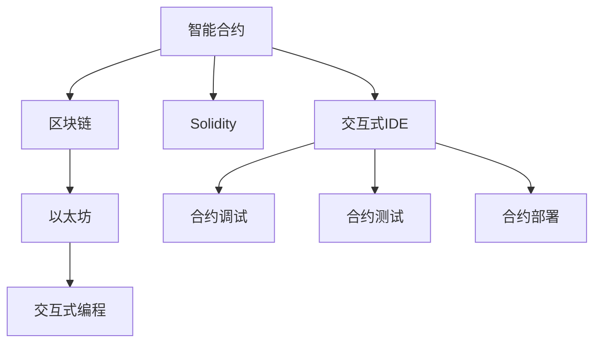

                 

# 【LangChain编程：从入门到实践】Chain接口调用

> 关键词：
- LangChain
- 区块链
- 智能合约
- 以太坊
- 交互式编程

## 1. 背景介绍

### 1.1 问题由来
区块链技术的兴起，特别是去中心化应用（DApp）和智能合约的发展，为编程范式带来了颠覆性的变革。传统上，编程以中心化环境为主，程序员可以利用完整的开发环境、强大的IDE工具和丰富的库资源。但区块链的去中心化特性要求开发者在完全分散的环境中构建应用，面临诸多新的挑战。

### 1.2 问题核心关键点
区块链环境下的编程范式主要基于智能合约，即在区块链上部署可执行的代码。开发者需要在智能合约中实现业务逻辑，并进行与链上资产、用户等对象的交互。传统的编程范式如OOP和函数式编程在智能合约中仍有应用价值，但需要在合约层面进行适配和优化。

### 1.3 问题研究意义
区块链编程技术的普及，对于推动Web3.0、去中心化金融（DeFi）、NFT（非同质化代币）等应用场景的快速发展具有重要意义。区块链编程可以：

- 降低应用开发成本。利用智能合约，开发者可以构建分布式、去中心化的应用，无需传统中心化服务器的支持。
- 提升应用安全性。智能合约以代码形式存储在区块链上，由代码逻辑而非中心化服务实现应用逻辑，具有更高的安全性。
- 增强应用互操作性。智能合约基于标准化的接口，可以进行跨链交互，扩展应用生态。
- 提供新的业务模式。基于区块链编程的创新应用如DeFi、NFT、DAO（去中心化自治组织）等，为各行各业提供了新的商业模式。

## 2. 核心概念与联系

### 2.1 核心概念概述

区块链编程范式基于智能合约，主要包括以下核心概念：

- 智能合约：一种在区块链上运行的代码，能够在特定条件下自动执行。通常使用Solidity、Move等语言编写。
- 区块链：分布式账本技术，由多个节点共同维护，保证数据的不可篡改性和可追溯性。
- 以太坊：目前最流行的公有区块链平台，提供智能合约的部署和执行环境。
- Solidity：以太坊上最广泛使用的智能合约编程语言。
- 交互式编程：开发者在区块链上通过交互式的IDE或REPL（命令提示符）与智能合约进行交互，进行合约的调试、测试和部署。

这些概念之间紧密联系，共同构成了区块链编程的基本框架。智能合约作为区块链编程的核心，需要在以太坊等平台上进行部署和执行，利用Solidity等语言编写，并通过交互式编程进行调试和测试。

### 2.2 概念间的关系

这些核心概念之间的逻辑关系可以通过以下Mermaid流程图来展示：



这个流程图展示了智能合约与区块链、以太坊、Solidity等概念之间的关系。智能合约在区块链上运行，主要在以太坊平台上部署和执行。Solidity是编写智能合约的语言，交互式编程则通过IDE工具进行合约的调试、测试和部署。

## 3. 核心算法原理 & 具体操作步骤

### 3.1 算法原理概述

区块链编程的核心算法原理主要包括智能合约的编写、调试和执行。智能合约的编写和调试在本地环境中进行，执行则需要在区块链网络中完成。智能合约的执行依赖于以太坊虚拟机（EVM），能够在特定的条件下自动执行。

智能合约的核心算法原理包括：

- 合约状态存储和更新：智能合约中的数据以账户余额、合同状态等形式存储在区块链上，并支持在特定条件下进行更新。
- 事件触发和处理：智能合约能够响应特定的交易事件，并在事件触发时执行相应的代码逻辑。
- 智能合约交互：智能合约之间可以进行交互，利用以太坊的标准接口进行通信。
- 安全性和一致性：智能合约执行依赖于以太坊EVM的原子操作，保证执行过程的安全性和一致性。

### 3.2 算法步骤详解

智能合约的编写、调试和执行一般包括以下几个关键步骤：

**Step 1: 编写智能合约代码**

编写智能合约的代码，通常使用Solidity语言。Solidity的语法和JavaScript类似，但有一些特定的语义和结构。例如：

```solidity
pragma solidity ^0.8.0;

contract MyContract {
    uint public balance;
    address payable owner;

    constructor() {
        owner = msg.sender;
        balance = 0;
    }

    function deposit(uint amount) public payable {
        owner.transfer(amount);
        balance += amount;
    }

    function withdraw(uint amount) public {
        require(balance >= amount);
        owner.transfer(amount);
        balance -= amount;
    }
}
```

该合约定义了一个简单的余额账户，可以进行存款和取款操作。

**Step 2: 调试和测试**

在编写完成后，需要在本地环境中对智能合约进行调试和测试。可以使用Remix IDE、Truffle等工具进行合约的调试和测试。例如，在Remix IDE中，可以执行以下步骤：

1. 创建新的项目，上传智能合约代码。
2. 点击"Compile"按钮，编译合约。
3. 点击"Deploy"按钮，在本地以太坊网络中部署合约。
4. 在本地以太坊网络中，调用智能合约的函数进行测试。

**Step 3: 发布到区块链**

测试通过后，需要将智能合约发布到以太坊主网络。可以通过MyEtherWallet（MEW）或Infura等工具连接到主网络，执行以下步骤：

1. 获取合约的部署地址，将以太币转入该地址。
2. 使用MEW或Infura工具生成以太坊账户，导入该账户。
3. 在MEW或Infura中，调用智能合约的部署函数，将合约部署到以太坊主网络。

**Step 4: 调用合约函数**

部署完成后，可以在MEW或Infura中调用智能合约的函数，进行实际应用。例如：

```js
const contractAddress = '0xabcdef...';
const account = '0x123456...';
const amount = web3.utils.toWei('10', 'ether');
const options = { from: account };
web3.eth.call({
    to: contractAddress,
    data: contract.methods.withdraw(amount).encodeABI(),
    options
}, (err, result) => {
    console.log(err, result);
});
```

该代码将10以太币从智能合约账户中转出，并打印出调用结果。

### 3.3 算法优缺点

智能合约的编写、调试和执行有以下优缺点：

**优点：**

- 去中心化：智能合约在区块链上运行，不受中心化机构控制，具有更高的信任度和安全性。
- 可追溯性：智能合约执行过程公开透明，所有交易可追溯、可验证。
- 自动化：智能合约可以自动执行业务逻辑，减少人工干预。

**缺点：**

- 编程难度高：智能合约编程需要具备一定的区块链和编程知识，上手难度较高。
- 资源消耗大：智能合约执行消耗以太币和 gas，资源消耗较大。
- 安全漏洞多：智能合约编程容易出现安全漏洞，如重入攻击、溢出等，需要严格测试和审计。

### 3.4 算法应用领域

智能合约的应用领域非常广泛，主要包括：

- 去中心化金融（DeFi）：利用智能合约实现借贷、交易、清算等功能。
- NFT和数字资产：利用智能合约进行NFT的创建、交易、认证等。
- 自动化系统：利用智能合约实现自动化的合同管理、供应链管理等。
- 游戏和社交应用：利用智能合约实现游戏道具、社交互动等。

## 4. 数学模型和公式 & 详细讲解 & 举例说明

### 4.1 数学模型构建

智能合约的编写和执行主要涉及以下几个数学模型：

- 合约状态更新模型：描述合约中账户余额、合同状态等数据的更新逻辑。
- 交易验证模型：描述交易事件的验证逻辑，如签名验证、权限检查等。
- 合约交互模型：描述智能合约之间以及合约与外部环境的交互逻辑。

### 4.2 公式推导过程

以余额账户合约为例，推导余额更新的数学公式。

假设合约中定义了一个账户 `account`，初始余额为 `balance`。当合约接收到一个转账交易 `transfer(amount)` 时，执行以下操作：

1. 将 `amount` 从发送者账户中扣除。
2. 将 `amount` 转入接收者账户。
3. 更新接收者账户的余额为 `balance + amount`。

数学公式如下：

$$
balance_{new} = balance + amount_{in}
$$

其中，`balance_{new}` 为新的账户余额，`amount_{in}` 为转入的金额。

### 4.3 案例分析与讲解

假设有一份智能合约，实现了一个简单的抵押贷款系统。合约中包含一个贷款账户 `loanAccount`，初始余额为 `0`。当用户申请贷款时，合约会检查账户余额，如果余额足够，则扣除贷款金额，并将余额存入贷款账户中。

智能合约代码如下：

```solidity
contract LoanContract {
    uint public loanBalance;
    uint public minBalance;
    uint public maxLoan;

    constructor(uint _minBalance, uint _maxLoan) {
        minBalance = _minBalance;
        maxLoan = _maxLoan;
        loanBalance = 0;
    }

    function loan(uint amount) public payable {
        require(balance >= amount);
        loanBalance += amount;
    }
}
```

在该合约中，`loanBalance` 表示贷款账户的余额，`minBalance` 表示最小余额要求，`maxLoan` 表示最大贷款额度。

## 5. 项目实践：代码实例和详细解释说明

### 5.1 开发环境搭建

在进行智能合约的编写和调试时，需要搭建相应的开发环境。以下是使用Remix IDE搭建开发环境的步骤：

1. 下载并安装Remix IDE。
2. 创建一个新的项目，上传智能合约代码。
3. 在IDE中编译和部署智能合约。

### 5.2 源代码详细实现

以余额账户合约为例，实现一个简单的余额账户。

```solidity
pragma solidity ^0.8.0;

contract MyContract {
    uint public balance;
    address payable owner;

    constructor() {
        owner = msg.sender;
        balance = 0;
    }

    function deposit(uint amount) public payable {
        owner.transfer(amount);
        balance += amount;
    }

    function withdraw(uint amount) public {
        require(balance >= amount);
        owner.transfer(amount);
        balance -= amount;
    }
}
```

该合约定义了一个简单的余额账户，可以进行存款和取款操作。

### 5.3 代码解读与分析

**合约状态存储和更新**

合约中定义了一个 `balance` 变量，用于存储账户余额。通过 `deposit` 函数，可以将资金转入账户，通过 `withdraw` 函数，可以将资金从账户中取出。

**事件触发和处理**

合约中未定义事件，但在实际应用中，可以通过 `emit` 语句定义事件，以便在特定条件下触发代码逻辑。例如：

```solidity
pragma solidity ^0.8.0;

contract EventContract {
    event LoanApplied(address indexed user);
    event LoanApproved(address indexed user);

    mapping (address => uint) public balances;

    constructor() {
        balances[msg.sender] = 1000;
    }

    function loan(uint amount) public payable {
        require(balances[msg.sender] >= amount);
        balances[msg.sender] -= amount;
        balances[owner] += amount;
        emit LoanApplied(msg.sender);
    }

    function approveLoan() public {
        require(owner == msg.sender);
        emit LoanApproved(owner);
    }
}
```

在该合约中，通过 `LoanApplied` 和 `LoanApproved` 事件，触发 `loan` 和 `approveLoan` 函数的执行。

**智能合约交互**

智能合约之间可以进行交互，利用以太坊的标准接口进行通信。例如：

```solidity
pragma solidity ^0.8.0;

contract InteractContract {
    MyContract myContract;

    constructor(address _contractAddress) {
        myContract = MyContract(_contractAddress);
    }

    function deposit() public payable {
        myContract.deposit(msg.value);
    }

    function withdraw() public {
        myContract.withdraw(msg.value);
    }
}
```

在该合约中，通过 `MyContract` 类型定义了一个交互合约，可以通过 `deposit` 和 `withdraw` 函数与 `MyContract` 合约进行交互。

### 5.4 运行结果展示

假设在本地以太坊网络中部署了余额账户合约，并在合约中进行了存款和取款操作，可以通过以下代码调用合约函数：

```js
const contractAddress = '0xabcdef...';
const account = '0x123456...';
const amount = web3.utils.toWei('10', 'ether');
const options = { from: account };
web3.eth.call({
    to: contractAddress,
    data: contract.methods.withdraw(amount).encodeABI(),
    options
}, (err, result) => {
    console.log(err, result);
});
```

## 6. 实际应用场景

### 6.1 去中心化金融（DeFi）

DeFi是区块链编程的重要应用场景，利用智能合约实现借贷、交易、清算等功能。例如，利用智能合约实现去中心化借贷系统，用户可以通过智能合约申请贷款，无需中心化机构的审批和担保。

### 6.2 NFT和数字资产

NFT和数字资产是区块链编程的另一个重要应用场景，利用智能合约实现NFT的创建、交易、认证等。例如，利用智能合约实现NFT的市场化交易，用户可以通过智能合约进行NFT的购买和出售。

### 6.3 自动化系统

自动化系统也是智能合约的重要应用场景，利用智能合约实现自动化的合同管理、供应链管理等。例如，利用智能合约实现供应链的自动化管理，可以实时监控供应链各环节的状态，自动触发合同执行。

### 6.4 游戏和社交应用

游戏和社交应用也是智能合约的重要应用场景，利用智能合约实现游戏道具、社交互动等。例如，利用智能合约实现游戏道具的发行和交易，可以确保道具的稀缺性和可验证性。

## 7. 工具和资源推荐

### 7.1 学习资源推荐

为了帮助开发者系统掌握智能合约的编写和调试技巧，这里推荐一些优质的学习资源：

1. Solidity官方文档：Solidity官方文档，提供了详细的语言规范和开发指南，是学习智能合约的必备资源。
2. Remix IDE教程：Remix IDE官方教程，介绍了智能合约的编写、调试和部署过程。
3. Truffle框架教程：Truffle框架官方教程，介绍了Truffle开发环境的搭建和智能合约的开发流程。
4. Ethereum官方文档：Ethereum官方文档，提供了以太坊平台的详细介绍，包括区块链、智能合约等核心概念。

通过这些资源的学习实践，相信你一定能够快速掌握智能合约的编写和调试技巧，并用于解决实际的区块链应用问题。

### 7.2 开发工具推荐

高效的开发离不开优秀的工具支持。以下是几款用于智能合约开发的常用工具：

1. Remix IDE：智能合约的调试和开发工具，支持Solidity和Vyper等语言。
2. Truffle框架：智能合约的开发框架，提供了丰富的插件和库，支持合约的自动化部署和测试。
3. Hardhat框架：智能合约的开发框架，支持Ethereum和BSC（Binance Smart Chain）等平台。
4. Infura：以太坊主网络的访问工具，支持快速连接和调用智能合约。

合理利用这些工具，可以显著提升智能合约的开发效率，加快创新迭代的步伐。

### 7.3 相关论文推荐

智能合约编程技术的不断发展，得益于学界的持续研究。以下是几篇奠基性的相关论文，推荐阅读：

1. Solidity白皮书：介绍Solidity语言的设计和实现，提供了智能合约编程的官方指导。
2. Ethereum白皮书：介绍以太坊平台的设计和实现，提供了智能合约部署和执行的官方指导。
3. ConsenSys智能合约安全指南：提供智能合约安全的最佳实践和建议，帮助开发者避免常见的安全漏洞。

这些论文代表了大语言模型微调技术的发展脉络。通过学习这些前沿成果，可以帮助研究者把握学科前进方向，激发更多的创新灵感。

## 8. 总结：未来发展趋势与挑战

### 8.1 总结

本文对智能合约的编写、调试和执行进行了全面系统的介绍。首先阐述了智能合约和区块链编程的研究背景和意义，明确了智能合约在去中心化应用、DeFi、NFT等场景下的应用价值。其次，从原理到实践，详细讲解了智能合约的编写、调试和执行的算法原理和具体操作步骤，给出了智能合约的代码实例和运行结果。同时，本文还广泛探讨了智能合约在多个行业领域的应用前景，展示了智能合约的巨大潜力。此外，本文精选了智能合约的各类学习资源，力求为读者提供全方位的技术指引。

通过本文的系统梳理，可以看到，智能合约编程范式基于区块链技术，具有去中心化、透明化、自动化等优点，广泛应用于DeFi、NFT、自动化系统、游戏和社交应用等多个领域。智能合约通过代码形式实现业务逻辑，具有高度的可验证性和安全性，为区块链应用提供了新的发展方向。

### 8.2 未来发展趋势

展望未来，智能合约编程技术将呈现以下几个发展趋势：

1. 智能合约生态系统不断扩展。智能合约将在更多的行业和应用场景中得到应用，如农业、物联网、物流等。
2. 跨链交互日益频繁。跨链技术的发展将使得智能合约能够在不同的区块链平台之间进行交互，实现数据和资产的跨链转移。
3. 自动化和可编程性增强。智能合约的编程能力将不断增强，可以支持更复杂和灵活的业务逻辑。
4. 治理机制逐步完善。智能合约的治理机制将不断完善，支持更多样的共识机制和激励机制，提升系统的可靠性和安全性。
5. 社区和平台建设加速。智能合约社区和平台的建设将加速，促进智能合约的生态系统和应用场景的扩展。

### 8.3 面临的挑战

尽管智能合约编程技术已经取得了显著成果，但在迈向更加智能化、普适化应用的过程中，仍面临诸多挑战：

1. 编程难度高。智能合约编程需要具备一定的区块链和编程知识，上手难度较高。
2. 资源消耗大。智能合约执行消耗以太币和 gas，资源消耗较大。
3. 安全漏洞多。智能合约编程容易出现安全漏洞，如重入攻击、溢出等，需要严格测试和审计。
4. 合约执行效率低。智能合约执行效率较低，难以应对高并发和高频率的业务场景。
5. 合约可升级性不足。智能合约一旦部署，难以进行后续的升级和更新，需要谨慎设计和部署。

### 8.4 研究展望

面对智能合约编程所面临的挑战，未来的研究需要在以下几个方面寻求新的突破：

1. 探索可编程语言和编程范式。开发更加灵活和高效的编程语言和编程范式，支持智能合约的快速开发和调试。
2. 研究智能合约的可升级性和可审计性。开发支持智能合约升级和审计的工具和方法，确保合约的稳定性和安全性。
3. 引入自动化测试和审计工具。开发智能合约的自动化测试和审计工具，提高合约的可靠性和安全性。
4. 探索跨链交互技术。研究跨链技术的实现方法，支持智能合约在多个区块链平台之间的交互。
5. 引入区块链平台之间的互操作性。研究区块链平台之间的互操作性技术，实现跨链交互和数据共享。

这些研究方向将引领智能合约编程技术迈向更高的台阶，为构建去中心化、安全、可靠、高效的应用系统铺平道路。

## 9. 附录：常见问题与解答

**Q1：智能合约的编程语言有哪些？**

A: 常用的智能合约编程语言包括Solidity、Vyper、BCHScript等。Solidity是目前最流行的智能合约编程语言，支持在以太坊平台上部署和执行。Vyper是Solidity的改进版本，提供了更严格的类型系统和更少的歧义。BCHScript是Bitcoin Cash上的智能合约编程语言。

**Q2：智能合约的调试和测试如何进行？**

A: 智能合约的调试和测试在本地环境中进行，可以使用Remix IDE、Truffle等工具。Remix IDE支持Solidity和Vyper等语言，支持合约的调试、测试和部署。Truffle框架支持Solidity和Vyper等语言，提供了丰富的插件和库，支持合约的自动化部署和测试。

**Q3：智能合约的安全性如何保障？**

A: 智能合约的安全性保障主要通过代码审计和测试实现。常用的审计工具包括MythX、Audius、Securify等。这些工具可以对智能合约进行代码审计和漏洞检测，帮助开发者发现和修复安全漏洞。同时，开发者在编写智能合约时，需要注意一些常见的安全漏洞，如重入攻击、溢出、整数溢出等，进行严格测试和审计。

**Q4：智能合约的部署和执行有什么注意事项？**

A: 智能合约的部署和执行需要注意以下几个方面：
1. 确保合约代码的完整性和正确性，避免代码错误和漏洞。
2. 控制以太币和 gas 的消耗，避免过度消耗以太币和 gas，导致账户被冻结或锁死。
3. 确保合约的兼容性和互操作性，避免与其他合约和平台产生冲突。
4. 进行充分的测试和审计，确保合约的可靠性和安全性。

## 总结
本文从智能合约的编写、调试和执行等方面，详细介绍了区块链编程范式。智能合约作为一种新型编程范式，基于区块链技术，具有去中心化、透明化、自动化等优点，广泛应用于去中心化金融、NFT、自动化系统、游戏和社交应用等多个领域。通过编程语言和编程工具的支持，智能合约的开发和调试变得更加高效和灵活。智能合约的未来发展方向包括扩展生态系统、提升可编程性、优化治理机制、增强自动化能力等。同时，智能合约编程也面临编程难度高、资源消耗大、安全漏洞多等挑战，需要在编程语言、测试工具、安全性保障等方面进行进一步的优化和改进。相信随着区块链技术的不断发展，智能合约编程将为区块链应用带来更多的创新和可能性。

