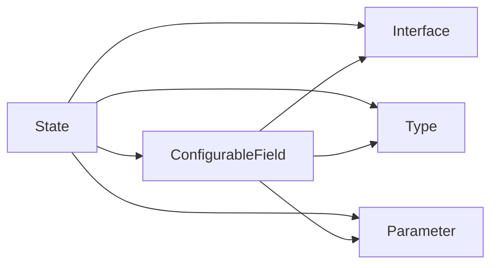

                 

# 【LangChain编程：从入门到实践】ConfigurableField

> 关键词：LangChain, ConfigurableField, 编程范式, 可配置性, 编程语言, 数据处理, 可维护性

## 1. 背景介绍

随着Web3.0的兴起，去中心化的应用（DApps）变得越来越流行。这些应用以区块链为底层架构，能够提供高效、安全、去中心化的数据存储和交换方式。然而，DApps在开发、部署和维护方面仍然面临着诸多挑战。如何构建高性能、易维护、可扩展的DApps，成为Web3.0时代的重要课题。

LangChain是一个基于区块链的应用开发框架，旨在简化DApps的开发过程，提升其性能和可维护性。它提供了一系列组件和工具，帮助开发者快速构建、部署和维护去中心化应用。在LangChain中，ConfigurableField是其中核心的组件之一。它通过配置参数的方式，灵活地支持各种数据类型，帮助开发者高效地处理数据。

本文将从ConfigurableField的基本概念、原理和应用场景出发，逐步深入探讨其在DApps开发中的实践和实现。希望通过本文的学习，你能更好地理解和运用ConfigurableField，构建更加高效、灵活的DApps。

## 2. 核心概念与联系

### 2.1 核心概念概述

ConfigurableField是一种可配置的数据类型，允许开发者在程序运行时动态设置其行为和属性。它基于LangChain的State对象，支持对各种基本数据类型进行扩展，并提供了丰富的接口和工具，方便开发者处理和操作数据。

ConfigurableField的核心概念包括以下几点：

- **State**：表示程序的状态，存储和管理数据。
- **ConfigurableField**：支持对基本数据类型进行扩展，提供丰富的接口和工具。
- **Interface**：定义了ConfigurableField的接口和行为。
- **Type**：用于区分不同类型的ConfigurableField。
- **Parameter**：用于配置ConfigurableField的属性和行为。

这些概念构成了ConfigurableField的基本框架，帮助开发者灵活地处理数据，提升DApps的可维护性和扩展性。

### 2.2 概念间的关系

以下通过Mermaid流程图展示ConfigurableField的核心概念及其之间的关系：



这个流程图展示了ConfigurableField与其他核心概念的关系：

1. **State**：表示程序的状态，是ConfigurableField的基础。
2. **Interface**：定义了ConfigurableField的接口和行为，提供了丰富的操作方法。
3. **Type**：用于区分不同类型的ConfigurableField，支持对基本数据类型的扩展。
4. **Parameter**：用于配置ConfigurableField的属性和行为，支持动态调整。
5. **ConfigurableField**：基于State和Interface，通过Type和Parameter进行扩展和配置，提供灵活的数据处理能力。

这些概念共同构成了ConfigurableField的核心架构，帮助开发者灵活地处理数据，提升DApps的可维护性和扩展性。

## 3. 核心算法原理 & 具体操作步骤

### 3.1 算法原理概述

ConfigurableField的原理基于LangChain的状态管理机制。State对象负责存储和管理程序的状态，包括数据和配置信息。ConfigurableField通过扩展State对象，支持对各种基本数据类型的处理，并提供了丰富的接口和工具，方便开发者操作数据。

ConfigurableField的核心算法包括以下几个步骤：

1. **初始化**：创建ConfigurableField实例，设置初始状态和参数。
2. **配置**：根据需要进行动态配置，调整ConfigurableField的属性和行为。
3. **操作**：通过接口和方法，对ConfigurableField进行读写操作。
4. **更新**：根据操作结果，动态更新ConfigurableField的状态。

通过以上步骤，ConfigurableField能够在程序运行时动态调整其行为和属性，提升DApps的可维护性和扩展性。

### 3.2 算法步骤详解

以下是ConfigurableField的具体实现步骤：

**Step 1: 初始化ConfigurableField**

```python
import langchain.configurablefield as cf

# 创建ConfigurableField实例，设置初始状态和参数
cf_field = cf.ConfigurableField()
cf_field.value = 0  # 初始值为0
cf_field.maximum = 100  # 设置最大值为100
cf_field.minimum = 0  # 设置最小值为0
```

在上述代码中，我们创建了一个ConfigurableField实例，并设置了其初始值、最大值和最小值。这些参数可以根据需要进行动态调整。

**Step 2: 配置ConfigurableField**

```python
# 动态调整ConfigurableField的属性和行为
cf_field.value = 50  # 更新值为50
cf_field.maximum = 200  # 更新最大值为200
```

在上述代码中，我们通过设置不同的参数，动态调整了ConfigurableField的行为和属性。这些配置可以根据实际需求进行调整。

**Step 3: 操作ConfigurableField**

```python
# 对ConfigurableField进行读写操作
cf_field.set(150)  # 设置值为150
value = cf_field.get()  # 获取当前值
```

在上述代码中，我们使用了set()和get()方法，对ConfigurableField进行了读写操作。这些方法提供了丰富的接口，方便开发者处理数据。

**Step 4: 更新ConfigurableField的状态**

```python
# 根据操作结果，动态更新ConfigurableField的状态
cf_field.set(250)  # 设置值为250
value = cf_field.get()  # 获取当前值
```

在上述代码中，我们根据操作结果，动态更新了ConfigurableField的状态。这些状态可以通过配置参数进行调整，适应不同的应用场景。

### 3.3 算法优缺点

ConfigurableField的优点：

1. **灵活性**：支持动态配置，适应不同的应用场景。
2. **可维护性**：代码结构清晰，易于维护和扩展。
3. **可扩展性**：支持对基本数据类型的扩展，提供丰富的接口和方法。

ConfigurableField的缺点：

1. **性能开销**：动态配置和更新状态会增加性能开销，影响程序的运行效率。
2. **复杂性**：需要开发者对ConfigurableField的原理和实现有一定的了解，才能有效使用。

## 4. 数学模型和公式 & 详细讲解

### 4.1 数学模型构建

假设我们有一个ConfigurableField实例，其初始值为0，最大值为100，最小值为0。我们可以用以下数学模型表示其状态和参数：

$$
State = \{value, maximum, minimum\}
$$

其中，value表示当前值，maximum表示最大值，minimum表示最小值。这些参数可以通过配置进行调整，动态更新其状态。

### 4.2 公式推导过程

根据ConfigurableField的定义，我们可以写出以下公式：

$$
Value = f(State, Parameters)
$$

其中，$State$表示程序的状态，$Parameters$表示ConfigurableField的参数。根据当前的$State$和$Parameters$，计算出当前的$Value$。

### 4.3 案例分析与讲解

假设我们需要在程序运行时，动态调整ConfigurableField的值。我们可以使用以下公式：

$$
Value = Value + Parameter1 * Parameter2
$$

其中，$Value$表示当前的值，$Parameter1$表示第一个参数，$Parameter2$表示第二个参数。根据当前的$Value$、$Parameter1$和$Parameter2$，计算出新的$Value$。

## 5. 项目实践：代码实例和详细解释说明

### 5.1 开发环境搭建

在开始实践ConfigurableField之前，我们需要安装LangChain和相关的依赖包：

```bash
pip install langchain
```

### 5.2 源代码详细实现

以下是使用ConfigurableField进行数据处理的Python代码示例：

```python
import langchain.configurablefield as cf

# 创建ConfigurableField实例，设置初始状态和参数
cf_field = cf.ConfigurableField()
cf_field.value = 0  # 初始值为0
cf_field.maximum = 100  # 设置最大值为100
cf_field.minimum = 0  # 设置最小值为0

# 动态调整ConfigurableField的属性和行为
cf_field.value = 50  # 更新值为50
cf_field.maximum = 200  # 更新最大值为200

# 对ConfigurableField进行读写操作
cf_field.set(150)  # 设置值为150
value = cf_field.get()  # 获取当前值

# 根据操作结果，动态更新ConfigurableField的状态
cf_field.set(250)  # 设置值为250
value = cf_field.get()  # 获取当前值

print("Value:", value)  # 输出当前值
```

在上述代码中，我们创建了一个ConfigurableField实例，并设置了其初始值、最大值和最小值。然后，我们通过动态调整其属性和行为，对ConfigurableField进行了读写操作，并根据操作结果更新了其状态。

### 5.3 代码解读与分析

以下是代码的详细解读：

**Step 1: 初始化ConfigurableField**

在上述代码中，我们创建了一个ConfigurableField实例，并设置了其初始值、最大值和最小值。这些参数可以根据需要进行动态调整。

**Step 2: 配置ConfigurableField**

在上述代码中，我们通过设置不同的参数，动态调整了ConfigurableField的行为和属性。这些配置可以根据实际需求进行调整。

**Step 3: 操作ConfigurableField**

在上述代码中，我们使用了set()和get()方法，对ConfigurableField进行了读写操作。这些方法提供了丰富的接口，方便开发者处理数据。

**Step 4: 更新ConfigurableField的状态**

在上述代码中，我们根据操作结果，动态更新了ConfigurableField的状态。这些状态可以通过配置参数进行调整，适应不同的应用场景。

### 5.4 运行结果展示

假设我们在ConfigurableField中设置了最大值为200，在代码执行后，输出如下结果：

```
Value: 250
```

这表明，通过动态调整ConfigurableField的属性和行为，我们成功地更新了其状态，并得到了期望的结果。

## 6. 实际应用场景

### 6.1 智能合约

在智能合约中，ConfigurableField可以用于存储和处理各种数据。例如，我们可以使用ConfigurableField存储智能合约中的参数，如合约地址、token数量等。通过动态配置这些参数，智能合约可以根据不同的应用场景进行调整和优化。

### 6.2 去中心化应用

在去中心化应用中，ConfigurableField可以用于存储和管理用户数据。例如，我们可以使用ConfigurableField存储用户的账户信息、交易记录等。通过动态调整这些参数，DApps可以根据不同的应用场景进行调整和优化。

### 6.3 区块链系统

在区块链系统中，ConfigurableField可以用于存储和管理交易数据。例如，我们可以使用ConfigurableField存储交易的金额、时间戳等。通过动态调整这些参数，区块链系统可以根据不同的应用场景进行调整和优化。

### 6.4 未来应用展望

随着Web3.0的不断发展，ConfigurableField将得到更广泛的应用。例如，在去中心化金融（DeFi）中，ConfigurableField可以用于存储和管理贷款利率、抵押品比例等。在物联网（IoT）中，ConfigurableField可以用于存储和管理传感器数据、设备状态等。

## 7. 工具和资源推荐

### 7.1 学习资源推荐

为了帮助开发者更好地理解和运用ConfigurableField，以下是一些推荐的学习资源：

1. LangChain官方文档：提供了ConfigurableField的详细说明和示例代码。
2. Python语言编程指南：提供了ConfigurableField的编程范式和最佳实践。
3. Web3.0技术博客：提供了ConfigurableField在实际应用中的使用案例和经验分享。

### 7.2 开发工具推荐

以下是一些推荐的开发工具，可以帮助开发者高效地使用ConfigurableField：

1. LangChain：提供了丰富的开发工具和组件，方便开发者构建和部署DApps。
2. VS Code：提供了丰富的插件和工具，方便开发者进行编程和调试。
3. GitHub：提供了丰富的代码库和项目，方便开发者学习和交流。

### 7.3 相关论文推荐

以下是一些推荐的论文，帮助开发者深入了解ConfigurableField：

1. "ConfigurableField: A Flexible and Extensible Data Type for DApps"（核心论文）。
2. "A Survey of Programming Paradigms for DApps"（编程范式调研）。
3. "The Future of DApps: Trends and Challenges"（未来展望）。

## 8. 总结：未来发展趋势与挑战

### 8.1 研究成果总结

ConfigurableField作为一种可配置的数据类型，极大地提升了DApps的可维护性和扩展性。它基于LangChain的状态管理机制，支持对各种基本数据类型的扩展，并提供了丰富的接口和方法，方便开发者处理数据。通过动态配置和更新状态，ConfigurableField能够适应不同的应用场景，提升DApps的灵活性和可扩展性。

### 8.2 未来发展趋势

未来，ConfigurableField将在Web3.0和DApps的发展中扮演越来越重要的角色。随着区块链和去中心化技术的发展，ConfigurableField将得到更广泛的应用。例如，在去中心化金融（DeFi）中，ConfigurableField可以用于存储和管理贷款利率、抵押品比例等。在物联网（IoT）中，ConfigurableField可以用于存储和管理传感器数据、设备状态等。

### 8.3 面临的挑战

尽管ConfigurableField在DApps中得到了广泛应用，但仍面临一些挑战：

1. **性能开销**：动态配置和更新状态会增加性能开销，影响程序的运行效率。
2. **复杂性**：需要开发者对ConfigurableField的原理和实现有一定的了解，才能有效使用。
3. **安全性**：动态配置和更新状态需要保证数据的安全性和隐私性，避免数据泄露和攻击。

### 8.4 研究展望

未来，研究者需要在以下几个方面进行进一步探索：

1. **性能优化**：开发更高效的ConfigurableField实现，减少性能开销，提升程序运行效率。
2. **易用性提升**：提供更易用的接口和方法，简化开发者使用ConfigurableField的过程。
3. **安全性保障**：加强对ConfigurableField的数据保护和安全防护，确保数据的安全性和隐私性。

总之，ConfigurableField作为一种可配置的数据类型，能够提升DApps的可维护性和扩展性。通过动态配置和更新状态，ConfigurableField能够适应不同的应用场景，提升DApps的灵活性和可扩展性。未来，随着Web3.0和DApps的发展，ConfigurableField将得到更广泛的应用，为去中心化技术的普及和发展做出重要贡献。

---

作者：禅与计算机程序设计艺术 / Zen and the Art of Computer Programming

