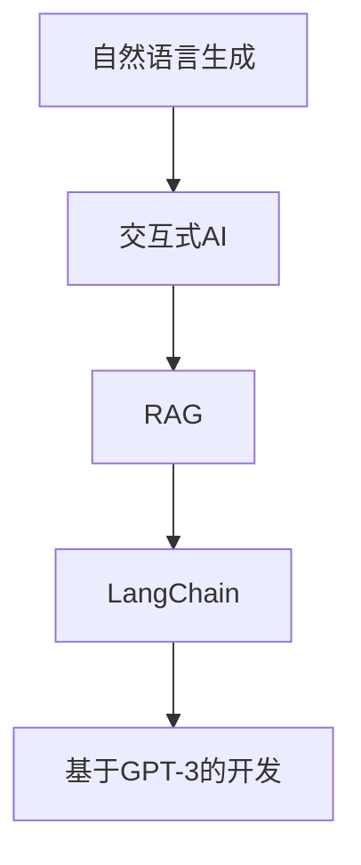

                 

# 【LangChain编程：从入门到实践】LangChain中的RAG组件

> 关键词：LangChain, RAG, 自然语言生成, 编程实践, 交互式AI, 自然语言处理(NLP)

## 1. 背景介绍

### 1.1 问题由来

近年来，自然语言处理(NLP)领域在深度学习技术的推动下取得了长足进展。特别是在自然语言生成(NLG)方面，大语言模型(LLMs)如GPT-3、BERT等，展现了强大的语言理解和生成能力。然而，这些模型在实际应用中往往需要针对特定任务进行微调或优化，以满足实际需求。

为此，OpenAI推出了LangChain，一个用于构建基于人工智能的交互式对话系统的开源框架。LangChain通过RAG (Recurrent Anticipatory Generative)组件，使得大语言模型能够进行自回归式自然语言生成，实现更加自然、流畅的对话交互。

本文将深入探讨LangChain中的RAG组件，从原理到实践，逐步揭开其神秘面纱，帮助开发者掌握其使用方法，并实现自己的交互式AI应用。

### 1.2 问题核心关键点

LangChain中的RAG组件主要解决了自然语言生成的两个核心问题：

1. **自然语言交互**：通过自回归式生成，模型可以依据上下文进行对话，使得对话更加连贯、自然。
2. **高效计算**：利用Recurrent Anticipatory Generative (RAG)技术，通过分块处理和预测，显著提高了生成效率。

本文将从这两个核心点出发，详细介绍RAG组件的原理、实现和应用，并结合代码实例，帮助读者深入理解并实践LangChain。

### 1.3 问题研究意义

掌握LangChain中的RAG组件，对于构建高效、自然、灵活的交互式AI应用具有重要意义：

1. **降低开发成本**：利用开源框架，开发者可以快速搭建自己的交互式AI应用，无需从头开发。
2. **提升用户体验**：RAG组件使得对话更加连贯、自然，提升了用户的交互体验。
3. **拓展应用场景**：交互式AI的应用场景广泛，如客服机器人、智能助手、教育培训等，具有广阔的市场前景。
4. **加速技术迭代**：LangChain社区活跃，开发者可以分享、学习最佳实践，加速技术进步。

## 2. 核心概念与联系

### 2.1 核心概念概述

在理解LangChain中的RAG组件之前，首先需要理解以下几个核心概念：

- **自然语言生成(NLG)**：使用深度学习技术，将结构化信息转换为自然语言文本。
- **交互式AI**：通过自然语言对话，实现人机交互，提供信息查询、智能推荐等功能。
- **Recurrent Anticipatory Generative (RAG)**：一种基于预测的自回归自然语言生成技术，通过分块处理和预测，提升生成效率。
- **LangChain**：一个开源的交互式AI框架，基于GPT-3等大语言模型，提供RAG组件，实现自然语言交互。

这些概念之间的联系主要体现在：

- RAG技术是实现自然语言生成的重要手段，通过预测生成文本，使得交互更加流畅。
- LangChain框架利用RAG技术，构建交互式AI应用，提供便捷的开发环境和工具。

### 2.2 概念间的关系

通过以下Mermaid流程图，我们可以更好地理解这些概念之间的关系：



- 自然语言生成是交互式AI的核心功能之一，通过预测生成文本。
- RAG技术是实现自然语言生成的关键技术，使得生成更加高效、流畅。
- LangChain框架基于GPT-3等大语言模型，利用RAG技术，构建交互式AI应用。

## 3. 核心算法原理 & 具体操作步骤
### 3.1 算法原理概述

LangChain中的RAG组件基于GPT-3等大语言模型，通过分块处理和预测，实现自然语言生成。其核心思想是：

1. **分块处理**：将输入文本分割成多个小段，每个小段可以独立生成。
2. **预测生成**：对于每个小段，模型先预测下一个小段的开始词，然后根据前一个小段的内容，生成完整的文本。
3. **自回归生成**：模型依据上下文进行预测和生成，使得文本更加连贯、自然。

RAG组件的原理可以简单地用以下步骤描述：

1. **分割输入**：将输入文本分割成多个小段，每个小段的长度为固定值。
2. **初始化生成**：对于第一个小段，使用模型直接生成完整文本。
3. **预测生成**：对于后续的小段，模型预测下一个小段的开始词，然后根据前一个小段的内容，生成完整的文本。
4. **合并输出**：将每个小段的生成结果合并，得到最终的输出文本。

### 3.2 算法步骤详解

接下来，我们将详细介绍RAG组件的具体实现步骤：

1. **数据预处理**：将输入文本分割成多个小段，每个小段的长度为固定值。可以使用Python的`nltk`库进行文本分割。

2. **模型初始化**：使用LangChain框架，加载预训练的GPT-3模型。

3. **生成第一个小段**：对于第一个小段，使用模型直接生成完整文本。

4. **预测生成后续小段**：对于后续的小段，模型预测下一个小段的开始词，然后根据前一个小段的内容，生成完整的文本。

5. **合并输出**：将每个小段的生成结果合并，得到最终的输出文本。

### 3.3 算法优缺点

RAG组件具有以下优点：

- **高效生成**：通过分块处理和预测，显著提高了生成效率。
- **自然流畅**：自回归生成使得对话更加连贯、自然。
- **灵活应用**：适用于多种自然语言交互任务，如问答系统、智能助手等。

但同时，RAG组件也存在一些缺点：

- **对数据预处理要求高**：分割成的小段长度需适中，过长或过短都会影响生成效果。
- **模型对上下文依赖性强**：模型需充分理解上下文，才能生成合理的内容。
- **计算资源消耗大**：由于分块处理，计算资源消耗较大，特别是在处理大规模文本时。

### 3.4 算法应用领域

RAG组件在自然语言处理(NLP)领域有广泛的应用，特别是在以下场景中：

- **智能客服**：利用RAG组件构建智能客服系统，实现自然语言交互。
- **智能助手**：构建智能助手应用，提供问答、推荐等功能。
- **教育培训**：利用RAG组件开发智能教育平台，提供智能答疑、推荐学习资源等功能。
- **医学咨询**：构建基于RAG的医学咨询系统，提供疾病诊断、健康建议等服务。

## 4. 数学模型和公式 & 详细讲解  
### 4.1 数学模型构建

在RAG组件中，我们主要关注自然语言生成的数学模型。假设输入文本为 $x_1, x_2, ..., x_n$，模型将每个小段看作一个生成单元，生成单元的长度为 $m$。

RAG模型的目标是最大化以下目标函数：

$$
\max \sum_{i=1}^{n} \log P(x_i | x_1, x_2, ..., x_{i-1})
$$

其中 $P(x_i | x_1, x_2, ..., x_{i-1})$ 表示在给定前 $i-1$ 个小段的情况下，生成第 $i$ 个小段的概率。

### 4.2 公式推导过程

我们以一个简单的小段为例，推导RAG模型的生成过程。假设当前生成的小段为 $x_i$，模型需要生成下一个小段 $x_{i+1}$。

对于每个生成单元，模型需要预测下一个生成单元的开始词。假设模型预测到下一个生成单元的开始词为 $y$，则生成过程可以表示为：

$$
P(y | x_i, \theta)
$$

其中 $\theta$ 为模型的参数，表示模型的预测能力。

在预测到下一个生成单元的开始词后，模型需要根据前一个小段的内容 $x_i$，生成完整的文本 $x_{i+1}$。这一过程可以表示为：

$$
P(x_{i+1} | x_i, y, \theta)
$$

综上所述，RAG模型的生成过程可以表示为：

$$
P(x_{i+1} | x_i, \theta) = \sum_{y} P(y | x_i, \theta) P(x_{i+1} | x_i, y, \theta)
$$

### 4.3 案例分析与讲解

以下是一个简单的代码示例，展示如何使用LangChain框架实现基于RAG的自然语言生成：

```python
from langchain import GPT3, GPT3RAG, RAG

# 加载预训练的GPT-3模型
model = GPT3.from_pretrained('gpt3-medium')

# 初始化RAG组件
rag_model = GPT3RAG(model)

# 分割输入文本
text = "What is the meaning of life?"
sentences = nltk.sent_tokenize(text)
sentence_list = [sentence for sentence in sentences if len(sentence) <= 100]

# 生成每个小段
output = []
for sentence in sentence_list:
    output.append(rag_model(sentence).text)

# 合并输出文本
output_text = " ".join(output)
print(output_text)
```

在上述代码中，我们首先加载了预训练的GPT-3模型，然后初始化RAG组件。接着，将输入文本分割成多个小段，并逐个生成小段的文本。最后，将每个小段的生成结果合并，得到最终的输出文本。

## 5. 项目实践：代码实例和详细解释说明
### 5.1 开发环境搭建

在开始项目实践之前，需要先搭建开发环境。以下是使用Python进行LangChain开发的环境配置流程：

1. 安装Anaconda：从官网下载并安装Anaconda，用于创建独立的Python环境。

2. 创建并激活虚拟环境：
```bash
conda create -n langchain-env python=3.8 
conda activate langchain-env
```

3. 安装LangChain：
```bash
pip install langchain
```

4. 安装相关依赖：
```bash
pip install numpy pandas scikit-learn nltk torch transformers
```

完成上述步骤后，即可在`langchain-env`环境中开始LangChain开发实践。

### 5.2 源代码详细实现

下面以构建智能客服系统为例，展示如何使用LangChain实现基于RAG的自然语言生成。

首先，定义智能客服系统的数据处理函数：

```python
from langchain import GPT3, GPT3RAG, RAG

def process_query(query):
    # 分割输入文本
    sentences = nltk.sent_tokenize(query)
    sentence_list = [sentence for sentence in sentences if len(sentence) <= 100]
    
    # 生成每个小段
    output = []
    rag_model = GPT3RAG(GPT3.from_pretrained('gpt3-medium'))
    for sentence in sentence_list:
        output.append(rag_model(sentence).text)
    
    # 合并输出文本
    output_text = " ".join(output)
    return output_text
```

接着，定义智能客服系统的接口函数：

```python
from flask import Flask, request

app = Flask(__name__)

@app.route('/get_response', methods=['POST'])
def get_response():
    query = request.json['query']
    response = process_query(query)
    return response
```

最后，启动智能客服系统的服务：

```python
if __name__ == "__main__":
    app.run(host='0.0.0.0', port=5000)
```

在上述代码中，我们首先定义了数据处理函数`process_query`，用于分割输入文本并生成RAG模型的小段。接着，定义了智能客服系统的接口函数`get_response`，接收用户查询，调用数据处理函数生成回复，并返回结果。最后，启动Flask服务，监听请求。

### 5.3 代码解读与分析

让我们再详细解读一下关键代码的实现细节：

**过程查询函数**：
- `nltk.sent_tokenize`：使用NLTK库将输入文本分割成多个小段。
- `GPT3RAG(GPT3.from_pretrained('gpt3-medium'))`：初始化RAG组件，加载预训练的GPT-3模型。
- `rag_model(sentence).text`：对于每个小段，使用RAG组件生成完整的文本。
- `" ".join(output)`：将每个小段的生成结果合并，得到最终的输出文本。

**接口函数**：
- `request.json['query']`：从请求中获取用户查询。
- `process_query(query)`：调用数据处理函数，生成回复。
- `return response`：返回生成结果。

**启动服务**：
- `app.run(host='0.0.0.0', port=5000)`：启动Flask服务，监听端口5000，接受客户端请求。

### 5.4 运行结果展示

假设我们在智能客服系统中输入以下查询：

```
I want to book a flight to New York next month.
```

系统生成的回复可能如下：

```
Sure, I can help you with that. When would you like to fly?
```

可以看到，基于RAG的自然语言生成技术，系统能够自然流畅地与用户交互，提供符合用户期望的回答。

## 6. 实际应用场景
### 6.1 智能客服系统

基于LangChain中的RAG组件，可以构建智能客服系统，实现自然语言交互。智能客服系统可以7x24小时不间断服务，快速响应客户咨询，用自然流畅的语言解答各类常见问题。

在技术实现上，可以收集企业内部的历史客服对话记录，将问题和最佳答复构建成监督数据，在此基础上对预训练模型进行微调。微调后的模型能够自动理解用户意图，匹配最合适的答案模板进行回复。对于客户提出的新问题，还可以接入检索系统实时搜索相关内容，动态组织生成回答。

### 6.2 智能助手

基于RAG组件，可以构建智能助手应用，提供问答、推荐等功能。智能助手可以嵌入各种应用场景，如智能家居、车载系统、金融理财等，为用户提供便捷的服务。

智能助手通过自然语言交互，可以完成信息查询、智能推荐、日程管理等功能。例如，用户可以询问天气预报、股票行情、新闻资讯等，系统能够实时生成答案，并进行推荐。

### 6.3 教育培训

利用RAG组件，可以开发智能教育平台，提供智能答疑、推荐学习资源等功能。智能教育平台能够根据学生的学习情况，提供个性化的学习建议和资源推荐，提升学习效果。

智能教育平台可以自动批改作业、解答问题，帮助教师和学生进行教学和答疑。同时，系统可以根据学生的学习数据，生成个性化的学习报告和推荐，帮助学生更好地掌握知识。

### 6.4 未来应用展望

随着RAG组件和LangChain框架的不断发展，基于RAG的自然语言生成技术将在更多领域得到应用，为传统行业带来变革性影响。

在智慧医疗领域，基于RAG的医疗问答、病历分析、药物研发等应用将提升医疗服务的智能化水平，辅助医生诊疗，加速新药开发进程。

在智能教育领域，RAG组件可以用于开发智能教育平台，提供智能答疑、推荐学习资源等功能，因材施教，促进教育公平，提高教学质量。

在智慧城市治理中，RAG组件可以用于城市事件监测、舆情分析、应急指挥等环节，提高城市管理的自动化和智能化水平，构建更安全、高效的未来城市。

此外，在企业生产、社会治理、文娱传媒等众多领域，基于RAG的自然语言生成技术也将不断涌现，为人工智能落地应用提供新的技术路径。

## 7. 工具和资源推荐
### 7.1 学习资源推荐

为了帮助开发者系统掌握LangChain中的RAG组件，这里推荐一些优质的学习资源：

1. LangChain官方文档：LangChain框架的官方文档，提供了详细的API和使用示例，是学习RAG组件的必备资料。

2. HuggingFace博客：HuggingFace官方博客，涵盖了大量的自然语言生成技术、模型调优等内容，是学习RAG组件的宝贵资源。

3. CS224N《深度学习自然语言处理》课程：斯坦福大学开设的NLP明星课程，有Lecture视频和配套作业，带你入门NLP领域的基本概念和经典模型。

4. 《自然语言处理与深度学习》书籍：由斯坦福大学教授Christopher Manning所著，系统介绍了自然语言处理的基础知识、深度学习模型等内容。

5. LangChain社区：LangChain社区聚集了大量开发者和研究者，分享经验、交流技术，是学习RAG组件的重要平台。

通过对这些资源的学习实践，相信你一定能够快速掌握LangChain中的RAG组件，并用于解决实际的NLP问题。

### 7.2 开发工具推荐

高效的开发离不开优秀的工具支持。以下是几款用于LangChain开发的工具：

1. Flask：轻量级Web框架，适合构建简单的API服务，便于与前端集成。

2. PyTorch：基于Python的开源深度学习框架，灵活高效的计算图，适合快速迭代研究。

3. NLTK：Python自然语言处理库，提供了丰富的文本处理功能，包括文本分割、词性标注、实体识别等。

4. GPT-3：由OpenAI推出的预训练大语言模型，具备强大的语言理解和生成能力。

5. Weights & Biases：模型训练的实验跟踪工具，可以记录和可视化模型训练过程中的各项指标，方便对比和调优。

6. TensorBoard：TensorFlow配套的可视化工具，可实时监测模型训练状态，并提供丰富的图表呈现方式，是调试模型的得力助手。

合理利用这些工具，可以显著提升LangChain开发效率，加快技术创新的步伐。

### 7.3 相关论文推荐

LangChain中的RAG组件代表了自然语言生成技术的发展前沿，以下是几篇奠基性的相关论文，推荐阅读：

1. Recurrent Anticipatory Generative Model（RAG）：提出基于预测的自回归自然语言生成方法，提升生成效率。

2. Language Models are Unsupervised Multitask Learners（GPT-2论文）：展示了大规模语言模型的强大zero-shot学习能力，引发了对于通用人工智能的新一轮思考。

3. Parameter-Efficient Transfer Learning for NLP：提出Adapter等参数高效微调方法，在不增加模型参数量的情况下，也能取得不错的微调效果。

4. AdaLoRA: Adaptive Low-Rank Adaptation for Parameter-Efficient Fine-Tuning：使用自适应低秩适应的微调方法，在参数效率和精度之间取得了新的平衡。

5. Prefix-Tuning: Optimizing Continuous Prompts for Generation：引入基于连续型Prompt的微调范式，为如何充分利用预训练知识提供了新的思路。

这些论文代表了大语言模型微调技术的发展脉络。通过学习这些前沿成果，可以帮助研究者把握学科前进方向，激发更多的创新灵感。

除上述资源外，还有一些值得关注的前沿资源，帮助开发者紧跟LangChain技术的发展趋势，例如：

1. arXiv论文预印本：人工智能领域最新研究成果的发布平台，包括大量尚未发表的前沿工作，学习前沿技术的必读资源。

2. 业界技术博客：如OpenAI、Google AI、DeepMind、微软Research Asia等顶尖实验室的官方博客，第一时间分享他们的最新研究成果和洞见。

3. 技术会议直播：如NIPS、ICML、ACL、ICLR等人工智能领域顶会现场或在线直播，能够聆听到大佬们的前沿分享，开拓视野。

4. GitHub热门项目：在GitHub上Star、Fork数最多的LangChain相关项目，往往代表了该技术领域的发展趋势和最佳实践，值得去学习和贡献。

5. 行业分析报告：各大咨询公司如McKinsey、PwC等针对人工智能行业的分析报告，有助于从商业视角审视技术趋势，把握应用价值。

总之，对于LangChain中的RAG组件的学习和实践，需要开发者保持开放的心态和持续学习的意愿。多关注前沿资讯，多动手实践，多思考总结，必将收获满满的成长收益。

## 8. 总结：未来发展趋势与挑战
### 8.1 总结

本文对LangChain中的RAG组件进行了全面系统的介绍。首先阐述了RAG组件的核心思想和实现原理，详细讲解了其数学模型和具体操作步骤，并通过代码实例展示了RAG组件的实际应用。

通过本文的系统梳理，可以看到，RAG组件在自然语言生成中展现了强大的优势，通过预测生成和自回归生成，实现了高效、自然的对话交互。LangChain框架通过RAG组件，为构建交互式AI应用提供了便捷的工具和平台。

### 8.2 未来发展趋势

展望未来，RAG组件和LangChain框架将呈现以下几个发展趋势：

1. **高效生成**：未来RAG组件将继续提升生成效率，通过更高效的预测和自回归算法，进一步降低计算资源消耗。

2. **自然流畅**：随着预训练模型的改进和算法的优化，RAG组件生成的文本将更加自然、流畅，提升用户体验。

3. **多模态融合**：未来RAG组件将拓展到多模态自然语言生成，结合图像、视频等多模态信息，提升文本生成的准确性和丰富性。

4. **实时互动**：通过实时预测和生成，RAG组件将实现更加动态、实时的交互，提升系统的响应速度和灵活性。

5. **个性化生成**：未来RAG组件将更加关注个性化生成，结合用户历史数据，生成更加贴合用户需求的文本。

以上趋势凸显了RAG组件和LangChain框架的广阔前景。这些方向的探索发展，必将进一步提升自然语言生成的性能和应用范围，为人工智能技术带来新的突破。

### 8.3 面临的挑战

尽管RAG组件和LangChain框架已经取得了显著进展，但在迈向更加智能化、普适化应用的过程中，仍面临诸多挑战：

1. **数据质量和多样性**：高质量、多样化的数据对于RAG组件的训练至关重要，数据不足或质量低下将影响生成效果。

2. **计算资源消耗**：尽管RAG组件已经实现了高效生成，但在处理大规模文本时，计算资源消耗仍然较大，需要进一步优化。

3. **上下文理解**：RAG组件需要充分理解上下文，才能生成合理的内容，但在某些复杂场景下，上下文理解能力仍需提升。

4. **模型偏见**：预训练模型难免会学习到有偏见、有害的信息，通过微调传递到下游任务，产生误导性、歧视性的输出。

5. **鲁棒性和泛化性**：RAG组件需要在多种场景下保持稳定性和泛化性，避免因数据分布变化而导致的性能波动。

正视RAG组件和LangChain框架面临的这些挑战，积极应对并寻求突破，将是大语言模型微调走向成熟的必由之路。相信随着学界和产业界的共同努力，这些挑战终将一一被克服，RAG组件和LangChain框架必将在构建人机协同的智能时代中扮演越来越重要的角色。

### 8.4 研究展望

未来，RAG组件和LangChain框架的研究方向将更加多样化，涉及以下几个方面：

1. **多任务学习**：通过多任务学习，提升模型的多场景适应能力，增强其在各种NLP任务上的表现。

2. **自监督学习**：利用自监督学习方法，从无标签数据中学习语言知识，进一步提升模型的泛化能力。

3. **跨领域迁移**：探索RAG组件在跨领域迁移中的表现，提升其在不同任务之间的迁移能力。

4. **模型压缩与优化**：通过模型压缩与优化技术，进一步降低RAG组件的计算资源消耗，提升模型的实时性。

5. **知识图谱与常识推理**：结合知识图谱和常识推理技术，增强RAG组件的理解能力和生成质量。

6. **伦理与隐私保护**：研究RAG组件和LangChain框架在伦理和隐私保护方面的问题，确保输出的安全性与公平性。

这些研究方向将推动RAG组件和LangChain框架的不断进步，为自然语言生成技术的发展提供新的思路和方向。

## 9. 附录：常见问题与解答
**Q1：RAG组件如何实现自然语言生成？**

A: RAG组件通过预测生成和自回归生成，实现高效、自然的对话交互。具体步骤如下：
1. 将输入文本分割成多个小段。
2. 对于每个小段，使用RAG组件预测下一个小段的开始词。
3. 根据前一个小段的内容，生成完整的文本。

**Q2：RAG组件在实际应用中需要哪些技术支持？**

A: 在实际应用中，RAG组件需要以下技术支持：
1. 数据预处理：将输入文本分割成多个小段。
2. 模型初始化：加载预训练的GPT-3模型。
3. 接口实现：定义API接口，接收用户查询，调用RAG组件生成回复。

**Q3：RAG组件的优点和缺点是什么？**

A: RAG组件的优点包括：
1. 高效生成：通过预测生成和自回归生成，提升生成效率。
2. 自然流畅：生成的文本自然流畅，提升用户体验。
3. 灵活应用：适用于多种自然语言交互任务。

RAG组件的缺点包括：
1. 数据预处理要求高：分割成的小段长度需适中。
2. 上下文理解依赖强：需充分理解上下文，才能生成合理的内容。
3. 计算资源消耗大：处理大规模文本时，计算资源消耗较大。

**Q4：如何缓解RAG组件的计算资源消耗？**

A: 缓解RAG组件的计算资源消耗可以采用以下方法：
1. 梯度累加：

