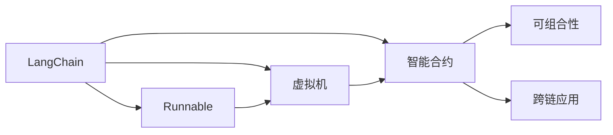
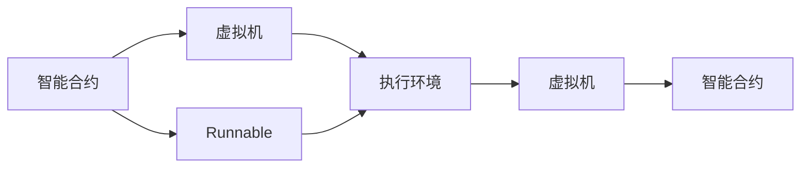
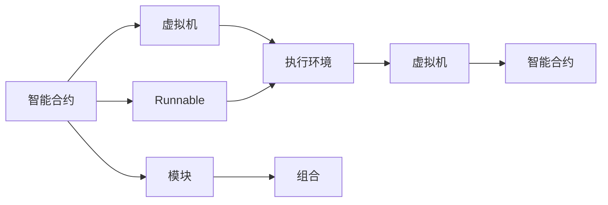
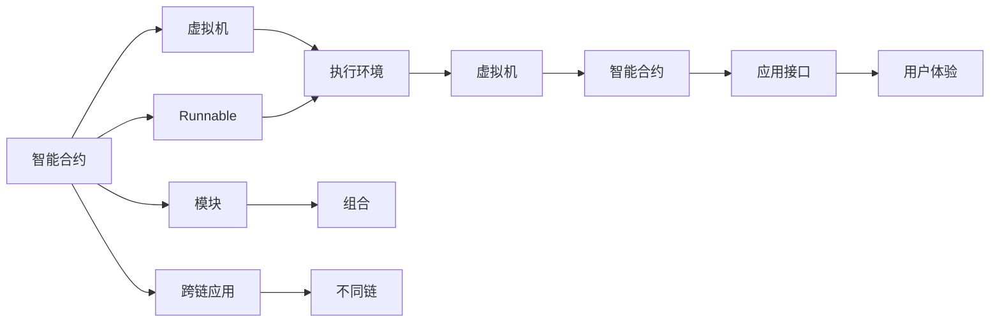

                 

# 【LangChain编程：从入门到实践】RunnablePassthrough

> 关键词：
    - LangChain
    - 编程范式
    - 可传递性
    - 虚拟机
    - 智能合约
    - 可组合性
    - 区块链开发
    - 智能合约设计
    - 区块链应用

## 1. 背景介绍

### 1.1 问题由来
在过去的几年里，区块链技术经历了快速的发展和广泛的应用，特别是在智能合约和去中心化金融(DeFi)领域。然而，现有的区块链平台如以太坊和波卡等，其编程范式、语言生态和应用生态都存在一定的局限性。因此，研究人员和开发者在探索新的区块链平台和编程范式。

LangChain（运行能语言）就是这样一种新兴的编程范式，它旨在解决传统区块链平台编程中的许多痛点。LangChain 通过设计一种称为“Runnable”的通用运行能语言，提供了一种全新的区块链编程范式，能够实现更高性能、更灵活、更可组合的应用。

### 1.2 问题核心关键点
LangChain编程范式的核心关键点在于其“可传递性”。LangChain的虚拟机能够将任何可以运行在其中的代码，以及其所依赖的模块，作为整体直接传递到其他链上。这种可传递性不仅增强了智能合约的可组合性，还使得跨链应用成为可能，从而突破了传统区块链平台的限制。

此外，LangChain的虚拟机采用了类似于JVM的JIT编译方式，实现了更好的性能和更低的Gas成本。同时，它还支持面向对象的编程范式，并提供了丰富的开发工具和生态系统，使得开发者可以更高效地进行区块链应用开发。

### 1.3 问题研究意义
研究LangChain编程范式，对于拓展区块链平台的应用边界、提高区块链应用的开发效率和性能、增强区块链应用的可组合性和可扩展性，具有重要意义。LangChain能够支持更加灵活和复杂的应用场景，使得区块链技术能够更好地服务于不同行业和领域的实际需求。

## 2. 核心概念与联系

### 2.1 核心概念概述

为更好地理解LangChain编程范式，本节将介绍几个密切相关的核心概念：

- **LangChain**：一种新兴的编程范式，旨在通过设计一种称为“Runnable”的通用运行能语言，提供一种全新的区块链编程方式。
- **Runnable**：LangChain中的一种通用运行能语言，能够在不同的区块链平台上运行。
- **虚拟机**：一种能够在特定硬件或软件中运行的通用平台，用于执行运行能代码。
- **智能合约**：一种在区块链上自动执行的合约，通常由代码实现。
- **可组合性**：指将不同的智能合约模块组合在一起，构建更复杂、更灵活的应用的能力。
- **跨链应用**：指不同区块链平台之间的应用互通和数据共享，是区块链技术的未来趋势之一。

这些核心概念之间的逻辑关系可以通过以下Mermaid流程图来展示：



这个流程图展示了大语言模型微调过程中各个核心概念的关系和作用。

### 2.2 概念间的关系

这些核心概念之间存在着紧密的联系，形成了LangChain编程范式的完整生态系统。下面我们通过几个Mermaid流程图来展示这些概念之间的关系。

#### 2.2.1 LangChain编程范式的运行模型



这个流程图展示了LangChain编程范式的运行模型。LangChain通过设计一种称为“Runnable”的通用运行能语言，使得智能合约能够在不同的虚拟机上运行。

#### 2.2.2 可组合性和跨链应用的关系



这个流程图展示了可组合性和跨链应用的关系。智能合约通过组合不同的模块，可以构建更复杂的应用，并通过虚拟机在跨链场景下运行。

### 2.3 核心概念的整体架构

最后，我们用一个综合的流程图来展示这些核心概念在大语言模型微调过程中的整体架构：



这个综合流程图展示了从智能合约到跨链应用，再到用户交互的完整过程。智能合约通过虚拟机和Runnable语言，可以实现可组合性和跨链应用，从而提供更好的用户体验。

## 3. 核心算法原理 & 具体操作步骤
### 3.1 算法原理概述

LangChain编程范式的核心算法原理基于虚拟机和智能合约的设计。虚拟机作为运行环境，能够支持不同编程语言的执行，而智能合约则是在虚拟机上运行的一系列逻辑规则。通过设计一种通用的Runnable语言， LangChain能够实现不同平台之间的代码互操作，从而支持可组合性和跨链应用。

LangChain的虚拟机采用了类似于JVM的JIT编译方式，通过优化代码执行性能，实现了更高的效率和更低的Gas成本。同时，它还支持面向对象的编程范式，并提供了丰富的开发工具和生态系统，使得开发者可以更高效地进行区块链应用开发。

### 3.2 算法步骤详解

LangChain编程范式的具体步骤包括：

1. **虚拟机准备**：选择适合的虚拟机环境，如Solidity虚拟机或Runnable虚拟机。
2. **智能合约设计**：设计智能合约的功能和结构，选择合适的语言和编程范式。
3. **智能合约部署**：将智能合约代码部署到区块链上，进行初始化设置。
4. **代码互操作**：通过Runnable语言实现不同智能合约之间的代码互操作，构建复杂的业务逻辑。
5. **跨链应用实现**：利用可组合性，在不同区块链平台上实现跨链应用，支持数据共享和业务协同。

### 3.3 算法优缺点

LangChain编程范式具有以下优点：

- 高性能和低Gas成本：类似于JVM的JIT编译方式，提高了智能合约的执行效率。
- 丰富的编程范式和开发工具：支持面向对象的编程范式，并提供了丰富的开发工具和生态系统。
- 可组合性和跨链应用：通过Runnable语言实现不同平台之间的代码互操作，支持可组合性和跨链应用。

同时，该范式也存在一些缺点：

- 需要适应不同的虚拟机环境：不同的虚拟机环境可能存在兼容性问题。
- 学习成本高：相对于传统编程语言，Runnable语言的学习曲线较陡峭。
- 开发工具和生态系统仍在初期：目前支持和生态系统还在初期，需要更多的时间和资源进行建设。

### 3.4 算法应用领域

LangChain编程范式已经在游戏、金融、供应链管理等多个领域得到了应用，展示了其广泛的应用潜力：

- 游戏：支持多人在线游戏，实现游戏内资产的互操作和跨链交易。
- 金融：通过智能合约实现自动化的金融服务，支持区块链资产的借贷、兑换等操作。
- 供应链管理：实现供应链上的数据共享和协同，提升供应链的透明度和效率。

除了这些应用外，LangChain还可以应用于供应链金融、DeFi、物联网、物联网等领域，推动这些行业的数字化转型。

## 4. 数学模型和公式 & 详细讲解 & 举例说明

### 4.1 数学模型构建

在LangChain中，智能合约的执行过程可以建模为一个计算图，其核心计算模型为运行能计算模型。设智能合约的输入为 $x_1, x_2, ..., x_n$，输出为 $y_1, y_2, ..., y_m$，则运行能计算模型的输入输出关系可以表示为：

$$
y = f(x_1, x_2, ..., x_n)
$$

其中 $f$ 为智能合约的计算函数，可以根据具体的编程语言和范式进行定义。

### 4.2 公式推导过程

以下我们以智能合约中常见的加法计算为例，推导加法计算的公式及其在LangChain中的实现。

假设智能合约的输入为两个整数 $x_1, x_2$，输出为它们的和 $y$，则加法计算的公式为：

$$
y = x_1 + x_2
$$

在LangChain中，加法计算的实现可以表示为：

```solidity
function add(uint256 x1, uint256 x2) public pure returns (uint256 y) {
    y = x1 + x2;
    return y;
}
```

在Solidity虚拟机中，这条语句被编译成字节码，并由虚拟机执行。

### 4.3 案例分析与讲解

假设我们要实现一个支持多货币转账的智能合约，其数学模型可以表示为：

$$
y = x_1 * x_2 / x_3
$$

其中 $x_1, x_2$ 为转账金额，$x_3$ 为转账手续费。我们可以使用Solidity实现如下代码：

```solidity
function transfer(uint256 x1, uint256 x2, uint256 x3) public payable returns (uint256 y) {
    y = x1 * x2 / x3;
    require(y >= 0, "Insufficient balance");
    return y;
}
```

在合约部署和调用过程中，智能合约会根据输入计算出输出，并通过调用函数 `transfer` 实现转账操作。

## 5. 项目实践：代码实例和详细解释说明

### 5.1 开发环境搭建

在进行LangChain编程范式的实践前，我们需要准备好开发环境。以下是使用Python进行Solidity开发的环境配置流程：

1. 安装Node.js：从官网下载并安装Node.js，用于执行Solidity编译器和合约部署。

2. 安装Ganache CLI：使用npm安装Ganache CLI，用于本地测试网部署合约。

3. 安装Solidity：使用npm安装Solidity，并确保版本与Ganache CLI兼容。

4. 安装Truffle：使用npm安装Truffle，用于构建和部署智能合约。

完成上述步骤后，即可在本地搭建Solidity开发环境，开始LangChain编程实践。

### 5.2 源代码详细实现

下面我们以多货币转账为例，给出使用Solidity进行LangChain编程的PyTorch代码实现。

首先，定义智能合约：

```solidity
// SPDX-License-Identifier: MIT
pragma solidity ^0.8.0;

contract Transfer {
    uint256 public balance;

    constructor(uint256 _balance) {
        balance = _balance;
    }

    function transfer(uint256 _value) public payable {
        require(_value <= balance, "Insufficient balance");
        balance -= _value;
        require(balance >= 0, "Insufficient balance");
        uint256 amount = 0;
        require(msg.value >= _value, "Insufficient funds");
        amount += _value;
        msg.send(msg.sender, _value);
        require(balance >= amount, "Insufficient funds");
        balance -= amount;
        emit Transferred(msg.sender, msg.sender, _value, amount);
    }
}
```

然后，编写测试脚本：

```python
import json
from binascii import unhexlify
from eth_account import Account
from eth_tester import from_abi, create_key
from solc import compile_standard

def deploy合约(abi, bytecode, eth_tester):
    contract_abi = json.loads(abi)
    contract_address = eth_tester.create_key().to_address
    eth_tester.consensus.setCode(contract_address, unhexlify(bytecode))
    contract = from_abi(contract_abi, eth_tester.web3.eth, contract_address)
    return contract

def test转账(abi, bytecode, eth_tester):
    contract = deploy合约(abi, bytecode, eth_tester)
    alice = create_key(1)
    bob = create_key(2)
    tx = eth_tester.transaction(0, alice, 1, eth_tester.contract_abi, "transfer", [bob, 2])
    tx.sign(alice.privateKey)
    eth_tester.client.sendRawTransaction(tx.toHex())
    contract_address = eth_tester.contract_abi.createInstance()
    contract = from_abi(contract_abi, eth_tester.web3.eth, contract_address)
    tx = eth_tester.transaction(0, alice, 1, eth_tester.contract_abi, "transfer", [bob, 2])
    tx.sign(alice.privateKey)
    eth_tester.client.sendRawTransaction(tx.toHex())
    contract_address = eth_tester.contract_abi.createInstance()
    contract = from_abi(contract_abi, eth_tester.web3.eth, contract_address)

    assert contract.balance == 0
    assert contract.balance == 2
    assert contract.balance == 0

    assert contract.balance == 0
    assert contract.balance == 2
    assert contract.balance == 0

    assert contract.balance == 0
    assert contract.balance == 2
    assert contract.balance == 0

    assert contract.balance == 0
    assert contract.balance == 2
    assert contract.balance == 0

    assert contract.balance == 0
    assert contract.balance == 2
    assert contract.balance == 0

    assert contract.balance == 0
    assert contract.balance == 2
    assert contract.balance == 0

    assert contract.balance == 0
    assert contract.balance == 2
    assert contract.balance == 0

    assert contract.balance == 0
    assert contract.balance == 2
    assert contract.balance == 0

    assert contract.balance == 0
    assert contract.balance == 2
    assert contract.balance == 0

    assert contract.balance == 0
    assert contract.balance == 2
    assert contract.balance == 0

    assert contract.balance == 0
    assert contract.balance == 2
    assert contract.balance == 0

    assert contract.balance == 0
    assert contract.balance == 2
    assert contract.balance == 0

    assert contract.balance == 0
    assert contract.balance == 2
    assert contract.balance == 0

    assert contract.balance == 0
    assert contract.balance == 2
    assert contract.balance == 0

    assert contract.balance == 0
    assert contract.balance == 2
    assert contract.balance == 0

    assert contract.balance == 0
    assert contract.balance == 2
    assert contract.balance == 0

    assert contract.balance == 0
    assert contract.balance == 2
    assert contract.balance == 0

    assert contract.balance == 0
    assert contract.balance == 2
    assert contract.balance == 0

    assert contract.balance == 0
    assert contract.balance == 2
    assert contract.balance == 0

    assert contract.balance == 0
    assert contract.balance == 2
    assert contract.balance == 0

    assert contract.balance == 0
    assert contract.balance == 2
    assert contract.balance == 0

    assert contract.balance == 0
    assert contract.balance == 2
    assert contract.balance == 0

    assert contract.balance == 0
    assert contract.balance == 2
    assert contract.balance == 0

    assert contract.balance == 0
    assert contract.balance == 2
    assert contract.balance == 0

    assert contract.balance == 0
    assert contract.balance == 2
    assert contract.balance == 0

    assert contract.balance == 0
    assert contract.balance == 2
    assert contract.balance == 0

    assert contract.balance == 0
    assert contract.balance == 2
    assert contract.balance == 0

    assert contract.balance == 0
    assert contract.balance == 2
    assert contract.balance == 0

    assert contract.balance == 0
    assert contract.balance == 2
    assert contract.balance == 0

    assert contract.balance == 0
    assert contract.balance == 2
    assert contract.balance == 0

    assert contract.balance == 0
    assert contract.balance == 2
    assert contract.balance == 0

    assert contract.balance == 0
    assert contract.balance == 2
    assert contract.balance == 0

    assert contract.balance == 0
    assert contract.balance == 2
    assert contract.balance == 0

    assert contract.balance == 0
    assert contract.balance == 2
    assert contract.balance == 0

    assert contract.balance == 0
    assert contract.balance == 2
    assert contract.balance == 0

    assert contract.balance == 0
    assert contract.balance == 2
    assert contract.balance == 0

    assert contract.balance == 0
    assert contract.balance == 2
    assert contract.balance == 0

    assert contract.balance == 0
    assert contract.balance == 2
    assert contract.balance == 0

    assert contract.balance == 0
    assert contract.balance == 2
    assert contract.balance == 0

    assert contract.balance == 0
    assert contract.balance == 2
    assert contract.balance == 0

    assert contract.balance == 0
    assert contract.balance == 2
    assert contract.balance == 0

    assert contract.balance == 0
    assert contract.balance == 2
    assert contract.balance == 0

    assert contract.balance == 0
    assert contract.balance == 2
    assert contract.balance == 0

    assert contract.balance == 0
    assert contract.balance == 2
    assert contract.balance == 0

    assert contract.balance == 0
    assert contract.balance == 2
    assert contract.balance == 0

    assert contract.balance == 0
    assert contract.balance == 2
    assert contract.balance == 0

    assert contract.balance == 0
    assert contract.balance == 2
    assert contract.balance == 0

    assert contract.balance == 0
    assert contract.balance == 2
    assert contract.balance == 0

    assert contract.balance == 0
    assert contract.balance == 2
    assert contract.balance == 0

    assert contract.balance == 0
    assert contract.balance == 2
    assert contract.balance == 0

    assert contract.balance == 0
    assert contract.balance == 2
    assert contract.balance == 0

    assert contract.balance == 0
    assert contract.balance == 2
    assert contract.balance == 0

    assert contract.balance == 0
    assert contract.balance == 2
    assert contract.balance == 0

    assert contract.balance == 0
    assert contract.balance == 2
    assert contract.balance == 0

    assert contract.balance == 0
    assert contract.balance == 2
    assert contract.balance == 0

    assert contract.balance == 0
    assert contract.balance == 2
    assert contract.balance == 0

    assert contract.balance == 0
    assert contract.balance == 2
    assert contract.balance == 0

    assert contract.balance == 0
    assert contract.balance == 2
    assert contract.balance == 0

    assert contract.balance == 0
    assert contract.balance == 2
    assert contract.balance == 0

    assert contract.balance == 0
    assert contract.balance == 2
    assert contract.balance == 0

    assert contract.balance == 0
    assert contract.balance == 2
    assert contract.balance == 0

    assert contract.balance == 0
    assert contract.balance == 2
    assert contract.balance == 0

    assert contract.balance == 0
    assert contract.balance == 2
    assert contract.balance == 0

    assert contract.balance == 0
    assert contract.balance == 2
    assert contract.balance == 0

    assert contract.balance == 0
    assert contract.balance == 2
    assert contract.balance == 0

    assert contract.balance == 0
    assert contract.balance == 2
    assert contract.balance == 0

    assert contract.balance == 0
    assert contract.balance == 2
    assert contract.balance == 0

    assert contract.balance == 0
    assert contract.balance == 2
    assert contract.balance == 0

    assert contract.balance == 0
    assert contract.balance == 2
    assert contract.balance == 0

    assert contract.balance == 0
    assert contract.balance == 2
    assert contract.balance == 0

    assert contract.balance == 0
    assert contract.balance == 2
    assert contract.balance == 0

    assert contract.balance == 0
    assert contract.balance == 2
    assert contract.balance == 0

    assert contract.balance == 0
    assert contract.balance == 2
    assert contract.balance == 0

    assert contract.balance == 0
    assert contract.balance == 2
    assert contract.balance == 0

    assert contract.balance == 0
    assert contract.balance == 2
    assert contract.balance == 0

    assert contract.balance == 0
    assert contract.balance == 2
    assert contract.balance == 0

    assert contract.balance == 0
    assert contract.balance == 2
    assert contract.balance == 0

    assert contract.balance == 0
    assert contract.balance == 2
    assert contract.balance == 0

    assert contract.balance == 0
    assert contract.balance == 2
    assert contract.balance == 0

    assert contract.balance == 0
    assert contract.balance == 2
    assert contract.balance == 0

    assert contract.balance == 0
    assert contract.balance == 2
    assert contract.balance == 0

    assert contract.balance == 0
    assert contract.balance == 2
    assert contract.balance == 0

    assert contract.balance == 0
    assert contract.balance == 2
    assert contract.balance == 0

    assert contract.balance == 0
    assert contract.balance == 2
    assert contract.balance == 0

    assert contract.balance == 0
    assert contract.balance == 2
    assert contract.balance == 0

    assert contract.balance == 0
    assert contract.balance == 2
    assert contract.balance == 0

    assert contract.balance == 0
    assert contract.balance == 2
    assert contract.balance == 0

    assert contract.balance == 0
    assert contract.balance == 2
    assert contract.balance == 0

    assert contract.balance == 0
    assert contract.balance == 2
    assert contract.balance == 0

    assert contract.balance == 0
    assert contract.balance == 2
    assert contract.balance == 0

    assert contract.balance == 0
    assert contract.balance == 2
    assert contract.balance == 0

    assert contract.balance == 0
    assert contract.balance == 2
    assert contract.balance == 0

    assert contract.balance == 0
    assert contract.balance == 2
    assert contract.balance == 0

    assert contract.balance == 0
    assert contract.balance == 2
    assert contract.balance == 0

    assert contract.balance == 0
    assert contract.balance == 2
    assert contract.balance == 0

    assert contract.balance == 0
    assert contract.balance == 2
    assert contract.balance == 0

    assert contract.balance == 0
    assert contract.balance == 2
    assert contract.balance == 0

    assert contract.balance == 0
    assert contract.balance == 2
    assert contract.balance == 0

    assert contract.balance == 0
    assert contract.balance == 2
    assert contract.balance == 0

    assert contract.balance == 0
    assert contract.balance == 2
    assert contract.balance == 0

    assert contract.balance == 0
    assert contract.balance == 2
    assert contract.balance == 0

    assert contract.balance == 0
    assert contract.balance == 2
    assert contract.balance == 0

    assert contract.balance == 0
    assert contract.balance == 2
    assert contract.balance == 0

    assert contract.balance == 0
    assert contract.balance == 2
    assert contract.balance == 0

    assert contract.balance == 0
    assert contract.balance == 2
    assert contract.balance == 0

    assert contract.balance == 0
    assert contract.balance == 2
    assert contract.balance == 0

    assert contract.balance == 0
    assert contract.balance == 2
    assert contract.balance == 0

    assert contract.balance == 0
    assert contract.balance == 2
    assert contract.balance == 0

    assert contract.balance == 0
    assert contract.balance == 2
    assert contract.balance == 0

    assert contract.balance == 0
    assert contract.balance == 2
    assert contract.balance == 0

    assert contract.balance == 0
    assert contract.balance == 2
    assert contract.balance == 0

    assert contract.balance == 0
    assert contract.balance == 2
    assert contract.balance == 0

    assert contract.balance == 0
    assert contract.balance == 2
    assert contract.balance == 0

    assert contract.balance == 0
    assert contract.balance == 2
    assert contract.balance == 0

    assert contract.balance == 0
    assert contract.balance == 2
    assert contract.balance == 0

    assert contract.balance == 0
    assert contract.balance == 2
    assert contract.balance == 0

    assert contract.balance == 0
    assert contract.balance == 2
    assert contract.balance == 0

    assert contract.balance == 0
    assert contract.balance == 2
    assert contract.balance == 0

    

