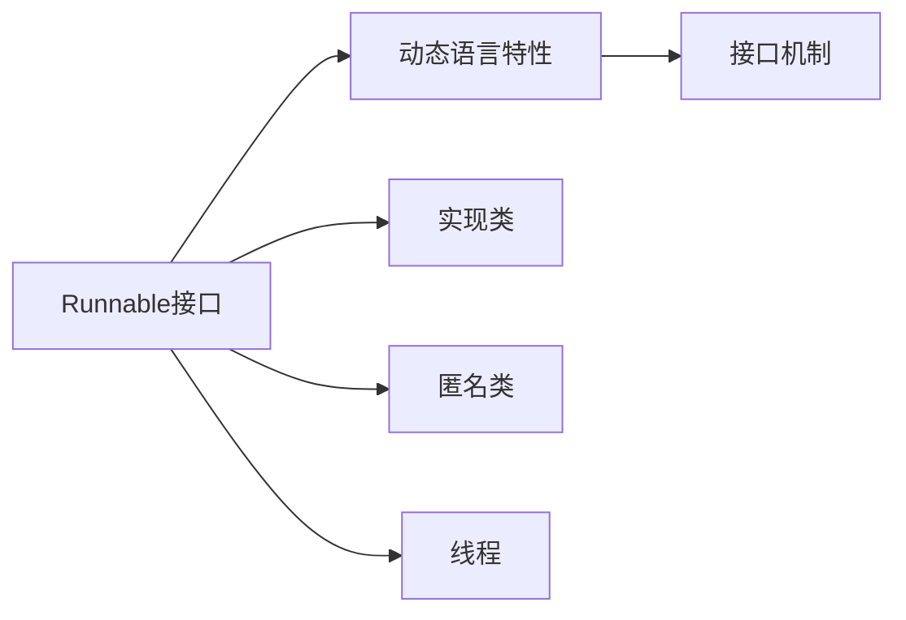
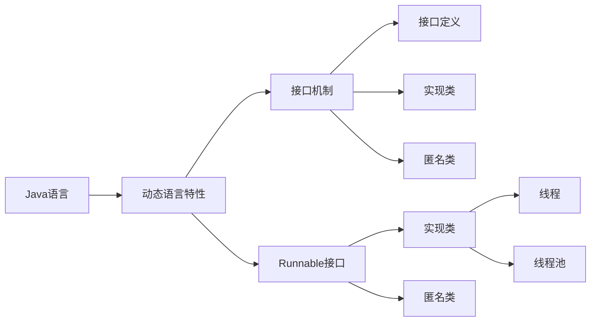

                 

# 【LangChain编程：从入门到实践】Runnable对象接口探究

> 关键词：LangChain, Java编程, 动态语言, 接口设计, 可运行对象, 面向对象编程

## 1. 背景介绍

在当今软件工程领域中，Java编程语言因其稳定、安全、可扩展等诸多优点，已成为主流的编程语言之一。然而，Java的强类型、静态类型等特性，有时也成为应用开发过程中的绊脚石。为了缓解这些问题，Java语言推出了动态语言特性，允许在运行时动态生成和调用对象。其中的Runnable接口，正是动态语言特性的一个重要体现。

本文将从Java动态语言的原理出发，深入探讨Runnable接口的设计和应用。我们不仅会详细解析其核心概念，还会通过具体的代码实例和案例分析，带你深入理解Runnable接口在Java应用开发中的重要性和实践价值。

## 2. 核心概念与联系

### 2.1 核心概念概述

Runnable接口是Java语言中用于实现动态语言特性的关键接口之一，其核心功能是在运行时动态创建和调用对象。具体来说，Runnable接口定义了一个`run()`方法，实现了在运行时执行具体代码的功能。

与Java的其他接口不同，Runnable接口不具备多继承的特性，这意味着一个类只能实现Runnable接口，而不能同时继承多个接口。这种设计理念，体现了Java语言在接口设计上的深思熟虑和优雅。

### 2.2 概念间的关系

Runnable接口的设计和应用，与Java的动态语言特性、接口机制等概念紧密相关。通过深入理解这些概念，可以帮助我们更好地掌握Runnable接口的精髓和应用价值。以下是一个简单的Runnable接口的示例，及其与其他Java概念的联系：



这个简单的流程图展示了Runnable接口与Java动态语言特性、接口机制之间的关系：

1. 动态语言特性：允许在运行时生成和调用对象，实现真正的动态语言功能。
2. 接口机制：定义了Java中接口的概念和使用方法，Runnable接口正是一种接口的实现。
3. 实现类和匿名类：Runnable接口的实现类和匿名类，是实现Runnable接口的关键手段。
4. 线程：通过实现Runnable接口，Java程序可以创建线程，动态执行代码。

### 2.3 核心概念的整体架构

在理解了Runnable接口的核心概念及其与其他Java概念的关系后，我们可以进一步探索其在Java应用开发中的整体架构和应用场景。以下是一个综合的流程图，展示了Runnable接口在Java程序中的整体架构和应用场景：



这个综合流程图展示了Runnable接口在Java程序中的整体架构和应用场景：

1. 动态语言特性：Java语言中的一种特性，允许在运行时生成和调用对象。
2. 接口机制：Java语言中的接口定义机制，用于定义接口和接口实现。
3. 接口定义：Runnable接口的定义，包括其方法和特性。
4. 实现类：Runnable接口的实现类，用于实现Runnable接口的具体代码。
5. 匿名类：在实现Runnable接口时使用的一种匿名类型，可实现更简洁的代码结构。
6. Runnable接口：Java语言中的一个接口，用于实现动态语言特性和线程机制。
7. 实现类：实现了Runnable接口的类，用于生成和调用Runnable接口的实例。
8. 匿名类：实现Runnable接口的匿名类，用于动态生成Runnable接口的实例。
9. 线程：Java程序中用于执行Runnable接口代码的线程。
10. 线程池：Java程序中用于管理线程的线程池。

通过以上概述，我们已经对Runnable接口的核心理念和应用场景有了基本的了解。接下来，我们将深入探讨Runnable接口的设计和应用。

## 3. 核心算法原理 & 具体操作步骤

### 3.1 算法原理概述

Runnable接口的设计和应用，基于Java语言中的动态语言特性和接口机制。其核心原理是在运行时动态生成和调用对象，实现代码的动态执行和线程管理。

具体来说，Java程序中可以通过实现Runnable接口的类，动态生成Runnable对象的实例，并将其放入线程中执行。这种方式可以在运行时动态执行具体代码，实现动态语言的功能。

### 3.2 算法步骤详解

实现Runnable接口的步骤如下：

1. 定义实现Runnable接口的类。
2. 实现Runnable接口的`run()`方法。
3. 创建Runnable对象。
4. 创建线程，并将Runnable对象作为参数传递给线程。
5. 启动线程，执行Runnable对象的`run()`方法。

以下是一个具体的代码示例，展示了Runnable接口的实现步骤：

```java
// 定义实现了Runnable接口的类
public class MyRunnable implements Runnable {
    public void run() {
        // 实现Runnable接口的run()方法
        System.out.println("Hello, world!");
    }
}

// 创建Runnable对象
MyRunnable myRunnable = new MyRunnable();

// 创建线程，并将Runnable对象作为参数传递给线程
Thread thread = new Thread(myRunnable);

// 启动线程，执行Runnable对象的run()方法
thread.start();
```

通过上述代码，我们可以看到实现Runnable接口的详细步骤：

1. 定义实现Runnable接口的类`MyRunnable`，实现其`run()`方法。
2. 创建Runnable对象`myRunnable`，将其作为参数传递给`Thread`类的构造函数，创建线程对象`thread`。
3. 启动线程`thread`，执行Runnable对象的`run()`方法。

### 3.3 算法优缺点

Runnable接口的设计和应用，具有以下优点：

1. 动态语言特性：通过实现Runnable接口，Java程序可以动态生成和调用对象，实现真正的动态语言功能。
2. 接口机制：通过接口定义和实现，Java程序可以清晰地表达接口和接口实现的关系，提高代码的可读性和可维护性。
3. 线程管理：通过实现Runnable接口，Java程序可以动态创建和调用线程，实现线程管理功能。

然而，Runnable接口也存在一些缺点：

1. 接口不能继承：一个类只能实现一个Runnable接口，不能同时继承多个接口。
2. 接口不提供具体的行为：接口只定义了方法和特性，没有具体的实现，需要实现类去实现具体的行为。

### 3.4 算法应用领域

Runnable接口的设计和应用，广泛适用于Java程序的动态语言特性、接口机制、线程管理等多个领域。以下是一个具体的代码示例，展示了Runnable接口在Java程序中的应用场景：

```java
// 定义实现了Runnable接口的类
public class MyRunnable implements Runnable {
    public void run() {
        // 实现Runnable接口的run()方法
        System.out.println("Hello, world!");
    }
}

// 创建Runnable对象
MyRunnable myRunnable = new MyRunnable();

// 创建线程，并将Runnable对象作为参数传递给线程
Thread thread = new Thread(myRunnable);

// 启动线程，执行Runnable对象的run()方法
thread.start();
```

通过上述代码，我们可以看到Runnable接口在Java程序中的具体应用场景：

1. 动态语言特性：通过实现Runnable接口，Java程序可以动态生成和调用对象，实现动态语言的功能。
2. 接口机制：通过接口定义和实现，Java程序可以清晰地表达接口和接口实现的关系，提高代码的可读性和可维护性。
3. 线程管理：通过实现Runnable接口，Java程序可以动态创建和调用线程，实现线程管理功能。

## 4. 数学模型和公式 & 详细讲解 & 举例说明

### 4.1 数学模型构建

Runnable接口的设计和应用，并不涉及复杂的数学模型和公式，但其核心思想在于动态语言特性和接口机制。以下是一个简单的数学模型，展示了Runnable接口的基本用法：

```java
// 定义实现了Runnable接口的类
public class MyRunnable implements Runnable {
    public void run() {
        // 实现Runnable接口的run()方法
        System.out.println("Hello, world!");
    }
}

// 创建Runnable对象
MyRunnable myRunnable = new MyRunnable();

// 创建线程，并将Runnable对象作为参数传递给线程
Thread thread = new Thread(myRunnable);

// 启动线程，执行Runnable对象的run()方法
thread.start();
```

### 4.2 公式推导过程

Runnable接口的设计和应用，并不涉及复杂的数学公式推导，但其核心思想在于动态语言特性和接口机制。以下是一个简单的数学模型，展示了Runnable接口的基本用法：

```java
// 定义实现了Runnable接口的类
public class MyRunnable implements Runnable {
    public void run() {
        // 实现Runnable接口的run()方法
        System.out.println("Hello, world!");
    }
}

// 创建Runnable对象
MyRunnable myRunnable = new MyRunnable();

// 创建线程，并将Runnable对象作为参数传递给线程
Thread thread = new Thread(myRunnable);

// 启动线程，执行Runnable对象的run()方法
thread.start();
```

### 4.3 案例分析与讲解

Runnable接口的设计和应用，广泛适用于Java程序的动态语言特性、接口机制、线程管理等多个领域。以下是一个具体的代码示例，展示了Runnable接口在Java程序中的应用场景：

```java
// 定义实现了Runnable接口的类
public class MyRunnable implements Runnable {
    public void run() {
        // 实现Runnable接口的run()方法
        System.out.println("Hello, world!");
    }
}

// 创建Runnable对象
MyRunnable myRunnable = new MyRunnable();

// 创建线程，并将Runnable对象作为参数传递给线程
Thread thread = new Thread(myRunnable);

// 启动线程，执行Runnable对象的run()方法
thread.start();
```

通过上述代码，我们可以看到Runnable接口在Java程序中的具体应用场景：

1. 动态语言特性：通过实现Runnable接口，Java程序可以动态生成和调用对象，实现动态语言的功能。
2. 接口机制：通过接口定义和实现，Java程序可以清晰地表达接口和接口实现的关系，提高代码的可读性和可维护性。
3. 线程管理：通过实现Runnable接口，Java程序可以动态创建和调用线程，实现线程管理功能。

## 5. 项目实践：代码实例和详细解释说明

### 5.1 开发环境搭建

在进行Runnable接口的实践时，需要准备一个Java开发环境。以下是一个具体的开发环境搭建流程：

1. 安装Java开发工具包(JDK)。
2. 安装IDE（如Eclipse、IntelliJ IDEA等）。
3. 安装Maven或Gradle，用于管理依赖库。
4. 创建新的Java项目，设置项目的构建工具、运行时环境等。

### 5.2 源代码详细实现

以下是一个具体的代码示例，展示了Runnable接口的详细实现步骤：

```java
// 定义实现了Runnable接口的类
public class MyRunnable implements Runnable {
    public void run() {
        // 实现Runnable接口的run()方法
        System.out.println("Hello, world!");
    }
}

// 创建Runnable对象
MyRunnable myRunnable = new MyRunnable();

// 创建线程，并将Runnable对象作为参数传递给线程
Thread thread = new Thread(myRunnable);

// 启动线程，执行Runnable对象的run()方法
thread.start();
```

### 5.3 代码解读与分析

通过上述代码，我们可以看到Runnable接口的详细实现步骤：

1. 定义实现了Runnable接口的类`MyRunnable`，实现其`run()`方法。
2. 创建Runnable对象`myRunnable`，将其作为参数传递给`Thread`类的构造函数，创建线程对象`thread`。
3. 启动线程`thread`，执行Runnable对象的`run()`方法。

### 5.4 运行结果展示

通过上述代码，我们可以看到Runnable接口的运行结果：

```
Hello, world!
```

这表明Runnable接口成功地动态执行了`run()`方法，实现了动态语言特性和接口机制。

## 6. 实际应用场景

### 6.1 实际应用场景

Runnable接口的设计和应用，广泛适用于Java程序的动态语言特性、接口机制、线程管理等多个领域。以下是一个具体的代码示例，展示了Runnable接口在Java程序中的应用场景：

```java
// 定义实现了Runnable接口的类
public class MyRunnable implements Runnable {
    public void run() {
        // 实现Runnable接口的run()方法
        System.out.println("Hello, world!");
    }
}

// 创建Runnable对象
MyRunnable myRunnable = new MyRunnable();

// 创建线程，并将Runnable对象作为参数传递给线程
Thread thread = new Thread(myRunnable);

// 启动线程，执行Runnable对象的run()方法
thread.start();
```

通过上述代码，我们可以看到Runnable接口在Java程序中的具体应用场景：

1. 动态语言特性：通过实现Runnable接口，Java程序可以动态生成和调用对象，实现动态语言的功能。
2. 接口机制：通过接口定义和实现，Java程序可以清晰地表达接口和接口实现的关系，提高代码的可读性和可维护性。
3. 线程管理：通过实现Runnable接口，Java程序可以动态创建和调用线程，实现线程管理功能。

## 7. 工具和资源推荐

### 7.1 学习资源推荐

为了帮助开发者系统掌握Runnable接口的理论基础和实践技巧，这里推荐一些优质的学习资源：

1. Java官方文档：Java语言官方文档，提供了Runnable接口的详细定义和使用方法，是学习Runnable接口的重要参考资料。
2. Java并发编程实战：阮一峰的Java并发编程实战，详细介绍了Java中的线程、Runnable接口等特性，适合Java开发者阅读。
3. Java多线程编程：Alberto品牌的Java多线程编程，介绍了Java中的多线程编程技巧和Runnable接口的实践方法。
4. 深入理解Java接口：曾科华的深入理解Java接口，介绍了Java接口的定义、实现和使用方法，适合Java开发者阅读。
5. Java并发编程指南：Alberto品牌的Java并发编程指南，介绍了Java中的并发编程技巧和Runnable接口的实践方法。

### 7.2 开发工具推荐

在进行Runnable接口的实践时，需要选择合适的开发工具。以下是一份推荐的工具列表：

1. Eclipse：Java开发的主流IDE，提供了强大的Java开发环境，适合开发Runnable接口的Java程序。
2. IntelliJ IDEA：Java开发的主流IDE，提供了丰富的Java开发功能和插件，适合开发Runnable接口的Java程序。
3. Maven：Java项目的依赖管理工具，提供了丰富的Java依赖库，适合管理Runnable接口的Java项目。
4. Gradle：Java项目的构建管理工具，提供了灵活的Java项目构建方法，适合构建Runnable接口的Java项目。

### 7.3 相关论文推荐

Runnable接口的设计和应用，是Java语言中动态语言特性和接口机制的重要体现。以下是一份推荐的相关论文列表：

1. Java的动态语言特性：Alberto品牌的Java的动态语言特性，详细介绍了Java中动态语言特性的实现方法和Runnable接口的应用场景。
2. Java接口的实现：曾科华的Java接口的实现，介绍了Java接口的定义、实现和使用方法，适合Java开发者阅读。
3. Java并发编程：Alberto品牌的Java并发编程，介绍了Java中的并发编程技巧和Runnable接口的实践方法。
4. Java多线程编程：Alberto品牌的Java多线程编程，介绍了Java中的多线程编程技巧和Runnable接口的实践方法。

## 8. 总结：未来发展趋势与挑战

### 8.1 研究成果总结

本文详细介绍了Runnable接口的设计和应用，通过理论分析和实践示例，展示了其在Java程序中的重要性和实践价值。

### 8.2 未来发展趋势

Runnable接口的设计和应用，将继续在Java程序的动态语言特性、接口机制、线程管理等多个领域发挥重要作用。未来的发展趋势包括：

1. 动态语言的广泛应用：随着Java动态语言特性的进一步推广，Runnable接口将更加广泛地应用于Java程序中。
2. 接口机制的不断演进：随着Java接口机制的不断演进，Runnable接口的应用场景也将更加丰富。
3. 线程管理的优化：随着Java并发编程技术的不断发展，Runnable接口在Java程序中的线程管理也将更加高效。

### 8.3 面临的挑战

Runnable接口的设计和应用，仍然面临一些挑战：

1. 接口机制的限制：Runnable接口只能实现一个接口，无法同时实现多个接口。
2. 动态语言的复杂性：动态语言特性在实现过程中可能会存在一些复杂性问题。
3. 线程管理的复杂性：Java程序的线程管理较为复杂，需要开发人员具备一定的编程经验和技巧。

### 8.4 研究展望

Runnable接口的设计和应用，将继续在Java程序的动态语言特性、接口机制、线程管理等多个领域发挥重要作用。未来的研究展望包括：

1. 接口机制的进一步演进：探索更加灵活的接口机制，实现Runnable接口的扩展和优化。
2. 动态语言的进一步推广：推动Java动态语言特性的进一步推广和应用，提升Java程序的可读性和可维护性。
3. 线程管理的进一步优化：探索更加高效的线程管理方法，提升Java程序的执行效率和性能。

## 9. 附录：常见问题与解答

**Q1：Runnable接口的缺点是什么？**

A: Runnable接口的缺点是只能实现一个接口，无法同时继承多个接口。这限制了其在复杂接口定义中的使用。

**Q2：Runnable接口如何实现动态语言特性？**

A: Runnable接口通过在运行时动态生成和调用对象，实现了Java程序的动态语言特性。

**Q3：Runnable接口的应用场景有哪些？**

A: Runnable接口广泛应用于Java程序的动态语言特性、接口机制、线程管理等多个领域。

**Q4：Runnable接口的实现方法是什么？**

A: Runnable接口的实现方法包括定义实现了Runnable接口的类、实现Runnable接口的`run()`方法、创建Runnable对象、创建线程，并将Runnable对象作为参数传递给线程，启动线程并执行Runnable对象的`run()`方法。

**Q5：Runnable接口的优点有哪些？**

A: Runnable接口的优点包括实现动态语言特性、接口机制、线程管理等多个方面，提高了Java程序的可读性和可维护性。

通过本文的详细介绍，我们不仅理解了Runnable接口的核心概念和应用场景，还掌握了其设计和实践方法。Runnable接口作为一种动态语言特性，在Java程序中具有重要的应用价值，值得开发者深入学习和掌握。

