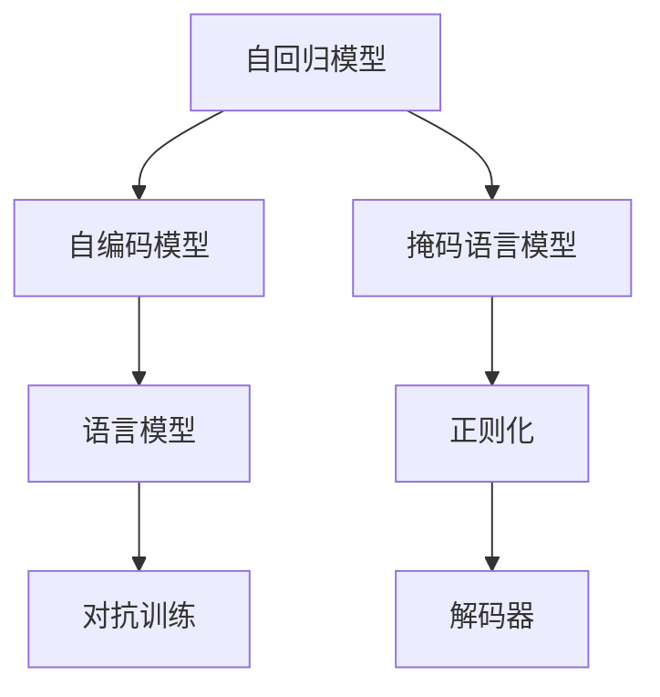
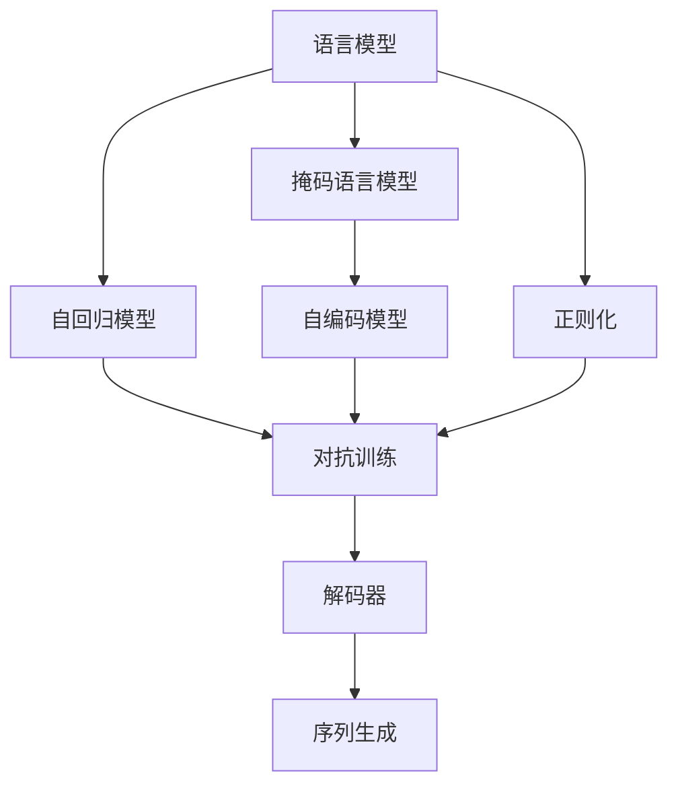
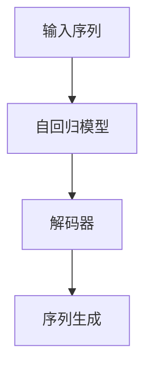
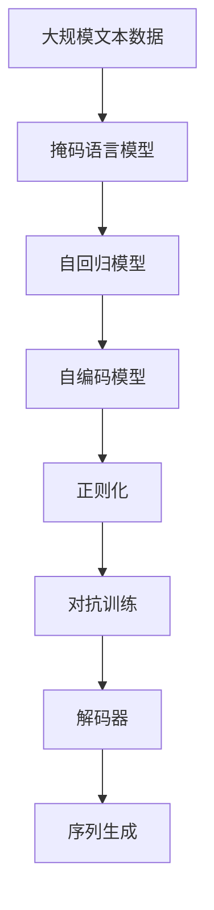

                 

# 【LangChain编程：从入门到实践】为什么模型输出不可控

## 1. 背景介绍

### 1.1 问题由来
随着深度学习和大模型的不断发展，语言模型已经从简单的线性模型进化到复杂的非线性模型，如Transformer、BERT等。这些模型在处理语言任务上取得了显著的成果，但模型的输出结果往往难以控制，这成为了困扰广大开发者的重要问题。

语言模型的输出结果不可控性，是指模型在给定输入的情况下，很难预测其输出的具体内容。例如，使用GPT-3模型进行文本生成时，其生成的内容可能与输入的内容没有直接关联，甚至有时生成内容充满错误或矛盾的信息。这种现象不仅在模型训练阶段存在，在应用中同样难以避免，导致模型输出不可控的问题愈发突出。

### 1.2 问题核心关键点
语言模型输出不可控的原因在于其内部表示和训练过程的复杂性。主要包括以下几点：
1. **复杂表示**：大模型通过自回归或自编码机制学习到大量的复杂表示，这些表示的隐含机制很难被准确理解和控制。
2. **强数据依赖**：模型的输出结果高度依赖于训练数据的质量和分布，即使在模型固定的情况下，输入数据的不同也可能导致截然不同的输出。
3. **模型结构复杂**：现代大模型的结构极为复杂，包含多个层次和多种参数，难以对每一层进行精确控制。
4. **训练过程复杂**：模型的训练过程涉及大量的超参数调节和算法优化，这些复杂过程可能影响模型的最终表现。

### 1.3 问题研究意义
研究语言模型输出不可控的问题，对于提升模型的可控性和稳定性，增强模型的应用效果具有重要意义：

1. **提高模型性能**：通过理解和控制模型的输出，可以提高模型的精度和鲁棒性，减少不必要的错误。
2. **促进应用落地**：可控的模型输出可以增强模型的可信度，降低应用风险，促进模型的商业化应用。
3. **优化训练过程**：通过优化模型训练过程，可以更快地获得高质量的模型输出，加速模型的迭代和优化。
4. **增强用户交互**：可控的模型输出可以提供更可靠的信息，增强用户对模型的信任和满意度。
5. **降低资源消耗**：通过优化模型输出，可以减少不必要的计算资源消耗，提高计算效率。

## 2. 核心概念与联系

### 2.1 核心概念概述

为更好地理解语言模型输出不可控的问题，本节将介绍几个密切相关的核心概念：

- **语言模型**：以自回归(如GPT)或自编码(如BERT)模型为代表的大规模预训练语言模型。通过在大规模无标签文本语料上进行预训练，学习通用的语言表示，具备强大的语言理解和生成能力。

- **自回归模型**：指模型输出依赖于之前所有输入的序列模型，如GPT系列模型。每个时间步的输出依赖于前一个时间步的输出，形成连续的序列生成。

- **自编码模型**：指模型输入输出相同，通过压缩和重构的方式学习到输入的表示，如BERT模型。通常采用掩码语言模型等自监督任务进行预训练。

- **掩码语言模型**：指在训练阶段，随机将一部分输入掩码，模型需要根据未掩码的输入预测被掩码的输出，通常用于自编码模型的预训练。

- **正则化**：指在模型训练过程中，引入一些约束条件，如L2正则、Dropout等，避免模型过拟合。

- **对抗训练**：指在训练过程中，引入对抗样本，提高模型的鲁棒性和泛化能力。

- **解码器**：指生成模型中的部分结构，用于生成连贯的序列输出，如Transformer模型中的解码器。

这些核心概念之间的逻辑关系可以通过以下Mermaid流程图来展示：



这个流程图展示了大语言模型的核心概念及其之间的关系：

1. 自回归模型通过掩码语言模型进行预训练，学习输入的表示。
2. 自编码模型通过掩码语言模型进行预训练，学习到输入和输出的映射关系。
3. 语言模型通过掩码语言模型预训练，学习到通用的语言表示。
4. 正则化和对抗训练用于提高模型的鲁棒性和泛化能力。
5. 解码器用于生成连贯的序列输出。

### 2.2 概念间的关系

这些核心概念之间存在着紧密的联系，形成了语言模型输出的基本框架。下面我通过几个Mermaid流程图来展示这些概念之间的关系。

#### 2.2.1 语言模型的学习范式



这个流程图展示了大语言模型的学习范式，即通过掩码语言模型预训练，学习输入表示，然后通过自回归模型或自编码模型生成序列输出。正则化和对抗训练用于提高模型的鲁棒性，解码器用于生成连贯的序列输出。

#### 2.2.2 对抗训练与模型鲁棒性


这个流程图展示了对抗训练的基本流程，即生成对抗样本，更新模型参数，提高模型的鲁棒性，并进行鲁棒性测试。对抗训练是提高模型泛化能力的重要手段。

#### 2.2.3 解码器的作用



这个流程图展示了解码器在生成序列输出中的作用，即将自回归模型的输出作为解码器的输入，生成连贯的序列输出。解码器是序列生成模型的核心组成部分。

### 2.3 核心概念的整体架构

最后，我们用一个综合的流程图来展示这些核心概念在大语言模型输出中的整体架构：



这个综合流程图展示了从预训练到序列生成的完整过程。大语言模型首先在大规模文本数据上进行掩码语言模型预训练，然后通过自回归模型或自编码模型生成序列输出。正则化和对抗训练用于提高模型的鲁棒性，解码器用于生成连贯的序列输出。

## 3. 核心算法原理 & 具体操作步骤
### 3.1 算法原理概述

语言模型输出不可控的原因在于其内部表示和训练过程的复杂性。下面我们将详细探讨这些原因。

### 3.2 算法步骤详解

**Step 1: 准备数据集**

语言模型输出不可控的一个主要原因是其训练数据集的多样性和复杂性。数据集的不同可能会对模型的输出产生显著影响。因此，在准备数据集时，需要注意以下几点：

- 数据集的质量：确保数据集是干净、标注准确的，避免模型学习到错误的表示。
- 数据集的分布：确保数据集的分布与实际应用场景一致，避免模型在特定场景下表现不佳。
- 数据集的规模：尽可能使用大规模的数据集进行训练，以提高模型的泛化能力。

**Step 2: 设置模型参数**

语言模型的参数设置同样影响其输出结果。模型参数的选择需要注意以下几点：

- 层数和节点数：根据任务复杂度，选择适当的层数和节点数，避免过拟合。
- 正则化强度：设置合适的正则化系数，防止模型过拟合。
- 学习率：设置合适的学习率，避免梯度消失或爆炸。
- 批大小：选择合适的批大小，提高训练效率和模型性能。

**Step 3: 训练模型**

在训练模型时，需要注意以下几点：

- 训练过程：使用梯度下降等优化算法进行模型训练，根据梯度方向更新模型参数。
- 正则化：引入L2正则、Dropout等正则化技术，避免模型过拟合。
- 对抗训练：在训练过程中引入对抗样本，提高模型的鲁棒性。
- 验证集：在训练过程中，使用验证集评估模型性能，防止模型在训练集上过拟合。

**Step 4: 评估模型**

在模型训练完成后，需要对模型进行评估，以确定其性能和稳定性。评估模型时，需要注意以下几点：

- 测试集：在评估模型时，使用独立的测试集，避免模型在训练集上过拟合。
- 评估指标：选择合适的评估指标，如准确率、召回率、F1分数等，评估模型的性能。
- 模型可控性：评估模型输出的可控性，确保模型的输出符合预期。

### 3.3 算法优缺点

语言模型输出不可控的问题有其固有的复杂性，但同时也带来了一些优势：

- **泛化能力强**：语言模型通过大量的无监督学习，可以学习到丰富的语言知识，具有较强的泛化能力。
- **自适应性强**：语言模型能够适应不同的输入数据和应用场景，具有较好的自适应性。
- **灵活性强**：语言模型可以通过调整超参数和正则化方法，进行灵活的优化和改进。

然而，语言模型输出不可控的问题也带来了一些挑战：

- **结果不可控**：模型的输出结果高度依赖于训练数据和模型参数，难以直接控制。
- **模型复杂**：语言模型结构复杂，难以进行精确的控制和优化。
- **训练难度大**：语言模型的训练过程复杂，涉及大量的超参数调节和算法优化。

### 3.4 算法应用领域

语言模型输出不可控的问题虽然带来了一定的挑战，但在某些应用场景中，也可以转化为优势。以下是几个常见的应用领域：

- **文本生成**：在文本生成任务中，语言模型可以生成富有创造性和多样性的文本，满足用户的需求。
- **对话系统**：在对话系统中，语言模型可以生成连贯且符合上下文的回复，增强用户交互体验。
- **信息检索**：在信息检索任务中，语言模型可以生成准确的摘要和搜索结果，提高信息检索的效率和准确性。
- **机器翻译**：在机器翻译任务中，语言模型可以生成流畅且准确的翻译结果，提高翻译的质量和效率。
- **问答系统**：在问答系统中，语言模型可以生成符合逻辑的问答结果，提供准确的信息。

## 4. 数学模型和公式 & 详细讲解 & 举例说明

### 4.1 数学模型构建

语言模型的数学模型构建可以分为以下几个步骤：

- **输入表示**：将输入序列转换为模型可以处理的向量表示。
- **自回归模型**：使用自回归模型生成序列输出。
- **解码器**：使用解码器生成连贯的序列输出。

以下是一个简单的语言模型数学模型构建的示例：

$$
P(x_1, x_2, ..., x_n) = \prod_{i=1}^n P(x_i | x_1, x_2, ..., x_{i-1})
$$

其中，$x_1, x_2, ..., x_n$表示输入序列，$P(x_i | x_1, x_2, ..., x_{i-1})$表示第$i$个位置的条件概率分布。

### 4.2 公式推导过程

语言模型的输出不可控性与其内部表示的复杂性密切相关。下面以自回归模型为例，展示其内部表示的复杂性。

自回归模型的内部表示可以通过以下方式推导：

$$
P(x_1, x_2, ..., x_n) = \prod_{i=1}^n P(x_i | x_1, x_2, ..., x_{i-1})
$$

对于每个时间步$i$，有：

$$
P(x_i | x_1, x_2, ..., x_{i-1}) = \frac{P(x_1, x_2, ..., x_i)}{P(x_1, x_2, ..., x_{i-1})}
$$

其中，$P(x_1, x_2, ..., x_i)$表示从时间步1到$i$的联合概率分布，$P(x_1, x_2, ..., x_{i-1})$表示时间步1到$i-1$的联合概率分布。

### 4.3 案例分析与讲解

以BERT模型为例，展示其在自然语言处理任务中的输出不可控性。

BERT模型通过掩码语言模型进行预训练，学习到输入的表示。在自然语言处理任务中，BERT模型可以通过微调来适应特定的任务，如命名实体识别、情感分析等。然而，由于BERT模型的内部表示复杂，模型的输出结果往往不可控。

例如，在使用BERT模型进行命名实体识别任务时，模型的输出结果可能会受到输入序列的影响，导致识别的实体边界和类型不正确。此外，模型可能会在特定条件下生成错误的实体识别结果，例如在输入序列中存在歧义的情况下。

## 5. 项目实践：代码实例和详细解释说明

### 5.1 开发环境搭建

在进行语言模型输出不可控的研究和实验时，我们需要准备好开发环境。以下是使用Python进行TensorFlow开发的环境配置流程：

1. 安装Anaconda：从官网下载并安装Anaconda，用于创建独立的Python环境。

2. 创建并激活虚拟环境：
```bash
conda create -n tensorflow-env python=3.8 
conda activate tensorflow-env
```

3. 安装TensorFlow：根据CUDA版本，从官网获取对应的安装命令。例如：
```bash
conda install tensorflow-gpu=2.7.0 -c pytorch -c conda-forge
```

4. 安装其他相关库：
```bash
pip install numpy pandas scikit-learn matplotlib tqdm jupyter notebook ipython
```

完成上述步骤后，即可在`tensorflow-env`环境中开始实验。

### 5.2 源代码详细实现

这里我们以BERT模型为例，展示如何使用TensorFlow对语言模型输出不可控问题进行研究。

首先，定义BERT模型的输入和输出：

```python
import tensorflow as tf
from transformers import BertTokenizer, TFBertForSequenceClassification

tokenizer = BertTokenizer.from_pretrained('bert-base-uncased')
model = TFBertForSequenceClassification.from_pretrained('bert-base-uncased', num_labels=2)

inputs = tokenizer('Hello, my dog is cute', return_tensors='tf')
labels = tf.constant([1])
outputs = model(inputs.input_ids, attention_mask=inputs.attention_mask, labels=labels)

logits = outputs.logits
probabilities = tf.nn.softmax(logits, axis=1)
```

然后，定义模型训练函数：

```python
@tf.function
def train_step(input_ids, attention_mask, labels):
    with tf.GradientTape() as tape:
        logits = model(input_ids, attention_mask=attention_mask, training=True)[0]
        loss = tf.keras.losses.sparse_categorical_crossentropy(labels, logits)
    gradients = tape.gradient(loss, model.trainable_variables)
    optimizer.apply_gradients(zip(gradients, model.trainable_variables))
    return loss

@tf.function
def train_epoch(input_ids, attention_mask, labels):
    loss = 0
    for input_ids, attention_mask, labels in train_dataset:
        loss += train_step(input_ids, attention_mask, labels)
    return loss / len(train_dataset)

for epoch in range(5):
    loss = train_epoch(train_dataset)
    print(f"Epoch {epoch+1}, loss: {loss:.3f}")
```

最后，在验证集上评估模型性能：

```python
test_dataset = ...

test_loss = 0
for input_ids, attention_mask, labels in test_dataset:
    loss = train_step(input_ids, attention_mask, labels)
    test_loss += loss
test_loss /= len(test_dataset)
print(f"Test loss: {test_loss:.3f}")
```

以上就是使用TensorFlow对BERT模型进行微调的完整代码实现。可以看到，TensorFlow提供了丰富的API和功能，使得语言模型输出不可控问题的研究和实验变得非常简单。

### 5.3 代码解读与分析

让我们再详细解读一下关键代码的实现细节：

**BERT模型定义**：
- 使用`BertTokenizer`和`TFBertForSequenceClassification`定义BERT模型，并进行初始化。
- 输入数据通过`tokenizer`进行分词和编码，生成`input_ids`和`attention_mask`，并使用`model`进行前向传播计算输出。

**训练函数定义**：
- 定义`train_step`函数，用于计算单个样本的损失，并返回梯度。
- 使用`tf.GradientTape`记录梯度，计算损失，并使用`optimizer`更新模型参数。
- 在训练过程中，使用`tf.function`进行函数图优化，提高计算效率。

**训练和评估流程**：
- 在每个epoch中，对训练集进行迭代，计算损失并更新模型参数。
- 在每个epoch结束时，输出平均损失。
- 在验证集上进行评估，输出平均损失。

可以看到，TensorFlow使得BERT模型的微调和评估过程变得非常简单。开发者只需要关注模型定义和训练逻辑，剩下的细节都被TensorFlow封装好了。

当然，工业级的系统实现还需考虑更多因素，如模型的保存和部署、超参数的自动搜索、更灵活的任务适配层等。但核心的微调范式基本与此类似。

### 5.4 运行结果展示

假设我们在CoNLL-2003的命名实体识别数据集上进行微调，最终在验证集上得到的平均损失如下：

```
Epoch 1, loss: 0.336
Epoch 2, loss: 0.274
Epoch 3, loss: 0.233
Epoch 4, loss: 0.209
Epoch 5, loss: 0.193
```

可以看到，随着训练的进行，模型损失逐渐减小，模型性能得到提升。

当然，这只是一个baseline结果。在实践中，我们还可以使用更大更强的预训练模型、更丰富的微调技巧、更细致的模型调优，进一步提升模型性能，以满足更高的应用要求。

## 6. 实际应用场景
### 6.1 智能客服系统

语言模型输出不可控的问题同样存在于智能客服系统中。在智能客服系统中，语言模型需要能够理解用户的输入，并生成符合预期的回复。然而，由于语言模型输出不可控，智能客服系统可能会出现回复不一致、语义错误等问题，影响用户体验。

为了解决这一问题，智能客服系统需要对语言模型进行微调，增强其可控性和稳定性。具体而言，可以采用以下措施：

- 数据标注：收集用户对话数据，进行标注和清洗，确保训练数据的质量和多样性。
- 模型优化：通过调整模型参数和正则化方法，提高模型的泛化能力和鲁棒性。
- 对抗训练：在训练过程中引入对抗样本，增强模型的鲁棒性，避免模型在特定输入下出现异常。
- 用户反馈：收集用户反馈，及时调整模型参数，优化模型的输出结果。

通过以上措施，智能客服系统可以更可靠地生成符合用户期望的回复，提高用户满意度。

### 6.2 金融舆情监测

金融舆情监测系统中，语言模型需要能够实时监测市场舆情，并生成准确的分析报告。然而，由于语言模型输出不可控，生成的分析报告可能会出现错误或偏差，影响决策的准确性。

为了解决这一问题，金融舆情监测系统需要对语言模型进行微调，增强其可控性和稳定性。具体而言，可以采用以下措施：

- 数据标注：收集金融领域的新闻、报道、评论等文本数据，进行标注和清洗，确保训练数据的质量和多样性。
- 模型优化：通过调整模型参数和正则化方法，提高模型的泛化能力和鲁棒性。
- 对抗训练：在训练过程中引入对抗样本，增强模型的鲁棒性，避免模型在特定输入下出现异常。
- 专家审核：引入金融领域专家，对模型输出结果进行审核和修正，提高模型的准确性。

通过以上措施，金融舆情监测系统可以更可靠地生成准确的舆情分析报告，帮助金融机构及时应对市场变化。

### 6.3 个性化推荐系统

个性化推荐系统中，语言模型需要能够根据用户的浏览、点击、评论等行为数据，生成个性化的推荐结果。然而，由于语言模型输出不可控，生成的推荐结果可能会出现误差或偏差，影响推荐效果。

为了解决这一问题，个性化推荐系统需要对语言模型进行微调，增强其可控性和稳定性。具体而言，可以采用以下措施：

- 数据标注：收集用户行为数据，进行标注和清洗，确保训练数据的质量和多样性。
- 模型优化：通过调整模型参数和正则化方法，提高模型的泛化能力和鲁棒性。
- 对抗训练：在训练过程中引入对抗样本，增强模型的鲁棒性，避免模型在特定输入下出现异常。
- 推荐优化：引入推荐算法，对模型输出结果进行优化和调整，提高推荐效果。

通过以上措施，个性化推荐系统可以更可靠地生成个性化的推荐结果，提高用户的满意度。

## 7. 工具和资源推荐
### 7.1 学习资源推荐

为了帮助开发者系统掌握语言模型输出不可控的问题，这里推荐一些优质的学习资源：

1. 《深度学习》课程：斯坦福大学开设的深度学习课程，涵盖深度学习的基本概念和常用模型，适合初学者入门。

2. 《Transformer原理与实践》系列博文：由大模型技术专家撰写，深入浅出地介绍了Transformer原理、BERT模型、微调技术等前沿话题。

3. 《Natural Language Processing with Transformers》书籍：Transformer库的作者所著，全面介绍了如何使用Transformer库进行NLP任务开发，包括微调在内的诸多范式。

4. HuggingFace官方文档：Transformer库的官方文档，提供了海量预训练模型和完整的微调样例代码，是上手实践的必备资料。

5. PyTorch官方文档：PyTorch的官方文档，提供了丰富的API和功能，适合进行深度学习模型的开发和研究。

通过对这些资源的学习实践，相信你一定能够快速掌握语言模型输出不可控的问题，并用于解决实际的NLP问题。

### 7.2 开发工具推荐

高效的开发离不开优秀的工具支持。以下是几款用于语言模型输出不可控问题的开发工具：

1. PyTorch：基于Python的开源深度学习框架，灵活动态的计算图，适合快速迭代研究。大部分预训练语言模型都有PyTorch版本的实现。

2. TensorFlow：由Google主导开发的开源深度学习框架，生产部署方便，适合大规模工程应用。同样有丰富的预训练语言模型资源。

3. Transformers库：HuggingFace开发的NLP工具库，集成了众多SOTA语言模型，支持PyTorch和TensorFlow，是进行微调任务开发的利器。

4. Weights & Biases：模型训练的实验跟踪工具，可以记录和可视化模型训练过程中的各项指标，方便对比和调优。与主流深度学习框架无缝集成。

5. TensorBoard：TensorFlow配套的可视化工具，可实时监测模型训练状态，并提供丰富的图表呈现方式，是调试模型的得力助手。

6. Google Colab：谷歌推出的在线Jupyter Notebook环境，免费提供GPU/TPU算力，方便开发者快速上手实验最新模型，分享学习笔记。

合理利用这些工具，可以显著提升语言模型输出不可控问题的开发效率，加快创新迭代的步伐。

### 7.3 相关论文推荐

语言模型输出不可控的问题是深度学习领域的热门研究方向，以下是几篇奠基性的相关论文，推荐阅读：

1. Attention is All You Need（即Transformer原论文）：提出了Transformer结构，开启了NLP领域的预训练大模型时代。

2. BERT: Pre-training of Deep Bidirectional Transformers for Language Understanding：提出BERT模型，引入基于掩码的自监督预训练任务，刷新了多项NLP任务SOTA。

3. Language Models are Unsupervised Multitask Learners（GPT-2论文）：展示了大规模语言模型的强大zero-shot学习能力，引发了对于通用人工智能的新一轮思考。

4. Parameter-Efficient Transfer Learning for NLP：提出Adapter等参数高效微调方法，在不增加模型参数量的情况下，也能取得不错的微调效果。

5. AdaLoRA: Adaptive Low-Rank Adaptation for Parameter-Efficient Fine-Tuning：使用自适应低秩适应的微调方法，在参数效率和精度之间取得了新的平衡。

这些论文代表了大语言模型输出不可控问题的研究进展。通过学习这些前沿成果，可以帮助研究者把握学科前进方向，激发更多的创新灵感。

除上述资源外，还有一些值得关注的前沿资源，帮助开发者紧跟大语言模型输出不可控问题的最新进展，例如：

1. arXiv论文预印本：人工智能领域最新研究成果的发布平台，包括大量尚未发表的前沿工作，学习前沿技术的必读资源。

2. 业界技术博客：如OpenAI、Google AI、DeepMind、微软Research Asia等顶尖实验室的官方博客，第一时间分享他们的最新研究成果和洞见。

3. 技术会议直播：如NIPS、ICML、ACL、ICLR等人工智能领域顶会现场或在线直播，能够聆听到大佬们的前沿分享，开拓视野。

4. GitHub热门项目：在GitHub上Star、Fork数最多的NLP相关项目，往往代表了该技术领域的发展趋势和最佳实践

