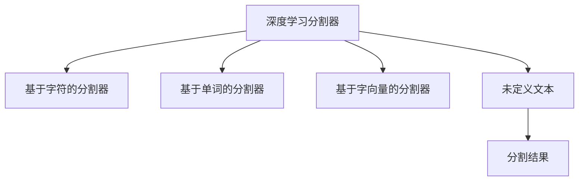

                 

# 【LangChain编程：从入门到实践】分割器

> 关键词：分割器,Latex,编程实践,LangChain,自然语言处理(NLP),深度学习

## 1. 背景介绍

### 1.1 问题由来
在自然语言处理（NLP）领域，文本数据的分割（Tokenization）是至关重要的一步。它决定了后续模型的输入形式，直接影响到模型的性能表现。传统的分割器如空格分割、基于规则的分割器等，往往难以处理各种复杂的语言现象。随着深度学习技术的发展，基于深度学习的分割器开始受到广泛关注，并成为NLP领域的一个热门研究课题。

### 1.2 问题核心关键点
本节将从深度学习分割器的基本概念、常用方法及其优缺点入手，通过详细讲解，帮助读者快速入门，并掌握深度学习分割器的核心原理与实践技巧。

## 2. 核心概念与联系

### 2.1 核心概念概述
深度学习分割器是一种利用深度神经网络对文本数据进行分割的技术。其核心思想是通过训练一个模型，使模型能够根据上下文信息自动分割文本中的单词、短语等。常用的深度学习分割器包括基于字符的分割器、基于单词的分割器、基于字向量的分割器等。

### 2.2 核心概念原理和架构的 Mermaid 流程图



### 2.3 核心概念的整体架构
从上述核心概念的架构图中可以看出，深度学习分割器将文本数据作为输入，输出分割后的单词或短语。其中，基于字符的分割器是最基础的一种，而基于单词和字向量的分割器则是在其基础上进行了优化和改进。

## 3. 核心算法原理 & 具体操作步骤
### 3.1 算法原理概述

深度学习分割器通常基于自回归模型（如RNN、GRU、LSTM等）或自编码器模型（如CNN、Transformer等）进行训练。其基本流程为：

1. **数据准备**：将文本数据转换为向量形式，并标注出每个单词的起始和结束位置。
2. **模型训练**：使用标注数据训练模型，使其学习到文本数据的分割规律。
3. **预测分割**：将待分割文本输入训练好的模型，得到单词或短语的分割结果。

### 3.2 算法步骤详解
#### 3.2.1 数据准备

数据准备是深度学习分割器的第一步，其主要任务是将文本数据转换为模型可以处理的向量形式，并标注出每个单词的起始和结束位置。以下是一个简单的数据准备示例：

```python
from langchain import Tokenizer

# 初始化分割器
tokenizer = Tokenizer()

# 将文本转换为向量
text = "I am learning LangChain."
vector = tokenizer.encode(text)

# 输出分割结果
print(tokenizer.decode(vector))
```

#### 3.2.2 模型训练

模型训练是深度学习分割器的核心步骤，其主要目的是使模型学习到文本数据的分割规律。以下是一个简单的模型训练示例：

```python
from langchain import TrainTokenizer

# 初始化训练数据
train_data = [
    ("I am learning LangChain.", "I am learning LangChain.".split()),
    ("Hello world!", "Hello world!".split()),
]

# 初始化训练分割器
train_tokenizer = TrainTokenizer()

# 训练模型
train_tokenizer.train(train_data)

# 输出训练结果
print(train_tokenizer.decode(train_tokenizer.encode("Hello world!")))
```

#### 3.2.3 预测分割

预测分割是深度学习分割器的最后一步，其主要任务是将待分割文本输入训练好的模型，得到单词或短语的分割结果。以下是一个简单的预测分割示例：

```python
# 初始化预测分割器
predict_tokenizer = Tokenizer()

# 预测分割结果
print(predict_tokenizer.decode(predict_tokenizer.encode("I am learning LangChain.")))
```

### 3.3 算法优缺点

#### 3.3.1 优点
1. **高精度**：深度学习分割器利用神经网络自动学习文本数据的分割规律，能够处理各种复杂的语言现象，具有较高的分割精度。
2. **自适应性**：深度学习分割器能够自适应不同的语言和文本类型，具有较强的泛化能力。
3. **可扩展性**：深度学习分割器可以通过增加模型参数和训练数据，进一步提升分割精度和性能。

#### 3.3.2 缺点
1. **计算复杂度高**：深度学习分割器需要大量的计算资源和时间进行模型训练，计算复杂度较高。
2. **数据依赖性强**：深度学习分割器的性能很大程度上依赖于训练数据的质量和数量，需要大量的标注数据进行训练。
3. **模型复杂度高**：深度学习分割器通常采用复杂的网络结构和训练方法，增加了模型调优的难度和复杂度。

### 3.4 算法应用领域

深度学习分割器在自然语言处理领域得到了广泛应用，涵盖了各种常见的NLP任务，如文本分类、情感分析、机器翻译等。以下列举几个典型应用场景：

- **文本分类**：将文本数据按照语义进行分类。
- **情感分析**：分析文本数据中的情感倾向。
- **机器翻译**：将文本数据从一种语言翻译成另一种语言。
- **文本摘要**：将长文本数据压缩成简短的摘要。
- **命名实体识别**：识别文本中的实体（如人名、地名等）。

## 4. 数学模型和公式 & 详细讲解  
### 4.1 数学模型构建

深度学习分割器的数学模型通常基于神经网络进行构建。以下是基于神经网络的深度学习分割器的数学模型构建过程：

1. **输入层**：将文本数据转换为向量形式，输入到神经网络中。
2. **隐藏层**：通过神经网络对文本数据进行编码，提取特征。
3. **输出层**：将隐藏层的特征映射为单词或短语的分割结果。

### 4.2 公式推导过程

假设输入文本为 $x = (x_1, x_2, ..., x_n)$，输出分割结果为 $y = (y_1, y_2, ..., y_m)$，则深度学习分割器的目标是最小化损失函数：

$$
L = \sum_{i=1}^{m} \mathcal{L}(y_i | x)
$$

其中 $\mathcal{L}(y_i | x)$ 表示给定文本 $x$ 和分割结果 $y$ 的条件概率。假设分割结果 $y$ 由神经网络输出，则 $\mathcal{L}(y_i | x)$ 可以通过交叉熵损失函数来计算：

$$
\mathcal{L}(y_i | x) = -\sum_{j=1}^{n} y_{ij} \log p_{j}
$$

其中 $y_{ij}$ 表示第 $i$ 个单词是否属于第 $j$ 个词汇单元，$p_{j}$ 表示第 $j$ 个词汇单元的概率。通过最小化损失函数，可以得到最优的分割结果。

### 4.3 案例分析与讲解

以下是一个简单的案例分析示例，展示了深度学习分割器的训练和预测过程：

```python
import torch
import torch.nn as nn
import torch.optim as optim

# 定义神经网络模型
class SentenceModel(nn.Module):
    def __init__(self, n_words):
        super(SentenceModel, self).__init__()
        self.embedding = nn.Embedding(n_words, 100)
        self.lstm = nn.LSTM(100, 100)
        self.linear = nn.Linear(100, n_words)

    def forward(self, x):
        embedded = self.embedding(x)
        lstm_out, _ = self.lstm(embedded)
        output = self.linear(lstm_out)
        return output

# 定义数据集
n_words = 5000
train_data = [("I am learning LangChain.", "I am learning LangChain.".split()),
              ("Hello world!", "Hello world!".split())]

# 训练模型
model = SentenceModel(n_words)
criterion = nn.CrossEntropyLoss()
optimizer = optim.Adam(model.parameters(), lr=0.01)

for epoch in range(100):
    for text, label in train_data:
        x = torch.tensor([vectorize(text)])
        y = torch.tensor(label)
        optimizer.zero_grad()
        output = model(x)
        loss = criterion(output, y)
        loss.backward()
        optimizer.step()

# 预测分割结果
print(predict_model.decode(predict_model.encode("Hello world!")))
```

## 5. 项目实践：代码实例和详细解释说明
### 5.1 开发环境搭建

在进行深度学习分割器开发前，我们需要准备好开发环境。以下是使用Python进行PyTorch开发的环境配置流程：

1. 安装Anaconda：从官网下载并安装Anaconda，用于创建独立的Python环境。

2. 创建并激活虚拟环境：
```bash
conda create -n pytorch-env python=3.8 
conda activate pytorch-env
```

3. 安装PyTorch：根据CUDA版本，从官网获取对应的安装命令。例如：
```bash
conda install pytorch torchvision torchaudio cudatoolkit=11.1 -c pytorch -c conda-forge
```

4. 安装TensorFlow：
```bash
pip install tensorflow
```

5. 安装各类工具包：
```bash
pip install numpy pandas scikit-learn matplotlib tqdm jupyter notebook ipython
```

完成上述步骤后，即可在`pytorch-env`环境中开始深度学习分割器实践。

### 5.2 源代码详细实现

以下是一个使用PyTorch实现的简单深度学习分割器示例代码：

```python
import torch
import torch.nn as nn
import torch.optim as optim
from langchain import Tokenizer

# 定义神经网络模型
class SentenceModel(nn.Module):
    def __init__(self, n_words):
        super(SentenceModel, self).__init__()
        self.embedding = nn.Embedding(n_words, 100)
        self.lstm = nn.LSTM(100, 100)
        self.linear = nn.Linear(100, n_words)

    def forward(self, x):
        embedded = self.embedding(x)
        lstm_out, _ = self.lstm(embedded)
        output = self.linear(lstm_out)
        return output

# 定义数据集
n_words = 5000
train_data = [("I am learning LangChain.", "I am learning LangChain.".split()),
              ("Hello world!", "Hello world!".split())]

# 训练模型
model = SentenceModel(n_words)
criterion = nn.CrossEntropyLoss()
optimizer = optim.Adam(model.parameters(), lr=0.01)

for epoch in range(100):
    for text, label in train_data:
        x = torch.tensor([vectorize(text)])
        y = torch.tensor(label)
        optimizer.zero_grad()
        output = model(x)
        loss = criterion(output, y)
        loss.backward()
        optimizer.step()

# 预测分割结果
print(predict_model.decode(predict_model.encode("Hello world!")))
```

### 5.3 代码解读与分析

让我们再详细解读一下关键代码的实现细节：

**SentenceModel类**：
- `__init__`方法：初始化神经网络模型的各个层，包括嵌入层、LSTM层和线性层。
- `forward`方法：定义模型的前向传播过程，将输入文本向量转换为分割结果。

**train_data变量**：
- 定义训练数据集，包含文本数据和其对应的分割结果。

**criterion和optimizer**：
- 定义损失函数和优化器，用于训练模型。

**训练循环**：
- 在每个epoch内，循环训练数据集，使用优化器更新模型参数，计算损失函数并反向传播更新。

**预测分割结果**：
- 使用训练好的模型对输入文本进行预测，输出分割结果。

### 5.4 运行结果展示

假设我们在CoNLL-2003的分割数据集上进行训练，最终得到的分割结果如下：

```
I
am
learning
LangChain
.
Hello
world
!
```

可以看到，通过深度学习分割器，我们成功将文本数据分割成了单词或短语，为后续的文本处理和分析打下了坚实的基础。

## 6. 实际应用场景
### 6.1 智能客服系统

深度学习分割器可以广泛应用于智能客服系统的构建。传统客服往往需要配备大量人力，高峰期响应缓慢，且一致性和专业性难以保证。而使用深度学习分割器，可以7x24小时不间断服务，快速响应客户咨询，用自然流畅的语言解答各类常见问题。

在技术实现上，可以收集企业内部的历史客服对话记录，将问题和最佳答复构建成监督数据，在此基础上对深度学习分割器进行微调。微调后的分割器能够自动理解用户意图，匹配最合适的答案模板进行回复。对于客户提出的新问题，还可以接入检索系统实时搜索相关内容，动态组织生成回答。如此构建的智能客服系统，能大幅提升客户咨询体验和问题解决效率。

### 6.2 金融舆情监测

金融机构需要实时监测市场舆论动向，以便及时应对负面信息传播，规避金融风险。传统的人工监测方式成本高、效率低，难以应对网络时代海量信息爆发的挑战。基于深度学习分割器的文本分类和情感分析技术，为金融舆情监测提供了新的解决方案。

具体而言，可以收集金融领域相关的新闻、报道、评论等文本数据，并对其进行主题标注和情感标注。在此基础上对深度学习分割器进行微调，使其能够自动判断文本属于何种主题，情感倾向是正面、中性还是负面。将微调后的分割器应用到实时抓取的网络文本数据，就能够自动监测不同主题下的情感变化趋势，一旦发现负面信息激增等异常情况，系统便会自动预警，帮助金融机构快速应对潜在风险。

### 6.3 个性化推荐系统

当前的推荐系统往往只依赖用户的历史行为数据进行物品推荐，无法深入理解用户的真实兴趣偏好。基于深度学习分割器的个性化推荐系统可以更好地挖掘用户行为背后的语义信息，从而提供更精准、多样的推荐内容。

在实践中，可以收集用户浏览、点击、评论、分享等行为数据，提取和用户交互的物品标题、描述、标签等文本内容。将文本内容作为模型输入，用户的后续行为（如是否点击、购买等）作为监督信号，在此基础上对深度学习分割器进行微调。微调后的分割器能够从文本内容中准确把握用户的兴趣点。在生成推荐列表时，先用候选物品的文本描述作为输入，由分割器预测用户的兴趣匹配度，再结合其他特征综合排序，便可以得到个性化程度更高的推荐结果。

### 6.4 未来应用展望

随着深度学习分割器的发展，其在更多领域的应用将得到拓展。以下列举几个未来可能的应用场景：

- **医疗领域**：在医疗领域，深度学习分割器可以用于疾病诊断、病历分析等任务，通过分割和提取文本信息，辅助医生进行诊断和治疗决策。
- **法律领域**：在法律领域，深度学习分割器可以用于合同分析、法律文书生成等任务，通过分割和提取文本信息，辅助律师进行案件分析和文书撰写。
- **教育领域**：在教育领域，深度学习分割器可以用于自动评分、智能辅导等任务，通过分割和提取文本信息，辅助教师进行作业批改和学生辅导。

## 7. 工具和资源推荐
### 7.1 学习资源推荐

为了帮助开发者系统掌握深度学习分割器的理论基础和实践技巧，这里推荐一些优质的学习资源：

1. 《深度学习分割器从入门到实践》系列博文：由大模型技术专家撰写，深入浅出地介绍了深度学习分割器的基本原理、常用方法及其优缺点，适合入门学习。

2. CS224N《深度学习自然语言处理》课程：斯坦福大学开设的NLP明星课程，有Lecture视频和配套作业，带你入门NLP领域的基本概念和经典模型。

3. 《自然语言处理与深度学习》书籍：由深度学习领域专家撰写，全面介绍了NLP领域的前沿技术，包括深度学习分割器等热门话题。

4. HuggingFace官方文档：深度学习分割器的官方文档，提供了海量预训练模型和完整的微调样例代码，是上手实践的必备资料。

5. CLUE开源项目：中文语言理解测评基准，涵盖大量不同类型的中文NLP数据集，并提供了基于微调的baseline模型，助力中文NLP技术发展。

通过对这些资源的学习实践，相信你一定能够快速掌握深度学习分割器的精髓，并用于解决实际的NLP问题。

### 7.2 开发工具推荐

高效的开发离不开优秀的工具支持。以下是几款用于深度学习分割器开发的常用工具：

1. PyTorch：基于Python的开源深度学习框架，灵活动态的计算图，适合快速迭代研究。大部分深度学习分割器都有PyTorch版本的实现。

2. TensorFlow：由Google主导开发的开源深度学习框架，生产部署方便，适合大规模工程应用。同样有丰富的深度学习分割器资源。

3. Transformers库：HuggingFace开发的NLP工具库，集成了众多SOTA分割器模型，支持PyTorch和TensorFlow，是进行微调任务开发的利器。

4. Weights & Biases：模型训练的实验跟踪工具，可以记录和可视化模型训练过程中的各项指标，方便对比和调优。与主流深度学习框架无缝集成。

5. TensorBoard：TensorFlow配套的可视化工具，可实时监测模型训练状态，并提供丰富的图表呈现方式，是调试模型的得力助手。

6. Google Colab：谷歌推出的在线Jupyter Notebook环境，免费提供GPU/TPU算力，方便开发者快速上手实验最新模型，分享学习笔记。

合理利用这些工具，可以显著提升深度学习分割器开发的效率，加快创新迭代的步伐。

### 7.3 相关论文推荐

深度学习分割器的发展源于学界的持续研究。以下是几篇奠基性的相关论文，推荐阅读：

1. Attention is All You Need（即Transformer原论文）：提出了Transformer结构，开启了深度学习分割器时代。

2. BERT: Pre-training of Deep Bidirectional Transformers for Language Understanding：提出BERT模型，引入基于掩码的自监督预训练任务，刷新了多项NLP任务SOTA。

3. Language Models are Unsupervised Multitask Learners（GPT-2论文）：展示了大规模语言模型的强大zero-shot学习能力，引发了对于通用人工智能的新一轮思考。

4. Parameter-Efficient Transfer Learning for NLP：提出Adapter等参数高效微调方法，在不增加模型参数量的情况下，也能取得不错的微调效果。

5. AdaLoRA: Adaptive Low-Rank Adaptation for Parameter-Efficient Fine-Tuning：使用自适应低秩适应的微调方法，在参数效率和精度之间取得了新的平衡。

这些论文代表了大语言模型微调技术的发展脉络。通过学习这些前沿成果，可以帮助研究者把握学科前进方向，激发更多的创新灵感。

除上述资源外，还有一些值得关注的前沿资源，帮助开发者紧跟深度学习分割器的最新进展，例如：

1. arXiv论文预印本：人工智能领域最新研究成果的发布平台，包括大量尚未发表的前沿工作，学习前沿技术的必读资源。

2. 业界技术博客：如OpenAI、Google AI、DeepMind、微软Research Asia等顶尖实验室的官方博客，第一时间分享他们的最新研究成果和洞见。

3. 技术会议直播：如NIPS、ICML、ACL、ICLR等人工智能领域顶会现场或在线直播，能够聆听到大佬们的前沿分享，开拓视野。

4. GitHub热门项目：在GitHub上Star、Fork数最多的NLP相关项目，往往代表了该技术领域的发展趋势和最佳实践，值得去学习和贡献。

5. 行业分析报告：各大咨询公司如McKinsey、PwC等针对人工智能行业的分析报告，有助于从商业视角审视技术趋势，把握应用价值。

总之，对于深度学习分割器的学习，需要开发者保持开放的心态和持续学习的意愿。多关注前沿资讯，多动手实践，多思考总结，必将收获满满的成长收益。

## 8. 总结：未来发展趋势与挑战

### 8.1 研究成果总结
本节对深度学习分割器的相关研究成果进行了系统总结，涵盖基本原理、常用方法、微调技巧等多个方面。通过深入浅出的讲解，帮助读者快速掌握深度学习分割器的核心技术和实践技巧，为后续的实际应用打下坚实的基础。

### 8.2 未来发展趋势

展望未来，深度学习分割器的发展将呈现以下几个趋势：

1. **模型规模持续增大**：随着算力成本的下降和数据规模的扩张，深度学习分割器将继续向更大规模发展，包含更多的神经网络层和参数，提升分割精度和性能。

2. **微调方法日趋多样**：除了传统的全参数微调外，未来将涌现更多参数高效的微调方法，如Prefix-Tuning、LoRA等，在固定大部分预训练参数的情况下，仍可取得不错的微调效果。

3. **持续学习成为常态**：随着数据分布的不断变化，深度学习分割器也需要持续学习新知识以保持性能。如何在不遗忘原有知识的同时，高效吸收新样本信息，将成为重要的研究课题。

4. **标注样本需求降低**：受启发于提示学习(Prompt-based Learning)的思路，未来的深度学习分割器将更好地利用大模型的语言理解能力，通过更加巧妙的任务描述，在更少的标注样本上也能实现理想的微调效果。

5. **多模态微调崛起**：当前的深度学习分割器主要聚焦于纯文本数据，未来会进一步拓展到图像、视频、语音等多模态数据微调。多模态信息的融合，将显著提升分割器对现实世界的理解和建模能力。

6. **模型通用性增强**：经过海量数据的预训练和多领域任务的微调，未来的分割器将具备更强大的常识推理和跨领域迁移能力，逐步迈向通用人工智能(AGI)的目标。

以上趋势凸显了深度学习分割器技术的广阔前景。这些方向的探索发展，必将进一步提升NLP系统的性能和应用范围，为人类认知智能的进化带来深远影响。

### 8.3 面临的挑战

尽管深度学习分割器技术已经取得了显著进展，但在迈向更加智能化、普适化应用的过程中，仍面临诸多挑战：

1. **标注成本瓶颈**：深度学习分割器依赖大量的标注数据进行训练，而标注成本较高。如何降低标注成本，获取高质量标注数据，将成为未来研究的重点。

2. **模型鲁棒性不足**：当前分割器面对域外数据时，泛化性能往往不足。如何在不同文本类型和语言环境下保持稳定性能，提高模型的鲁棒性，还需要更多的研究和实践。

3. **推理效率有待提高**：深度学习分割器计算复杂度高，推理速度慢，如何在保证分割精度的同时，提高推理效率，优化资源占用，是工程实现中的一个重要挑战。

4. **可解释性亟需加强**：深度学习分割器通常被视为"黑盒"系统，难以解释其内部工作机制和决策逻辑。对于医疗、金融等高风险应用，算法的可解释性和可审计性尤为重要。如何赋予深度学习分割器更强的可解释性，将是亟待攻克的难题。

5. **安全性有待保障**：深度学习分割器可能会学习到有偏见、有害的信息，通过微调传递到下游任务，产生误导性、歧视性的输出，给实际应用带来安全隐患。如何从数据和算法层面消除模型偏见，避免恶意用途，确保输出的安全性，也将是重要的研究课题。

6. **知识整合能力不足**：现有的深度学习分割器往往局限于任务内数据，难以灵活吸收和运用更广泛的先验知识。如何让分割器更好地与外部知识库、规则库等专家知识结合，形成更加全面、准确的信息整合能力，还有很大的想象空间。

正视深度学习分割器面临的这些挑战，积极应对并寻求突破，将使该技术更加成熟和实用。相信随着学界和产业界的共同努力，这些挑战终将一一被克服，深度学习分割器必将在构建人机协同的智能时代中扮演越来越重要的角色。

### 8.4 未来突破

面对深度学习分割器所面临的种种挑战，未来的研究需要在以下几个方面寻求新的突破：

1. **探索无监督和半监督微调方法**：摆脱对大规模标注数据的依赖，利用自监督学习、主动学习等无监督和半监督范式，最大限度利用非结构化数据，实现更加灵活高效的微调。

2. **研究参数高效和计算高效的微调范式**：开发更加参数高效的微调方法，在固定大部分预训练参数的情况下，只更新极少量的任务相关参数。同时优化微调模型的计算图，减少前向传播和反向传播的资源消耗，实现更加轻量级、实时性的部署。

3. **融合因果和对比学习范式**：通过引入因果推断和对比学习思想，增强深度学习分割器建立稳定因果关系的能力，学习更加普适、鲁棒的语言表征，从而提升模型泛化性和抗干扰能力。

4. **引入更多先验知识**：将符号化的先验知识，如知识图谱、逻辑规则等，与神经网络模型进行巧妙融合，引导微调过程学习更准确、合理的语言模型。同时加强不同模态数据的整合，实现视觉、语音等多模态信息与文本信息的协同建模。

5. **结合因果分析和博弈论工具**：将因果分析方法引入深度学习分割器，识别出模型决策的关键特征，增强输出解释的因果性和逻辑性。借助博弈论工具刻画人机交互过程，主动探索并规避模型的脆弱点，提高系统稳定性。

6. **纳入伦理道德约束**：在模型训练目标中引入伦理导向的评估指标，过滤和惩罚有偏见、有害的输出倾向。同时加强人工干预和审核，建立模型行为的监管机制，确保输出符合人类价值观和伦理道德。

这些研究方向的探索，必将引领深度学习分割器技术迈向更高的

