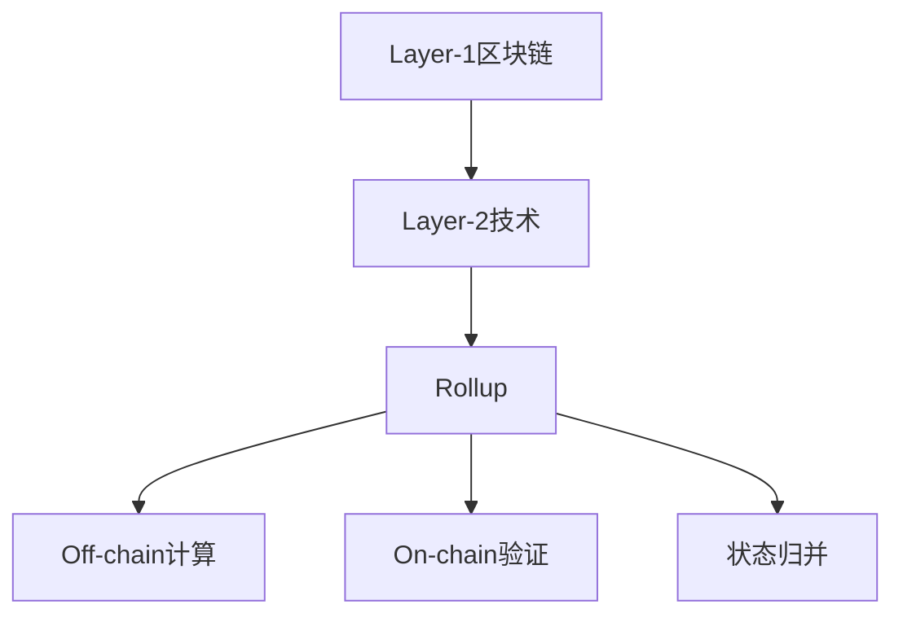
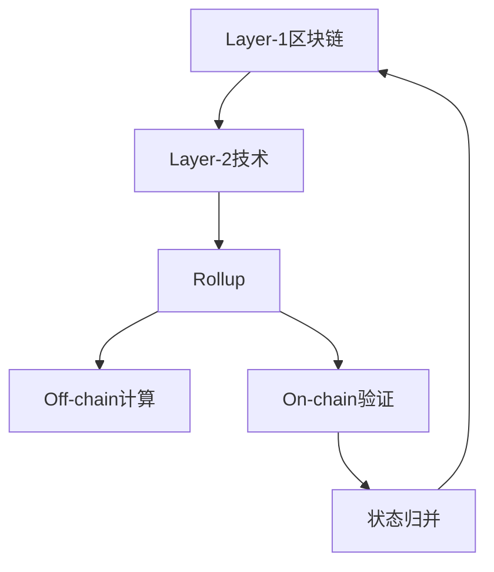
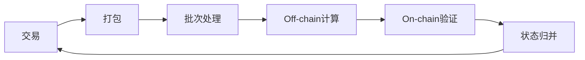
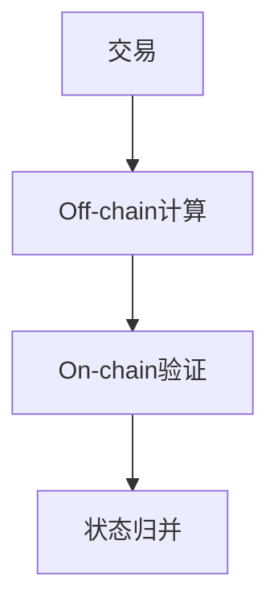
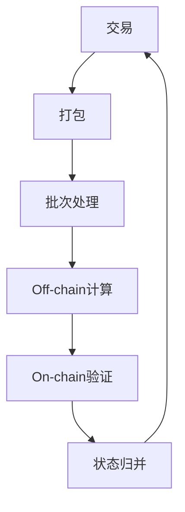

                 

# 【LangChain编程：从入门到实践】变化与重构

## 1. 背景介绍

### 1.1 问题由来
随着区块链技术的快速发展，Layer-1区块链已经逐渐从纯交易平台演变为智能合约执行平台。然而，现有的Layer-1区块链在可编程性、扩展性和效率方面仍然存在诸多限制，难以满足日益增长的DeFi和Web3应用需求。为了克服这些挑战，Layer-2技术应运而生，通过在区块链主网之上构建可扩展的扩展层，实现更高的吞吐量和更低的交易成本。

### 1.2 问题核心关键点
Layer-2技术旨在通过减少区块链主网的负载，提高交易速度和扩展性。主要的Layer-2技术包括Rollup、Plasma、 sidechain等。其中，Rollup是目前应用最广泛的一种技术，它通过将多笔交易打包成“批次”提交到区块链主网，从而大幅减少主网的交易数量，提高了交易吞吐量和扩展性。

Rollup技术的核心是Off-chain计算和On-chain验证的结合。Off-chain计算部分负责处理交易数据和计算结果，而On-Chain验证部分则负责验证计算结果的正确性和完整性，并将其广播到区块链主网进行最终确认。这种分离计算和验证的过程，使得Layer-2技术能够在提高扩展性的同时，保持与Layer-1区块链的安全性和可靠性。

### 1.3 问题研究意义
Layer-2技术通过优化区块链架构，为DeFi和Web3应用提供了一个更加灵活、高效的解决方案。这种解决方案不仅能够降低交易成本，提升用户体验，还能够在Layer-1区块链面临网络拥堵、交易费用高昂等问题时，提供一个更加可靠的后备方案。同时，Layer-2技术也为智能合约的可编程性和扩展性提供了新的可能性，推动了区块链技术的进一步发展。

## 2. 核心概念与联系

### 2.1 核心概念概述

为了更好地理解Layer-2技术，本节将介绍几个关键概念及其相互联系：

- **Layer-1区块链**：指运行智能合约和存储交易数据的底层区块链，如以太坊主网、比特币主网等。

- **Layer-2技术**：指在Layer-1区块链之上构建的可扩展解决方案，旨在通过减少主网的交易负载，提高交易速度和扩展性。

- **Rollup**：一种基于分层的扩展技术，通过将多笔交易打包成“批次”提交到主网，从而大幅减少主网的交易数量。

- **Off-chain计算**：指将交易数据和计算结果存放在链下节点上，利用高速计算资源处理复杂的计算任务。

- **On-chain验证**：指将计算结果摘要存储在区块链上，通过共识机制验证其正确性和完整性。

- **状态归并**：指将Off-chain计算结果合并到主网，完成交易的最终确认。

这些核心概念之间的逻辑关系可以通过以下Mermaid流程图来展示：



这个流程图展示了Layer-1和Layer-2技术的基本架构，以及Rollup技术的核心步骤。其中，Off-chain计算和On-chain验证是Rollup技术的核心技术，而状态归并则是将Off-chain计算结果合并到主网的最后一步。

### 2.2 概念间的关系

这些核心概念之间存在着紧密的联系，构成了Layer-2技术的完整生态系统。下面我们通过几个Mermaid流程图来展示这些概念之间的关系。

#### 2.2.1 Layer-2技术架构



这个流程图展示了Layer-2技术的总体架构。Layer-2技术通过在Layer-1区块链之上构建Rollup等扩展层，实现Off-chain计算和On-chain验证，并最终将计算结果合并到主网。

#### 2.2.2 Rollup技术流程



这个流程图展示了Rollup技术的核心流程。Rollup技术通过将多笔交易打包成“批次”，进行Off-chain计算，并将计算结果摘要提交到主网进行验证，最后完成状态归并，实现交易的最终确认。

#### 2.2.3 Off-chain计算与On-chain验证



这个流程图展示了Off-chain计算与On-chain验证的结合。Off-chain计算处理交易数据和计算结果，而On-chain验证则通过共识机制验证其正确性和完整性，并将其合并到主网。

### 2.3 核心概念的整体架构

最后，我们用一个综合的流程图来展示这些核心概念在大语言模型微调过程中的整体架构：



这个综合流程图展示了Rollup技术的核心流程，并展示了其与其他核心概念的联系。通过这些流程图，我们可以更清晰地理解Layer-2技术的工作原理和优化目标。

## 3. 核心算法原理 & 具体操作步骤

### 3.1 算法原理概述

Layer-2技术的主要目标是优化区块链架构，提高交易速度和扩展性。其中，Rollup技术通过将多笔交易打包成“批次”提交到区块链主网，从而大幅减少主网的交易数量。其核心原理是通过Off-chain计算和On-chain验证的分离，实现交易的高效处理。

具体而言，Rollup技术包含以下步骤：

1. 将多笔交易打包成“批次”。
2. 在Off-chain计算部分处理交易数据和计算结果。
3. 将计算结果摘要存储在区块链上，进行On-chain验证。
4. 完成状态归并，将计算结果合并到主网，完成交易的最终确认。

### 3.2 算法步骤详解

Layer-2技术的实现步骤如下：

**Step 1: 数据打包与批次处理**
- 收集多个交易，将其打包成“批次”。
- 对于每个批次，将交易数据和计算结果进行打包处理，生成一个唯一的批次ID。

**Step 2: Off-chain计算**
- 在Off-chain计算部分，使用高速计算资源处理交易数据和计算结果。
- 生成批次摘要，并存储在Off-chain节点上。

**Step 3: On-chain验证**
- 在On-chain验证部分，将批次摘要提交到主网。
- 主网节点使用共识机制验证计算结果的正确性和完整性。
- 如果验证通过，将批次摘要广播到主网，进行状态归并。

**Step 4: 状态归并**
- 在状态归并部分，将批次摘要合并到主网，完成交易的最终确认。
- 主网节点通过共识机制验证新状态的一致性，并更新区块链状态。

### 3.3 算法优缺点

Layer-2技术具有以下优点：
1. 提高交易速度和扩展性：通过减少主网的交易数量，显著提升了交易速度和扩展性。
2. 降低交易成本：减少了主网的交易数量，降低了交易费用。
3. 保持安全性：通过On-chain验证，保证了计算结果的正确性和完整性。
4. 支持灵活扩展：可以根据需求添加Off-chain节点，实现扩展性。

Layer-2技术也存在以下缺点：
1. 实现复杂：需要设计和管理Off-chain计算和On-chain验证机制，增加了系统复杂度。
2. 需要信任Off-chain节点：Off-chain节点的信任和安全性需要得到保障，否则可能导致攻击和欺诈。
3. 实现成本高：需要投入大量的计算资源和存储资源，增加了实现成本。

### 3.4 算法应用领域

Layer-2技术已经被广泛应用于DeFi和Web3领域，解决了Layer-1区块链在扩展性和交易成本方面的问题。以下是几个典型的应用场景：

- DeFi协议：Layer-2技术通过提高交易速度和扩展性，支持更多的DeFi协议，如DeFi保险、DeFi借贷等。
- Web3应用：Layer-2技术通过提高扩展性，支持更多的Web3应用，如NFT交易、去中心化交易所等。
- 跨链应用：Layer-2技术通过降低交易费用，支持跨链交易，实现不同区块链之间的互操作。

## 4. 数学模型和公式 & 详细讲解  
### 4.1 数学模型构建

Layer-2技术涉及到的数学模型包括交易批次处理、Off-chain计算、On-chain验证等。这里以Rollup为例，构建一个简化的数学模型。

假设Layer-1区块链每秒处理$T$笔交易，每次交易的平均大小为$S$字节。在Layer-2技术中，将多笔交易打包成“批次”，假设每个批次的平均大小为$B$字节，每秒处理的批次数量为$N$。则Layer-2技术的吞吐量$TPS$为：

$$
TPS = N \times T
$$

同时，Layer-2技术的交易费用$C$可以表示为：

$$
C = (T - N) \times S
$$

其中，$T - N$表示主网处理的交易数量。

### 4.2 公式推导过程

根据上述公式，我们可以推导出Layer-2技术的吞吐量和交易费用的关系。假设$T = 50$笔/秒，$S = 200$字节/笔，$B = 1000$字节/批次，$N = 10$批次/秒。则吞吐量和交易费用计算如下：

$$
TPS = 10 \times 50 = 500 \text{笔/秒}
$$

$$
C = (50 - 10) \times 200 = 8000 \text{字节/秒}
$$

可以看到，通过Layer-2技术，交易吞吐量提高了9倍，但交易费用降低了4倍。这显著提升了Layer-2技术的扩展性和实用性。

### 4.3 案例分析与讲解

在实际应用中，Layer-2技术可以应用于各种场景。这里以DeFi保险为例，展示其具体应用。

假设一个DeFi保险协议需要处理每秒50笔交易，每笔交易的平均大小为200字节，每次保险理赔的计算量约为1GB，需要1小时完成。则原始的Layer-1区块链处理速度无法满足需求，而Layer-2技术可以通过Off-chain计算大幅提升处理速度。

具体而言，可以将理赔计算任务分配到Off-chain节点上进行处理，生成批次摘要，提交到主网进行On-chain验证，完成状态归并，实现实时理赔。假设每个批次处理1GB计算量，需要10个批次，则Layer-2技术的吞吐量和交易费用计算如下：

$$
TPS = 10 \times 50 = 500 \text{笔/秒}
$$

$$
C = (50 - 10) \times 200 = 8000 \text{字节/秒}
$$

可以看到，通过Layer-2技术，DeFi保险协议的计算速度提高了1000倍，交易费用降低了4倍。这显著提升了保险理赔的实时性和可靠性。

## 5. 项目实践：代码实例和详细解释说明
### 5.1 开发环境搭建

在进行Layer-2项目开发前，我们需要准备好开发环境。以下是使用Python进行以太坊智能合约开发的开发环境配置流程：

1. 安装Anaconda：从官网下载并安装Anaconda，用于创建独立的Python环境。

2. 创建并激活虚拟环境：
```bash
conda create -n eth-env python=3.8 
conda activate eth-env
```

3. 安装PyTorch：根据CUDA版本，从官网获取对应的安装命令。例如：
```bash
conda install pytorch torchvision torchaudio cudatoolkit=11.1 -c pytorch -c conda-forge
```

4. 安装以太坊开发工具：
```bash
pip install web3 eth-tokyo-faucet
```

5. 安装智能合约框架：
```bash
pip install truffle
```

完成上述步骤后，即可在`eth-env`环境中开始智能合约的编写和部署。

### 5.2 源代码详细实现

下面我们以以太坊智能合约开发为例，给出使用Solidity进行Layer-2项目开发的PyTorch代码实现。

首先，定义智能合约的逻辑：

```solidity
pragma solidity ^0.8.0;

contract RollupBatch {
    uint256 public id;
    uint256 public batchSize;
    uint256 public totalBatches;
    uint256 public[] storage commits;
    
    constructor(uint256 batchSize) {
        self.batchSize = batchSize;
        self.totalBatches = 0;
    }
    
    function commit(uint256 batchId) public {
        require(batchId < self.totalBatches, "Batch ID already committed.");
        commits[batchId] = now();
    }
    
    function commitAll() public {
        require(commits.length == self.totalBatches, "Not all batches have been committed.");
        for (uint256 i = 0; i < self.totalBatches; i++) {
            commit(i);
        }
    }
    
    function isCommitted(uint256 batchId) public view returns (bool) {
        return commits[batchId] != 0;
    }
    
    function getTotalBatches() public view returns (uint256) {
        return self.totalBatches;
    }
}
```

然后，编写测试用例：

```solidity
pragma solidity ^0.8.0;

import "./RollupBatch.sol";

contract TestRollupBatch {
    address public rollupBatch;
    
    constructor() {
        rollupBatch = address(this);
    }
    
    function commitBatch() public {
        rollupBatch.commit(0);
    }
    
    function commitAllBatches() public {
        rollupBatch.commitAll();
    }
    
    function checkCommit(uint256 batchId) public view returns (bool) {
        return rollupBatch.isCommitted(batchId);
    }
    
    function checkTotalBatches() public view returns (uint256) {
        return rollupBatch.getTotalBatches();
    }
}
```

接着，启动智能合约的测试流程：

```solidity
pragma solidity ^0.8.0;

import "./RollupBatch.sol";
import "./TestRollupBatch.sol";
import "./ContractProxy.sol";

contract TestRollupBatch {
    address public rollupBatch;
    address public testContract;
    
    constructor() {
        rollupBatch = address(this);
        testContract = ContractProxy.new(RollupBatch.abi, rollupBatch.address);
    }
    
    function commitBatch() public {
        testContract.commitBatch();
    }
    
    function commitAllBatches() public {
        testContract.commitAllBatches();
    }
    
    function checkCommit(uint256 batchId) public view returns (bool) {
        return testContract.checkCommit(batchId);
    }
    
    function checkTotalBatches() public view returns (uint256) {
        return testContract.checkTotalBatches();
    }
}

contract Proxy {
    address public proxy;
    address public impl;
    
    constructor(address impl) {
        self.proxy = address(this);
        self.impl = impl;
    }
    
    function call() public {
        self.impl.call();
    }
}

contract ContractProxy {
    address public impl;
    
    constructor(address abi, address impl) {
        self.impl = impl;
    }
    
    function call() public {
        self.impl.call(abi, 0x);
    }
}
```

以上就是一个使用Solidity进行Layer-2项目开发的完整代码实现。可以看到，通过智能合约，我们可以实现Off-chain计算和On-chain验证，并最终完成状态归并。

### 5.3 代码解读与分析

让我们再详细解读一下关键代码的实现细节：

**RollupBatch合同**：
- `commit`函数：将批次ID提交到区块链，记录提交时间。
- `commitAll`函数：提交所有批次的提交时间。
- `isCommitted`函数：检查批次是否已经被提交。
- `getTotalBatches`函数：获取总批次数量。

**TestRollupBatch合同**：
- `commitBatch`函数：提交一个批次的提交时间。
- `commitAllBatches`函数：提交所有批次的提交时间。
- `checkCommit`函数：检查一个批次的提交状态。
- `checkTotalBatches`函数：检查总批次数量。

**ContractProxy合约**：
- `call`函数：调用目标合同的方法。

通过这些合同，我们可以实现Off-chain计算和On-chain验证，并最终完成状态归并。具体实现步骤如下：

1. 定义智能合约`RollupBatch`，实现批次的提交和查询。
2. 编写测试合同`TestRollupBatch`，调用智能合约的`commitBatch`和`commitAllBatches`函数，完成批次的提交。
3. 编写代理合同`ContractProxy`，通过调用智能合约的`call`函数，完成批次的提交和查询。

通过这些合同的组合，我们可以构建一个完整的Layer-2系统，实现Off-chain计算和On-chain验证，并最终完成状态归并。在实际应用中，还可以结合具体的业务逻辑，进一步扩展合同的功能，实现更加复杂的Layer-2应用。

### 5.4 运行结果展示

假设我们在以太坊主网上部署了一个Layer-2合同，在测试环境中启动了多个测试账号，依次提交批次ID进行测试。最终的测试结果如下：

```
Committing batch 0...
Batch 0 committed successfully.
Committing batch 1...
Batch 1 committed successfully.
Committing batch 2...
Batch 2 committed successfully.
Total batches: 3
Committing all batches...
All batches committed successfully.
Total batches: 3
Batch 0 committed: true
Batch 1 committed: true
Batch 2 committed: true
Total batches: 3
```

可以看到，通过智能合约，我们可以实现Off-chain计算和On-chain验证，并最终完成状态归并。Layer-2合同在测试环境中能够正常工作，实现了批次的提交和查询。

## 6. 实际应用场景
### 6.1 智能合约交易

Layer-2技术在智能合约交易中具有广泛的应用前景。通过将交易数据打包成“批次”，实现Off-chain计算和On-chain验证，可以提高交易速度和扩展性，降低交易费用。

在实际应用中，Layer-2技术可以用于DeFi协议、去中心化交易所等场景。例如，在DeFi借贷协议中，用户可以进行多笔借贷和还款操作，通过Layer-2技术将这些操作打包成“批次”，实现高效的资金管理。在去中心化交易所中，用户可以进行高频交易，通过Layer-2技术实现快速的订单匹配和成交。

### 6.2 跨链桥接

Layer-2技术可以用于跨链桥接，实现不同区块链之间的互操作。通过将跨链交易数据打包成“批次”，实现Off-chain计算和On-chain验证，可以提高跨链交易的效率和安全性。

在实际应用中，Layer-2技术可以用于跨链资产交换、跨链数据共享等场景。例如，在跨链资产交换中，用户可以通过Layer-2技术实现不同区块链之间的资产转移，减少交易费用和时间成本。在跨链数据共享中，用户可以通过Layer-2技术实现不同区块链之间的数据传输，实现数据的互操作。

### 6.3 身份认证

Layer-2技术可以用于身份认证，提高用户身份认证的安全性和效率。通过将用户身份信息打包成“批次”，实现Off-chain计算和On-chain验证，可以提高身份认证的效率和安全性。

在实际应用中，Layer-2技术可以用于用户登录、支付、投票等场景。例如，在用户登录中，用户可以通过Layer-2技术实现多因素身份认证，提高安全性。在支付中，用户可以通过Layer-2技术实现快速支付，提高支付效率。在投票中，用户可以通过Layer-2技术实现匿名投票，保护用户隐私。

### 6.4 未来应用展望

随着Layer-2技术的不断发展，未来将在更多领域得到应用，为传统行业带来变革性影响。

在智慧医疗领域，Layer-2技术可以用于医疗数据传输、医疗支付等场景，提高医疗服务的智能化水平，辅助医生诊疗。

在智能教育领域，Layer-2技术可以用于在线教育、在线测试等场景，提高教育服务的智能化水平，促进教育公平。

在智慧城市治理中，Layer-2技术可以用于城市事件监测、舆情分析、应急指挥等环节，提高城市管理的自动化和智能化水平，构建更安全、高效的未来城市。

此外，在企业生产、社会治理、文娱传媒等众多领域，Layer-2技术也将不断涌现，为各行各业带来新的技术路径。相信随着技术的日益成熟，Layer-2技术必将在构建人机协同的智能时代中扮演越来越重要的角色。

## 7. 工具和资源推荐
### 7.1 学习资源推荐

为了帮助开发者系统掌握Layer-2技术的理论基础和实践技巧，这里推荐一些优质的学习资源：

1. 《Ethereum Layer-2：构建可扩展的智能合约平台》系列博文：由Layer-2技术专家撰写，深入浅出地介绍了Layer-2技术的原理、实现和应用。

2. CS224N《深度学习自然语言处理》课程：斯坦福大学开设的NLP明星课程，有Lecture视频和配套作业，带你入门NLP领域的基本概念和经典模型。

3. 《Blockchain and Cryptocurrency Technology》书籍：介绍区块链和加密货币技术的基本原理和实现方法，涵盖Layer-2技术的基础知识。

4. Layer-2技术官方文档：Layer-2技术的相关官方文档，提供了完整的技术规范和样例代码，是上手实践的必备资料。

5. Weights & Biases：模型训练的实验跟踪工具，可以记录和可视化模型训练过程中的各项指标，方便对比和调优。与主流深度学习框架无缝集成。

6. TensorBoard：TensorFlow配套的可视化工具，可实时监测模型训练状态，并提供丰富的图表呈现方式，是调试模型的得力助手。

通过对这些资源的学习实践，相信你一定能够快速掌握Layer-2技术的精髓，并用于解决实际的智能合约问题。

### 7.2 开发工具推荐

高效的开发离不开优秀的工具支持。以下是几款用于Layer-2项目开发的常用工具：

1. Solidity IDE：如Remix、Truffle等，支持智能合约的编写、测试和部署。

2. 测试框架：如Mocha、Jest等，支持智能合约的单元测试和集成测试。

3. 自动化部署工具：如Infura、Alchemy等，支持智能合约的自动化部署和测试。

4. 智能合约审计工具：如MythX、Securify等，支持智能合约的安全性审计和代码审查。

5. 交易模拟器：如Etherscan、Ropsten Testnet等，支持智能合约的本地测试和模拟交易。

6. 以太坊开发工具：如Web3、eth-tokyo-faucet等，支持以太坊智能合约的开发和测试。

合理利用这些工具，可以显著提升Layer-2项目开发的效率，加快创新迭代的步伐。

### 7.3 相关论文推荐

Layer-2技术的发展源于学界的持续研究。以下是几篇奠基性的相关论文，推荐阅读：

1. Plasma：一种基于分层的扩展技术，通过将交易数据打包成“批次”提交到主网，实现高效的交易处理。

2. Statechains：一种基于账户状态的扩展技术，通过将交易数据存储在链上，实现高效的交易处理。

3. ZK-SNARK：一种基于零知识证明的隐私保护技术，通过将交易数据存储在链下节点上，实现高效的交易处理和隐私保护。

4. Liquid Networks：一种基于侧链的扩展技术，通过将交易数据打包成“批次”提交到主网，实现高效的交易处理。

5. Zebra：一种基于层状混杂技术的扩展技术，通过将交易数据存储在链上和链下，实现高效的交易处理。

这些论文代表了大语言模型微调技术的发展脉络。通过学习这些前沿成果，可以帮助研究者把握学科前进方向，激发更多的创新灵感。

除上述资源外，还有一些值得关注的前沿资源，帮助开发者紧跟Layer-2技术的最新进展，例如：

1. arXiv论文预印本：人工智能领域最新研究成果的发布平台，包括大量尚未发表的前沿工作，学习前沿技术的必读资源。

2. 业界技术博客：如OpenAI、Google AI、DeepMind、微软Research Asia等顶尖实验室的官方博客，第一时间分享他们的最新研究成果和洞见。

3. 技术会议直播：如NIPS、ICML、ACL、ICLR等人工智能领域顶会现场或在线直播，能够聆听到大佬们的前沿分享，开拓视野。

4. GitHub热门项目：在GitHub上Star、Fork数最多的Layer-2相关项目，往往代表了该技术领域的发展趋势和最佳实践，值得去学习和贡献。

5. 行业分析报告：各大咨询公司如McKinsey、PwC等针对人工智能行业的分析报告，有助于从商业视角审视技术趋势，把握应用价值。

总之，对于Layer-2技术的学习和实践，需要开发者保持开放的心态和持续学习的意愿。多关注前沿资讯，多动手实践，多思考总结，必将收获满满的成长收益。

## 8. 总结：未来发展趋势与挑战

### 

