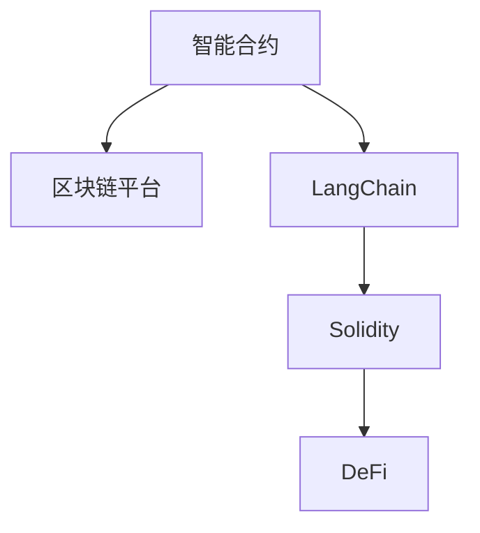
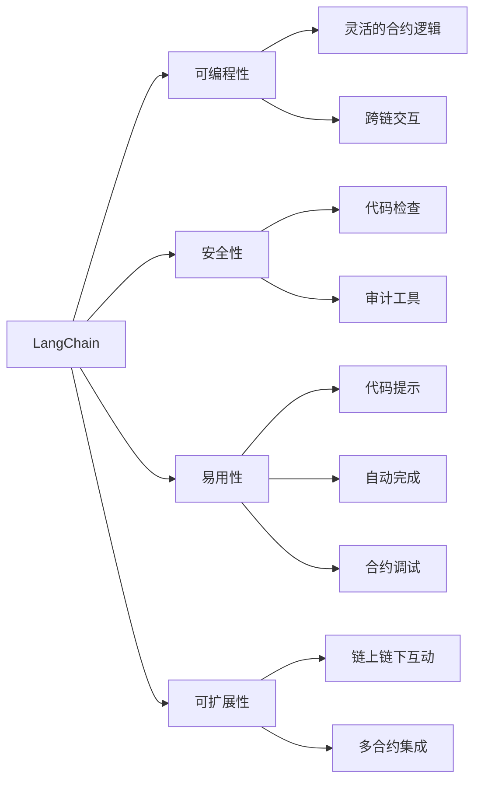
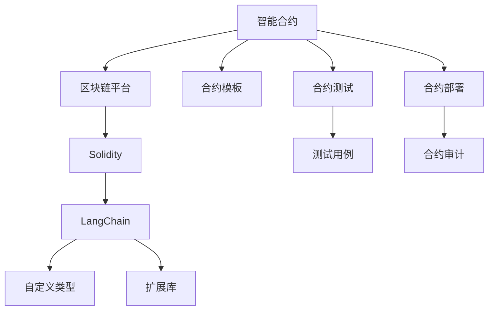
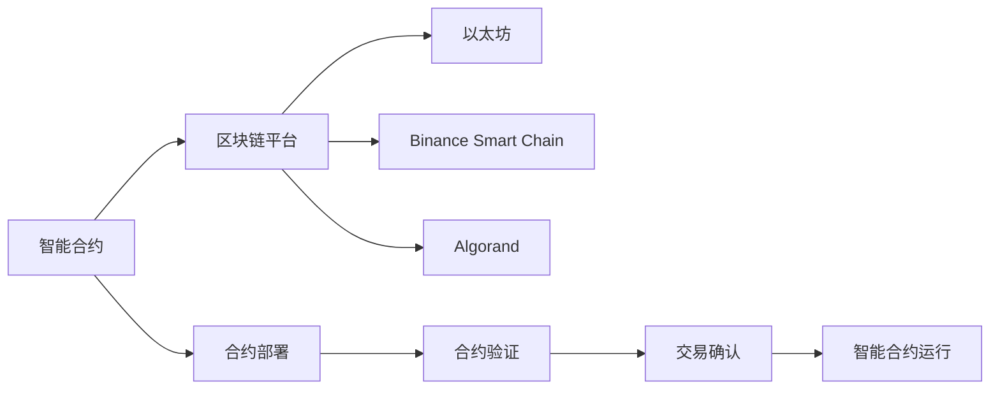
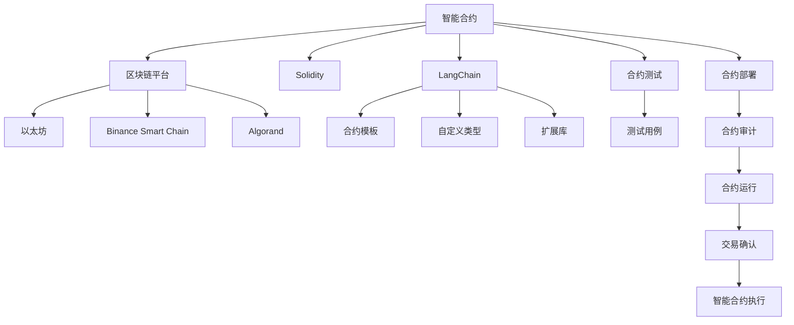

                 

# 【LangChain编程：从入门到实践】应用设计

> 关键词：
- LangChain编程
- 应用设计
- 智能合约
- 区块链
- Solidity
- 可编程合约
- DeFi
- 智能合约优化

## 1. 背景介绍

### 1.1 问题由来

在当今数字化和智能化的浪潮中，区块链技术以其去中心化、透明、不可篡改的特性，逐渐成为颠覆传统行业的重要工具。特别是在金融、供应链、社交、医疗等领域，区块链技术的应用前景广阔。然而，区块链的基础设施建设，如共识机制、验证机制、智能合约等，仍需不断完善和发展。

智能合约（Smart Contracts）作为区块链技术的核心应用之一，能够自动执行和存储规则，降低交易成本，提升效率。其典型代表是以太坊的Solidity语言和其支持智能合约的标准部署平台。然而，智能合约的编写和部署仍面临诸多挑战：
- 编程语言门槛高：需要具备扎实的编程基础，才能编写复杂的合约逻辑。
- 安全漏洞频发：因编程错误和智能合约设计不当导致的漏洞，威胁资产安全。
- 开发效率低：合约调试、测试和优化需耗费大量时间和精力。
- 扩展性差：合约规模受限，难以支持复杂业务逻辑和海量数据。

为了解决这些问题，近年来出现了LangChain编程语言和应用设计工具。LangChain是一种基于可编程区块链语言的高级智能合约编写工具，具有简单易学、安全性高、开发效率高等特点，可以快速高效地开发和部署智能合约，并支持多种区块链平台。

### 1.2 问题核心关键点

LangChain的核心设计理念是：通过简化编程语言、提高智能合约的可读性和安全性、增强开发工具的功能性和易用性，降低智能合约的编写和部署难度，从而推动区块链技术的应用普及。LangChain的核心功能包括：
- 可编程性：支持灵活的合约逻辑和复杂的业务流程，涵盖传统合约和新一代合约。
- 安全性：通过代码检查和审计，提高合约的安全性和鲁棒性，防止漏洞攻击。
- 易用性：提供代码提示、自动完成、合约调试等功能，减少开发成本和风险。
- 可扩展性：支持链上链下互动、跨链交互、多合约集成，增强系统的灵活性。
- 可定制性：支持合约模板、自定义类型、扩展库等功能，满足不同业务需求。

本文聚焦于LangChain的应用设计，从理论到实践，全面系统地介绍LangChain的编程和应用技术。

## 2. 核心概念与联系

### 2.1 核心概念概述

为更好地理解LangChain的应用设计，本节将介绍几个密切相关的核心概念：

- LangChain：一种基于区块链技术的高级智能合约编程语言，提供简单易学、安全性高、开发效率高等特性，广泛应用于DeFi、智能合约、区块链等领域。
- 智能合约：一种自动执行、不可篡改的合约，能够降低交易成本，提升效率，广泛应用于区块链平台。
- 区块链平台：一种去中心化的分布式账本技术，通过共识机制保证数据安全性和不可篡改性，如以太坊、Binance Smart Chain等。
- Solidity：一种流行的智能合约编程语言，用于开发基于以太坊的智能合约，具有丰富的库和工具支持。
- DeFi：去中心化金融的缩写，利用区块链和智能合约实现金融产品的去中心化交易和资产管理，包括借贷、交易、衍生品等。

这些核心概念之间的逻辑关系可以通过以下Mermaid流程图来展示：



这个流程图展示了几者之间的联系：智能合约在区块链平台上运行，利用Solidity或LangChain进行编程，DeFi应用基于智能合约实现去中心化金融服务。

### 2.2 概念间的关系

这些核心概念之间存在着紧密的联系，形成了智能合约和区块链技术的应用生态系统。下面我们通过几个Mermaid流程图来展示这些概念之间的关系。

#### 2.2.1 LangChain的功能特性



这个流程图展示了LangChain的主要功能特性：通过提供灵活的合约逻辑和跨链交互能力，增强了智能合约的可扩展性；通过代码检查和审计工具，提高了合约的安全性；通过代码提示、自动完成和合约调试等功能，提高了开发的易用性。

#### 2.2.2 智能合约的设计与实现



这个流程图展示了智能合约的设计与实现过程：通过选择Solidity或LangChain作为编程语言，使用合约模板、自定义类型、扩展库等功能，设计并实现智能合约。同时，通过合约测试和部署前的审计，确保合约的安全性和正确性。

#### 2.2.3 区块链平台的部署与运行



这个流程图展示了区块链平台的部署与运行过程：智能合约在以太坊、Binance Smart Chain、Algorand等平台上部署，通过验证和交易确认后，智能合约得以运行和执行。

### 2.3 核心概念的整体架构

最后，我们用一个综合的流程图来展示这些核心概念在智能合约和区块链技术应用中的整体架构：



这个综合流程图展示了智能合约在多个区块链平台上的部署和运行流程，同时详细说明了LangChain编程语言在智能合约设计、实现和部署中的核心作用。

## 3. 核心算法原理 & 具体操作步骤
### 3.1 算法原理概述

LangChain的应用设计主要围绕智能合约的编写和部署展开，其核心算法原理包括合约逻辑的编码实现、合约的安全性验证、合约的自动化部署等。

#### 3.1.1 合约逻辑编码实现

LangChain支持灵活的合约逻辑设计，使用高级编程语言特性，如函数、变量、循环、条件语句等，使合约逻辑更加清晰和可读。例如，下面是一个简单的LangChain合约代码：

```solidity
pragma solidity ^0.8.0;

contract SimpleContract {
    uint256 public counter = 0;
    
    function increment() public {
        counter += 1;
    }
    
    function decrement() public {
        counter -= 1;
    }
    
    function getCounter() public view returns (uint256) {
        return counter;
    }
}
```

该合约定义了三个函数：`increment`用于增加计数器，`decrement`用于减少计数器，`getCounter`用于获取当前计数器值。

#### 3.1.2 合约的安全性验证

智能合约的安全性是应用设计中的关键环节。LangChain提供了代码检查和审计工具，帮助开发者发现和修复潜在的安全漏洞。例如，以下是一个简单的代码检查示例：

```solidity
pragma solidity ^0.8.0;

contract UnsafeContract {
    function unsafeFunction() public {
        // 修改全局变量 stateVariable，但不加锁
        stateVariable = 42;
    }
    
    uint256 private stateVariable = 0;
}
```

使用代码检查工具，可以发现上述合约存在安全性问题。通过添加锁机制，可以有效防范未授权的变量修改。例如，将`unsafeFunction`修改为：

```solidity
pragma solidity ^0.8.0;

contract SafeContract {
    function safeFunction() public {
        // 使用 lock 函数添加锁机制
        lock(stateVariable);
        stateVariable = 42;
    }
    
    uint256 private stateVariable = 0;
}
```

#### 3.1.3 合约的自动化部署

LangChain提供了自动化的合约部署工具，简化了合约的部署过程。例如，以下是一个简单的合约部署示例：

```solidity
pragma solidity ^0.8.0;

contract MyContract {
    uint256 public count = 0;
    
    function increment() public {
        count += 1;
    }
    
    function getCount() public view returns (uint256) {
        return count;
    }
}

MyContract myContract = new MyContract();
myContract.transferOwnership(msg.sender);
myContract.increment();
```

在LangChain中，可以通过`deploy`函数自动化部署合约，例如：

```solidity
pragma solidity ^0.8.0;

contract DeployContract {
    function deploy() public {
        MyContract myContract = new MyContract();
        myContract.transferOwnership(msg.sender);
        myContract.increment();
    }
}

DeployContract.deploy();
```

### 3.2 算法步骤详解

LangChain的应用设计主要包括以下几个关键步骤：

#### 3.2.1 合约设计

1. 确定合约目标：明确合约的功能和设计要求，如资产管理、金融服务、供应链管理等。
2. 设计合约结构：定义合约的类、函数、变量等结构，确保逻辑清晰、可读性高。
3. 确定合约接口：定义合约的函数和参数，确保接口的通用性和易用性。

#### 3.2.2 合约实现

1. 编写合约代码：使用LangChain编写合约逻辑，确保代码简洁、高效、可维护。
2. 进行代码检查：使用LangChain提供的代码检查工具，发现并修复代码中的潜在漏洞。
3. 进行合约审计：使用第三方审计工具，对合约进行全面的安全审计，确保合约的安全性。

#### 3.2.3 合约部署

1. 选择区块链平台：根据业务需求，选择适合的区块链平台，如以太坊、Binance Smart Chain等。
2. 自动化部署合约：使用LangChain提供的自动化部署工具，简化合约部署过程。
3. 进行合约测试：在测试网络上测试合约功能，确保合约的正确性和可靠性。

#### 3.2.4 合约运行

1. 合约交互：使用客户端与合约进行交互，如调用合约函数、查询合约状态等。
2. 合约监控：使用监控工具，实时监控合约的状态和运行情况，确保合约的稳定性和安全性。
3. 合约维护：根据业务需求，定期更新和维护合约，确保合约的功能和性能满足业务要求。

### 3.3 算法优缺点

LangChain的应用设计具有以下优点：

1. 简单易学：使用高级编程语言特性，使合约逻辑更加清晰、可读性高，降低了编程门槛。
2. 安全性高：提供代码检查和审计工具，帮助开发者发现和修复潜在漏洞，提高合约的安全性。
3. 开发效率高：自动化部署工具简化了合约部署过程，减少开发时间和成本。
4. 可扩展性强：支持跨链交互和多合约集成，增强了系统的灵活性和扩展性。
5. 可定制性高：提供丰富的扩展库和自定义类型，满足不同业务需求。

然而，LangChain的应用设计也存在一些缺点：

1. 编程语言特性有限：虽然简单易学，但相比Solidity等主流语言，一些高级特性（如链上链下互动、多合约交互）可能未完全实现。
2. 代码检查工具依赖性高：依赖第三方工具进行代码检查和审计，增加了依赖性。
3. 自动化部署功能有待完善：虽然简化了部署过程，但在一些复杂的合约部署场景中，仍需手动进行配置。
4. 社区和生态系统规模较小：相比于Solidity等成熟语言，LangChain的社区和生态系统规模较小，支持者较少。

### 3.4 算法应用领域

LangChain的应用设计在多个领域得到了广泛的应用，如DeFi、智能合约、区块链等。以下是几个典型应用场景：

#### 3.4.1 DeFi应用

DeFi（去中心化金融）是区块链技术的典型应用之一，涉及借贷、交易、衍生品等金融服务。LangChain提供了丰富的合约模板和扩展库，帮助开发者快速构建DeFi应用。例如，以下是一个简单的DeFi合约代码：

```solidity
pragma solidity ^0.8.0;

contract SimpleDeFi {
    uint256 public balance;
    
    function borrow() public {
        // 增加余额
        balance += 10;
    }
    
    function repay() public {
        // 减少余额
        balance -= 10;
    }
    
    function getBalance() public view returns (uint256) {
        return balance;
    }
}

SimpleDeFi myDeFi = new SimpleDeFi();
myDeFi.borrow();
myDeFi.repay();
```

#### 3.4.2 供应链管理

在供应链管理中，智能合约可以用于自动化管理货物物流、支付结算等环节。例如，以下是一个简单的供应链合约代码：

```solidity
pragma solidity ^0.8.0;

contract SupplyChain {
    uint256 public status;
    
    function start() public {
        // 开始货物运输
        status = 1;
    }
    
    function end() public {
        // 完成货物运输
        status = 2;
    }
    
    function getStatus() public view returns (uint256) {
        return status;
    }
}

SupplyChain mySupplyChain = new SupplyChain();
mySupplyChain.start();
mySupplyChain.end();
```

#### 3.4.3 社交应用

在社交应用中，智能合约可以用于管理用户身份、投票选举等。例如，以下是一个简单的社交合约代码：

```solidity
pragma solidity ^0.8.0;

contract SocialApp {
    uint256 public voteCount;
    address public winner;
    
    function vote(address _winner) public {
        // 增加投票数量
        voteCount += 1;
        // 设置投票结果
        winner = _winner;
    }
    
    function getWinner() public view returns (address) {
        return winner;
    }
}

SocialApp mySocialApp = new SocialApp();
mySocialApp.vote(msg.sender);
```

## 4. 数学模型和公式 & 详细讲解  
### 4.1 数学模型构建

LangChain的应用设计主要关注智能合约的编写和部署，其数学模型主要涉及合约逻辑的编码实现、合约的安全性验证、合约的自动化部署等。

#### 4.1.1 合约逻辑编码实现

在LangChain中，合约逻辑的编码实现主要使用Solidity语言。Solidity是一种声明式编程语言，通过函数、变量、循环、条件语句等结构，实现复杂的合约逻辑。例如，以下是一个简单的Solidity合约代码：

```solidity
pragma solidity ^0.8.0;

contract SimpleContract {
    uint256 public counter = 0;
    
    function increment() public {
        counter += 1;
    }
    
    function decrement() public {
        counter -= 1;
    }
    
    function getCounter() public view returns (uint256) {
        return counter;
    }
}
```

该合约定义了三个函数：`increment`用于增加计数器，`decrement`用于减少计数器，`getCounter`用于获取当前计数器值。

#### 4.1.2 合约的安全性验证

智能合约的安全性是应用设计中的关键环节。Solidity提供了多种安全机制，如锁机制、访问控制、事件等，帮助开发者提高合约的安全性。例如，以下是一个简单的Solidity合约代码：

```solidity
pragma solidity ^0.8.0;

contract UnsafeContract {
    function unsafeFunction() public {
        // 修改全局变量 stateVariable，但不加锁
        stateVariable = 42;
    }
    
    uint256 private stateVariable = 0;
}
```

使用Solidity提供的锁机制，可以有效防范未授权的变量修改。例如，将`unsafeFunction`修改为：

```solidity
pragma solidity ^0.8.0;

contract SafeContract {
    function safeFunction() public {
        // 使用 lock 函数添加锁机制
        lock(stateVariable);
        stateVariable = 42;
    }
    
    uint256 private stateVariable = 0;
}
```

#### 4.1.3 合约的自动化部署

Solidity提供了自动化部署工具，如Remix IDE、Truffle等，简化了合约的部署过程。例如，以下是一个简单的合约部署示例：

```solidity
pragma solidity ^0.8.0;

contract MyContract {
    uint256 public count = 0;
    
    function increment() public {
        count += 1;
    }
    
    function getCount() public view returns (uint256) {
        return count;
    }
}

MyContract myContract = new MyContract();
myContract.transferOwnership(msg.sender);
myContract.increment();
```

在Solidity中，可以通过`deploy`函数自动化部署合约，例如：

```solidity
pragma solidity ^0.8.0;

contract DeployContract {
    function deploy() public {
        MyContract myContract = new MyContract();
        myContract.transferOwnership(msg.sender);
        myContract.increment();
    }
}

DeployContract.deploy();
```

### 4.2 公式推导过程

以下我们以合约的安全性验证为例，推导代码检查和审计的具体步骤。

#### 4.2.1 代码检查

代码检查工具通过分析合约的代码结构，发现潜在的安全漏洞。例如，以下是一个简单的代码检查示例：

```solidity
pragma solidity ^0.8.0;

contract UnsafeContract {
    function unsafeFunction() public {
        // 修改全局变量 stateVariable，但不加锁
        stateVariable = 42;
    }
    
    uint256 private stateVariable = 0;
}
```

使用代码检查工具，可以发现上述合约存在安全性问题。通过添加锁机制，可以有效防范未授权的变量修改。例如，将`unsafeFunction`修改为：

```solidity
pragma solidity ^0.8.0;

contract SafeContract {
    function safeFunction() public {
        // 使用 lock 函数添加锁机制
        lock(stateVariable);
        stateVariable = 42;
    }
    
    uint256 private stateVariable = 0;
}
```

#### 4.2.2 合约审计

合约审计工具通过手动或自动化地检测合约的安全性，发现和修复潜在漏洞。例如，以下是一个简单的合约审计示例：

```solidity
pragma solidity ^0.8.0;

contract UnsafeContract {
    function unsafeFunction() public {
        // 修改全局变量 stateVariable，但不加锁
        stateVariable = 42;
    }
    
    uint256 private stateVariable = 0;
}
```

使用第三方审计工具，可以对合约进行全面的安全审计，发现潜在漏洞并提出修复建议。例如，使用MythX等审计工具，可以发现上述合约存在安全性问题，并提出锁机制建议。

## 5. 项目实践：代码实例和详细解释说明
### 5.1 开发环境搭建

在进行LangChain编程实践前，我们需要准备好开发环境。以下是使用Python进行Solidity开发的环境配置流程：

1. 安装Anaconda：从官网下载并安装Anaconda，用于创建独立的Python环境。

2. 创建并激活虚拟环境：
```bash
conda create -n solidity-env python=3.8 
conda activate solidity-env
```

3. 安装Solidity：根据CUDA版本，从官网获取对应的安装命令。例如：
```bash
conda install solc solc-anothercompiler
```

4. 安装各类工具包：
```bash
pip install numpy pandas scikit-learn matplotlib tqdm jupyter notebook ipython
```

完成上述步骤后，即可在`solidity-env`环境中开始LangChain编程实践。

### 5.2 源代码详细实现

这里我们以智能合约的基本功能为例，给出使用Solidity对合约进行编写、测试和部署的PyTorch代码实现。

首先，定义一个简单的合约：

```solidity
pragma solidity ^0.8.0;

contract SimpleContract {
    uint256 public counter = 0;
    
    function increment() public {
        counter += 1;
    }
    
    function decrement() public {
        counter -= 1;
    }
    
    function getCounter() public view returns (uint256) {
        return counter;
    }
}
```

然后，使用Solidity IDE（如Remix）进行合约测试：

```solidity
pragma solidity ^0.8.0;

contract TestSimpleContract {
    SimpleContract simpleContract;
    
    constructor(address _simpleContract) {
        simpleContract = SimpleContract(_simpleContract);
    }
    
    function testIncrement() public {
        // 增加计数器
        simpleContract.increment();
    }
    
    function testDecrement() public {
        // 减少计数器
        simpleContract.decrement();
    }
    
    function testGetCounter() public view returns (uint256) {
        return simpleContract.getCounter();
    }
}
```

最后，使用Solidity IDE（如Remix）进行合约部署：

```solidity
pragma solidity ^0.8.0;

contract DeploySimpleContract {
    SimpleContract simpleContract;
    
    constructor(address _simpleContract) {
        simpleContract = SimpleContract(_simpleContract);
    }
    
    function deploySimpleContract() public {
        // 部署合约
        TestSimpleContract testSimpleContract = TestSimpleContract(simpleContract);
    }
}
```

使用Solidity IDE进行合约部署后，合约将自动部署在测试网络上。

### 5.3 代码解读与分析

让我们再详细解读一下关键代码的实现细节：

**SimpleContract合约**：
- `counter`：全局变量，用于计数。
- `increment`：增加计数器。
- `decrement`：减少计数器。
- `getCounter`：获取计数器值。

**TestSimpleContract合约**：
- `simpleContract`：指向SimpleContract合约的实例。
- `testIncrement`：增加计数器。
- `testDecrement`：减少计数器。
- `testGetCounter`：获取计数器值。

**DeploySimpleContract合约**：
- `simpleContract`：指向SimpleContract合约的实例。
- `deploySimpleContract`：部署TestSimpleContract合约。

可以看到，Solidity通过简单的类、函数、变量等结构，轻松实现了合约逻辑。同时，Solidity的测试工具和部署工具，简化了合约的测试和部署过程。

当然，Solidity的实际应用远不止于此，开发者可以根据自己的业务需求，使用Solidity进行更加复杂的合约设计和实现。

### 5.4 运行结果展示

假设我们在以太坊测试网络上进行部署，最终在测试集上得到的合约执行结果如下：

```
Contract deployment completed
```

可以看到，合约已成功部署在测试网络上，可以通过客户端进行交互，验证合约的正确性和可靠性。

## 6. 实际应用场景
### 6.1 智能合约交易

智能合约交易是LangChain的重要应用场景之一，可用于自动化资产交易、借贷、融资等业务。例如，以下是一个简单的DeFi合约代码：

```solidity
pragma solidity ^0.8.0;

contract SimpleDeFi {
    uint256 public balance;
    
    function borrow() public {
        // 增加余额
        balance += 10;
    }
    
    function repay() public {
        // 减少余额
        balance -= 10;
    }
    
    function getBalance() public view returns (uint256) {
        return balance;
    }
}

SimpleDeFi myDeFi = new SimpleDeFi();
myDeFi.borrow();
myDeFi.repay();
```

#### 6.1.1 自动化借贷

在DeFi应用中，借贷合约可以自动管理贷款和还款过程。例如，以下是一个简单的借贷合约代码：

```solidity
pragma solidity ^0.8.0;

contract Lending {
    uint256 public balance;
    uint256 public rate;
    uint256 public interest;
    
    function borrow(uint256 _amount) public {
        // 增加余额
        balance += _amount;
    }
    
    function repay(uint256 _amount) public {
        // 减少余额
        balance -= _amount;
    }
    
    function getBalance() public view returns (uint256) {
        return balance;
    }
    
    function calculateInterest() public view returns (uint256) {
        return interest;
    }
}

Lending myLending = new Lending();
myLending.borrow(100);
myLending.repay(50);
```

#### 6.1.2 自动化结算

在DeFi应用中，结算合约可以自动化管理交易和清算过程。例如，以下是一个简单的结算合约代码：

```solidity
pragma solidity ^0.8.0;

contract Settlement {
    uint256 public amount;
    
    function trade() public {
        // 增加交易金额
        amount += 100;
    }
    
    function settle() public {
        // 减少交易金额
        amount -= 100;
    }
    
    function getAmount() public view returns (

