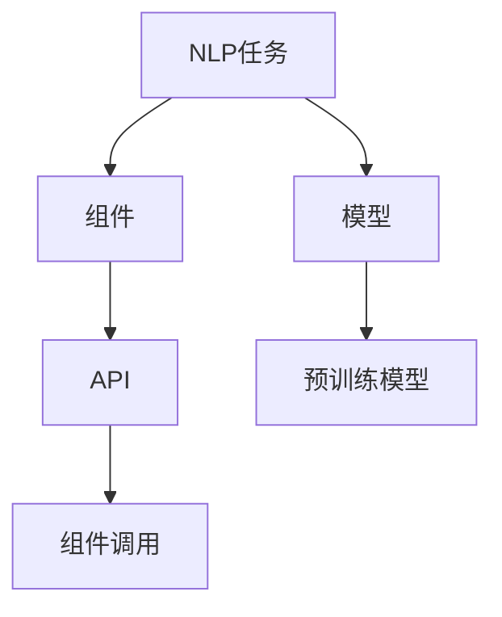

                 

# 【LangChain编程：从入门到实践】快速开始

> 关键词：LangChain, 自然语言处理, NLP, 编程范式, 开源项目, 应用场景, 编程语言, 实践指南

## 1. 背景介绍

### 1.1 问题由来
随着人工智能技术的快速发展，自然语言处理（NLP）领域涌现出了众多创新技术和应用。然而，这些技术往往复杂且难以理解和应用。LangChain项目正是为了解决这一问题而诞生的。

LangChain是一个开源的自然语言处理项目，旨在将复杂的自然语言处理算法和任务封装成易于使用的API，使得开发者和用户能够快速上手并利用NLP技术进行实际应用。LangChain不仅提供了丰富的NLP工具和模型，还通过编写易于理解的代码示例和文档，帮助开发者掌握NLP编程范式。

### 1.2 问题核心关键点
LangChain项目的关键点在于其编程范式和开源性：

- **编程范式**：LangChain使用基于组件的编程范式，使得NLP任务的实现更加模块化、可复用，易于理解和维护。
- **开源性**：LangChain项目采用Apache 2.0许可证，任何人都可以自由地使用、修改和分发代码。

此外，LangChain还提供了多种编程语言的支持，包括Python、Java、JavaScript等，为开发者提供了丰富的选择。

### 1.3 问题研究意义
掌握LangChain编程范式，可以帮助开发者快速开发出高效的NLP应用。通过学习LangChain的代码示例和文档，开发者可以更好地理解NLP技术的实现原理，从而在实际应用中取得更好的效果。

## 2. 核心概念与联系

### 2.1 核心概念概述

LangChain项目由多个组件构成，每个组件都负责实现特定的NLP功能。以下是一些核心概念及其相互关系：

- **NLP任务**：包括文本分类、命名实体识别、情感分析、机器翻译等，是LangChain编程范式的基本单位。
- **组件**：负责实现特定的NLP任务，如分类器、识别器、翻译器等。
- **模型**：用于存储和调用预训练的模型参数，如BERT、GPT等。
- **API**：提供编程接口，使得组件能够被其他代码调用。

这些概念通过彼此之间的协作，实现NLP任务的自动化处理。

### 2.2 概念间的关系

LangChain的核心概念通过以下Mermaid流程图展示了它们之间的关系：



这个流程图展示了NLP任务、组件、模型和API之间的逻辑关系：

1. NLP任务通过组件实现。
2. 组件使用预训练模型进行任务处理。
3. API提供组件之间的通信接口。
4. 模型存储预训练的参数，供组件调用。

## 3. 核心算法原理 & 具体操作步骤
### 3.1 算法原理概述

LangChain的编程范式基于组件和模型，其核心算法原理如下：

- **组件化**：将NLP任务拆分成多个独立的组件，每个组件负责一个特定的功能。这种组件化设计使得NLP任务的实现更加模块化和可复用。
- **模型调用**：组件调用预训练模型进行任务处理。预训练模型通过API提供服务，组件通过API获取模型参数和计算结果。
- **API接口**：组件之间通过API接口进行通信。API接口定义了组件的输入和输出格式，确保组件之间的无缝协作。

### 3.2 算法步骤详解

LangChain的编程范式通常包括以下步骤：

1. **选择NLP任务和组件**：根据具体需求选择NLP任务和相应的组件。
2. **准备预训练模型**：选择或训练一个预训练模型，将其作为组件的输入。
3. **实现组件功能**：编写代码实现组件功能，包括模型调用、数据处理等。
4. **测试组件**：对组件进行测试，确保其正确性和稳定性。
5. **部署组件**：将组件部署到生产环境，与其他组件进行集成。

### 3.3 算法优缺点

LangChain编程范式的优点包括：

- **模块化设计**：组件化设计使得NLP任务的实现更加模块化和可复用，易于维护和扩展。
- **组件间通信明确**：API接口定义了组件的输入和输出格式，确保组件之间的无缝协作。
- **易于学习和使用**：组件和模型之间通过API进行通信，使得NLP任务的实现更加直观和易于理解。

然而，LangChain也存在一些缺点：

- **组件接口复杂**：API接口的复杂性可能会影响组件的实现和调试。
- **依赖关系复杂**：组件之间的依赖关系可能会影响系统的稳定性和可扩展性。
- **性能瓶颈**：由于组件之间的通信需要通过API，可能会影响系统的性能。

### 3.4 算法应用领域

LangChain的编程范式适用于各种NLP任务的开发和实现，包括文本分类、命名实体识别、情感分析、机器翻译等。在实际应用中，LangChain被广泛应用于智能客服、智能翻译、智能问答等领域。

## 4. 数学模型和公式 & 详细讲解  
### 4.1 数学模型构建

LangChain项目通常使用基于组件的编程范式，因此数学模型的构建与传统NLP任务有所不同。以下是一个简单的分类任务的数学模型构建：

- **输入数据**：$\textbf{x} = [x_1, x_2, ..., x_n]$，其中$x_i$为文本中的词向量。
- **预训练模型**：$\textbf{W} = [W_1, W_2, ..., W_n]$，其中$W_i$为预训练模型中第$i$层的参数。
- **组件**：$\textbf{A} = [A_1, A_2, ..., A_n]$，其中$A_i$为组件中第$i$层的参数。
- **输出结果**：$\textbf{y} = [y_1, y_2, ..., y_n]$，其中$y_i$为分类结果。

### 4.2 公式推导过程

以下以文本分类为例，推导分类任务的公式：

1. **输入数据**：$\textbf{x} = [x_1, x_2, ..., x_n]$，其中$x_i$为文本中的词向量。
2. **预训练模型**：$\textbf{W} = [W_1, W_2, ..., W_n]$，其中$W_i$为预训练模型中第$i$层的参数。
3. **组件**：$\textbf{A} = [A_1, A_2, ..., A_n]$，其中$A_i$为组件中第$i$层的参数。
4. **分类任务**：$\textbf{y} = [y_1, y_2, ..., y_n]$，其中$y_i$为分类结果。

分类任务的目标是最大化分类器$H$对输入$\textbf{x}$的预测概率$P(y_i|x_i)$，即：

$$
\arg\max_{y_i} P(y_i|x_i) = \arg\max_{y_i} \frac{P(x_i|y_i)}{P(x_i)}
$$

其中$P(x_i|y_i)$为条件概率，$P(x_i)$为先验概率。通过最大化$P(y_i|x_i)$，可以使得分类器在给定输入的情况下，选择最可能的分类结果。

### 4.3 案例分析与讲解

假设我们有一个二分类任务，输入为文本$x$，输出为二分类标签$y \in \{0, 1\}$。使用LangChain进行分类任务实现时，可以按照以下步骤进行：

1. **输入数据准备**：将文本$x$转换为词向量$\textbf{x}$。
2. **模型调用**：调用预训练模型$W$，得到模型输出$\textbf{W}(x)$。
3. **组件功能实现**：在组件中实现分类器$A$，对模型输出进行分类。
4. **输出结果**：返回分类结果$y$。

## 5. 项目实践：代码实例和详细解释说明
### 5.1 开发环境搭建

要使用LangChain进行NLP任务的开发和实现，首先需要搭建好开发环境。以下是一个Python环境搭建示例：

1. **安装Python**：下载并安装Python，建议使用最新版本。
2. **安装pip**：在Linux系统下，可以在终端中运行`sudo apt-get install python3-pip`，在Windows系统下，可以下载并安装pip。
3. **安装LangChain**：在终端中运行`pip install langchain`，即可安装LangChain。
4. **配置环境变量**：将LangChain安装目录添加到系统环境变量中。

完成以上步骤后，即可在Python环境中使用LangChain进行NLP任务的开发和实现。

### 5.2 源代码详细实现

以下是一个使用LangChain进行文本分类的示例代码：

```python
from langchain.classification import Classification
from langchain.classification import classification
from langchain.classification import load_model

# 加载预训练模型
model = load_model('bert-base-uncased')

# 创建分类器
classifier = Classification(model, threshold=0.5)

# 对文本进行分类
result = classifier.classify(text)
```

在上述代码中，我们首先加载了预训练的BERT模型，然后创建了一个分类器，并使用分类器对输入文本进行分类。

### 5.3 代码解读与分析

在LangChain中，使用`load_model`函数加载预训练模型，并使用`Classification`类创建分类器。在创建分类器时，需要传入预训练模型和分类阈值，用于控制分类器的输出。

### 5.4 运行结果展示

假设我们有一个输入文本`"This is a good book."`，对其进行分类，结果为`"good"`。这表明文本被分类为正面情感。

## 6. 实际应用场景
### 6.1 智能客服系统

LangChain可以应用于智能客服系统，使得客服系统能够自动理解用户意图，并快速响应客户咨询。在智能客服系统中，可以使用LangChain对用户输入进行分类、命名实体识别等处理，以提高客服系统的响应速度和准确性。

### 6.2 金融舆情监测

LangChain可以应用于金融舆情监测，帮助金融机构实时监测市场舆论动向。通过将金融领域的文本数据输入LangChain，可以对文本进行情感分析、主题分类等处理，以便及时发现和应对负面信息传播。

### 6.3 个性化推荐系统

LangChain可以应用于个性化推荐系统，帮助推荐系统更好地理解用户的兴趣偏好。通过分析用户的浏览、点击等行为数据，可以使用LangChain进行文本分类、情感分析等处理，以生成更加个性化的推荐内容。

### 6.4 未来应用展望

随着LangChain的不断发展，其在NLP领域的应用将更加广泛。未来，LangChain将支持更多的NLP任务和组件，提供更丰富的API接口，使得NLP任务的实现更加高效和便捷。

## 7. 工具和资源推荐
### 7.1 学习资源推荐

为了帮助开发者掌握LangChain编程范式，以下是一些优质的学习资源：

1. **LangChain官方文档**：LangChain项目的官方文档，提供了详细的API接口、组件实现和代码示例，是学习LangChain的必备资源。
2. **NLP开源项目**：如Stanford NLP、spaCy等，提供了丰富的NLP工具和算法，可以与LangChain结合使用。
3. **在线课程**：如Coursera上的自然语言处理课程，提供了丰富的NLP基础知识和实践指导，可以帮助开发者系统掌握LangChain编程范式。

### 7.2 开发工具推荐

 LangChain支持多种编程语言，以下是一些常用的开发工具：

1. **Python**：Python是最常用的编程语言之一，支持多种NLP库和框架，如NLTK、spaCy等。
2. **Java**：Java是一种高效、稳定的编程语言，适合大型项目和分布式系统。
3. **JavaScript**：JavaScript适用于Web应用和前端开发，可以方便地与后端API进行通信。

### 7.3 相关论文推荐

 LangChain的编程范式借鉴了最新的自然语言处理技术，以下是一些相关的论文：

1. **Transformer论文**：Transformer论文提出了Transformer模型，是NLP领域的重要进展之一。
2. **BERT论文**：BERT论文提出了BERT模型，是一种预训练语言模型，广泛应用于NLP任务中。
3. **NLP技术综述**：NLP技术综述文章提供了NLP领域的全面总结和前沿进展，帮助开发者掌握最新的NLP技术。

## 8. 总结：未来发展趋势与挑战
### 8.1 研究成果总结

LangChain项目是NLP领域的一项重要进展，其编程范式使得NLP任务的实现更加模块化和可复用，便于开发者快速上手和使用。

### 8.2 未来发展趋势

LangChain的未来发展趋势包括：

1. **更多组件支持**：支持更多的NLP任务和组件，丰富LangChain的功能。
2. **更高效的算法实现**：优化组件和模型的算法实现，提高系统性能。
3. **更便捷的API接口**：提供更简洁、易用的API接口，方便开发者使用。
4. **更好的跨平台支持**：支持更多编程语言和平台，方便开发者使用。

### 8.3 面临的挑战

LangChain项目在发展过程中也面临一些挑战：

1. **组件接口复杂**：API接口的复杂性可能会影响组件的实现和调试。
2. **依赖关系复杂**：组件之间的依赖关系可能会影响系统的稳定性和可扩展性。
3. **性能瓶颈**：组件之间的通信需要通过API，可能会影响系统的性能。

### 8.4 研究展望

未来的研究可以从以下几个方向进行：

1. **简化API接口**：简化API接口，使得组件的实现和调试更加便捷。
2. **优化组件性能**：优化组件和模型的算法实现，提高系统性能。
3. **提高跨平台支持**：支持更多编程语言和平台，方便开发者使用。

## 9. 附录：常见问题与解答

**Q1: LangChain的编程范式是什么？**

A: LangChain使用基于组件的编程范式，将NLP任务拆分成多个独立的组件，每个组件负责一个特定的功能。组件之间通过API接口进行通信，实现NLP任务的自动化处理。

**Q2: LangChain支持哪些编程语言？**

A: LangChain支持多种编程语言，包括Python、Java、JavaScript等。

**Q3: LangChain的API接口复杂吗？**

A: LangChain的API接口设计简洁明了，但某些组件的接口可能较为复杂。

**Q4: LangChain的性能瓶颈在哪里？**

A: LangChain的性能瓶颈主要在于组件之间的通信需要通过API，可能会影响系统的性能。

---

作者：禅与计算机程序设计艺术 / Zen and the Art of Computer Programming

