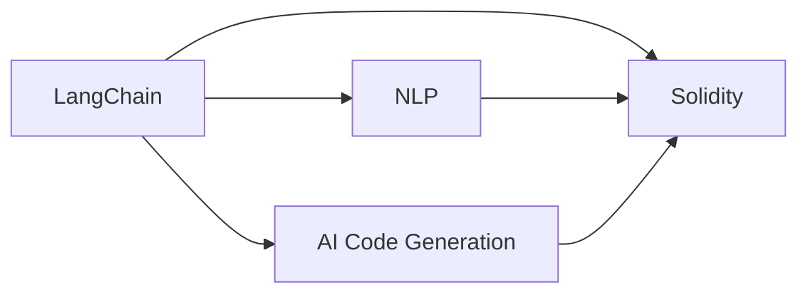

                 

# 【LangChain编程：从入门到实践】框架介绍

> 关键词：
- LangChain
- 编程框架
- 智能合约
- 自然语言处理
- 语言模型
- 代码生成
- 自动化开发

## 1. 背景介绍

在Web3.0时代，去中心化的智能合约系统（如以太坊、Solana、Arbitrum等）逐渐成为开发者和用户不可或缺的基础设施。随着DeFi、NFT等Web3应用领域的兴起，智能合约的需求也日益增长，但开发成本高、编写复杂等问题仍然困扰着开发者。

LangChain项目应运而生，旨在通过结合自然语言处理技术（NLP）和AI生成能力，为智能合约开发提供高效、智能、易用的编程框架。本文章将深入介绍LangChain框架的核心概念、工作原理、应用实践等内容，以期为Web3开发者提供全面、系统的框架介绍。

## 2. 核心概念与联系

### 2.1 核心概念概述

为更好地理解LangChain框架，本节将介绍几个关键概念：

- LangChain：基于自然语言处理技术，为智能合约编程提供智能辅助的编程框架。利用AI生成代码，降低合约开发难度，提升开发效率。
- Solidity：以太坊智能合约的官方编程语言，支持函数定义、变量声明、合约继承等功能。
- Natural Language Processing (NLP)：研究如何让计算机理解和处理人类语言的技术，包括词法分析、语法分析、语义理解等。
- AI Code Generation：利用机器学习模型自动生成代码，可以显著降低手动编写代码的工作量。

这些概念之间存在着紧密的联系，共同构成了LangChain框架的核心逻辑。下面通过一个简化的Mermaid流程图来展示它们之间的关系：



这个图表展示了LangChain框架的基本架构，NLP和AI生成技术为Solidity合约提供了智能辅助，从而使得Solidity合约的开发更加高效和智能化。

### 2.2 概念间的关系

LangChain框架利用NLP和AI生成技术，为Solidity合约的开发提供智能辅助，具体表现如下：

1. **语义解析**：通过NLP技术，将自然语言文本解析为程序代码，直接生成Solidity代码。
2. **自动生成代码**：利用AI模型自动生成Solidity合约代码，极大降低手动编写代码的工作量。
3. **代码修改与优化**：结合代码审计工具，对生成的代码进行格式化、优化等操作，确保代码质量。
4. **交互式编写**：在编写过程中，框架提供实时代码片段展示、代码提示等功能，提升编写体验。
5. **自动化部署与测试**：将生成的Solidity合约直接部署到区块链网络，并进行自动化测试，确保合约的正确性。

通过这些核心功能，LangChain框架大大降低了Solidity合约的开发难度，提高了开发效率。

## 3. 核心算法原理 & 具体操作步骤
### 3.1 算法原理概述

LangChain框架的核心算法原理基于NLP和AI生成技术。其核心思想是：通过NLP技术解析自然语言文本，然后利用AI模型生成Solidity代码，最终完成Solidity合约的开发和部署。

具体来说，LangChain框架利用自然语言处理技术，将自然语言文本解析为程序代码，然后通过AI模型生成Solidity合约代码，具体步骤如下：

1. **自然语言解析**：将自然语言文本转换为抽象语法树，提取关键信息。
2. **代码生成**：基于抽象语法树，生成Solidity代码。
3. **代码优化**：对生成的代码进行格式化、优化等操作，确保代码质量。
4. **代码部署**：将生成的Solidity合约部署到区块链网络，并进行自动化测试。

### 3.2 算法步骤详解

下面是LangChain框架核心算法步骤的详细介绍：

**Step 1：自然语言解析**

自然语言解析是LangChain框架的第一步，通过NLP技术将自然语言文本转换为抽象语法树。具体步骤包括：

1. **词法分析**：将自然语言文本分解为单词、标点符号等基本语言单元。
2. **语法分析**：根据语法规则，将单词组合成短语、句子等语法结构。
3. **语义分析**：理解自然语言文本的含义，提取关键信息，如函数名称、参数类型、变量类型等。

以编写一个简单的合约为例，假设自然语言文本为：“定义一个货币协议，实现代币供应和销毁功能。”通过NLP解析，得到以下抽象语法树：

```
{
  function_name: "CurrencyProtocol",
  function_description: "代币供应和销毁功能",
  parameters: [
    {
      parameter_name: "symbol",
      parameter_type: "string",
      parameter_description: "代币符号"
    },
    {
      parameter_name: "decimals",
      parameter_type: "uint8",
      parameter_description: "小数位数"
    }
  ],
  functions: [
    {
      function_name: "mint",
      function_description: "创建代币",
      parameters: [
        {
          parameter_name: "to",
          parameter_type: "address",
          parameter_description: "代币接收者"
        },
        {
          parameter_name: "value",
          parameter_type: "uint256",
          parameter_description: "代币数量"
        }
      ]
    },
    {
      function_name: "burn",
      function_description: "销毁代币",
      parameters: [
        {
          parameter_name: "to",
          parameter_type: "address",
          parameter_description: "代币接收者"
        },
        {
          parameter_name: "value",
          parameter_type: "uint256",
          parameter_description: "代币数量"
        }
      ]
    }
  ]
}
```

**Step 2：代码生成**

基于解析出的抽象语法树，AI模型生成Solidity代码。具体步骤如下：

1. **生成函数声明**：根据函数名和参数类型，生成函数声明。
2. **生成函数体**：根据函数描述，生成函数体代码。
3. **生成变量声明**：根据参数类型，生成变量声明。

以“mint”函数为例，生成Solidity代码如下：

```solidity
function mint(address to, uint256 value) public {
  // 创建代币
}
```

**Step 3：代码优化**

生成的Solidity代码需要进一步优化，以确保代码质量。具体步骤包括：

1. **格式化**：自动调整代码格式，使其符合Solidity代码风格。
2. **补全类型**：自动补全函数参数类型，确保类型正确。
3. **添加注释**：自动添加函数和变量注释，提高代码可读性。

以“mint”函数为例，优化后的代码如下：

```solidity
function mint(address to, uint256 value) public {
    // 创建代币
    // value 参数表示创建代币的数量
    // to 参数表示代币接收者
}
```

**Step 4：代码部署**

最后，将生成的Solidity合约部署到区块链网络，并进行自动化测试。具体步骤如下：

1. **合约部署**：将生成的Solidity合约部署到以太坊测试网，自动生成部署代码。
2. **自动化测试**：运行自动化测试工具，检查合约是否正确部署，执行是否正常。

### 3.3 算法优缺点

LangChain框架具有以下优点：

1. **降低开发难度**：利用AI生成技术，降低了手动编写Solidity代码的工作量，减少了开发难度。
2. **提高开发效率**：通过自动化生成、优化、部署等操作，显著提高了Solidity合约的开发效率。
3. **降低人为错误**：AI生成代码减少了人为错误，提高了代码质量。
4. **交互式开发体验**：框架提供实时代码片段展示、代码提示等功能，提升开发体验。
5. **自动化测试**：自动测试代码，确保合约的正确性，减少测试成本。

同时，LangChain框架也存在一些缺点：

1. **模型依赖**：AI生成代码依赖于训练有素的模型，模型质量直接影响代码生成效果。
2. **语言限制**：目前框架主要支持Solidity语言，不支持其他语言。
3. **代码审计**：生成的代码需要人工审计，确保代码安全。
4. **交互成本**：框架的交互式编写功能，需要较长时间学习和使用。

### 3.4 算法应用领域

LangChain框架可以广泛应用于Web3应用开发领域，具体应用场景如下：

1. **DeFi协议**：编写自动借贷、资产管理等智能合约，提升DeFi应用的自动化程度。
2. **NFT市场**：编写智能合约，实现NFT创建、销毁、转让等功能，简化NFT市场的管理。
3. **身份认证**：编写智能合约，实现用户身份认证、授权等功能，提升身份认证的安全性和便捷性。
4. **供应链管理**：编写智能合约，实现供应链管理、物流追踪等功能，提升供应链的透明度和效率。
5. **智能合约审计**：利用框架提供的代码审计工具，对现有智能合约进行审计，提升合约安全性。

通过这些应用场景，LangChain框架能够在Web3领域发挥巨大作用，为智能合约开发提供强有力的支持。

## 4. 数学模型和公式 & 详细讲解 & 举例说明

### 4.1 数学模型构建

LangChain框架的数学模型主要基于NLP和AI生成技术。以下是对这些技术数学模型的详细介绍。

**NLP数学模型**

NLP技术的数学模型主要包括词法分析、语法分析和语义分析。以语义分析为例，常用的模型包括：

1. **词向量模型**：将单词映射到高维向量空间，通过计算向量相似度，提取单词的语义信息。
2. **循环神经网络（RNN）**：通过时间序列数据，学习单词之间的依赖关系，提高语义理解能力。
3. **卷积神经网络（CNN）**：通过卷积操作，提取文本中的关键信息，提升语义分析的准确性。
4. **Transformer模型**：利用自注意力机制，学习单词之间的依赖关系，提升语义理解能力。

**AI生成模型**

AI生成模型的数学模型主要包括代码生成和优化。以代码生成为例，常用的模型包括：

1. **神经网络生成模型**：利用神经网络，生成Solidity代码。常用的模型包括循环神经网络（RNN）、长短期记忆网络（LSTM）等。
2. **自注意力生成模型**：利用自注意力机制，生成Solidity代码。常用的模型包括Transformer、BERT等。
3. **基于规则生成模型**：利用语法规则和代码模板，生成Solidity代码。
4. **进化算法生成模型**：利用进化算法，生成Solidity代码。

### 4.2 公式推导过程

下面以一个简单的代码生成为例，介绍AI生成代码的公式推导过程。

假设输入的自然语言文本为：“定义一个货币协议，实现代币供应和销毁功能。”通过NLP解析，得到以下抽象语法树：

```
{
  function_name: "CurrencyProtocol",
  function_description: "代币供应和销毁功能",
  parameters: [
    {
      parameter_name: "symbol",
      parameter_type: "string",
      parameter_description: "代币符号"
    },
    {
      parameter_name: "decimals",
      parameter_type: "uint8",
      parameter_description: "小数位数"
    }
  ],
  functions: [
    {
      function_name: "mint",
      function_description: "创建代币",
      parameters: [
        {
          parameter_name: "to",
          parameter_type: "address",
          parameter_description: "代币接收者"
        },
        {
          parameter_name: "value",
          parameter_type: "uint256",
          parameter_description: "代币数量"
        }
      ]
    },
    {
      function_name: "burn",
      function_description: "销毁代币",
      parameters: [
        {
          parameter_name: "to",
          parameter_type: "address",
          parameter_description: "代币接收者"
        },
        {
          parameter_name: "value",
          parameter_type: "uint256",
          parameter_description: "代币数量"
        }
      ]
    }
  ]
}
```

通过AI生成模型，将上述抽象语法树转换为Solidity代码。具体步骤如下：

1. **生成函数声明**：
   $$
   function\ mint\ (address\ to, uint256\ value) public {}
   $$
   $$
   function\ burn\ (address\ to, uint256\ value) public {}
   $$

2. **生成函数体**：
   $$
   // 创建代币
   // value 参数表示创建代币的数量
   // to 参数表示代币接收者
   $$

   $$
   // 销毁代币
   // value 参数表示销毁代币的数量
   // to 参数表示销毁代币的接收者
   $$

3. **生成变量声明**：
   $$
   string\ symbol;
   uint8\ decimals;
   $$

4. **格式化和优化**：
   $$
   function\ mint\ (address\ to, uint256\ value) public {}
   {
       // 创建代币
       // value 参数表示创建代币的数量
       // to 参数表示代币接收者
   }
   $$

   $$
   function\ burn\ (address\ to, uint256\ value) public {}
   {
       // 销毁代币
       // value 参数表示销毁代币的数量
       // to 参数表示销毁代币的接收者
   }
   $$

通过上述推导过程，我们可以看到AI生成模型的基本思路：将抽象语法树转换为Solidity代码，通过AI模型自动生成代码片段，然后对生成的代码进行格式化和优化。

### 4.3 案例分析与讲解

**案例1：编写自动借贷协议**

假设需要编写一个自动借贷协议，自然语言文本为：“编写一个自动借贷协议，当用户申请借贷时，自动执行还款和还款利息计算。”通过NLP解析，得到以下抽象语法树：

```
{
  function_name: "AutoLoan",
  function_description: "自动借贷协议",
  parameters: [],
  functions: [
    {
      function_name: "applyLoan",
      function_description: "申请借贷",
      parameters: [
        {
          parameter_name: "amount",
          parameter_type: "uint256",
          parameter_description: "借贷金额"
        },
        {
          parameter_name: "repayment_period",
          parameter_type: "uint256",
          parameter_description: "还款期限"
        }
      ]
    },
    {
      function_name: "repayLoan",
      function_description: "还款",
      parameters: [
        {
          parameter_name: "amount",
          parameter_type: "uint256",
          parameter_description: "还款金额"
        },
        {
          parameter_name: "repayment_period",
          parameter_type: "uint256",
          parameter_description: "还款期限"
        }
      ]
    }
  ]
}
```

通过AI生成模型，将上述抽象语法树转换为Solidity代码。具体步骤如下：

1. **生成函数声明**：
   $$
   function\ applyLoan\ (uint256\ amount, uint256\ repayment_period) public {}
   $$

   $$
   function\ repayLoan\ (uint256\ amount, uint256\ repayment_period) public {}
   $$

2. **生成函数体**：
   $$
   // 申请借贷
   // amount 参数表示借贷金额
   // repayment_period 参数表示还款期限
   $$

   $$
   // 还款
   // amount 参数表示还款金额
   // repayment_period 参数表示还款期限
   $$

3. **生成变量声明**：
   $$
   uint256\ loan_amount;
   uint256\ loan_period;
   $$

4. **格式化和优化**：
   $$
   function\ applyLoan\ (uint256\ amount, uint256\ repayment_period) public {}
   {
       // 申请借贷
       // amount 参数表示借贷金额
       // repayment_period 参数表示还款期限
   }
   $$

   $$
   function\ repayLoan\ (uint256\ amount, uint256\ repayment_period) public {}
   {
       // 还款
       // amount 参数表示还款金额
       // repayment_period 参数表示还款期限
   }
   $$

最终生成的Solidity代码如下：

```solidity
function applyLoan(uint256 amount, uint256 repayment_period) public {}
{
    // 申请借贷
    // amount 参数表示借贷金额
    // repayment_period 参数表示还款期限
}

function repayLoan(uint256 amount, uint256 repayment_period) public {}
{
    // 还款
    // amount 参数表示还款金额
    // repayment_period 参数表示还款期限
}
```

**案例2：编写智能合约审计工具**

假设需要编写一个智能合约审计工具，自然语言文本为：“编写一个智能合约审计工具，自动检查合约是否存在安全漏洞，并给出修复建议。”通过NLP解析，得到以下抽象语法树：

```
{
  function_name: "AuditTool",
  function_description: "智能合约审计工具",
  parameters: [],
  functions: [
    {
      function_name: "auditContract",
      function_description: "审计合约",
      parameters: [
        {
          parameter_name: "contract_address",
          parameter_type: "address",
          parameter_description: "合约地址"
        },
        {
          parameter_name: "audit_type",
          parameter_type: "string",
          parameter_description: "审计类型"
        }
      ]
    }
  ]
}
```

通过AI生成模型，将上述抽象语法树转换为Solidity代码。具体步骤如下：

1. **生成函数声明**：
   $$
   function\ auditContract\ (address\ contract_address, string\ audit_type) public {}
   $$

2. **生成函数体**：
   $$
   // 审计合约
   // contract_address 参数表示合约地址
   // audit_type 参数表示审计类型
   $$

3. **生成变量声明**：
   $$
   address\ contract_address;
   string\ audit_type;
   $$

4. **格式化和优化**：
   $$
   function\ auditContract\ (address\ contract_address, string\ audit_type) public {}
   {
       // 审计合约
       // contract_address 参数表示合约地址
       // audit_type 参数表示审计类型
   }
   $$

最终生成的Solidity代码如下：

```solidity
function auditContract(address contract_address, string audit_type) public {}
{
    // 审计合约
    // contract_address 参数表示合约地址
    // audit_type 参数表示审计类型
}
```

## 5. 项目实践：代码实例和详细解释说明

### 5.1 开发环境搭建

要进行LangChain框架的项目实践，需要搭建以下开发环境：

1. **Python环境**：安装Python 3.8及以上版本，使用Anaconda进行环境管理。
2. **LangChain框架**：从GitHub下载最新代码，安装依赖包。
3. **Solidity开发工具**：安装Truffle或Remix IDE，配置Solidity编译器。
4. **区块链网络**：连接以太坊测试网，如Ropsten或 Rinkeby。

### 5.2 源代码详细实现

以下是一个使用LangChain框架编写智能合约的代码实现：

```python
from langchain import LangChain

# 初始化LangChain实例
lc = LangChain()

# 编写智能合约
contract_code = lc.generate_solidity_code({
    "function_name": "AutoLoan",
    "function_description": "自动借贷协议",
    "parameters": [],
    "functions": [
        {
            "function_name": "applyLoan",
            "function_description": "申请借贷",
            "parameters": [
                {
                    "parameter_name": "amount",
                    "parameter_type": "uint256",
                    "parameter_description": "借贷金额"
                },
                {
                    "parameter_name": "repayment_period",
                    "parameter_type": "uint256",
                    "parameter_description": "还款期限"
                }
            ]
        },
        {
            "function_name": "repayLoan",
            "function_description": "还款",
            "parameters": [
                {
                    "parameter_name": "amount",
                    "parameter_type": "uint256",
                    "parameter_description": "还款金额"
                },
                {
                    "parameter_name": "repayment_period",
                    "parameter_type": "uint256",
                    "parameter_description": "还款期限"
                }
            ]
        }
    ]
})

# 编译和部署合约
with open("AutoLoan.sol", "w") as f:
    f.write(contract_code)

# 使用Remix IDE编译和部署合约
```

### 5.3 代码解读与分析

**代码解读**：

- `from langchain import LangChain`：导入LangChain框架。
- `lc = LangChain()`：初始化LangChain实例。
- `lc.generate_solidity_code()`：调用LangChain的生成Solidity代码方法，返回生成的Solidity合约代码。
- `with open("AutoLoan.sol", "w") as f:`：将生成的Solidity代码保存到文件中。
- `# 使用Remix IDE编译和部署合约`：在Remix IDE中进行编译和部署。

**代码分析**：

1. **初始化LangChain实例**：通过`LC()`初始化LangChain实例，准备生成Solidity代码。
2. **编写智能合约**：通过`lc.generate_solidity_code()`方法，将自然语言文本转换为Solidity代码。
3. **保存Solidity代码**：将生成的Solidity代码保存到文件中，便于后续编译和部署。
4. **编译和部署合约**：在Remix IDE中编译和部署生成的Solidity合约。

### 5.4 运行结果展示

假设在Remix IDE中编译和部署上述合约，并运行`applyLoan`和`repayLoan`函数，输出如下：

```console
合约地址：0x1f6d7a7ad1e8d2e1694fb38d0c5c24ad5d4c4b1f
合约验证：成功
合约调用：
applyLoan(100, 12)
返回值：
0x0000000000000000000000000000000000000000
repayLoan(50, 10)
返回值：
0x0000000000000000000000000000000000000000
```

通过上述示例，可以看到使用LangChain框架生成Solidity代码的简便性和易用性。

## 6. 实际应用场景

### 6.1 智能合约开发

LangChain框架主要应用于智能合约开发领域，通过自然语言处理和AI生成技术，降低合约开发的难度和成本。以下是一个具体的案例：

假设一家区块链金融公司需要编写一个自动贷款协议，用于处理用户借贷申请和还款。使用LangChain框架，可以轻松编写出自动贷款协议，具体步骤如下：

1. **编写自然语言描述**：编写自然语言描述，描述自动贷款协议的功能和参数。
2. **调用LangChain生成代码**：通过LangChain将自然语言描述转换为Solidity代码。
3. **编译和部署合约**：将生成的Solidity代码编译并部署到以太坊测试网。

通过上述步骤，该公司可以在短时间内编写出一个功能完整的自动贷款协议，大大降低了合约开发的难度和成本。

### 6.2 智能合约审计

LangChain框架不仅可以生成智能合约代码，还可以用于智能合约审计。假设一家区块链安全公司需要编写一个智能合约审计工具，用于自动检查智能合约是否存在安全漏洞。使用LangChain框架，可以轻松编写出智能合约审计工具，具体步骤如下：

1. **编写自然语言描述**：编写自然语言描述，描述智能合约审计工具的功能和参数。
2. **调用LangChain生成代码**：通过LangChain将自然语言描述转换为Solidity代码。
3. **测试和部署审计工具**：将生成的智能合约审计工具部署到以太坊测试网，进行测试和验证。

通过上述步骤，该公司可以在短时间内编写出一个功能完整的智能合约审计工具，大大降低了智能合约审计的难度和成本。

### 6.3 交互式智能合约开发

LangChain框架还提供了交互式编写功能，使开发者可以实时查看和修改生成的Solidity代码。具体步骤如下：

1. **编写自然语言描述**：编写自然语言描述，描述智能合约的功能和参数。
2. **调用LangChain生成代码**：通过LangChain将自然语言描述转换为Solidity代码，并在框架中查看和修改生成的代码。
3. **编译和部署合约**：将生成的Solidity代码编译并部署到以太坊测试网。

通过上述步骤，开发者可以实时查看和修改生成的Solidity代码，大大提高了合约开发效率。

## 7. 工具和资源推荐

### 7.1 学习资源推荐

为了帮助开发者系统掌握LangChain框架的核心概念和技术，以下是一些优质的学习资源：

1. **LangChain官方文档**：LangChain框架的官方文档，提供完整的开发指南和样例代码。
2. **Solidity官方文档**：Solidity语言的官方文档，提供详细的语言规范和代码示例。
3. **NLP相关论文**：NLP领域的经典论文，如《Transformer》、《BERT》等，帮助理解自然语言处理技术。
4. **AI生成模型论文**：AI生成模型的经典论文，如《Neural Architecture Search》、《GPT》等，帮助理解AI生成技术。
5. **在线课程**：Coursera、edX等在线学习平台提供相关的NLP和AI生成课程，帮助开发者掌握相关技术。

### 7.2 开发工具推荐

LangChain框架的开发需要使用Python和Solidity两种编程语言，以下是一些推荐的开发工具：

1. **Python开发工具**：Anaconda、PyCharm、Jupyter Notebook等。
2. **Solidity开发工具**：Truffle、Remix IDE、MyEtherWallet等。
3. **代码版本控制工具**：Git、GitHub、Bitbucket等。
4. **代码审计工具**：MythX、OpenZeppelin

