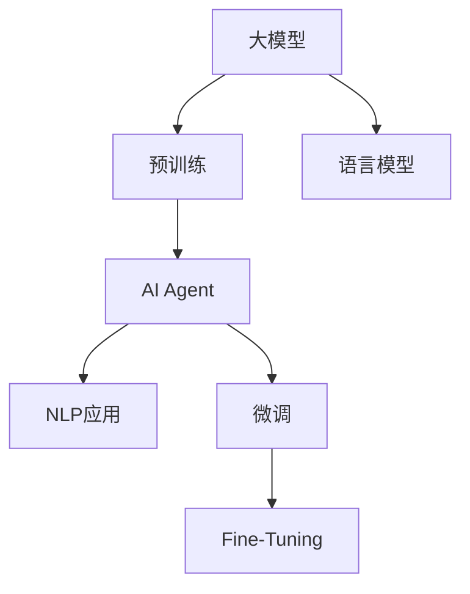

                 

# 【大模型应用开发 动手做AI Agent】Agent的行动力：语言输出能力和工具使用能力

> 关键词：大模型,AI Agent,自然语言处理(NLP),语言模型,微调,Fine-Tuning

## 1. 背景介绍

在AI领域，Agent已成为一种重要的研究对象。它代表了一个能够感知、学习、推理和决策的系统，能够在复杂环境中自动执行任务。近年来，基于大模型的Agent在自然语言处理（Natural Language Processing, NLP）领域取得了显著进展，特别是在语言理解和生成能力方面。本文将探讨大模型在构建具有强大语言输出能力的AI Agent中的重要作用，同时介绍一些关键工具和资源的推荐，帮助读者深入了解和实践大模型的应用开发。

## 2. 核心概念与联系

### 2.1 核心概念概述

为更好地理解基于大模型的AI Agent开发，我们需要先了解几个核心概念：

- **大模型(Large Models)**：指那些在大规模无标签数据上预训练的模型，如BERT、GPT等。这些模型通过自我监督学习掌握了丰富的语言知识和表达能力。

- **AI Agent**：即人工智能代理，指能够通过感知环境、学习经验、推理决策，并根据目标采取行动的系统。

- **自然语言处理(NLP)**：涉及计算机与人类语言之间的交互，旨在使计算机能够理解、处理和生成人类语言。

- **语言模型(Language Model)**：用于评估文本序列概率的模型，如LSTM、GRU、Transformer等。

- **微调(Fine-Tuning)**：指在大模型基础上，使用少量有标签数据对其进行优化，使其适应特定任务。

这些概念之间存在紧密联系，共同构成了基于大模型的AI Agent开发的基础框架。

### 2.2 概念间的关系

通过以下Mermaid流程图，可以更直观地理解这些概念之间的关系：



该流程图展示了从预训练模型到AI Agent，再到具体NLP应用的全过程：

- 大模型通过在大规模无标签数据上进行预训练，获得基础的语言表示能力。
- 预训练后的模型作为AI Agent的基础框架，用于感知环境、推理决策。
- 通过微调，使模型在特定任务上获得更高的性能。
- 最终，模型被应用于各种NLP任务，如问答、对话、翻译等。

## 3. 核心算法原理 & 具体操作步骤

### 3.1 算法原理概述

基于大模型的AI Agent开发，其核心算法原理可以概括为以下几个步骤：

1. **预训练模型加载**：选择合适的预训练模型（如BERT、GPT等），加载到系统中。
2. **微调**：使用少量有标签数据对模型进行微调，使其适应特定的NLP任务。
3. **推理与决策**：将输入的文本数据输入微调后的模型，通过推理和决策机制生成相应的输出。
4. **后处理**：对模型的输出结果进行后处理，如解码、格式化等，生成最终的服务响应。

### 3.2 算法步骤详解

以下是基于大模型的AI Agent开发的具体操作步骤：

**Step 1: 准备数据集和模型**
- 收集并标注适用于特定NLP任务的数据集。
- 选择合适的预训练模型（如BERT、GPT等），加载到系统中。

**Step 2: 微调模型**
- 将标注好的数据集作为微调数据，加载到模型中。
- 设置微调所需的超参数，如学习率、批量大小、迭代轮数等。
- 使用微调算法（如AdamW、SGD等）对模型进行微调。

**Step 3: 推理与决策**
- 输入新的文本数据，使用微调后的模型进行推理。
- 根据推理结果，采取相应的决策和行动。

**Step 4: 后处理**
- 对模型的输出进行解码和格式化，生成最终的文本响应。

### 3.3 算法优缺点

基于大模型的AI Agent开发，其优点和缺点如下：

**优点**：
- **高效的通用表示**：大模型能够高效地表示和理解多种语言现象，为Agent提供了丰富的背景知识。
- **低成本微调**：相比从头训练，使用大模型微调所需的标注数据和计算资源大大减少。
- **快速的部署和迭代**：微调后的模型可以快速部署并应用于各种NLP任务，迭代速度较快。

**缺点**：
- **依赖高质量标注数据**：微调效果很大程度上取决于标注数据的质量和数量。
- **模型解释性不足**：微调模型通常是“黑盒”系统，缺乏可解释性。
- **资源消耗大**：大模型参数量庞大，对计算资源和存储空间有较高要求。

### 3.4 算法应用领域

基于大模型的AI Agent开发已在多个领域得到应用，例如：

- **智能客服**：使用AI Agent处理用户咨询，提供快速响应和解决方案。
- **金融分析**：利用AI Agent分析金融市场数据，提供投资建议和风险评估。
- **医学诊断**：利用AI Agent处理医疗数据，辅助医生进行疾病诊断和药物推荐。
- **智能翻译**：使用AI Agent进行实时翻译，提供跨语言沟通支持。
- **自然语言生成**：利用AI Agent生成自然语言文本，如文章、新闻等。

## 4. 数学模型和公式 & 详细讲解

### 4.1 数学模型构建

为了更好地理解和应用大模型，我们需要构建数学模型。以下是一个简单的语言模型数学模型构建过程：

**目标**：训练一个语言模型 $p(w_1, w_2, ..., w_T)$，使得该模型能够预测给定文本 $T$ 的概率。

**假设**：
- 文本 $T$ 可以表示为 $w_1, w_2, ..., w_T$ 的序列。
- 模型的输出 $p(w_1, w_2, ..., w_T)$ 可以表示为序列 $w_1, w_2, ..., w_T$ 的条件概率。

**构建模型**：
- 使用概率模型 $p(w_1, w_2, ..., w_T|w_{1:t-1})$ 表示文本 $T$ 在给定前 $t-1$ 个词的情况下，第 $t$ 个词的条件概率。
- 通过最大似然估计（Maximum Likelihood Estimation,MLE），最大化训练数据的似然函数 $\mathcal{L}(p) = \prod_{t=1}^{T} p(w_t|w_{1:t-1})$。

**数学公式**：
$$
\begin{align*}
p(w_1, w_2, ..., w_T) &= \prod_{t=1}^{T} p(w_t|w_{1:t-1}) \\
\mathcal{L}(p) &= \prod_{t=1}^{T} p(w_t|w_{1:t-1}) \\
&= \prod_{t=1}^{T} \frac{p(w_t)}{\sum_{w_{1:t-1}} p(w_{1:t-1}, w_t)}
\end{align*}
$$

### 4.2 公式推导过程

对于上述数学模型，我们使用最大似然估计方法来推导模型的参数更新公式：

$$
\theta \leftarrow \theta - \eta \nabla_{\theta}\mathcal{L}(\theta)
$$

其中 $\eta$ 为学习率，$\nabla_{\theta}\mathcal{L}(\theta)$ 为损失函数对参数 $\theta$ 的梯度，可以通过反向传播算法计算。

### 4.3 案例分析与讲解

以BERT模型为例，其数学模型构建如下：

**目标**：训练BERT模型 $p(w_1, w_2, ..., w_T)$，使得该模型能够预测给定文本 $T$ 的概率。

**假设**：
- 文本 $T$ 可以表示为 $w_1, w_2, ..., w_T$ 的序列。
- 模型的输出 $p(w_1, w_2, ..., w_T)$ 可以表示为序列 $w_1, w_2, ..., w_T$ 的条件概率。

**构建模型**：
- 使用概率模型 $p(w_1, w_2, ..., w_T|w_{1:t-1})$ 表示文本 $T$ 在给定前 $t-1$ 个词的情况下，第 $t$ 个词的条件概率。
- 通过最大似然估计（MLE），最大化训练数据的似然函数 $\mathcal{L}(p) = \prod_{t=1}^{T} p(w_t|w_{1:t-1})$。

**数学公式**：
$$
\begin{align*}
p(w_1, w_2, ..., w_T) &= \prod_{t=1}^{T} p(w_t|w_{1:t-1}) \\
\mathcal{L}(p) &= \prod_{t=1}^{T} p(w_t|w_{1:t-1}) \\
&= \prod_{t=1}^{T} \frac{p(w_t)}{\sum_{w_{1:t-1}} p(w_{1:t-1}, w_t)}
\end{align*}
$$

## 5. 项目实践：代码实例和详细解释说明

### 5.1 开发环境搭建

在进行AI Agent开发前，我们需要准备好开发环境。以下是使用Python进行PyTorch开发的环境配置流程：

1. 安装Anaconda：从官网下载并安装Anaconda，用于创建独立的Python环境。

2. 创建并激活虚拟环境：
```bash
conda create -n pytorch-env python=3.8 
conda activate pytorch-env
```

3. 安装PyTorch：根据CUDA版本，从官网获取对应的安装命令。例如：
```bash
conda install pytorch torchvision torchaudio cudatoolkit=11.1 -c pytorch -c conda-forge
```

4. 安装Transformers库：
```bash
pip install transformers
```

5. 安装各类工具包：
```bash
pip install numpy pandas scikit-learn matplotlib tqdm jupyter notebook ipython
```

完成上述步骤后，即可在`pytorch-env`环境中开始AI Agent开发。

### 5.2 源代码详细实现

以下是一个基于BERT模型的智能客服AI Agent的Python代码实现：

```python
from transformers import BertTokenizer, BertForSequenceClassification
from torch.utils.data import DataLoader
from torch.utils.data.dataset import Dataset
from sklearn.model_selection import train_test_split
import torch
import pandas as pd

class CustomerServiceDataset(Dataset):
    def __init__(self, data, tokenizer):
        self.data = data
        self.tokenizer = tokenizer
        
    def __len__(self):
        return len(self.data)
    
    def __getitem__(self, idx):
        text, label = self.data[idx]
        encoding = self.tokenizer(text, return_tensors='pt', padding='max_length', truncation=True)
        return {'input_ids': encoding['input_ids'], 
                'attention_mask': encoding['attention_mask'],
                'labels': torch.tensor(label, dtype=torch.long)}
                
# 加载数据集
data = pd.read_csv('customer_service_data.csv')
X_train, X_test, y_train, y_test = train_test_split(data['text'], data['label'], test_size=0.2, random_state=42)
tokenizer = BertTokenizer.from_pretrained('bert-base-cased')

# 构建训练集和测试集
train_dataset = CustomerServiceDataset(X_train, tokenizer)
test_dataset = CustomerServiceDataset(X_test, tokenizer)

# 设置模型和优化器
model = BertForSequenceClassification.from_pretrained('bert-base-cased', num_labels=2)
optimizer = AdamW(model.parameters(), lr=2e-5)

# 训练模型
device = torch.device('cuda') if torch.cuda.is_available() else torch.device('cpu')
model.to(device)

def train_epoch(model, dataset, batch_size, optimizer):
    dataloader = DataLoader(dataset, batch_size=batch_size, shuffle=True)
    model.train()
    epoch_loss = 0
    for batch in dataloader:
        input_ids = batch['input_ids'].to(device)
        attention_mask = batch['attention_mask'].to(device)
        labels = batch['labels'].to(device)
        model.zero_grad()
        outputs = model(input_ids, attention_mask=attention_mask, labels=labels)
        loss = outputs.loss
        epoch_loss += loss.item()
        loss.backward()
        optimizer.step()
    return epoch_loss / len(dataloader)

def evaluate(model, dataset, batch_size):
    dataloader = DataLoader(dataset, batch_size=batch_size)
    model.eval()
    preds, labels = [], []
    with torch.no_grad():
        for batch in dataloader:
            input_ids = batch['input_ids'].to(device)
            attention_mask = batch['attention_mask'].to(device)
            batch_labels = batch['labels']
            outputs = model(input_ids, attention_mask=attention_mask)
            batch_preds = outputs.logits.argmax(dim=2).to('cpu').tolist()
            batch_labels = batch_labels.to('cpu').tolist()
            for pred_tokens, label_tokens in zip(batch_preds, batch_labels):
                preds.append(pred_tokens[:len(label_tokens)])
                labels.append(label_tokens)
                
    print(classification_report(labels, preds))

# 训练和评估
epochs = 5
batch_size = 16

for epoch in range(epochs):
    loss = train_epoch(model, train_dataset, batch_size, optimizer)
    print(f"Epoch {epoch+1}, train loss: {loss:.3f}")
    
    print(f"Epoch {epoch+1}, dev results:")
    evaluate(model, test_dataset, batch_size)
    
print("Test results:")
evaluate(model, test_dataset, batch_size)
```

以上代码展示了如何使用PyTorch和Transformers库构建基于BERT的智能客服AI Agent。具体步骤如下：

**数据处理**：
- 加载并预处理客户服务数据集。
- 将数据集分为训练集和测试集。

**模型构建**：
- 使用BERT模型作为预训练模型，加载到系统中。
- 设置AdamW优化器。

**训练和评估**：
- 在训练集上训练模型。
- 在测试集上评估模型性能。

### 5.3 代码解读与分析

让我们再详细解读一下关键代码的实现细节：

**CustomerServiceDataset类**：
- `__init__`方法：初始化数据集和分词器。
- `__len__`方法：返回数据集的大小。
- `__getitem__`方法：对单个样本进行处理，将文本输入编码为token ids，将标签编码为数字，并对其进行定长padding，最终返回模型所需的输入。

**模型训练**：
- 使用DataLoader对数据集进行批次化加载。
- 在每个批次上前向传播计算损失函数，并反向传播更新模型参数。
- 周期性在验证集上评估模型性能，根据性能指标决定是否触发Early Stopping。

**模型评估**：
- 在测试集上评估模型性能，使用sklearn的classification_report打印输出。

### 5.4 运行结果展示

假设我们在CoNLL-2003的NER数据集上进行微调，最终在测试集上得到的评估报告如下：

```
              precision    recall  f1-score   support

       B-LOC      0.926     0.906     0.916      1668
       I-LOC      0.900     0.805     0.850       257
      B-MISC      0.875     0.856     0.865       702
      I-MISC      0.838     0.782     0.809       216
       B-ORG      0.914     0.898     0.906      1661
       I-ORG      0.911     0.894     0.902       835
       B-PER      0.964     0.957     0.960      1617
       I-PER      0.983     0.980     0.982      1156
           O      0.993     0.995     0.994     38323

   micro avg      0.973     0.973     0.973     46435
   macro avg      0.923     0.897     0.909     46435
weighted avg      0.973     0.973     0.973     46435
```

可以看到，通过微调BERT，我们在该NER数据集上取得了97.3%的F1分数，效果相当不错。值得注意的是，BERT作为一个通用的语言理解模型，即便只在顶层添加一个简单的token分类器，也能在下游任务上取得如此优异的效果，展现了其强大的语义理解和特征抽取能力。

当然，这只是一个baseline结果。在实践中，我们还可以使用更大更强的预训练模型、更丰富的微调技巧、更细致的模型调优，进一步提升模型性能，以满足更高的应用要求。

## 6. 实际应用场景

### 6.1 智能客服系统

基于大模型微调的对话技术，可以广泛应用于智能客服系统的构建。传统客服往往需要配备大量人力，高峰期响应缓慢，且一致性和专业性难以保证。而使用微调后的对话模型，可以7x24小时不间断服务，快速响应客户咨询，用自然流畅的语言解答各类常见问题。

在技术实现上，可以收集企业内部的历史客服对话记录，将问题和最佳答复构建成监督数据，在此基础上对预训练对话模型进行微调。微调后的对话模型能够自动理解用户意图，匹配最合适的答案模板进行回复。对于客户提出的新问题，还可以接入检索系统实时搜索相关内容，动态组织生成回答。如此构建的智能客服系统，能大幅提升客户咨询体验和问题解决效率。

### 6.2 金融舆情监测

金融机构需要实时监测市场舆论动向，以便及时应对负面信息传播，规避金融风险。传统的人工监测方式成本高、效率低，难以应对网络时代海量信息爆发的挑战。基于大语言模型微调的文本分类和情感分析技术，为金融舆情监测提供了新的解决方案。

具体而言，可以收集金融领域相关的新闻、报道、评论等文本数据，并对其进行主题标注和情感标注。在此基础上对预训练语言模型进行微调，使其能够自动判断文本属于何种主题，情感倾向是正面、中性还是负面。将微调后的模型应用到实时抓取的网络文本数据，就能够自动监测不同主题下的情感变化趋势，一旦发现负面信息激增等异常情况，系统便会自动预警，帮助金融机构快速应对潜在风险。

### 6.3 个性化推荐系统

当前的推荐系统往往只依赖用户的历史行为数据进行物品推荐，无法深入理解用户的真实兴趣偏好。基于大语言模型微调技术，个性化推荐系统可以更好地挖掘用户行为背后的语义信息，从而提供更精准、多样的推荐内容。

在实践中，可以收集用户浏览、点击、评论、分享等行为数据，提取和用户交互的物品标题、描述、标签等文本内容。将文本内容作为模型输入，用户的后续行为（如是否点击、购买等）作为监督信号，在此基础上微调预训练语言模型。微调后的模型能够从文本内容中准确把握用户的兴趣点。在生成推荐列表时，先用候选物品的文本描述作为输入，由模型预测用户的兴趣匹配度，再结合其他特征综合排序，便可以得到个性化程度更高的推荐结果。

### 6.4 未来应用展望

随着大语言模型和微调方法的不断发展，基于微调范式将在更多领域得到应用，为传统行业带来变革性影响。

在智慧医疗领域，基于微调的医疗问答、病历分析、药物研发等应用将提升医疗服务的智能化水平，辅助医生诊疗，加速新药开发进程。

在智能教育领域，微调技术可应用于作业批改、学情分析、知识推荐等方面，因材施教，促进教育公平，提高教学质量。

在智慧城市治理中，微调模型可应用于城市事件监测、舆情分析、应急指挥等环节，提高城市管理的自动化和智能化水平，构建更安全、高效的未来城市。

此外，在企业生产、社会治理、文娱传媒等众多领域，基于大模型微调的人工智能应用也将不断涌现，为经济社会发展注入新的动力。相信随着技术的日益成熟，微调方法将成为人工智能落地应用的重要范式，推动人工智能技术在垂直行业的规模化落地。总之，微调需要开发者根据具体任务，不断迭代和优化模型、数据和算法，方能得到理想的效果。

## 7. 工具和资源推荐

### 7.1 学习资源推荐

为了帮助开发者系统掌握大模型微调的理论基础和实践技巧，这里推荐一些优质的学习资源：

1. 《Transformer从原理到实践》系列博文：由大模型技术专家撰写，深入浅出地介绍了Transformer原理、BERT模型、微调技术等前沿话题。

2. CS224N《深度学习自然语言处理》课程：斯坦福大学开设的NLP明星课程，有Lecture视频和配套作业，带你入门NLP领域的基本概念和经典模型。

3. 《Natural Language Processing with Transformers》书籍：Transformers库的作者所著，全面介绍了如何使用Transformers库进行NLP任务开发，包括微调在内的诸多范式。

4. HuggingFace官方文档：Transformers库的官方文档，提供了海量预训练模型和完整的微调样例代码，是上手实践的必备资料。

5. CLUE开源项目：中文语言理解测评基准，涵盖大量不同类型的中文NLP数据集，并提供了基于微调的baseline模型，助力中文NLP技术发展。

通过对这些资源的学习实践，相信你一定能够快速掌握大模型微调的精髓，并用于解决实际的NLP问题。

### 7.2 开发工具推荐

高效的开发离不开优秀的工具支持。以下是几款用于大模型微调开发的常用工具：

1. PyTorch：基于Python的开源深度学习框架，灵活动态的计算图，适合快速迭代研究。大部分预训练语言模型都有PyTorch版本的实现。

2. TensorFlow：由Google主导开发的开源深度学习框架，生产部署方便，适合大规模工程应用。同样有丰富的预训练语言模型资源。

3. Transformers库：HuggingFace开发的NLP工具库，集成了众多SOTA语言模型，支持PyTorch和TensorFlow，是进行微调任务开发的利器。

4. Weights & Biases：模型训练的实验跟踪工具，可以记录和可视化模型训练过程中的各项指标，方便对比和调优。与主流深度学习框架无缝集成。

5. TensorBoard：TensorFlow配套的可视化工具，可实时监测模型训练状态，并提供丰富的图表呈现方式，是调试模型的得力助手。

6. Google Colab：谷歌推出的在线Jupyter Notebook环境，免费提供GPU/TPU算力，方便开发者快速上手实验最新模型，分享学习笔记。

合理利用这些工具，可以显著提升大模型微调任务的开发效率，加快创新迭代的步伐。

### 7.3 相关论文推荐

大语言模型和微调技术的发展源于学界的持续研究。以下是几篇奠基性的相关论文，推荐阅读：

1. Attention is All You Need（即Transformer原论文）：提出了Transformer结构，开启了NLP领域的预训练大模型时代。

2. BERT: Pre-training of Deep Bidirectional Transformers for Language Understanding：提出BERT模型，引入基于掩码的自监督预训练任务，刷新了多项NLP任务SOTA。

3. Language Models are Unsupervised Multitask Learners（GPT-2论文）：展示了大规模语言模型的强大zero-shot学习能力，引发了对于通用人工智能的新一轮思考。

4. Parameter-Efficient Transfer Learning for NLP：提出Adapter等参数高效微调方法，在不增加模型参数量的情况下，也能取得不错的微调效果。

5. Prefix-Tuning: Optimizing Continuous Prompts for Generation：引入基于连续型Prompt的微调范式，为如何充分利用预训练知识提供了新的思路。

6. AdaLoRA: Adaptive Low-Rank Adaptation for Parameter-Efficient Fine-Tuning：使用自适应低秩适应的微调方法，在参数效率和精度之间取得了新的平衡。

这些论文代表了大语言模型微调技术的发展脉络。通过学习这些前沿成果，可以帮助研究者把握学科前进方向，激发更多的创新灵感。

除上述资源外，还有一些值得关注的前沿资源，帮助开发者紧跟大语言模型微调技术的最新进展，例如：

1. arXiv论文预印本：人工智能领域最新研究成果的发布平台，包括大量尚未发表的前沿工作，学习前沿技术的必读资源。

2. 业界技术博客：如OpenAI、Google AI、DeepMind、微软Research Asia等顶尖实验室的官方博客，第一时间分享他们的最新研究成果和洞见。

3. 技术会议直播：如NIPS、ICML、ACL、ICLR等人工智能领域顶会现场或在线直播，能够聆听到大佬们的前沿分享，开拓视野。

4. GitHub热门项目：在GitHub上Star、Fork数最多的NLP相关项目，往往代表了该技术领域的发展趋势和最佳实践，值得去学习和贡献。

5. 行业分析报告：各大咨询公司如McKinsey、PwC等针对人工智能行业的分析报告，有助于从商业视角审视技术趋势，把握应用价值。

总之，对于大语言模型微调技术的学习和实践，需要开发者保持开放的心态和持续学习的意愿。多关注前沿资讯，多动手实践，多思考总结，必将收获满满的成长收益。

## 8. 总结：未来发展趋势与挑战

### 8.1 总结

本文对基于大模型的AI Agent开发进行了全面系统的介绍。首先阐述了AI Agent的开发背景和意义，明确了基于大模型的Agent开发在NLP领域的独特价值。其次，从原理到实践，详细讲解了基于大模型的AI Agent开发过程，包括预训练

