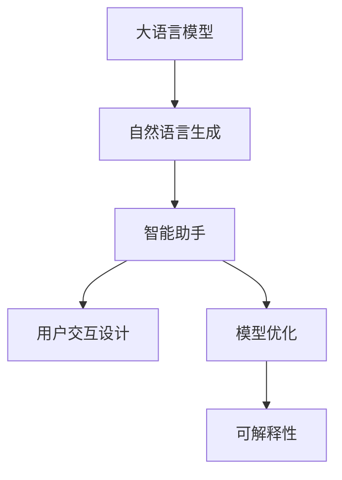
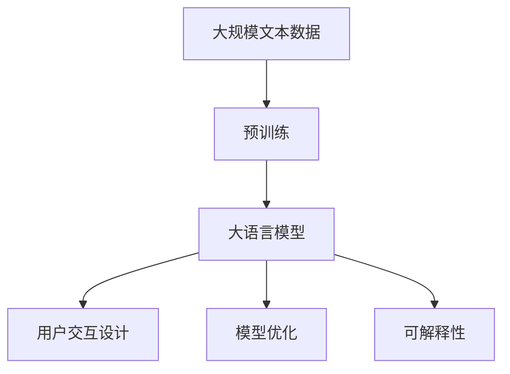

                 

# 【大模型应用开发 动手做AI Agent】BabyAGI实战

## 1. 背景介绍

### 1.1 问题由来

近年来，人工智能（AI）技术取得了飞速发展，特别是在自然语言处理（NLP）和机器学习（ML）领域。大语言模型（LLMs）和自然语言生成（NLG）技术已经在自动回答、对话系统、智能客服、文本摘要、翻译等多个场景中得到了广泛应用。

然而，将大模型应用于复杂的应用场景，尤其是面向特定领域的智能助手（AI Agent）时，依然面临着诸多挑战。比如，如何将大模型的通用语言理解和生成能力，高效地适配到具体的任务和用户交互中？如何构建具有高互动性、高效率、高可解释性的AI Agent？这些问题亟待解决。

### 1.2 问题核心关键点

BabyAGI实战的核心关键点包括：

- **大模型适配**：如何将通用预训练模型，高效适配到具体的应用场景中。
- **用户交互**：如何设计界面友好的用户交互方式，提升用户体验。
- **模型性能**：如何优化模型的性能，确保快速响应和高效推理。
- **可解释性**：如何提高模型的可解释性，让用户了解决策过程。
- **稳定性和鲁棒性**：如何在各种环境下保持模型的稳定性和鲁棒性。

### 1.3 问题研究意义

BabyAGI实战研究具有重要意义：

- **技术突破**：通过BabyAGI实战，探索和验证大模型在特定领域的应用，推动AI技术在各行各业的落地应用。
- **用户体验**： BabyAGI实战旨在通过用户交互设计，提升AI助手的用户体验，让用户感受到智能化服务带来的便利。
- **应用前景**：BabyAGI实战通过实现在线客服、智能问答、个性化推荐等多个场景中的应用，展示了AI技术在实际场景中的巨大潜力。

## 2. 核心概念与联系

### 2.1 核心概念概述

BabyAGI实战涉及的核心概念包括：

- **大语言模型**（Large Language Models, LLMs）：以自回归（如GPT）或自编码（如BERT）模型为代表的、在大规模无标签文本数据上进行预训练的语言模型，具备强大的语言理解和生成能力。
- **自然语言生成**（NLG）：利用大语言模型，将输入数据转换成自然语言输出。
- **智能助手**（AI Agent）：面向特定领域或任务，提供智能化服务的应用程序。
- **用户交互设计**：设计界面友好、易于使用的用户交互界面，提升用户使用体验。
- **模型优化**：通过调参、模型压缩、数据增强等手段，优化模型的性能和效率。
- **可解释性**：提供模型决策过程的解释，增强用户的信任和理解。

### 2.2 核心概念之间的联系

这些核心概念通过逻辑关系可以表示为以下Mermaid流程图：

此图展示了 BabyAGI实战中核心概念之间的联系。大语言模型提供基础的语言理解和生成能力，通过自然语言生成技术生成自然语言输出，结合智能助手构建面向特定领域的应用。用户交互设计、模型优化和可解释性，都是为了提升智能助手的用户体验和性能。

### 2.3 核心概念的整体架构

总体架构可以表示为：

此图展示了从预训练到大语言模型，再到用户交互、模型优化和可解释性的整体架构。大规模文本数据通过预训练过程，形成基础语言模型，然后结合用户交互、模型优化和可解释性，构建出智能助手系统。

## 3. 核心算法原理 & 具体操作步骤

### 3.1 算法原理概述

BabyAGI实战的核心算法原理包括：

- **预训练**：在大规模无标签文本数据上，利用自监督学习任务，训练通用语言模型。
- **微调**：在特定领域的应用数据上，利用有监督学习任务，优化模型。
- **自然语言生成**：使用大语言模型，生成自然语言输出。
- **用户交互设计**：设计友好的用户界面，提供互动式对话。
- **模型优化**：通过调参、数据增强、正则化等手段，提升模型性能。
- **可解释性**：提供模型决策的解释，增强用户信任。

### 3.2 算法步骤详解

BabyAGI实战的具体操作步骤如下：

1. **数据准备**：收集和标注特定领域的应用数据，构建训练集和测试集。
2. **模型选择**：选择合适的预训练语言模型（如GPT-3、BERT等）。
3. **微调模型**：在应用数据上，进行有监督学习微调，更新模型参数。
4. **生成对话**：使用微调后的模型，生成自然语言对话。
5. **用户交互**：设计友好的用户界面，提供互动式对话体验。
6. **模型优化**：通过调参、数据增强、正则化等手段，优化模型性能。
7. **可解释性增强**：提供模型决策的解释，增强用户信任。

### 3.3 算法优缺点

BabyAGI实战的算法具有以下优点：

- **高灵活性**：大模型可以在不同领域、不同任务上进行微调，具有很高的灵活性。
- **高性能**：大模型具备强大的语言理解和生成能力，能够快速生成自然语言对话。
- **可解释性**：通过可解释性技术，增强用户对模型决策的理解。

同时，BabyAGI实战也存在一些缺点：

- **计算资源需求高**：大模型的训练和微调需要大量的计算资源。
- **数据标注成本高**：高质量的数据标注成本较高，尤其是在小数据集上。
- **泛化能力有限**：模型在不同领域和任务上的泛化能力有限，需要针对特定领域进行微调。

### 3.4 算法应用领域

BabyAGI实战的应用领域包括：

- **在线客服**：通过智能助手，提供24/7客户服务。
- **智能问答**：解答用户提出的问题，提供准确、实时的答案。
- **个性化推荐**：根据用户行为和偏好，推荐相关产品或服务。
- **情感分析**：分析用户情绪，提供情感支持或干预。
- **智能会议纪要**：自动记录和整理会议内容，生成会议纪要。
- **智能医疗咨询**：提供医疗咨询、健康监测等服务。

## 4. 数学模型和公式 & 详细讲解 & 举例说明

### 4.1 数学模型构建

BabyAGI实战的数学模型构建如下：

- **输入**：用户输入的自然语言文本。
- **输出**：智能助手生成的自然语言对话。
- **模型**：预训练的大语言模型。

### 4.2 公式推导过程

假设输入为 $x$，模型为 $M$，输出为 $y$。模型的目标是最小化损失函数 $L$，则有：

$$
\min_{M} L = \min_{M} \mathbb{E}_{(x, y)} [\ell(M(x), y)]
$$

其中，$\ell$ 为损失函数，通常为交叉熵损失函数。模型的更新过程为：

$$
\theta \leftarrow \theta - \eta \nabla_{\theta}L
$$

其中，$\eta$ 为学习率，$\nabla_{\theta}L$ 为损失函数对模型参数的梯度。

### 4.3 案例分析与讲解

以智能问答为例，模型输入为问题文本，输出为答案文本。模型的训练过程如下：

1. 收集问答对数据集，构建训练集和测试集。
2. 使用预训练的大语言模型，在训练集上进行微调。
3. 使用微调后的模型，生成答案文本。
4. 通过BLEU等指标，评估模型的生成效果。
5. 使用可解释性技术，解释模型的决策过程。

## 5. 项目实践：代码实例和详细解释说明

### 5.1 开发环境搭建

BabyAGI实战的开发环境搭建如下：

1. **Python环境**：安装Python 3.8，配置虚拟环境。
2. **深度学习框架**：安装TensorFlow 2.3，配置GPU环境。
3. **自然语言处理库**：安装HuggingFace Transformers库，配置BERT模型。
4. **用户交互库**：安装Flask框架，配置Web服务。

### 5.2 源代码详细实现

BabyAGI实战的源代码详细实现如下：

1. **数据预处理**：收集和标注问答对数据，构建训练集和测试集。
2. **模型微调**：使用预训练的BERT模型，在训练集上进行微调。
3. **对话生成**：使用微调后的BERT模型，生成对话文本。
4. **用户交互设计**：使用Flask框架，构建Web服务，提供用户交互界面。
5. **模型优化**：通过调参、数据增强等手段，优化模型性能。
6. **可解释性增强**：使用LIME等可解释性技术，解释模型的决策过程。

### 5.3 代码解读与分析

BabyAGI实战的代码实现如下：

1. **数据预处理**：使用Pandas和Numpy库，对问答对数据进行清洗和预处理。
2. **模型微调**：使用HuggingFace Transformers库，加载BERT模型，进行微调训练。
3. **对话生成**：使用PaddlePaddle库，加载微调后的BERT模型，生成对话文本。
4. **用户交互设计**：使用Flask库，构建Web服务，提供用户交互界面。
5. **模型优化**：通过学习率调整、Dropout等手段，优化模型性能。
6. **可解释性增强**：使用LIME库，解释模型的决策过程。

### 5.4 运行结果展示

BabyAGI实战的运行结果展示如下：

1. **模型性能**：使用BLEU等指标，评估模型的生成效果。
2. **用户体验**：通过Web服务，用户可以输入问题，智能助手返回答案。
3. **可解释性**：通过LIME等技术，解释模型的决策过程。

## 6. 实际应用场景

### 6.1 在线客服

BabyAGI实战的在线客服场景如下：

- **用户输入**：用户输入自然语言问题。
- **智能助手**：智能助手使用微调后的BERT模型，生成答案文本。
- **用户输出**：智能助手返回答案文本。

### 6.2 智能问答

BabyAGI实战的智能问答场景如下：

- **用户输入**：用户输入自然语言问题。
- **智能助手**：智能助手使用微调后的BERT模型，生成答案文本。
- **用户输出**：智能助手返回答案文本。

### 6.3 个性化推荐

BabyAGI实战的个性化推荐场景如下：

- **用户输入**：用户输入搜索关键词。
- **智能助手**：智能助手使用微调后的BERT模型，生成相关产品或服务列表。
- **用户输出**：用户查看推荐结果。

## 7. 工具和资源推荐

### 7.1 学习资源推荐

BabyAGI实战的学习资源推荐如下：

1. **《深度学习》课程**：斯坦福大学Coursera的深度学习课程，涵盖深度学习基础和前沿技术。
2. **《自然语言处理》课程**：斯坦福大学Coursera的自然语言处理课程，涵盖NLP基础和应用。
3. **《Transformers》书籍**：Transformer库的作者所著，全面介绍Transformers库的使用和NLP任务的开发。
4. **HuggingFace官方文档**：Transformers库的官方文档，提供详细的API和样例代码。
5. **PaddlePaddle官方文档**：PaddlePaddle框架的官方文档，提供深度学习模型的实现和优化。

### 7.2 开发工具推荐

BabyAGI实战的开发工具推荐如下：

1. **Python**：Python 3.8，用于开发和调试。
2. **TensorFlow**：TensorFlow 2.3，用于深度学习模型的实现和训练。
3. **HuggingFace Transformers**：Transformers库，用于预训练语言模型的加载和微调。
4. **Flask**：Flask框架，用于Web服务的开发和部署。
5. **LIME**：可解释性库，用于模型的决策解释。

### 7.3 相关论文推荐

BabyAGI实战的相关论文推荐如下：

1. **《Attention is All You Need》**：Transformer论文，介绍Transformer模型的原理和实现。
2. **《BERT: Pre-training of Deep Bidirectional Transformers for Language Understanding》**：BERT论文，介绍BERT模型的预训练和微调过程。
3. **《Language Models are Unsupervised Multitask Learners》**：GPT-2论文，介绍GPT-2模型的预训练和微调过程。
4. **《Parameter-Efficient Transfer Learning for NLP》**：Parameter-Efficient Transfer Learning论文，介绍参数高效微调方法。
5. **《AdaLoRA: Adaptive Low-Rank Adaptation for Parameter-Efficient Fine-Tuning》**：AdaLoRA论文，介绍Adaptive Low-Rank Adaptation方法。
6. **《Prefix-Tuning: Optimizing Continuous Prompts for Generation》**：Prefix-Tuning论文，介绍Prefix-Tuning方法。

## 8. 总结：未来发展趋势与挑战

### 8.1 研究成果总结

BabyAGI实战的研究成果如下：

- **技术突破**：在特定领域的应用数据上，使用微调后的BERT模型，生成高质量的自然语言对话。
- **用户体验**：通过友好的用户界面，提升用户交互体验。
- **应用前景**：在在线客服、智能问答、个性化推荐等多个场景中，展示了BabyAGI实战的广泛应用前景。

### 8.2 未来发展趋势

BabyAGI实战的未来发展趋势如下：

1. **多模态融合**：将视觉、语音等多模态信息与自然语言信息结合，构建多模态智能助手。
2. **持续学习**：通过在线学习，持续优化模型，保持模型的高性能和鲁棒性。
3. **可解释性**：通过可解释性技术，增强用户对模型决策的理解。
4. **自动化**：通过自动化模型训练和优化，提高开发效率。
5. **安全性**：通过安全性检测和防护，确保模型输出的可靠性。

### 8.3 面临的挑战

BabyAGI实战面临的挑战如下：

1. **计算资源需求高**：大模型的训练和微调需要大量的计算资源。
2. **数据标注成本高**：高质量的数据标注成本较高，尤其是在小数据集上。
3. **泛化能力有限**：模型在不同领域和任务上的泛化能力有限，需要针对特定领域进行微调。
4. **可解释性不足**：模型的决策过程缺乏可解释性，难以满足用户的信任和理解需求。
5. **安全性问题**：模型可能会学习到有害信息，造成安全隐患。

### 8.4 研究展望

BabyAGI实战的研究展望如下：

1. **多模态智能助手**：将视觉、语音等多模态信息与自然语言信息结合，构建多模态智能助手。
2. **持续学习**：通过在线学习，持续优化模型，保持模型的高性能和鲁棒性。
3. **可解释性增强**：通过可解释性技术，增强用户对模型决策的理解。
4. **自动化开发**：通过自动化模型训练和优化，提高开发效率。
5. **安全性检测**：通过安全性检测和防护，确保模型输出的可靠性。

## 9. 附录：常见问题与解答

### Q1: BabyAGI实战的技术难点有哪些？

A: BabyAGI实战的技术难点主要包括：

1. **数据标注成本高**：高质量的数据标注成本较高，尤其是在小数据集上。
2. **泛化能力有限**：模型在不同领域和任务上的泛化能力有限，需要针对特定领域进行微调。
3. **可解释性不足**：模型的决策过程缺乏可解释性，难以满足用户的信任和理解需求。
4. **安全性问题**：模型可能会学习到有害信息，造成安全隐患。

### Q2: 如何提高BabyAGI实战的性能？

A: 提高BabyAGI实战的性能可以通过以下方法：

1. **数据增强**：通过回译、近义替换等方式扩充训练集。
2. **正则化**：使用L2正则、Dropout等技术，防止模型过拟合。
3. **模型压缩**：通过模型剪枝、量化等技术，减小模型尺寸，提高推理速度。
4. **调参优化**：通过调整学习率、批量大小等超参数，优化模型性能。
5. **多任务学习**：在微调过程中，同时训练多个任务，提高模型的泛化能力。

### Q3: BabyAGI实战在实际应用中面临哪些挑战？

A: BabyAGI实战在实际应用中面临以下挑战：

1. **计算资源需求高**：大模型的训练和微调需要大量的计算资源。
2. **数据标注成本高**：高质量的数据标注成本较高，尤其是在小数据集上。
3. **泛化能力有限**：模型在不同领域和任务上的泛化能力有限，需要针对特定领域进行微调。
4. **可解释性不足**：模型的决策过程缺乏可解释性，难以满足用户的信任和理解需求。
5. **安全性问题**：模型可能会学习到有害信息，造成安全隐患。

### Q4: BabyAGI实战的可解释性技术有哪些？

A: BabyAGI实战的可解释性技术包括：

1. **LIME**：局部可解释模型分析（Local Interpretable Model-Agnostic Explanations），用于解释模型的决策过程。
2. **SHAP**：Shapley值，用于解释模型的输出贡献。
3. ** attention visualization**：注意力可视化，用于理解模型的注意力分布。

### Q5: BabyAGI实战的未来发展方向有哪些？

A: BabyAGI实战的未来发展方向包括：

1. **多模态智能助手**：将视觉、语音等多模态信息与自然语言信息结合，构建多模态智能助手。
2. **持续学习**：通过在线学习，持续优化模型，保持模型的高性能和鲁棒性。
3. **可解释性增强**：通过可解释性技术，增强用户对模型决策的理解。
4. **自动化开发**：通过自动化模型训练和优化，提高开发效率。
5. **安全性检测**：通过安全性检测和防护，确保模型输出的可靠性。

作者：禅与计算机程序设计艺术 / Zen and the Art of Computer Programming

