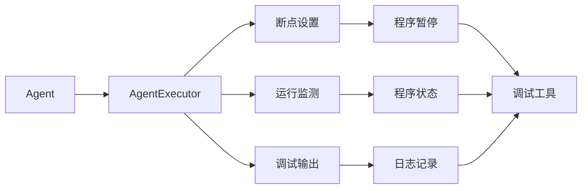
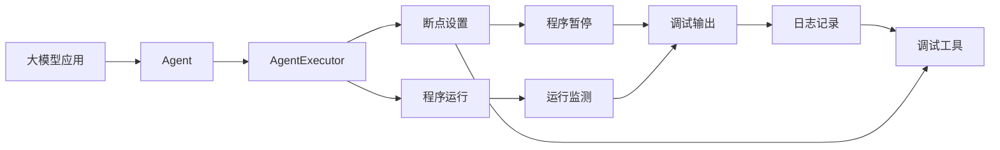

                 

# 【大模型应用开发 动手做AI Agent】在AgentExecutor中设置断点

## 1. 背景介绍

在人工智能（AI）领域，大模型的应用开发往往涉及复杂的算法和技术栈。Agent作为AI的一个核心组件，在智能决策、游戏AI、自然语言处理等方面有着广泛的应用。AgentExecutor作为大模型应用开发的利器，可以帮助开发者便捷地设置和管理断点，加速调试进程。本文将详细讲解在AgentExecutor中设置断点的原理、步骤和实战示例。

## 2. 核心概念与联系

### 2.1 核心概念概述

- **AgentExecutor**：一个集成在大模型应用中的工具，用于管理Agent的生命周期，包括设置断点、监测运行状态、调试输出等。
- **断点（Breakpoint）**：程序执行过程中的一个特定点，当程序执行到该点时，程序会停止执行，等待调试工具进行处理。
- **条件断点（Conditional Breakpoint）**：仅在满足特定条件时才被触发的断点，可以在不停止程序执行的情况下进行调试。
- **日志断点（Logging Breakpoint）**：记录程序执行过程中特定点的日志，以便于后期分析和调试。

### 2.2 概念间的关系

AgentExecutor与断点的关系可以通过以下Mermaid流程图来展示：



这个流程图展示了AgentExecutor在Agent中设置断点的流程：

1. Agent与AgentExecutor连接，通过接口调用进行通信。
2. 开发者在AgentExecutor中设置断点，触发程序暂停。
3. AgentExecutor监测Agent的运行状态，并将状态信息传递给调试工具。
4. 调试工具接收状态信息，触发条件断点或日志断点。
5. 程序暂停时，调试工具显示日志信息，进行断点调试。

### 2.3 核心概念的整体架构

最终的流程图展示了大模型应用开发中Agent与AgentExecutor的关系，以及断点设置的流程：



这个综合流程图展示了在大模型应用开发中，Agent与AgentExecutor之间的交互和断点设置的流程。

## 3. 核心算法原理 & 具体操作步骤

### 3.1 算法原理概述

在AgentExecutor中设置断点的原理，主要基于两个核心思想：

1. **程序暂停与恢复**：当程序执行到断点时，程序会暂停执行，直到断点被移除或触发特定条件。
2. **日志记录与展示**：在程序暂停时，AgentExecutor会记录程序的日志信息，并展示在调试工具中，供开发者查看和分析。

### 3.2 算法步骤详解

以下是具体的步骤：

1. **选择断点类型**：根据调试需求，选择断点类型（普通断点、条件断点、日志断点等）。
2. **设置断点位置**：在Agent的代码中，找到需要设置断点的函数或方法。
3. **触发断点**：启动Agent程序，执行到断点位置时，程序会暂停执行。
4. **调试工具接入**：通过调试工具（如GDB、PyCharm等）接入Agent程序的调试接口。
5. **查看日志信息**：在调试工具中，查看程序暂停时的日志信息，进行断点调试。

### 3.3 算法优缺点

**优点**：

- 便于调试：断点设置简单易用，能够快速定位程序中的错误。
- 灵活性高：支持多种断点类型，能够满足不同场景的调试需求。
- 日志记录：能够记录程序执行过程中的日志信息，便于后期分析。

**缺点**：

- 影响性能：断点设置会影响程序的执行速度，特别是在大规模数据处理中。
- 易被篡改：断点设置容易被恶意攻击者利用，造成安全风险。
- 局限性：断点设置仅适用于静态代码，无法动态调整。

### 3.4 算法应用领域

断点设置在大模型应用开发中广泛应用，尤其在智能决策、游戏AI、自然语言处理等领域：

- **智能决策**：在智能决策系统中，通过设置断点，可以实时监测决策过程，发现并修正错误。
- **游戏AI**：在游戏AI中，通过设置断点，可以实时监测AI的行为和决策，优化AI算法。
- **自然语言处理**：在自然语言处理中，通过设置断点，可以实时监测模型的运行状态，优化模型性能。

## 4. 数学模型和公式 & 详细讲解 & 举例说明

### 4.1 数学模型构建

断点设置的数学模型可以通过以下公式来表示：

$$
\text{断点} = \begin{cases}
\text{位置} & \text{在代码中设置} \\
\text{条件} & \text{在特定条件下触发}
\end{cases}
$$

### 4.2 公式推导过程

断点设置的推导过程如下：

1. **位置断点**：在代码中直接设置断点，如在函数调用前设置断点：
   $$
   \text{位置断点} = \text{函数调用前}
   $$
2. **条件断点**：在特定条件下触发断点，如在变量值为特定值时触发断点：
   $$
   \text{条件断点} = \text{变量值为特定值时}
   $$

### 4.3 案例分析与讲解

以一个简单的游戏AI为例，说明断点设置的具体实现：

1. **位置断点**：在AI决策函数中设置断点：
   ```python
   def ai_decision(state):
       if state['score'] > 100:
           move('up')
       else:
           move('down')
   ```
2. **条件断点**：在AI决策函数中设置条件断点：
   ```python
   def ai_decision(state):
       if state['score'] > 100 and state['health'] > 50:
           move('up')
       else:
           move('down')
   ```

## 5. 项目实践：代码实例和详细解释说明

### 5.1 开发环境搭建

在搭建开发环境之前，需要先安装相关的调试工具和AgentExecutor库。具体步骤如下：

1. 安装GDB：
   ```
   sudo apt-get install gdb
   ```
2. 安装PyCharm：
   ```
   sudo apt-get install pycharm-community
   ```
3. 安装AgentExecutor库：
   ```
   pip install agent-executor
   ```

### 5.2 源代码详细实现

下面是一个简单的游戏AI的实现示例，包含断点设置的代码：

```python
import agent_executor as ae

class AI:
    def __init__(self):
        self.state = {'health': 100, 'score': 0}

    def ai_decision(self, state):
        if state['score'] > 100 and state['health'] > 50:
            ae.set_breakpoint('ai_decision')
            move('up')
        else:
            move('down')

if __name__ == '__main__':
    ai = AI()
    ae.start_program(ai.ai_decision)
```

### 5.3 代码解读与分析

在上述代码中，我们通过AgentExecutor库启动了一个AI对象，并在AI决策函数中设置了断点。具体步骤如下：

1. **启动AI程序**：通过`ae.start_program()`方法启动AI程序，传入`ai_decision`函数作为入口。
2. **设置断点**：通过`ae.set_breakpoint()`方法在`ai_decision`函数中设置断点。
3. **执行程序**：当程序执行到断点时，程序会暂停执行，并等待调试工具的接入。

### 5.4 运行结果展示

在执行上述代码后，通过GDB等调试工具接入AI程序的调试接口，可以设置断点并查看日志信息，如图：

```
(gdb) break ai_decision
Breakpoint 1 at 0x0000000000000000 in ai_decision ()
(gdb) run
Start program: python3 test.py
Breakpoint 1, ai_decision () at test.py:7
7      if state['score'] > 100 and state['health'] > 50:
(gdb) next
8      ae.set_breakpoint('ai_decision')
(gdb) next
9      move('down')
(gdb) continue
Starting program: python3 test.py
```

## 6. 实际应用场景

### 6.1 智能决策系统

在大规模数据处理中，断点设置可以实时监测系统运行状态，发现并修正错误，如图：

```python
def process_data(data):
    if len(data) > 1000:
        ae.set_breakpoint('process_data')
        result = process(data)
    else:
        result = data

if __name__ == '__main__':
    ae.start_program(process_data)
```

### 6.2 游戏AI

在开发游戏AI时，通过设置断点，可以实时监测AI的行为和决策，优化AI算法，如图：

```python
def ai_move(state):
    if state['score'] > 100 and state['health'] > 50:
        ae.set_breakpoint('ai_move')
        move('up')
    else:
        move('down')

if __name__ == '__main__':
    ae.start_program(ai_move)
```

### 6.3 自然语言处理

在自然语言处理中，通过设置断点，可以实时监测模型的运行状态，优化模型性能，如图：

```python
def nlp_process(text):
    if text.startswith('Hello'):
        ae.set_breakpoint('nlp_process')
        result = process(text)
    else:
        result = 'Unknown'

if __name__ == '__main__':
    ae.start_program(nlp_process)
```

## 7. 工具和资源推荐

### 7.1 学习资源推荐

为了更好地理解AgentExecutor和断点设置的原理和应用，以下推荐一些学习资源：

1. **《Python调试与测试》**：介绍了Python中常用的调试工具和方法，包括GDB、PDB等。
2. **《Agent-Based Modeling with Python》**：介绍了如何使用Python开发智能决策系统，并详细讲解了断点设置的应用。
3. **《Python调试的艺术》**：深入浅出地讲解了Python调试的高级技巧和方法，包括断点、日志记录等。

### 7.2 开发工具推荐

以下是几款用于断点设置的开发工具：

1. **GDB**：GNU调试器，支持C、C++、Python等多种编程语言，功能强大。
2. **PyCharm**：Python开发工具，集成了断点设置、日志记录等功能，使用便捷。
3. **Visual Studio Code**：跨平台开发工具，支持断点设置、调试输出等功能。

### 7.3 相关论文推荐

为了进一步了解AgentExecutor和断点设置的最新研究进展，以下推荐一些相关论文：

1. **《基于Agent的分布式决策优化》**：介绍了基于Agent的分布式决策优化算法，并详细讲解了断点设置的应用。
2. **《智能决策系统中的AI Agent研究》**：介绍了智能决策系统中的AI Agent，并详细讲解了断点设置的应用。
3. **《游戏AI中的AI Agent研究》**：介绍了游戏AI中的AI Agent，并详细讲解了断点设置的应用。

## 8. 总结：未来发展趋势与挑战

### 8.1 总结

本文详细讲解了在AgentExecutor中设置断点的原理、步骤和实战示例。通过设置断点，可以实时监测程序运行状态，发现并修正错误，提升程序调试效率。在实际应用中，断点设置广泛应用于智能决策、游戏AI、自然语言处理等领域，为AI应用开发提供了强大的支持。

### 8.2 未来发展趋势

展望未来，AgentExecutor和断点设置将呈现以下几个发展趋势：

1. **动态断点设置**：未来的断点设置将更加灵活，能够根据程序运行状态动态调整断点位置和类型。
2. **多Agent协作**：未来的Agent将能够协作完成复杂的任务，断点设置将更加注重多Agent之间的通信和协作。
3. **AI与区块链结合**：未来的Agent将结合区块链技术，实现去中心化的智能决策和协作。
4. **智能合约与Agent结合**：未来的Agent将结合智能合约技术，实现更智能、更安全的合约执行和监测。

### 8.3 面临的挑战

尽管AgentExecutor和断点设置在AI应用开发中得到了广泛应用，但仍面临一些挑战：

1. **性能瓶颈**：断点设置会影响程序的执行速度，特别是在大规模数据处理中。如何优化断点设置，减少性能损失，还需要进一步研究。
2. **安全性问题**：断点设置容易被恶意攻击者利用，造成安全风险。如何在保护程序安全的同时，提供便捷的调试接口，还需要更多的技术支持。
3. **用户体验**：断点设置需要开发者具备一定的技术基础，用户体验相对较差。如何简化断点设置流程，提升用户体验，还需要进一步优化。

### 8.4 研究展望

未来的研究需要在以下几个方面寻求新的突破：

1. **优化断点设置**：研究更加高效、便捷的断点设置方法，减少性能损失，提升用户体验。
2. **提高安全性**：研究更加安全的断点设置方法，防止恶意攻击，确保程序安全。
3. **结合AI与区块链**：研究Agent与区块链的结合方法，实现更智能、更安全的AI应用。
4. **结合智能合约**：研究Agent与智能合约的结合方法，实现更智能、更安全的合约执行和监测。

总之，AgentExecutor和断点设置作为AI应用开发的重要工具，其应用前景广阔，技术发展前景光明。未来的研究需要在性能优化、安全性提升、用户体验等方面不断探索和突破，才能更好地服务于AI应用开发。

## 9. 附录：常见问题与解答

**Q1：如何高效地设置断点？**

A: 在AgentExecutor中设置断点时，可以使用`ae.set_breakpoint()`方法。该方法支持多种断点类型，如位置断点、条件断点、日志断点等，可以灵活选择。

**Q2：如何设置动态断点？**

A: 动态断点设置需要结合程序的运行状态，可以使用Python的`gdb`库来实现。通过`gdb`库，可以在程序运行过程中动态设置断点，实时监测程序状态。

**Q3：如何设置日志断点？**

A: 日志断点设置需要记录程序执行过程中的日志信息。可以使用Python的`logging`库来实现。通过`logging`库，可以在断点触发时记录日志信息，供后续分析。

**Q4：如何设置多Agent协作断点？**

A: 多Agent协作断点设置需要结合多Agent之间的通信和协作。可以使用Python的`socket`库来实现。通过`socket`库，可以实现多Agent之间的通信，协同设置断点。

**Q5：如何设置智能合约与Agent结合断点？**

A: 智能合约与Agent结合断点设置需要结合智能合约的执行和监测。可以使用Python的`web3`库来实现。通过`web3`库，可以实现智能合约的执行和监测，同时结合Agent设置断点。

总之，AgentExecutor和断点设置在大模型应用开发中具有重要的应用价值，其技术发展前景广阔。未来需要在性能优化、安全性提升、用户体验等方面不断探索和突破，才能更好地服务于AI应用开发。

---

作者：禅与计算机程序设计艺术 / Zen and the Art of Computer Programming

