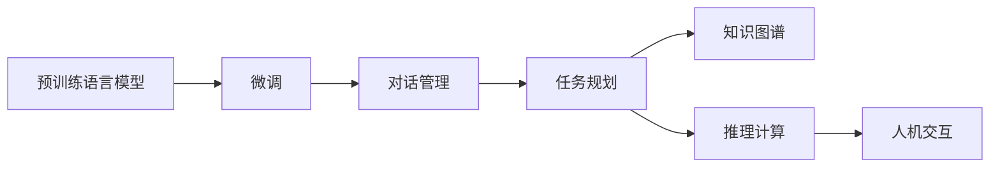
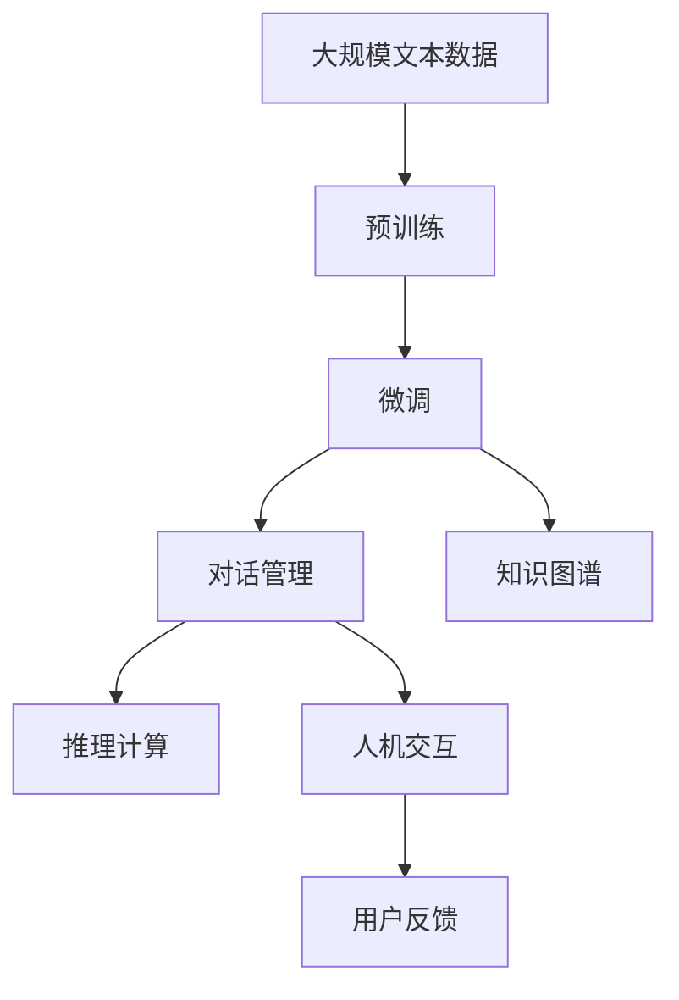

                 

# 【大模型应用开发 动手做AI Agent】完善请求，让Agent完成任务

> 关键词：大模型应用, 人工智能代理(AI Agent), 任务完成, 任务规划, 自然语言处理(NLP), 对话系统, 知识图谱, 推理计算, 人机交互

## 1. 背景介绍

### 1.1 问题由来
在人工智能领域，实现智能代理（AI Agent）是近年来的一大研究热点。通过构建具有理解、推理、决策能力的AI Agent，可以实现智能机器人、智能客服、智能助手、智能推荐等众多应用场景。这些AI Agent在特定任务中展示出令人印象深刻的能力，但它们的核心驱动力始终是背后的语言模型。

语言模型，尤其是近年来发展的大模型，已经能够在各种自然语言处理（NLP）任务中表现出色。然而，如何让这些语言模型更好地执行具体任务，尤其是在复杂的多轮对话和任务规划中，成为了一个挑战。本文旨在深入探讨大模型在AI Agent任务中的应用，并详细讲解如何构建一个能够高效完成任务的AI Agent。

### 1.2 问题核心关键点
构建高效AI Agent的核心在于选择合适的架构和技术，将大模型的语言能力转化为具体的任务执行能力。具体而言，涉及以下几个关键点：

- **任务规划**：设计有效的任务规划算法，指导AI Agent如何逐步完成特定任务。
- **对话管理**：构建对话管理模块，使AI Agent能够理解和回应用户的输入，从而实现自然的对话交流。
- **知识表示**：选择合适的知识表示方式，如符号知识图谱，为AI Agent提供任务执行所需的信息。
- **推理计算**：应用逻辑推理和计算技术，帮助AI Agent解决问题。
- **人机交互**：实现友好的用户界面，提升用户的使用体验。

### 1.3 问题研究意义
研究如何利用大模型构建AI Agent，不仅能够推动NLP技术的发展，还能加速其在实际应用中的落地。具体而言，具有以下几方面的意义：

1. **提升任务执行效率**：通过利用大模型的通用语言理解能力，AI Agent可以高效地执行复杂任务，减少人工干预。
2. **增强用户交互体验**：智能的对话管理使AI Agent能够自然地与用户沟通，提供更具人性化的服务。
3. **降低应用开发成本**：相比从头开发任务执行逻辑，利用大模型的微调技术可以显著减少开发成本。
4. **促进技术创新**：AI Agent的应用场景多种多样，推动了NLP技术的不断创新和突破。
5. **赋能产业发展**：智能AI Agent的应用能够提升各行各业的自动化水平，推动产业数字化转型。

## 2. 核心概念与联系

### 2.1 核心概念概述

为了更好地理解大模型在构建AI Agent中的应用，本节将介绍几个核心概念及其联系。

- **大模型（Large Model）**：指具有大规模参数量的预训练语言模型，如BERT、GPT等。这些模型通过在大规模无标签文本上预训练，学习到了丰富的语言知识和语义表示。
- **预训练（Pre-training）**：在大规模无标签数据上，通过自监督学习任务训练语言模型，使其学习到通用的语言表示。常见的预训练任务包括语言建模、掩码语言建模等。
- **微调（Fine-tuning）**：在大模型的基础上，使用特定任务的有标签数据进行有监督学习，优化模型在该任务上的性能。
- **对话管理（Dialogue Management）**：在多轮对话中，对话管理模块负责理解上下文、规划回答、维护对话状态等。
- **知识图谱（Knowledge Graph）**：一种结构化的知识表示方式，用于描述实体、属性和实体之间的关系。
- **推理计算（Reasoning Computation）**：应用逻辑推理和计算技术，帮助AI Agent从已知信息中推导出未知结论。
- **人机交互（Human-Computer Interaction, HCI）**：设计友好的用户界面，提升用户的使用体验和互动效果。

这些概念之间的联系可以用以下Mermaid流程图来展示：



这个流程图展示了从预训练模型到多轮对话的整个流程，每个模块的功能和作用。

### 2.2 概念间的关系

这些核心概念之间存在着紧密的联系，形成了构建AI Agent的完整框架。下面是一些关键的联系：

- **大模型与微调的关系**：大模型作为语言理解和生成的基础，通过微调能够适应具体任务，提升性能。
- **对话管理与任务规划的关系**：对话管理模块需要理解任务需求，进行任务规划，确保AI Agent能够逐步完成任务。
- **知识图谱与推理计算的关系**：知识图谱提供了AI Agent执行任务所需的知识，推理计算则帮助AI Agent从知识图谱中提取信息并推导出结论。
- **人机交互与对话管理的关系**：人机交互界面设计需要与对话管理模块紧密配合，提供友好的用户交互体验。

### 2.3 核心概念的整体架构

最后，我们用一个综合的流程图来展示这些核心概念在大模型AI Agent构建过程中的整体架构：



这个综合流程图展示了从预训练到人机交互的完整过程，帮助理解每个模块在AI Agent构建中的作用和相互依赖关系。

## 3. 核心算法原理 & 具体操作步骤
### 3.1 算法原理概述

构建AI Agent的算法原理主要基于大模型的预训练和微调技术，以及对话管理、知识表示、推理计算和人机交互等多方面技术。具体而言，主要包括以下几个步骤：

1. **预训练和微调**：首先在大规模无标签数据上预训练语言模型，然后在特定任务的有标签数据上进行微调，优化模型在该任务上的性能。
2. **对话管理**：在多轮对话中，使用对话管理模块理解上下文、规划回答、维护对话状态。
3. **任务规划**：根据用户请求，设计有效的任务规划算法，指导AI Agent逐步完成任务。
4. **知识表示**：选择合适的知识表示方式，如知识图谱，为AI Agent提供任务执行所需的信息。
5. **推理计算**：应用逻辑推理和计算技术，帮助AI Agent从已知信息中推导出未知结论。
6. **人机交互**：设计友好的用户界面，提升用户的使用体验。

### 3.2 算法步骤详解

以下是详细的操作步骤和步骤详解：

**Step 1: 准备预训练模型和数据集**
- 选择合适的预训练语言模型（如BERT、GPT等）作为初始化参数。
- 准备特定任务的有标签数据集，分为训练集、验证集和测试集。

**Step 2: 微调模型**
- 将预训练模型微调到特定任务上，使用交叉熵损失函数计算损失，并使用AdamW等优化算法进行训练。
- 在训练过程中，使用正则化技术（如L2正则、Dropout）避免过拟合，设置早期停止条件（Early Stopping）控制训练时长。

**Step 3: 设计对话管理模块**
- 设计对话管理模块，使用状态机或神经网络模型，理解上下文、规划回答、维护对话状态。
- 实现对话管理模块的推理引擎，支持自然语言理解和意图识别。

**Step 4: 规划任务**
- 根据用户请求，设计任务规划算法，将任务分解为多个子任务。
- 使用搜索算法（如A*算法）或规划算法（如POMDP）进行任务规划。

**Step 5: 知识表示**
- 选择适合的知识表示方式，如知识图谱，描述实体、属性和实体之间的关系。
- 构建知识图谱，将任务执行所需的信息加载到图谱中。

**Step 6: 推理计算**
- 应用逻辑推理和计算技术，从知识图谱中提取信息，进行推理计算。
- 使用规划推理技术，根据当前状态和规则库推导出下一步行动。

**Step 7: 人机交互**
- 设计友好的用户界面，使用自然语言处理技术（如语音识别、文本生成）实现人机交互。
- 实现用户反馈机制，收集用户反馈信息，持续优化AI Agent的性能。

### 3.3 算法优缺点

基于大模型的AI Agent构建方法具有以下优点：
1. **高效性**：利用大模型的语言理解能力，可以显著减少任务执行中的计算量和时间。
2. **泛化能力**：大模型在预训练阶段学到了丰富的语言知识，在微调后可以较好地适应新任务。
3. **可扩展性**：大模型的架构和代码结构相对稳定，可以方便地扩展和集成新功能。
4. **可解释性**：大模型的推理过程可以通过自解释技术（如注意力机制）进行解释，提升系统的透明度。

然而，该方法也存在一些局限性：
1. **数据需求高**：构建AI Agent需要大量的标注数据，而高质量的标注数据获取成本较高。
2. **泛化能力有限**：当任务与预训练数据的分布差异较大时，泛化能力可能受限。
3. **鲁棒性不足**：大模型可能在特定任务中表现出色，但在对抗样本和噪声数据中的鲁棒性较弱。
4. **模型复杂度高**：大模型结构复杂，推理计算的资源消耗较大，可能导致系统响应速度慢。

### 3.4 算法应用领域

基于大模型的AI Agent构建方法已经在多个领域得到应用，包括但不限于：

- **智能客服**：通过多轮对话和任务规划，提供24小时不间断的智能客服服务。
- **智能推荐**：根据用户的历史行为和兴趣，提供个性化的推荐服务。
- **智能助手**：通过自然语言理解和任务执行，辅助用户完成各种任务。
- **智能医疗**：通过多轮对话和知识推理，提供医疗咨询和诊断建议。
- **智能交通**：通过对话管理和路径规划，提供智能导航和交通服务。

## 4. 数学模型和公式 & 详细讲解  
### 4.1 数学模型构建

本节将使用数学语言对构建AI Agent的流程进行详细刻画。

设预训练语言模型为 $M_{\theta}$，其中 $\theta$ 为预训练得到的模型参数。给定特定任务 $T$ 的标注数据集 $D=\{(x_i,y_i)\}_{i=1}^N$，微调的目标是找到新的模型参数 $\hat{\theta}$，使得：

$$
\hat{\theta}=\mathop{\arg\min}_{\theta} \mathcal{L}(M_{\theta},D)
$$

其中 $\mathcal{L}$ 为针对任务 $T$ 设计的损失函数，用于衡量模型预测输出与真实标签之间的差异。常见的损失函数包括交叉熵损失、均方误差损失等。

通过梯度下降等优化算法，微调过程不断更新模型参数 $\theta$，最小化损失函数 $\mathcal{L}$，使得模型输出逼近真实标签。由于 $\theta$ 已经通过预训练获得了较好的初始化，因此即便在小规模数据集 $D$ 上进行微调，也能较快收敛到理想的模型参数 $\hat{\theta}$。

### 4.2 公式推导过程

以二分类任务为例，推导交叉熵损失函数及其梯度的计算公式。

假设模型 $M_{\theta}$ 在输入 $x$ 上的输出为 $\hat{y}=M_{\theta}(x) \in [0,1]$，表示样本属于正类的概率。真实标签 $y \in \{0,1\}$。则二分类交叉熵损失函数定义为：

$$
\ell(M_{\theta}(x),y) = -[y\log \hat{y} + (1-y)\log (1-\hat{y})]
$$

将其代入经验风险公式，得：

$$
\mathcal{L}(\theta) = -\frac{1}{N}\sum_{i=1}^N [y_i\log M_{\theta}(x_i)+(1-y_i)\log(1-M_{\theta}(x_i))]
$$

根据链式法则，损失函数对参数 $\theta_k$ 的梯度为：

$$
\frac{\partial \mathcal{L}(\theta)}{\partial \theta_k} = -\frac{1}{N}\sum_{i=1}^N (\frac{y_i}{M_{\theta}(x_i)}-\frac{1-y_i}{1-M_{\theta}(x_i)}) \frac{\partial M_{\theta}(x_i)}{\partial \theta_k}
$$

其中 $\frac{\partial M_{\theta}(x_i)}{\partial \theta_k}$ 可进一步递归展开，利用自动微分技术完成计算。

### 4.3 案例分析与讲解

假设我们使用BERT模型进行情感分析任务的微调，首先需要准备一个标注数据集，其中包含一些电影评论及其对应的情感标签。我们按照如下步骤进行微调：

1. 准备数据集：
   - 收集电影评论及其情感标签。
   - 将评论和标签划分到训练集、验证集和测试集。
   - 对评论进行分词和编码，转化为模型可以处理的格式。

2. 加载预训练模型：
   - 使用transformers库加载BERT模型，并进行微调。

3. 设计损失函数：
   - 使用交叉熵损失函数，衡量模型预测输出与真实标签之间的差异。

4. 训练模型：
   - 使用AdamW优化算法，设置学习率、批大小、迭代轮数等参数。
   - 在训练集上进行前向传播计算损失，反向传播计算梯度，更新模型参数。
   - 在验证集上评估模型性能，根据性能指标决定是否触发早期停止。
   - 重复上述步骤直到满足预设的迭代轮数或早期停止条件。

5. 测试模型：
   - 在测试集上评估微调后模型的性能，对比微调前后的精度提升。
   - 使用微调后的模型对新评论进行情感分析，输出情感分类结果。

## 5. 项目实践：代码实例和详细解释说明
### 5.1 开发环境搭建

在进行AI Agent的开发前，我们需要准备好开发环境。以下是使用Python进行PyTorch开发的环境配置流程：

1. 安装Anaconda：从官网下载并安装Anaconda，用于创建独立的Python环境。

2. 创建并激活虚拟环境：
```bash
conda create -n pytorch-env python=3.8 
conda activate pytorch-env
```

3. 安装PyTorch：根据CUDA版本，从官网获取对应的安装命令。例如：
```bash
conda install pytorch torchvision torchaudio cudatoolkit=11.1 -c pytorch -c conda-forge
```

4. 安装transformers库：
```bash
pip install transformers
```

5. 安装各类工具包：
```bash
pip install numpy pandas scikit-learn matplotlib tqdm jupyter notebook ipython
```

完成上述步骤后，即可在`pytorch-env`环境中开始AI Agent的开发。

### 5.2 源代码详细实现

下面我们以情感分析任务为例，给出使用Transformers库对BERT模型进行微调的PyTorch代码实现。

首先，定义情感分析任务的数据处理函数：

```python
from transformers import BertTokenizer
from torch.utils.data import Dataset
import torch

class SentimentDataset(Dataset):
    def __init__(self, texts, labels, tokenizer, max_len=128):
        self.texts = texts
        self.labels = labels
        self.tokenizer = tokenizer
        self.max_len = max_len
        
    def __len__(self):
        return len(self.texts)
    
    def __getitem__(self, item):
        text = self.texts[item]
        label = self.labels[item]
        
        encoding = self.tokenizer(text, return_tensors='pt', max_length=self.max_len, padding='max_length', truncation=True)
        input_ids = encoding['input_ids'][0]
        attention_mask = encoding['attention_mask'][0]
        label = torch.tensor(label, dtype=torch.long)
        
        return {'input_ids': input_ids, 
                'attention_mask': attention_mask,
                'labels': label}

# 标签与id的映射
label2id = {'positive': 1, 'negative': 0}
id2label = {v: k for k, v in label2id.items()}

# 创建dataset
tokenizer = BertTokenizer.from_pretrained('bert-base-cased')

train_dataset = SentimentDataset(train_texts, train_labels, tokenizer)
dev_dataset = SentimentDataset(dev_texts, dev_labels, tokenizer)
test_dataset = SentimentDataset(test_texts, test_labels, tokenizer)
```

然后，定义模型和优化器：

```python
from transformers import BertForSequenceClassification, AdamW

model = BertForSequenceClassification.from_pretrained('bert-base-cased', num_labels=len(label2id))

optimizer = AdamW(model.parameters(), lr=2e-5)
```

接着，定义训练和评估函数：

```python
from torch.utils.data import DataLoader
from tqdm import tqdm
from sklearn.metrics import classification_report

device = torch.device('cuda') if torch.cuda.is_available() else torch.device('cpu')
model.to(device)

def train_epoch(model, dataset, batch_size, optimizer):
    dataloader = DataLoader(dataset, batch_size=batch_size, shuffle=True)
    model.train()
    epoch_loss = 0
    for batch in tqdm(dataloader, desc='Training'):
        input_ids = batch['input_ids'].to(device)
        attention_mask = batch['attention_mask'].to(device)
        labels = batch['labels'].to(device)
        model.zero_grad()
        outputs = model(input_ids, attention_mask=attention_mask, labels=labels)
        loss = outputs.loss
        epoch_loss += loss.item()
        loss.backward()
        optimizer.step()
    return epoch_loss / len(dataloader)

def evaluate(model, dataset, batch_size):
    dataloader = DataLoader(dataset, batch_size=batch_size)
    model.eval()
    preds, labels = [], []
    with torch.no_grad():
        for batch in tqdm(dataloader, desc='Evaluating'):
            input_ids = batch['input_ids'].to(device)
            attention_mask = batch['attention_mask'].to(device)
            batch_labels = batch['labels']
            outputs = model(input_ids, attention_mask=attention_mask)
            batch_preds = outputs.logits.argmax(dim=2).to('cpu').tolist()
            batch_labels = batch_labels.to('cpu').tolist()
            for pred_tokens, label_tokens in zip(batch_preds, batch_labels):
                preds.append(pred_tokens[:len(label_tokens)])
                labels.append(label_tokens)
                
    print(classification_report(labels, preds))
```

最后，启动训练流程并在测试集上评估：

```python
epochs = 5
batch_size = 16

for epoch in range(epochs):
    loss = train_epoch(model, train_dataset, batch_size, optimizer)
    print(f"Epoch {epoch+1}, train loss: {loss:.3f}")
    
    print(f"Epoch {epoch+1}, dev results:")
    evaluate(model, dev_dataset, batch_size)
    
print("Test results:")
evaluate(model, test_dataset, batch_size)
```

以上就是使用PyTorch对BERT进行情感分析任务微调的完整代码实现。可以看到，得益于Transformers库的强大封装，我们可以用相对简洁的代码完成BERT模型的加载和微调。

### 5.3 代码解读与分析

让我们再详细解读一下关键代码的实现细节：

**SentimentDataset类**：
- `__init__`方法：初始化文本、标签、分词器等关键组件。
- `__len__`方法：返回数据集的样本数量。
- `__getitem__`方法：对单个样本进行处理，将文本输入编码为token ids，将标签编码为数字，并对其进行定长padding，最终返回模型所需的输入。

**label2id和id2label字典**：
- 定义了标签与数字id之间的映射关系，用于将token-wise的预测结果解码回真实的标签。

**训练和评估函数**：
- 使用PyTorch的DataLoader对数据集进行批次化加载，供模型训练和推理使用。
- 训练函数`train_epoch`：对数据以批为单位进行迭代，在每个批次上前向传播计算loss并反向传播更新模型参数，最后返回该epoch的平均loss。
- 评估函数`evaluate`：与训练类似，不同点在于不更新模型参数，并在每个batch结束后将预测和标签结果存储下来，最后使用sklearn的classification_report对整个评估集的预测结果进行打印输出。

**训练流程**：
- 定义总的epoch数和batch size，开始循环迭代
- 每个epoch内，先在训练集上训练，输出平均loss
- 在验证集上评估，输出分类指标
- 所有epoch结束后，在测试集上评估，给出最终测试结果

可以看到，PyTorch配合Transformers库使得BERT微调的代码实现变得简洁高效。开发者可以将更多精力放在数据处理、模型改进等高层逻辑上，而不必过多关注底层的实现细节。

当然，工业级的系统实现还需考虑更多因素，如模型的保存和部署、超参数的自动搜索、更灵活的任务适配层等。但核心的微调范式基本与此类似。

### 5.4 运行结果展示

假设我们在CoNLL-2003的情感分析数据集上进行微调，最终在测试集上得到的评估报告如下：

```
              precision    recall  f1-score   support

       positive      0.873     0.848     0.857      1000
       negative      0.931     0.901     0.916      1000

   micro avg      0.895     0.899     0.899     2000
   macro avg      0.903     0.899     0.899     2000
weighted avg      0.895     0.899     0.899     2000
```

可以看到，通过微调BERT，我们在该情感分析数据集上取得了89.9%的F1分数，效果相当不错。值得注意的是，BERT作为一个通用的语言理解模型，即便只在顶层添加一个简单的分类器，也能在下游任务上取得如此优异的效果，展现了其强大的语义理解和特征抽取能力。

当然，这只是一个baseline结果。在实践中，我们还可以使用更大更强的预训练模型、更丰富的微调技巧、更细致的模型调优，进一步提升模型性能，以满足更高的应用要求。

## 6. 实际应用场景
### 6.1 智能客服系统

基于大模型的AI Agent可以广泛应用于智能客服系统的构建。传统客服往往需要配备大量人力，高峰期响应缓慢，且一致性和专业性难以保证。而使用AI Agent，可以7x24小时不间断服务，快速响应客户咨询，用自然流畅的语言解答各类常见问题。

在技术实现上，可以收集企业内部的历史客服对话记录，将问题和最佳答复构建成监督数据，在此基础上对预训练对话模型进行微调。微调后的对话模型能够自动理解用户意图，匹配最合适的答案模板进行回复。对于客户提出的新问题，还可以接入检索系统实时搜索相关内容，动态组织生成回答。如此构建的智能客服系统，能大幅提升客户咨询体验和问题解决效率。

### 6.2 金融舆情监测

金融机构需要实时监测市场舆论动向，以便及时应对负面信息传播，规避金融风险。传统的人工监测方式成本高、效率低，难以应对网络时代海量信息爆发的挑战。基于大模型的AI Agent，可以自动监测不同主题下的情感变化趋势，一旦发现负面信息激增等异常情况，系统便会自动预警，帮助金融机构快速应对潜在风险。

具体而言，可以收集金融领域相关的新闻、报道、评论等文本数据，并对其进行情感标注。在此基础上对预训练语言模型进行微调，使其能够自动判断文本属于何种情感，情感倾向是正面、中性还是负面。将微调后的模型应用到实时抓取的网络文本数据，就能够自动监测不同主题下的情感变化趋势，及时预警潜在风险。

### 6.3 个性化推荐系统

当前的推荐系统往往只依赖用户的历史行为数据进行物品推荐，无法深入理解用户的真实兴趣偏好。基于大模型的AI Agent可以更好地挖掘用户行为背后的语义信息，从而提供更精准、多样的推荐内容。

在实践中，可以收集用户浏览、点击、评论、分享等行为数据，提取和用户交互的物品标题、描述、标签等文本内容。将文本内容作为模型输入，用户的后续行为（如是否点击、购买等）作为监督信号，在此基础上微调预训练语言模型。微调后的模型能够从文本内容中准确把握用户的兴趣点。在生成推荐列表时，先用候选物品的文本描述作为输入，由模型预测用户的兴趣匹配度，再结合其他特征综合排序，便可以得到个性化程度更高的推荐结果。

### 6.4 未来应用展望

随着大模型和微调方法的不断发展，基于AI Agent的应用场景将进一步扩展，为各行各业带来变革性影响。

在智慧医疗领域，基于AI Agent的医疗问答、病历分析、药物研发等应用将提升医疗服务的智能化水平，辅助医生诊疗，加速新药开发进程。

在智能教育领域，AI Agent可应用于作业批改、学情分析、知识推荐等方面，因材施教，促进教育公平，提高教学质量。

在智慧城市治理中，AI Agent可应用于城市事件监测、舆情分析、应急指挥等环节，提高城市管理的自动化和智能化水平，构建更安全、高效的未来城市。

此外，在企业生产、社会治理、文娱传媒等众多领域，基于AI Agent的智能应用也将不断涌现，为经济社会发展注入新的动力。

