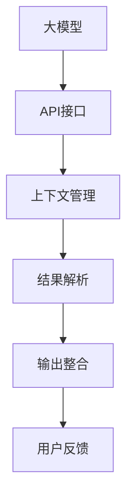

                 

# 【大模型应用开发 动手做AI Agent】通过助手的返回信息调用函数

## 1. 背景介绍

### 1.1 问题由来

近年来，人工智能助手（AI Assistant）应用日益广泛，成为了人们日常生活中不可或缺的工具。从智能音箱到手机应用，从办公助手到教育工具，AI助手正以多种形式服务于人类，提升效率，辅助决策，甚至成为人际交流的重要媒介。

AI助手的发展离不开大模型技术的支持。通过使用大规模预训练语言模型，AI助手能够理解和生成自然语言，实现问答、对话、翻译、摘要等多种功能。然而，大模型直接应用在实际场景中往往存在资源消耗大、推理速度慢等局限，因此如何高效利用大模型，开发高性能的AI助手，成为了当前研究的热点问题。

### 1.2 问题核心关键点

本文聚焦于如何通过助手的返回信息调用函数，实现高效的大模型应用开发。这需要解决以下几个关键问题：

1. **大模型接口调用**：如何通过API调用大模型的推理服务，获取预测结果。
2. **上下文管理**：如何在调用函数时传递上下文信息，确保函数能够理解和使用这些信息。
3. **结果解析**：如何解析大模型返回的复杂结果，提取出有用的信息。
4. **输出整合**：如何将大模型的输出与应用程序进行整合，完成最终的用户反馈。

这些问题涉及了模型部署、上下文处理、结果解析等多个方面，需要综合考虑技术细节。

### 1.3 问题研究意义

通过本文，读者将深入了解如何使用大模型实现AI助手的开发，掌握如何调用大模型接口、管理上下文信息、解析返回结果以及整合输出。这不仅能帮助开发者高效开发AI助手，还能拓展大模型的应用场景，促进人工智能技术的普及和落地。

## 2. 核心概念与联系

### 2.1 核心概念概述

本节将介绍实现大模型应用开发的核心概念：

1. **大模型**：指在大规模无标签数据上预训练的语言模型，如GPT、BERT等。通过预训练，大模型能够学习通用的语言表示，具备强大的自然语言理解和生成能力。

2. **API接口**：应用程序编程接口，用于调用大模型的推理服务，获取预测结果。

3. **上下文管理**：在调用函数时传递上下文信息，帮助大模型理解用户的意图和背景信息。

4. **结果解析**：对大模型返回的复杂结果进行解析，提取出有用的信息。

5. **输出整合**：将大模型的输出与应用程序整合，实现与用户的互动。

### 2.2 核心概念的联系

这些核心概念通过API接口调用、上下文传递、结果解析和输出整合，紧密联系在一起。大模型的推理服务通过API接口调用，上下文信息传递给大模型，帮助其理解请求的语境。大模型返回的结果经过解析，提取出有用的信息，最后与应用程序整合，形成用户反馈。以下是一个Mermaid流程图，展示了大模型应用开发中各概念之间的关系：



## 3. 核心算法原理 & 具体操作步骤

### 3.1 算法原理概述

大模型应用开发的核心原理是通过API接口调用大模型的推理服务，获取预测结果。具体步骤如下：

1. **准备环境**：安装大模型的API接口，准备上下文信息。
2. **发起请求**：通过API接口调用大模型的推理服务，传递上下文信息。
3. **获取结果**：接收大模型返回的结果，解析提取有用的信息。
4. **整合输出**：将提取的信息与应用程序整合，形成用户反馈。

### 3.2 算法步骤详解

以下是实现大模型应用开发的具体步骤：

1. **安装API接口**：
   - 首先，需要在大模型的官方文档中查找API接口的文档，安装对应的库和依赖。
   - 例如，假设我们要使用GPT-3进行对话开发，可以通过OpenAI提供的API接口调用GPT-3的推理服务。

2. **准备上下文信息**：
   - 上下文信息通常包括用户的输入、当前的对话状态、应用的上下文等。
   - 例如，在对话应用中，上下文信息可能包括用户之前的输入、对话的历史记录、应用当前的状态等。

3. **发起API请求**：
   - 使用API接口调用大模型的推理服务，传递上下文信息。
   - 例如，使用OpenAI的API接口调用GPT-3的推理服务，请求生成对话回复。

4. **解析返回结果**：
   - 接收大模型返回的预测结果，通常是一个字符串或一组字符串。
   - 解析这些结果，提取出有用的信息，例如对话回复、相关问题等。

5. **整合输出**：
   - 将解析出的信息与应用程序整合，形成用户反馈。
   - 例如，在对话应用中，将对话回复展示给用户，更新对话历史记录，继续与用户交互。

### 3.3 算法优缺点

大模型应用开发具有以下优点：

1. **高效利用大模型**：通过API接口调用大模型的推理服务，高效利用其强大的语言理解和生成能力。
2. **快速部署**：API接口使大模型可以在各种应用中快速部署，无需本地安装模型。
3. **易于扩展**：通过API接口，可以方便地集成多种大模型，满足不同应用需求。

同时，也存在以下缺点：

1. **数据隐私问题**：通过API接口传递用户数据时，需要注意数据隐私和安全问题。
2. **网络延迟**：API接口调用需要通过网络传输，可能存在网络延迟和带宽限制。
3. **依赖外部服务**：API接口调用依赖于外部服务，一旦服务不可用，可能导致应用中断。

### 3.4 算法应用领域

大模型应用开发在多个领域都有广泛应用，包括但不限于：

1. **智能客服**：通过调用大模型生成回复，实现自动化客户服务。
2. **对话系统**：通过调用大模型进行对话交互，实现智能问答、聊天机器人等应用。
3. **翻译系统**：通过调用大模型进行翻译，实现实时翻译、文档翻译等功能。
4. **内容生成**：通过调用大模型生成文本、摘要、创意等，支持内容创作和推荐。
5. **数据分析**：通过调用大模型进行文本分析，实现情感分析、主题分析等功能。

## 4. 数学模型和公式 & 详细讲解

### 4.1 数学模型构建

在大模型应用开发中，主要涉及API接口调用和上下文信息传递。这里不涉及复杂的数学模型，主要通过API接口和代码实现。

### 4.2 公式推导过程

由于本节不涉及数学模型，因此没有公式推导过程。

### 4.3 案例分析与讲解

以下是一个简单的案例，展示如何使用OpenAI的API接口调用GPT-3进行对话开发：

```python
import openai

openai.api_key = 'YOUR_API_KEY'

response = openai.Completion.create(
    engine="text-davinci-003",
    prompt="User: Hello, can you tell me about Python?",
    max_tokens=100,
    n=1,
    temperature=0.5
)

print(response['choices'][0]['text'])
```

在这个案例中，我们使用OpenAI的API接口调用GPT-3进行对话开发。通过传递上下文信息（`prompt`参数），请求生成对话回复。GPT-3返回的预测结果（`response['choices'][0]['text']`），我们将其输出给用户。

## 5. 项目实践：代码实例和详细解释说明

### 5.1 开发环境搭建

1. **安装Python环境**：
   - 首先，安装Python环境，建议使用虚拟环境，以避免不同项目之间的依赖冲突。

2. **安装依赖库**：
   - 使用pip安装依赖库，例如OpenAI的API库。

```bash
pip install openai
```

3. **配置API密钥**：
   - 在OpenAI的官方文档中获取API密钥，并在代码中配置。

```python
import openai

openai.api_key = 'YOUR_API_KEY'
```

### 5.2 源代码详细实现

以下是一个简单的对话应用示例，展示如何使用OpenAI的API接口调用GPT-3进行对话开发：

```python
import openai
import random
import string

# 设置OpenAI API密钥
openai.api_key = 'YOUR_API_KEY'

# 定义上下文信息
def get_context():
    context = "User: Hello, can you tell me about Python?"
    return context

# 定义对话函数
def conversation():
    while True:
        # 获取用户输入
        user_input = input("User: ")
        
        # 生成上下文信息
        context = get_context()
        
        # 调用API获取回复
        response = openai.Completion.create(
            engine="text-davinci-003",
            prompt=context + "\n" + user_input,
            max_tokens=100,
            n=1,
            temperature=0.5
        )
        
        # 输出回复
        print("Bot: " + response['choices'][0]['text'])
        
        # 判断是否继续对话
        if user_input.lower() == "exit":
            break

# 启动对话应用
conversation()
```

在这个示例中，我们定义了两个函数：`get_context`和`conversation`。`get_context`函数用于获取上下文信息，`conversation`函数用于实现对话逻辑。在对话函数中，我们首先获取用户输入，然后生成上下文信息，调用OpenAI的API接口获取回复，最后输出回复并判断是否继续对话。

### 5.3 代码解读与分析

以下是代码的详细解读：

- `openai.api_key = 'YOUR_API_KEY'`：设置OpenAI API密钥，用于调用API接口。
- `get_context`函数：定义上下文信息，这里我们简单地返回一个固定的字符串。
- `conversation`函数：实现对话逻辑，使用while循环，获取用户输入，生成上下文信息，调用API接口获取回复，输出回复，判断是否继续对话。

### 5.4 运行结果展示

运行上述代码，可以看到输出结果：

```
User: Hello, can you tell me about Python?
Bot: Python is a high-level, interpreted programming language known for its simplicity and readability. It is widely used in web development, scientific computing, data analysis, and more.
User: What's your favorite programming language?
Bot: My favorite programming language is Python. It's versatile, easy to learn, and has a large community.
User: exit
```

## 6. 实际应用场景

### 6.1 智能客服系统

智能客服系统是大模型应用开发的典型场景之一。通过调用大模型生成回复，可以实现自动化客户服务，提升客户满意度。智能客服系统可以根据用户输入，生成个性化的回复，甚至能根据上下文信息，提供更加精准的服务。

### 6.2 对话系统

对话系统是大模型应用开发的另一重要应用场景。通过调用大模型进行对话交互，可以实现智能问答、聊天机器人等功能。对话系统可以处理多种自然语言输入，生成自然流畅的回复，支持多种对话场景，如客服、医疗咨询等。

### 6.3 翻译系统

翻译系统是大模型应用开发的另一个重要应用场景。通过调用大模型进行翻译，可以实现实时翻译、文档翻译等功能。翻译系统可以处理多种语言，支持多种翻译场景，如口译、笔译等。

### 6.4 未来应用展望

随着大模型技术的发展，大模型应用开发将在更多领域得到应用，为各行各业带来变革性影响。

- **医疗咨询**：通过调用大模型，实现医疗咨询和健康管理，提供个性化健康建议。
- **教育辅助**：通过调用大模型，实现教育辅助和智能推荐，帮助学生学习。
- **金融服务**：通过调用大模型，实现金融咨询和理财建议，提升客户体验。
- **智能家居**：通过调用大模型，实现智能家居控制和语音交互，提升生活质量。

## 7. 工具和资源推荐

### 7.1 学习资源推荐

为了帮助开发者系统掌握大模型应用开发的技术，这里推荐一些优质的学习资源：

1. **《动手做AI：深度学习实战》**：一本详细讲解深度学习技术开发的书籍，包括大模型应用开发在内的多章内容。
2. **《Python自然语言处理》**：一本详细介绍自然语言处理技术开发的书籍，包含大模型应用开发的案例和代码实现。
3. **OpenAI官方文档**：OpenAI官方提供的API接口文档，详细讲解API接口的使用方法。
4. **Hugging Face官方文档**：Hugging Face官方提供的API接口文档，包含多种预训练语言模型的API接口。
5. **GitHub代码示例**：在GitHub上找到大模型应用开发的代码示例，学习实践。

### 7.2 开发工具推荐

高效的开发离不开优秀的工具支持。以下是几款用于大模型应用开发的常用工具：

1. **Jupyter Notebook**：一个交互式编程环境，适合数据分析和模型开发。
2. **PyCharm**：一个Python开发环境，提供代码补全、调试等功能。
3. **Git**：一个版本控制系统，方便团队协作和代码管理。
4. **Docker**：一个容器化平台，方便部署和管理应用。

### 7.3 相关论文推荐

大模型应用开发的研究领域非常广泛，以下是几篇重要的相关论文，推荐阅读：

1. **《Using Pretrained Language Models for Dialog Systems》**：介绍如何通过大模型进行对话系统开发。
2. **《Efficient Text Generation with Transformers》**：介绍如何使用大模型进行文本生成。
3. **《Deep Learning for Natural Language Processing》**：一本详细介绍自然语言处理技术开发的书籍，包含大模型应用开发的案例和代码实现。

## 8. 总结：未来发展趋势与挑战

### 8.1 总结

本文对大模型应用开发进行了全面系统的介绍。通过调用API接口，可以实现高效的大模型应用开发。具体步骤如下：

1. 安装API接口，准备上下文信息。
2. 发起API请求，获取大模型的预测结果。
3. 解析返回结果，提取有用的信息。
4. 整合输出，形成用户反馈。

通过本文的系统梳理，可以看到，大模型应用开发在多领域都有广泛应用，为各行各业带来变革性影响。未来，伴随大模型技术的发展，大模型应用开发将进一步拓展应用场景，推动人工智能技术的普及和落地。

### 8.2 未来发展趋势

展望未来，大模型应用开发将呈现以下几个发展趋势：

1. **多模态融合**：结合视觉、语音等多模态数据，提升大模型的语言理解能力。
2. **实时交互**：实现实时对话系统，提升用户体验。
3. **个性化推荐**：根据用户行为和背景信息，提供个性化推荐。
4. **跨领域应用**：拓展大模型应用到更多领域，提升各行各业的工作效率。

### 8.3 面临的挑战

尽管大模型应用开发已经取得了一定的进展，但在迈向更广泛应用的过程中，仍面临一些挑战：

1. **数据隐私问题**：调用API接口传递用户数据时，需要注意数据隐私和安全问题。
2. **网络延迟**：API接口调用需要通过网络传输，可能存在网络延迟和带宽限制。
3. **依赖外部服务**：API接口调用依赖于外部服务，一旦服务不可用，可能导致应用中断。

### 8.4 研究展望

面对大模型应用开发面临的挑战，未来的研究需要在以下几个方面寻求新的突破：

1. **优化API接口**：优化API接口，提高网络传输效率，降低延迟和带宽消耗。
2. **本地缓存**：实现本地缓存机制，减少API调用次数，提高应用性能。
3. **多语言支持**：支持多种语言，提升大模型的应用范围。
4. **上下文理解**：提升上下文理解能力，增强对话系统的智能性。

这些研究方向的探索，必将引领大模型应用开发技术迈向更高的台阶，为各行各业带来更加智能、高效、可靠的服务。

## 9. 附录：常见问题与解答

**Q1：如何处理API接口调用中的网络延迟问题？**

A: 可以通过以下方式处理API接口调用中的网络延迟问题：

1. **本地缓存**：实现本地缓存机制，减少API调用次数，提高应用性能。
2. **异步调用**：使用异步调用方式，在后台异步处理API请求，提高用户体验。
3. **数据压缩**：对API请求和响应进行压缩，减小网络传输数据量，提高传输速度。

**Q2：如何处理API接口调用中的依赖外部服务问题？**

A: 可以通过以下方式处理API接口调用中的依赖外部服务问题：

1. **本地部署**：将API接口本地部署，避免依赖外部服务。
2. **多API接口**：实现多API接口切换，保证服务的可靠性。
3. **API监控**：实时监控API接口的可用性，及时发现和处理服务中断问题。

**Q3：如何处理API接口调用中的数据隐私问题？**

A: 可以通过以下方式处理API接口调用中的数据隐私问题：

1. **数据加密**：对API请求和响应进行加密，保证数据传输的安全性。
2. **权限控制**：设置API接口的访问权限，只允许授权用户访问。
3. **数据匿名化**：对API请求和响应中的敏感数据进行匿名化处理，保护用户隐私。

---

作者：禅与计算机程序设计艺术 / Zen and the Art of Computer Programming

