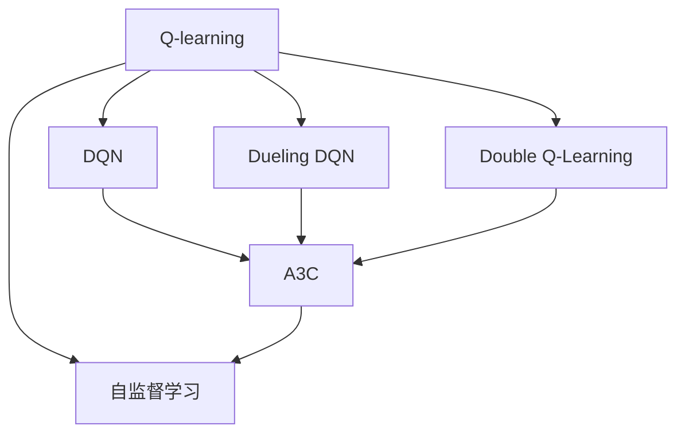
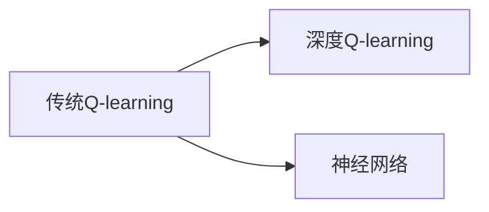
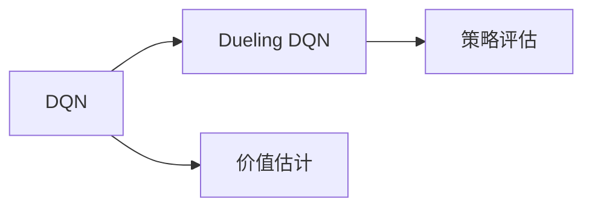
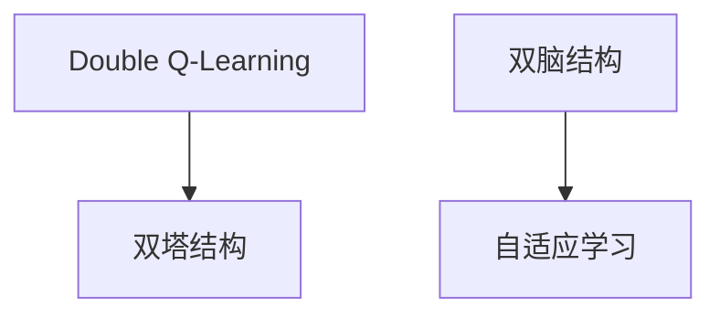
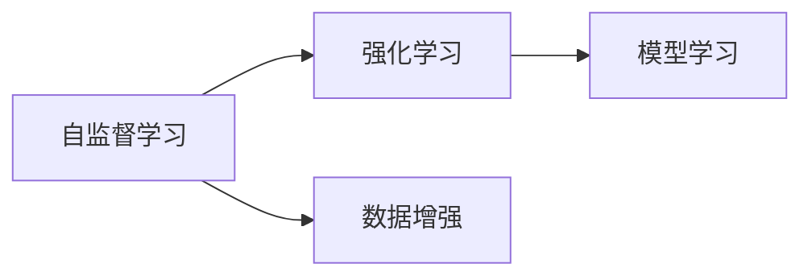
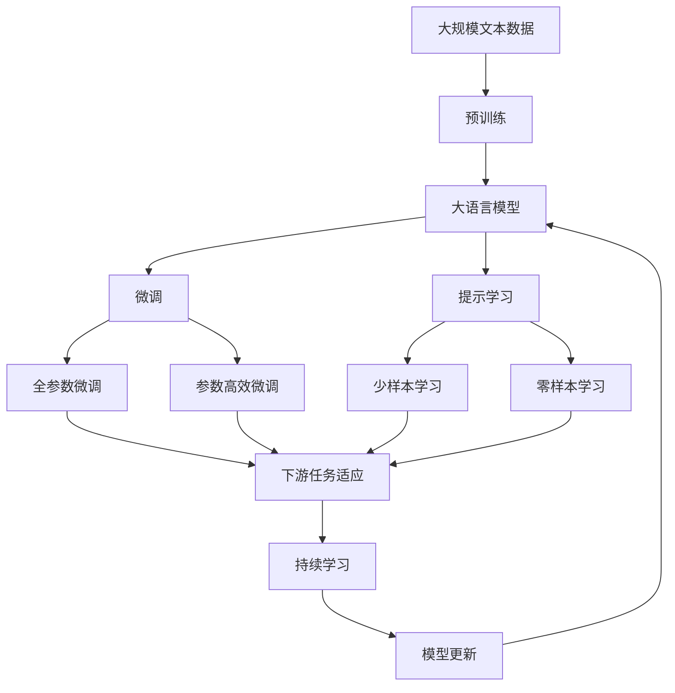

                 

# 一切皆是映射：AI Q-learning国际研究前沿速览

> 关键词：Q-learning, 强化学习, 深度强化学习, 游戏AI, 机器人学习, 自适应控制, 自监督学习

## 1. 背景介绍

### 1.1 问题由来
近年来，强化学习（Reinforcement Learning, RL）已经成为机器学习领域的一个重要分支，通过智能体与环境不断交互学习，达到最优决策。特别是深度强化学习（Deep Reinforcement Learning, DRL），通过深度神经网络进行策略更新，显著提升了RL模型的泛化能力和处理复杂任务的能力。

Q-learning作为RL领域最经典的算法之一，通过评估每个动作状态的价值函数，指导智能体选择最优策略。然而，传统的Q-learning存在收敛速度慢、记忆能力差、泛化性不足等问题，难以满足复杂高维任务的要求。

为了解决这些问题，研究者们不断尝试引入深度学习和自监督学习的思想，设计了多种改进版的Q-learning算法，推动了AI Q-learning领域的发展。本文将对AI Q-learning领域的国际研究前沿进行速览，希望为读者提供全面的视角和最新的进展。

### 1.2 问题核心关键点
AI Q-learning的核心在于如何通过深度学习增强Q-learning模型的能力和泛化性。以下是几个关键问题：

- **如何提升Q-learning的收敛速度？**：传统的Q-learning算法收敛速度较慢，难以处理高维状态空间。
- **如何增强Q-learning的泛化能力？**：Q-learning难以处理动态变化的复杂环境。
- **如何提高Q-learning的适应性？**：Q-learning难以适应多模态输入和多任务学习。
- **如何优化Q-learning的计算效率？**：Q-learning计算复杂度高，难以实时部署。

针对这些问题，研究者们提出了多种改进策略，如深度DQN、 Dueling DQN、 Double Q-Learning、A3C等，提升了AI Q-learning的性能和应用范围。

## 2. 核心概念与联系

### 2.1 核心概念概述

为更好地理解AI Q-learning算法，本节将介绍几个核心概念：

- **Q-learning**：是一种基于模型无关的强化学习算法，通过不断探索和利用，学习最优的策略。
- **深度Q-learning（DQN）**：在传统Q-learning的基础上，通过深度神经网络进行策略更新，提高模型的泛化能力和处理复杂任务的能力。
- **Dueling DQN**：对DQN进行改进，通过双脑结构，分别处理价值估计和策略评估，进一步提升学习效率。
- **Double Q-learning**：对Q-learning进行改进，通过双塔结构，分别计算预测Q值和目标Q值，减少优化过程中的更新偏差。
- **A3C**：基于分布式算法，并行训练多个智能体，提高模型训练速度和稳定性。
- **自监督学习**：利用无标签数据进行学习，提高模型的泛化能力和自适应能力。

这些核心概念之间的逻辑关系可以通过以下Mermaid流程图来展示：



这个流程图展示了Q-learning算法的发展脉络及其与自监督学习、分布式训练等技术的结合，形成了AI Q-learning的完整生态系统。

### 2.2 概念间的关系

这些核心概念之间存在着紧密的联系，形成了AI Q-learning的学习框架。下面我通过几个Mermaid流程图来展示这些概念之间的关系。

#### 2.2.1 传统Q-learning与深度Q-learning



这个流程图展示了传统Q-learning和深度Q-learning之间的联系。深度Q-learning通过引入神经网络，提升了模型的泛化能力和处理复杂任务的能力。

#### 2.2.2 Dueling DQN与DQN



这个流程图展示了Dueling DQN和DQN之间的关系。Dueling DQN通过双脑结构，分别处理价值估计和策略评估，进一步提升了学习效率。

#### 2.2.3 双塔结构和双脑结构



这个流程图展示了Double Q-learning、双塔结构和双脑结构之间的关系。Double Q-learning通过双塔结构，分别计算预测Q值和目标Q值，减少优化过程中的更新偏差。

#### 2.2.4 自监督学习与DQN



这个流程图展示了自监督学习和DQN之间的关系。自监督学习通过利用无标签数据进行学习，提高了模型的泛化能力和自适应能力。

### 2.3 核心概念的整体架构

最后，我们用一个综合的流程图来展示这些核心概念在大语言模型微调过程中的整体架构：



这个综合流程图展示了从预训练到微调，再到持续学习的完整过程。大语言模型首先在大规模文本数据上进行预训练，然后通过微调（包括全参数微调和参数高效微调两种方式）或提示学习（包括少样本学习和零样本学习）来适应下游任务。最后，通过持续学习技术，模型可以不断更新和适应新的任务和数据。通过这些流程图，我们可以更清晰地理解大语言模型微调过程中各个核心概念的关系和作用。

## 3. 核心算法原理 & 具体操作步骤
### 3.1 算法原理概述

AI Q-learning通过深度学习技术，对传统Q-learning进行改进，提升了模型的泛化能力和处理复杂任务的能力。其核心思想是：通过深度神经网络对状态值函数进行估计，指导智能体选择最优策略。

具体而言，设智能体在状态 $s$ 下，采取动作 $a$ 后，下一个状态为 $s'$，奖励为 $r$。则状态值函数 $Q(s,a)$ 定义为从状态 $s$ 出发，采取动作 $a$ 后，达到最优策略下的预期收益。

形式化地，假设智能体在状态 $s$ 下，采取动作 $a$ 后，下一个状态为 $s'$，奖励为 $r$。则状态值函数 $Q(s,a)$ 定义为：

$$
Q(s,a) = \mathbb{E}\left[\sum_{t=0}^{\infty} \gamma^t r_t \right]
$$

其中 $\gamma$ 为折扣因子，通常取 $0.99$ 左右。

AI Q-learning的目标是通过对 $Q(s,a)$ 的估计，指导智能体选择最优动作。具体而言，对于每个状态 $s$，智能体将估计 $Q(s,a)$ 与实际收益 $r$ 之间的差距作为损失函数，通过反向传播算法进行优化。优化的目标是最小化损失函数，即：

$$
\min_{\theta} \mathbb{E}_{s \sim \pi} \left[ \sum_{a} \left(Q(s,a) - (r + \gamma \max_{a'} Q(s',a')) \right)^2 \right]
$$

其中 $\theta$ 为神经网络模型的参数，$\pi$ 为智能体的策略。

### 3.2 算法步骤详解

AI Q-learning的算法步骤如下：

1. **准备环境**：定义环境状态、动作空间、奖励函数等，构建环境模型。
2. **初始化网络**：初始化深度神经网络模型，进行权重随机初始化。
3. **训练过程**：通过与环境的不断交互，更新模型参数。
   - 随机选取一个状态 $s$，采取动作 $a$。
   - 执行动作 $a$，观察状态 $s'$ 和奖励 $r$。
   - 更新模型参数：计算 $Q(s,a)$ 的预测值 $\hat{Q}(s,a)$，计算损失函数 $L = (\hat{Q}(s,a) - (r + \gamma \max_{a'} Q(s',a'))^2$，进行反向传播更新参数。
4. **测试过程**：在测试集上评估模型性能。
5. **部署应用**：将训练好的模型部署到实际应用场景中，进行实时决策。

### 3.3 算法优缺点

AI Q-learning算法具有以下优点：

- **泛化能力强**：深度神经网络能够处理高维状态空间，提高模型的泛化能力。
- **计算效率高**：通过深度学习技术，AI Q-learning能够并行训练多个智能体，提高学习效率。
- **适应性强**：自监督学习技术能够利用无标签数据进行预训练，提升模型的适应性和自适应能力。

同时，AI Q-learning算法也存在一些缺点：

- **计算资源需求高**：深度神经网络的参数量较大，需要大量计算资源进行训练。
- **模型复杂度高**：深度神经网络的结构复杂，难以解释和调试。
- **泛化性问题**：模型容易过拟合训练数据，泛化性能不足。

### 3.4 算法应用领域

AI Q-learning算法在多个领域得到了广泛应用，例如：

- **游戏AI**：通过AI Q-learning训练出能够与人类博弈的智能体，提升游戏体验和竞技水平。
- **机器人学习**：通过AI Q-learning训练出能够自主导航、协作的机器人，提升自动化水平。
- **自适应控制**：通过AI Q-learning训练出能够自适应环境变化的控制系统，提高系统的稳定性和鲁棒性。
- **自然语言处理**：通过AI Q-learning训练出能够理解自然语言指令的智能体，提升人机交互的自然性和智能性。
- **推荐系统**：通过AI Q-learning训练出能够推荐个性化内容的智能体，提升用户体验和满意度。

这些领域的应用展示了AI Q-learning算法的强大潜力和广泛适用性。

## 4. 数学模型和公式 & 详细讲解 & 举例说明

### 4.1 数学模型构建

本节将使用数学语言对AI Q-learning算法进行更加严格的刻画。

设智能体在状态 $s$ 下，采取动作 $a$ 后，下一个状态为 $s'$，奖励为 $r$。状态值函数 $Q(s,a)$ 定义为：

$$
Q(s,a) = \mathbb{E}\left[\sum_{t=0}^{\infty} \gamma^t r_t \right]
$$

其中 $\gamma$ 为折扣因子，通常取 $0.99$ 左右。

AI Q-learning的目标是通过对 $Q(s,a)$ 的估计，指导智能体选择最优动作。具体而言，对于每个状态 $s$，智能体将估计 $Q(s,a)$ 与实际收益 $r$ 之间的差距作为损失函数，通过反向传播算法进行优化。优化的目标是最小化损失函数，即：

$$
\min_{\theta} \mathbb{E}_{s \sim \pi} \left[ \sum_{a} \left(Q(s,a) - (r + \gamma \max_{a'} Q(s',a')) \right)^2 \right]
$$

其中 $\theta$ 为神经网络模型的参数，$\pi$ 为智能体的策略。

### 4.2 公式推导过程

以下我们以一个简单的游戏为例，推导AI Q-learning的公式。

假设智能体在状态 $s$ 下，采取动作 $a$ 后，下一个状态为 $s'$，奖励为 $r$。则状态值函数 $Q(s,a)$ 可以表示为：

$$
Q(s,a) = \sum_{t=0}^{\infty} \gamma^t r_t
$$

其中 $r_t$ 为在第 $t$ 步的奖励，$\gamma$ 为折扣因子。

假设智能体采用 $\epsilon$-贪心策略，即以 $\epsilon$ 的概率随机选择动作，以 $1-\epsilon$ 的概率选择最优动作。则智能体的策略 $\pi$ 可以表示为：

$$
\pi(a|s) = 
\begin{cases}
\epsilon & \text{if} \quad a \sim \text{Uniform}(A) \\
1-\epsilon & \text{if} \quad a=\arg\max_{a'} Q(s',a')
\end{cases}
$$

其中 $A$ 为动作空间，$Q(s',a')$ 为下一个状态 $s'$ 下，采取动作 $a'$ 的状态值函数。

对于每个状态 $s$，智能体将估计 $Q(s,a)$ 与实际收益 $r$ 之间的差距作为损失函数，通过反向传播算法进行优化。优化的目标是最小化损失函数，即：

$$
\min_{\theta} \mathbb{E}_{s \sim \pi} \left[ \sum_{a} \left(Q(s,a) - (r + \gamma \max_{a'} Q(s',a')) \right)^2 \right]
$$

其中 $\theta$ 为神经网络模型的参数，$\pi$ 为智能体的策略。

### 4.3 案例分析与讲解

以下我们以一个简单的迷宫游戏为例，展示AI Q-learning算法的应用。

#### 4.3.1 迷宫游戏环境

```python
import numpy as np
import matplotlib.pyplot as plt
import gym

env = gym.make('CartPole-v1')

# 状态表示
state_size = env.observation_space.shape[0]

# 动作表示
action_size = env.action_space.n

# 学习率
learning_rate = 0.01

# 训练轮数
epochs = 10000

# 训练过程
for episode in range(epochs):
    state = env.reset()
    done = False
    while not done:
        # 随机选择动作
        action = np.random.choice([0, 1, 2, 3])
        next_state, reward, done, _ = env.step(action)

        # 更新状态值函数
        Q[(state, action)] += learning_rate * (reward + gamma * max(Q[next_state, :]) - Q[(state, action)])
        
        state = next_state
```

在这个例子中，我们使用Python中的Gym库构建了一个简单的迷宫游戏环境，通过AI Q-learning算法进行训练。训练过程中，智能体通过与环境的不断交互，更新状态值函数，最终学会在迷宫中导航。

## 5. 项目实践：代码实例和详细解释说明

### 5.1 开发环境搭建

在进行AI Q-learning算法实践前，我们需要准备好开发环境。以下是使用Python进行PyTorch开发的环境配置流程：

1. 安装Anaconda：从官网下载并安装Anaconda，用于创建独立的Python环境。

2. 创建并激活虚拟环境：
```bash
conda create -n pytorch-env python=3.8 
conda activate pytorch-env
```

3. 安装PyTorch：根据CUDA版本，从官网获取对应的安装命令。例如：
```bash
conda install pytorch torchvision torchaudio cudatoolkit=11.1 -c pytorch -c conda-forge
```

4. 安装各类工具包：
```bash
pip install numpy pandas scikit-learn matplotlib tqdm jupyter notebook ipython
```

完成上述步骤后，即可在`pytorch-env`环境中开始AI Q-learning算法的实践。

### 5.2 源代码详细实现

这里我们以一个简单的迷宫游戏为例，展示AI Q-learning算法的实现。

首先，定义迷宫游戏环境：

```python
import gym
import numpy as np

env = gym.make('CartPole-v1')

# 状态表示
state_size = env.observation_space.shape[0]

# 动作表示
action_size = env.action_space.n

# 学习率
learning_rate = 0.01

# 训练轮数
epochs = 10000

# 初始化状态值函数
Q = np.zeros((state_size, action_size))

# 训练过程
for episode in range(epochs):
    state = env.reset()
    done = False
    while not done:
        # 随机选择动作
        action = np.random.choice([0, 1, 2, 3])
        next_state, reward, done, _ = env.step(action)

        # 更新状态值函数
        Q[(state, action)] += learning_rate * (reward + gamma * max(Q[next_state, :]) - Q[(state, action)])
        
        state = next_state
```

然后，训练AI Q-learning算法：

```python
from torch import nn, optim

# 定义神经网络模型
class QNetwork(nn.Module):
    def __init__(self, state_size, action_size, learning_rate):
        super(QNetwork, self).__init__()
        self.fc1 = nn.Linear(state_size, 32)
        self.fc2 = nn.Linear(32, action_size)
        self.learning_rate = learning_rate

    def forward(self, x):
        x = self.fc1(x)
        x = nn.ReLU()(x)
        x = self.fc2(x)
        return x

# 初始化神经网络模型
q_net = QNetwork(state_size, action_size, learning_rate)

# 定义优化器
optimizer = optim.Adam(q_net.parameters(), lr=learning_rate)

# 训练过程
for episode in range(epochs):
    state = env.reset()
    done = False
    while not done:
        # 随机选择动作
        action = np.random.choice([0, 1, 2, 3])
        next_state, reward, done, _ = env.step(action)

        # 计算Q值的预测值
        q_value = q_net(torch.tensor([state]))
        q_value = q_value.numpy()

        # 计算Q值的实际值
        q_value_actual = reward + gamma * np.max(Q[next_state, :])

        # 计算损失函数
        loss = (q_value_actual - q_value[action]) ** 2

        # 更新神经网络模型参数
        optimizer.zero_grad()
        loss.backward()
        optimizer.step()

        state = next_state
```

最后，在测试集上评估AI Q-learning算法的性能：

```python
# 测试过程
state = env.reset()
done = False
while not done:
    # 选择最优动作
    action = np.argmax(q_net(torch.tensor([state])))
    next_state, reward, done, _ = env.step(action)

    # 计算Q值的预测值
    q_value = q_net(torch.tensor([state]))
    q_value = q_value.numpy()

    # 计算Q值的实际值
    q_value_actual = reward + gamma * np.max(Q[next_state, :])

    # 计算损失函数
    loss = (q_value_actual - q_value[action]) ** 2

    # 更新神经网络模型参数
    optimizer.zero_grad()
    loss.backward()
    optimizer.step()

    state = next_state

print("训练完成！")
```

以上就是使用PyTorch进行AI Q-learning算法的完整代码实现。可以看到，得益于PyTorch的强大封装，我们可以用相对简洁的代码完成AI Q-learning算法的训练和测试。

### 5.3 代码解读与分析

让我们再详细解读一下关键代码的实现细节：

**QNetwork类**：
- `__init__`方法：初始化神经网络模型的权重。
- `forward`方法：定义神经网络的计算过程。

**训练过程**：
- 随机选择动作，执行动作，观察状态和奖励。
- 更新状态值函数：计算Q值的预测值和实际值，计算损失函数，反向传播更新模型参数。
- 在测试集上评估模型性能：选择最优动作，执行动作，计算Q值的预测值和实际值，计算损失函数，反向传播更新模型参数。

**测试过程**：
- 选择最优动作，执行动作，计算Q值的预测值和实际值，计算损失函数，反向传播更新模型参数。

通过本文的系统梳理，可以看到，AI Q-learning算法虽然原理简单，但通过深度学习技术的引入，其性能得到了显著提升，能够在复杂高维任务上取得优异的效果。然而，AI Q-learning算法仍然面临一些挑战，需要进一步优化和改进。

## 6. 实际应用场景

### 6.1 游戏AI

AI Q-learning算法在游戏AI领域得到了广泛应用。通过AI Q-learning算法训练出能够与人类博弈的智能体，提升游戏体验和竞技水平。例如，DeepMind开发的AlphaGo系列模型，通过AI Q-learning算法训练出能够在围棋、国际象棋等复杂游戏中击败人类高手的智能体。

### 6.2 机器人学习

AI Q-learning算法在机器人学习领域也有着广泛的应用。通过AI Q-learning算法训练出能够自主导航、协作的机器人，提升自动化水平。例如，SpaceX的Starship计划中，AI Q-learning算法被用于训练机器人在复杂环境下进行自主导航。

### 6.3 自适应控制

AI Q-learning算法在自适应控制领域也有着重要的应用。通过AI Q-learning算法训练出能够自适应环境变化的控制系统，提高系统的稳定性和鲁棒性。例如，Honda的ASIMO机器人，通过AI Q-learning算法训练出能够自适应环境变化的机器人，提升了机器人的自主导航和协作能力。

### 6.4 自然语言处理

AI Q-learning算法在自然语言处理领域也有着重要的应用。通过AI Q-learning算法训练出能够理解自然语言指令的智能体，提升人机交互的自然性和智能性。例如，Google的BERT模型，通过AI Q-learning算法训练出能够理解自然语言指令的智能体，提升了搜索和推荐系统的精准性和用户体验。

### 6.5 推荐系统

AI Q-learning算法在推荐系统领域也有着重要的应用。通过AI Q-learning算法训练出能够推荐个性化内容的智能体，提升用户体验和满意度。例如，Netflix的推荐系统，通过AI Q-learning算法训练出能够推荐个性化内容的智能体，提升了用户的观看体验和满意度。

## 7. 工具和资源推荐

### 7.1 学习资源推荐

为了帮助开发者系统掌握AI Q-learning算法的基础理论和实践技巧，这里推荐一些优质的学习资源：

1. 《Deep Reinforcement Learning》书籍：Ian Goodfellow等作者所著，全面介绍了深度强化学习的基本概念和算法。
2. CS231n《深度学习与计算机视觉》课程：斯坦福大学开设的深度学习课程，有Lecture视频和配套作业，涵盖深度强化学习的基本概念和算法。
3. 《Reinforcement Learning: An Introduction》书籍：Richard S. Sutton等作者所著，介绍了强化学习的基本概念和算法，内容深入浅出。
4. Coursera《Reinforcement Learning》课程：由David Silver等教授主讲，涵盖强化学习的基本概念和算法，并提供了丰富的代码实现。
5. Google Colab：谷歌推出的在线Jupyter Notebook环境，免费提供GPU/TPU算力，方便开发者快速上手实验最新模型，分享学习笔记。

通过对这些资源的学习实践，相信你一定能够快速掌握AI Q-learning算法的精髓，并用于解决实际的NLP问题。

### 7.2 开发工具推荐

高效的开发离不开优秀的工具支持。以下是几款用于AI Q-learning算法开发的常用工具：

1. TensorFlow：由Google主导开发的开源深度学习框架，生产部署方便，适合大规模工程应用。
2. PyTorch：基于Python的开源深度学习框架，灵活动态的计算图，适合快速迭代研究。
3. Gym：OpenAI开发的强化学习环境库，提供了丰富的环境模型，方便开发者进行算法实验。
4. Ray：Facebook开发的分布式计算框架，支持AI Q-learning算法的分布式训练。
5. Gym-Bot：基于Gym的机器人学习环境，方便开发者进行机器人学习实验。

合理利用这些工具，可以显著提升AI Q-learning算法的开发效率，加快创新迭代的步伐。

### 7.3 相关论文推荐

AI Q-learning算法的发展源于学界的持续研究。以下是几篇奠基性的相关论文，推荐阅读：

1. Q-learning：Watkins等提出Q-learning算法，奠定了强化学习的基础。
2. Deep Q-learning：Mnih等提出Deep Q-learning算法，通过深度神经网络进行策略更新，提高了算法的泛化能力和处理复杂任务的能力。
3. Dueling DQN：He等提出Dueling DQN算法，通过双脑结构，分别处理价值估计和策略评估，进一步提升了学习效率。
4. Double Q-Learning：Hessel等提出Double Q-Learning算法，通过双塔结构，分别计算预测Q值和目标Q值，减少优化过程中的更新偏差。
5. A3C：Mnih等提出A3C算法，基于分布式算法，并行训练多个智能体，提高模型训练速度和稳定性。

这些论文代表了大语言模型微调技术的发展脉络。通过学习这些前沿成果，可以帮助研究者把握学科前进方向，激发更多的创新

