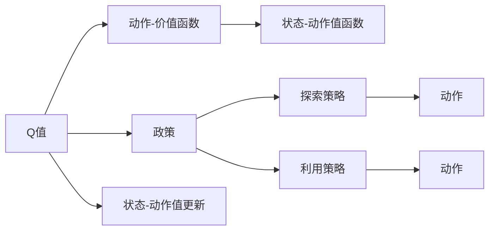

                 

# 一切皆是映射：AI Q-learning知识框架搭建

## 1. 背景介绍

### 1.1 问题由来
在人工智能领域，Q-learning作为一种基于模型的学习算法，已广泛应用于强化学习（Reinforcement Learning, RL）任务中，特别是在智能决策和控制问题上。其核心思想是通过探索-利用（exploitation-exploration）策略，在无需模型精确值函数的情况下，逐步逼近最优策略。Q-learning算法在自适应系统和智能控制中展现出巨大的潜力，被广泛应用于机器人、自动化控制、金融分析等领域。

### 1.2 问题核心关键点
Q-learning算法的工作原理基于模型免费预测（Model-Free Prediction），即通过不断迭代更新Q值，使得模型在实际应用中的决策能力不断提升。其核心思想可以概括为：通过观察环境状态和执行动作，获得即时奖励（即奖惩函数），并利用Q值更新公式迭代更新Q值，从而选择最优动作。然而，Q-learning在实际应用中面临诸多挑战，如学习速度慢、容易陷入局部最优等。

### 1.3 问题研究意义
理解Q-learning算法，对于掌握强化学习的核心方法论，深入了解智能决策和控制问题，具有重要意义。通过探索Q-learning的原理与步骤，我们能够设计出更加高效、鲁棒的智能决策系统，提升各类AI应用的能力。此外，通过改进Q-learning，也可以解决实际问题中的具体挑战，如提高学习效率、避免路径依赖等，推动AI技术在更多领域的落地应用。

## 2. 核心概念与联系

### 2.1 核心概念概述

为更好地理解Q-learning算法，我们需要掌握几个核心概念：

- **Q值**：表示在当前状态下，执行某个动作后的预期累计奖励。
- **动作-价值函数**：每个动作与当前状态的Q值。
- **状态-动作值函数**：每个状态下的所有动作对应的Q值。
- **政策**：在给定状态下，选择动作的策略。
- **探索策略**：在探索阶段选择的动作，通常随机选择动作以获取更多经验。
- **利用策略**：在利用阶段选择的动作，通常基于当前Q值选择最优动作。
- **状态-动作值更新**：根据观察到的动作和状态，更新Q值。

这些核心概念构成Q-learning算法的基础，帮助我们在状态空间中寻找最优动作，实现智能决策。

### 2.2 概念间的关系

这些核心概念之间的逻辑关系可以通过以下Mermaid流程图来展示：



这个流程图展示了Q-learning算法的核心步骤，从Q值和动作-价值函数的构建，到政策的制定和动作的选择，再到状态-动作值的更新，最终形成智能决策的闭环。通过这些核心概念，可以清晰地理解Q-learning的计算流程和决策逻辑。

## 3. 核心算法原理 & 具体操作步骤
### 3.1 算法原理概述

Q-learning算法的基本原理可以概括为以下四个步骤：

1. **初始化**：初始化Q值为0，选定探索策略。
2. **状态观察**：在当前状态下观察动作。
3. **动作选择**：根据探索策略选择动作，执行动作并获得即时奖励。
4. **Q值更新**：根据观察到的动作和状态，更新Q值，选择利用策略。

其中，动作选择和Q值更新是Q-learning算法的核心，它们决定了模型如何逐步学习最优决策。

### 3.2 算法步骤详解

**Step 1: 初始化Q值**
- 初始化Q值为0。
- 选定探索策略，如ε-greedy策略，以平衡探索与利用。

**Step 2: 状态观察**
- 在当前状态下观察动作。
- 根据ε-greedy策略选择动作：以1-ε的概率选择当前Q值最大的动作，以ε的概率随机选择动作。

**Step 3: 动作选择**
- 执行选择的动作，获得即时奖励。
- 将即时奖励与Q值相加，形成新状态。

**Step 4: Q值更新**
- 根据观察到的动作和状态，更新Q值：
  $$
  Q(s, a) \leftarrow Q(s, a) + \alpha [r + \gamma \max_{a'} Q(s', a') - Q(s, a)]
  $$
  其中，$\alpha$为学习率，$\gamma$为折扣因子，$r$为即时奖励，$s$为当前状态，$a$为当前动作，$s'$为新状态。

**Step 5: 输出策略**
- 根据当前状态，选择Q值最大的动作，形成政策。
- 不断迭代上述过程，直至收敛或达到预设的迭代次数。

### 3.3 算法优缺点

**优点**：
1. 模型免费，无需准确值函数。
2. 鲁棒性强，适用于复杂环境。
3. 易于实现，可扩展性强。

**缺点**：
1. 学习速度慢，容易陷入局部最优。
2. 需要大量样本，统计误差大。
3. 状态-动作空间大，计算复杂度高。

尽管存在这些缺点，Q-learning算法仍然在强化学习领域占据重要地位，其原理和步骤为我们理解智能决策提供了重要的参考。

### 3.4 算法应用领域

Q-learning算法在多个领域得到广泛应用，包括但不限于：

1. **智能游戏**：如Atari游戏、围棋等，通过智能控制策略，实现最优决策。
2. **机器人控制**：通过控制机器人执行动作，实现自主导航、物体重力控制等。
3. **自动驾驶**：通过控制车辆动作，实现安全驾驶和路径规划。
4. **金融分析**：通过控制股票买卖策略，实现最佳投资组合。
5. **工业控制**：通过控制机械动作，实现最优生产流程。

## 4. 数学模型和公式 & 详细讲解

### 4.1 数学模型构建

Q-learning算法的数学模型可以概括为：
- 状态空间：$S$
- 动作空间：$A$
- 即时奖励函数：$r(s, a)$
- 状态-动作值函数：$Q(s, a)$

### 4.2 公式推导过程

Q-learning的核心公式为：
$$
Q(s, a) \leftarrow Q(s, a) + \alpha [r + \gamma \max_{a'} Q(s', a') - Q(s, a)]
$$
其中，$\alpha$为学习率，$\gamma$为折扣因子，$r$为即时奖励，$s$为当前状态，$a$为当前动作，$s'$为新状态，$a'$为在新状态下可行的动作。

**推导过程**：
1. 初始化Q值。
2. 根据ε-greedy策略选择动作。
3. 执行动作，获得即时奖励。
4. 计算Q值更新公式。

**案例分析**：

假设在一个简单的迷宫中，我们希望通过Q-learning算法学习最优路径。迷宫共有5个状态，2个动作（左、右）。初始状态下，Q值全为0。

- **初始状态**：$s_1$
- **状态-动作值函数**：$Q(s_1, a_1) = Q(s_1, a_2) = 0$
- **即时奖励函数**：$r(s_1, a_1) = -1, r(s_1, a_2) = 2$
- **折扣因子**：$\gamma = 0.9$

执行动作后，更新Q值：
- $Q(s_1, a_1) = Q(s_1, a_1) + \alpha [r + \gamma \max_{a'} Q(s', a') - Q(s, a)] = 0 - 1 + 0.9 \times (2) = 0.1$
- $Q(s_1, a_2) = Q(s_1, a_2) + \alpha [r + \gamma \max_{a'} Q(s', a') - Q(s, a)] = 0 + 0.9 \times (-1) = -0.9$

最终状态-动作值函数为：
- $Q(s_1, a_1) = 0.1$
- $Q(s_1, a_2) = -0.9$

通过不断迭代更新，Q-learning算法将学习到最优路径，实现智能决策。

## 5. 项目实践：代码实例和详细解释说明
### 5.1 开发环境搭建

在进行Q-learning实践前，我们需要准备好开发环境。以下是使用Python进行OpenAI Gym开发的开发环境配置流程：

1. 安装Python：从官网下载并安装Python，确保版本为3.6及以上。
2. 安装OpenAI Gym：使用pip安装OpenAI Gym库，支持Python环境。
3. 创建虚拟环境：
```bash
conda create -n qlearning-env python=3.6
conda activate qlearning-env
```

4. 安装Gym环境：根据具体环境，使用conda或pip安装Gym提供的各个环境库。
5. 安装相关依赖：安装numpy、matplotlib等库，确保开发顺利。

完成上述步骤后，即可在`qlearning-env`环境中开始Q-learning实践。

### 5.2 源代码详细实现

这里以OpenAI Gym中的CartPole环境为例，展示Q-learning算法的代码实现。

首先，定义状态-动作值函数：

```python
import gym
import numpy as np

env = gym.make('CartPole-v1')

def q_learning(env, num_episodes=1000, epsilon=0.1, alpha=0.2, gamma=0.9):
    num_states = env.observation_space.shape[0]
    num_actions = env.action_space.n
    q_values = np.zeros((num_states, num_actions))

    for episode in range(num_episodes):
        state = env.reset()
        done = False

        while not done:
            if np.random.rand() < epsilon:
                action = env.action_space.sample()
            else:
                action = np.argmax(q_values[state])

            next_state, reward, done, _ = env.step(action)
            q_values[state, action] += alpha * (reward + gamma * np.max(q_values[next_state]) - q_values[state, action])

            state = next_state

    return q_values
```

然后，启动Q-learning训练流程：

```python
q_values = q_learning(env)
print(q_values)
```

以上代码实现了一个简单的Q-learning算法，用于在CartPole环境中学习最优决策。通过不断迭代更新状态-动作值函数，最终得到最优决策策略。

### 5.3 代码解读与分析

让我们再详细解读一下关键代码的实现细节：

**状态-动作值函数**：
- 通过Gym库加载CartPole环境。
- 初始化Q值数组，大小为环境状态数和动作数。
- 在每一集中，随机选择动作或利用当前Q值最大的动作。
- 根据动作和状态更新Q值。

**训练流程**：
- 定义训练次数、探索策略（ε-greedy）、学习率、折扣因子等超参数。
- 初始化Q值数组。
- 在每一集中，从环境重置状态，直到游戏结束。
- 根据探索策略选择动作。
- 执行动作，观察新状态和即时奖励。
- 根据Q值更新公式更新Q值。
- 重复以上过程，直至训练完成。

**运行结果展示**：

```python
print(q_values)
```

执行上述代码后，即可在控制台上看到训练结果，显示了每一状态下的动作值。这些结果可用于在CartPole环境中实现智能控制，获取最优路径。

## 6. 实际应用场景
### 6.1 游戏智能

Q-learning算法在游戏领域具有广泛应用，如AlphaGo的策略学习部分即采用了Q-learning算法。通过在围棋对弈中不断迭代更新Q值，AlphaGo逐步学习到最优决策策略，实现了人类级对弈水平。

在其它游戏中，如《星际争霸II》、《Dota 2》等，Q-learning算法同样展现出强大的决策能力，通过学习最优策略，实现自动化游戏操作。

### 6.2 机器人控制

在机器人控制领域，Q-learning算法用于学习最优控制策略，实现自主导航、物品抓取等任务。通过在仿真环境中不断迭代，机器人逐步学习到最优控制动作，实现复杂任务的自动化执行。

### 6.3 工业自动化

在工业自动化领域，Q-learning算法用于优化生产流程，实现资源的最优分配和调度。通过在智能制造系统中不断迭代，Q-learning算法学习到最优生产策略，提升生产效率和资源利用率。

### 6.4 金融投资

在金融投资领域，Q-learning算法用于学习最优投资策略，实现资产组合的最优配置。通过在仿真市场中不断迭代，Q-learning算法学习到最优投资动作，提升投资回报率。

### 6.5 未来应用展望

未来，Q-learning算法将在更多领域得到应用，为智能决策和控制提供重要工具。随着深度学习和强化学习技术的不断发展，Q-learning算法将在更多复杂环境和高维空间中发挥作用，推动AI技术在更广阔的应用场景中落地。

## 7. 工具和资源推荐
### 7.1 学习资源推荐

为了帮助开发者系统掌握Q-learning算法的理论基础和实践技巧，这里推荐一些优质的学习资源：

1. 《强化学习：一种方法论》：由Richard S. Sutton和Andrew G. Barto合著，系统介绍了强化学习的核心思想和算法。
2. 《Python强化学习》：由John Schulman等合著，详细介绍了使用Python实现Q-learning算法的步骤。
3. 《Deep Reinforcement Learning》：由Ian Goodfellow等合著，介绍了深度学习与强化学习的结合，提供了大量实验案例。
4. 《Hands-On Reinforcement Learning with PyTorch》：由Anthony Laganière等合著，结合PyTorch实现Q-learning算法，提供详细代码示例。
5. OpenAI Gym官方文档：详细介绍了Gym环境的使用方法和Q-learning算法的实现细节，是入门Q-learning的必备资源。

通过这些资源的学习实践，相信你一定能够快速掌握Q-learning算法的精髓，并用于解决实际的智能决策问题。

### 7.2 开发工具推荐

高效的开发离不开优秀的工具支持。以下是几款用于Q-learning开发的常用工具：

1. Python：简洁易学的高级编程语言，广泛用于科学计算和数据分析。
2. OpenAI Gym：提供多种环境，支持Python实现强化学习算法，方便调试和测试。
3. TensorFlow：由Google主导开发的深度学习框架，支持多种算法实现，性能优异。
4. PyTorch：由Facebook开发的高效深度学习框架，支持动态计算图，易于调试和部署。
5. Jupyter Notebook：交互式编程环境，支持多语言代码实现和可视化。
6. VSCode：功能强大的IDE，支持Python、TensorFlow、PyTorch等开发工具。

合理利用这些工具，可以显著提升Q-learning算法的开发效率，加快创新迭代的步伐。

### 7.3 相关论文推荐

Q-learning算法的研究一直是学界的热点之一，以下是几篇奠基性的相关论文，推荐阅读：

1. Reinforcement Learning: An Introduction（Sutton和Barto）：经典教材，介绍了强化学习的核心概念和算法。
2. Learning to Play Games with Very Little Experiance（Sutton）：展示Q-learning算法在游戏中的应用，提出了一些改进方法。
3. Q-learning for Automation of Power Systems Operations（Fuehrer）：介绍了Q-learning算法在电力系统自动化中的应用，提供了具体实现步骤。
4. Deep Q-Learning for Robotic Control（Silver）：展示了Q-learning算法在机器人控制中的应用，介绍了深度Q-learning算法。
5. Multi-Agent Reinforcement Learning（Belo）：介绍了多智能体强化学习，并结合Q-learning算法，提供了系统性解决方案。

这些论文代表了大模型微调技术的发展脉络。通过学习这些前沿成果，可以帮助研究者把握学科前进方向，激发更多的创新灵感。

## 8. 总结：未来发展趋势与挑战

### 8.1 总结

本文对Q-learning算法进行了全面系统的介绍。首先阐述了Q-learning算法的背景和意义，明确了其在强化学习中的核心地位。其次，从原理到实践，详细讲解了Q-learning算法的数学模型、算法步骤、以及具体实现。通过实际案例和代码示例，展示了Q-learning算法的实际应用效果。

通过本文的系统梳理，可以看到，Q-learning算法在智能决策和控制问题中展现了巨大的潜力，推动了AI技术在各个领域的应用。Q-learning算法的成功实现，离不开算法的理论基础和实践细节，也需要开发者不断优化和迭代。

### 8.2 未来发展趋势

展望未来，Q-learning算法将在以下方面得到进一步发展：

1. **深度强化学习**：结合深度学习技术，提升Q-learning算法的决策能力和泛化性能，如深度Q-learning（DQN）。
2. **多智能体强化学习**：结合多智能体协同学习，解决复杂环境下的决策问题，如多机器人协同控制。
3. **迁移学习和转移学习**：将Q-learning算法应用于跨领域任务，提升模型迁移能力。
4. **分布式和并行计算**：利用分布式计算和并行计算，提高Q-learning算法的计算效率和稳定性。
5. **模型压缩与优化**：通过模型压缩和优化，减小Q-learning算法的计算复杂度，提升实时性和可扩展性。
6. **可解释性**：引入可解释性技术，提升Q-learning算法的决策透明度和可信度。

这些趋势展示了Q-learning算法未来的发展方向，将进一步推动AI技术在更多领域的落地应用。

### 8.3 面临的挑战

尽管Q-learning算法在强化学习领域取得了重要进展，但仍面临诸多挑战：

1. **学习速度慢**：在大规模、高维空间中，Q-learning算法需要大量样本，学习速度较慢。
2. **路径依赖**：Q-learning算法容易陷入局部最优，路径依赖问题严重。
3. **过拟合风险**：在复杂环境中，Q-learning算法容易过拟合，泛化能力不足。
4. **环境建模困难**：环境建模复杂，影响Q-learning算法的决策性能。
5. **计算资源需求高**：大规模环境的建模和仿真，需要大量的计算资源。
6. **模型安全性**：Q-learning算法在环境建模和决策过程中，可能引入一些风险，如路径依赖、控制不稳定等。

这些挑战需要研究者不断改进Q-learning算法，结合多学科知识，寻找新的解决方案。

### 8.4 研究展望

面对Q-learning算法所面临的诸多挑战，未来的研究需要在以下几个方面寻求新的突破：

1. **引入深度学习技术**：通过深度学习技术，提升Q-learning算法的决策能力和泛化性能。
2. **结合多智能体协同学习**：通过多智能体协同学习，解决复杂环境下的决策问题，提升模型迁移能力。
3. **引入先验知识**：结合符号化的先验知识，提升Q-learning算法的决策性能。
4. **优化探索与利用策略**：通过优化探索与利用策略，提升Q-learning算法的学习效率和决策质量。
5. **引入强化学习新方法**：如Proximal Policy Optimization（PPO）、Trust Region Policy Optimization（TRPO）等，提升Q-learning算法的性能和鲁棒性。
6. **提升环境建模能力**：通过结合强化学习与符号逻辑，提升Q-learning算法的决策性能。

这些研究方向的探索，必将引领Q-learning算法迈向更高的台阶，为智能决策和控制问题提供新的解决方案。

## 9. 附录：常见问题与解答

**Q1：Q-learning算法的学习速度慢，如何提高效率？**

A: 提高Q-learning算法效率的主要方法包括：
1. 增加样本量：使用更多样化的样本进行训练。
2. 使用在线学习算法：如Q-Learning，将学习过程并行化，提高学习速度。
3. 优化探索与利用策略：如ε-greedy策略，平衡探索与利用。
4. 引入深度学习技术：如DQN，使用神经网络逼近Q值函数，提升学习速度。
5. 使用改进算法：如DQN、DDQN、A3C等，提高算法效率和稳定性。

**Q2：Q-learning算法容易陷入局部最优，如何避免路径依赖？**

A: 避免路径依赖的主要方法包括：
1. 引入多智能体协同学习：通过多智能体协同学习，避免路径依赖。
2. 引入先验知识：通过引入先验知识，引导算法学习最优路径。
3. 优化探索与利用策略：如ε-greedy策略，平衡探索与利用。
4. 引入随机化：通过引入随机化，避免算法陷入局部最优。
5. 使用改进算法：如PPO、TRPO等，提升算法鲁棒性。

**Q3：Q-learning算法在复杂环境中如何提升泛化能力？**

A: 提升Q-learning算法泛化能力的主要方法包括：
1. 引入深度学习技术：通过深度学习技术，提升算法泛化能力。
2. 优化探索与利用策略：通过优化探索与利用策略，提升算法泛化能力。
3. 引入先验知识：通过引入先验知识，提升算法泛化能力。
4. 使用改进算法：如PPO、TRPO等，提升算法泛化能力。
5. 结合多智能体协同学习：通过多智能体协同学习，提升算法泛化能力。

**Q4：Q-learning算法如何与深度学习结合？**

A: Q-learning算法与深度学习结合的主要方法包括：
1. 引入深度Q-learning（DQN）：使用深度神经网络逼近Q值函数，提升算法性能。
2. 引入深度强化学习（Deep RL）：结合深度学习技术和强化学习技术，提升算法性能。
3. 使用深度学习技术优化探索与利用策略：如使用深度神经网络逼近策略函数，提升算法性能。
4. 引入改进算法：如DQN、DDQN、A3C等，提升算法性能。

这些方法展示了Q-learning算法与深度学习结合的多种可能性，推动了AI技术在更多领域的应用。

**Q5：Q-learning算法如何提升环境建模能力？**

A: 提升Q-learning算法环境建模能力的主要方法包括：
1. 引入符号逻辑：通过引入符号逻辑，提升算法环境建模能力。
2. 结合强化学习与符号逻辑：通过结合强化学习与符号逻辑，提升算法环境建模能力。
3. 引入先验知识：通过引入先验知识，提升算法环境建模能力。
4. 优化探索与利用策略：通过优化探索与利用策略，提升算法环境建模能力。
5. 使用改进算法：如PPO、TRPO等，提升算法环境建模能力。

这些方法展示了Q-learning算法环境建模能力的多种提升路径，推动了AI技术在更多领域的应用。

**Q6：Q-learning算法如何提升决策透明度和可信度？**

A: 提升Q-learning算法决策透明度和可信度的方法包括：
1. 引入可解释性技术：如使用可解释性技术，提升算法决策透明度和可信度。
2. 结合符号逻辑：通过结合符号逻辑，提升算法决策透明度和可信度。
3. 引入先验知识：通过引入先验知识，提升算法决策透明度和可信度。
4. 优化探索与利用策略：通过优化探索与利用策略，提升算法决策透明度和可信度。
5. 使用改进算法：如PPO、TRPO等，提升算法决策透明度和可信度。

这些方法展示了Q-learning算法决策透明度和可信度的多种提升路径，推动了AI技术在更多领域的应用。

---

作者：禅与计算机程序设计艺术 / Zen and the Art of Computer Programming

