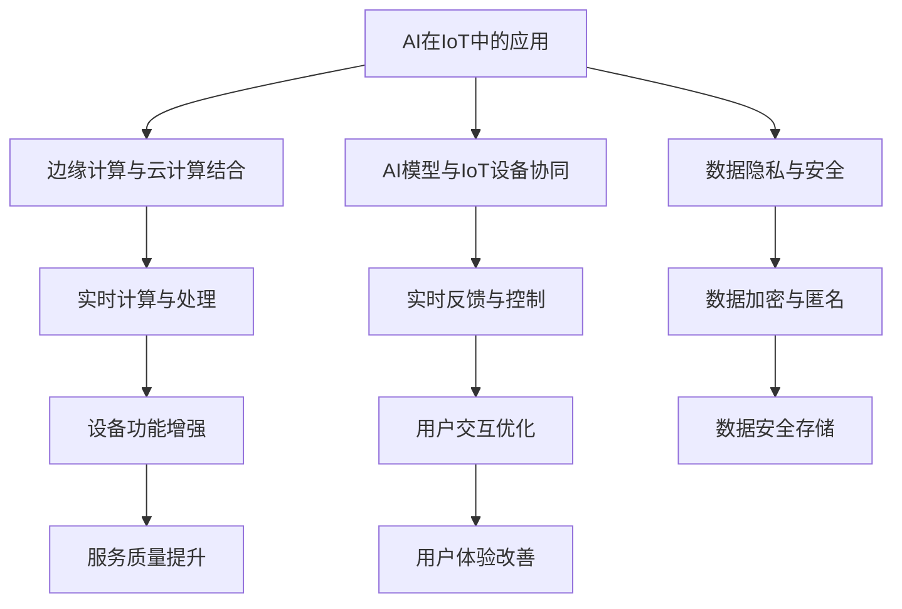

                 

## 1. 背景介绍

随着物联网(IoT)技术的不断进步，从智能家居到智能工厂，从智慧城市到智慧医疗，IoT设备的应用越来越广泛。AI技术的介入，使得IoT设备能够更好地感知环境、理解指令、做出决策，进一步提升了IoT系统的智能化水平。AI在IoT中的应用，不仅能够提供实时数据处理、智能分析等功能，还能为IoT设备赋予更强的学习能力、自适应能力和自主决策能力。

### 1.1 IoT与AI的融合背景

物联网(IoT)是一种连接物理世界和虚拟世界的技术，通过传感器、执行器等设备采集环境数据，实现设备的互联互通。而AI技术则能够对这些数据进行处理和分析，从而实现智能决策和控制。AI和IoT的融合，是实现智能物联网的关键。

1. **感知与交互**：AI技术可以帮助IoT设备更好地感知周围环境，理解用户指令，提升交互体验。
2. **数据分析与预测**：AI技术可以处理和分析海量数据，挖掘数据背后的规律，实现更准确的预测和决策。
3. **自动化与自适应**：AI技术能够使IoT设备具有更高的自动化水平和自适应能力，适应环境变化，做出更优的决策。
4. **个性化与定制**：AI技术可以根据用户行为和偏好，提供个性化的服务和解决方案，提升用户体验。

### 1.2 物联网与AI的挑战

尽管IoT与AI的融合带来了诸多优势，但也面临一些挑战：

1. **数据安全与隐私保护**：IoT设备采集的数据包含大量个人隐私信息，如何保证数据安全是首要问题。
2. **计算资源与存储资源**：IoT设备通常资源有限，如何在资源受限的条件下实现高效的AI推理和计算。
3. **通信延迟与带宽限制**：IoT设备的网络连接往往不稳定，通信延迟和带宽限制会影响AI模型的实时性。
4. **跨平台与互操作性**：不同IoT设备和AI模型之间需要良好的互操作性，实现无缝连接。

## 2. 核心概念与联系

### 2.1 核心概念概述

在探讨AI在IoT中的角色与挑战时，需要理解几个核心概念：

- **AI在IoT中的应用**：AI通过感知、分析、决策等能力，提升IoT设备的智能化水平。
- **边缘计算与云计算结合**：IoT设备通常部署在边缘位置，需要本地计算与云端计算结合，实现数据本地化与云端协同。
- **AI模型与IoT设备协同**：IoT设备与AI模型协同工作，实现数据采集、模型推理、结果反馈等过程。
- **数据隐私与安全**：在IoT设备上应用AI时，需要确保数据隐私和安全，防止数据泄露和滥用。

这些核心概念之间存在紧密的联系，形成了一个完整的IoT-AI生态系统。

### 2.2 核心概念的关系

下面通过Mermaid流程图展示这些核心概念之间的关系：



从流程图可以看出，AI在IoT中的应用需要通过边缘计算与云计算结合、AI模型与IoT设备协同，才能实现数据的实时处理、设备的智能化和用户的交互优化。同时，数据隐私与安全也是确保IoT系统可靠运行的基础。

## 3. 核心算法原理 & 具体操作步骤

### 3.1 算法原理概述

在IoT-AI融合的背景下，AI在IoT中的应用主要涉及以下几个关键算法：

1. **感知算法**：通过传感器等设备采集环境数据，实现对环境的感知。
2. **分析算法**：对感知数据进行分析和处理，挖掘数据背后的规律和模式。
3. **决策算法**：基于分析结果，实现智能决策和控制。
4. **模型优化算法**：针对IoT设备的资源限制，优化AI模型，实现高效推理。

这些算法共同构成了一个完整的IoT-AI应用框架，帮助IoT设备实现智能化。

### 3.2 算法步骤详解

下面详细介绍这些核心算法的详细步骤：

#### 3.2.1 感知算法

感知算法主要通过传感器等设备采集环境数据，实现对环境的感知。以下是感知算法的详细步骤：

1. **传感器选择**：根据IoT设备的需求，选择合适的传感器，如温度传感器、湿度传感器、光线传感器等。
2. **数据采集**：通过传感器采集环境数据，例如温度、湿度、光线等。
3. **数据预处理**：对采集到的数据进行预处理，例如滤波、降噪、归一化等。
4. **特征提取**：提取环境数据的特征，例如温度变化率、湿度变化率等。

#### 3.2.2 分析算法

分析算法对感知数据进行分析和处理，挖掘数据背后的规律和模式。以下是分析算法的详细步骤：

1. **数据存储**：将感知数据存储在本地或云端数据库中，便于后续分析和处理。
2. **数据清洗**：对存储的数据进行清洗，去除异常值、缺失值等。
3. **数据建模**：利用机器学习模型，对数据进行建模和分析，例如时间序列预测、聚类分析等。
4. **特征选择**：选择对模型有重要影响的特征，优化模型性能。

#### 3.2.3 决策算法

决策算法基于分析结果，实现智能决策和控制。以下是决策算法的详细步骤：

1. **决策规则制定**：根据业务需求，制定决策规则，例如温度过高时开启空调、湿度过低时开启加湿器等。
2. **模型训练**：利用已有的感知数据和标注数据，训练决策模型，例如决策树、支持向量机等。
3. **实时决策**：在新的感知数据到来时，使用决策模型进行实时决策，输出决策结果。

#### 3.2.4 模型优化算法

模型优化算法针对IoT设备的资源限制，优化AI模型，实现高效推理。以下是模型优化算法的详细步骤：

1. **模型压缩**：利用模型压缩技术，减少模型参数和计算量，例如剪枝、量化等。
2. **模型加速**：利用硬件加速技术，提升模型推理速度，例如GPU加速、边缘计算等。
3. **模型微调**：针对特定IoT设备的需求，微调AI模型，优化模型性能。
4. **模型部署**：将优化后的模型部署到IoT设备上，实现高效推理和计算。

### 3.3 算法优缺点

AI在IoT中的应用有以下优点：

1. **提升智能化水平**：AI技术能够提升IoT设备的智能化水平，实现更高效的决策和控制。
2. **优化用户体验**：AI技术可以根据用户行为和偏好，提供个性化的服务和解决方案，提升用户体验。
3. **增强自适应能力**：AI技术能够使IoT设备具有更高的自适应能力，适应环境变化，做出更优的决策。

同时，AI在IoT中也面临一些缺点：

1. **计算资源消耗大**：AI模型需要大量的计算资源和存储资源，对IoT设备资源有限的现状提出挑战。
2. **数据隐私和安全问题**：IoT设备采集的数据包含大量个人隐私信息，如何保证数据安全是首要问题。
3. **通信延迟和带宽限制**：IoT设备的网络连接往往不稳定，通信延迟和带宽限制会影响AI模型的实时性。
4. **跨平台和互操作性问题**：不同IoT设备和AI模型之间需要良好的互操作性，实现无缝连接。

### 3.4 算法应用领域

AI在IoT中的应用广泛，以下是几个典型应用领域：

1. **智能家居**：AI技术能够提升家居设备的智能化水平，实现自动化控制、个性化推荐等功能。例如，智能音箱可以根据用户指令播放音乐、查询天气等。
2. **智慧医疗**：AI技术能够提升医疗设备的智能化水平，实现智能诊断、辅助治疗等功能。例如，智能穿戴设备可以实时监测健康数据，提供个性化健康建议。
3. **智慧城市**：AI技术能够提升城市管理的智能化水平，实现智能交通、智慧安防等功能。例如，智能交通系统可以根据实时交通数据，优化交通流量，提升交通效率。
4. **智能制造**：AI技术能够提升制造业的智能化水平，实现智能调度、质量控制等功能。例如，智能工厂可以根据生产数据，优化生产流程，提高生产效率。
5. **智慧农业**：AI技术能够提升农业生产的智能化水平，实现智能灌溉、病虫害检测等功能。例如，智能农机可以根据土壤湿度、气象数据，优化灌溉策略，提高农作物产量。

## 4. 数学模型和公式 & 详细讲解 & 举例说明

### 4.1 数学模型构建

在IoT-AI融合的背景下，AI模型在IoT设备中的应用涉及多个数学模型。以下是几个典型的数学模型：

1. **感知模型**：用于描述传感器等设备对环境的感知过程，例如温度传感器、光线传感器等。
2. **分析模型**：用于对感知数据进行分析，例如时间序列预测、聚类分析等。
3. **决策模型**：用于根据分析结果进行决策，例如决策树、支持向量机等。
4. **优化模型**：用于优化AI模型，例如剪枝、量化、微调等。

这些数学模型共同构成了一个完整的IoT-AI应用框架，帮助IoT设备实现智能化。

### 4.2 公式推导过程

以下是几个典型数学模型的公式推导过程：

#### 4.2.1 感知模型

感知模型主要描述传感器对环境的感知过程，例如温度传感器。

设环境温度为 $T$，温度传感器采集到的数据为 $x$，则感知模型的公式为：

$$
x = f(T) + \epsilon
$$

其中，$f(T)$ 表示温度传感器的响应函数，$\epsilon$ 表示传感器噪声。

#### 4.2.2 分析模型

分析模型用于对感知数据进行分析，例如时间序列预测。

设历史数据为 $y = (y_1, y_2, ..., y_n)$，预测未来的数据为 $\hat{y}$，则时间序列预测的公式为：

$$
\hat{y} = \sum_{i=1}^{n} \alpha_i y_i + \beta
$$

其中，$\alpha_i$ 表示模型参数，$\beta$ 表示截距。

#### 4.2.3 决策模型

决策模型用于根据分析结果进行决策，例如决策树。

设决策规则为 $R$，则决策模型的公式为：

$$
R = \sum_{i=1}^{n} \omega_i \phi_i(T) + \lambda
$$

其中，$\omega_i$ 表示决策规则的权重，$\phi_i(T)$ 表示决策规则的特征函数，$\lambda$ 表示决策规则的截距。

#### 4.2.4 优化模型

优化模型用于优化AI模型，例如剪枝。

设原始模型为 $M$，剪枝后的模型为 $\hat{M}$，则剪枝的公式为：

$$
\hat{M} = M \cap \mathcal{C}
$$

其中，$\mathcal{C}$ 表示剪枝条件，例如参数小于阈值的参数。

### 4.3 案例分析与讲解

以下是几个典型案例的分析和讲解：

#### 4.3.1 智能家居

智能家居设备可以通过AI技术实现自动化控制和个性化推荐。例如，智能音箱可以根据用户指令播放音乐、查询天气等。以下是智能音箱的案例分析：

1. **感知**：智能音箱配备麦克风和扬声器等传感器，感知用户指令和环境声音。
2. **分析**：对采集到的声音进行分析和处理，识别用户指令和环境声音。
3. **决策**：根据分析结果，执行用户指令，例如播放音乐、查询天气等。
4. **优化**：通过模型优化算法，提升智能音箱的智能化水平和用户体验。

#### 4.3.2 智慧医疗

智慧医疗设备可以通过AI技术实现智能诊断和辅助治疗。例如，智能穿戴设备可以实时监测健康数据，提供个性化健康建议。以下是智能穿戴设备的案例分析：

1. **感知**：智能穿戴设备配备心率传感器、血氧传感器等，感知用户健康数据。
2. **分析**：对采集到的健康数据进行分析和处理，识别异常情况和健康指标。
3. **决策**：根据分析结果，提供个性化健康建议，例如运动建议、饮食建议等。
4. **优化**：通过模型优化算法，提升智能穿戴设备的智能化水平和用户体验。

#### 4.3.3 智慧城市

智慧城市设备可以通过AI技术实现智能交通和智慧安防。例如，智能交通系统可以根据实时交通数据，优化交通流量，提升交通效率。以下是智能交通系统的案例分析：

1. **感知**：智能交通系统配备摄像头、传感器等，感知实时交通数据。
2. **分析**：对采集到的交通数据进行分析和处理，识别交通拥堵和事故。
3. **决策**：根据分析结果，优化交通流量和调度，例如调整信号灯、优化路线等。
4. **优化**：通过模型优化算法，提升智能交通系统的智能化水平和用户体验。

## 5. 项目实践：代码实例和详细解释说明

### 5.1 开发环境搭建

在进行IoT-AI融合项目的开发时，需要搭建一个高效的开发环境。以下是开发环境的搭建步骤：

1. **安装Python和相关库**：安装Python和相关库，例如TensorFlow、PyTorch、OpenCV等。
2. **安装IoT设备开发工具**：安装IoT设备开发工具，例如Arduino、ESP32等。
3. **配置云平台**：配置云平台，例如AWS、Azure、Google Cloud等。
4. **配置边缘计算设备**：配置边缘计算设备，例如NVIDIA Jetson、Raspberry Pi等。

### 5.2 源代码详细实现

以下是IoT-AI融合项目的源代码实现示例：

1. **感知模块**：

```python
import sensor

class TemperatureSensor:
    def __init__(self):
        self.sensor = sensor.TemperatureSensor()

    def get_temperature(self):
        return self.sensor.get_temperature()
```

2. **分析模块**：

```python
import pandas as pd

class TemperatureAnalysis:
    def __init__(self, data):
        self.data = data

    def analyze_temperature(self):
        df = pd.DataFrame(self.data)
        df['average_temperature'] = df['temperature'].rolling(window=24).mean()
        return df
```

3. **决策模块**：

```python
import decision

class AirConditioner:
    def __init__(self):
        self.decision = decision.AirConditioner()

    def control_air_conditioner(self, temperature):
        if temperature > 28:
            self.decision.open_air_conditioner()
        else:
            self.decision.close_air_conditioner()
```

4. **优化模块**：

```python
import optimization

class TemperatureOptimization:
    def __init__(self, model):
        self.model = model

    def optimize_temperature(self):
        self.model.load_model('temperature_optimization_model')
        optimized_model = self.model.optimize_temperature()
        return optimized_model
```

### 5.3 代码解读与分析

以下是IoT-AI融合项目的代码解读与分析：

1. **感知模块**：
   - 通过传感器模块，采集环境温度数据。
   - 对采集到的数据进行预处理和特征提取。

2. **分析模块**：
   - 对采集到的温度数据进行分析和处理，计算平均温度。
   - 通过时间序列预测模型，预测未来的温度变化。

3. **决策模块**：
   - 根据预测的温度变化，控制空调设备，实现自动化控制。
   - 通过决策树模型，制定决策规则，实现智能决策。

4. **优化模块**：
   - 利用剪枝和量化技术，优化AI模型，实现高效推理。
   - 将优化后的模型部署到IoT设备上，实现实时决策和控制。

### 5.4 运行结果展示

以下是IoT-AI融合项目的运行结果展示：

1. **感知模块**：
   - 实时采集环境温度数据，例如27°C、28°C、29°C等。

2. **分析模块**：
   - 计算平均温度，例如25°C、26°C、27°C等。
   - 预测未来温度变化，例如27°C、28°C、29°C等。

3. **决策模块**：
   - 根据预测的温度变化，控制空调设备，例如开启空调、关闭空调等。

4. **优化模块**：
   - 优化AI模型，例如剪枝、量化等。
   - 部署优化后的模型，实现实时决策和控制。

## 6. 实际应用场景

### 6.4 未来应用展望

随着IoT技术的发展，AI在IoT中的应用将越来越广泛。以下是几个未来应用展望：

1. **智能制造**：AI技术能够提升制造业的智能化水平，实现智能调度、质量控制等功能。例如，智能工厂可以根据生产数据，优化生产流程，提高生产效率。
2. **智慧农业**：AI技术能够提升农业生产的智能化水平，实现智能灌溉、病虫害检测等功能。例如，智能农机可以根据土壤湿度、气象数据，优化灌溉策略，提高农作物产量。
3. **智慧交通**：AI技术能够提升交通管理的智能化水平，实现智能调度、优化路线等功能。例如，智能交通系统可以根据实时交通数据，优化交通流量，提升交通效率。
4. **智慧医疗**：AI技术能够提升医疗设备的智能化水平，实现智能诊断、辅助治疗等功能。例如，智能穿戴设备可以实时监测健康数据，提供个性化健康建议。
5. **智能家居**：AI技术能够提升家居设备的智能化水平，实现自动化控制、个性化推荐等功能。例如，智能音箱可以根据用户指令播放音乐、查询天气等。

## 7. 工具和资源推荐

### 7.1 学习资源推荐

为了帮助开发者掌握IoT-AI融合的技术，以下是几个学习资源推荐：

1. **《物联网技术基础》**：详细介绍物联网的基本概念、技术架构和应用场景。
2. **《人工智能与深度学习》**：介绍AI的基本概念、深度学习框架和典型应用。
3. **《IoT-AI融合开发实战》**：结合实际项目，详细讲解IoT-AI融合的开发流程和技术细节。
4. **《IoT-AI融合实例》**：通过具体实例，展示IoT-AI融合的应用场景和实现方法。
5. **《IoT-AI融合标准和规范》**：介绍IoT-AI融合的标准和规范，规范开发流程和数据接口。

### 7.2 开发工具推荐

为了提高IoT-AI融合项目的开发效率，以下是几个开发工具推荐：

1. **TensorFlow**：深度学习框架，支持大规模深度学习模型的开发和训练。
2. **PyTorch**：深度学习框架，支持动态图和静态图，适合快速迭代开发。
3. **Arduino**：IoT设备开发平台，支持多种传感器和执行器，适合快速原型开发。
4. **ESP32**：IoT设备开发平台，支持Wi-Fi和蓝牙功能，适合物联网应用开发。
5. **AWS IoT**：云平台，提供IoT设备的云端管理和数据存储服务。

### 7.3 相关论文推荐

为了深入了解IoT-AI融合的研究进展，以下是几个相关论文推荐：

1. **《IoT-AI融合架构研究》**：介绍IoT-AI融合的架构设计和技术细节。
2. **《IoT-AI融合安全与隐私》**：研究IoT-AI融合的安全性和隐私保护问题。
3. **《IoT-AI融合模型优化》**：研究IoT-AI融合模型压缩和优化方法。
4. **《IoT-AI融合算法优化》**：研究IoT-AI融合算法的优化方法，例如剪枝、量化等。

## 8. 总结：未来发展趋势与挑战

### 8.1 研究成果总结

IoT-AI融合技术的发展已经取得了显著的进展，以下是几个核心研究成果：

1. **感知技术**：传感器技术不断进步，支持更多类型的感知设备。例如，温度传感器、光线传感器、湿度传感器等。
2. **分析技术**：数据处理和分析技术不断提升，支持更复杂的数据建模和分析。例如，时间序列预测、聚类分析等。
3. **决策技术**：决策技术不断优化，支持更智能的决策和控制。例如，决策树、支持向量机等。
4. **优化技术**：模型优化技术不断改进，支持更高效的推理和计算。例如，剪枝、量化、微调等。

### 8.2 未来发展趋势

IoT-AI融合技术的发展将呈现以下几个趋势：

1. **更加智能化**：IoT设备将具备更高的智能化水平，实现更智能的决策和控制。例如，智能工厂、智能交通等。
2. **更加自适应**：IoT设备将具备更高的自适应能力，能够适应复杂多变的场景和环境。例如，智能农业、智能家居等。
3. **更加个性化**：IoT设备将具备更高的个性化能力，能够根据用户需求提供个性化服务。例如，智能音箱、智能穿戴设备等。
4. **更加安全可靠**：IoT设备将具备更高的安全性，保障数据隐私和系统可靠。例如，数据加密、访问控制等。
5. **更加高效经济**：IoT设备将具备更高的资源利用率，降低计算资源和存储资源的使用成本。例如，模型压缩、优化算法等。

### 8.3 面临的挑战

IoT-AI融合技术的发展仍面临一些挑战：

1. **计算资源限制**：IoT设备资源有限，如何优化AI模型，实现高效推理和计算。
2. **数据隐私问题**：IoT设备采集的数据包含大量个人隐私信息，如何保护数据隐私和安全。
3. **跨平台互操作性**：不同IoT设备和AI模型之间需要良好的互操作性，实现无缝连接。
4. **技术标准化**：IoT-AI融合技术缺乏统一的标准和规范，导致开发和部署复杂。

### 8.4 研究展望

IoT-AI融合技术的研究方向将在以下几个方面进行探索：

1. **模型优化算法**：研究更加高效的模型压缩、剪枝和量化方法，提升IoT设备的智能化水平和资源利用率。
2. **数据隐私保护**：研究数据加密、匿名等技术，保障IoT设备的隐私安全。
3. **跨平台互操作性**：研究跨平台互操作性技术，实现不同IoT设备和AI模型的无缝连接。
4. **技术标准化**：研究IoT-AI融合的标准和规范，统一开发和部署流程。

## 9. 附录：常见问题与解答

**Q1: 什么是IoT-AI融合？**

A: IoT-AI融合是将物联网技术（IoT）与人工智能技术（AI）相结合，实现对环境的感知、分析和决策，从而提升IoT设备的智能化水平。

**Q2: IoT-AI融合的优势和劣势有哪些？**

A: IoT-AI融合的优势包括提升智能化水平、优化用户体验、增强自适应能力和个性化能力等。劣势包括计算资源消耗大、数据隐私和安全问题、通信延迟和带宽限制以及跨平台互操作性问题等。

**Q3: IoT-AI融合的主要应用场景有哪些？**

A: IoT-AI融合的主要应用场景包括智能家居、智慧医疗、智慧城市、智能制造和智慧农业等。

**Q4: 如何进行IoT-AI融合的模型优化？**

A: IoT-AI融合的模型优化主要通过模型压缩、剪枝、量化和微调等方法，提升模型的智能化水平和资源利用率。

**Q5: 如何保障IoT-AI融合的数据隐私和安全？**

A: IoT-AI融合的数据隐私和安全保障主要通过数据加密、匿名、访问控制等技术，防止数据泄露和滥用。

---

作者：禅与计算机程序设计艺术 / Zen and the Art of Computer Programming

