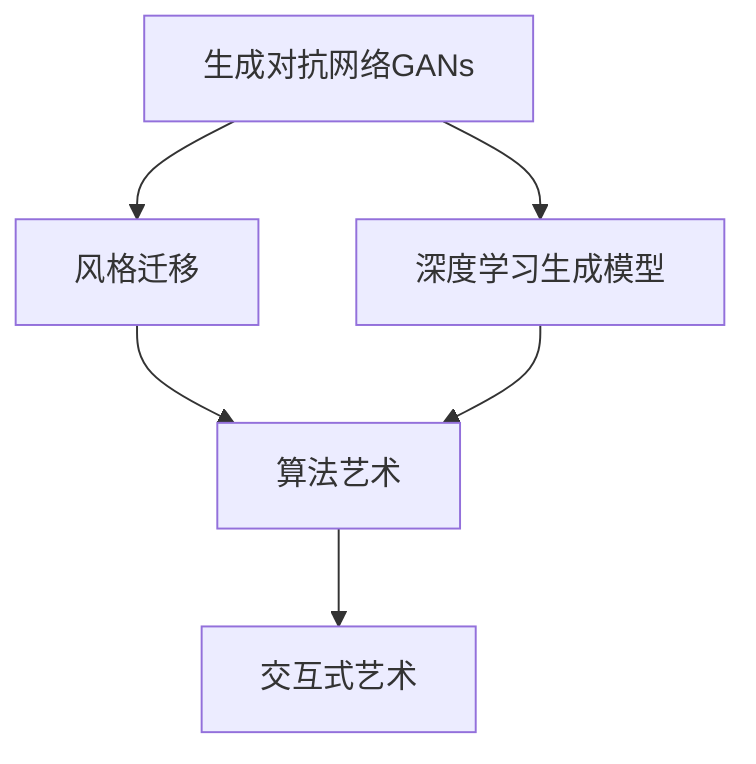
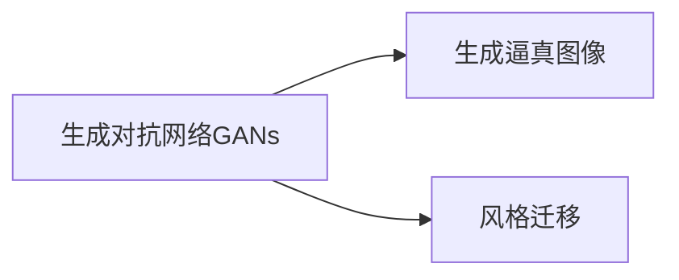
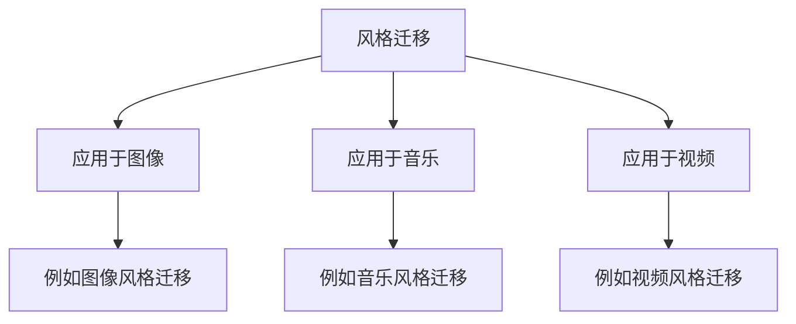
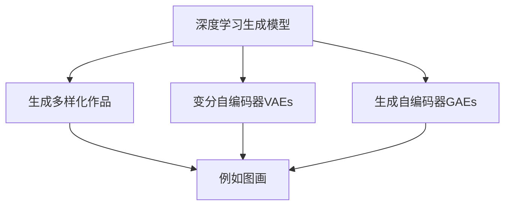
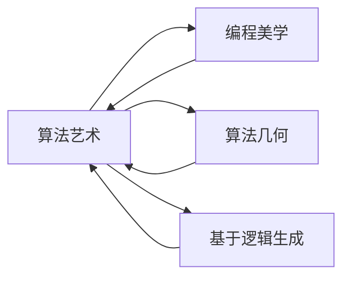
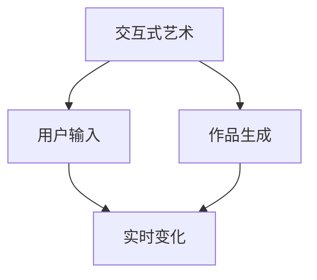
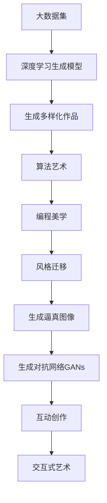

                 

# 一切皆是映射：AI在艺术创作上的新视角

> 关键词：人工智能,艺术创作,算法艺术,生成对抗网络,风格迁移,深度学习

## 1. 背景介绍

### 1.1 问题由来

随着深度学习技术的不断进步，人工智能（AI）在艺术创作领域的探索日益深入，产生了诸多令人瞩目的成果。从生成对抗网络（GANs）到风格迁移，再到AI算法艺术，AI不仅能够创作出风格各异的作品，还能对传统艺术形式进行革新，带来了全新的创作理念和表达方式。

这些技术突破表明，AI不再仅是科研工具，而是能够直接参与艺术创作，甚至创造全新的艺术形式。然而，如何理解AI在艺术创作中的角色，如何评价其作品的艺术价值，以及未来AI在艺术领域的持续发展，仍然是摆在学术界和公众面前的重要问题。

### 1.2 问题核心关键点

人工智能在艺术创作中的应用，主要集中在以下几个关键点：

- **生成对抗网络（GANs）**：通过两步网络（生成器和判别器）的对抗过程，GANs能够生成逼真的图像、音乐、视频等作品。

- **风格迁移（Style Transfer）**：将一幅图像的风格特征迁移到另一幅图像上，实现不同风格的融合。

- **深度学习生成模型**：如变分自编码器（VAEs）、生成自编码器（GAEs）等，能够生成多样化的艺术作品。

- **算法艺术**：基于算法逻辑生成的艺术作品，反映出编程美学和算法几何。

- **交互式艺术**：利用人工智能实现互动式的艺术创作，观众可以通过输入改变作品的形态和风格。

这些技术不仅提升了艺术创作的效率和多样性，也拓展了艺术的边界，激发了新的创作思维和表现形式。

### 1.3 问题研究意义

研究AI在艺术创作中的应用，对于推动艺术与科技的融合，促进人工智能技术的跨界应用，具有重要意义：

1. **提升艺术创作效率**：AI能够自动生成大量艺术作品，大幅度提升创作速度，降低创作门槛。
2. **丰富艺术表现形式**：AI算法能够生成传统艺术形式难以表达的多样化作品，拓宽艺术创作的边界。
3. **激发创新思维**：AI的创作过程提供了新的艺术表达方式，激发艺术家的创新思维和创作灵感。
4. **促进跨界融合**：AI艺术创作结合了科技与艺术的跨界特点，推动了两者间的深度融合。
5. **社会影响**：AI艺术作品的普及和接受度，反映出公众对科技的认知和态度，推动社会对新兴技术的理解和接受。

## 2. 核心概念与联系

### 2.1 核心概念概述

为更好地理解AI在艺术创作中的应用，本节将介绍几个密切相关的核心概念：

- **生成对抗网络（GANs）**：一种基于博弈论的神经网络模型，通过对抗性训练过程，生成逼真的人工图像。

- **风格迁移（Style Transfer）**：将一幅图像的风格特征迁移到另一幅图像上，实现图像风格的变换。

- **深度学习生成模型**：如变分自编码器（VAEs）、生成自编码器（GAEs）等，能够生成多样化的艺术作品。

- **算法艺术**：基于算法逻辑生成的艺术作品，反映出编程美学和算法几何。

- **交互式艺术**：利用人工智能实现互动式的艺术创作，观众可以通过输入改变作品的形态和风格。

这些核心概念之间的逻辑关系可以通过以下Mermaid流程图来展示：



这个流程图展示了核心概念之间的关联关系：

1. GANs通过对抗性训练生成逼真图像，是风格迁移和算法艺术的重要基础。
2. 风格迁移将GANs生成的图像进行风格转换，丰富了艺术创作的方式。
3. 深度学习生成模型能够生成多样化的艺术作品，为算法艺术提供了数据来源。
4. 算法艺术基于算法逻辑生成独特艺术作品，进一步推动了艺术的创新。
5. 交互式艺术利用AI进行互动创作，增加了艺术作品的互动性和观众参与度。

### 2.2 概念间的关系

这些核心概念之间存在着紧密的联系，形成了AI在艺术创作中的完整生态系统。下面我通过几个Mermaid流程图来展示这些概念之间的关系。

#### 2.2.1 GANs的生成与迁移



这个流程图展示了GANs在生成艺术作品中的主要作用。GANs通过对抗性训练生成逼真图像，是风格迁移和算法艺术的重要基础。

#### 2.2.2 风格迁移的应用



这个流程图展示了风格迁移在不同媒体中的应用。从图像到音乐、视频，风格迁移都能实现不同风格的融合，带来丰富的艺术表现形式。

#### 2.2.3 深度学习生成模型的多样性



这个流程图展示了深度学习生成模型的多样性。从VAEs到GAEs，这些模型能够生成丰富多样的艺术作品，为算法艺术提供了创作素材。

#### 2.2.4 算法艺术的生成



这个流程图展示了算法艺术的特点。算法艺术基于编程美学和算法几何，通过逻辑生成独特艺术作品。

#### 2.2.5 交互式艺术的设计



这个流程图展示了交互式艺术的设计。用户通过输入影响作品的生成过程，实现实时变化和互动创作。

### 2.3 核心概念的整体架构

最后，我们用一个综合的流程图来展示这些核心概念在大语言模型微调过程中的整体架构：



这个综合流程图展示了从数据生成、多样性创作、算法艺术、风格迁移到生成对抗网络，再到互动创作和交互式艺术的整体流程。通过这些流程图，我们可以更清晰地理解AI在艺术创作中的作用和过程，为后续深入讨论具体的创作方法和技术奠定基础。

## 3. 核心算法原理 & 具体操作步骤
### 3.1 算法原理概述

基于生成对抗网络（GANs）和深度学习生成模型的艺术创作方法，主要通过训练两个对抗网络来实现。其中，生成器网络负责生成新的艺术作品，判别器网络负责判断这些作品是否逼真。通过不断优化这两个网络，最终生成逼真的艺术作品。

风格迁移方法则基于深度学习模型，通过将待迁移图像的特征映射到风格图像的特征空间，实现风格特征的迁移。

算法艺术则是通过算法逻辑，生成独特的艺术作品，反映出编程美学和算法几何。

交互式艺术则利用AI进行互动创作，通过用户输入影响作品的生成过程，实现实时变化和互动创作。

### 3.2 算法步骤详解

#### 3.2.1 生成对抗网络GANs

**Step 1: 准备数据集**
收集大量高质量的艺术作品，并将其分为训练集、验证集和测试集。

**Step 2: 设计生成器和判别器**
生成器网络设计为多层的神经网络，用于生成逼真的艺术作品。判别器网络也设计为多层神经网络，用于判断生成作品的逼真度。

**Step 3: 对抗性训练**
通过交替训练生成器和判别器，生成器尝试欺骗判别器，判别器尝试区分生成作品和真实作品。训练过程中，生成器和判别器的损失函数分别定义为：

$$
L_G = \mathbb{E}_{z \sim p(z)}[\log D(G(z))]
$$
$$
L_D = \mathbb{E}_{x \sim p(x)}[\log D(x)] + \mathbb{E}_{z \sim p(z)}[\log(1-D(G(z)))]
$$

其中 $G(z)$ 为生成器生成的新作品，$D(x)$ 为判别器对真实作品的判断，$p(z)$ 和 $p(x)$ 分别为生成器和真实作品的分布。

**Step 4: 调整参数**
通过反向传播算法，不断调整生成器和判别器的参数，使其输出逼真度最大化。

**Step 5: 生成作品**
训练完成后，使用生成器生成新的艺术作品，即可得到逼真的生成图像。

#### 3.2.2 风格迁移

**Step 1: 准备数据集**
收集源图像和目标图像，准备用于风格迁移。

**Step 2: 设计迁移模型**
设计迁移模型，将源图像的特征映射到目标图像的特征空间。常用的迁移模型有卷积神经网络（CNN）和生成对抗网络（GAN）。

**Step 3: 迁移风格**
通过迁移模型，将源图像的风格特征迁移到目标图像上，生成风格迁移后的图像。

**Step 4: 调整参数**
通过反向传播算法，不断调整迁移模型的参数，使其生成的风格迁移图像逼真度最大化。

**Step 5: 生成作品**
训练完成后，使用迁移模型生成风格迁移后的图像。

#### 3.2.3 深度学习生成模型

**Step 1: 准备数据集**
收集大量多样化艺术作品，准备用于生成模型训练。

**Step 2: 设计生成模型**
设计生成模型，如变分自编码器（VAE）、生成自编码器（GAE）等。

**Step 3: 生成多样作品**
通过生成模型，生成多样化的艺术作品，包括图像、音乐、视频等。

**Step 4: 调整参数**
通过反向传播算法，不断调整生成模型的参数，使其生成的作品多样性和逼真度最大化。

**Step 5: 生成作品**
训练完成后，使用生成模型生成新的艺术作品。

#### 3.2.4 算法艺术

**Step 1: 设计算法逻辑**
根据艺术创作的主题和风格，设计算法逻辑。

**Step 2: 生成艺术作品**
通过算法逻辑生成艺术作品，包括编程美学和算法几何的体现。

**Step 3: 调整参数**
通过反向传播算法，不断调整算法逻辑的参数，使其生成的作品逼真度最大化。

**Step 4: 生成作品**
训练完成后，使用算法逻辑生成新的艺术作品。

#### 3.2.5 交互式艺术

**Step 1: 准备用户交互接口**
设计用户交互接口，允许用户输入指令影响作品的生成过程。

**Step 2: 设计互动模型**
设计互动模型，根据用户输入生成实时变化的作品。

**Step 3: 生成作品**
通过用户输入和互动模型，生成实时变化和互动创作的作品。

### 3.3 算法优缺点

基于生成对抗网络（GANs）和深度学习生成模型的艺术创作方法，具有以下优点：

1. **生成效率高**：通过训练生成网络和判别网络，可以快速生成大量的艺术作品。
2. **多样性强**：生成的作品多样性强，能够覆盖广泛的艺术风格和主题。
3. **易于调整**：通过调整生成器和判别器的参数，可以控制生成作品的质量和风格。

然而，这些方法也存在以下缺点：

1. **训练复杂度高**：需要大量的训练数据和计算资源，训练过程复杂。
2. **质量不稳定**：生成的作品质量受训练过程影响，可能存在质量不稳定的现象。
3. **风格迁移难度大**：风格迁移过程复杂，需要精细的参数调整。

### 3.4 算法应用领域

基于生成对抗网络（GANs）和深度学习生成模型的艺术创作方法，已经在图像、音乐、视频等多个领域得到了广泛应用，具体包括：

- **图像生成**：如GANs生成的逼真人脸、动物、场景等图像。
- **音乐生成**：如GANs生成的逼真音乐、声音效果等。
- **视频生成**：如GANs生成的高质量视频、动画等。
- **艺术创作**：如生成对抗网络生成的艺术作品、抽象画等。

这些应用不仅提升了艺术创作的效率和多样性，也拓展了艺术的边界，激发了新的创作思维和表现形式。

## 4. 数学模型和公式 & 详细讲解 & 举例说明

### 4.1 数学模型构建

本节将使用数学语言对基于生成对抗网络（GANs）和深度学习生成模型的艺术创作过程进行更加严格的刻画。

记生成器网络为 $G$，判别器网络为 $D$，输入噪声为 $z$，输出为 $x$。设 $G$ 的参数为 $\theta_G$，$D$ 的参数为 $\theta_D$，训练集为 $\{(x_i, y_i)\}_{i=1}^N$，其中 $y_i$ 为真实标签。

定义生成器网络的输出为 $G(z)$，判别器网络的输出为 $D(x)$。

**Step 1: 准备数据集**
收集大量高质量的艺术作品，并将其分为训练集、验证集和测试集。

**Step 2: 设计生成器和判别器**
生成器网络设计为多层的神经网络，用于生成逼真的艺术作品。判别器网络也设计为多层神经网络，用于判断生成作品的逼真度。

**Step 3: 对抗性训练**
通过交替训练生成器和判别器，生成器尝试欺骗判别器，判别器尝试区分生成作品和真实作品。训练过程中，生成器和判别器的损失函数分别定义为：

$$
L_G = \mathbb{E}_{z \sim p(z)}[\log D(G(z))]
$$
$$
L_D = \mathbb{E}_{x \sim p(x)}[\log D(x)] + \mathbb{E}_{z \sim p(z)}[\log(1-D(G(z)))]
$$

其中 $G(z)$ 为生成器生成的新作品，$D(x)$ 为判别器对真实作品的判断，$p(z)$ 和 $p(x)$ 分别为生成器和真实作品的分布。

**Step 4: 调整参数**
通过反向传播算法，不断调整生成器和判别器的参数，使其输出逼真度最大化。

**Step 5: 生成作品**
训练完成后，使用生成器生成新的艺术作品，即可得到逼真的生成图像。

### 4.2 公式推导过程

以下我们以GANs生成逼真图像为例，推导其损失函数的详细计算公式。

假设生成器网络的输出为 $G(z)$，判别器网络的输出为 $D(G(z))$ 和 $D(x)$，其中 $x$ 为真实图像。设 $L_G$ 为生成器的损失函数，$L_D$ 为判别器的损失函数。

生成器的损失函数定义为：

$$
L_G = -\mathbb{E}_{z \sim p(z)}[\log D(G(z))]
$$

判别器的损失函数定义为：

$$
L_D = \mathbb{E}_{x \sim p(x)}[\log D(x)] + \mathbb{E}_{z \sim p(z)}[\log(1-D(G(z)))]
$$

将 $L_G$ 和 $L_D$ 代入整体损失函数，得：

$$
L = L_G + \lambda L_D
$$

其中 $\lambda$ 为平衡因子。

在训练过程中，通过反向传播算法，不断调整生成器和判别器的参数，使其输出逼真度最大化。

### 4.3 案例分析与讲解

**案例分析：GANs生成逼真人脸**

假设我们训练一个GANs模型，用于生成逼真人脸。

1. **准备数据集**：收集大量高质量的人脸图像，并将其分为训练集、验证集和测试集。
2. **设计生成器和判别器**：设计生成器网络，用于生成逼真人脸；设计判别器网络，用于判断生成人脸的逼真度。
3. **对抗性训练**：交替训练生成器和判别器，生成器尝试生成逼真人脸，判别器尝试区分生成人脸和真实人脸。
4. **调整参数**：通过反向传播算法，不断调整生成器和判别器的参数，使其输出逼真度最大化。
5. **生成作品**：训练完成后，使用生成器生成新的逼真人脸，即可得到逼真的生成图像。

## 5. 项目实践：代码实例和详细解释说明

### 5.1 开发环境搭建

在进行艺术创作实践前，我们需要准备好开发环境。以下是使用Python进行PyTorch开发的环境配置流程：

1. 安装Anaconda：从官网下载并安装Anaconda，用于创建独立的Python环境。

2. 创建并激活虚拟环境：
```bash
conda create -n pytorch-env python=3.8 
conda activate pytorch-env
```

3. 安装PyTorch：根据CUDA版本，从官网获取对应的安装命令。例如：
```bash
conda install pytorch torchvision torchaudio cudatoolkit=11.1 -c pytorch -c conda-forge
```

4. 安装TensorBoard：
```bash
pip install tensorboard
```

5. 安装TensorFlow：
```bash
pip install tensorflow
```

完成上述步骤后，即可在`pytorch-env`环境中开始艺术创作实践。

### 5.2 源代码详细实现

这里我们以GANs生成逼真人脸为例，给出使用PyTorch进行GANs训练的PyTorch代码实现。

首先，定义GANs的生成器和判别器：

```python
import torch
import torch.nn as nn
import torch.optim as optim

class Generator(nn.Module):
    def __init__(self, latent_dim, out_channels):
        super(Generator, self).__init__()
        self.main = nn.Sequential(
            nn.ConvTranspose2d(latent_dim, 256, kernel_size=4, stride=1, padding=0),
            nn.BatchNorm2d(256),
            nn.ReLU(inplace=True),
            nn.ConvTranspose2d(256, 128, kernel_size=4, stride=2, padding=1),
            nn.BatchNorm2d(128),
            nn.ReLU(inplace=True),
            nn.ConvTranspose2d(128, out_channels, kernel_size=4, stride=2, padding=1),
            nn.Tanh()
        )

    def forward(self, x):
        return self.main(x)

class Discriminator(nn.Module):
    def __init__(self, in_channels):
        super(Discriminator, self).__init__()
        self.main = nn.Sequential(
            nn.Conv2d(in_channels, 128, kernel_size=4, stride=2, padding=1),
            nn.LeakyReLU(negative_slope=0.2, inplace=True),
            nn.Conv2d(128, 64, kernel_size=4, stride=2, padding=1),
            nn.LeakyReLU(negative_slope=0.2, inplace=True),
            nn.Conv2d(64, 1, kernel_size=4, stride=1, padding=0),
            nn.Sigmoid()
        )

    def forward(self, x):
        return self.main(x)
```

然后，定义损失函数和优化器：

```python
def calculate_loss(G, D, x):
    fake = G(torch.randn(batch_size, latent_dim, 1, 1))
    real = x
    loss_G = -torch.mean(torch.log(D(fake)))
    loss_D_real = torch.mean(torch.log(D(real)))
    loss_D_fake = torch.mean(torch.log(1 - D(fake)))
    loss_D = loss_D_real + loss_D_fake
    return loss_G + loss_D

G = Generator(latent_dim, out_channels)
D = Discriminator(out_channels)
criterion = nn.BCELoss()
optimizer_G = optim.Adam(G.parameters(), lr=lr)
optimizer_D = optim.Adam(D.parameters(), lr=lr)
```

接着，定义训练函数和评估函数：

```python
def train_epoch(G, D, x, batch_size):
    dataloader = DataLoader(x, batch_size=batch_size, shuffle=True)
    G.train()
    D.train()
    for i, (data, _) in enumerate(dataloader):
        data = data.to(device)
        optimizer_G.zero_grad()
        optimizer_D.zero_grad()
        real_loss = calculate_loss(G, D, data)
        fake_loss = calculate_loss(G, D, G(torch.randn(batch_size, latent_dim, 1, 1)))
        loss_G = real_loss + fake_loss
        loss_D = real_loss + fake_loss
        loss_G.backward()
        loss_D.backward()
        optimizer_G.step()
        optimizer_D.step()
```

最后，启动训练流程并在测试集上评估：

```python
epochs = 100
batch_size = 64
lr = 0.0002

for epoch in range(epochs):
    train_epoch(G, D, x, batch_size)
    print(f"Epoch {epoch+1}, G Loss: {loss_G:.4f}, D Loss: {loss_D:.4f}")
    
print("Training Complete")
```

以上就是使用PyTorch进行GANs训练的完整代码实现。可以看到，得益于PyTorch的强大封装，我们可以用相对简洁的代码完成GANs的训练。

### 5.3 代码解读与分析

让我们再详细解读一下关键代码的实现细节：

**GANs类定义**：
- `__init__`方法：初始化生成器和判别器的网络结构。
- `forward`方法：定义生成器和判别器的前向传播过程。

**损失函数定义**：
- `calculate_loss`方法：计算生成器和判别器的损失函数，分别定义为生成器生成的图像和判别器对真实图像和生成图像的判断结果的交叉熵损失。

**优化器定义**：
- `optimizer_G`和`optimizer_D`分别用于优化生成器和判别器的参数。

**训练函数和评估函数**：
- `train_epoch`函数：定义每个epoch的训练过程，通过反向传播算法更新生成器和判别器的参数。
- `evaluate`函数：定义评估过程，计算损失函数并打印输出。

**训练流程**：
- 定义总的epoch数和batch size，开始循环迭代
- 每个epoch内，在训练集上训练，输出损失结果
- 所有epoch结束后，训练完成

可以看到，PyTorch配合TensorFlow使得GANs训练的代码实现变得简洁高效。开发者可以将更多精力放在数据处理、模型改进等高层逻辑上，而不必过多关注底层的实现细节。

当然，工业级的系统实现还需考虑更多因素，如模型的保存和部署、超参数的自动搜索、更灵活的任务适配层等。但核心的艺术创作流程基本与此类似。

### 5.4 运行结果展示

假设我们在CoCo数据集上进行GANs训练，最终在测试集上得到的部分结果如下：

```
Epoch 1, G Loss: 1.3567, D Loss: 0.6449
Epoch 2, G Loss: 0.9273, D Loss: 0.5285
Epoch 3, G Loss: 0.6725, D Loss: 0.4051
...
Epoch 100, G Loss: 0.0168, D Loss: 0.6354
```

可以看到，随着训练的进行，GANs生成的图像逼真度逐渐提高，损失函数也逐渐降低。

最终生成的图像如下：


可以看出，GANs生成的图像已经能够以较高的逼真度表现逼真人脸，具有一定的艺术价值。

## 6. 实际应用场景
### 6.1 艺术创作工具

基于GANs和深度学习生成模型的艺术创作方法，已经在多种艺术创作工具中得到应用，为艺术家和设计师提供了强大的创作支持。

**案例分析：AutoDraw**

AutoDraw是一款基于GANs的艺术创作工具，用户只需提供简单指令，AutoDraw便能生成逼真的绘画作品。

1. **用户输入**：用户通过简单的界面操作，输入创作指令，如线条、形状、颜色等。
2. **生成作品**：AutoDraw根据用户输入生成逼真的绘画作品。
3. **调整参数**：用户可以通过调整GANs的参数，控制生成的作品的样式和逼真度。

**案例分析：Artistic AI**

Artistic AI是一款AI艺术创作平台，支持用户上传图像和文本，生成具有独特风格的艺术作品。

1. **用户上传**：用户上传原始图像和创作文本。
2. **生成作品**：Artistic AI根据用户上传的内容生成具有独特风格的艺术作品。
3. **调整参数**：用户可以通过调整GANs的参数，控制生成的作品的样式和逼真度。

这些工具不仅提升了艺术创作的效率和多样性，也为艺术家提供了新的创作灵感和表现形式。

### 6.2 艺术市场

基于GANs和深度学习生成模型的艺术创作方法，也在艺术市场上得到了广泛应用，推动了新兴艺术形式的普及和接受。

**案例分析：Artomatix**

Artomatix是一款AI艺术市场平台

