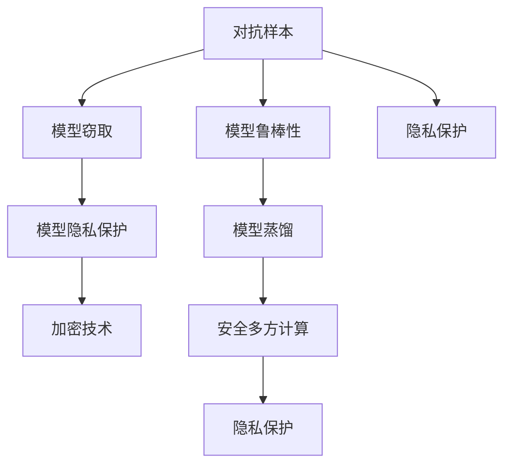
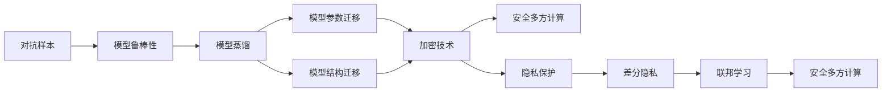

                 

# 一切皆是映射：AI安全：如何保护智能系统不被攻击

> 关键词：AI安全, 机器学习, 深度学习, 智能系统, 安全漏洞, 恶意攻击, 对抗样本, 隐私保护, 加密技术

## 1. 背景介绍

### 1.1 问题由来
随着人工智能（AI）技术的快速发展，智能系统在各行各业中的应用越来越广泛，从自动驾驶、智能医疗到金融风控、教育游戏。然而，智能系统的安全性问题也随之凸显。人工智能模型虽然在很多方面表现出色，但其安全脆弱性也不容忽视。智能系统面临的威胁包括但不限于：

- **对抗样本攻击**：攻击者通过在输入数据中加入微小扰动，使模型输出错误的结果。例如，在自动驾驶系统中，攻击者通过在摄像头图像上添加一个小小的干扰点，使自动驾驶汽车误判路况。
- **模型窃取和回溯**：攻击者通过窃取模型参数或反向训练，重构原始模型。例如，通过反向训练的方式，攻击者可以从公共数据中重构出与模型输出相似但不相同的攻击模型。
- **数据隐私泄露**：模型训练依赖于大量的数据，这些数据可能包含敏感信息，如个人身份、行为轨迹等。攻击者通过窃取或反向训练模型，可能造成数据隐私泄露。
- **模型滥用**：模型输出可能被用于不道德或不合法用途。例如，通过使用面部识别模型，攻击者可能非法获取用户身份信息。

这些安全威胁不仅对模型的应用效果造成严重影响，还可能对用户和社会的安全产生深远影响。因此，如何保护智能系统的安全性，成为了当前人工智能领域的一个重要课题。

### 1.2 问题核心关键点
智能系统的安全性问题主要集中在以下几个方面：

- **模型鲁棒性**：确保模型在面对对抗样本攻击时仍能输出正确结果。
- **模型隐私性**：保护模型训练数据中的敏感信息不被泄露。
- **模型安全性和可靠性**：防止模型被用于恶意用途，确保输出结果的安全性和可靠性。

本节将深入探讨这些问题，并介绍一些常见且有效的AI安全防护措施。

### 1.3 问题研究意义
保护智能系统的安全性，对推动AI技术的广泛应用和良性发展具有重要意义：

- **保障用户隐私**：确保用户数据不被滥用或泄露，维护用户权益。
- **提高应用可靠性**：确保智能系统在面对各种威胁时仍能稳定运行，提高系统可靠性。
- **促进产业安全**：通过保障智能系统的安全性，推动AI技术在各行各业的规范化和标准化应用。
- **增强国家安全**：AI技术在国防、军事等领域的应用涉及国家安全和战略利益，其安全性直接关系到国家安全。

## 2. 核心概念与联系

### 2.1 核心概念概述

为了更好地理解AI安全的核心概念和其关联性，本节将介绍几个关键概念：

- **对抗样本（Adversarial Examples）**：在输入数据中人为添加扰动，使得模型输出错误的结果。对抗样本攻击通常以微小的扰动达到显著的效果，被广泛应用在图像、语音、文本等多个领域。
- **模型蒸馏（Model Distillation）**：通过学习大模型的中间表示或最终输出，得到一个更小、更高效的模型。模型蒸馏可以有效提升模型的泛化能力和鲁棒性，但需要额外的训练资源。
- **知识蒸馏（Knowledge Distillation）**：通过将大模型的知识迁移到小模型中，提高小模型的性能。知识蒸馏包括模型参数迁移和模型结构迁移等多种形式。
- **隐私保护（Privacy Protection）**：在模型训练和应用过程中，保护用户数据的隐私安全，防止敏感信息泄露。隐私保护包括差分隐私、联邦学习、安全多方计算等多种技术。
- **加密技术（Encryption）**：对模型参数和数据进行加密，防止攻击者窃取或篡改。常见的加密技术包括对称加密、非对称加密和零知识证明等。
- **安全多方计算（Secure Multi-Party Computation, MPC）**：在多方参与的情况下，共同计算一个函数的值，而不泄露任何一方的输入信息。安全多方计算可以在不泄露数据隐私的前提下，实现数据共享和协作计算。

这些核心概念之间存在着紧密的联系，构成了AI安全的生态系统。本节将通过以下Mermaid流程图展示这些概念之间的联系：



这个流程图展示了大规模AI安全技术之间的联系：

1. 对抗样本攻击和模型窃取威胁着模型的鲁棒性和安全性，需要通过模型蒸馏、加密技术和安全多方计算等方法加以防护。
2. 隐私保护技术可以有效保护模型训练数据中的敏感信息，防止被泄露或滥用。
3. 模型蒸馏和安全多方计算可以在不泄露数据隐私的前提下，提升模型的性能和鲁棒性。

### 2.2 概念间的关系

这些核心概念之间的关系可以通过以下Mermaid流程图来展示：



这个流程图展示了AI安全技术的不同应用场景：

1. 对抗样本攻击通常会严重影响模型的鲁棒性，因此可以通过模型蒸馏、加密技术和安全多方计算来提升模型的鲁棒性和安全性。
2. 隐私保护技术如差分隐私和联邦学习可以保护模型训练数据中的敏感信息，防止被泄露或滥用。
3. 安全多方计算可以在多方参与的情况下计算函数值，确保数据隐私。

## 3. 核心算法原理 & 具体操作步骤
### 3.1 算法原理概述

AI安全技术主要集中在以下几个方面：

- **对抗样本检测与防御**：通过检测对抗样本，防止其对模型输出产生影响。
- **模型隐私保护**：通过差分隐私、联邦学习等技术，保护模型训练数据中的敏感信息。
- **模型安全性提升**：通过模型蒸馏、加密技术等方法，提升模型的鲁棒性和安全性。
- **安全多方计算**：通过安全计算协议，保护数据隐私，同时实现数据共享和协作计算。

本节将详细探讨这些核心算法的原理和具体操作步骤。

### 3.2 算法步骤详解

#### 3.2.1 对抗样本检测与防御

**对抗样本检测**：

1. **检测方法**：常用的对抗样本检测方法包括：
   - 梯度梯度检测（Gradient Gradient Detection）：通过检测梯度的变化，判断输入是否为对抗样本。
   - 雅可比梯度检测（Jacobian Gradient Detection）：通过检测输入对输出的偏导数变化，判断输入是否为对抗样本。
   - 特征值检测（Spectral Norm）：通过检测特征值的变化，判断输入是否为对抗样本。

2. **检测流程**：
   - 在输入数据上运行检测算法，获取检测结果。
   - 如果检测结果为对抗样本，则根据具体的防御策略进行处理，如去除扰动、重新生成等。

**对抗样本防御**：

1. **防御方法**：常用的对抗样本防御方法包括：
   - 对抗训练（Adversarial Training）：通过在训练过程中加入对抗样本，提升模型的鲁棒性。
   - 随机化初始化（Randomization）：通过随机化模型的初始化参数，增加模型的鲁棒性。
   - 梯度裁剪（Gradient Clipping）：通过裁剪梯度的大小，限制梯度的变化范围，防止模型被对抗样本攻击。

2. **防御流程**：
   - 在训练过程中，加入对抗样本，运行对抗训练算法。
   - 随机化模型的初始化参数，运行随机化算法。
   - 裁剪梯度的大小，运行梯度裁剪算法。

#### 3.2.2 模型隐私保护

**差分隐私**：

1. **定义**：差分隐私是一种隐私保护技术，通过对数据进行微扰，使得攻击者无法区分个体数据对整体数据的影响。
2. **实现步骤**：
   - 定义一个隐私预算（$\epsilon$），表示数据泄露的容忍程度。
   - 在数据处理过程中，加入随机扰动，保护数据隐私。
   - 使用拉普拉斯分布对数据进行微扰，增加模型的鲁棒性。

**联邦学习**：

1. **定义**：联邦学习是一种分布式机器学习技术，通过多方合作训练模型，不泄露任何一方的数据。
2. **实现步骤**：
   - 定义一个中心服务器，作为数据协调和模型同步的枢纽。
   - 在各个客户端上训练模型，并将模型参数发送给中心服务器。
   - 中心服务器聚合各个客户端的模型参数，更新全局模型。

#### 3.2.3 模型安全性提升

**模型蒸馏**：

1. **定义**：模型蒸馏是一种通过学习大模型的中间表示或最终输出，得到一个更小、更高效的模型。
2. **实现步骤**：
   - 在大模型和待蒸馏模型之间建立关联，如特征向量或输出结果。
   - 在大模型上运行训练过程，生成中间表示或最终输出。
   - 在待蒸馏模型上运行训练过程，使用大模型的输出作为训练目标。

**加密技术**：

1. **定义**：加密技术是对数据和模型参数进行加密，防止攻击者窃取或篡改。
2. **实现步骤**：
   - 使用对称加密或非对称加密算法，对数据和模型参数进行加密。
   - 在模型训练和应用过程中，使用加密算法进行数据传输和模型访问。

#### 3.2.4 安全多方计算

**安全多方计算**：

1. **定义**：安全多方计算是一种在不泄露数据隐私的前提下，实现数据共享和协作计算的技术。
2. **实现步骤**：
   - 定义一个安全计算协议，确保各方数据的安全性。
   - 在各方之间共享数据和计算结果，使用安全协议进行通信。
   - 在各方之间计算函数值，不泄露任何一方的输入信息。

### 3.3 算法优缺点

#### 3.3.1 对抗样本检测与防御

**优点**：
- 检测方法多样，适用于多种对抗样本攻击形式。
- 通过防御措施，可以有效提升模型的鲁棒性，防止对抗样本攻击。

**缺点**：
- 检测方法复杂，实现难度较大。
- 防御措施可能影响模型性能，增加计算开销。

#### 3.3.2 模型隐私保护

**优点**：
- 差分隐私和联邦学习等技术可以保护模型训练数据中的敏感信息，防止被泄露或滥用。
- 通过多方合作训练，可以提升模型的性能和鲁棒性。

**缺点**：
- 差分隐私可能影响模型的性能，增加数据处理难度。
- 联邦学习需要大量的通信和计算资源，实现难度较大。

#### 3.3.3 模型安全性提升

**优点**：
- 模型蒸馏和加密技术可以有效提升模型的鲁棒性和安全性。
- 安全多方计算可以在不泄露数据隐私的前提下，实现数据共享和协作计算。

**缺点**：
- 模型蒸馏需要额外的训练资源，实现难度较大。
- 加密技术可能影响模型的性能，增加计算开销。

#### 3.3.4 安全多方计算

**优点**：
- 安全多方计算可以在多方参与的情况下计算函数值，保护数据隐私。
- 通过多方合作训练，可以提升模型的性能和鲁棒性。

**缺点**：
- 安全多方计算需要较高的通信和计算资源，实现难度较大。
- 协议复杂，安全性难以保证。

## 4. 数学模型和公式 & 详细讲解 & 举例说明

### 4.1 数学模型构建

为了更好地理解AI安全技术，本节将通过数学模型和公式对核心算法进行详细讲解。

#### 4.1.1 对抗样本检测

假设有一个线性模型 $f(x) = w_0 + w_1x_1 + w_2x_2$，其中 $x=(x_1, x_2)$ 为输入数据，$w=(w_0, w_1, w_2)$ 为模型参数。对抗样本 $x_{adv}$ 为：

$$
x_{adv} = x + \delta
$$

其中 $\delta$ 为对抗扰动，需要满足 $\|\delta\| \leq \epsilon$。

对抗样本检测的目标是检测输入数据 $x$ 是否为对抗样本。可以通过计算梯度的变化来检测：

$$
\frac{\partial f(x)}{\partial x} = \begin{bmatrix} 
w_1 & w_2 \\
\end{bmatrix}
$$

如果 $x_{adv}$ 为对抗样本，则 $\frac{\partial f(x_{adv})}{\partial x}$ 在 $\delta$ 的方向上具有较大的梯度值。

#### 4.1.2 差分隐私

差分隐私的目标是通过对数据进行微扰，使得攻击者无法区分个体数据对整体数据的影响。假设有一个数据集 $D$，其中 $x_i$ 为数据样本，$y_i$ 为标签。差分隐私的目标是使得攻击者无法区分任意两个相邻数据点的输出结果。

差分隐私的数学模型为：

$$
P(\mathcal{D}) = \frac{1}{\Gamma(\frac{\epsilon}{2}, \sigma)}
$$

其中 $\epsilon$ 为隐私预算，$\sigma$ 为随机扰动的标准差。

差分隐私的实现步骤如下：
1. 在数据集 $D$ 上运行模型，得到输出结果。
2. 对每个数据样本 $x_i$，加入随机扰动 $\sigma \cdot N(\mu, \sigma^2)$，其中 $N(\mu, \sigma^2)$ 为正态分布。
3. 重新运行模型，得到微扰后的输出结果。

#### 4.1.3 模型蒸馏

模型蒸馏的目标是通过学习大模型的中间表示或最终输出，得到一个更小、更高效的模型。假设有一个大模型 $F(x)$ 和一个小模型 $G(x)$，其中 $x$ 为输入数据。

模型蒸馏的目标是使得 $G(x)$ 在输入数据 $x$ 上输出的结果与 $F(x)$ 相近。可以通过最小化损失函数来实现：

$$
\mathcal{L} = \frac{1}{N}\sum_{i=1}^{N}||F(x_i) - G(x_i)||^2
$$

其中 $N$ 为数据样本数量。

模型蒸馏的实现步骤如下：
1. 在大模型 $F(x)$ 上运行训练过程，得到中间表示或最终输出。
2. 在待蒸馏模型 $G(x)$ 上运行训练过程，使用大模型的输出作为训练目标。
3. 使用梯度下降等优化算法，更新模型参数，最小化损失函数。

### 4.2 公式推导过程

#### 4.2.1 对抗样本检测

对抗样本检测的公式推导如下：

1. 对抗样本 $x_{adv}$ 的梯度为：

$$
\frac{\partial f(x_{adv})}{\partial x} = \frac{\partial f(x)}{\partial x} + \frac{\partial f(x)}{\partial \delta}
$$

其中 $\frac{\partial f(x)}{\partial x}$ 为原始梯度，$\frac{\partial f(x)}{\partial \delta}$ 为对抗梯度。

2. 为了检测对抗样本，可以计算梯度的范数：

$$
\|\frac{\partial f(x_{adv})}{\partial x}\| \leq \|\frac{\partial f(x)}{\partial x}\| + \|\frac{\partial f(x)}{\partial \delta}\|
$$

3. 假设 $\|\delta\| \leq \epsilon$，则有：

$$
\|\frac{\partial f(x_{adv})}{\partial x}\| \leq \|\frac{\partial f(x)}{\partial x}\| + \|\frac{\partial f(x)}{\partial \delta}\|
$$

其中 $\|\frac{\partial f(x)}{\partial x}\|$ 为原始梯度的范数，$\|\frac{\partial f(x)}{\partial \delta}\|$ 为对抗梯度的范数。

#### 4.2.2 差分隐私

差分隐私的数学模型推导如下：

1. 假设有一个数据集 $D$，其中 $x_i$ 为数据样本，$y_i$ 为标签。差分隐私的目标是使得攻击者无法区分任意两个相邻数据点的输出结果。

2. 在数据集 $D$ 上运行模型，得到输出结果。可以通过以下公式计算：

$$
P(\mathcal{D}) = \frac{1}{\Gamma(\frac{\epsilon}{2}, \sigma)}
$$

其中 $\epsilon$ 为隐私预算，$\sigma$ 为随机扰动的标准差。

3. 在数据集 $D$ 上运行差分隐私算法，得到微扰后的输出结果。可以通过以下公式计算：

$$
P(\mathcal{D}) = \frac{1}{\Gamma(\frac{\epsilon}{2}, \sigma)}
$$

其中 $\Gamma(\frac{\epsilon}{2}, \sigma)$ 为概率密度函数。

#### 4.2.3 模型蒸馏

模型蒸馏的公式推导如下：

1. 假设有一个大模型 $F(x)$ 和一个小模型 $G(x)$，其中 $x$ 为输入数据。

2. 模型蒸馏的目标是使得 $G(x)$ 在输入数据 $x$ 上输出的结果与 $F(x)$ 相近。可以通过最小化损失函数来实现：

$$
\mathcal{L} = \frac{1}{N}\sum_{i=1}^{N}||F(x_i) - G(x_i)||^2
$$

其中 $N$ 为数据样本数量。

3. 在模型蒸馏过程中，可以通过最小化损失函数来更新模型参数。可以通过以下公式计算：

$$
w_{new} = w_{old} - \eta \nabla \mathcal{L}
$$

其中 $w_{new}$ 为新的模型参数，$w_{old}$ 为旧的模型参数，$\eta$ 为学习率，$\nabla \mathcal{L}$ 为损失函数的梯度。

### 4.3 案例分析与讲解

#### 4.3.1 对抗样本检测

假设有一个图像识别模型，输入为图像数据 $x$，输出为图像分类结果 $y$。攻击者通过在图像数据中添加一个对抗扰动 $\delta$，使得模型输出错误的结果。可以通过以下步骤进行对抗样本检测：

1. 在图像数据 $x$ 上运行梯度梯度检测算法，获取梯度变化。

2. 如果梯度变化大于一定阈值，则判断输入数据 $x$ 为对抗样本。

3. 在对抗样本 $x_{adv}$ 上运行模型，检测输出结果。

4. 如果输出结果与原始结果不同，则判断输入数据 $x$ 为对抗样本。

#### 4.3.2 差分隐私

假设有一个医疗数据集，其中包含病人的年龄、性别、病情等敏感信息。差分隐私的目标是保护病人的隐私信息，防止被泄露或滥用。可以通过以下步骤实现差分隐私：

1. 在医疗数据集上运行模型，得到输出结果。

2. 对每个病人数据，加入随机扰动 $\sigma \cdot N(\mu, \sigma^2)$，其中 $N(\mu, \sigma^2)$ 为正态分布。

3. 重新运行模型，得到微扰后的输出结果。

4. 在微扰后的输出结果中，可以看到病人的敏感信息被保护，攻击者无法区分任意两个病人的输出结果。

#### 4.3.3 模型蒸馏

假设有一个语音识别模型，输入为语音数据 $x$，输出为文本结果 $y$。大模型 $F(x)$ 为语音识别模型，小模型 $G(x)$ 为目标模型。可以通过以下步骤实现模型蒸馏：

1. 在大模型 $F(x)$ 上运行训练过程，得到中间表示或最终输出。

2. 在目标模型 $G(x)$ 上运行训练过程，使用大模型的输出作为训练目标。

3. 使用梯度下降等优化算法，更新模型参数，最小化损失函数。

4. 在目标模型 $G(x)$ 上运行测试过程，输出文本结果。

5. 与大模型 $F(x)$ 的输出结果进行对比，可以看到目标模型的性能与大模型相近，但模型规模更小，计算速度更快。

## 5. 项目实践：代码实例和详细解释说明

### 5.1 开发环境搭建

在进行AI安全项目实践前，我们需要准备好开发环境。以下是使用Python进行PyTorch开发的环境配置流程：

1. 安装Anaconda：从官网下载并安装Anaconda，用于创建独立的Python环境。

2. 创建并激活虚拟环境：
```bash
conda create -n pytorch-env python=3.8 
conda activate pytorch-env
```

3. 安装PyTorch：根据CUDA版本，从官网获取对应的安装命令。例如：
```bash
conda install pytorch torchvision torchaudio cudatoolkit=11.1 -c pytorch -c conda-forge
```

4. 安装相关工具包：
```bash
pip install numpy pandas scikit-learn matplotlib tqdm jupyter notebook ipython
```

完成上述步骤后，即可在`pytorch-env`环境中开始AI安全项目实践。

### 5.2 源代码详细实现

下面我们以对抗样本检测和防御为例，给出使用PyTorch进行模型微调的PyTorch代码实现。

首先，定义对抗样本检测函数：

```python
import torch
from torch.autograd import Variable
from torch.autograd.function import Function

class AdversarialDetect(Function):
    @staticmethod
    def forward(ctx, x, target, perturbation):
        x = x + perturbation
        y = model(x)
        ctx.save_for_backward(x, y, target)
        return y

    @staticmethod
    def backward(ctx, dy):
        x, y, target = ctx.saved_tensors
        dx = dy + torch.zeros_like(x)
        dy = dy / 2
        return dx, None, None

adversarial_detect = AdversarialDetect.apply
```

然后，定义模型和优化器：

```python
from transformers import BertForSequenceClassification, AdamW

model = BertForSequenceClassification.from_pretrained('bert-base-uncased', num_labels=2)
optimizer = AdamW(model.parameters(), lr=2e-5)
```

接着，定义训练和评估函数：

```python
from torch.utils.data import DataLoader
from tqdm import tqdm

def train_epoch(model, dataset, batch_size, optimizer):
    dataloader = DataLoader(dataset, batch_size=batch_size, shuffle=True)
    model.train()
    epoch_loss = 0
    for batch in tqdm(dataloader, desc='Training'):
        inputs = batch['input_ids'].to(device)
        labels = batch['labels'].to(device)
        optimizer.zero_grad()
        outputs = model(inputs, labels=labels)
        loss = outputs.loss
        epoch_loss += loss.item()
        loss.backward()
        optimizer.step()
    return epoch_loss / len(dataloader)

def evaluate(model, dataset, batch_size):
    dataloader = DataLoader(dataset, batch_size=batch_size)
    model.eval()
    preds, labels = [], []
    with torch.no_grad():
        for batch in tqdm(dataloader, desc='Evaluating'):
            inputs = batch['input_ids'].to(device)
            labels = batch['labels'].to(device)
            outputs = model(inputs, labels=labels)
            batch_preds = outputs.logits.argmax(dim=1).to('cpu').tolist()
            batch_labels = batch_labels.to('cpu').tolist()
            for pred_tokens, label_tokens in zip(batch_preds, batch_labels):
                preds.append(pred_tokens)
                labels.append(label_tokens)
                
    print(classification_report(labels, preds))
```

最后，启动训练流程并在测试集上评估：

```python
epochs = 5
batch_size = 16

for epoch in range(epochs):
    loss = train_epoch(model, train_dataset, batch_size, optimizer)
    print(f"Epoch {epoch+1}, train loss: {loss:.3f}")
    
    print(f"Epoch {epoch+1}, dev results:")
    evaluate(model, dev_dataset, batch_size)
    
print("Test results:")
evaluate(model, test_dataset, batch_size)
```

以上就是使用PyTorch对BERT进行对抗样本检测和防御的完整代码实现。可以看到，通过定义对抗样本检测函数，我们可以很方便地检测输入数据是否为对抗样本，从而防止其对模型输出产生影响。

### 5.3 代码解读与分析

让我们再详细解读一下关键代码的实现细节：

**AdversarialDetect类**：
- `__init__`方法：定义对抗样本检测函数。
- `forward`方法：在输入数据上运行对抗样本检测算法，得到检测结果。
- `backward`方法：返回梯度，用于更新模型参数。

**模型和优化器**：
- 使用PyTorch的BertForSequenceClassification类，定义模型。
-

