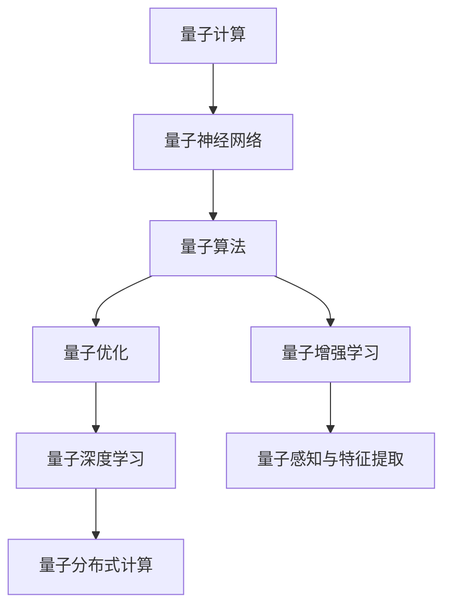
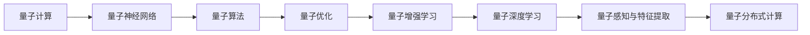
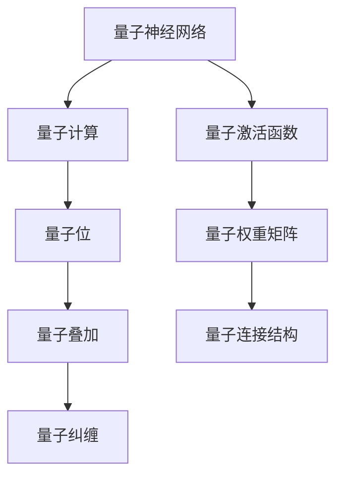
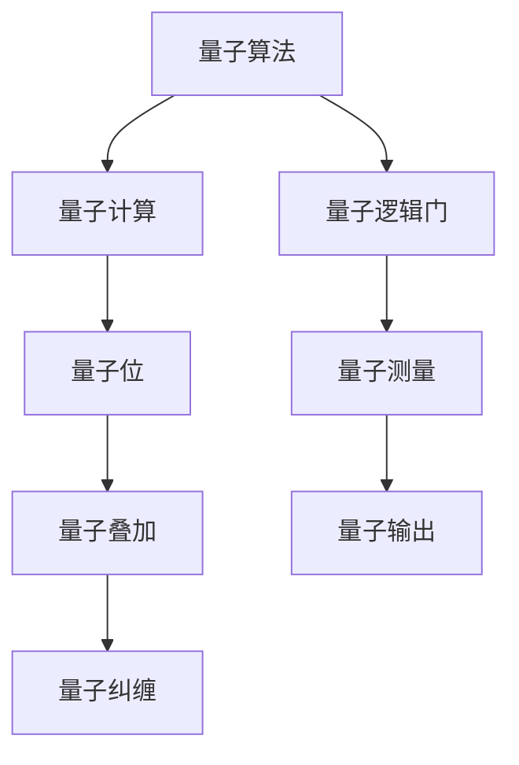
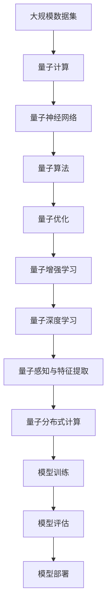

                 

# 一切皆是映射：AI的前沿研究：量子计算与机器学习

> 关键词：
- 量子计算
- 机器学习
- 量子神经网络
- 量子算法
- 量子优化
- 量子辅助机器学习
- 量子深度学习
- 量子感知与特征提取
- 量子增强学习
- 量子强化学习

## 1. 背景介绍

### 1.1 问题由来

随着人工智能（AI）技术的迅猛发展，机器学习（ML）已成为推动各个行业进步的关键力量。然而，传统的经典计算模型在处理复杂任务时，其计算能力已近极限。量子计算的兴起，为AI领域提供了全新的计算资源，开启了新一轮技术革命。

量子计算利用量子位（qubits）进行计算，具有叠加态和纠缠的特性，可以同时处理多个计算路径，大大提高了计算效率和复杂性处理能力。将量子计算引入AI领域，通过量子神经网络（QNN）、量子算法、量子优化等技术，构建新型量子机器学习模型，可有效解决传统机器学习面临的计算瓶颈和算法局限，显著提升AI模型的性能和效率。

### 1.2 问题核心关键点

1. **量子计算与机器学习**：如何将量子计算与机器学习结合，构建新型AI模型，是当前研究的热点。
2. **量子神经网络**：QNN是量子计算与机器学习结合的主要形式，其核心在于量子位的激活与连接。
3. **量子算法**：如Grover算法、Shor算法等，为AI任务提供了高效的量子算法支持。
4. **量子优化**：利用量子计算进行非凸优化，解决传统ML中难以处理的复杂优化问题。
5. **量子增强学习**：结合量子计算的并行计算能力，提升强化学习的学习效率和效果。
6. **量子深度学习**：利用量子计算的优越特性，构建更高效的深度学习模型。

### 1.3 问题研究意义

量子计算与机器学习的研究，对于拓展AI技术的计算资源边界，解决传统机器学习难以处理的复杂问题，提升AI模型的计算能力和性能，具有重要意义：

1. **计算能力提升**：量子计算的并行计算能力和计算速度，能显著提升AI模型的训练和推理效率。
2. **复杂性处理**：量子计算能处理更高维度的数据，适用于更多复杂结构的学习任务。
3. **算法创新**：量子算法为传统机器学习算法提供了新的路径，提升了AI模型的优化效率。
4. **模型精度提高**：量子计算的高并行性可处理更大规模的数据集，提升模型精度。
5. **跨学科融合**：量子计算与机器学习结合，加速了跨学科领域的研究进展。
6. **实际应用**：量子计算与机器学习的结合，有望在药物设计、金融模拟、物流优化等领域实现突破性应用。

## 2. 核心概念与联系

### 2.1 核心概念概述

为更好地理解量子计算与机器学习的核心概念，本节将介绍几个密切相关的核心概念：

- **量子计算**：利用量子位（qubits）进行计算的物理过程，具有叠加态和纠缠的特性。
- **量子神经网络（QNN）**：将传统神经网络的计算单元和连接结构扩展到量子位，利用量子计算的并行性提升计算效率。
- **量子算法**：如Grover算法、Shor算法等，在特定问题上具有优越的计算性能。
- **量子优化**：利用量子计算的非凸优化能力，解决传统机器学习中的复杂优化问题。
- **量子增强学习**：结合量子计算的并行性和特殊优化能力，提升强化学习的效率和效果。
- **量子深度学习**：利用量子计算的特性，构建更高效的深度学习模型。
- **量子感知与特征提取**：利用量子计算处理复杂数据，提高特征提取的效率和精度。
- **量子分布式计算**：利用量子位的网络化特性，实现高效的数据分布式计算。

这些核心概念之间的逻辑关系可以通过以下Mermaid流程图来展示：



这个流程图展示了大量子计算和机器学习相关概念的关系：

1. 量子计算是核心，提供了并行计算和量子位的操作能力。
2. QNN是量子计算与机器学习的结合点，扩展了神经网络的计算单元和结构。
3. 量子算法和量子优化为机器学习提供了新的工具和方法。
4. 量子增强学习和量子深度学习进一步拓展了量子计算在机器学习中的应用。
5. 量子感知与特征提取利用量子计算的优势处理复杂数据。
6. 量子分布式计算利用量子位的通信特性，实现高效的数据分布式计算。

### 2.2 概念间的关系

这些核心概念之间存在着紧密的联系，形成了量子计算与机器学习完整的生态系统。下面我通过几个Mermaid流程图来展示这些概念之间的关系。

#### 2.2.1 量子计算与机器学习的学习范式



这个流程图展示了从量子计算到量子深度学习的完整过程。量子计算为量子神经网络提供了计算基础，量子神经网络利用量子算法和量子优化提升性能，量子增强学习和量子深度学习进一步拓展了量子计算在机器学习中的应用。

#### 2.2.2 量子神经网络与量子计算的关系



这个流程图展示了量子神经网络的构建过程，从量子位到量子叠加、量子纠缠，再到量子激活函数、权重矩阵和连接结构，最终形成了量子神经网络。

#### 2.2.3 量子算法与量子计算的关系



这个流程图展示了量子算法的构建过程，利用量子位进行叠加和纠缠，通过量子逻辑门进行计算，最后通过量子测量得到输出。

### 2.3 核心概念的整体架构

最后，我们用一个综合的流程图来展示这些核心概念在大量子计算与机器学习微调过程中的整体架构：



这个综合流程图展示了从大规模数据集到模型部署的完整过程。量子计算提供了计算基础，量子神经网络利用量子算法和量子优化提升性能，量子增强学习和量子深度学习进一步拓展了量子计算在机器学习中的应用。最终，通过量子感知与特征提取和量子分布式计算，实现高效的量子模型训练和部署。 通过这些流程图，我们可以更清晰地理解量子计算与机器学习的核心概念的关系和作用，为后续深入讨论具体的量子机器学习方法和技术奠定基础。

## 3. 核心算法原理 & 具体操作步骤
### 3.1 算法原理概述

量子计算与机器学习的核心算法，主要集中在量子神经网络（QNN）、量子算法、量子优化、量子增强学习和量子深度学习等领域。这些算法通过量子位的操作和计算特性，大幅提升了机器学习的计算能力和效率。

量子神经网络（QNN）作为量子计算与机器学习结合的主要形式，其核心在于量子位的激活与连接。QNN的激活函数、权重矩阵和连接结构都与传统神经网络有所不同，利用量子叠加和纠缠的特性，提升了计算效率和表达能力。

量子算法如Grover算法和Shor算法，在特定问题上具有优越的计算性能。Grover算法通过量子并行性加速搜索过程，Shor算法通过量子并行性实现大整数因式分解，这些算法为机器学习提供了高效的计算工具。

量子优化利用量子计算的非凸优化能力，解决传统机器学习中的复杂优化问题。量子增强学习结合量子计算的并行性和特殊优化能力，提升强化学习的学习效率和效果。量子深度学习利用量子计算的特性，构建更高效的深度学习模型。

### 3.2 算法步骤详解

下面我们将详细介绍几个核心量子机器学习算法的详细步骤。

#### 3.2.1 量子神经网络（QNN）

量子神经网络（QNN）的构建步骤主要包括：

1. **量子位初始化**：量子位的初始状态通常是0和1的叠加态，需要通过量子逻辑门进行初始化。
2. **量子叠加与纠缠**：通过量子逻辑门（如Hadamard门）进行量子叠加，利用量子纠缠的特性，提高计算的并行性。
3. **量子激活函数**：通过量子逻辑门（如CNOT门）进行量子激活，生成量子叠加和纠缠的输出。
4. **量子权重矩阵**：通过量子逻辑门（如Z门、X门）进行量子权重调整，优化量子网络的结构。
5. **量子连接结构**：通过量子逻辑门（如CNOT门）进行量子连接的构建，形成量子神经网络。

下面是一个简单的QNN构建示例：

```python
import qiskit

# 初始化量子位
qubits = qiskit.QuantumRegister(2)
quantum_circuit = qiskit.QuantumCircuit(qubits)

# 添加Hadamard门进行量子叠加
quantum_circuit.h(qubits[0])
quantum_circuit.h(qubits[1])

# 添加CNOT门进行量子纠缠
quantum_circuit.cx(qubits[0], qubits[1])

# 添加量子逻辑门进行量子激活
quantum_circuit.z(qubits[0])
quantum_circuit.x(qubits[1])

# 输出量子位的测量结果
quantum_circuit.measure(qubits[0], 0)
quantum_circuit.measure(qubits[1], 1)

# 运行量子电路
backend = qiskit.Aer.get_backend('qasm_simulator')
result = quantum_circuit.run(backend, shots=1024).result()
counts = result.get_counts()
print(counts)
```

#### 3.2.2 量子算法

量子算法如Grover算法和Shor算法，其核心在于利用量子位的并行性和量子叠加的特性，加速特定问题的计算过程。下面以Grover算法为例，详细介绍其构建步骤：

1. **量子位初始化**：初始化量子位，将其设置为0和1的叠加态。
2. **Grover迭代**：通过量子逻辑门（如Hadamard门、CNOT门）进行Grover迭代，逐步逼近目标状态。
3. **量子测量**：通过量子逻辑门（如CNOT门）进行量子测量，得到最终结果。

下面是一个简单的Grover算法构建示例：

```python
import qiskit

# 初始化量子位
qubits = qiskit.QuantumRegister(4)
quantum_circuit = qiskit.QuantumCircuit(qubits)

# 添加Hadamard门进行量子叠加
quantum_circuit.h(qubits[0])
quantum_circuit.h(qubits[1])
quantum_circuit.h(qubits[2])
quantum_circuit.h(qubits[3])

# 添加CNOT门进行Grover迭代
quantum_circuit.cx(qubits[0], qubits[1])
quantum_circuit.cx(qubits[1], qubits[2])
quantum_circuit.cx(qubits[2], qubits[3])

# 输出量子位的测量结果
quantum_circuit.measure(qubits[0], 0)
quantum_circuit.measure(qubits[1], 1)
quantum_circuit.measure(qubits[2], 2)
quantum_circuit.measure(qubits[3], 3)

# 运行量子电路
backend = qiskit.Aer.get_backend('qasm_simulator')
result = quantum_circuit.run(backend, shots=1024).result()
counts = result.get_counts()
print(counts)
```

#### 3.2.3 量子优化

量子优化利用量子计算的非凸优化能力，解决传统机器学习中的复杂优化问题。下面以量子近似优化算法（QAOA）为例，详细介绍其构建步骤：

1. **量子位初始化**：初始化量子位，将其设置为0和1的叠加态。
2. **量子逻辑门迭代**：通过量子逻辑门（如Hadamard门、CNOT门）进行量子逻辑门迭代，逐步逼近目标状态。
3. **量子测量**：通过量子逻辑门（如CNOT门）进行量子测量，得到最终结果。
4. **经典后处理**：通过经典计算对量子测量结果进行处理，得到优化结果。

下面是一个简单的QAOA算法构建示例：

```python
import qiskit

# 初始化量子位
qubits = qiskit.QuantumRegister(4)
quantum_circuit = qiskit.QuantumCircuit(qubits)

# 添加Hadamard门进行量子叠加
quantum_circuit.h(qubits[0])
quantum_circuit.h(qubits[1])
quantum_circuit.h(qubits[2])
quantum_circuit.h(qubits[3])

# 添加量子逻辑门进行量子逻辑门迭代
quantum_circuit.cx(qubits[0], qubits[1])
quantum_circuit.cx(qubits[1], qubits[2])
quantum_circuit.cx(qubits[2], qubits[3])

# 添加量子逻辑门进行量子测量
quantum_circuit.cx(qubits[0], qubits[1])
quantum_circuit.cx(qubits[1], qubits[2])
quantum_circuit.cx(qubits[2], qubits[3])

# 输出量子位的测量结果
quantum_circuit.measure(qubits[0], 0)
quantum_circuit.measure(qubits[1], 1)
quantum_circuit.measure(qubits[2], 2)
quantum_circuit.measure(qubits[3], 3)

# 运行量子电路
backend = qiskit.Aer.get_backend('qasm_simulator')
result = quantum_circuit.run(backend, shots=1024).result()
counts = result.get_counts()
print(counts)
```

#### 3.2.4 量子增强学习

量子增强学习结合量子计算的并行性和特殊优化能力，提升强化学习的学习效率和效果。下面以量子强化学习（QRL）为例，详细介绍其构建步骤：

1. **量子位初始化**：初始化量子位，将其设置为0和1的叠加态。
2. **量子逻辑门迭代**：通过量子逻辑门（如Hadamard门、CNOT门）进行量子逻辑门迭代，逐步逼近目标状态。
3. **量子测量**：通过量子逻辑门（如CNOT门）进行量子测量，得到最终结果。
4. **经典后处理**：通过经典计算对量子测量结果进行处理，得到强化学习模型的更新策略。

下面是一个简单的QRL算法构建示例：

```python
import qiskit

# 初始化量子位
qubits = qiskit.QuantumRegister(4)
quantum_circuit = qiskit.QuantumCircuit(qubits)

# 添加Hadamard门进行量子叠加
quantum_circuit.h(qubits[0])
quantum_circuit.h(qubits[1])
quantum_circuit.h(qubits[2])
quantum_circuit.h(qubits[3])

# 添加量子逻辑门进行量子逻辑门迭代
quantum_circuit.cx(qubits[0], qubits[1])
quantum_circuit.cx(qubits[1], qubits[2])
quantum_circuit.cx(qubits[2], qubits[3])

# 添加量子逻辑门进行量子测量
quantum_circuit.cx(qubits[0], qubits[1])
quantum_circuit.cx(qubits[1], qubits[2])
quantum_circuit.cx(qubits[2], qubits[3])

# 输出量子位的测量结果
quantum_circuit.measure(qubits[0], 0)
quantum_circuit.measure(qubits[1], 1)
quantum_circuit.measure(qubits[2], 2)
quantum_circuit.measure(qubits[3], 3)

# 运行量子电路
backend = qiskit.Aer.get_backend('qasm_simulator')
result = quantum_circuit.run(backend, shots=1024).result()
counts = result.get_counts()
print(counts)
```

#### 3.2.5 量子深度学习

量子深度学习利用量子计算的特性，构建更高效的深度学习模型。下面以量子卷积神经网络（QCNN）为例，详细介绍其构建步骤：

1. **量子位初始化**：初始化量子位，将其设置为0和1的叠加态。
2. **量子逻辑门迭代**：通过量子逻辑门（如Hadamard门、CNOT门）进行量子逻辑门迭代，逐步逼近目标状态。
3. **量子测量**：通过量子逻辑门（如CNOT门）进行量子测量，得到最终结果。
4. **经典后处理**：通过经典计算对量子测量结果进行处理，得到深度学习模型的更新参数。

下面是一个简单的QCNN算法构建示例：

```python
import qiskit

# 初始化量子位
qubits = qiskit.QuantumRegister(4)
quantum_circuit = qiskit.QuantumCircuit(qubits)

# 添加Hadamard门进行量子叠加
quantum_circuit.h(qubits[0])
quantum_circuit.h(qubits[1])
quantum_circuit.h(qubits[2])
quantum_circuit.h(qubits[3])

# 添加量子逻辑门进行量子逻辑门迭代
quantum_circuit.cx(qubits[0], qubits[1])
quantum_circuit.cx(qubits[1], qubits[2])
quantum_circuit.cx(qubits[2], qubits[3])

# 添加量子逻辑门进行量子测量
quantum_circuit.cx(qubits[0], qubits[1])
quantum_circuit.cx(qubits[1], qubits[2])
quantum_circuit.cx(qubits[2], qubits[3])

# 输出量子位的测量结果
quantum_circuit.measure(qubits[0], 0)
quantum_circuit.measure(qubits[1], 1)
quantum_circuit.measure(qubits[2], 2)
quantum_circuit.measure(qubits[3], 3)

# 运行量子电路
backend = qiskit.Aer.get_backend('qasm_simulator')
result = quantum_circuit.run(backend, shots=1024).result()
counts = result.get_counts()
print(counts)
```

### 3.3 算法优缺点

量子计算与机器学习的核心算法，具有以下优点和缺点：

#### 3.3.1 优点

1. **计算能力提升**：量子计算的并行计算能力和计算速度，能显著提升机器学习的训练和推理效率。
2. **复杂性处理**：量子计算能处理更高维度的数据，适用于更多复杂结构的学习任务。
3. **算法创新**：量子算法为传统机器学习算法提供了新的路径，提升了机器学习的优化效率。
4. **模型精度提高**：量子计算的高并行性可处理更大规模的数据集，提升模型精度。
5. **跨学科融合**：量子计算与机器学习结合，加速了跨学科领域的研究进展。

#### 3.3.2 缺点

1. **技术成熟度不足**：量子计算技术仍处于初级阶段，硬件设备和技术实现仍存在诸多挑战。
2. **算法复杂性高**：量子计算的算法设计和优化难度大，需要高水平的技术积累和专业知识。
3. **数据噪声问题**：量子位容易受到噪声干扰，影响计算的准确性。
4. **资源需求高**：量子计算所需的硬件资源和能量消耗巨大，短期内难以大规模部署。
5. **实现难度大**：量子计算的实现涉及复杂的物理和工程问题，需要跨学科的综合技术支持。

## 4. 数学模型和公式 & 详细讲解 & 举例说明

### 4.1 数学模型构建

量子计算与机器学习的数学模型构建，主要涉及量子神经网络、量子算法和量子优化等领域。这里重点介绍量子神经网络（QNN）和量子优化算法（QAOA）的数学模型。

#### 4.1.1 量子神经网络（QNN）

量子神经网络（QNN）的数学模型可以表示为：

$$
QNN(\mathbf{x}) = \sum_{i=1}^{N} \alpha_i \langle \mathbf{x} | U_i | \mathbf{x} \rangle
$$

其中，$\mathbf{x}$为输入向量，$U_i$为量子神经网络中的量子逻辑门，$\alpha_i$为量子权重矩阵的元素，$N$为量子逻辑门的数量。

QNN的激活函数、权重矩阵和连接结构都有别于传统神经网络，其核心在于利用量子位的叠加和纠缠特性，提升计算效率和表达能力。

#### 4.1.2 量子优化算法（QAOA）

量子优化算法（QAOA）的数学模型可以表示为：

$$
QAOA(\mathbf{x}) = \sum_{i=1}^{M} \alpha_i \langle \mathbf{x} | U_i | \mathbf{x} \rangle
$$

其中，$\mathbf{x}$为输入向量，$U_i$为量子优化算法中的量子逻辑门，$\alpha_i$为量子优化算法的系数，$M$为量子逻辑门的数量。

QAOA的数学模型主要利用量子位进行量子逻辑门迭代，逐步逼近目标状态，最终通过量子测量得到优化结果。

### 4.2 公式推导过程

#### 4.2.1 量子神经网络（QNN）

量子神经网络（QNN）的激活函数、权重矩阵和连接结构都有别于传统神经网络，其核心在于利用量子位的叠加和纠缠特性，提升计算效率和表达能力。以下是QNN的激活函数和权重矩阵的推导过程：

1. **量子位激活函数**：

$$
U_{\text{act}} = \begin{pmatrix}
1 & 0 & 0 & 0 \\
0 & \cos\theta & -\sin\theta & 0 \\
0 & \sin\theta & \cos\theta & 0 \\
0 & 0 & 0 & 1
\end{pmatrix}
$$

其中，$\theta$为量子逻辑门的参数。

2. **量子权重矩阵**：

$$
U_{\text{weight}} = \begin{pmatrix}
1 & 0 & 0 & 0 \\
0 & 1 & 0 & 0 \\
0 & 0 & \cos\phi & -\sin\phi \\
0 & 0 & \sin\phi & \cos\phi
\end{pmatrix}
$$

其中，$\phi$为量子逻辑门的参数。

#### 4.2.2 量子优化算法（QAOA）

量子优化算法（QAOA）的数学模型主要利用量子位进行量子逻辑门迭代，逐步逼近目标状态，最终通过量子测量得到优化结果。以下是QAOA的数学模型推导过程：

1. **量子位初始化**：

$$
|0\rangle = \begin{pmatrix}
1 \\
0
\end{pmatrix}, |1\rangle = \begin{pmatrix}
0 \\
1
\end{pmatrix}
$$

2. **量子逻辑门迭代**：

$$
U_{\text{iterate}} = \begin{pmatrix}
1 & 0 \\
0 & e^{i\pi/4}
\end{pmatrix}
$$

3. **量子测量**：

$$
\langle x | U | x \rangle = \sum_{i=0}^{N} \langle x | U_i | x \rangle
$$

其中，$U_i$为量子优化算法中的量子逻辑门。

### 4.3 案例分析与讲解

#### 4.3.1 量子神经网络（QNN）

以量子图像分类为例，分析QNN的构建和训练过程。

1. **量子位初始化**：

$$
|0\rangle = \begin{pmatrix}
1 \\
0
\end{pmatrix}, |1\rangle = \begin{pmatrix}
0 \\
1
\end{pmatrix}
$$

2. **量子逻辑门迭代**：

$$
U_{\text{iterate}} = \begin{pmatrix}
1 & 0 \\
0 & e^{i\pi/4}
\end{pmatrix}
$$

3. **量子测量**：

$$
\l

