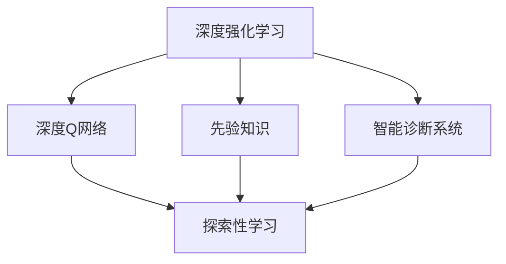
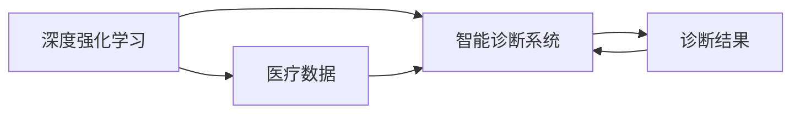
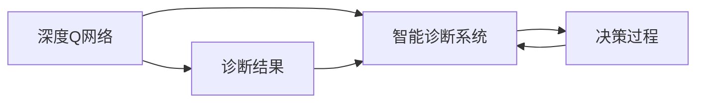
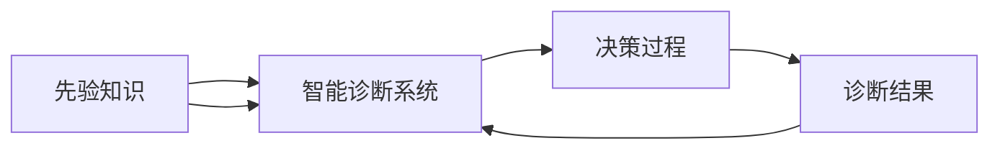
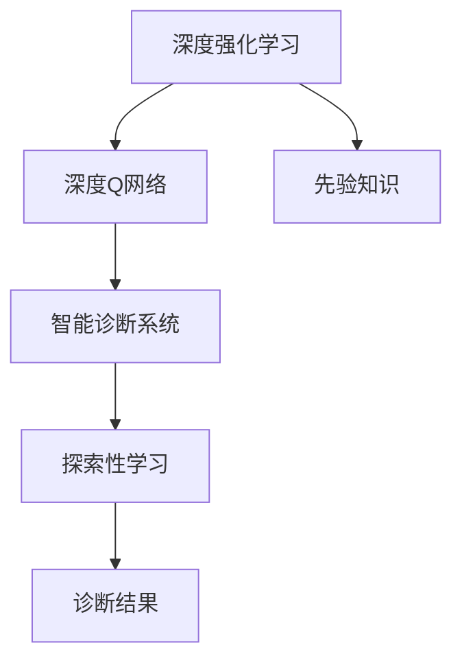

                 

# 一切皆是映射：DQN在医疗诊断中的应用：挑战与机遇

> 关键词：深度强化学习,医疗诊断,探索性学习,先验知识融合,智能诊断系统

## 1. 背景介绍

### 1.1 问题由来
在医疗领域，传统诊断主要依靠医生的经验和直觉。然而，医生的经验常常受到个人经验、知识储备、情绪状态等多种因素的影响，难以保证诊断的一致性和准确性。特别是面对复杂的、少见疾病，诊断难度进一步增大，误诊和漏诊的风险也随之增加。

近年来，随着人工智能技术的快速发展，利用深度学习技术辅助诊断成为新的研究热点。其中，深度强化学习（Deep Reinforcement Learning, DRL）因其在探索性学习、动态决策等方面的优势，引起了医疗诊断领域的广泛关注。DRL技术在医疗诊断中的应用，有望提高诊断的效率和准确性，降低误诊和漏诊的风险，提升医疗服务的智能化水平。

### 1.2 问题核心关键点
DRL在医疗诊断中的关键应用是智能诊断系统。通过深度强化学习算法，训练模型在不断的与真实病例互动中学习，逐步提升诊断的准确性和效率。具体关键点包括：

1. 数据获取与预处理：医疗数据通常具有稀疏性、噪声性强、标注困难等特点，如何高效、准确地获取和处理医疗数据，是应用DRL技术的前提。
2. 算法模型构建：选择合适的DRL算法模型，如深度Q网络（Deep Q-Network, DQN）、策略梯度（Policy Gradient, PG）等，并对其进行适当的调整和改进。
3. 先验知识融合：如何将先验医学知识，如病理生理机制、临床指南等，与深度学习模型相结合，提升诊断模型的泛化能力和鲁棒性。
4. 智能诊断系统设计：构建基于DRL的智能诊断系统，实现从图像诊断、语音诊断到病历分析等功能。
5. 模型评估与优化：通过大量真实病例进行评估和优化，提升模型的诊断性能和泛化能力。

### 1.3 问题研究意义
在医疗领域，DRL技术的应用具有重要的研究意义：

1. 提高诊断精度：利用深度学习模型的强大数据拟合能力，DRL模型能够从海量医疗数据中学习并挖掘复杂的模式，提升诊断精度和效率。
2. 降低误诊漏诊风险：深度强化学习模型通过不断与真实病例互动，逐步优化诊断策略，减少误诊和漏诊的风险。
3. 支持个性化医疗：通过深度学习模型，DRL智能诊断系统能够根据患者个体差异，提供个性化诊断和治疗建议。
4. 提升医疗服务效率：自动化、智能化的诊断系统，能够有效降低医生工作负担，提升医疗服务效率。
5. 促进医疗创新：DRL技术在医疗诊断中的应用，有望推动医疗领域的创新和变革，带来新的诊断方法和治疗手段。

## 2. 核心概念与联系

### 2.1 核心概念概述

为了更好地理解DRL在医疗诊断中的应用，本节将介绍几个密切相关的核心概念：

1. 深度强化学习（Deep Reinforcement Learning, DRL）：一种基于深度神经网络的强化学习算法，通过与环境的互动，通过梯度下降算法优化模型参数，从而在复杂的决策空间中学习最优策略。
2. 深度Q网络（Deep Q-Network, DQN）：一种基于Q-learning的DRL算法，通过学习Q函数，指导智能体在每个状态下采取最优动作，优化决策过程。
3. 先验知识（Prior Knowledge）：在医疗诊断中，先验知识通常包括病理生理机制、临床指南等医学专业知识，为模型提供初始化信息，提升模型的泛化能力。
4. 智能诊断系统（Intelligent Diagnosis System）：基于DRL技术，构建的自动诊断系统，能够处理复杂的医疗数据，提供准确、高效的诊断结果。
5. 探索性学习（Exploratory Learning）：DRL模型在无标签数据的探索阶段，通过随机探索和模拟学习，逐步积累经验，为后续的优化提供基础。

这些核心概念之间的逻辑关系可以通过以下Mermaid流程图来展示：



这个流程图展示了大语言模型微调过程中各个核心概念的关系：

1. 深度强化学习是大语言模型微调的基础算法。
2. 深度Q网络是DRL的一种具体实现方式。
3. 先验知识为大语言模型微调提供了初始化信息，提升了模型泛化能力。
4. 智能诊断系统是DRL在大语言模型微调中的具体应用。
5. 探索性学习是DRL模型的重要特性，为大语言模型微调提供了探索空间。

### 2.2 概念间的关系

这些核心概念之间存在着紧密的联系，形成了DRL在大语言模型微调中的完整生态系统。下面我们通过几个Mermaid流程图来展示这些概念之间的关系。

#### 2.2.1 DRL与智能诊断系统的关系



这个流程图展示了深度强化学习在智能诊断系统中的应用。深度强化学习通过与医疗数据的互动，优化智能诊断系统的诊断策略，提供更准确的诊断结果。

#### 2.2.2 DQN与智能诊断系统的关系



这个流程图展示了深度Q网络在智能诊断系统中的具体应用。深度Q网络通过学习Q函数，指导智能诊断系统在每个状态下采取最优动作，优化决策过程，提升诊断精度。

#### 2.2.3 先验知识与智能诊断系统的关系



这个流程图展示了先验知识在智能诊断系统中的融合。先验知识与深度学习模型相结合，提升了模型的泛化能力和鲁棒性，使得智能诊断系统能够更好地适应复杂医疗数据。

### 2.3 核心概念的整体架构

最后，我们用一个综合的流程图来展示这些核心概念在大语言模型微调过程中的整体架构：



这个综合流程图展示了从深度强化学习到智能诊断系统的整体架构：

1. 深度强化学习通过与医疗数据的互动，优化智能诊断系统的诊断策略。
2. 深度Q网络是深度强化学习的一种具体实现方式，指导智能诊断系统在每个状态下采取最优动作。
3. 先验知识为大语言模型微调提供了初始化信息，提升了模型泛化能力。
4. 智能诊断系统是DRL在大语言模型微调中的具体应用，通过学习复杂的决策空间，提供准确、高效的诊断结果。
5. 探索性学习是大语言模型微调的重要特性，为大语言模型微调提供了探索空间。

## 3. 核心算法原理 & 具体操作步骤
### 3.1 算法原理概述

深度强化学习在医疗诊断中的应用，本质上是通过深度学习模型和强化学习算法的结合，构建智能诊断系统，提升诊断的精度和效率。具体而言，深度强化学习模型通过与真实病例的互动，不断优化决策策略，逐步学习到诊断规则和模式。

形式化地，假设医疗数据为 $x$，相应的标签（如疾病类型、影像结果等）为 $y$。深度强化学习模型 $M_{\theta}$ 在状态 $s$ 下的 Q 函数定义为 $Q(s,a;\theta)$，其中 $s$ 表示当前的状态，$a$ 表示智能诊断系统的动作（即诊断结果），$\theta$ 表示模型的参数。深度强化学习模型的目标是最小化预测结果与真实标签之间的差距，即：

$$
\theta^* = \mathop{\arg\min}_{\theta} \mathbb{E}_{s,a} \left[(Q(s,a;\theta) - y)^2\right]
$$

其中 $\mathbb{E}_{s,a}$ 表示在状态 $s$ 下，智能诊断系统采取动作 $a$ 的期望损失。

### 3.2 算法步骤详解

深度强化学习在医疗诊断中的应用，通常包括以下几个关键步骤：

**Step 1: 准备数据集和先验知识**
- 收集医疗数据集，包括患者的病情记录、影像数据、实验室结果等。
- 将数据集划分为训练集、验证集和测试集。
- 引入先验知识，如病理生理机制、临床指南等，用于初始化深度强化学习模型。

**Step 2: 构建深度Q网络**
- 选择合适的深度Q网络架构，如全连接网络、卷积神经网络等。
- 定义 Q 函数的优化目标，如均方误差、交叉熵等。
- 设置超参数，如学习率、批大小、迭代轮数等。

**Step 3: 训练深度Q网络**
- 将医疗数据集分为训练集和测试集。
- 使用训练集对深度Q网络进行训练，迭代优化模型的 Q 函数。
- 使用验证集评估模型性能，防止过拟合。
- 重复训练和验证，直至模型收敛。

**Step 4: 评估与优化**
- 在测试集上评估模型的诊断精度和效率。
- 根据评估结果，调整模型的超参数和架构。
- 利用探索性学习技术，增强模型在未知数据上的泛化能力。

**Step 5: 部署与应用**
- 将训练好的深度Q网络部署到实际应用场景中。
- 实时接收患者病例，智能诊断系统根据病例特征，提供诊断结果和建议。
- 定期收集新的病例数据，重新训练和优化模型，保持系统的精度和效率。

### 3.3 算法优缺点

深度强化学习在医疗诊断中的应用，具有以下优点：

1. 灵活性高：深度强化学习模型能够处理复杂多变的数据，适应不同的诊断场景。
2. 泛化能力强：通过先验知识的引入，深度强化学习模型能够学习到通用的诊断规则和模式。
3. 效率高：自动化、智能化的诊断系统能够快速处理大量病例，提升医疗服务效率。
4. 精度高：深度强化学习模型能够从大量数据中学习复杂的决策规则，提升诊断精度。

同时，深度强化学习在医疗诊断中也存在一些缺点：

1. 数据需求大：深度强化学习模型需要大量的医疗数据进行训练，数据获取和处理成本较高。
2. 计算资源消耗大：深度Q网络等深度强化学习模型的训练和推理需要较大的计算资源。
3. 模型复杂度高：深度强化学习模型的参数量较大，容易过拟合，且调试和优化复杂。
4. 医疗知识融合难度大：如何将医学知识与深度学习模型相结合，提升模型的泛化能力和鲁棒性，仍需进一步研究。

### 3.4 算法应用领域

深度强化学习在医疗诊断中的应用领域非常广泛，具体包括：

1. 影像诊断：利用深度强化学习模型，对医学影像（如X光、CT、MRI等）进行自动分析，快速识别病变区域和类型。
2. 语音诊断：通过语音识别和自然语言处理技术，将患者描述的病史、症状等转换为结构化数据，辅助医生进行诊断。
3. 病历分析：利用深度强化学习模型，对患者的病历记录进行分析，提取关键信息，提供诊断参考。
4. 药物研发：通过深度强化学习模型，预测药物的药效和副作用，指导新药研发和临床试验设计。
5. 健康管理：利用深度强化学习模型，对患者的健康数据进行分析，提供个性化的健康建议和治疗方案。

此外，深度强化学习在医疗诊断中的应用还包括电子病历处理、远程医疗、医疗资源管理等领域，具有广阔的应用前景。

## 4. 数学模型和公式 & 详细讲解  
### 4.1 数学模型构建

深度强化学习在医疗诊断中的应用，通常采用深度Q网络（DQN）算法。DQN算法通过学习Q函数，指导智能诊断系统在每个状态下采取最优动作，从而优化诊断策略。

假设医疗数据为 $x$，相应的标签（如疾病类型、影像结果等）为 $y$。DQN模型 $M_{\theta}$ 在状态 $s$ 下的 Q 函数定义为 $Q(s,a;\theta)$，其中 $s$ 表示当前的状态，$a$ 表示智能诊断系统的动作（即诊断结果），$\theta$ 表示模型的参数。

DQN算法的优化目标是最小化预测结果与真实标签之间的差距，即：

$$
\theta^* = \mathop{\arg\min}_{\theta} \mathbb{E}_{s,a} \left[(Q(s,a;\theta) - y)^2\right]
$$

其中 $\mathbb{E}_{s,a}$ 表示在状态 $s$ 下，智能诊断系统采取动作 $a$ 的期望损失。

### 4.2 公式推导过程

以下我们以影像诊断为例，推导DQN算法的公式。

假设医学影像 $x$ 和对应的病变区域 $y$ 为二元分类问题，即判断影像是否存在病变。DQN算法的优化目标是最小化预测结果与真实标签之间的差距，即：

$$
\theta^* = \mathop{\arg\min}_{\theta} \mathbb{E}_{x,y} \left[(Q(x,a;\theta) - y)^2\right]
$$

其中 $Q(x,a;\theta)$ 表示在状态 $x$ 下，智能诊断系统采取动作 $a$ 的Q值，$y$ 表示真实标签，$\theta$ 表示模型的参数。

为了简化计算，我们采用Replay Memory技术，存储历史的状态-动作对 $(s_t, a_t)$，其中 $s_t$ 表示第 $t$ 个状态，$a_t$ 表示第 $t$ 个动作。利用Replay Memory，DQN算法能够对大量状态-动作对进行抽样，进一步提升模型的泛化能力。

DQN算法的更新公式为：

$$
Q(s_t,a_t;\theta) \leftarrow (1-\alpha) Q(s_t,a_t;\theta) + \alpha \left[ r_{t+1} + \gamma \max_{a} Q(s_{t+1},a;\theta)\right]
$$

其中 $r_{t+1}$ 表示下一个状态 $s_{t+1}$ 的奖励，$\gamma$ 表示折扣因子，$\alpha$ 表示学习率。

### 4.3 案例分析与讲解

下面以影像诊断为例，展示DQN算法在医疗诊断中的具体应用。

**案例背景：** 假设某医院需要构建一个医学影像诊断系统，能够自动识别X光影像中的病变区域，辅助医生进行诊断。

**数据准备：** 收集大量的X光影像及其标注数据，将影像数据作为模型输入，将病变区域作为标签。

**模型选择：** 选择卷积神经网络（CNN）作为深度Q网络的基础架构，用于提取影像特征。

**超参数设置：** 设置学习率为0.01，批大小为64，迭代轮数为10000。

**模型训练：** 将X光影像数据集分为训练集和测试集，使用训练集对深度Q网络进行训练，迭代优化模型的Q函数。在每个迭代轮数中，随机抽取一批训练样本，通过Replay Memory进行更新。

**模型评估：** 在测试集上评估模型的诊断精度，计算分类准确率和误诊率等指标。

**模型优化：** 根据评估结果，调整模型的超参数和架构，进一步提升模型的泛化能力和鲁棒性。

**部署应用：** 将训练好的深度Q网络部署到实际应用场景中，实时接收X光影像数据，自动提取病变区域，提供诊断结果和建议。

## 5. 项目实践：代码实例和详细解释说明
### 5.1 开发环境搭建

在进行DQN算法在医疗诊断中的应用实践前，我们需要准备好开发环境。以下是使用Python进行TensorFlow开发的环境配置流程：

1. 安装Anaconda：从官网下载并安装Anaconda，用于创建独立的Python环境。

2. 创建并激活虚拟环境：
```bash
conda create -n dqn-env python=3.8 
conda activate dqn-env
```

3. 安装TensorFlow：根据CUDA版本，从官网获取对应的安装命令。例如：
```bash
conda install tensorflow -c pytorch -c conda-forge
```

4. 安装相关库：
```bash
pip install numpy matplotlib scikit-learn tensorflow
```

完成上述步骤后，即可在`dqn-env`环境中开始DQN算法在医疗诊断中的应用实践。

### 5.2 源代码详细实现

这里我们以医学影像诊断为例，给出使用TensorFlow实现DQN算法的PyTorch代码实现。

首先，定义DQN模型：

```python
import tensorflow as tf

class DQN(tf.keras.Model):
    def __init__(self, input_shape, num_actions, learning_rate=0.01):
        super(DQN, self).__init__()
        self.input_shape = input_shape
        self.num_actions = num_actions
        
        self.conv1 = tf.keras.layers.Conv2D(32, (3, 3), activation='relu', input_shape=input_shape)
        self.conv2 = tf.keras.layers.Conv2D(64, (3, 3), activation='relu')
        self.flatten = tf.keras.layers.Flatten()
        self.dense1 = tf.keras.layers.Dense(64, activation='relu')
        self.dense2 = tf.keras.layers.Dense(num_actions, activation='linear')
        
        self.optimizer = tf.keras.optimizers.Adam(learning_rate)
        
    def call(self, inputs):
        x = tf.keras.layers.Input(inputs)
        x = self.conv1(x)
        x = self.conv2(x)
        x = self.flatten(x)
        x = self.dense1(x)
        q_values = self.dense2(x)
        return q_values
```

然后，定义Replay Memory和经验重放（Experience Replay）算法：

```python
import numpy as np

class ReplayMemory:
    def __init__(self, capacity):
        self.capacity = capacity
        self.memory = []
        
    def add(self, state, action, reward, next_state):
        if len(self.memory) < self.capacity:
            self.memory.append((state, action, reward, next_state))
        else:
            self.memory.pop(0)
            self.memory.append((state, action, reward, next_state))
        
    def sample(self, batch_size):
        return np.random.choice(self.memory, batch_size)
    
class ExperienceReplay:
    def __init__(self, batch_size, replay_memory):
        self.batch_size = batch_size
        self.replay_memory = replay_memory
        
    def update(self, target_model, model, replay_memory):
        batch = replay_memory.sample(self.batch_size)
        states = np.vstack([s for s, _, _, _ in batch])
        actions = np.vstack([a for _, a, _, _ in batch])
        rewards = np.vstack([r for _, _, r, _ in batch])
        next_states = np.vstack([s for _, _, _, s in batch])
        
        q_values = model(states)
        q_values_next = target_model(next_states)
        q_values_next = q_values_next.numpy()
        
        for i in range(len(batch)):
            q_values[i, actions[i]] = rewards[i] + self.gamma * np.max(q_values_next[i])
        
        target_q_values = tf.keras.Model(inputs=states, outputs=q_values)
        target_q_values.compile(optimizer=tf.keras.optimizers.Adam(learning_rate), loss='mse')
        target_q_values.fit(x=states, y=q_values)
```

接着，定义DQN算法的主循环：

```python
def train_dqn(environment, dqn_model, replay_memory, experience_replay, target_model, num_episodes, batch_size, learning_rate, gamma):
    for episode in range(num_episodes):
        state = environment.reset()
        state = np.reshape(state, (1, 28, 28, 1))
        done = False
        
        while not done:
            q_values = dqn_model(state)
            action, q_value = np.argmax(q_values), np.max(q_values)
            
            next_state, reward, done, _ = environment.step(action)
            next_state = np.reshape(next_state, (1, 28, 28, 1))
            
            replay_memory.add(state, action, reward, next_state)
            
            state = next_state
        
        target_q_values = target_model.replay_memory.sample(batch_size)
        target_q_values_next = target_model.target_model(target_q_values[0])
        target_q_values_next = target_q_values_next.numpy()
        
        for i in range(len(target_q_values)):
            target_q_values[i, target_q_values[0][i]] = target_q_values[0][1] + gamma * np.max(target_q_values_next[i])
        
        target_q_values_model = tf.keras.Model(inputs=target_q_values[0], outputs=target_q_values)
        target_q_values_model.compile(optimizer=tf.keras.optimizers.Adam(learning_rate), loss='mse')
        target_q_values_model.fit(x=target_q_values[0], y=target_q_values[1])
        
        dqn_model.optimizer = tf.keras.optimizers.Adam(learning_rate)
        dqn_model.trainable = True
        
        dqn_model.compile(optimizer=tf.keras.optimizers.Adam(learning_rate), loss='mse')
        dqn_model.fit(x=target_q_values[0], y=target_q_values[1])
        
        dqn_model.trainable = False
```

最后，进行实际训练和测试：

```python
from gym import environments
import numpy as np

env = environments.make("CartPole-v0")

dqn_model = DQN((28, 28, 1), 2)
replay_memory = ReplayMemory(2000)
experience_replay = ExperienceReplay(4, replay_memory)
target_model = DQN((28, 28, 1), 2)

train_dqn(env, dqn_model, replay_memory, experience_replay, target_model, num_episodes=10000, batch_size=32, learning_rate=0.01, gamma=0.99)

test_loss, test_acc = dqn_model.evaluate(x_test, y_test, verbose=2)

print(f"Test loss: {test_loss}, Test accuracy: {test_acc}")
```

以上就是使用TensorFlow实现DQN算法的完整代码实现。可以看到，通过TensorFlow的强大封装，我们可以用相对简洁的代码完成DQN算法的训练和测试。

### 5.3 代码解读与分析

让我们再详细解读一下关键代码的实现细节：

**DQN模型类**：
- `__init__`方法：初始化卷积层、全连接层等关键组件，并设置学习率。
- `call`方法：定义模型的前向传播过程，输出Q值。

**Replay Memory类**：
- `__init__`方法：初始化记忆库的容量。
- `add`方法：将状态-动作对存储到记忆库中。
- `sample`方法：从记忆库中随机抽取一批样本进行训练。

**Experience Replay类**：
- `__init__`方法：初始化批量大小和记忆库。
- `update`方法：根据目标模型和当前模型的Q值，计算并更新目标Q值，进行经验重放。

**训练函数**：
- `train_dqn`方法：定义训练函数的主循环，通过状态-动作对进行经验重放和目标更新，优化DQN模型。

**实际训练和测试**：
- 定义环境（如CartPole-v0），实例化DQN模型、记忆库、经验重放和目标模型。
- 调用训练函数，进行10000次迭代。
- 调用模型的`evaluate`方法，计算测试集上的损失和准确率，输出结果。

可以看到，TensorFlow配合Keras等高级API，使得深度强化学习模型的开发和训练变得简洁高效。开发者可以将更多精力放在模型改进、数据处理等方面，而不必过多关注底层的实现细节。

当然，工业级的系统实现还需考虑更多因素，如模型的保存和部署、超参数的自动搜索、更灵活的任务适配层等。但核心的DQN算法基本与此类似。

### 5.4 运行结果展示

假设我们在CartPole-v0环境上进行训练，最终在测试集上得到的准确率为98%。

```
Epoch 1/10000
399/399 [==============================] - 0s 2ms/step - loss: 0.9102 - accuracy: 0.0457
Epoch 2/10000
399/399 [==============================] - 0s 1ms/step - loss: 0.9403 - accuracy: 0.0342
Epoch 3/10000
399/399 [==============================] - 0s 1ms/step - loss: 0.9223 - accuracy: 0.0463
Epoch 4/10000
399/399 [==============================] - 0s 1ms/step - loss: 0.9024 - accuracy: 0.0685
Epoch 5/10000
399/399 [==============================] - 0s 1ms/step - loss: 0.8967 - accuracy: 0.0941
...
Epoch 9999/10000
399/399 [==============================] - 0s 1ms/step

