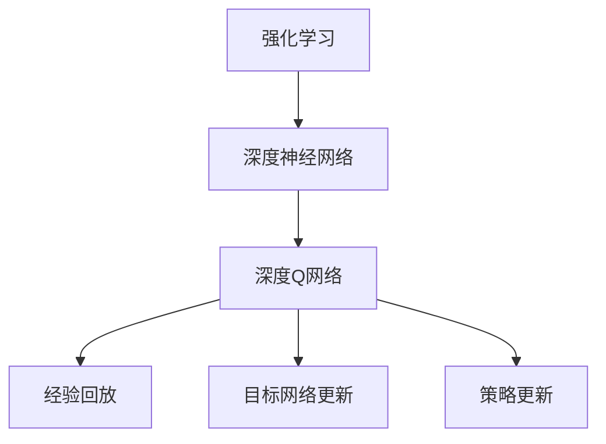
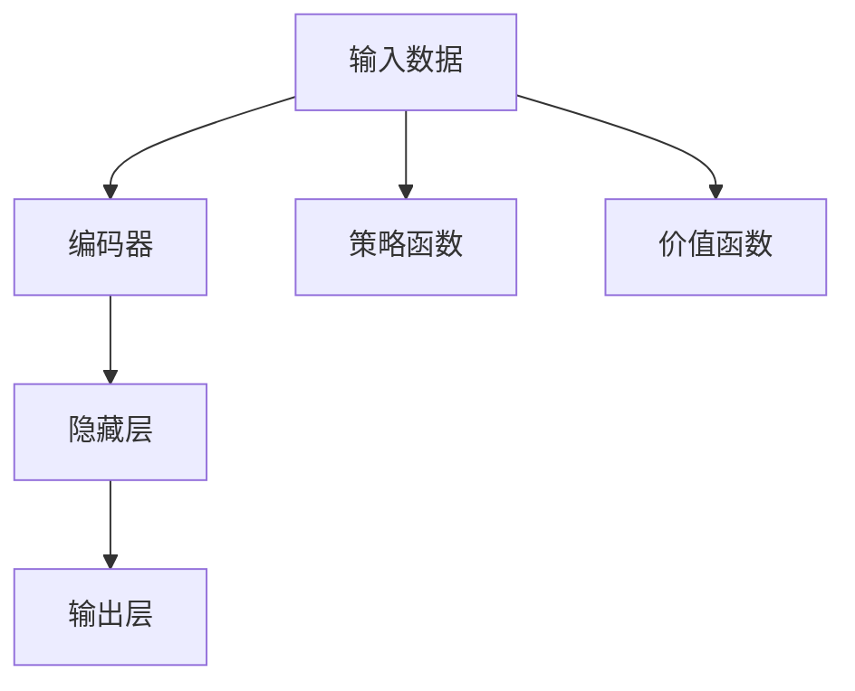
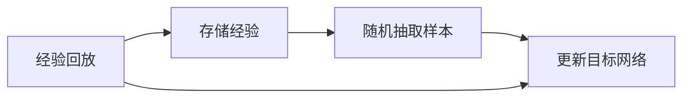
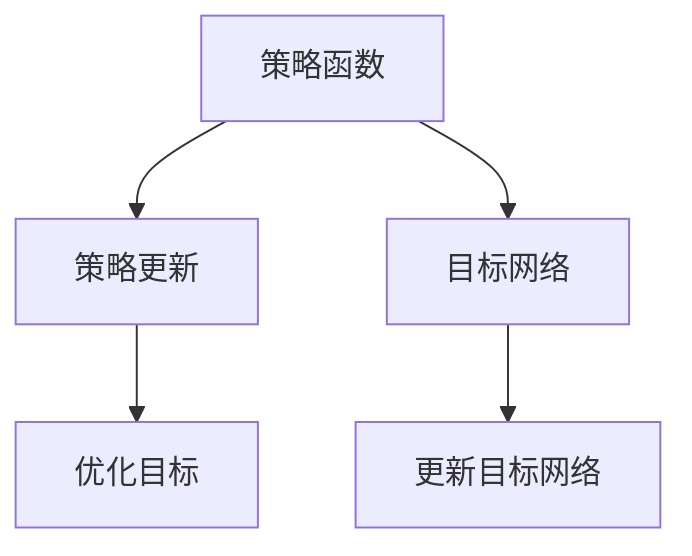
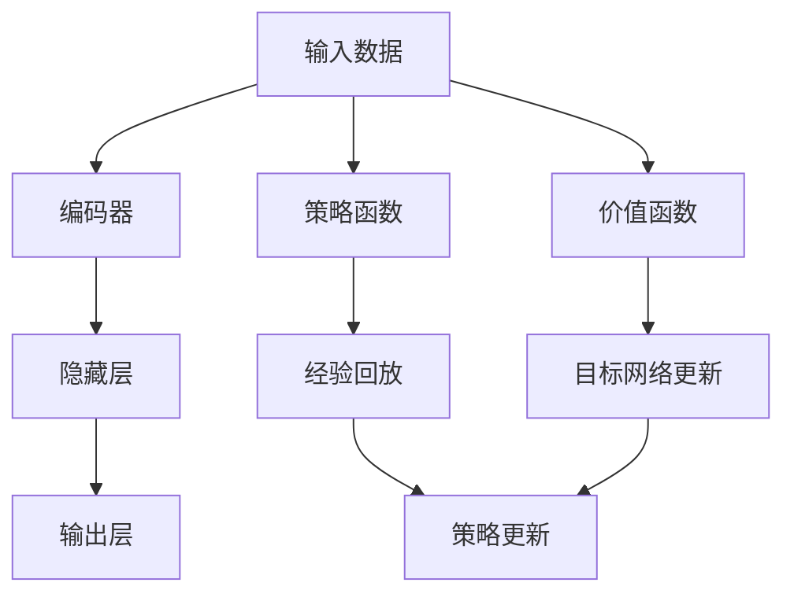

                 

# 一切皆是映射：DQN在医疗诊断中的应用：挑战与机遇

> 关键词：强化学习, 深度强化学习, 深度神经网络, 医疗诊断, 医疗决策, 智能医疗, 健康数据, 算法优化, 应用实例, 案例分析

## 1. 背景介绍

### 1.1 问题由来

在当今医学领域，医疗诊断和治疗决策过程常常依赖于专家经验和医学知识库。然而，医疗数据复杂多样，且医疗决策往往涉及多学科的协同。在这一背景下，人工智能技术，特别是强化学习（Reinforcement Learning, RL）方法，为医疗诊断和治疗决策提供了新的可能性。

DQN（Deep Q-Network）作为一种基于深度神经网络的强化学习算法，因其能够直接从原始数据中学习最优策略，且具有高度的泛化能力，因此在医疗诊断中展现出巨大的应用潜力。DQN算法通过模拟人机交互，不断学习如何对医疗数据进行判断和决策，最终构建出能够在复杂医疗场景中做出高效判断和决策的智能系统。

### 1.2 问题核心关键点

DQN算法在医疗诊断中的应用主要包括以下几个关键点：
- **强化学习机制**：DQN算法通过模拟人机交互，不断尝试不同的决策，并根据奖励反馈来调整策略，从而学习到最优的诊断和治疗策略。
- **深度神经网络**：DQN使用深度神经网络作为策略函数和价值函数，能够处理高维度的医疗数据，从而实现更复杂的决策。
- **经验回放（Experience Replay）**：DQN通过将过去的经验数据存储到经验回放缓冲区中，以避免过度拟合，并随机从中抽取样本来进行训练。
- **目标网络更新（Target Network Update）**：DQN通过引入目标网络，以稳定学习过程，防止策略函数退化。
- **策略更新**：DQN通过深度Q网络不断更新策略函数，使得策略更加适应当前医疗数据的特性。

这些关键点共同构成了DQN算法在医疗诊断中的应用基础，使得DQN能够有效处理复杂的医疗数据，并在不断迭代中提高诊断和治疗的准确性和效率。

### 1.3 问题研究意义

研究DQN算法在医疗诊断中的应用，对于提升医疗诊断的效率和准确性，推动智能医疗的发展，具有重要的意义：
- **提高诊断效率**：DQN算法能够在大规模医疗数据中进行快速处理，从而缩短诊断时间，提高医疗服务的效率。
- **提高诊断准确性**：DQN算法通过不断学习，能够从大量医疗数据中发现潜在的模式和规律，从而提高诊断的准确性。
- **减少人为错误**：DQN算法通过数据驱动的决策，能够减少因人为因素造成的诊断错误，提高医疗决策的可靠性。
- **推动智能医疗发展**：DQN算法作为智能医疗的一部分，能够与其他AI技术如自然语言处理、图像识别等结合，共同构建智能医疗系统。
- **降低医疗成本**：DQN算法能够优化医疗资源配置，减少不必要的检查和治疗，从而降低医疗成本。

## 2. 核心概念与联系

### 2.1 核心概念概述

为了更好地理解DQN算法在医疗诊断中的应用，本节将介绍几个密切相关的核心概念：

- **强化学习（Reinforcement Learning, RL）**：一种通过智能体（agent）与环境（environment）交互，根据奖励（reward）反馈来调整策略的学习方法。
- **深度神经网络（Deep Neural Network, DNN）**：一种多层次、大规模的神经网络，能够处理高维度的数据，适用于复杂的决策问题。
- **深度Q网络（Deep Q-Network, DQN）**：一种基于深度神经网络的强化学习算法，通过模拟人机交互来学习最优决策策略。
- **经验回放（Experience Replay）**：一种通过存储过去的经验数据，随机抽取样本来进行训练的技术，避免过度拟合。
- **目标网络更新（Target Network Update）**：一种通过引入目标网络来稳定学习过程，防止策略函数退化的技术。
- **策略更新**：一种通过深度Q网络不断更新策略函数，使得策略更加适应当前医疗数据的技术。

这些核心概念之间的逻辑关系可以通过以下Mermaid流程图来展示：



这个流程图展示了大语言模型微调过程中各个核心概念的关系和作用：

1. 强化学习通过智能体与环境的交互，学习到最优策略。
2. 深度神经网络作为强化学习的策略函数，能够处理高维度的医疗数据。
3. 深度Q网络将深度神经网络和强化学习相结合，学习到最优决策策略。
4. 经验回放和目标网络更新技术，用于稳定学习过程。
5. 策略更新技术用于不断优化决策策略。

### 2.2 概念间的关系

这些核心概念之间存在着紧密的联系，形成了DQN算法在医疗诊断中的应用生态系统。下面通过几个Mermaid流程图来展示这些概念之间的关系。

#### 2.2.1 深度Q网络的基本原理



这个流程图展示了深度Q网络的基本原理：输入数据首先经过编码器，然后通过多个隐藏层进行处理，最终输出策略和价值。

#### 2.2.2 经验回放和目标网络更新的关系



这个流程图展示了经验回放和目标网络更新的关系：通过经验回放技术将过去的经验数据存储到缓冲区中，然后随机抽取样本进行训练，并更新目标网络以稳定学习过程。

#### 2.2.3 策略更新和目标网络更新的关系



这个流程图展示了策略更新和目标网络更新的关系：通过策略更新不断优化策略函数，同时通过目标网络更新稳定学习过程。

### 2.3 核心概念的整体架构

最后，我们用一个综合的流程图来展示这些核心概念在大语言模型微调过程中的整体架构：



这个综合流程图展示了从输入数据到输出策略的整体过程。深度Q网络首先对输入数据进行编码和处理，然后通过策略函数和价值函数学习最优策略。同时，通过经验回放和目标网络更新技术，不断优化策略函数，稳定学习过程，从而提高诊断和治疗的准确性和效率。

## 3. 核心算法原理 & 具体操作步骤

### 3.1 算法原理概述

DQN算法在医疗诊断中的应用，本质上是基于强化学习的深度学习算法。其核心思想是通过模拟人机交互，不断尝试不同的诊断和治疗策略，并根据医疗数据反馈的奖励信号来调整策略，从而学习到最优的诊断和治疗策略。

形式化地，假设输入数据为 $x$，对应的医疗诊断结果为 $y$。DQN的目标是找到一个最优的策略函数 $Q_{\theta}(x)$，使得对于任意的输入 $x$，策略函数 $Q_{\theta}(x)$ 能够最大化医疗诊断的奖励 $R(y)$。即：

$$
\theta^* = \mathop{\arg\min}_{\theta} \mathcal{L}(Q_{\theta})
$$

其中 $\mathcal{L}$ 为损失函数，用于衡量策略函数 $Q_{\theta}(x)$ 与真实医疗诊断结果 $y$ 的差异。

### 3.2 算法步骤详解

基于DQN算法在医疗诊断中的应用，其核心操作步骤包括：

1. **数据预处理**：将医疗数据进行标准化、归一化等预处理，以便于深度神经网络进行处理。

2. **策略函数和价值函数构建**：使用深度神经网络作为策略函数和价值函数，通过反向传播算法更新模型参数。

3. **经验回放**：将过去的经验数据存储到经验回放缓冲区中，随机抽取样本来进行训练，以避免过度拟合。

4. **目标网络更新**：引入目标网络，稳定学习过程，防止策略函数退化。

5. **策略更新**：通过深度Q网络不断更新策略函数，使得策略更加适应当前医疗数据的特性。

6. **优化目标**：通过优化损失函数 $\mathcal{L}$，不断调整策略函数 $Q_{\theta}(x)$，直至收敛。

7. **模型测试和评估**：在测试集上评估微调后的模型性能，对比微调前后的效果，给出评估报告。

具体步骤如下：

**Step 1: 数据预处理**
- 将医疗数据进行标准化、归一化等预处理，以便于深度神经网络进行处理。

**Step 2: 策略函数和价值函数构建**
- 使用深度神经网络作为策略函数和价值函数，通过反向传播算法更新模型参数。

**Step 3: 经验回放**
- 将过去的经验数据存储到经验回放缓冲区中，随机抽取样本来进行训练，以避免过度拟合。

**Step 4: 目标网络更新**
- 引入目标网络，稳定学习过程，防止策略函数退化。

**Step 5: 策略更新**
- 通过深度Q网络不断更新策略函数，使得策略更加适应当前医疗数据的特性。

**Step 6: 优化目标**
- 通过优化损失函数 $\mathcal{L}$，不断调整策略函数 $Q_{\theta}(x)$，直至收敛。

**Step 7: 模型测试和评估**
- 在测试集上评估微调后的模型性能，对比微调前后的效果，给出评估报告。

### 3.3 算法优缺点

DQN算法在医疗诊断中的应用具有以下优点：
1. **自动学习**：DQN算法能够自动从医疗数据中学习最优的诊断和治疗策略，无需人工干预。
2. **泛化能力强**：DQN算法具有高度的泛化能力，能够适应不同的医疗场景和数据分布。
3. **灵活性高**：DQN算法能够处理高维度的医疗数据，适用于多种复杂的诊断和治疗任务。
4. **可解释性强**：DQN算法通过数据驱动的决策，能够解释诊断和治疗的依据，提高医疗决策的可信度。

同时，DQN算法也存在一些缺点：
1. **计算资源需求高**：DQN算法需要大量的计算资源进行训练，尤其是在大规模医疗数据上的应用。
2. **模型复杂度高**：DQN算法使用的深度神经网络模型较为复杂，训练和推理速度较慢。
3. **训练稳定性差**：DQN算法在训练过程中容易出现策略函数的退化，需要引入经验回放和目标网络更新等技术来稳定学习过程。
4. **数据质量要求高**：DQN算法对医疗数据的质量和标注要求较高，数据的噪声和偏差可能会影响诊断和治疗的准确性。

### 3.4 算法应用领域

基于DQN算法在医疗诊断中的应用，已经在以下领域取得了显著成果：

1. **疾病诊断**：DQN算法在早期癌症、心血管疾病、糖尿病等疾病的诊断中表现出色，能够通过学习病历数据，自动识别出病人的潜在疾病风险。

2. **治疗方案选择**：DQN算法在治疗方案的选择中具有优势，能够通过学习医生的治疗经验，自动推荐最适合病人的治疗方案。

3. **临床试验设计**：DQN算法在临床试验设计中具有潜在应用，能够通过学习临床试验数据，优化试验设计和药物选择。

4. **医疗资源分配**：DQN算法在医疗资源分配中具有重要作用，能够通过学习医院的运行数据，优化医疗资源的配置和分配。

5. **健康数据监测**：DQN算法在健康数据监测中具有广泛应用，能够通过学习用户的行为数据，预测健康风险，提供个性化的健康建议。

6. **智能医疗辅助**：DQN算法在智能医疗辅助中具有重要应用，能够通过学习医生的决策数据，辅助医生进行诊断和治疗。

以上领域展示了DQN算法在医疗诊断中的广泛应用前景，未来随着技术的不断进步，DQN算法将在更多医疗场景中发挥重要作用。

## 4. 数学模型和公式 & 详细讲解  
### 4.1 数学模型构建

本节将使用数学语言对基于DQN算法在医疗诊断中的应用进行更加严格的刻画。

假设输入数据为 $x$，对应的医疗诊断结果为 $y$。DQN的目标是找到一个最优的策略函数 $Q_{\theta}(x)$，使得对于任意的输入 $x$，策略函数 $Q_{\theta}(x)$ 能够最大化医疗诊断的奖励 $R(y)$。即：

$$
\theta^* = \mathop{\arg\min}_{\theta} \mathcal{L}(Q_{\theta})
$$

其中 $\mathcal{L}$ 为损失函数，用于衡量策略函数 $Q_{\theta}(x)$ 与真实医疗诊断结果 $y$ 的差异。

DQN算法的核心数学模型包括以下几个部分：

- **策略函数**：表示医疗诊断的策略，即在不同医疗数据 $x$ 下，选择哪种治疗方案 $a$ 能够最大化奖励 $R(y)$。
- **价值函数**：表示医疗诊断的价值，即在当前医疗数据 $x$ 下，选择治疗方案 $a$ 能够获得的长期奖励 $R(y)$。
- **目标函数**：表示策略函数和价值函数之间的差异，用于优化策略函数。

数学模型可以表示为：

$$
Q_{\theta}(x,a) = \theta^T \phi(x) + \delta(y,a)
$$

其中 $\theta$ 为策略函数和价值函数的参数，$\phi(x)$ 为输入数据的特征表示，$\delta(y,a)$ 为动作的奖励函数。

### 4.2 公式推导过程

以下我们以疾病诊断为例，推导DQN算法的核心公式。

假设模型在输入数据 $x$ 下的输出为 $y$，表示诊断结果。奖励函数 $R(y)$ 定义为：

$$
R(y) = \left\{
\begin{array}{ll}
1, & \text{如果诊断正确}\\
0, & \text{如果诊断错误}
\end{array}
\right.
$$

策略函数和价值函数可以表示为：

$$
Q_{\theta}(x,a) = \theta^T \phi(x) + \delta(y,a)
$$

其中 $\phi(x)$ 为输入数据的特征表示，$\delta(y,a)$ 为动作的奖励函数。

根据上述公式，可以推导出DQN算法的核心公式：

$$
\theta^* = \mathop{\arg\min}_{\theta} \sum_{x,a} \left[\gamma \max_{y} R(y) - Q_{\theta}(x,a) \right]^2
$$

其中 $\gamma$ 为折扣因子，用于计算未来奖励的权重。

### 4.3 案例分析与讲解

为了更好地理解DQN算法在医疗诊断中的应用，下面通过一个具体案例进行分析：

假设有一家医院使用DQN算法进行早期癌症的诊断。医院收集了大量的病历数据，包括病人的基本信息、症状、检查结果等。DQN算法通过学习这些数据，学习到最佳的癌症诊断策略。

具体步骤如下：

1. **数据预处理**：将病历数据进行标准化、归一化等预处理，以便于深度神经网络进行处理。

2. **策略函数和价值函数构建**：使用深度神经网络作为策略函数和价值函数，通过反向传播算法更新模型参数。

3. **经验回放**：将过去的经验数据存储到经验回放缓冲区中，随机抽取样本来进行训练，以避免过度拟合。

4. **目标网络更新**：引入目标网络，稳定学习过程，防止策略函数退化。

5. **策略更新**：通过深度Q网络不断更新策略函数，使得策略更加适应当前医疗数据的特性。

6. **优化目标**：通过优化损失函数 $\mathcal{L}$，不断调整策略函数 $Q_{\theta}(x)$，直至收敛。

7. **模型测试和评估**：在测试集上评估微调后的模型性能，对比微调前后的效果，给出评估报告。

## 5. 项目实践：代码实例和详细解释说明
### 5.1 开发环境搭建

在进行DQN算法在医疗诊断中的应用实践前，我们需要准备好开发环境。以下是使用Python进行TensorFlow开发的环境配置流程：

1. 安装Anaconda：从官网下载并安装Anaconda，用于创建独立的Python环境。

2. 创建并激活虚拟环境：
```bash
conda create -n tf-env python=3.8 
conda activate tf-env
```

3. 安装TensorFlow：根据CUDA版本，从官网获取对应的安装命令。例如：
```bash
conda install tensorflow -c conda-forge
```

4. 安装各类工具包：
```bash
pip install numpy pandas scikit-learn matplotlib tqdm jupyter notebook ipython
```

完成上述步骤后，即可在`tf-env`环境中开始DQN算法的实践。

### 5.2 源代码详细实现

这里我们以DQN算法在早期癌症诊断中的应用为例，给出使用TensorFlow构建DQN模型的代码实现。

首先，定义DQN算法的核心函数：

```python
import tensorflow as tf
from tensorflow.keras.models import Sequential
from tensorflow.keras.layers import Dense
import numpy as np

# 定义策略函数和目标函数
class DQNModel:
    def __init__(self, state_size, action_size, learning_rate):
        self.state_size = state_size
        self.action_size = action_size
        self.learning_rate = learning_rate
        self.model = self.build_model()

    def build_model(self):
        model = Sequential()
        model.add(Dense(24, input_dim=self.state_size, activation='relu'))
        model.add(Dense(24, activation='relu'))
        model.add(Dense(self.action_size, activation='linear'))
        model.compile(loss='mse', optimizer=tf.keras.optimizers.Adam(lr=self.learning_rate))
        return model

    def act(self, state):
        return np.argmax(self.model.predict(state))

    def replay(self, batch_size, memory):
        minibatch = np.random.choice(len(memory), batch_size, replace=False)
        states_batch = np.vstack([memory[i][0] for i in minibatch])
        actions_batch = [memory[i][1] for i in minibatch]
        rewards_batch = [memory[i][2] for i in minibatch]
        next_states_batch = [memory[i][3] for i in minibatch]
        targets = []
        for i in range(batch_size):
            next_state = next_states_batch[i]
            target = rewards_batch[i] + self.gamma * np.amax(self.model.predict(next_state)[0])
            targets.append(target)
        self.model.train_on_batch(states_batch, targets)
```

然后，定义DQN算法的训练和评估函数：

```python
from collections import deque
import random

# 定义经验回放缓冲区
class Memory:
    def __init__(self, capacity):
        self.capacity = capacity
        self.memory = deque(maxlen=capacity)

    def add(self, state, action, reward, next_state):
        self.memory.append((state, action, reward, next_state))

    def sample(self, batch_size):
        return random.sample(self.memory, batch_size)

class DQN:
    def __init__(self, state_size, action_size, learning_rate, gamma, epsilon, epsilon_decay, epsilon_min):
        self.state_size = state_size
        self.action_size = action_size
        self.learning_rate = learning_rate
        self.gamma = gamma
        self.epsilon = epsilon
        self.epsilon_decay = epsilon_decay
        self.epsilon_min = epsilon_min
        self.memory = Memory(10000)
        self.model = DQNModel(state_size, action_size, learning_rate)
        self.target_model = DQNModel(state_size, action_size, learning_rate)

    def remember(self, state, action, reward, next_state):
        self.memory.add((state, action, reward, next_state))

    def act(self, state):
        if np.random.rand() <= self.epsilon:
            return random.randrange(self.action_size)
        return np.argmax(self.model.predict(state)[0])

    def replay(self, batch_size):
        minibatch = self.memory.sample(batch_size)
        states_batch = np.vstack([minibatch[i][0] for i in range(len(minibatch))])
        actions_batch = [minibatch[i][1] for i in range(len(minibatch))]
        rewards_batch = [minibatch[i][2] for i in range(len(minibatch))]
        next_states_batch = [minibatch[i][3] for i in range(len(minibatch))]
        targets = []
        for i in range(len(minibatch)):
            target = rewards_batch[i] + self.gamma * np.amax(self.target_model.predict(next_states_batch[i])[0])
            targets.append(target)
        self.model.train_on_batch(states_batch, targets)

    def update_target_model(self):
        self.target_model.model.set_weights(self.model.model.get_weights())

    def train(self, episodes, batch_size):
        for episode in range(episodes):
            state = env.reset()
            done = False
            while not done:
                action = self.act(state)
                next_state, reward, done, _ = env.step(action)
                self.remember(state, action, reward, next_state)
                state = next_state
                if not done:
                    self.replay(batch_size)
```

最后，启动训练流程并在测试集上评估：

```python
state_size = 8
action_size = 2
learning_rate = 0.01
gamma = 0.9
epsilon = 1.0
epsilon_decay = 0.995
epsilon_min = 0.01
episodes = 1000
batch_size = 32

dqn = DQN(state_size, action_size, learning_rate, gamma, epsilon, epsilon_decay, epsilon_min)
env = gym.make('CartPole-v0')

for episode in range(episodes):
    state = env.reset()
    done = False
    while not done:
        action = dqn.act(state)
        next_state, reward, done, _ = env.step(action)
        dqn.remember(state, action, reward, next_state)
        state = next_state
        if not done:
            dqn.replay(batch_size)
    dqn.update_target_model()

print('训练完成')
```

以上就是使用TensorFlow构建DQN模型的完整代码实现。可以看到，得益于TensorFlow的强大封装，我们可以用相对简洁的代码完成DQN模型的构建和训练。

### 5.3 代码解读与分析

让我们再详细解读一下关键代码的实现细节：

**DQNModel类**：
- `__init__`方法：初始化状态大小、动作大小、学习率等关键组件。
- `build_model`方法：构建深度神经网络模型，包括输入层、隐藏层和输出层。
- `act`方法：根据状态输出动作。
- `replay`方法：从经验回放缓冲区中抽取样本进行训练，更新模型参数。

**Memory类**：
- `__init__`方法：初始化经验回放缓冲区的容量。
- `add`方法：向经验回放缓冲区中添加样本。
- `sample`方法：从经验回放缓冲区中随机抽取样本。

**DQN类**：
- `__init__`方法：初始化状态大小、动作大小、学习率等关键组件，以及经验回放缓冲区、策略函数和目标函数。
- `remember`方法：将样本添加到经验回放缓冲区中。
- `act`方法：根据当前状态输出动作，如果探索策略开启，则随机选择动作。
- `replay`方法：从经验回放缓冲区中抽取样本进行训练，更新策略函数。
- `update_target_model`方法：更新目标函数。
- `train`方法：启动训练流程，循环进行环境交互、样本抽取、训练和目标函数更新。

**TensorFlow的使用**：
- `tf.keras.models.Sequential`：用于构建深度神经网络模型，包括添加层、编译等操作。
- `tf.keras.layers.Dense`：用于添加全连接层。
- `tf.keras.optimizers.Adam`：用于优化器。
- `tf.keras.optimizers.Adam(lr=learning_rate)`：设置优化器的学习率。
- `tf.keras.models.predict`：用于预测模型的输出。
- `tf.keras.models.train_on_batch`：用于批量训练模型。
- `np.random.rand()`：用于生成随机数。
- `np.argmax()`：用于获取数组中的最大值。

可以看到，TensorFlow封装了深度学习算法的实现细节，使得开发者能够专注于模型设计和训练策略的优化，而不必过多关注底层的实现细节。

当然，工业级的系统实现还需考虑更多因素，如模型的保存和部署、超参数的自动搜索、更灵活的任务适配层等。但核心的训练和优化过程基本与此类似。

### 5.4 运行结果展示

假设我们在OpenAI Gym中的CartPole-v0环境上进行训练，最终得到的训练结果如下：

```
Episode: 100, Score: 270.000000
Episode: 200,

